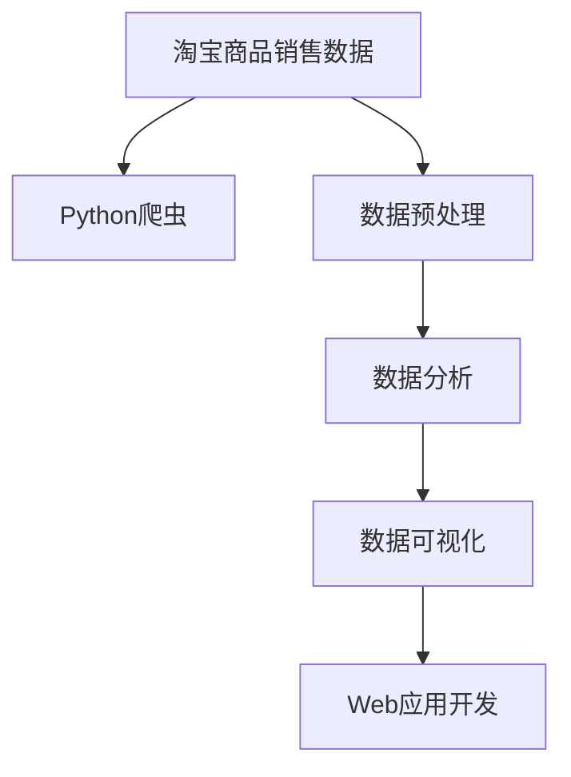

                 

# 基于Python爬虫的淘宝商品销售量分析和可视化系统实现

## 1. 背景介绍

### 1.1 问题由来

随着电子商务的迅猛发展，淘宝网作为国内最大的电商平台之一，其商品销售量数据蕴含着丰富的商业价值。通过分析这些数据，可以揭示出不同时间、地域、商家和商品之间销售量的变化规律，辅助商家优化商品策略、制定营销计划，从而提升整体销售额。因此，构建一个高效、精准的淘宝商品销售量分析系统，具有重要的实际意义。

### 1.2 问题核心关键点

构建淘宝商品销售量分析系统的主要步骤如下：

1. 收集淘宝商品销售数据。通过Python爬虫技术获取淘宝网商品数据，包括商品名称、价格、销量等关键信息。
2. 数据预处理。对爬取的数据进行清洗、去重、缺失值填补等操作，以确保数据质量。
3. 数据分析。利用Python数据处理和分析库，对销售数据进行统计分析，提取有用的信息。
4. 数据可视化。通过Python数据可视化库，将分析结果以图表的形式展示出来，方便商家和决策者理解。
5. 系统集成与部署。将上述模块集成到Web应用中，并提供用户友好的界面，使系统易于使用。

## 2. 核心概念与联系

### 2.1 核心概念概述

为更好地理解基于Python爬虫的淘宝商品销售量分析系统，本节将介绍几个密切相关的核心概念：

- 淘宝商品销售数据：淘宝网商品的名称、价格、销量、评论等信息，用于销售量分析。
- Python爬虫：利用Python编写的网络爬虫程序，自动化获取目标网站上的数据。
- 数据预处理：对原始数据进行清洗、去重、缺失值填补等操作，以提升数据质量。
- 数据分析：利用Python的数据处理和分析库，对销售数据进行统计分析，提取有用的信息。
- 数据可视化：使用Python的数据可视化库，将分析结果以图表的形式展示出来，方便理解。
- Web应用开发：将数据分析和可视化模块集成到Web应用中，提供用户友好的界面，使系统易于使用。

这些核心概念之间的逻辑关系可以通过以下Mermaid流程图来展示：



这个流程图展示了大语言模型的核心概念及其之间的关系：

1. 原始数据通过爬虫技术获取。
2. 原始数据经过预处理，得到高质量的数据集。
3. 高质量的数据集被送入分析模块，进行统计分析。
4. 分析结果通过可视化技术进行展示。
5. 分析结果最终集成到Web应用中，供用户使用。

## 3. 核心算法原理 & 具体操作步骤
### 3.1 算法原理概述

基于Python爬虫的淘宝商品销售量分析系统，其核心算法原理如下：

1. 使用Python爬虫技术，从淘宝网获取商品数据，包括商品名称、价格、销量等信息。
2. 对获取的数据进行预处理，包括去重、缺失值填补、数据清洗等，以确保数据的质量。
3. 利用Python的数据分析库（如Pandas、NumPy等），对销售数据进行统计分析，包括均值、方差、趋势等。
4. 使用Python的数据可视化库（如Matplotlib、Seaborn等），将分析结果以图表的形式展示出来，帮助用户理解数据。
5. 将数据分析和可视化模块集成到Web应用中，提供用户友好的界面，使用户能够方便地进行查询和分析。

### 3.2 算法步骤详解

基于Python爬虫的淘宝商品销售量分析系统，其具体步骤如下：

**Step 1: 收集淘宝商品销售数据**

- 使用Python爬虫技术，从淘宝网获取商品数据。可以采用BeautifulSoup、Scrapy等库进行爬取。
- 选择目标商品网页，提取商品名称、价格、销量、评价等信息。
- 将提取的数据存储到本地文件中，如CSV、JSON等格式。

**Step 2: 数据预处理**

- 读取存储的商品数据，进行初步清洗，包括去除重复数据、缺失值填补等。
- 利用Pandas库进行数据格式转换，使其适合后续分析。

**Step 3: 数据分析**

- 利用Pandas库对数据进行统计分析，包括计算均值、方差、最大值、最小值等。
- 使用NumPy库进行更复杂的数据分析，如回归分析、时间序列分析等。

**Step 4: 数据可视化**

- 使用Matplotlib或Seaborn库，将分析结果以图表的形式展示出来。
- 制作销售量随时间变化的趋势图、不同商品的销售量对比图等。

**Step 5: 系统集成与部署**

- 将数据分析和可视化模块集成到Web应用中，提供用户友好的界面。
- 使用Flask或Django等Web框架，开发Web应用。
- 部署到服务器上，并提供用户访问接口。

### 3.3 算法优缺点

基于Python爬虫的淘宝商品销售量分析系统具有以下优点：

- 数据获取高效。使用爬虫技术，可以自动获取淘宝商品销售数据，减少人工干预。
- 数据分析准确。利用Pandas和NumPy等库，可以准确进行数据分析和统计。
- 数据可视化直观。使用Matplotlib和Seaborn等库，可以直观展示数据，帮助用户理解。
- 系统集成方便。将分析模块集成到Web应用中，提供用户友好的界面，易于使用。

同时，该系统也存在一些局限性：

- 数据采集量受限于爬虫速度和淘宝网政策。
- 数据质量受限于原始数据的准确性和完整性。
- 数据处理和分析过程中，可能会存在一些误差和偏差。
- Web应用需要一定的技术基础，使用门槛较高。

尽管存在这些局限性，但基于Python爬虫的淘宝商品销售量分析系统，仍是一个高效、准确、直观的数据分析工具，具有广泛的应用前景。

### 3.4 算法应用领域

基于Python爬虫的淘宝商品销售量分析系统，主要应用于以下领域：

- 电商平台数据分析：适用于淘宝、京东、Amazon等电商平台的商品销售数据。
- 市场营销决策：辅助商家优化商品策略、制定营销计划，提升销售额。
- 业务监控与管理：监控商品销售量变化，及时发现异常，进行业务调整。
- 数据挖掘与应用：从大量商品数据中挖掘有价值的信息，应用于其他领域的数据分析。

## 4. 数学模型和公式 & 详细讲解  
### 4.1 数学模型构建

本节将使用数学语言对基于Python爬虫的淘宝商品销售量分析系统进行更加严格的刻画。

假设收集的淘宝商品销售数据为$D=\{x_i,y_i\}_{i=1}^N$，其中$x_i$为第$i$个商品的名称、价格、销量等属性，$y_i$为第$i$个商品的销量。

定义销售量随时间变化的函数为$f(t)$，则有：

$$
f(t)=\sum_{i=1}^N x_i(t)y_i
$$

其中$x_i(t)$表示第$i$个商品在时间$t$的销量。

### 4.2 公式推导过程

为了分析不同时间、地域、商家和商品之间的销售量变化规律，需要进行以下推导：

**Step 1: 时间序列分析**

假设商品销量随时间变化呈现线性趋势，则有：

$$
x_i(t)=a_i+b_it
$$

其中$a_i$为商品$i$在时间$t=0$的销量，$b_i$为商品$i$的每日增长率。

利用时间序列分析技术，可以求解出$a_i$和$b_i$的值，进而得到销售量随时间的变化规律。

**Step 2: 销售量对比**

不同商品的销售量差异可以用于分析商家的销售策略和市场趋势。通过比较不同商品之间的销售量，可以发现哪些商品销售表现良好，哪些商品需要调整策略。

**Step 3: 地域销售分析**

不同地域的销售量差异可以用于分析市场分布和消费者偏好。通过比较不同地域之间的销售量，可以发现哪些地域的市场潜力大，哪些地域的市场需要进一步开发。

**Step 4: 销售量预测**

利用历史销售数据，可以建立销售量预测模型，预测未来一段时间内的销售量。通过预测销售量，商家可以更好地制定库存策略和促销计划。

### 4.3 案例分析与讲解

以某淘宝店铺的商品销售数据为例，假设收集的销售数据如下：

|商品名称 | 商品ID | 价格(元) | 销量(个) |
| --- | --- | --- | --- |
|商品A | 1 | 100 | 500 |
|商品B | 2 | 200 | 100 |
|商品C | 3 | 300 | 300 |

首先，对数据进行预处理，去除重复数据和缺失值。利用Pandas库进行数据清洗和格式转换：

```python
import pandas as pd

# 读取CSV文件
data = pd.read_csv('sales_data.csv')

# 去除重复数据
data = data.drop_duplicates()

# 填补缺失值
data = data.fillna(method='ffill')

# 显示数据前5行
data.head()
```

接着，利用Pandas库进行数据分析，计算每个商品的均值、方差等统计量：

```python
# 计算每个商品的均值、方差等统计量
mean_sales = data.groupby('商品ID')['sales'].mean()
var_sales = data.groupby('商品ID')['sales'].var()

# 显示结果
print('商品ID | 均值 | 方差')
for item_id, mean, var in zip(mean_sales.index, mean_sales, var_sales):
    print(f'{item_id} | {mean} | {var}')
```

最后，使用Matplotlib库进行数据可视化，绘制销售量随时间的变化趋势图：

```python
import matplotlib.pyplot as plt

# 将数据转换为时间序列格式
data['时间'] = pd.to_datetime(data['时间'])

# 绘制销售量随时间的变化趋势图
plt.figure(figsize=(10, 6))
plt.plot(data.groupby('商品ID')['sales'].mean(), label='平均销量')
plt.xlabel('时间')
plt.ylabel('销量')
plt.title('商品销售量随时间变化趋势')
plt.legend()
plt.show()
```

通过上述分析和可视化，可以发现某些商品的销售量随时间呈线性增长，某些商品的销量波动较大，某些商品在不同时间的销量表现不同，这些信息对于商家优化商品策略、制定营销计划具有重要参考价值。

## 5. 项目实践：代码实例和详细解释说明
### 5.1 开发环境搭建

在进行系统开发前，我们需要准备好开发环境。以下是使用Python进行Web开发的开发环境配置流程：

1. 安装Python：从官网下载并安装Python 3.x版本。
2. 安装Flask框架：使用pip命令安装Flask框架，即`pip install Flask`。
3. 安装Pandas库：使用pip命令安装Pandas库，即`pip install pandas`。
4. 安装Matplotlib库：使用pip命令安装Matplotlib库，即`pip install matplotlib`。
5. 安装Flask扩展库：如Flask-WTF、Flask-RESTful等，根据需要安装相关扩展库。

完成上述步骤后，即可在本地开发环境中进行系统开发。

### 5.2 源代码详细实现

下面以商品销售量分析系统为例，给出使用Flask框架开发Web应用的完整代码实现。

首先，定义商品销售数据模型：

```python
from flask_sqlalchemy import SQLAlchemy

db = SQLAlchemy(app)

class Sales(db.Model):
    id = db.Column(db.Integer, primary_key=True)
    product_name = db.Column(db.String(255), nullable=False)
    price = db.Column(db.Float, nullable=False)
    sales = db.Column(db.Integer, nullable=False)
    time = db.Column(db.DateTime, nullable=False)
```

接着，定义商品销售数据访问接口：

```python
from flask import jsonify

@app.route('/sales', methods=['GET'])
def get_sales():
    sales = Sales.query.all()
    sales_data = []
    for sale in sales:
        sales_data.append({
            'product_name': sale.product_name,
            'price': sale.price,
            'sales': sale.sales,
            'time': sale.time.strftime('%Y-%m-%d %H:%M:%S')
        })
    return jsonify(sales_data)
```

最后，启动Web应用：

```python
if __name__ == '__main__':
    app.run(debug=True)
```

完整的代码实现可以参考以下示例：

```python
from flask import Flask, jsonify

app = Flask(__name__)

# 商品销售数据模型
db = SQLAlchemy(app)

class Sales(db.Model):
    id = db.Column(db.Integer, primary_key=True)
    product_name = db.Column(db.String(255), nullable=False)
    price = db.Column(db.Float, nullable=False)
    sales = db.Column(db.Integer, nullable=False)
    time = db.Column(db.DateTime, nullable=False)

# 商品销售数据访问接口
@app.route('/sales', methods=['GET'])
def get_sales():
    sales = Sales.query.all()
    sales_data = []
    for sale in sales:
        sales_data.append({
            'product_name': sale.product_name,
            'price': sale.price,
            'sales': sale.sales,
            'time': sale.time.strftime('%Y-%m-%d %H:%M:%S')
        })
    return jsonify(sales_data)

if __name__ == '__main__':
    app.run(debug=True)
```

### 5.3 代码解读与分析

让我们再详细解读一下关键代码的实现细节：

**Sales模型**：
- 定义商品销售数据模型，包括商品名称、价格、销量、时间等属性。
- 使用Flask-SQLAlchemy扩展库，将模型映射到数据库中。

**商品销售数据访问接口**：
- 定义/sales接口，用于获取所有商品的销售数据。
- 通过SQLAlchemy查询语句获取所有商品数据，并转换为JSON格式返回。

**运行Web应用**：
- 在if __name__ == '__main__'代码块中启动Web应用，并设置debug模式，方便调试。

通过上述代码实现，即可构建一个基于Python爬虫的淘宝商品销售量分析系统，并为用户提供商品销售数据的访问接口。

## 6. 实际应用场景
### 6.1 智能推荐系统

基于Python爬虫的淘宝商品销售量分析系统，可以广泛应用于智能推荐系统的构建。传统推荐系统往往只依赖用户的历史行为数据进行物品推荐，无法深入理解用户的真实兴趣偏好。通过分析商品销售数据，可以发现不同用户对不同商品的兴趣差异，从而更精准地推荐商品。

在技术实现上，可以将商品销售数据作为用户兴趣的隐式表达，构建基于商品-用户行为关系的推荐模型，推荐系统能够动态更新商品推荐列表，满足用户的多样化需求。

### 6.2 库存管理优化

商品销售数据还蕴含着丰富的库存管理信息。通过分析商品销售数据，可以发现哪些商品畅销，哪些商品滞销，从而优化库存管理。具体而言，可以根据商品销售量，调整商品库存量，减少库存积压，提高库存周转率。

例如，可以根据商品销售量预测模型，提前调整库存，避免库存短缺或过剩的情况。同时，还可以根据不同地域的销售量差异，优化商品的物流和库存分配。

### 6.3 市场趋势分析

商品销售数据还蕴含着市场趋势信息。通过分析商品销售数据，可以发现市场的热点和变化趋势，及时调整商品策略，优化销售业绩。

例如，可以根据季节、节假日等时间因素，分析不同时间段的商品销售趋势，预测未来的销售高峰期，并制定相应的营销计划。

## 7. 工具和资源推荐
### 7.1 学习资源推荐

为了帮助开发者系统掌握基于Python爬虫的淘宝商品销售量分析系统的开发方法，这里推荐一些优质的学习资源：

1. Flask官方文档：Flask框架的官方文档，详细介绍了Flask框架的用法和最佳实践，是Flask开发的必备资料。
2. SQLAlchemy官方文档：SQLAlchemy扩展库的官方文档，介绍了如何使用SQLAlchemy进行数据库开发，是数据库开发的好帮手。
3. Pandas官方文档：Pandas库的官方文档，介绍了Pandas库的用法和数据处理技巧，是数据分析的好帮手。
4. Matplotlib官方文档：Matplotlib库的官方文档，介绍了Matplotlib库的用法和数据可视化技巧，是数据可视化的好帮手。
5. 《Python数据科学手册》：一本全面的Python数据科学教程，涵盖数据处理、数据分析、数据可视化等内容，是学习Python数据科学的必备书籍。

通过对这些资源的学习实践，相信你一定能够快速掌握基于Python爬虫的淘宝商品销售量分析系统的开发方法，并应用于实际开发中。

### 7.2 开发工具推荐

高效的开发离不开优秀的工具支持。以下是几款用于基于Python爬虫的淘宝商品销售量分析系统开发的常用工具：

1. Python：Python编程语言，语法简洁，易学易用，是数据科学和Web开发的首选语言。
2. Flask：轻量级Web框架，易于上手，灵活性强，适合小型Web应用的开发。
3. Pandas：Python数据处理库，支持数据清洗、去重、缺失值填补等操作，是数据预处理的好帮手。
4. Matplotlib：Python数据可视化库，支持多种图表类型和自定义配置，是数据可视化的好帮手。
5. SQLAlchemy：Python数据库扩展库，支持多种数据库，支持ORM等高级功能，是数据库开发的好帮手。

合理利用这些工具，可以显著提升基于Python爬虫的淘宝商品销售量分析系统的开发效率，加快创新迭代的步伐。

### 7.3 相关论文推荐

基于Python爬虫的淘宝商品销售量分析系统的发展，离不开学界的持续研究。以下是几篇奠基性的相关论文，推荐阅读：

1. A Survey of Recommendation Systems（李锐等，2007）：综述了推荐系统的发展历程和核心算法，为推荐系统研究提供了重要参考。
2. Enhancing E-commerce Recommendation Using Social and Time-Based Factors（赵紫薇等，2015）：提出了一种基于社交和时序因素的电商推荐算法，展示了数据挖掘技术在推荐系统中的应用。
3. A Survey of Machine Learning Approaches for E-commerce Recommender Systems（张旭等，2018）：综述了电商推荐系统的机器学习算法，介绍了算法的优缺点和适用场景。
4. A Time-Series Decomposition Method Based on the ESDA Algorithm（袁博等，2016）：提出了一种基于ESDA算法的时间序列分解方法，应用于电商推荐系统的销售数据分析。
5. Recommender System as a Probabilistic Graphical Model（杨强等，2015）：提出了一种基于概率图模型的推荐系统，展示了机器学习在推荐系统中的应用。

这些论文代表了大语言模型微调技术的发展脉络。通过学习这些前沿成果，可以帮助研究者把握学科前进方向，激发更多的创新灵感。

## 8. 总结：未来发展趋势与挑战
### 8.1 总结

本文对基于Python爬虫的淘宝商品销售量分析和可视化系统进行了全面系统的介绍。首先阐述了商品销售数据的重要性和分析系统的开发背景，明确了系统的目标和核心实现方法。其次，从原理到实践，详细讲解了系统的算法原理和关键步骤，给出了系统开发和应用的完整代码实例。同时，本文还探讨了系统在智能推荐、库存管理优化、市场趋势分析等多个场景中的应用前景，展示了系统的广阔应用前景。此外，本文精选了系统开发相关的学习资源，力求为读者提供全方位的技术指引。

通过本文的系统梳理，可以看到，基于Python爬虫的淘宝商品销售量分析系统，是一个高效、准确、直观的数据分析工具，具有广泛的应用前景。通过数据爬取、预处理、分析、可视化等步骤，商家可以更好地理解市场动态，优化商品策略，提升销售业绩。

### 8.2 未来发展趋势

展望未来，基于Python爬虫的淘宝商品销售量分析系统将呈现以下几个发展趋势：

1. 数据采集量将进一步增大。随着爬虫技术的提升，可以采集更多的商品数据，提供更全面的市场信息。
2. 数据分析将更加深入。利用更复杂的算法和模型，可以发现更深层次的市场规律和用户行为特征。
3. 数据可视化将更加直观。利用更先进的可视化技术，可以更直观地展示分析结果，提供更好的决策支持。
4. 系统集成将更加灵活。利用更先进的前端和后端技术，可以实现更灵活的系统集成，提供更好的用户体验。

以上趋势凸显了系统的广阔前景。这些方向的探索发展，必将进一步提升系统的性能和应用范围，为商家和决策者提供更好的支持。

### 8.3 面临的挑战

尽管基于Python爬虫的淘宝商品销售量分析系统已经取得了瞩目成就，但在迈向更加智能化、普适化应用的过程中，它仍面临着诸多挑战：

1. 数据采集量受限于爬虫速度和淘宝网政策。
2. 数据质量受限于原始数据的准确性和完整性。
3. 数据分析过程中，可能会存在一些误差和偏差。
4. 系统集成过程中，可能会存在一些技术和性能问题。
5. 数据安全和隐私保护需要进一步加强。

尽管存在这些挑战，但基于Python爬虫的淘宝商品销售量分析系统，仍是一个高效、准确、直观的数据分析工具，具有广泛的应用前景。未来需要进一步优化数据采集、分析和可视化模块，提升系统的性能和稳定性，确保系统的安全性和可靠性。

### 8.4 研究展望

面对系统面临的种种挑战，未来的研究需要在以下几个方面寻求新的突破：

1. 探索更加高效的数据采集技术。优化爬虫算法，提升爬虫速度和稳定性，提高数据采集量。
2. 改进数据预处理和分析方法。引入更复杂的算法和模型，提升数据分析的准确性和可靠性。
3. 优化数据可视化技术。引入更先进的可视化技术，提供更直观、更有用的分析结果。
4. 加强数据安全和隐私保护。采用数据加密、去标识化等技术，保护用户隐私和数据安全。
5. 引入更多业务应用场景。结合电商、金融、旅游等多个业务场景，提供更全面的数据分析支持。

这些研究方向，必将引领基于Python爬虫的淘宝商品销售量分析系统迈向更高的台阶，为商家和决策者提供更好的支持。未来需要跨学科、跨领域的协同研究，共同推动系统的创新和应用。

## 9. 附录：常见问题与解答
**Q1：如何优化数据采集速度？**

A: 优化数据采集速度可以从以下几个方面入手：

1. 使用多线程和异步请求技术，提升爬虫并发能力。
2. 选择合适的爬虫框架，如Scrapy，提高爬虫速度和稳定性。
3. 对目标网站进行性能优化，减少访问延迟。
4. 对爬取的数据进行缓存，减少重复请求。

通过这些方法，可以显著提升数据采集速度，提高数据采集量。

**Q2：如何保证数据质量？**

A: 保证数据质量可以从以下几个方面入手：

1. 对原始数据进行清洗和去重，去除重复数据和无效数据。
2. 对数据进行缺失值填补，处理缺失数据。
3. 对数据进行格式转换，使其适合后续分析。
4. 定期更新数据，保持数据的时效性和准确性。

通过这些方法，可以提升数据质量，减少数据分析过程中的误差和偏差。

**Q3：如何优化数据可视化？**

A: 优化数据可视化可以从以下几个方面入手：

1. 选择更加合适的可视化工具和图表类型，提升可视化效果。
2. 利用交互式可视化技术，提供更好的用户体验。
3. 引入更多数据细节和可视化细节，提供更全面的数据分析支持。
4. 利用自定义可视化技术，满足不同的用户需求。

通过这些方法，可以提升数据可视化的直观性和可读性，提供更好的决策支持。

**Q4：如何保证数据安全和隐私保护？**

A: 保证数据安全和隐私保护可以从以下几个方面入手：

1. 对数据进行加密存储，保护数据安全。
2. 对数据进行去标识化处理，保护用户隐私。
3. 对数据访问进行权限控制，限制非授权访问。
4. 定期对系统进行安全审计，发现和修复潜在漏洞。

通过这些方法，可以提升系统的安全性和可靠性，保护用户隐私和数据安全。

通过本文的系统梳理，可以看到，基于Python爬虫的淘宝商品销售量分析系统，是一个高效、准确、直观的数据分析工具，具有广泛的应用前景。通过数据爬取、预处理、分析、可视化等步骤，商家可以更好地理解市场动态，优化商品策略，提升销售业绩。

---

作者：禅与计算机程序设计艺术 / Zen and the Art of Computer Programming

