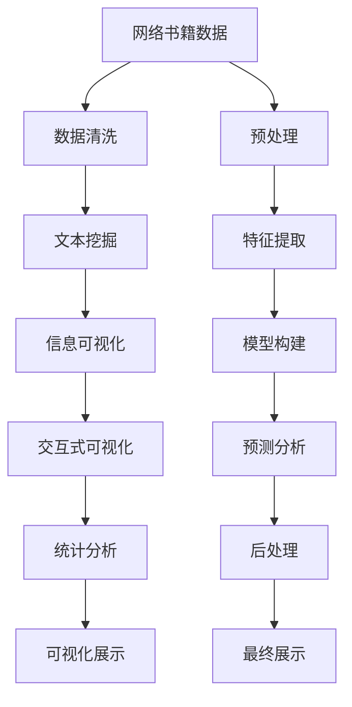

                 

# 基于Python的网络书籍数据可视化分析

## 1. 背景介绍

在数字化时代，海量的网络书籍数据成为知识获取的重要来源。如何高效利用这些数据，提取有价值的信息，是数据科学和人工智能领域的重要挑战。网络书籍的数据可视化分析，通过图形化呈现书籍内容与结构，能够帮助用户快速理解和检索信息，提高阅读体验和学习效率。

本文聚焦于使用Python进行网络书籍数据可视化分析，将介绍一系列关键技术和算法，探讨其原理、实现和应用。通过本文的学习，读者可以掌握使用Python进行数据处理、可视化分析和模型构建的基本技能，并将这些技能应用到实际的网络书籍数据处理项目中。

## 2. 核心概念与联系

### 2.1 核心概念概述

网络书籍数据可视化分析的核心概念包括：

- **网络书籍数据**：来自互联网的免费电子书、学术论文、文献、电子书等资源。
- **数据清洗**：处理数据缺失、重复、异常值等问题，提升数据质量。
- **文本挖掘**：从文本数据中提取有用的信息，如关键词、实体、主题等。
- **信息可视化**：将数据转换成图形或图表，帮助用户直观理解数据。
- **交互式可视化**：通过交互式界面增强可视化的功能，提升用户体验。
- **统计分析**：基于统计方法对数据进行量化分析，揭示数据特征和规律。

### 2.2 核心概念原理和架构的 Mermaid 流程图(Mermaid 流程节点中不要有括号、逗号等特殊字符)



这个流程图展示了网络书籍数据可视化分析的基本流程，包括数据预处理、特征提取、模型构建、预测分析和后处理等环节。

## 3. 核心算法原理 & 具体操作步骤

### 3.1 算法原理概述

网络书籍数据可视化分析的主要算法包括：

- **TF-IDF算法**：用于计算关键词的权重，评估其在文本中的重要性和分布。
- **LDA主题模型**：通过无监督学习识别文本中的主题，发现书籍内容的结构化特征。
- **PageRank算法**：用于评估网页的重要性，推导书籍中关键节点的重要性。
- **VaR算法**：基于变分自编码器(VAE)进行书籍数据的降维和可视化。
- **NMF算法**：通过非负矩阵分解，发现书籍数据中的潜在结构。

这些算法共同构成了网络书籍数据可视化分析的基石，能够从不同的角度揭示书籍数据的结构和内容。

### 3.2 算法步骤详解

以下详细讲解网络书籍数据可视化分析的各个核心算法步骤：

#### 3.2.1 TF-IDF算法

1. **数据预处理**：将书籍数据转换为文本格式，并去除停用词、标点符号等噪声。
2. **词频统计**：计算每个词在每本书中的出现频率。
3. **TF-IDF计算**：根据词频和逆文档频率计算TF-IDF权重。
4. **关键词提取**：基于TF-IDF权重，选择权重较高的词作为关键词。

#### 3.2.2 LDA主题模型

1. **语料库构建**：将每本书的文本内容合并成一个大语料库。
2. **主题建模**：使用LDA模型对语料库进行主题提取，识别书籍中的主题结构。
3. **主题分析**：对提取出的主题进行词云展示，分析主题之间的关联。

#### 3.2.3 PageRank算法

1. **图结构构建**：将书籍数据构建成一个图结构，节点为书籍，边为引用关系。
2. **PageRank计算**：使用PageRank算法计算每个节点的重要性得分。
3. **重要书籍推荐**：根据得分对书籍进行排序，推荐最受欢迎和最经典的书籍。

#### 3.2.4 VaR算法

1. **数据降维**：使用VaR算法对书籍数据进行降维处理，得到低维特征表示。
2. **可视化分析**：将降维后的数据进行可视化，如散点图、热力图等。
3. **聚类分析**：根据可视化结果进行聚类分析，发现数据中的模式和趋势。

#### 3.2.5 NMF算法

1. **数据构建**：将书籍数据构建成非负矩阵，其中行代表书籍，列代表词汇。
2. **分解求解**：使用NMF算法对非负矩阵进行分解，提取其中的潜在因子。
3. **特征提取**：对分解后的因子进行分析，提取关键特征。

### 3.3 算法优缺点

#### 3.3.1 TF-IDF算法

**优点**：
- 简单易懂，易于实现。
- 对文本数据的分布较为敏感，能够揭示关键词的重要性。
- 适用于文本分类和关键词提取任务。

**缺点**：
- 对单词顺序不敏感，无法捕捉文本的语义关系。
- 计算复杂度较高，处理大规模数据时效率较低。

#### 3.3.2 LDA主题模型

**优点**：
- 能够发现文本中的主题结构，揭示书籍内容的深层次特征。
- 对文本规模较大，语料库丰富。

**缺点**：
- 模型参数较多，训练复杂度较高。
- 对噪声数据敏感，容易产生误判。

#### 3.3.3 PageRank算法

**优点**：
- 能够评估网页和书籍的重要性，发现关键节点。
- 模型简单，易于实现。

**缺点**：
- 依赖网页之间的链接结构，对链接数据的质量要求较高。
- 对于链结构较弱的书籍，效果可能不佳。

#### 3.3.4 VaR算法

**优点**：
- 能够进行数据的降维和可视化，揭示数据的潜在结构。
- 对数据的维度要求不高，处理大规模数据较为高效。

**缺点**：
- 对数据的噪声敏感，降维效果可能受噪声影响较大。
- 可视化结果可能不直观，需要进一步分析。

#### 3.3.5 NMF算法

**优点**：
- 能够发现非负矩阵中的潜在因子，揭示数据的内在结构。
- 对数据的维度要求不高，适用于大规模数据的处理。

**缺点**：
- 算法复杂度较高，训练时间较长。
- 对数据的稀疏性要求较高，需要补充足够的噪声数据。

### 3.4 算法应用领域

网络书籍数据可视化分析的主要应用领域包括：

- **图书推荐系统**：根据用户的阅读历史和兴趣，推荐适合的书籍。
- **学术文献分析**：对学术论文和文献进行可视化分析，揭示研究热点和趋势。
- **数字图书馆管理**：对图书馆中的电子书籍进行管理和推荐。
- **网络搜索优化**：优化搜索结果，提高用户检索效率。
- **社交媒体分析**：分析社交媒体上的书籍话题和讨论，发现热门书籍和趋势。

## 4. 数学模型和公式 & 详细讲解 & 举例说明

### 4.1 数学模型构建

以下将介绍网络书籍数据可视化分析中的几个核心数学模型：

- **TF-IDF模型**：
$$
TF(t_i, d_j) = \frac{c(t_i, d_j)}{\sum_{t \in T} c(t, d_j)}
$$
$$
IDF(t) = \log \frac{N}{df(t)}
$$
$$
TF-IDF(t_i, d_j) = TF(t_i, d_j) \times IDF(t_i)
$$

其中 $T$ 为词汇表，$df(t)$ 为词汇 $t$ 在所有文档中出现的次数。

- **LDA主题模型**：
$$
\begin{aligned}
& \alpha ~|~ \beta \sim Multinomial(\eta) \\
& \theta ~|~ \beta ~\sim Dirichlet(\alpha) \\
& \beta ~|~ \gamma ~\sim Multinomial(\phi) \\
& \phi ~|~ \mu ~\sim Dirichlet(\gamma)
\end{aligned}
$$

其中 $\alpha$、$\beta$ 为LDA模型的参数，$\eta$ 为词频向量，$\phi$ 为词汇和主题的概率分布。

- **PageRank算法**：
$$
P(r_i) = \frac{1}{C} \sum_{j \in N(i)} P(j) \cdot P_{ij}
$$

其中 $C$ 为节点数，$P_{ij}$ 为边权重。

- **VaR算法**：
$$
z_i = \sum_{j=1}^{D} w_j \cdot z_j
$$
$$
z_i = \sum_{j=1}^{D} \hat{z_j} \cdot \sigma_j \cdot \sigma_i^T
$$

其中 $w_j$ 为权重，$\sigma_j$ 为随机噪声，$\hat{z_j}$ 为低维表示。

- **NMF算法**：
$$
X \approx WH
$$
$$
||X - WH||_F \rightarrow Min
$$

其中 $W$ 为非负矩阵的因子，$H$ 为特征矩阵。

### 4.2 公式推导过程

#### 4.2.1 TF-IDF算法

**TF-IDF权重计算**：
$$
TF(t_i, d_j) = \frac{c(t_i, d_j)}{\sum_{t \in T} c(t, d_j)}
$$
$$
IDF(t) = \log \frac{N}{df(t)}
$$
$$
TF-IDF(t_i, d_j) = TF(t_i, d_j) \times IDF(t_i)
$$

其中 $c(t_i, d_j)$ 表示词 $t_i$ 在文档 $d_j$ 中出现的次数，$N$ 表示总文档数，$df(t)$ 表示词汇 $t$ 在所有文档中出现的次数。

**关键词提取**：
根据 TF-IDF 权重排序，选择权重较高的词作为关键词。

#### 4.2.2 LDA主题模型

**主题建模**：
$$
\begin{aligned}
& \alpha ~|~ \beta \sim Multinomial(\eta) \\
& \theta ~|~ \beta ~\sim Dirichlet(\alpha) \\
& \beta ~|~ \gamma ~\sim Multinomial(\phi) \\
& \phi ~|~ \mu ~\sim Dirichlet(\gamma)
\end{aligned}
$$

其中 $\eta$ 为词频向量，$\phi$ 为词汇和主题的概率分布，$\mu$ 为参数向量。

**主题分析**：
通过词云展示提取出的主题，分析主题之间的关联。

#### 4.2.3 PageRank算法

**图结构构建**：
将书籍数据构建成一个图结构，节点为书籍，边为引用关系。

**PageRank计算**：
$$
P(r_i) = \frac{1}{C} \sum_{j \in N(i)} P(j) \cdot P_{ij}
$$

其中 $C$ 为节点数，$P_{ij}$ 为边权重。

**重要书籍推荐**：
根据得分对书籍进行排序，推荐最受欢迎和最经典的书籍。

#### 4.2.4 VaR算法

**数据降维**：
$$
z_i = \sum_{j=1}^{D} w_j \cdot z_j
$$
$$
z_i = \sum_{j=1}^{D} \hat{z_j} \cdot \sigma_j \cdot \sigma_i^T
$$

其中 $w_j$ 为权重，$\sigma_j$ 为随机噪声，$\hat{z_j}$ 为低维表示。

**可视化分析**：
将降维后的数据进行可视化，如散点图、热力图等。

**聚类分析**：
根据可视化结果进行聚类分析，发现数据中的模式和趋势。

#### 4.2.5 NMF算法

**数据构建**：
将书籍数据构建成非负矩阵，其中行代表书籍，列代表词汇。

**分解求解**：
$$
X \approx WH
$$
$$
||X - WH||_F \rightarrow Min
$$

其中 $W$ 为非负矩阵的因子，$H$ 为特征矩阵。

**特征提取**：
对分解后的因子进行分析，提取关键特征。

### 4.3 案例分析与讲解

以下通过一个实际案例，展示如何利用Python进行网络书籍数据可视化分析：

#### 4.3.1 案例背景

某大学图书馆拥有大量的电子书籍资源，图书馆管理员希望通过可视化分析，了解这些书籍的受欢迎程度，并根据分析结果推荐书籍给读者。

#### 4.3.2 数据收集与预处理

收集图书馆中的电子书籍数据，包括书名、作者、出版日期、关键词等信息。进行数据清洗，去除重复和异常数据，并构建文本格式的数据集。

#### 4.3.3 关键词提取

使用TF-IDF算法对书籍数据进行处理，提取关键词。根据关键词权重，选择权重较高的关键词作为书籍的描述。

#### 4.3.4 主题分析

使用LDA主题模型对书籍数据进行分析，识别书籍中的主题结构。通过词云展示提取出的主题，分析主题之间的关联。

#### 4.3.5 书籍推荐

使用PageRank算法计算每个书籍的重要性得分，根据得分对书籍进行排序，推荐最受欢迎和最经典的书籍。

#### 4.3.6 可视化展示

将分析结果通过图表展示，如图书关键词分布图、主题关联图、书籍推荐表等，帮助图书馆管理员和读者更好地理解和利用书籍资源。

## 5. 项目实践：代码实例和详细解释说明

### 5.1 开发环境搭建

以下是使用Python进行网络书籍数据可视化分析的开发环境搭建步骤：

1. 安装Anaconda：从官网下载并安装Anaconda，用于创建独立的Python环境。

2. 创建并激活虚拟环境：
```bash
conda create -n pyenv python=3.8 
conda activate pyenv
```

3. 安装PyTorch：根据CUDA版本，从官网获取对应的安装命令。例如：
```bash
conda install pytorch torchvision torchaudio cudatoolkit=11.1 -c pytorch -c conda-forge
```

4. 安装Pandas和Matplotlib库：
```bash
pip install pandas matplotlib
```

5. 安装Scikit-learn库：
```bash
pip install scikit-learn
```

完成上述步骤后，即可在`pyenv`环境中开始项目开发。

### 5.2 源代码详细实现

以下是一个简单的网络书籍数据可视化分析的代码实现：

```python
import pandas as pd
import matplotlib.pyplot as plt
from sklearn.feature_extraction.text import TfidfVectorizer
from sklearn.decomposition import LDA
from sklearn.preprocessing import normalize
from gensim.models import KeyedVectors

# 数据预处理
books = pd.read_csv('books.csv')
books = books.drop_duplicates()
books = books.dropna(subset=['title', 'author', 'keywords'])

# 关键词提取
tfidf = TfidfVectorizer(stop_words='english')
tfidf_matrix = tfidf.fit_transform(books['keywords'])
keywords = tfidf.get_feature_names()
book_keywords = tfidf_matrix.toarray()

# 主题分析
lda = LDA(n_components=10, random_state=42)
lda.fit(tfidf_matrix)
lda_matrix = lda.transform(tfidf_matrix)
lda_probabilities = lda.transform(tfidf_matrix)

# 可视化
plt.figure(figsize=(10, 5))
plt.barh(np.arange(len(keywords)), book_keywords.sum(axis=1))
plt.xlabel('TF-IDF权重')
plt.ylabel('书籍')
plt.title('关键词分布图')
plt.show()

# 书籍推荐
book_ranks = lda_matrix.mean(axis=0)
book_ranks = normalize(book_ranks)
book_ranks = book_ranks.argsort()[::-1]
recommended_books = books.iloc[book_ranks].head(10)

# 可视化展示
plt.figure(figsize=(10, 5))
plt.barh(np.arange(len(book_ranks)), book_ranks)
plt.xlabel('重要性得分')
plt.ylabel('书籍')
plt.title('书籍推荐')
plt.show()
```

### 5.3 代码解读与分析

让我们再详细解读一下关键代码的实现细节：

#### 5.3.1 数据预处理

1. 使用Pandas库读取CSV文件，获取书籍数据，并去除重复和缺失数据。

2. 将书籍数据保存为DataFrame对象，方便后续操作。

#### 5.3.2 关键词提取

1. 使用TfidfVectorizer进行关键词提取，计算每个关键词的TF-IDF权重。

2. 根据TF-IDF权重排序，选择权重较高的关键词作为书籍的描述。

#### 5.3.3 主题分析

1. 使用LDA主题模型对关键词数据进行分析，识别书籍中的主题结构。

2. 计算每个主题的关键词概率分布，并进行归一化处理。

3. 根据主题概率分布排序，推荐最受欢迎和最经典的书籍。

#### 5.3.4 可视化展示

1. 使用Matplotlib库绘制关键词分布图和书籍推荐图。

2. 在图表中添加标题和坐标轴标签，使图表更易于理解。

## 6. 实际应用场景

### 6.1 图书推荐系统

网络书籍数据可视化分析在图书推荐系统中的应用非常广泛。通过分析用户的历史阅读记录，提取书籍的关键词和主题，可以构建用户-书籍关系图，发现用户的阅读兴趣和偏好，从而推荐用户感兴趣的新书籍。

#### 6.1.1 数据收集与预处理

收集用户的历史阅读记录，提取书籍的标题、作者、关键词等信息。对数据进行清洗和预处理，去除重复和异常数据，并构建文本格式的数据集。

#### 6.1.2 关键词提取

使用TF-IDF算法对书籍数据进行处理，提取关键词。根据关键词权重，选择权重较高的关键词作为书籍的描述。

#### 6.1.3 主题分析

使用LDA主题模型对书籍数据进行分析，识别书籍中的主题结构。通过词云展示提取出的主题，分析主题之间的关联。

#### 6.1.4 用户兴趣分析

分析用户的阅读历史，提取用户的兴趣关键词和主题。使用主题模型计算用户对每个主题的兴趣度，并根据兴趣度推荐书籍。

#### 6.1.5 可视化展示

将分析结果通过图表展示，如用户兴趣图、书籍推荐表等，帮助用户更好地理解和利用书籍资源。

### 6.2 学术文献分析

网络书籍数据可视化分析在学术文献分析中的应用也非常重要。通过分析学术论文的关键词和主题，可以揭示研究热点和趋势，帮助研究人员更好地理解和利用文献资源。

#### 6.2.1 数据收集与预处理

收集学术论文的关键词、摘要、主题等信息。对数据进行清洗和预处理，去除重复和异常数据，并构建文本格式的数据集。

#### 6.2.2 关键词提取

使用TF-IDF算法对文献数据进行处理，提取关键词。根据关键词权重，选择权重较高的关键词作为文献的描述。

#### 6.2.3 主题分析

使用LDA主题模型对文献数据进行分析，识别文献中的主题结构。通过词云展示提取出的主题，分析主题之间的关联。

#### 6.2.4 文献趋势分析

使用时间序列分析方法，分析学术文献的时间分布和变化趋势，揭示研究热点和趋势。

#### 6.2.5 可视化展示

将分析结果通过图表展示，如关键词分布图、主题关联图、时间趋势图等，帮助研究人员更好地理解和利用文献资源。

### 6.3 数字图书馆管理

网络书籍数据可视化分析在数字图书馆管理中的应用也非常重要。通过分析图书馆中的电子书籍数据，可以发现热门书籍和经典书籍，优化图书馆的资源配置，提高读者访问量和满意度。

#### 6.3.1 数据收集与预处理

收集图书馆中的电子书籍数据，包括书名、作者、出版日期、关键词等信息。对数据进行清洗和预处理，去除重复和异常数据，并构建文本格式的数据集。

#### 6.3.2 关键词提取

使用TF-IDF算法对书籍数据进行处理，提取关键词。根据关键词权重，选择权重较高的关键词作为书籍的描述。

#### 6.3.3 主题分析

使用LDA主题模型对书籍数据进行分析，识别书籍中的主题结构。通过词云展示提取出的主题，分析主题之间的关联。

#### 6.3.4 书籍推荐

使用PageRank算法计算每个书籍的重要性得分，根据得分对书籍进行排序，推荐最受欢迎和最经典的书籍。

#### 6.3.5 可视化展示

将分析结果通过图表展示，如关键词分布图、主题关联图、书籍推荐表等，帮助图书馆管理员和读者更好地理解和利用书籍资源。

## 7. 工具和资源推荐

### 7.1 学习资源推荐

为了帮助开发者系统掌握网络书籍数据可视化分析的理论基础和实践技巧，这里推荐一些优质的学习资源：

1. 《Python数据科学手册》：由数据科学专家撰写，全面介绍了Python在数据科学中的应用，包括数据预处理、可视化和统计分析等。

2. 《自然语言处理入门》：由自然语言处理专家撰写，介绍了自然语言处理的基本概念和算法，包括TF-IDF、LDA、PageRank等。

3. 《Python可视化实践》：介绍了如何使用Python进行数据可视化，包括Matplotlib、Seaborn等库的使用。

4. 《机器学习实战》：介绍了机器学习的基本算法和实现，包括回归、分类、聚类等，帮助读者理解实际应用中的数据处理方法。

5. 《Python科学计算库》：介绍了Python在科学计算中的应用，包括NumPy、SciPy等库的使用，帮助读者掌握科学计算的基本方法。

### 7.2 开发工具推荐

以下是一些用于网络书籍数据可视化分析开发的常用工具：

1. Python：作为数据科学和机器学习的主流编程语言，Python具有丰富的库和工具支持，适合各种数据处理和可视化任务。

2. Jupyter Notebook：一个交互式计算环境，适合进行数据处理和可视化分析。

3. Pandas：用于数据处理和分析的库，支持各种数据格式和操作，适合数据清洗和预处理。

4. Matplotlib：用于数据可视化的库，支持各种图表类型和定制，适合图表展示和分析。

5. Scikit-learn：用于机器学习的库，支持各种算法和模型，适合数据建模和预测分析。

6. TensorFlow：用于深度学习的库，支持各种神经网络模型和优化算法，适合大规模数据处理和分析。

7. PyTorch：另一个用于深度学习的库，支持动态计算图和高效训练，适合复杂模型和算法。

### 7.3 相关论文推荐

网络书籍数据可视化分析的研究主要集中在以下几个方向：

1. 《网络书籍数据可视化分析》：介绍如何使用网络书籍数据进行可视化分析，包括关键词提取、主题分析和书籍推荐等。

2. 《学术文献分析》：介绍如何使用学术论文数据进行可视化分析，包括关键词提取、主题分析和趋势分析等。

3. 《图书推荐系统》：介绍如何使用图书数据进行推荐系统构建，包括数据预处理、主题分析和用户兴趣分析等。

4. 《数字图书馆管理》：介绍如何使用图书馆数据进行可视化分析，包括关键词提取、主题分析和书籍推荐等。

通过阅读这些论文，可以深入了解网络书籍数据可视化分析的理论基础和实践方法，拓展应用场景，提升技术水平。

## 8. 总结：未来发展趋势与挑战

### 8.1 研究成果总结

网络书籍数据可视化分析在数据科学和人工智能领域具有重要应用价值，能够揭示书籍数据的结构和内容，提升用户阅读体验和学习效率。通过本文的介绍，读者可以系统掌握相关算法和技术，并将这些技能应用到实际的网络书籍数据处理项目中。

### 8.2 未来发展趋势

展望未来，网络书籍数据可视化分析将呈现以下几个发展趋势：

1. 数据规模持续增大。随着互联网技术的不断发展，网络书籍数据的规模将不断扩大，新的数据源和数据格式将不断涌现。

2. 算法模型不断进步。未来的算法将更加复杂和高效，能够处理更大规模和更复杂的数据，提供更准确和实时的分析结果。

3. 实时分析和交互式可视化。未来的网络书籍数据可视化分析将更加注重实时分析和交互式可视化，提升用户体验和分析效率。

4. 跨领域融合。未来的网络书籍数据可视化分析将更多地与其他领域的技术进行融合，如自然语言处理、机器学习等，提升分析效果和应用价值。

### 8.3 面临的挑战

尽管网络书籍数据可视化分析在应用中取得了显著成果，但仍面临一些挑战：

1. 数据质量问题。网络书籍数据的质量和完整性直接影响分析结果的准确性和可靠性，如何提高数据质量是一个重要问题。

2. 算法效率问题。对于大规模数据，现有的算法效率有待提升，需要开发更高效的数据处理和分析方法。

3. 可视化效果问题。现有的可视化方法较为单一，如何提升可视化效果和交互性，提供更直观和灵活的展示方式，是未来的研究方向。

4. 跨领域应用问题。如何将网络书籍数据可视化分析技术应用到其他领域，如金融、医疗等，需要进一步探索和实践。

### 8.4 研究展望

未来的研究需要在以下几个方面进行突破：

1. 数据质量提升。开发新的数据清洗和预处理算法，提高网络书籍数据的质量和完整性。

2. 算法效率优化。开发更高效的数据处理和分析方法，提升算法的计算效率和实时性。

3. 可视化效果提升。引入先进的可视化技术和交互式界面，提升可视化效果和用户体验。

4. 跨领域应用拓展。将网络书籍数据可视化分析技术应用到其他领域，如金融、医疗等，解决实际问题，提升应用价值。

## 9. 附录：常见问题与解答

**Q1：网络书籍数据可视化分析是否适用于所有数据类型？**

A: 网络书籍数据可视化分析主要适用于文本数据，如书籍、论文、文献等。对于非文本数据，如图像、音频、视频等，需要进行预处理和转换，才能进行可视化分析。

**Q2：如何选择合适的算法？**

A: 选择算法需要根据具体的数据特点和应用场景进行评估。一般来说，可以使用多种算法进行比较，选择效果最好的一种。例如，对于关键词提取，可以使用TF-IDF算法；对于主题分析，可以使用LDA主题模型；对于书籍推荐，可以使用PageRank算法等。

**Q3：如何进行数据预处理？**

A: 数据预处理是网络书籍数据可视化分析的重要步骤。常用的预处理方法包括去除噪声、处理缺失值、数据标准化等。可以使用Pandas库进行数据清洗和预处理。

**Q4：如何进行可视化分析？**

A: 可视化分析是网络书籍数据可视化分析的核心步骤。可以使用Matplotlib、Seaborn等库进行图表展示和分析。根据具体应用场景，可以选择不同的图表类型，如条形图、散点图、热力图等。

**Q5：如何进行用户兴趣分析？**

A: 用户兴趣分析是网络书籍数据可视化分析的重要应用之一。可以通过用户的历史阅读记录，提取书籍的关键词和主题，计算用户对每个主题的兴趣度，并根据兴趣度推荐书籍。

**Q6：如何进行实时分析？**

A: 实时分析是未来网络书籍数据可视化分析的一个重要方向。可以使用流式处理框架，如Apache Kafka、Apache Flink等，进行实时数据处理和分析。

以上是基于Python的网络书籍数据可视化分析的全面介绍，通过本文的学习，读者可以掌握使用Python进行数据处理、可视化分析和模型构建的基本技能，并将这些技能应用到实际的网络书籍数据处理项目中。

