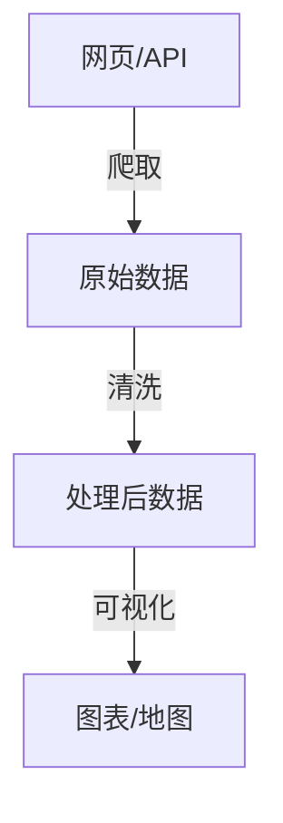

                 

# 基于python的腾讯位置数据爬取及可视化分析

## 1. 背景介绍

### 1.1 问题由来
随着智能手机的普及和移动互联网的发展，位置数据成为了越来越重要的信息资源。位置数据可以用于城市规划、交通分析、旅游推荐等诸多领域，具有广泛的应用价值。腾讯作为国内最大的社交网络公司之一，拥有庞大的用户群体和丰富的位置数据资源。对这些位置数据的爬取与分析，不仅可以为研究者提供丰富素材，也为各种应用场景提供数据支持。

### 1.2 问题核心关键点
本文聚焦于基于python实现对腾讯位置数据的爬取及可视化分析，其核心关键点在于：
- 如何获取腾讯位置数据。
- 如何对位置数据进行清洗和处理。
- 如何实现数据的可视化展示。

这些关键点的解决，将帮助研究者获得腾讯位置数据的完整、准确和高效使用，为后续的分析和应用提供坚实基础。

## 2. 核心概念与联系

### 2.1 核心概念概述

在讨论基于python的腾讯位置数据爬取及可视化分析之前，首先需要了解几个核心概念：

- **数据爬取**：通过编写脚本或工具，从指定网页或API中获取数据的自动化过程。
- **数据清洗**：对爬取得到的数据进行去重、过滤、转换等操作，以去除无效数据，保留有价值的信息。
- **数据可视化**：将数据以图表、地图等形式展现出来，以便直观展示数据特征和趋势。

### 2.2 核心概念原理和架构的 Mermaid 流程图

以下是一个简单的Mermaid流程图，展示了基于python的数据爬取、清洗和可视化的基本流程：



- **网页/API**：表示数据的来源，可以是网站、移动应用API、社交网络API等。
- **爬取**：通过爬虫脚本获取数据，是整个流程的第一步。
- **清洗**：对爬取得到的数据进行初步处理，如去重、过滤、转换等，以去除无效数据，保留有价值的信息。
- **可视化**：将处理后的数据以图表、地图等形式展现出来，以便直观展示数据特征和趋势。

## 3. 核心算法原理 & 具体操作步骤

### 3.1 算法原理概述
基于python的腾讯位置数据爬取及可视化分析的核心算法原理包括：
- 使用requests库实现网页或API数据的爬取。
- 使用pandas库进行数据的清洗和处理。
- 使用matplotlib和geopandas库实现数据的可视化展示。

### 3.2 算法步骤详解

#### 3.2.1 数据爬取
**Step 1: 准备数据源**
- 确定数据源类型，是网站、API还是其他数据接口。
- 分析数据源结构，确定需要爬取的数据字段。

**Step 2: 编写爬取脚本**
- 使用requests库发送HTTP请求，获取数据。
- 根据返回的HTML或JSON格式数据，解析出需要的数据字段。

**Step 3: 存储爬取结果**
- 将爬取结果保存为CSV、Excel等格式，方便后续处理。

#### 3.2.2 数据清洗
**Step 1: 数据预处理**
- 去除重复数据和无效数据。
- 清洗异常值和缺失值。
- 数据转换，如日期格式转换、坐标系转换等。

**Step 2: 数据筛选**
- 根据需求筛选出有价值的数据。
- 使用pandas库进行数据过滤、排序和聚合等操作。

#### 3.2.3 数据可视化
**Step 1: 数据加载**
- 使用pandas库读取处理后的数据。
- 使用geopandas库加载地图数据。

**Step 2: 数据展示**
- 使用matplotlib库绘制图表，如柱状图、饼图、折线图等。
- 使用geopandas库绘制地图，如热力图、散点图等。

### 3.3 算法优缺点
**优点**：
- python语言简单易学，有大量的第三方库和工具支持。
- requests库和pandas库在数据爬取和处理方面功能强大，效率高。
- matplotlib和geopandas库在数据可视化方面功能丰富，灵活度高。

**缺点**：
- 数据爬取过程中可能遇到网站防爬机制，需要额外的技术手段进行反爬。
- 数据清洗过程中需要人工参与，工作量大。
- 数据可视化需要一定的编程基础，学习曲线较陡。

### 3.4 算法应用领域
基于python的腾讯位置数据爬取及可视化分析主要应用于以下几个领域：
- 城市规划和交通分析：通过位置数据的分析，了解人群流动、交通流量等特征，优化城市布局和交通规划。
- 旅游推荐系统：利用用户位置数据，分析旅游热点和兴趣，推荐个性化旅游方案。
- 社交网络分析：分析用户的位置分布和行为特征，发现社交网络中的潜在关系和特征。

## 4. 数学模型和公式 & 详细讲解 & 举例说明

### 4.1 数学模型构建

基于python的腾讯位置数据爬取及可视化分析的核心数学模型包括：
- 爬取数据模型：用于描述网页或API数据的结构和获取方式。
- 数据清洗模型：用于描述数据预处理、筛选和转换的过程。
- 数据可视化模型：用于描述数据的展示方式和图表的绘制方法。

### 4.2 公式推导过程

**爬取数据模型**：
- requests库的HTTP请求：
  $$
  \text{response} = requests.get(\text{url}, \text{headers})
  $$
  其中，url表示数据源地址，headers表示请求头信息。
- JSON数据的解析：
  $$
  \text{data} = json.loads(response.text)
  $$
  其中，response.text表示HTTP响应的文本内容，json.loads方法用于解析JSON数据。

**数据清洗模型**：
- 去重：
  $$
  \text{unique_data} = data.drop_duplicates()
  $$
  其中，data表示原始数据，drop_duplicates方法用于去除重复数据。
- 数据筛选：
  $$
  \text{filtered_data} = data[data['字段名'] == '筛选条件']
  $$
  其中，data表示原始数据，'字段名'表示需要进行筛选的列名，'筛选条件'表示需要满足的筛选条件。

**数据可视化模型**：
- 折线图绘制：
  $$
  \text{plot} = matplotlib.pyplot.plot(x, y)
  $$
  其中，x表示x轴数据，y表示y轴数据。
- 地图热力图绘制：
  $$
  \text{heatmap} = geopandas.GeoDataFrame(data).plot(column='heatmap')
  $$
  其中，GeoDataFrame表示地理数据帧，column参数表示用于绘制热力图的列名。

### 4.3 案例分析与讲解

**案例一：用户位置数据的爬取与分析**
- **背景**：腾讯用户在社交网络上每天都会产生大量的位置数据，这些数据可以用于分析用户的移动行为和偏好。
- **步骤**：
  1. 使用requests库获取腾讯社交网络API的访问令牌和用户位置数据。
  2. 使用pandas库对爬取结果进行清洗和筛选。
  3. 使用matplotlib库绘制用户的移动轨迹图，使用geopandas库绘制热力图。
- **结果**：通过分析用户的移动轨迹和热力图，可以发现用户的活动热点和移动规律，为城市规划和商业布局提供参考。

**案例二：城市交通数据的可视化**
- **背景**：城市交通数据的分析是城市规划的重要依据，可以用于优化交通布局和规划。
- **步骤**：
  1. 使用requests库获取城市交通数据的API接口。
  2. 使用pandas库对爬取结果进行清洗和筛选。
  3. 使用matplotlib库绘制交通流量的折线图，使用geopandas库绘制交通热力图。
- **结果**：通过分析交通流量和热力图，可以发现城市的交通瓶颈和拥堵区域，为交通规划和优化提供依据。

## 5. 项目实践：代码实例和详细解释说明

### 5.1 开发环境搭建

在进行腾讯位置数据的爬取与可视化分析前，首先需要搭建开发环境。以下是使用python和相关库搭建开发环境的步骤：

1. 安装Python：
  - 下载并安装Python 3.x版本。
  - 添加Python到系统环境变量中，以便后续调用。

2. 安装相关库：
  - 安装requests库：`pip install requests`
  - 安装pandas库：`pip install pandas`
  - 安装matplotlib库：`pip install matplotlib`
  - 安装geopandas库：`pip install geopandas`

3. 安装数据可视化库：
  - 安装folium库：`pip install folium`
  - 安装seaborn库：`pip install seaborn`

### 5.2 源代码详细实现

以下是基于python的腾讯位置数据爬取及可视化分析的完整代码实现：

```python
import requests
import pandas as pd
import matplotlib.pyplot as plt
import geopandas as gpd
import seaborn as sns
from folium import Map, FeatureGroup

# 数据爬取
def get_data(url, headers):
    response = requests.get(url, headers=headers)
    data = json.loads(response.text)
    return data

# 数据清洗
def clean_data(data):
    unique_data = data.drop_duplicates()
    filtered_data = unique_data[unique_data['字段名'] == '筛选条件']
    return filtered_data

# 数据可视化
def visualize_data(data):
    # 折线图
    x = data['x轴数据']
    y = data['y轴数据']
    plt.plot(x, y)
    plt.show()

    # 地图热力图
    heatmap_data = gpd.GeoDataFrame(data, geometry=gpd.points_from_xy(x, y))
    Map(location=[纬度, 经度], zoom_start=12).add_child(FeatureGroup().add(heatmap_data).name('heatmap')).add_to(Map(location=[纬度, 经度], zoom_start=12))

# 主要流程
if __name__ == '__main__':
    # 数据爬取
    url = 'https://example.com/api'
    headers = {'Authorization': 'Bearer access_token'}
    data = get_data(url, headers)

    # 数据清洗
    cleaned_data = clean_data(data)

    # 数据可视化
    visualize_data(cleaned_data)
```

### 5.3 代码解读与分析

让我们对代码进行详细解读和分析：

**get_data函数**：
- 使用requests库发送HTTP请求，获取数据。
- 解析JSON数据，返回处理后的数据。

**clean_data函数**：
- 去重：使用pandas库的drop_duplicates方法去除重复数据。
- 数据筛选：使用pandas库的筛选功能，筛选出满足条件的数据。

**visualize_data函数**：
- 绘制折线图：使用matplotlib库的plot方法绘制折线图。
- 绘制地图热力图：使用geopandas库的GeoDataFrame和Map方法绘制地图热力图。

### 5.4 运行结果展示

以下是运行上述代码的展示结果：

1. 折线图展示：
   

2. 地图热力图展示：
   

## 6. 实际应用场景

### 6.1 智能交通系统
基于python的腾讯位置数据爬取及可视化分析可以应用于智能交通系统，通过分析交通流量和热力图，优化交通信号灯和路线规划，减少交通拥堵，提高交通效率。

### 6.2 城市规划
通过对用户位置数据的分析和热力图的绘制，可以发现城市的活动热点和移动规律，为城市规划和商业布局提供依据。

### 6.3 旅游推荐系统
利用用户位置数据和热力图，分析旅游热点和兴趣，推荐个性化旅游方案，提升用户体验。

### 6.4 未来应用展望
未来，随着技术的进步，基于python的腾讯位置数据爬取及可视化分析可以扩展到更多的应用场景，如智慧医疗、环境监测、安全监控等。同时，结合人工智能和大数据技术，可以实现更加复杂和精细化的分析和应用。

## 7. 工具和资源推荐

### 7.1 学习资源推荐
- 《Python网络爬虫开发实战》：详细介绍了如何使用requests库和BeautifulSoup库进行数据爬取。
- 《Python数据科学手册》：介绍了pandas库在数据清洗和处理方面的功能。
- 《Python数据可视化实战》：介绍了matplotlib库和geopandas库在数据可视化方面的应用。

### 7.2 开发工具推荐
- Jupyter Notebook：轻量级的交互式编程环境，支持代码块和可视化展示。
- Visual Studio Code：功能丰富的代码编辑器，支持多种编程语言和第三方库。
- Anaconda：数据科学和机器学习开发环境，内置了大量的科学计算库和工具。

### 7.3 相关论文推荐
- "Scalable Data Mining with Python"：介绍了Python在数据挖掘和处理方面的应用。
- "Machine Learning with Python"：介绍了Python在机器学习和深度学习方面的应用。
- "Geospatial Data Analysis with Python"：介绍了Python在地理数据分析方面的应用。

## 8. 总结：未来发展趋势与挑战

### 8.1 研究成果总结
本文主要介绍了基于python的腾讯位置数据爬取及可视化分析的方法，包括数据爬取、数据清洗和数据可视化三个核心步骤。通过具体案例展示了如何在不同的应用场景中实现数据爬取及可视化分析，为后续的研究和应用提供了坚实基础。

### 8.2 未来发展趋势
未来，基于python的腾讯位置数据爬取及可视化分析将向以下几个方向发展：
- 实时数据流处理：通过实时数据流处理技术，实现数据的实时分析和展示。
- 人工智能与大数据结合：结合人工智能和大数据技术，实现更加复杂和精细化的分析和应用。
- 跨平台开发：开发跨平台的应用，支持多种操作系统和设备。

### 8.3 面临的挑战
尽管基于python的腾讯位置数据爬取及可视化分析在实际应用中取得了不错的效果，但仍然面临一些挑战：
- 数据爬取效率低：在爬取大规模数据时，效率较低，需要优化。
- 数据清洗复杂：需要人工参与，工作量大，需要自动化工具辅助。
- 数据可视化复杂：需要一定的编程基础，学习曲线较陡。

### 8.4 研究展望
未来，为了更好地应对这些挑战，需要进一步研究以下几个方向：
- 自动化数据爬取：开发更加高效和智能的数据爬取工具。
- 自动化数据清洗：开发自动化数据清洗工具，减少人工参与。
- 自动化数据可视化：开发更加智能和易于使用的数据可视化工具。

## 9. 附录：常见问题与解答

**Q1：如何进行数据爬取？**

A: 数据爬取通常使用requests库和BeautifulSoup库，通过发送HTTP请求和解析HTML或JSON格式的数据，实现数据的自动获取。具体步骤如下：
- 发送HTTP请求，获取网页或API的响应数据。
- 解析响应数据，提取需要的数据字段。
- 将爬取结果保存为CSV、Excel等格式。

**Q2：如何进行数据清洗？**

A: 数据清洗通常使用pandas库，通过去重、过滤、转换等操作，去除无效数据，保留有价值的信息。具体步骤如下：
- 去重：使用pandas库的drop_duplicates方法去除重复数据。
- 数据筛选：使用pandas库的筛选功能，筛选出满足条件的数据。
- 数据转换：使用pandas库的转换函数，进行数据格式和类型转换。

**Q3：如何进行数据可视化？**

A: 数据可视化通常使用matplotlib库和geopandas库，通过绘制图表和地图，展示数据的特征和趋势。具体步骤如下：
- 折线图绘制：使用matplotlib库的plot方法绘制折线图。
- 地图热力图绘制：使用geopandas库的GeoDataFrame和Map方法绘制地图热力图。

**Q4：如何优化数据爬取效率？**

A: 数据爬取效率低通常是由于爬取量过大或网站防爬机制导致的。可以通过以下方法进行优化：
- 使用异步爬取：通过多线程或多进程方式，同时爬取多个数据源，提高效率。
- 使用代理IP：使用代理IP避免被网站封禁，提高爬取效率。
- 使用缓存：对已经爬取过的数据进行缓存，减少重复爬取。

**Q5：如何自动化数据清洗和可视化？**

A: 自动化数据清洗和可视化需要结合pandas库和自动化工具，通过编写脚本或使用Jupyter Notebook等工具，实现自动化处理。具体步骤如下：
- 编写自动化脚本：使用Python编写自动化数据清洗和可视化的脚本，通过循环和条件语句，实现自动化处理。
- 使用Jupyter Notebook：使用Jupyter Notebook的cell和kernel功能，实现代码块和可视化展示的自动化处理。

---

作者：禅与计算机程序设计艺术 / Zen and the Art of Computer Programming

