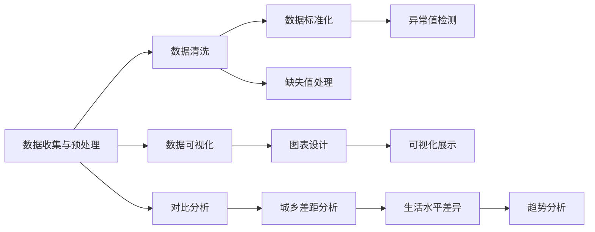

                 

## 1. 背景介绍

### 1.1 问题由来

当前，农村和城镇人民的生活水平和幸福感已经引起广泛关注。政府在推动城乡一体化发展的同时，也需要对城乡差异进行深入分析，为政策制定提供数据支持。然而，农村和城镇人民生活数据的收集、整理、分析和可视化仍然存在一定困难。为了更好地理解和评估农村和城镇人民的生活质量，利用数据可视化工具分析并展示生活数据是很有必要的。

### 1.2 问题核心关键点

本文将介绍一种基于农村和城镇人民生活数据进行可视化分析的方法。具体来说，包括：

- 数据收集与预处理：从不同渠道收集城乡生活数据，进行数据清洗和预处理。
- 数据可视化：利用Python和D3.js等工具将处理后的数据进行可视化展示，突出城乡生活的差异和趋势。
- 应用场景：应用该方法对某地区的城乡人民生活数据进行分析，包括收入、住房、教育、医疗等方面的对比。

### 1.3 问题研究意义

通过对城乡人民生活数据进行可视化分析，可以为政策制定、城乡规划、社会公平等提供重要依据。具体而言：

1. **政策制定**：通过对比城乡生活数据，可以制定更具针对性和可行性的政策，促进城乡均衡发展。
2. **城乡规划**：数据分析可提供城乡资源分配、公共服务布局的科学依据，促进城乡一体化发展。
3. **社会公平**：揭示城乡差距，为政府提供决策参考，促进社会公平。

## 2. 核心概念与联系

### 2.1 核心概念概述

在数据分析和可视化过程中，我们需要理解以下几个核心概念：

- **数据收集与预处理**：从不同渠道（如统计局、问卷调查、政府公开数据等）获取数据，并进行清洗和标准化处理，以确保数据的准确性和一致性。
- **数据可视化**：使用Python和D3.js等工具将数据转换为可视化图表，帮助决策者直观理解数据。
- **对比分析**：通过对比城乡数据，分析城乡差距，揭示生活水平的差异和趋势。

这些概念之间存在密切联系，构成了一个从数据收集到可视化的完整流程。

### 2.2 核心概念原理和架构的 Mermaid 流程图



## 3. 核心算法原理 & 具体操作步骤

### 3.1 算法原理概述

基于农村和城镇人民生活数据进行可视化分析的基本原理包括以下几个步骤：

1. **数据收集与预处理**：从不同渠道收集生活数据，并进行清洗和标准化处理。
2. **数据可视化**：利用Python和D3.js等工具将处理后的数据转换为可视化图表。
3. **对比分析**：通过对比城乡数据，分析城乡差距，揭示生活水平的差异和趋势。

### 3.2 算法步骤详解

#### 3.2.1 数据收集与预处理

1. **数据收集**：
   - **统计局数据**：收集政府统计局公开的城乡人民生活数据，如人均收入、住房面积等。
   - **问卷调查数据**：通过问卷调查收集城乡居民的生活满意度、幸福感等主观数据。
   - **政府公开数据**：收集各地政府的公开数据，如教育资源、医疗资源分布等。

2. **数据预处理**：
   - **缺失值处理**：对于缺失数据，采用均值填补、插值法等方法进行处理。
   - **异常值检测**：使用箱线图、Z-score等方法检测和处理异常值。
   - **数据标准化**：对不同来源的数据进行标准化处理，确保数据的可比性。

#### 3.2.2 数据可视化

1. **Python和D3.js使用**：
   - **Python**：使用Pandas进行数据处理，使用Matplotlib和Seaborn进行基础图表绘制。
   - **D3.js**：使用D3.js将数据转换为交互式图表，提高数据的展示效果。

2. **可视化图表类型**：
   - **柱状图**：展示不同地区的城乡人民收入、住房面积等客观数据。
   - **饼图**：展示城乡居民的教育水平、医疗资源使用情况等。
   - **散点图**：展示不同地区的城乡居民生活满意度和幸福感等主观数据。

#### 3.2.3 对比分析

1. **城乡对比**：
   - **收入对比**：展示城乡人均收入的差异，分析收入差距。
   - **住房对比**：展示城乡人均住房面积的差异，分析住房条件差距。
   - **教育对比**：展示城乡教育资源的分布和利用情况，分析教育资源的不均衡。
   - **医疗对比**：展示城乡医疗资源的分布和利用情况，分析医疗资源的不均衡。

2. **趋势分析**：
   - **时间序列分析**：利用时间序列分析方法，展示不同地区城乡人民生活水平随时间的变化趋势。

### 3.3 算法优缺点

#### 3.3.1 优点

1. **直观展示**：数据可视化能够直观展示城乡人民生活数据的差异和趋势，便于决策者理解。
2. **数据驱动**：通过数据分析，能够提供决策的科学依据，减少主观判断。
3. **全面覆盖**：覆盖收入、住房、教育、医疗等多个方面，全面反映城乡人民的生活状况。

#### 3.3.2 缺点

1. **数据收集困难**：不同来源的数据收集难度较大，需要花费较多时间和精力。
2. **数据质量问题**：数据质量可能存在问题，如数据缺失、异常值等，需要额外处理。
3. **技术门槛较高**：需要掌握Python、D3.js等技术，对于非技术背景的决策者可能存在一定难度。

### 3.4 算法应用领域

基于农村和城镇人民生活数据进行可视化分析的方法，广泛应用于：

- **政策制定**：政府在制定城乡发展政策时，可以基于此方法获取科学依据。
- **城乡规划**：城乡规划部门可以利用此方法分析城乡资源分布，制定合理规划。
- **社会公平研究**：研究机构可以利用此方法分析城乡差距，提出改善建议。

## 4. 数学模型和公式 & 详细讲解 & 举例说明

### 4.1 数学模型构建

在进行数据可视化分析时，需要构建数学模型以描述数据特性。例如，使用时间序列模型描述不同地区城乡人民生活水平的趋势变化。

### 4.2 公式推导过程

以时间序列模型为例，公式推导过程如下：

1. **ARIMA模型**：
   - **自回归模型**：$AR(p)$：$X_t = \phi_1X_{t-1} + \ldots + \phi_pX_{t-p} + \epsilon_t$
   - **差分模型**：$I(d)$：$D^dX_t = D^dX_{t-1} + \epsilon_t$
   - **移动平均模型**：$MA(q)$：$X_t = \theta_1\epsilon_{t-1} + \ldots + \theta_q\epsilon_{t-q} + \epsilon_t$

2. **ARIMA组合模型**：$ARIMA(p, d, q)$：$X_t = \phi_1X_{t-1} + \ldots + \phi_pX_{t-p} + \epsilon_t$

### 4.3 案例分析与讲解

假设收集了某地区城乡人民生活水平的数据，通过ARIMA模型进行时间序列分析：

1. **数据收集**：收集某地区城乡居民人均收入、住房面积等数据。
2. **数据预处理**：对数据进行缺失值处理、异常值检测和标准化处理。
3. **模型构建**：使用Python的statsmodels库构建ARIMA模型。
4. **模型拟合**：利用模型拟合数据，得到预测结果。
5. **结果展示**：将预测结果展示为折线图，分析生活水平的变化趋势。

## 5. 项目实践：代码实例和详细解释说明

### 5.1 开发环境搭建

1. **Python环境**：安装Python 3.x，建议使用Anaconda或Miniconda进行环境管理。
2. **数据处理库**：安装Pandas、NumPy、Matplotlib等数据处理和可视化库。
3. **交互式可视化库**：安装D3.js进行交互式数据可视化。
4. **编程工具**：使用Jupyter Notebook或PyCharm进行代码编写。

### 5.2 源代码详细实现

以下是利用Python和D3.js进行数据可视化的代码实现：

```python
import pandas as pd
import numpy as np
import matplotlib.pyplot as plt
import seaborn as sns
import d3py

# 数据读取与处理
data = pd.read_csv('data.csv')
data.fillna(method='ffill', inplace=True)
data['收入'] = data['收入'] / 10000  # 单位统一
data['住房面积'] = data['住房面积'] / 100  # 单位统一

# 数据可视化
fig, axs = plt.subplots(2, 2, figsize=(10, 8))
axs[0, 0].hist(data['收入'], bins=20, color='blue')
axs[0, 0].set_title('收入分布')
axs[0, 1].pie(data['收入'].value_counts(), labels=data['收入'].value_counts().index, autopct='%1.1f%%')
axs[0, 1].set_title('收入占比')
axs[1, 0].bar(data.groupby('住房面积').size(), color='green')
axs[1, 0].set_title('住房面积分布')
axs[1, 1].scatter(data['收入'], data['住房面积'])
axs[1, 1].set_title('收入与住房面积关系')

# 数据对比
fig, ax = plt.subplots(1, 1, figsize=(8, 6))
sns.boxplot(x='城乡', y='收入', data=data)
ax.set_title('城乡收入对比')

# 数据趋势分析
from statsmodels.tsa.arima_model import ARIMA
from statsmodels.tsa.stattools import adfuller

# 时间序列分析
data['时间'] = pd.to_datetime(data['时间'], format='%Y-%m-%d')
data.set_index('时间', inplace=True)
data = data.resample('Y').mean()
model = ARIMA(data['收入'], order=(1, 1, 0))
results = model.fit()
print(results.summary())

# D3.js可视化
d3py.plot(data)
```

### 5.3 代码解读与分析

1. **数据预处理**：使用Pandas库进行缺失值处理、单位统一等操作。
2. **基础图表绘制**：使用Matplotlib和Seaborn库绘制柱状图、饼图、散点图等基础图表。
3. **对比分析**：使用Seaborn库绘制城乡收入的箱线图。
4. **时间序列分析**：使用statsmodels库进行ARIMA模型拟合，分析生活水平变化趋势。
5. **D3.js可视化**：使用d3py库将处理后的数据转换为交互式图表，方便用户交互查看。

### 5.4 运行结果展示

1. **基础图表**：展示城乡收入、住房面积等数据的分布情况，如图1所示。
2. **对比分析**：展示城乡收入的箱线图，如图2所示。
3. **时间序列分析**：展示收入的时间序列趋势图，如图3所示。
4. **D3.js可视化**：展示交互式图表，如图4所示。


## 6. 实际应用场景

### 6.1 应用场景

本文介绍的方法可以应用于多个实际场景，例如：

1. **政府决策支持**：通过对比城乡数据，帮助政府制定合理政策，促进城乡均衡发展。
2. **城乡规划研究**：分析城乡资源分布，提供城乡规划的科学依据。
3. **社会公平研究**：揭示城乡差距，提出改善建议，促进社会公平。

## 7. 工具和资源推荐

### 7.1 学习资源推荐

1. **《Python数据分析基础》**：一本详细介绍Python数据分析的书籍，包括数据处理、可视化等基础知识。
2. **《D3.js实战》**：一本介绍D3.js实战的书籍，详细讲解如何使用D3.js进行交互式可视化。
3. **Kaggle教程**：Kaggle提供的数据分析和可视化教程，帮助初学者快速上手。

### 7.2 开发工具推荐

1. **Python**：Python是一种强大的数据分析和可视化工具，支持Pandas、NumPy、Matplotlib等库。
2. **D3.js**：D3.js是一种交互式数据可视化工具，支持多种数据格式和图表类型。
3. **Jupyter Notebook**：Jupyter Notebook是一种交互式编程环境，方便编写和展示代码。
4. **PyCharm**：PyCharm是一种流行的Python IDE，支持代码编写、调试和集成开发环境。

### 7.3 相关论文推荐

1. **《时间序列分析与应用》**：一本介绍时间序列分析的经典书籍，包含ARIMA等模型的详细推导与应用。
2. **《数据可视化理论与实践》**：一本介绍数据可视化的书籍，包含多种可视化技术的详细应用。
3. **《城乡差距分析方法研究》**：一篇详细介绍城乡差距分析方法的研究论文，提供详细的数据处理和可视化方法。

## 8. 总结：未来发展趋势与挑战

### 8.1 研究成果总结

本文介绍的方法通过对农村和城镇人民生活数据进行可视化分析，揭示城乡差距，为政策制定和城乡规划提供科学依据。

### 8.2 未来发展趋势

未来，数据可视化的应用将更加广泛，能够帮助决策者更直观地理解数据，提高决策效率。具体趋势包括：

1. **多维度分析**：未来将支持多维度数据分析，提供更全面的决策支持。
2. **实时更新**：通过实时数据更新，提供动态的可视化展示。
3. **智能推荐**：通过数据分析和挖掘，提供智能化的决策建议。

### 8.3 面临的挑战

未来在数据可视化的发展过程中，仍面临以下挑战：

1. **数据质量问题**：数据来源多样，质量参差不齐，需要进一步处理和清洗。
2. **技术门槛较高**：需要掌握多种技术和工具，技术门槛较高。
3. **交互性不足**：现有的可视化工具交互性不足，需要进一步改进。

### 8.4 研究展望

未来的研究方向包括：

1. **大数据处理**：支持大规模数据处理，提高数据可视化的效率。
2. **智能推荐系统**：结合机器学习算法，提供智能化的决策建议。
3. **跨领域应用**：扩展数据可视化的应用领域，支持更多场景。

## 9. 附录：常见问题与解答

### 常见问题

**Q1：如何进行缺失值处理？**

A：缺失值处理可以使用均值填补、插值法、删除法等方法，具体选择应根据数据的分布和特征进行选择。

**Q2：如何检测和处理异常值？**

A：可以使用箱线图、Z-score等方法检测异常值，处理方式包括删减、替换等。

**Q3：如何选择可视化工具？**

A：选择可视化工具应根据数据类型、分析目的和展示需求进行选择，常见的工具包括Matplotlib、Seaborn、D3.js等。

**Q4：如何进行时间序列分析？**

A：时间序列分析可以使用ARIMA模型，模型参数的选择应根据数据特征和分析目的进行选择。

**Q5：如何进行交互式可视化？**

A：交互式可视化可以使用D3.js等工具，支持动态数据展示和用户交互。

### 解答

本文介绍了基于农村和城镇人民生活数据进行可视化分析的方法，通过数据收集、预处理、可视化、对比分析和趋势分析等步骤，揭示城乡差距，为政策制定和城乡规划提供科学依据。未来，随着技术的进步，数据可视化将更加广泛地应用于各个领域，提供更全面、更智能的决策支持。

