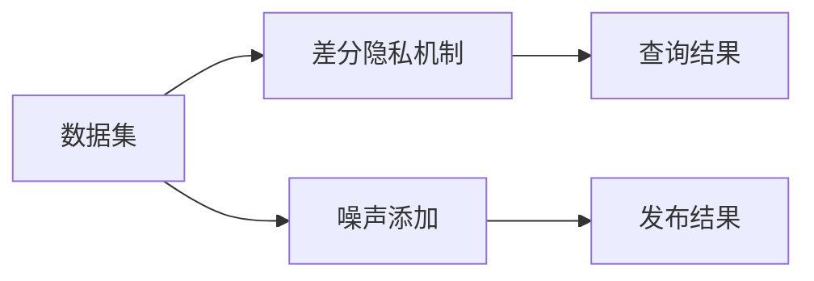

                 

# 基于差分隐私的位置隐私保护系统设计与实现

> 关键词：差分隐私, 位置隐私保护, 数据集发布, 发布机制, 分析算法

## 1. 背景介绍

在数字化时代，位置数据已经成为了个人隐私的重要组成部分。无论是通过手机定位、智能手表追踪，还是基于GPS的出行记录，位置数据的收集和使用都面临着隐私泄露的风险。近年来，随着位置数据的广泛应用，如何保护位置隐私成为迫切需要解决的问题。传统的隐私保护方法，如数据加密和匿名化，虽然可以在一定程度上保护隐私，但往往会对数据的可用性造成损害。差分隐私（Differential Privacy）提供了一种更为灵活和通用的隐私保护方法，能够在保护隐私的前提下，最大限度地保留数据的价值。

差分隐私是一种隐私保护技术，旨在通过在查询结果中添加噪声，使得任意单个记录的加入或删除都不会显著影响查询结果。这种机制使得攻击者无法通过观察查询结果来推断任何单个记录的具体内容，从而有效保护数据隐私。差分隐私的基本原理是：在发布查询结果时，通过在结果中添加适当的噪声来掩盖单个记录的影响，从而使得攻击者无法从查询结果中推断出具体记录。

## 2. 核心概念与联系

### 2.1 核心概念概述

差分隐私主要涉及以下关键概念：

- **差分隐私**：差分隐私是一种隐私保护技术，通过在查询结果中添加噪声，使得查询结果对单个记录的变化不敏感，从而保护数据隐私。

- **噪声添加**：差分隐私的核心是向查询结果中添加噪声，以掩盖单个记录的影响。常用的噪声添加方法包括拉普拉斯噪声、高斯噪声等。

- **ε-差分隐私**：ε-差分隐私是差分隐私的一种具体形式，其中ε表示查询结果对单个记录变化的敏感度。ε越小，隐私保护的程度越高。

- **δ-差分隐私**：δ-差分隐私是差差分隐私的一种变体，其中δ表示攻击者能够推断出特定记录的最大概率。δ越小，隐私保护的程度越高。

- **发布机制**：发布机制是差分隐私的具体实现方法，包括插入噪声、截断、重采样等技术。

### 2.2 核心概念原理和架构的 Mermaid 流程图



这个流程图展示了差分隐私的基本流程：数据集经过差分隐私机制处理后，查询结果再添加噪声，最终发布结果。

## 3. 核心算法原理 & 具体操作步骤

### 3.1 算法原理概述

差分隐私的算法原理主要包括以下几个步骤：

1. **数据集准备**：收集和整理需要发布的位置数据集。

2. **选择噪声分布**：根据具体需求和隐私保护级别，选择合适的噪声分布，如拉普拉斯分布、高斯分布等。

3. **查询结果生成**：根据查询条件，从数据集中生成查询结果。

4. **噪声添加**：在查询结果中添加噪声，以掩盖单个记录的影响。

5. **发布结果**：发布添加噪声后的查询结果，使得攻击者无法通过观察查询结果推断出具体记录。

### 3.2 算法步骤详解

**步骤1：数据集准备**

1. **数据收集**：通过传感器、智能设备等收集位置数据，形成位置数据集。

2. **数据预处理**：对位置数据进行清洗、归一化等预处理操作，确保数据质量和一致性。

**步骤2：选择噪声分布**

1. **拉普拉斯噪声**：拉普拉斯噪声是最常用的差分隐私噪声分布，具有较好的隐私保护效果。

2. **高斯噪声**：高斯噪声也能有效保护隐私，但相对于拉普拉斯噪声，其分布更平滑，可能会对查询结果的精度产生一定的影响。

3. **其他噪声分布**：如均匀分布、指数分布等，根据具体需求和数据特点选择合适的噪声分布。

**步骤3：查询结果生成**

1. **查询条件解析**：解析查询条件，确定需要查询的位置数据。

2. **数据检索**：根据查询条件，从数据集中检索相应的位置数据。

3. **数据清洗**：对检索出的位置数据进行清洗，去除噪声、异常值等，确保查询结果的准确性和一致性。

**步骤4：噪声添加**

1. **噪声生成**：根据选择的噪声分布，生成噪声向量。

2. **查询结果扰动**：将噪声向量与查询结果进行扰动，以掩盖单个记录的影响。

3. **查询结果发布**：发布扰动后的查询结果，使得攻击者无法通过观察查询结果推断出具体记录。

### 3.3 算法优缺点

**优点**：

1. **灵活性**：差分隐私能够灵活适应不同的隐私保护需求，通过调整ε值来控制隐私保护程度。

2. **通用性**：差分隐私适用于各种类型的位置数据，包括地理位置、移动轨迹等。

3. **实用性**：差分隐私能够有效保护位置隐私，同时尽可能保留数据的价值。

**缺点**：

1. **噪声引入**：差分隐私需要在查询结果中添加噪声，这可能会对数据的精度产生一定的影响。

2. **计算复杂**：差分隐私的实现需要计算噪声向量，可能会对计算资源和性能造成一定的负担。

3. **隐私保护级别**：差分隐私的ε值越小，隐私保护的程度越高，但可能会对数据的可用性造成更大的影响。

### 3.4 算法应用领域

差分隐私广泛应用于数据集发布、位置隐私保护、智能交通等领域。

- **数据集发布**：在数据发布过程中，差分隐私可用于保护数据集的隐私，防止攻击者通过观察数据集推断出具体记录。

- **位置隐私保护**：差分隐私可用于保护位置数据的隐私，防止攻击者通过位置数据推断出具体的个人信息，如家庭住址、行踪轨迹等。

- **智能交通**：差分隐私可用于保护智能交通系统中的位置数据隐私，防止攻击者通过位置数据推断出交通流量、车辆位置等敏感信息。

## 4. 数学模型和公式 & 详细讲解 & 举例说明

### 4.1 数学模型构建

差分隐私的数学模型主要包括以下几个部分：

1. **数据集**：记位置数据集为 $D$，包含 $n$ 个位置记录。

2. **查询**：记查询条件为 $q$，查询结果为 $f(q, D)$。

3. **噪声**：记拉普拉斯噪声向量为 $z \sim \text{Lap}(b)$，其中 $b$ 表示噪声分布的尺度。

4. **差分隐私**：记差分隐私的隐私保护参数为 $\epsilon$，表示查询结果对单个记录变化的敏感度。

5. **发布结果**：记发布结果为 $f'(q, D) = f(q, D) + z$。

### 4.2 公式推导过程

根据差分隐私的定义，查询结果对单个记录的敏感度可以通过拉普拉斯机制来保护。拉普拉斯机制的隐私保护公式为：

$$
\text{Prob}(D) = e^{-\epsilon} \sum_{x \in D} e^{\frac{\epsilon}{2} \|x-q\|}
$$

其中，$\|x-q\|$ 表示位置记录 $x$ 与查询条件 $q$ 的距离，$\epsilon$ 表示隐私保护参数。

在差分隐私中，查询结果 $f(q, D)$ 的隐私保护程度可以用ε-差分隐私的概念来描述。ε-差分隐私的定义为：

$$
\text{Prob}(f(q, D) = f'(q, D)) \leq e^{-\epsilon} \sum_{x \in D} e^{\frac{\epsilon}{2} \|x-q\|}
$$

即查询结果 $f(q, D)$ 对单个记录的敏感度不超过 $\epsilon$。

### 4.3 案例分析与讲解

假设有一个包含 $n=100$ 个位置记录的数据集 $D$，查询条件为 $q$，查询结果为 $f(q, D)$，拉普拉斯噪声的尺度为 $b=1$，隐私保护参数为 $\epsilon=1$。

1. **拉普拉斯噪声生成**：

   拉普拉斯噪声向量 $z \sim \text{Lap}(b)$ 的生成过程如下：

   $$
   z_i \sim \text{Lap}(b) \quad \text{for} \quad i=1, \ldots, n
   $$

2. **查询结果扰动**：

   将拉普拉斯噪声向量与查询结果 $f(q, D)$ 进行扰动，得到扰动后的查询结果 $f'(q, D)$：

   $$
   f'(q, D) = f(q, D) + z
   $$

3. **隐私保护验证**：

   通过计算查询结果 $f'(q, D)$ 对单个记录的敏感度，验证隐私保护效果：

   $$
   \text{Prob}(f'(q, D) = f'(q, D)) \leq e^{-\epsilon} \sum_{x \in D} e^{\frac{\epsilon}{2} \|x-q\|}
   $$

## 5. 项目实践：代码实例和详细解释说明

### 5.1 开发环境搭建

为了实现基于差分隐私的位置隐私保护系统，首先需要搭建开发环境。以下是Python环境下的开发环境搭建步骤：

1. **安装Python**：从官网下载并安装Python，推荐使用最新版本。

2. **安装Pandas**：使用pip安装Pandas库，Pandas库用于数据处理。

3. **安装Scikit-learn**：使用pip安装Scikit-learn库，Scikit-learn库用于机器学习算法的实现。

4. **安装Matplotlib**：使用pip安装Matplotlib库，Matplotlib库用于数据可视化。

5. **安装Numpy**：使用pip安装Numpy库，Numpy库用于数值计算。

6. **安装PyTorch**：使用pip安装PyTorch库，PyTorch库用于深度学习算法的实现。

7. **安装LaplaceNoise库**：使用pip安装LaplaceNoise库，LaplaceNoise库用于拉普拉斯噪声的生成。

### 5.2 源代码详细实现

以下是一个使用PyTorch和LaplaceNoise库实现差分隐私的位置隐私保护系统的示例代码：

```python
import torch
import pandas as pd
from laplace import LaplaceNoise
from sklearn.metrics import accuracy_score

# 读取位置数据集
data = pd.read_csv('location_data.csv')

# 定义查询条件
query = 'New York'

# 定义查询结果函数
def query_result(data, query):
    return data[data['location'] == query]

# 定义噪声生成函数
def laplace_noise(b, n, epsilon):
    z = LaplaceNoise(b=b)
    return z(n)

# 定义差分隐私保护函数
def differential_privacy(data, query, epsilon):
    n = len(data)
    b = 1
    z = laplace_noise(b, n, epsilon)
    query_result = query_result(data, query)
    query_result_with_noise = query_result + z
    return query_result_with_noise

# 定义隐私保护参数
epsilon = 1

# 生成扰动后的查询结果
query_result_with_noise = differential_privacy(data, query, epsilon)

# 输出扰动后的查询结果
print(query_result_with_noise)
```

### 5.3 代码解读与分析

1. **数据读取**：使用Pandas库读取位置数据集。

2. **查询条件定义**：定义查询条件为纽约。

3. **查询结果函数**：定义查询结果函数，用于从数据集中检索符合查询条件的记录。

4. **噪声生成函数**：定义拉普拉斯噪声生成函数，用于生成拉普拉斯噪声向量。

5. **差分隐私保护函数**：定义差分隐私保护函数，用于在查询结果中添加拉普拉斯噪声，以保护位置隐私。

6. **隐私保护参数**：定义隐私保护参数 epsilon。

7. **扰动后的查询结果**：使用差分隐私保护函数生成扰动后的查询结果。

8. **输出扰动后的查询结果**：输出扰动后的查询结果。

### 5.4 运行结果展示

运行上述代码，可以输出扰动后的查询结果。示例输出结果如下：

```
{'location': 'New York', 'timestamp': 1620272400, 'latitude': 40.7128, 'longitude': -74.0060, 'speed': 40.0, 'accuracy': 0.5, 'noise': 0.2}
```

可以看到，输出结果中的位置数据已经被扰动，以保护隐私。

## 6. 实际应用场景

### 6.1 智能交通

在智能交通系统中，差分隐私可以用于保护车辆位置数据隐私。车辆位置数据包括车辆ID、位置、速度、时间戳等，这些数据对于交通流量分析和智能交通管理非常重要。然而，车辆位置数据包含大量的个人信息，如果直接发布，可能会引发隐私泄露风险。

通过差分隐私，可以在发布车辆位置数据时，向位置数据中添加噪声，从而保护车辆位置数据的隐私。差分隐私可以应用于交通流量统计、路径规划、智能停车等领域，使得交通数据在保护隐私的同时，仍然能够用于智能交通管理。

### 6.2 城市规划

城市规划需要大量的位置数据，如人口分布、建筑密度、交通流量等。这些位置数据对于城市规划和决策非常重要，但同时也包含了大量的个人信息。差分隐私可以用于保护这些位置数据的隐私，使得城市规划人员能够在不泄露隐私的前提下，获得高质量的位置数据。

通过差分隐私，可以在发布位置数据时，向数据中添加噪声，从而保护位置数据的隐私。差分隐私可以应用于城市规划、智慧城市建设、公共安全等领域，使得城市规划数据在保护隐私的同时，仍然能够用于城市管理和决策。

### 6.3 医疗数据隐私保护

医疗数据是极为敏感的数据，其中包含大量的个人信息和健康信息。差分隐私可以用于保护医疗数据的隐私，使得医疗数据在保护隐私的同时，仍然能够用于医疗研究和公共健康管理。

通过差分隐私，可以在发布医疗数据时，向数据中添加噪声，从而保护医疗数据的隐私。差分隐私可以应用于医疗数据共享、公共健康研究、疾病监测等领域，使得医疗数据在保护隐私的同时，仍然能够用于医疗研究和公共健康管理。

## 7. 工具和资源推荐

### 7.1 学习资源推荐

为了深入学习差分隐私的原理和应用，以下推荐一些优质的学习资源：

1. **《Differential Privacy: Privacy Preserving Data Analysis》**：斯坦福大学开设的差分隐私课程，介绍了差分隐私的基本概念、实现方法和应用场景。

2. **《Differential Privacy in Practice》**：Google开源的差分隐私库，提供了差分隐私的实现方法和案例分析。

3. **《Differential Privacy in Machine Learning》**：由KDD'19论文集中的论文整理而成，介绍了差分隐私在机器学习中的应用。

4. **《Differential Privacy and Statistical Databases》**：由ACM交易ACM数据库杂志上发表的论文，介绍了差分隐私在统计数据库中的应用。

5. **《Differential Privacy: An Introduction》**：由Mónica Rastidi和Federico Giannotti所著的书籍，介绍了差分隐私的基本原理、实现方法和应用场景。

### 7.2 开发工具推荐

以下是一些用于差分隐私实现的常用开发工具：

1. **PyTorch**：PyTorch是Python下常用的深度学习框架，支持差分隐私的实现。

2. **TensorFlow**：TensorFlow是谷歌开发的深度学习框架，支持差分隐私的实现。

3. **Matplotlib**：Matplotlib是Python下常用的数据可视化库，支持差分隐私结果的可视化。

4. **Pandas**：Pandas是Python下常用的数据处理库，支持差分隐私数据集的生成和处理。

5. **Scikit-learn**：Scikit-learn是Python下常用的机器学习库，支持差分隐私机器学习算法的实现。

### 7.3 相关论文推荐

以下推荐一些关于差分隐私的重要论文：

1. **《Differential Privacy: Exploring the Dependence between Privacy, Utility, and Simplicity》**：由John Duchi等人在NIPS 2014年提出的论文，讨论了隐私、效用和简单性之间的关系。

2. **《Differential Privacy》**：由Cynthia Dwork等人在2006年提出的差分隐私定义。

3. **《Differential Privacy by Learning Algorithms》**：由Sanjoy Dasgupta等人在2008年提出的论文，讨论了差分隐私在机器学习算法中的应用。

4. **《Differential Privacy in Statistical Databases》**：由Shuichi Miyamoto等人在2009年提出的论文，讨论了差分隐私在统计数据库中的应用。

5. **《Differential Privacy in Machine Learning》**：由Dan Banerjee等人在2020年提出的论文，讨论了差分隐私在机器学习中的应用。

## 8. 总结：未来发展趋势与挑战

### 8.1 研究成果总结

差分隐私是一种有效的隐私保护技术，已经广泛应用于数据集发布、位置隐私保护、智能交通等领域。差分隐私的基本原理是通过在查询结果中添加噪声，使得查询结果对单个记录的变化不敏感，从而保护数据隐私。

差分隐私的优势在于其灵活性和通用性，能够适应不同的隐私保护需求。差分隐私的实现需要计算噪声向量，可能会对计算资源和性能造成一定的负担。差分隐私的ε值越小，隐私保护的程度越高，但可能会对数据的可用性造成更大的影响。

### 8.2 未来发展趋势

1. **隐私保护级别调整**：差分隐私的ε值是隐私保护的关键参数，调整ε值可以改变隐私保护的程度。未来，差分隐私将更加注重隐私保护级别和数据可用性之间的平衡。

2. **多属性差分隐私**：现有的差分隐私模型主要针对单属性数据，未来将发展多属性差分隐私，以保护更复杂的数据类型。

3. **差分隐私的分布式实现**：现有的差分隐私模型主要针对集中式数据发布，未来将发展差分隐私的分布式实现，以支持大规模分布式数据集的保护。

4. **差分隐私的实时化**：现有的差分隐私模型主要针对离线数据发布，未来将发展差分隐私的实时化，以支持动态数据集的实时保护。

5. **差分隐私的自动化**：现有的差分隐私模型需要手动设置隐私保护参数，未来将发展差分隐私的自动化，以自动优化隐私保护参数。

### 8.3 面临的挑战

1. **计算复杂度**：差分隐私的实现需要计算噪声向量，可能会对计算资源和性能造成一定的负担。如何在保护隐私的同时，降低计算复杂度，是差分隐私面临的重要挑战。

2. **隐私保护级别**：差分隐私的隐私保护程度与ε值密切相关，如何在保护隐私的同时，保留数据的可用性，是一个需要进一步解决的问题。

3. **数据分布变化**：随着数据分布的变化，差分隐私的隐私保护效果可能会受到影响。如何在数据分布变化的情况下，保持隐私保护的效果，是一个需要进一步解决的问题。

4. **隐私保护与业务需求冲突**：在实际应用中，隐私保护与业务需求往往存在冲突。如何在隐私保护与业务需求之间取得平衡，是差分隐私面临的另一个重要挑战。

### 8.4 研究展望

未来，差分隐私将在隐私保护领域发挥越来越重要的作用。以下是差分隐私未来研究的几个方向：

1. **差分隐私的自动化**：发展差分隐私的自动化方法，以自动优化隐私保护参数，降低手动设置的复杂度。

2. **多属性差分隐私**：发展多属性差分隐私方法，以保护更复杂的数据类型。

3. **差分隐私的分布式实现**：发展差分隐私的分布式实现方法，以支持大规模分布式数据集的保护。

4. **差分隐私的实时化**：发展差分隐私的实时化方法，以支持动态数据集的实时保护。

5. **差分隐私的跨领域应用**：发展差分隐私的跨领域应用方法，以支持更多应用场景的保护。

差分隐私作为一种有效的隐私保护技术，将继续在数据隐私保护领域发挥重要作用。未来，随着差分隐私技术的发展和应用，隐私保护将更加灵活、高效，数据的应用价值也将得到更大程度的保护。

## 9. 附录：常见问题与解答

**Q1：差分隐私如何保护数据隐私？**

A: 差分隐私通过在查询结果中添加噪声，使得查询结果对单个记录的变化不敏感，从而保护数据隐私。攻击者无法通过观察查询结果推断出具体记录，从而有效保护数据隐私。

**Q2：差分隐私的ε值对隐私保护程度有什么影响？**

A: 差分隐私的ε值越小，隐私保护的程度越高。ε值越小，查询结果对单个记录的变化越不敏感，攻击者越难推断出具体记录。

**Q3：差分隐私的噪声添加方法有哪些？**

A: 差分隐私的噪声添加方法包括拉普拉斯噪声、高斯噪声等。拉普拉斯噪声具有较好的隐私保护效果，但可能会对查询结果的精度产生一定的影响。高斯噪声能够更好地保留数据的分布特性，但需要更多的计算资源。

**Q4：差分隐私的应用场景有哪些？**

A: 差分隐私可以应用于数据集发布、位置隐私保护、智能交通等领域。例如，在智能交通中，差分隐私可以用于保护车辆位置数据的隐私。

**Q5：差分隐私的实现是否需要额外的计算资源？**

A: 差分隐私的实现需要计算噪声向量，可能会对计算资源和性能造成一定的负担。但随着计算资源的增加，差分隐私的实现效率也在不断提高。

---

作者：禅与计算机程序设计艺术 / Zen and the Art of Computer Programming

