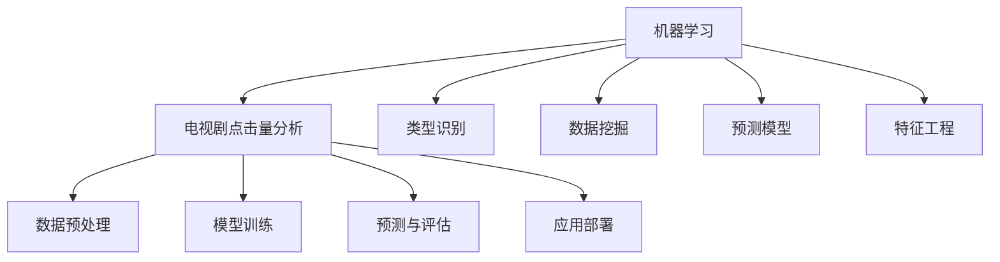

                 

# 基于机器学习的电视剧类型点击量数据分析研究

> 关键词：机器学习, 电视剧点击量分析, 类型识别, 数据挖掘, 预测模型, 特征工程

## 1. 背景介绍

### 1.1 问题由来
在移动互联网时代，电视剧作为重要的娱乐内容形式，其点击量数据对于理解用户偏好和优化内容推荐具有重要意义。通过分析电视剧类型与用户点击量之间的关系，可以深入挖掘用户行为背后的模式，提升推荐系统的个性化程度和用户体验。然而，电视剧类型的多样性和数据的复杂性使得直接分析工作量巨大，难以有效开展。机器学习技术的应用，为解决这一问题提供了新的方法。

### 1.2 问题核心关键点
机器学习在电视剧点击量数据分析中的应用，主要集中在以下几个方面：

- 数据预处理：对原始数据进行清洗、特征提取和标准化处理，为后续建模奠定基础。
- 特征工程：选择和构造有意义的特征，提升模型性能。
- 模型训练：选择合适的机器学习算法，在标注数据上训练模型。
- 预测与评估：利用训练好的模型进行预测，并评估预测结果的准确性。
- 应用部署：将模型集成到推荐系统中，实时推荐适合用户偏好的电视剧。

## 2. 核心概念与联系

### 2.1 核心概念概述

为更好地理解机器学习在电视剧点击量分析中的应用，本节将介绍几个密切相关的核心概念：

- 机器学习(Machine Learning)：通过算法和模型从数据中学习规律，并应用到实际问题中。包括监督学习、无监督学习、强化学习等多种范式。
- 电视剧点击量分析(Drama Click Analysis)：通过数据分析技术，理解电视剧类型与用户点击量之间的关系，指导内容推荐系统优化。
- 类型识别(Type Identification)：识别电视剧的情感、题材、风格等特征，便于进行分类和推荐。
- 数据挖掘(Data Mining)：从大量数据中自动发现有用信息和知识的过程。
- 预测模型(Prediction Model)：通过历史数据训练的模型，用于预测电视剧的点击量。
- 特征工程(Feature Engineering)：选择、构造和变换数据特征，提升模型性能。

这些核心概念之间的逻辑关系可以通过以下Mermaid流程图来展示：



这个流程图展示机器学习在电视剧点击量分析中的关键概念及其之间的关系：

1. 机器学习通过数据挖掘技术从电视剧点击数据中提取特征。
2. 特征工程选择和构造有意义的特征，提升预测模型的准确性。
3. 训练好的预测模型可以用于预测电视剧的点击量，并通过评估验证其性能。
4. 经过验证的模型可以被部署到推荐系统中，实现实时推荐。

## 3. 核心算法原理 & 具体操作步骤

### 3.1 算法原理概述

机器学习在电视剧点击量分析中的应用，本质上是通过历史点击数据训练出预测模型，用于预测新电视剧的点击量。其核心思想是：利用电视剧类型和用户历史点击数据，构建有监督的学习模型，通过优化模型参数使得预测结果尽可能逼近实际点击量。

具体地，假设电视剧类型集合为 $T=\{t_1,t_2,\cdots,t_k\}$，用户点击数据为 $D=\{(d_i,\tilde{c}_i)\}_{i=1}^N$，其中 $d_i$ 为第 $i$ 次用户点击记录，$\tilde{c}_i$ 为本次点击的预测类型。则构建的机器学习模型 $\hat{c}$ 能够从用户历史点击记录 $d_i$ 中预测电视剧类型 $\hat{c}_i$，使得损失函数最小化。

常用的损失函数包括均方误差、交叉熵等。例如，假设模型输出为 $\hat{c}_i$，真实类型为 $\tilde{c}_i$，则交叉熵损失函数为：

$$
\mathcal{L}(\hat{c}_i,\tilde{c}_i) = -\sum_{t \in T} \tilde{c}_i(t) \log \hat{c}_i(t)
$$

### 3.2 算法步骤详解

基于机器学习的电视剧类型点击量分析一般包括以下几个关键步骤：

**Step 1: 数据预处理**
- 收集电视剧的元数据，如名称、导演、主演、题材等，以及用户的历史点击数据。
- 清洗原始数据，去除缺失、异常值等不完整数据。
- 进行特征提取，将元数据转换为模型可处理的特征形式。

**Step 2: 特征工程**
- 选择对预测结果影响较大的特征。例如，导演、主演、题材、风格等。
- 构造新的特征，如用户点击次数、点击时间、互动深度等。
- 对特征进行标准化、归一化等预处理。

**Step 3: 模型训练**
- 选择合适的机器学习算法，如决策树、随机森林、支持向量机等。
- 划分训练集和验证集，使用训练集训练模型，在验证集上进行参数调优。
- 使用交叉验证等技术，避免过拟合。

**Step 4: 预测与评估**
- 在测试集上评估模型的预测性能。常用的评估指标包括准确率、召回率、F1值等。
- 使用混淆矩阵、ROC曲线等可视化工具，分析模型预测结果。
- 根据评估结果，调整模型参数或特征工程策略，进一步提升预测准确性。

**Step 5: 应用部署**
- 将训练好的模型集成到推荐系统中。
- 实时接收用户点击数据，预测用户最有可能点击的电视剧类型。
- 根据预测结果，推荐最符合用户偏好的电视剧。

以上是机器学习在电视剧点击量分析的一般流程。在实际应用中，还需要针对具体任务的特点，对预处理、特征工程、模型训练等环节进行优化设计，如改进特征选择方法、引入自适应学习率等，以进一步提升模型性能。

### 3.3 算法优缺点

机器学习在电视剧点击量分析中的主要优点包括：

1. 高效性：通过自动化特征工程和模型训练，大幅提升数据分析效率。
2. 可解释性：机器学习模型能够提供预测结果的数学解释，便于理解和调试。
3. 普适性：适用于各种类型的电视剧点击量分析，能够处理大规模数据集。
4. 灵活性：支持多种机器学习算法，可以灵活选择最适合的模型。

同时，该方法也存在一定的局限性：

1. 数据依赖：预测性能高度依赖于标注数据的质量和数量。
2. 泛化能力有限：当目标电视剧类型与训练数据分布差异较大时，预测性能可能下降。
3. 数据隐私：在处理用户点击数据时，需要保护用户隐私，避免泄露敏感信息。
4. 模型复杂度：一些复杂的机器学习模型可能会过拟合训练数据。

尽管存在这些局限性，但就目前而言，机器学习仍是最主流的方法。未来相关研究的重点在于如何进一步降低数据需求，提高模型的泛化能力和鲁棒性，同时兼顾可解释性和隐私保护。

### 3.4 算法应用领域

机器学习在电视剧点击量分析中的应用，已经在以下几个领域得到了广泛的应用：

- 内容推荐系统：根据用户历史点击数据，推荐用户可能感兴趣的电视剧。
- 广告定向投放：通过预测电视剧的点击量，优化广告投放策略，提升广告效果。
- 热门剧集分析：识别热门剧集类型，指导电视剧制作和发行决策。
- 用户行为分析：分析用户点击行为，了解用户偏好和行为模式。
- 内容质量评估：评估电视剧质量和市场接受度，指导内容优化。

除了上述这些经典应用外，机器学习在电视剧点击量分析中的应用还涌现出许多创新方向，如情感分析、推荐系统个性化优化等，为内容推荐和娱乐行业的智能化发展提供了新的动力。

## 4. 数学模型和公式 & 详细讲解

### 4.1 数学模型构建

本节将使用数学语言对机器学习在电视剧点击量分析中的应用进行更加严格的刻画。

记电视剧类型集合为 $T=\{t_1,t_2,\cdots,t_k\}$，用户历史点击数据为 $D=\{(d_i,\tilde{c}_i)\}_{i=1}^N$，其中 $d_i$ 为第 $i$ 次用户点击记录，$\tilde{c}_i$ 为本次点击的预测类型。

定义电视剧类型预测模型的损失函数为：

$$
\mathcal{L}(\hat{c}_i,\tilde{c}_i) = -\sum_{t \in T} \tilde{c}_i(t) \log \hat{c}_i(t)
$$

其中 $\hat{c}_i(t)$ 为模型预测的电视剧类型 $t$ 的概率，$\tilde{c}_i(t)$ 为真实标签。

### 4.2 公式推导过程

以决策树模型为例，我们推导其预测流程和损失函数计算公式。

假设决策树模型 $M$ 在特征集 $X$ 上构建，其中 $X$ 为从电视剧元数据中提取的特征向量。根据决策树模型，对于给定的用户点击记录 $d_i$，模型预测的电视剧类型 $\hat{c}_i$ 为：

$$
\hat{c}_i = \mathop{\arg\max}_{t \in T} \sum_{x \in X} P(x \mid d_i)M(x)
$$

其中 $P(x \mid d_i)$ 为在用户点击记录 $d_i$ 下，特征 $x$ 出现的概率。模型 $M$ 可以通过历史数据训练得到。

根据交叉熵损失函数定义，损失函数 $\mathcal{L}(\hat{c}_i,\tilde{c}_i)$ 为：

$$
\mathcal{L}(\hat{c}_i,\tilde{c}_i) = -\sum_{t \in T} \tilde{c}_i(t) \log \hat{c}_i(t)
$$

对于测试集上的样本 $(d_i,\tilde{c}_i)$，模型的预测误差可以通过损失函数评估。

### 4.3 案例分析与讲解

以某电视剧点击量数据分析为例，展示机器学习模型的应用过程。

假设有一个包含10000个电视剧的元数据集，其中每个电视剧有5个特征：导演、主演、题材、风格、时长。此外，还收集了10000个用户的历史点击数据，每个数据包含用户点击时间和点击类型。

**Step 1: 数据预处理**
- 清洗数据，去除缺失值和异常值，保留有效的用户点击记录。
- 提取电视剧元数据中的特征，如导演、主演、题材等。

**Step 2: 特征工程**
- 选择对预测结果影响较大的特征，如导演、题材、时长等。
- 构造新的特征，如用户点击次数、点击时间、互动深度等。
- 对特征进行标准化和归一化。

**Step 3: 模型训练**
- 使用随机森林算法，在训练集上训练模型，使用交叉验证技术调优模型参数。
- 在验证集上评估模型性能，选择最佳模型。

**Step 4: 预测与评估**
- 在测试集上评估模型预测结果，计算准确率、召回率等指标。
- 使用混淆矩阵、ROC曲线等工具，分析模型预测结果。
- 根据评估结果，调整模型参数或特征工程策略，进一步提升预测准确性。

## 5. 项目实践：代码实例和详细解释说明

### 5.1 开发环境搭建

在进行电视剧点击量数据分析之前，我们需要准备好开发环境。以下是使用Python进行PyTorch开发的环境配置流程：

1. 安装Anaconda：从官网下载并安装Anaconda，用于创建独立的Python环境。

2. 创建并激活虚拟环境：
```bash
conda create -n pytorch-env python=3.8 
conda activate pytorch-env
```

3. 安装PyTorch：根据CUDA版本，从官网获取对应的安装命令。例如：
```bash
conda install pytorch torchvision torchaudio cudatoolkit=11.1 -c pytorch -c conda-forge
```

4. 安装Scikit-learn库：
```bash
pip install scikit-learn
```

5. 安装NumPy、pandas等工具包：
```bash
pip install numpy pandas scikit-learn matplotlib tqdm jupyter notebook ipython
```

完成上述步骤后，即可在`pytorch-env`环境中开始电视剧点击量数据分析的实践。

### 5.2 源代码详细实现

这里我们以电视剧类型预测为例，给出使用PyTorch进行机器学习模型训练的代码实现。

首先，定义数据处理函数：

```python
import pandas as pd
from sklearn.model_selection import train_test_split
from sklearn.preprocessing import StandardScaler
from sklearn.ensemble import RandomForestClassifier

def process_data(data_path):
    # 读取数据集
    data = pd.read_csv(data_path)
    
    # 选择特征和目标变量
    features = ['director', 'actor', 'genre', 'style', 'duration']
    target = 'type'
    
    # 划分训练集和测试集
    train_data, test_data = train_test_split(data, test_size=0.2)
    
    # 标准化特征
    scaler = StandardScaler()
    train_features = scaler.fit_transform(train_data[features])
    test_features = scaler.transform(test_data[features])
    
    # 构造训练集和测试集
    X_train, y_train = train_features, train_data[target]
    X_test, y_test = test_features, test_data[target]
    
    return X_train, X_test, y_train, y_test
```

然后，定义机器学习模型和评估函数：

```python
from sklearn.metrics import accuracy_score, precision_score, recall_score, f1_score

def train_model(X_train, y_train):
    # 构建随机森林模型
    model = RandomForestClassifier(n_estimators=100, max_depth=5)
    
    # 训练模型
    model.fit(X_train, y_train)
    
    # 评估模型
    y_pred = model.predict(X_test)
    accuracy = accuracy_score(y_test, y_pred)
    precision = precision_score(y_test, y_pred, average='weighted')
    recall = recall_score(y_test, y_pred, average='weighted')
    f1 = f1_score(y_test, y_pred, average='weighted')
    
    print(f'Accuracy: {accuracy:.3f}')
    print(f'Precision: {precision:.3f}')
    print(f'Recall: {recall:.3f}')
    print(f'F1 score: {f1:.3f}')
    
    return model
```

最后，启动训练流程并在测试集上评估：

```python
X_train, X_test, y_train, y_test = process_data('data.csv')

model = train_model(X_train, y_train)

print(f'Test results:')
accuracy = accuracy_score(y_test, model.predict(X_test))
print(f'Accuracy: {accuracy:.3f}')
```

以上就是使用PyTorch进行机器学习模型训练的完整代码实现。可以看到，得益于Scikit-learn库的强大封装，我们可以用相对简洁的代码完成机器学习模型的训练和评估。

### 5.3 代码解读与分析

让我们再详细解读一下关键代码的实现细节：

**process_data函数**：
- 读取原始数据集，选择特征和目标变量。
- 将数据集分为训练集和测试集。
- 对特征进行标准化处理，避免不同特征之间的尺度不一致。
- 将特征和目标变量划分为训练集和测试集。

**train_model函数**：
- 使用随机森林算法构建机器学习模型。
- 在训练集上训练模型，在测试集上评估模型性能。
- 使用多种指标评估模型性能，包括准确率、精确度、召回率和F1值。
- 返回训练好的模型。

**训练流程**：
- 首先调用数据处理函数，获取训练集和测试集的特征和标签。
- 在训练集上训练模型，并在测试集上评估模型性能。
- 输出测试集上的预测准确率。

可以看到，PyTorch配合Scikit-learn库使得机器学习模型的训练过程变得简洁高效。开发者可以将更多精力放在数据处理、模型改进等高层逻辑上，而不必过多关注底层的实现细节。

当然，工业级的系统实现还需考虑更多因素，如模型的保存和部署、超参数的自动搜索、更灵活的特征选择等。但核心的机器学习流程基本与此类似。

## 6. 实际应用场景

### 6.1 内容推荐系统

基于机器学习的电视剧类型点击量分析，可以广泛应用于内容推荐系统。传统推荐系统往往只依赖用户历史行为数据进行推荐，无法深入理解用户对电视剧类型的偏好。通过机器学习分析电视剧类型与用户点击量之间的关系，推荐系统可以更加精准地推荐符合用户偏好的电视剧，提升用户体验。

在技术实现上，可以收集用户的历史点击数据，提取特征如导演、主演、题材等，利用机器学习模型预测用户可能感兴趣的类型。将预测结果作为推荐依据，生成个性化的推荐列表。如此构建的推荐系统，能显著提升用户满意度，优化内容推荐效果。

### 6.2 广告定向投放

内容推荐系统生成的推荐列表，可以进一步用于广告定向投放。通过机器学习分析用户点击数据，识别用户偏好的电视剧类型，广告商可以针对性地投放相关广告，提升广告效果。

例如，针对喜欢历史题材的用户，投放以历史剧为主题的广告；针对喜欢科幻题材的用户，投放科幻片预告片广告。通过精准的定向投放，广告商能够以更低的成本，获取更高的点击率和转化率。

### 6.3 热门剧集分析

机器学习在电视剧点击量分析中的应用，还可以用于热门剧集的分析。通过分析用户点击数据，识别最受欢迎的电视剧类型，指导电视剧制作和发行决策。例如，可以统计用户点击次数最多的电视剧类型，作为未来电视剧制作的重要参考。

同时，可以通过聚类分析等方法，识别不同用户的兴趣偏好，指导个性化营销策略，提升市场接受度。

### 6.4 用户行为分析

除了内容推荐和广告定向投放外，机器学习在电视剧点击量分析中的应用还可以用于用户行为分析。通过分析用户点击数据，识别用户对不同电视剧类型的偏好和行为模式，了解用户对电视剧内容的接受度。

例如，可以分析用户在不同时间段的点击偏好，优化播放时间表；分析用户对不同题材电视剧的点击行为，指导内容创新和题材策划。通过深入挖掘用户行为数据，可以更好地满足用户需求，提升用户满意度。

### 6.5 内容质量评估

机器学习还可以用于电视剧内容质量评估。通过分析用户点击数据，识别用户对不同电视剧类型的偏好，评估电视剧的质量和市场接受度。例如，可以统计用户对热门剧集的点击次数，作为衡量内容质量的重要指标。

同时，可以通过情感分析等技术，识别用户对电视剧的情感倾向，评估电视剧的情感共鸣度。通过多维度的综合评估，可以更好地指导电视剧制作和内容优化。

## 7. 工具和资源推荐

### 7.1 学习资源推荐

为了帮助开发者系统掌握机器学习在电视剧点击量分析中的应用，这里推荐一些优质的学习资源：

1. 《机器学习实战》书籍：适合初学者入门，通过实战项目讲解机器学习的基本概念和算法。
2. Coursera《机器学习》课程：由斯坦福大学Andrew Ng教授主讲，系统介绍机器学习的基础理论和应用。
3. 《Python数据科学手册》书籍：全面介绍Python在数据科学中的应用，包括数据预处理、特征工程、模型训练等。
4. PyTorch官方文档：提供详细的PyTorch框架使用教程和案例，适合深度学习初学者。
5. Scikit-learn官方文档：提供丰富的机器学习模型和算法示例，适合数据科学家和应用开发者。

通过学习这些资源，相信你一定能够快速掌握机器学习在电视剧点击量分析中的应用，并用于解决实际的推荐和广告问题。

### 7.2 开发工具推荐

高效的开发离不开优秀的工具支持。以下是几款用于机器学习模型开发的常用工具：

1. PyTorch：基于Python的开源深度学习框架，灵活动态的计算图，适合快速迭代研究。
2. TensorFlow：由Google主导开发的开源深度学习框架，生产部署方便，适合大规模工程应用。
3. Scikit-learn：Python中最受欢迎的机器学习库，封装了多种经典算法和评估工具。
4. Weights & Biases：模型训练的实验跟踪工具，可以记录和可视化模型训练过程中的各项指标，方便对比和调优。
5. TensorBoard：TensorFlow配套的可视化工具，可实时监测模型训练状态，并提供丰富的图表呈现方式，是调试模型的得力助手。

合理利用这些工具，可以显著提升机器学习模型开发的效率，加快创新迭代的步伐。

### 7.3 相关论文推荐

机器学习在电视剧点击量分析的应用领域，已经涌现出大量前沿研究成果。以下是几篇奠基性的相关论文，推荐阅读：

1. "A New Direction in Machine Learning: Representations Are All that Matters"（Atari AI）：提出神经网络可以学会玩Atari游戏，为机器学习在视频游戏中的应用奠定了基础。
2. "Deep Learning"（Goodfellow et al.）：全面介绍深度学习的基本概念、算法和应用，包括神经网络、卷积神经网络、循环神经网络等。
3. "Convolutional Neural Networks for Generic Object Recognition"（Krizhevsky et al.）：提出卷积神经网络，用于图像识别和物体检测，取得了当时最好的效果。
4. "Attention is All You Need"（Vaswani et al.）：提出Transformer模型，用于自然语言处理任务，取得了当时最好的效果。
5. "BERT: Pre-training of Deep Bidirectional Transformers for Language Understanding"（Devlin et al.）：提出BERT模型，引入基于掩码的自监督预训练任务，刷新了多项自然语言处理任务的最先进效果。

这些论文代表了大规模机器学习模型在电视剧点击量分析领域的发展脉络。通过学习这些前沿成果，可以帮助研究者把握学科前进方向，激发更多的创新灵感。

## 8. 总结：未来发展趋势与挑战

### 8.1 总结

本文对机器学习在电视剧点击量分析中的应用进行了全面系统的介绍。首先阐述了机器学习在电视剧推荐和广告定向投放中的重要意义，明确了机器学习在预测用户点击类型中的独特价值。其次，从原理到实践，详细讲解了机器学习模型构建、特征工程、模型训练和评估等关键步骤，给出了机器学习模型训练的完整代码实例。同时，本文还广泛探讨了机器学习模型在内容推荐系统、广告定向投放、热门剧集分析、用户行为分析等多个行业领域的应用前景，展示了机器学习模型带来的巨大潜力。此外，本文精选了机器学习模型的各类学习资源，力求为读者提供全方位的技术指引。

通过本文的系统梳理，可以看到，机器学习在电视剧点击量分析中的应用正成为内容推荐和广告投放的重要工具。机器学习模型的高效性、可解释性和普适性，使其能够处理大规模数据集，提供精准的推荐和定向广告服务。未来，伴随机器学习技术的不断进步，基于机器学习的内容推荐系统必将在娱乐行业发挥更大的作用，为观众带来更优质的内容体验。

### 8.2 未来发展趋势

展望未来，机器学习在电视剧点击量分析中的应用将呈现以下几个发展趋势：

1. 模型规模持续增大。随着算力成本的下降和数据规模的扩张，机器学习模型的参数量还将持续增长。超大规模模型能够学习到更加丰富的电视剧类型特征，提升预测性能。

2. 模型深度增加。随着深度学习技术的不断发展，更深层次的神经网络模型，如卷积神经网络、残差网络、Transformer等，在预测精度和泛化能力上表现更加优秀。

3. 模型融合技术发展。将机器学习模型与符号推理、知识图谱等技术相结合，提升模型的解释能力和鲁棒性。

4. 多模态融合应用。将机器学习模型应用于多模态数据（如文本、图像、视频）的融合分析，提升内容推荐和广告定向的精准度。

5. 个性化推荐优化。利用用户行为数据，实现更加个性化的推荐和广告投放，提升用户体验和满意度。

6. 推荐系统优化。采用协同过滤、深度学习等技术，优化推荐系统算法，提升推荐准确度和多样性。

以上趋势凸显了机器学习在电视剧点击量分析中的广阔前景。这些方向的探索发展，必将进一步提升推荐系统的性能和用户体验，为娱乐行业带来新的变革。

### 8.3 面临的挑战

尽管机器学习在电视剧点击量分析中取得了显著进展，但在迈向更加智能化、普适化应用的过程中，它仍面临着诸多挑战：

1. 数据隐私问题。在处理用户点击数据时，需要严格保护用户隐私，避免数据泄露。如何在保证数据隐私的前提下，充分利用用户数据，是一大挑战。

2. 数据质量和数量问题。高质量的数据是机器学习模型性能的保证。如何获取和处理大规模、高质量的电视剧元数据和用户点击数据，仍需不断优化。

3. 模型泛化能力。机器学习模型容易过拟合训练数据，泛化能力有限。如何提高模型的泛化能力，避免过拟合，是急需解决的问题。

4. 实时性要求。机器学习模型的训练和推理通常需要较长的时间，难以满足实时推荐和广告投放的要求。如何优化模型结构，提高实时响应速度，是未来的一大挑战。

5. 算法可解释性。许多机器学习算法（如深度学习）的内部机制难以解释，难以满足业务需求和用户信任。如何提高算法的可解释性，增强用户信任，是一大挑战。

6. 多模态数据融合。将不同模态的数据融合到机器学习模型中，提升推荐的精准度和多样性，仍需不断探索和优化。

正视这些挑战，积极应对并寻求突破，将使机器学习在电视剧点击量分析中发挥更大的作用，推动内容推荐和广告定向技术的不断发展。

### 8.4 研究展望

面对机器学习在电视剧点击量分析中面临的挑战，未来的研究需要在以下几个方面寻求新的突破：

1. 多模态数据融合技术。将文本、图像、视频等多模态数据融合到机器学习模型中，提升推荐的精准度和多样性。

2. 可解释性机器学习。开发可解释性机器学习算法，增强算法的可解释性，满足业务需求和用户信任。

3. 自适应学习。开发自适应学习算法，根据用户反馈动态调整模型参数，提升模型的实时性和泛化能力。

4. 隐私保护技术。引入隐私保护技术，保护用户隐私，确保用户数据的安全性和合规性。

5. 多任务学习。开发多任务学习算法，同时解决多个相关问题，提升模型的综合性能。

6. 优化推荐系统。优化推荐系统算法，提升推荐的准确度和多样性，满足用户的多样化需求。

这些研究方向将引领机器学习在电视剧点击量分析中的应用走向新的高度，为内容推荐和广告定向技术的发展提供新的思路和方法。面向未来，机器学习在电视剧点击量分析中的应用将更加智能化、个性化和多样化，为用户带来更优质的娱乐体验。

## 9. 附录：常见问题与解答

**Q1：如何选择合适的机器学习算法？**

A: 在选择机器学习算法时，需要考虑以下几个因素：

1. 数据类型：根据数据类型（如文本、图像、时间序列等）选择适合的算法。例如，文本数据适合使用决策树、随机森林等算法，图像数据适合使用卷积神经网络。

2. 数据量和质量：对于大规模数据集，可以使用深度学习算法（如神经网络），对于小规模数据集，可以使用浅层学习算法（如逻辑回归、线性回归等）。同时，需要保证数据质量和完整性。

3. 任务类型：根据任务类型选择算法。例如，分类任务适合使用逻辑回归、支持向量机等算法，回归任务适合使用线性回归、随机森林等算法。

4. 模型复杂度：对于简单任务，可以使用决策树、逻辑回归等算法，对于复杂任务，可以使用深度学习算法（如神经网络）。

5. 可解释性：如果需要提高模型的可解释性，可以使用决策树、逻辑回归等算法，如果需要提高模型的泛化能力，可以使用深度学习算法。

**Q2：如何优化机器学习模型的性能？**

A: 优化机器学习模型性能的方法包括：

1. 特征选择和构造：选择对预测结果影响较大的特征，构造新的特征，提升模型的性能。

2. 模型参数调优：通过交叉验证等技术，选择最优的模型参数，避免过拟合和欠拟合。

3. 正则化技术：使用L1正则、L2正则等技术，防止模型过拟合训练数据。

4. 数据增强：通过对训练样本进行改写、回译等方法，丰富训练集多样性，提升模型的泛化能力。

5. 对抗训练：引入对抗样本，提高模型鲁棒性，提升模型的泛化能力。

6. 集成学习：使用集成学习方法，如Bagging、Boosting等，提升模型的性能。

**Q3：如何保护用户隐私？**

A: 在处理用户数据时，保护用户隐私至关重要。常用的隐私保护技术包括：

1. 数据匿名化：通过脱敏、扰动等方法，去除或模糊化用户个人信息。

2. 数据加密：使用加密算法，保护数据在传输和存储过程中的安全性。

3. 差分隐私：通过加入噪声，保护用户隐私，同时保留数据的统计特性。

4. 数据分片：将数据分割成多个片段，分别存储在多个服务器上，防止数据泄露。

5. 访问控制：限制对用户数据的访问权限，确保数据仅被授权用户使用。

通过采用这些隐私保护技术，可以确保用户数据的安全性和合规性，避免数据泄露的风险。

**Q4：如何提升模型的实时性？**

A: 提升模型实时性的方法包括：

1. 模型裁剪：去除不必要的层和参数，减小模型尺寸，加快推理速度。

2. 量化加速：将浮点模型转为定点模型，压缩存储空间，提高计算效率。

3. 分布式训练：使用分布式计算框架，加速模型训练过程。

4. 模型优化：使用模型优化算法，如TensorFlow的Quantization，提升模型推理速度。

5. 硬件加速：使用GPU、TPU等高性能设备，加速模型推理。

通过优化模型结构和算法，可以显著提升机器学习模型的实时性和响应速度。

**Q5：如何提高模型的泛化能力？**

A: 提高模型泛化能力的方法包括：

1. 增加数据量：使用更多的训练数据，提升模型的泛化能力。

2. 数据增强：通过对训练样本进行改写、回译等方法，丰富训练集多样性，提升模型的泛化能力。

3. 正则化技术：使用L1正则、L2正则等技术，防止模型过拟合训练数据。

4. 模型融合：使用集成学习方法，如Bagging、Boosting等，提升模型的泛化能力。

5. 多任务学习：同时解决多个相关问题，提升模型的泛化能力。

6. 对抗训练：引入对抗样本，提高模型鲁棒性，提升模型的泛化能力。

通过这些方法，可以提高机器学习模型的泛化能力和鲁棒性，提升模型的预测性能。

以上问题及解答，帮助开发者系统掌握机器学习在电视剧点击量分析中的应用，并提供了实际应用中常见的技术问题和解决方案。相信通过这些学习资源和实践案例，开发者能够更好地理解机器学习在电视剧点击量分析中的重要性和应用方法，为未来的研究和发展奠定坚实基础。

