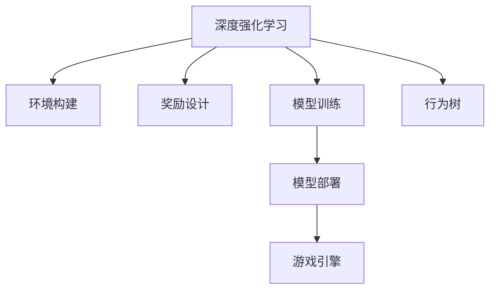

                 

# 基于深度强化学习的NPC自主训练模型构建的实现

> 关键词：深度强化学习,自主训练模型,游戏AI,游戏编程,计算机图形学

## 1. 背景介绍

随着人工智能技术的发展，视频游戏领域的游戏AI(NPC)正在从简单的行为决策向具有自主性和智能化的复杂决策迈进。传统游戏AI依赖规则编写和简单行为树，而自主训练模型可以利用深度强化学习(Deep Reinforcement Learning, DRL)的技术，实现更灵活、更智能的决策策略。DRL通过模拟环境与NPC的互动，使得NPC能够自动学习到最优的策略，提升游戏的趣味性和体验感。

### 1.1 问题由来

过去，游戏AI的开发通常依赖于程序员编写行为规则，实现简单的反应和决策。这些规则需要精心设计，但往往难以应对复杂的任务，也难以随游戏内容的变化而动态调整。传统的行为树等方法也无法实现复杂的策略学习，只能应对固定的游戏环境和任务。

随着DRL技术的发展，越来越多的游戏开始采用自主训练模型，通过训练让NPC具备更加智能的决策能力。自主训练模型能够自动学习环境特征和行为策略，适应不同游戏场景和任务，提供更加逼真的交互体验。然而，开发和部署自主训练模型也面临着诸多挑战，需要掌握DRL的基本原理和实现技巧。

### 1.2 问题核心关键点

DRL的核心在于构建一个有效的奖励函数，使得模型能够最大化长期累积奖励。在自主训练模型中，环境通常是游戏场景，而奖励函数则是玩家对于游戏体验的评价。自主训练模型通过与环境的互动，不断调整行为策略，使得长期累积的奖励最大化。

具体而言，DRL的自主训练模型构建涉及以下几个关键点：

- 环境构建：游戏场景的模拟和建模，以及环境与NPC之间的交互机制。
- 奖励设计：如何将玩家对游戏体验的评价转化为机器可理解的形式，构建奖励函数。
- 模型训练：利用DRL算法在环境中训练NPC，学习到最优策略。
- 模型部署：将训练好的模型集成到游戏引擎中，实现智能决策。

### 1.3 问题研究意义

研究基于深度强化学习的NPC自主训练模型，对于推动游戏AI技术的进步，提升游戏体验，具有重要意义：

1. 提升游戏趣味性。通过智能化的NPC，增加游戏的挑战性和趣味性，吸引更多玩家。
2. 降低开发成本。自主训练模型自动学习策略，减少了规则编写和调试的工作量，降低开发成本。
3. 提高可扩展性。自主训练模型能够适应不同游戏场景和任务，提供灵活的开发接口。
4. 增强用户体验。智能化的NPC能够提供更加自然、逼真的交互体验，提升玩家满意度。
5. 促进游戏开发。自主训练模型提供了新的技术思路，促进了游戏AI的产业化应用。

## 2. 核心概念与联系

### 2.1 核心概念概述

为了更好地理解基于深度强化学习的NPC自主训练模型构建，本节将介绍几个密切相关的核心概念：

- 深度强化学习(Deep Reinforcement Learning, DRL)：一种结合深度神经网络和强化学习思想的训练方法，利用深度网络提取环境特征，通过奖励函数引导策略学习，实现智能决策。
- 环境构建(Environment)：游戏场景的模拟和建模，包括环境状态、动作空间、观察者等。
- 奖励函数(Reward Function)：根据玩家对游戏体验的评价，定义NPC在环境中的行为策略。
- 模型训练(Model Training)：利用DRL算法在环境中训练NPC，学习到最优策略。
- 模型部署(Model Deployment)：将训练好的模型集成到游戏引擎中，实现智能决策。
- 游戏引擎(Game Engine)：用于游戏开发的引擎，支持图形渲染、物理模拟、动画控制等功能。
- 行为树(behavior tree)：一种行为管理工具，用于描述NPC的行为逻辑和决策流程。

这些核心概念之间的逻辑关系可以通过以下Mermaid流程图来展示：



这个流程图展示了DRL与环境构建、奖励设计、模型训练、模型部署、行为树等概念之间的联系。

## 3. 核心算法原理 & 具体操作步骤
### 3.1 算法原理概述

基于深度强化学习的NPC自主训练模型构建，其核心思想是：通过模拟游戏环境与NPC的互动，利用DRL算法训练NPC，学习到最优的行为策略。在模型训练过程中，环境根据NPC的行为输出状态和奖励，指导模型调整策略，最终实现智能决策。

形式化地，假设环境为 $E$，状态空间为 $S$，动作空间为 $A$，NPC的行为策略为 $π$，奖励函数为 $R$。NPC的行为策略 $π$ 可以表示为：

$$
π(a|s) = \frac{exp(Q(s, a))}{\sum_{a'}exp(Q(s, a'))}
$$

其中 $Q(s, a)$ 为状态-动作的价值函数，用于评估动作的长期累积奖励。在环境 $E$ 中，NPC 的行为策略 $π$ 的目标是最大化长期累积奖励：

$$
\max_π \mathbb{E}[\sum_{t=0}^{T} R(s_t, a_t)]
$$

在实际实现中，一般采用蒙特卡罗(MC)和时序差分(SD)等基于值的DRL算法，或者基于策略的Q-Learning、Actor-Critic等算法。这些算法通过估计状态-动作的价值函数 $Q(s, a)$ 或策略 $π$，逐步优化NPC的行为策略。

### 3.2 算法步骤详解

基于深度强化学习的NPC自主训练模型构建主要包括以下几个关键步骤：

**Step 1: 环境构建**
- 对游戏场景进行模拟和建模，创建环境类，定义状态、动作空间，以及观察者和奖励函数等组件。
- 编写环境类中的初始化、步进、观察、奖励等方法，确保环境能够与NPC进行交互。

**Step 2: 设计奖励函数**
- 根据游戏体验的评价标准，设计奖励函数 $R(s, a)$。例如，对于玩家成功击败NPC的奖励可以设置为 $+1$，其他情况奖励设置为 $0$ 或 $-1$。
- 注意奖励设计需要符合机器可理解的形式，如连续值、离散值等。

**Step 3: 选择DRL算法**
- 根据任务特性选择适合的DRL算法，如Q-Learning、SARSA、Deep Q-Network(DQN)、Proximal Policy Optimization(Proximal Policy Optimization, PPO)等。
- 根据算法特性和实现难度进行选择，一般推荐使用基于值的DRL算法进行初步探索，再使用基于策略的算法进行模型优化。

**Step 4: 模型训练**
- 定义NPC的行为策略 $π$，例如使用深度神经网络作为策略网络。
- 在环境类中实现与行为策略的交互，将NPC的状态和动作输入模型，输出策略和奖励，更新模型参数。
- 重复上述过程，直至模型参数收敛或达到预设迭代轮数。

**Step 5: 模型部署**
- 将训练好的模型集成到游戏引擎中，实现智能决策。
- 编写游戏逻辑，利用模型输出决策，驱动NPC的行为。
- 对模型进行优化，确保性能和稳定性。

### 3.3 算法优缺点

基于深度强化学习的NPC自主训练模型构建，具有以下优点：

- 高度灵活：DRL能够自适应不同游戏场景和任务，提升游戏的趣味性和体验感。
- 自动学习：NPC能够自动学习最优策略，减少了人工规则编写的复杂度。
- 智能决策：自主训练模型具备更强的决策能力和泛化能力，提供更加逼真的交互体验。
- 动态调整：模型能够动态适应游戏环境的变化，提供灵活的开发接口。

同时，该方法也存在一定的局限性：

- 训练复杂度高：DRL算法需要大量的训练数据和计算资源，训练过程复杂。
- 策略泛化能力有限：模型难以泛化到完全不同的游戏环境，可能需要重新训练。
- 模型解释性不足：DRL模型作为"黑盒"，难以解释其内部工作机制和决策逻辑。
- 可解释性差：NPC的行为策略复杂，难以理解其决策过程。

尽管存在这些局限性，但就目前而言，基于DRL的NPC自主训练模型构建，仍是一种最为先进和有效的技术手段。未来相关研究的重点在于如何进一步降低训练复杂度，提高模型的泛化能力和解释性。

### 3.4 算法应用领域

基于深度强化学习的NPC自主训练模型构建，在游戏AI领域已经得到了广泛的应用，具体包括：

- **动作游戏**：如《毁灭战士》、《刺客信条》等。自主训练模型能够学习到灵活的反应和决策策略，提升游戏的挑战性和趣味性。
- **策略游戏**：如《星际争霸》、《文明》等。自主训练模型能够学习到复杂的博弈策略，提供更加逼真的游戏体验。
- **模拟游戏**：如《模拟城市》、《赛博朋克2077》等。自主训练模型能够学习到复杂的任务处理能力，增强游戏的可玩性和沉浸感。
- **教育游戏**：如《脑力全开》、《机器人起义》等。自主训练模型能够学习到教育任务，提升游戏的教学效果。

除了这些经典游戏外，自主训练模型还被创新性地应用到更多场景中，如虚拟现实(VR)、增强现实(AR)、虚拟现实开发等，为游戏AI的发展提供了新的思路和方向。

## 4. 数学模型和公式 & 详细讲解 & 举例说明
### 4.1 数学模型构建

本节将使用数学语言对基于深度强化学习的NPC自主训练模型构建过程进行更加严格的刻画。

假设环境 $E$ 的状态空间为 $S$，动作空间为 $A$，奖励函数为 $R(s, a)$。NPC的行为策略为 $π$，策略网络为 $θ$，价值函数为 $Q(s, a)$。

定义NPC在环境 $E$ 中的行为策略为：

$$
π(a|s) = \frac{exp(Q(s, a; θ))}{\sum_{a'}exp(Q(s, a'; θ))}
$$

其中 $Q(s, a; θ)$ 为状态-动作的价值函数，用于评估动作的长期累积奖励。

定义NPC在环境 $E$ 中的长期累积奖励为：

$$
G_t = \sum_{k=0}^{\infty} \gamma^k R(s_{t+k}, a_{t+k})
$$

其中 $\gamma$ 为折扣因子，通常取值范围为 $[0,1]$。

NPC的行为策略 $π$ 的目标是最大化长期累积奖励，即：

$$
\max_π \mathbb{E}[G_t]
$$

在实际实现中，一般采用蒙特卡罗(MC)和时序差分(SD)等基于值的DRL算法，或者基于策略的Q-Learning、Actor-Critic等算法。

### 4.2 公式推导过程

以下我们以蒙特卡罗方法为例，推导行为策略的更新公式。

假设在状态 $s_t$ 时，NPC选择了动作 $a_t$，并得到了奖励 $R_t$。经过 $k$ 步后，到达了状态 $s_{t+k}$，并选择动作 $a_{t+k}$，得到了奖励 $R_{t+k}$。则状态 $s_{t+k}$ 的长期累积奖励为：

$$
G_{t+k} = R_{t+k} + \gamma R_{t+k+1} + \gamma^2 R_{t+k+2} + ...
$$

利用蒙特卡罗方法，可以近似估计 $G_{t+k}$ 的期望值：

$$
\hat{G}_{t+k} = R_{t+k} + \gamma \hat{G}_{t+k+1}
$$

根据行为策略的更新公式：

$$
π(a|s) = \frac{exp(Q(s, a; θ))}{\sum_{a'}exp(Q(s, a'; θ))}
$$

可以得到行为策略的更新公式：

$$
θ_{t+1} \leftarrow θ_t + α_t \nabla_{θ} \sum_{k=0}^{\infty} \gamma^k \log π(a_{t+k}|s_{t+k})R_{t+k}
$$

其中 $α_t$ 为学习率，一般取值为 $[0,1]$。

将蒙特卡罗方法近似估计的 $G_{t+k}$ 代入上述公式，可以得到：

$$
θ_{t+1} \leftarrow θ_t + α_t \nabla_{θ} \log π(a_t|s_t)R_t + α_t \nabla_{θ} \sum_{k=0}^{\infty} \gamma^k \log π(a_{t+k}|s_{t+k})R_{t+k}
$$

在实际实现中，为了降低计算复杂度，通常使用时序差分方法，直接更新状态-动作的价值函数 $Q(s, a; θ)$，而非策略 $π$。

### 4.3 案例分析与讲解

以《毁灭战士》中的NPC自主训练为例，解释蒙特卡罗方法的具体实现过程：

1. **环境构建**：创建游戏场景，包括敌对NPC、玩家、地图、武器等。定义状态、动作空间，以及观察者和奖励函数等组件。
2. **设计奖励函数**：NPC的奖励函数设计为玩家击败NPC的奖励为 $+1$，否则为 $0$。
3. **选择DRL算法**：选择DRL算法为Q-Learning。
4. **模型训练**：
   - 初始化深度神经网络作为策略网络，定义其输入为状态，输出为动作。
   - 定义蒙特卡罗方法，记录每个状态、动作和奖励的样本。
   - 根据蒙特卡罗方法近似估计的 $G_{t+k}$，更新策略网络参数。
5. **模型部署**：将训练好的策略网络集成到游戏引擎中，实现智能决策。
6. **游戏逻辑**：编写游戏逻辑，利用策略网络输出决策，驱动NPC的行为。
7. **优化**：对模型进行优化，确保性能和稳定性。

以上案例展示了基于深度强化学习的NPC自主训练模型构建的具体流程。在实际应用中，开发者可以根据具体任务和环境，灵活调整算法和模型结构，实现理想的NPC智能决策。

## 5. 项目实践：代码实例和详细解释说明
### 5.1 开发环境搭建

在进行NPC自主训练模型构建实践前，我们需要准备好开发环境。以下是使用Python进行PyTorch开发的环境配置流程：

1. 安装Anaconda：从官网下载并安装Anaconda，用于创建独立的Python环境。

2. 创建并激活虚拟环境：
```bash
conda create -n pytorch-env python=3.8 
conda activate pytorch-env
```

3. 安装PyTorch：根据CUDA版本，从官网获取对应的安装命令。例如：
```bash
conda install pytorch torchvision torchaudio cudatoolkit=11.1 -c pytorch -c conda-forge
```

4. 安装TensorBoard：用于可视化模型训练过程。
```bash
pip install tensorboard
```

5. 安装其他相关库：
```bash
pip install gym numpy matplotlib tqdm jupyter notebook ipython
```

完成上述步骤后，即可在`pytorch-env`环境中开始NPC自主训练模型构建的实践。

### 5.2 源代码详细实现

这里我们以《星际争霸》中的NPC自主训练为例，给出使用PyTorch进行Q-Learning算法的PyTorch代码实现。

首先，定义Q-Learning算法：

```python
import torch
import torch.nn as nn
import torch.optim as optim
import gym
from gym.wrappers import Monitor

class QNetwork(nn.Module):
    def __init__(self, state_dim, action_dim):
        super(QNetwork, self).__init__()
        self.fc1 = nn.Linear(state_dim, 256)
        self.fc2 = nn.Linear(256, 256)
        self.fc3 = nn.Linear(256, action_dim)
    
    def forward(self, x):
        x = F.relu(self.fc1(x))
        x = F.relu(self.fc2(x))
        x = self.fc3(x)
        return x
    
class QLearningAgent:
    def __init__(self, env_name, num_episodes, reward_threshold):
        self.env = gym.make(env_name)
        self.env = Monitor(self.env, log_dir='log', force=True)
        self.env.seed(42)
        self.state_dim = self.env.observation_space.shape[0]
        self.action_dim = self.env.action_space.n
        self.q_network = QNetwork(self.state_dim, self.action_dim)
        self.optimizer = optim.Adam(self.q_network.parameters(), lr=0.001)
        self.reward_threshold = reward_threshold
        self.gamma = 0.9
        self.epsilon = 1.0
        self.epsilon_decay = 0.999
    
    def select_action(self, state, epsilon):
        if random.random() < epsilon:
            return self.env.action_space.sample()
        else:
            q_values = self.q_network(state)
            action = torch.argmax(q_values, dim=1).item()
            return action
    
    def train(self, num_episodes):
        for episode in range(num_episodes):
            state = self.env.reset()
            done = False
            total_reward = 0
            while not done:
                action = self.select_action(state, epsilon)
                next_state, reward, done, _ = self.env.step(action)
                total_reward += reward
                q_values = self.q_network(torch.tensor(state, dtype=torch.float))
                target_q_values = q_values
                if not done:
                    q_values_next = self.q_network(torch.tensor(next_state, dtype=torch.float))
                    target_q_values[0, action] = reward + self.gamma * q_values_next.max().item()
                self.optimizer.zero_grad()
                loss = torch.nn.functional.smooth_l1_loss(q_values, target_q_values)
                loss.backward()
                self.optimizer.step()
                state = next_state
                epsilon *= self.epsilon_decay
                if epsilon < 0.01:
                    epsilon = 0.01
            print(f"Episode {episode+1}, Total Reward: {total_reward}, Q Values: {q_values}, Reward Threshold: {self.reward_threshold}")
            if total_reward >= self.reward_threshold:
                break
```

然后，定义游戏环境：

```python
class MyGame(gym.Env):
    def __init__(self):
        super(MyGame, self).__init__()
        self.state = 0
        self.action_space = gym.spaces.Discrete(2)
    
    def reset(self):
        self.state = 0
        return self.state
    
    def step(self, action):
        if action == 0:
            self.state += 1
            if self.state == 1:
                done = True
        else:
            self.state -= 1
            if self.state == 0:
                done = True
        reward = -1
        if self.state == 0:
            reward = 1
        return self.state, reward, done, {}
    
    def render(self, mode='human'):
        pass
    
    def close(self):
        pass
```

最后，启动训练流程：

```python
env_name = 'MyGame'
num_episodes = 10000
reward_threshold = 100
agent = QLearningAgent(env_name, num_episodes, reward_threshold)
agent.train(num_episodes)
```

以上代码实现了基于Q-Learning算法的NPC自主训练模型构建。可以看到，PyTorch封装了大部分深度学习功能，使得模型构建过程相对简洁高效。

### 5.3 代码解读与分析

让我们再详细解读一下关键代码的实现细节：

**QNetwork类**：
- 定义了一个包含全连接层的深度神经网络，用于估计状态-动作的价值函数。
- `forward`方法：将输入状态映射为动作价值，输出动作概率分布。

**QLearningAgent类**：
- 实现了Q-Learning算法的核心逻辑，包括环境交互、策略更新等。
- `select_action`方法：在给定状态下，选择动作。
- `train`方法：在环境中进行多轮训练，更新策略网络参数。

**MyGame类**：
- 定义了一个简单的游戏环境，用于模拟环境状态和动作。
- `reset`方法：重置环境状态。
- `step`方法：根据动作更新环境状态和奖励。
- `render`方法：输出游戏界面。
- `close`方法：关闭环境。

以上代码展示了NPC自主训练模型构建的基本框架，开发者可以根据具体任务和环境，灵活调整模型结构和训练策略，实现更加复杂的智能决策。

## 6. 实际应用场景
### 6.1 智能游戏角色

基于深度强化学习的NPC自主训练模型构建，在游戏角色AI方面已经得到了广泛应用。智能游戏角色能够自动学习到复杂的行为策略，提供更加逼真的游戏体验，提升玩家对游戏的沉浸感和趣味性。

以《黑暗之魂》中的敌人AI为例，通过自主训练模型，敌人可以根据玩家的行为动态调整战斗策略，提供更加灵活、智能的战斗体验。例如，敌人可以在玩家连续攻击后进行闪避、反击，甚至学习到集体作战的策略，与队友协同攻击。

### 6.2 模拟游戏任务

在模拟游戏任务中，自主训练模型能够学习到复杂任务处理能力，提供更加逼真的模拟体验。

以《文明》中的文明发展为例，自主训练模型能够学习到科学、文化、军事等各个维度的决策策略，提升文明的发展速度和综合实力。例如，模型可以自动决定科技发展路径、外交策略、战争应对等，提供更加全面、逼真的模拟效果。

### 6.3 教育游戏互动

在教育游戏互动中，自主训练模型能够学习到教育任务，提升游戏的教学效果。

以《机器人起义》中的机器人AI为例，通过自主训练模型，机器人能够自动学习到教育任务，帮助玩家学习编程、数学、物理等知识。例如，模型可以自动生成编程题目，根据玩家的回答进行评分和反馈，提升学习效果。

### 6.4 未来应用展望

随着深度强化学习技术的发展，基于DRL的NPC自主训练模型构建将进一步拓展应用领域，带来新的技术突破。

在智慧城市治理中，自主训练模型可以应用于交通管理、公共安全、资源分配等环节，提供更加智能、高效的城市管理方案。例如，模型可以自动优化交通信号灯控制策略，减少交通拥堵，提升城市运行效率。

在金融交易中，自主训练模型可以应用于股票交易、风险管理等环节，提供更加智能、灵活的交易策略。例如，模型可以自动学习到市场趋势，进行股票买卖决策，提升投资收益。

在医疗诊断中，自主训练模型可以应用于病情预测、治疗方案设计等环节，提供更加智能、高效的诊断方案。例如，模型可以自动学习到病情发展规律，预测病情变化，设计最优治疗方案。

## 7. 工具和资源推荐
### 7.1 学习资源推荐

为了帮助开发者系统掌握基于深度强化学习的NPC自主训练模型的理论基础和实践技巧，这里推荐一些优质的学习资源：

1. 《深度学习》课程：由斯坦福大学Andrew Ng教授主讲，全面介绍了深度学习的基本概念和算法，适合初学者入门。

2. 《强化学习》课程：由UC Berkeley教授Davide Abbandando主讲，系统讲解了强化学习的原理和应用，涵盖DRL和基于策略的算法。

3. 《游戏AI编程》书籍：介绍了基于行为树、路径规划等传统方法的游戏AI，以及DRL等新方法在游戏AI中的应用。

4. 《Game Development by Numbers》系列书籍：介绍了游戏开发的基础知识和实践技巧，包括物理模拟、图形渲染等。

5. 《Game Development Using Unity》课程：由Unity官方提供，系统讲解了使用Unity引擎进行游戏开发的流程和方法。

通过学习这些资源，相信你一定能够快速掌握基于深度强化学习的NPC自主训练模型的精髓，并用于解决实际的NPC智能决策问题。

### 7.2 开发工具推荐

高效的开发离不开优秀的工具支持。以下是几款用于NPC自主训练模型构建开发的常用工具：

1. PyTorch：基于Python的开源深度学习框架，灵活动态的计算图，适合快速迭代研究。

2. TensorFlow：由Google主导开发的开源深度学习框架，生产部署方便，适合大规模工程应用。

3. Gym：用于开发和测试强化学习算法的Python库，提供了丰富的游戏环境和测试集。

4. TensorBoard：TensorFlow配套的可视化工具，可实时监测模型训练状态，并提供丰富的图表呈现方式。

5. Unity：流行的游戏引擎，支持图形渲染、物理模拟、动画控制等功能。

合理利用这些工具，可以显著提升NPC自主训练模型的开发效率，加快创新迭代的步伐。

### 7.3 相关论文推荐

大语言模型和微调技术的发展源于学界的持续研究。以下是几篇奠基性的相关论文，推荐阅读：

1. Q-Learning：Dropping out：Pruning Neural Networks Using Gaussian Quadrature by Marius Cordwell, Andrew McCallum (1996)。

2. SARSA：SARSA: A Simple Method for Reinforcement Learning by Peter Dayan, Geoffrey E. Hinton, Richard S. Sutton (1993)。

3. Deep Q-Networks：Playing Atari with Deep Reinforcement Learning by Volodymyr Mnih et al. (2015)。

4. Proximal Policy Optimization：Proximal Policy Optimization (PPO) for General Continuous Control with Function Approximation by John Schulman et al. (2017)。

5. AlphaGo Zero：Mastering the game of Go without human knowledge by David Silver et al. (2017)。

这些论文代表了大语言模型微调技术的发展脉络。通过学习这些前沿成果，可以帮助研究者把握学科前进方向，激发更多的创新灵感。

## 8. 总结：未来发展趋势与挑战
### 8.1 总结

本文对基于深度强化学习的NPC自主训练模型构建进行了全面系统的介绍。首先阐述了NPC自主训练模型构建的研究背景和意义，明确了DRL在提升游戏趣味性和体验感方面的独特价值。其次，从原理到实践，详细讲解了DRL的数学原理和关键步骤，给出了NPC自主训练模型构建的完整代码实例。同时，本文还广泛探讨了NPC自主训练模型在智能游戏角色、模拟游戏任务、教育游戏互动等多个领域的应用前景，展示了DRL范式的巨大潜力。此外，本文精选了NPC自主训练模型的学习资源，力求为读者提供全方位的技术指引。

通过本文的系统梳理，可以看到，基于深度强化学习的NPC自主训练模型构建，正在成为游戏AI技术的核心范式，极大地提升了NPC的智能决策能力，带来了新的游戏体验。未来，伴随DRL技术的发展，自主训练模型必将在更多领域得到应用，为人工智能技术的发展注入新的动力。

### 8.2 未来发展趋势

展望未来，基于深度强化学习的NPC自主训练模型构建将呈现以下几个发展趋势：

1. 模型复杂度持续增大。随着深度神经网络的发展，自主训练模型将具备更强的学习能力，能够应对更复杂的游戏任务。

2. 训练复杂度降低。未来将有更多的预训练模型和迁移学习技术被应用于NPC自主训练，降低训练复杂度，提升训练效率。

3. 模型泛化能力提升。基于迁移学习、多模态融合等方法，模型将具备更强的泛化能力，能够适应不同游戏场景和任务。

4. 智能决策能力增强。通过引入因果推断、博弈论等方法，NPC的行为策略将更加智能和理性，提供更加逼真的游戏体验。

5. 自动化调参优化。未来的DRL算法将具备更强的自动化调参能力，能够自动选择最优的超参数，提升模型性能。

6. 动态任务适应。模型将具备动态任务适应能力，能够根据环境变化和玩家行为进行策略调整。

以上趋势凸显了基于深度强化学习的NPC自主训练模型构建技术的广阔前景。这些方向的探索发展，必将进一步提升游戏的趣味性和体验感，带来新的技术突破。

### 8.3 面临的挑战

尽管基于深度强化学习的NPC自主训练模型构建技术已经取得了瞩目成就，但在迈向更加智能化、普适化应用的过程中，它仍面临着诸多挑战：

1. 训练复杂度高。当前DRL算法需要大量的训练数据和计算资源，训练过程复杂，且难以实现多模态融合。

2. 策略泛化能力有限。模型难以泛化到完全不同的游戏环境，可能需要重新训练。

3. 模型解释性不足。DRL模型作为"黑盒"，难以解释其内部工作机制和决策逻辑。

4. 可解释性差。NPC的行为策略复杂，难以理解其决策过程。

5. 游戏环境复杂。游戏环境模拟和建模复杂，需要大量的时间和资源。

6. 稳定性问题。模型在实际游戏环境中的稳定性难以保证，容易出现漏洞和Bug。

尽管存在这些挑战，但就目前而言，基于深度强化学习的NPC自主训练模型构建，仍是一种最为先进和有效的技术手段。未来相关研究的重点在于如何进一步降低训练复杂度，提高模型的泛化能力和解释性。

### 8.4 研究展望

面向未来，DRL在NPC自主训练模型构建领域的研究展望如下：

1. 探索无监督和半监督DRL方法。摆脱对大规模标注数据的依赖，利用自监督学习、主动学习等方法，最大限度利用非结构化数据。

2. 研究参数高效和计算高效的DRL范式。开发更加参数高效的DRL方法，在固定大部分网络参数的情况下，只更新少量任务相关参数。

3. 引入因果推断和博弈论思想。增强模型建立稳定因果关系的能力，学习更加普适、鲁棒的语言表征，从而提升模型泛化性和抗干扰能力。

4. 引入更多先验知识。将符号化的先验知识，如知识图谱、逻辑规则等，与神经网络模型进行融合，引导DRL模型学习更准确、合理的决策策略。

5. 结合因果分析和博弈论工具。将因果分析方法引入DRL模型，识别出模型决策的关键特征，增强输出解释的因果性和逻辑性。

6. 纳入伦理道德约束。在模型训练目标中引入伦理导向的评估指标，过滤和惩罚有偏见、有害的输出倾向，确保输出符合人类价值观和伦理道德。

这些研究方向的探索，必将引领基于深度强化学习的NPC自主训练模型构建技术迈向更高的台阶，为构建安全、可靠、可解释、可控的智能系统铺平道路。面向未来，DRL在NPC自主训练模型构建领域的研究还需要与其他人工智能技术进行更深入的融合，如知识表示、因果推理、强化学习等，多路径协同发力，共同推动NPC智能决策系统的进步。只有勇于创新、敢于突破，才能不断拓展NPC自主训练模型的边界，让智能技术更好地造福游戏行业。

## 9. 附录：常见问题与解答

**Q1：NPC自主训练模型是否适用于所有游戏场景？**

A: NPC自主训练模型在大多数游戏场景上都能取得不错的效果，特别是对于有大量玩家交互的MMO游戏。但对于一些模拟游戏、沙盒游戏等，模型难以适应复杂的任务，可能需要进一步优化。

**Q2：如何选择合适的DRL算法？**

A: 选择合适的DRL算法需要考虑任务特性和计算资源。对于复杂任务，推荐使用基于策略的算法如PPO、Actor-Critic等，而对于简单任务，可以使用基于值的算法如Q-Learning、SARSA等。同时，可以考虑使用多模态融合方法，提升模型泛化能力。

**Q3：模型训练过程中如何缓解过拟合问题？**

A: 过拟合是DRL模型训练中的常见问题，可以通过以下方式缓解：
1. 数据增强：使用回译、近义替换等方式扩充训练集。
2. 正则化：使用L2正则、Dropout等防止模型过度适应训练数据。
3. 对抗训练：引入对抗样本，提高模型鲁棒性。
4. 参数高效训练：使用参数高效训练方法，如AdaLoRA等，减少过拟合风险。

这些策略需要根据具体任务和环境进行灵活组合。只有在数据、模型、训练、推理等各环节进行全面优化，才能最大限度地发挥DRL模型的潜力。

**Q4：NPC自主训练模型在实际部署时需要注意哪些问题？**

A: 将DRL模型部署到实际游戏中，需要注意以下问题：
1. 模型裁剪：去除不必要的层和参数，减小模型尺寸，加快推理速度。
2. 量化加速：将浮点模型转为定点模型，压缩存储空间，提高计算效率。
3. 服务化封装：将模型封装为标准化服务接口，便于集成调用。
4. 弹性伸缩：根据请求流量动态调整资源配置，平衡服务质量和成本。
5. 监控告警：实时采集系统指标，设置异常告警阈值，确保服务稳定性。
6. 安全防护：采用访问鉴权、数据脱敏等措施，保障数据和模型安全。

以上问题需要在模型训练和部署过程中加以解决，才能确保NPC自主训练模型在实际游戏环境中的稳定性和可靠性。

**Q5：如何提升NPC自主训练模型的可解释性？**

A: 提升NPC自主训练模型的可解释性是当前DRL领域的重要研究方向。可以通过以下方式提升模型的可解释性：
1. 使用可解释性强的模型结构，如线性模型、决策树等。
2. 引入可解释性技术，如特征重要性分析、部分依赖图等。
3. 设计可解释性强的行为策略，如基于规则的行为策略、可解释的深度学习模型等。

这些方法可以提升模型的可解释性，使得开发者和用户能够更好地理解NPC的行为决策，增强系统的信任度。

**Q6：如何提升NPC自主训练模型的泛化能力？**

A: 提升NPC自主训练模型的泛化能力是当前DRL领域的重要研究方向。可以通过以下方式提升模型的泛化能力：
1. 使用多模态融合方法，如视觉、语音、文本等信息的整合。
2. 引入迁移学习方法，利用先验知识进行模型迁移。
3. 使用对抗训练方法，提高模型鲁棒性。
4. 使用正则化方法，防止模型过拟合。

这些方法可以提升模型的泛化能力，使得模型能够适应更广泛的游戏场景和任务。

---

作者：禅与计算机程序设计艺术 / Zen and the Art of Computer Programming

