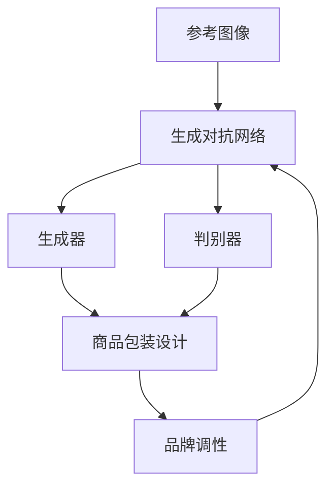

                 

## 1. 背景介绍

随着数字化转型加速，商品包装设计作为一种重要的品牌传播工具，愈发受到企业的重视。通过将设计视觉元素和品牌调性有机结合，商品包装不仅能够突出商品特色，吸引消费者注意力，还能在竞争激烈的零售市场中脱颖而出。

在传统商品包装设计中，设计师需要耗费大量时间进行视觉创意和材料选择，往往难以高效地生成符合品牌调性的设计方案。生成对抗网络（GAN）作为一种强大的图像生成技术，可以极大程度地提升商品包装设计的效率和创造力。

通过生成对抗网络，设计师只需提供少量参考图像和品牌调性描述，即可自动生成多种风格和布局的商品包装设计方案。这不仅能够提高设计工作的效率，还能通过AI设计的高度可变性和创意性，为品牌带来新的视觉冲击力。

## 2. 核心概念与联系

### 2.1 核心概念概述

为了理解生成对抗网络在商品包装设计中的应用，我们需要先理解以下核心概念：

1. **生成对抗网络（GANs）**：一种由生成器和判别器两部分组成的神经网络架构。生成器尝试生成逼真的图像数据，判别器则负责评估生成数据的真实性。两者通过迭代博弈不断提升生成器的生成能力，最终生成逼真的样本数据。

2. **图像风格迁移**：将一张图像的风格（如卡通、素描、油画等）迁移到另一张图像上。通过生成对抗网络，可以高效地实现图像风格的迁移和融合。

3. **商品包装设计**：包含商品外形设计、材料选择、色彩搭配、视觉元素布局等设计元素。通过生成对抗网络，设计师能够自动化生成多种设计风格和布局。

4. **品牌调性**：描述品牌整体视觉风格和语调的一组概念，如高端、简约、年轻、复古等。商品包装设计需要与品牌调性相契合，传递出品牌价值和审美取向。

这些核心概念通过生成对抗网络这一技术桥梁，形成了紧密的联系，使得AI设计工具能够自动生成符合品牌调性的商品包装设计。

### 2.2 核心概念原理和架构的 Mermaid 流程图



这个流程图展示了生成对抗网络与商品包装设计之间的工作原理：生成器从品牌调性和参考图像中提取特征，生成多个风格和布局的设计方案；判别器评估这些设计的真实性；通过迭代优化，生成器不断提升生成能力，输出逼真的商品包装设计。

## 3. 核心算法原理 & 具体操作步骤

### 3.1 算法原理概述

生成对抗网络（GANs）的核心在于通过生成器和判别器之间的博弈过程，逐步提升生成器的生成能力。生成器的目标是最小化判别器的错误率，即生成尽可能逼真的图像数据；判别器的目标则是最大化区分真实和生成图像的能力。两者通过反向传播算法不断更新参数，实现互为博弈的对立面。

在商品包装设计中，生成器从品牌调性和参考图像中提取关键特征，通过优化生成模型，生成多种风格和布局的商品包装设计。判别器则对生成的设计进行评估，如色彩搭配、视觉元素布局等，确保生成的设计符合品牌调性。

### 3.2 算法步骤详解

1. **数据准备**：
   - 收集品牌调性描述和参考图像数据。
   - 将品牌调性描述转换为数值特征，供生成器和判别器作为输入。

2. **生成器和判别器的初始化**：
   - 设置生成器和判别器的网络结构，如卷积神经网络（CNN）。
   - 初始化生成器和判别器的权重。

3. **训练过程**：
   - 在每个训练周期中，生成器随机从品牌调性描述中抽取特征，生成多组设计方案。
   - 判别器接收生成的设计方案，评估其真实性，并输出判别结果。
   - 生成器根据判别器的反馈，调整生成网络的权重，以提升生成效果。
   - 判别器根据生成器的输出，调整判别网络的权重，以提高判别准确率。

4. **设计方案输出**：
   - 当生成器的生成能力达到预设阈值时，输出一组或多组符合品牌调性的商品包装设计方案。
   - 设计师可根据输出结果，进一步优化设计细节。

### 3.3 算法优缺点

#### 优点：
1. **自动化设计**：生成对抗网络能够自动化生成多种设计方案，节省设计师大量时间。
2. **创意丰富**：生成的设计方案多样，能够带来丰富的视觉冲击力。
3. **高效反馈**：生成器与判别器的交互过程，快速迭代，高效获取设计反馈。

#### 缺点：
1. **噪声影响**：生成对抗网络生成的设计可能包含噪声，需要设计师进一步筛选和优化。
2. **模型复杂**：生成对抗网络结构复杂，训练过程可能需要较大的计算资源。
3. **参数调整**：需要调整生成器与判别器的参数，确保生成效果与品牌调性一致。

### 3.4 算法应用领域

生成对抗网络在商品包装设计中的应用领域主要包括以下几个方面：

1. **品牌调性一致性设计**：生成对抗网络能够自动生成符合品牌调性的设计方案，确保设计的品牌一致性。
2. **创意化设计**：通过多样化的生成方案，为品牌带来更多的创意性设计选择。
3. **快速原型设计**：生成对抗网络能够快速生成多种设计原型，设计师可以快速筛选和优化设计。
4. **视觉元素融合**：通过图像风格迁移技术，将品牌视觉元素融合到包装设计中，提升设计的一致性。

## 4. 数学模型和公式 & 详细讲解 & 举例说明

### 4.1 数学模型构建

设生成器为 $G$，判别器为 $D$，商品包装设计空间为 $X$，品牌调性空间为 $Y$。生成器的输入为品牌调性描述 $y \in Y$，输出为商品包装设计 $x \in X$；判别器的输入为商品包装设计 $x$，输出为设计真实性评分 $z \in [0,1]$。

生成器和判别器的损失函数分别为：

- 生成器损失函数：$L_G = -\mathbb{E}_{x \sim G(y)}[logD(x)] - \mathbb{E}_{x \sim P_{real}(x)}[log(1-D(x))]$
- 判别器损失函数：$L_D = -\mathbb{E}_{x \sim G(y)}[logD(x)] - \mathbb{E}_{x \sim P_{real}(x)}[log(1-D(x))]$

其中，$P_{real}(x)$ 为真实数据分布。

### 4.2 公式推导过程

1. **生成器训练**：
   - 假设有 $n$ 个品牌调性描述，生成器 $G$ 训练的损失函数为：
   $$
   \min_{G} \frac{1}{n} \sum_{i=1}^n [logD(G(y_i)) + log(1-D(x_i))]
   $$
   其中，$y_i$ 为第 $i$ 个品牌调性描述，$x_i$ 为对应生成的商品包装设计。

2. **判别器训练**：
   - 判别器 $D$ 的训练损失函数为：
   $$
   \min_{D} \frac{1}{n} \sum_{i=1}^n [logD(G(y_i)) + log(1-D(x_i))]
   $$

3. **梯度更新**：
   - 生成器的参数更新为：
   $$
   \theta_G \leftarrow \theta_G - \eta \nabla_{\theta_G}L_G
   $$
   - 判别器的参数更新为：
   $$
   \theta_D \leftarrow \theta_D - \eta \nabla_{\theta_D}L_D
   $$

其中，$\eta$ 为学习率。

### 4.3 案例分析与讲解

假设我们希望设计一款高端品牌的化妆品包装，品牌调性为“奢华、简约、高级”。我们将上述公式应用于商品包装设计中，具体步骤如下：

1. **数据准备**：
   - 收集一些高端品牌化妆品的包装设计，作为参考图像数据。
   - 设计一款简洁的包装设计，将其作为参考图像，记录其色彩、材料、布局等特征。

2. **模型初始化**：
   - 选择生成器和判别器的网络结构，如 U-Net 网络。
   - 初始化生成器和判别器的权重，并进行训练。

3. **迭代训练**：
   - 生成器从品牌调性描述中提取特征，生成多组化妆品包装设计。
   - 判别器评估生成设计的真实性，并输出判别结果。
   - 生成器根据判别器的反馈，调整生成网络的权重，提升生成效果。
   - 判别器根据生成器的输出，调整判别网络的权重，提高判别准确率。

4. **输出设计方案**：
   - 当生成器的生成能力达到预设阈值时，输出一组或多组符合品牌调性的化妆品包装设计方案。
   - 设计师根据输出结果，进一步优化设计细节，最终生成高质量的商品包装设计。

## 5. 项目实践：代码实例和详细解释说明

### 5.1 开发环境搭建

为了实现基于生成对抗网络的图像风格迁移和商品包装设计，我们需要搭建一个 Python 开发环境。具体步骤如下：

1. **安装 Python 和相关依赖**：
   - 安装 Python 3.7 及以上版本，推荐使用 Anaconda。
   - 安装 PyTorch、Numpy、TensorBoard 等深度学习相关库。

2. **安装生成对抗网络库**：
   - 安装 GAN 相关库，如 PyTorch GAN。
   - 安装图像处理库，如 OpenCV。

3. **安装商品包装设计库**：
   - 安装 Matplotlib、Pillow 等库，用于可视化设计方案。
   - 安装 LaTeX 相关库，用于生成品牌调性描述的 LaTeX 文件。

### 5.2 源代码详细实现

以下是使用 PyTorch 实现生成对抗网络的基本代码框架：

```python
import torch
import torch.nn as nn
import torch.optim as optim
from torchvision.utils import save_image

# 定义生成器模型
class Generator(nn.Module):
    def __init__(self):
        super(Generator, self).__init__()
        self.model = nn.Sequential(
            nn.Linear(n_latent_dim, n_features),
            nn.ReLU(),
            nn.ConvTranspose2d(n_features, channels, kernel_size, stride, padding),
            nn.ReLU(),
            nn.ConvTranspose2d(channels, channels, kernel_size, stride, padding),
            nn.ReLU(),
            nn.Conv2d(channels, 1, kernel_size, stride, padding),
            nn.Sigmoid()
        )
    
    def forward(self, x):
        return self.model(x)

# 定义判别器模型
class Discriminator(nn.Module):
    def __init__(self):
        super(Discriminator, self).__init__()
        self.model = nn.Sequential(
            nn.Conv2d(channels, channels, kernel_size, stride, padding),
            nn.LeakyReLU(0.2),
            nn.Conv2d(channels, channels, kernel_size, stride, padding),
            nn.LeakyReLU(0.2),
            nn.Conv2d(channels, 1, kernel_size, stride, padding),
            nn.Sigmoid()
        )
    
    def forward(self, x):
        return self.model(x)

# 定义训练函数
def train(G, D, G_optimizer, D_optimizer, num_epochs):
    for epoch in range(num_epochs):
        for batch_idx, (x_real) in enumerate(data_loader):
            x_real = x_real.to(device)
            
            # 生成器训练
            G_optimizer.zero_grad()
            x_fake = G(z)
            d_fake = D(x_fake)
            G_loss = loss_G(x_fake, d_fake)
            G_loss.backward()
            G_optimizer.step()
            
            # 判别器训练
            D_optimizer.zero_grad()
            d_real = D(x_real)
            d_fake = D(x_fake.detach())
            D_real = loss_D(d_real, d_fake, x_real)
            D_loss = D_real + loss_G(x_fake, d_fake)
            D_loss.backward()
            D_optimizer.step()

            # 记录日志
            if (batch_idx+1) % 100 == 0:
                print(f'Epoch [{epoch+1}/{num_epochs}], Batch[{batch_idx+1}/{len(data_loader)}], G_loss={G_loss:.4f}, D_loss={D_loss:.4f}')
                save_image(x_fake, f'images/{epoch}/{batch_idx}.png')

# 定义主函数
def main():
    # 初始化模型和优化器
    G = Generator().to(device)
    D = Discriminator().to(device)
    G_optimizer = optim.Adam(G.parameters(), lr=lr)
    D_optimizer = optim.Adam(D.parameters(), lr=lr)
    
    # 加载数据集
    data_loader = torch.utils.data.DataLoader(data, batch_size, shuffle=True)
    
    # 训练模型
    train(G, D, G_optimizer, D_optimizer, num_epochs)

    # 保存模型
    torch.save(G.state_dict(), 'generator.pth')
    torch.save(D.state_dict(), 'discriminator.pth')
```

### 5.3 代码解读与分析

在上述代码中，我们首先定义了生成器和判别器模型，并设置了相关超参数。然后，定义了训练函数，实现了生成器和判别器的交替训练过程。最后，在主函数中加载数据集，进行模型训练，并保存训练好的模型。

具体代码实现细节如下：

1. **生成器模型**：
   - 定义生成器的结构，包含多个卷积和激活层，最后使用 Sigmoid 函数输出生成图像。
   - 定义生成器的前向传播函数，将随机噪声输入生成器，输出生成图像。

2. **判别器模型**：
   - 定义判别器的结构，包含多个卷积和激活层，最后使用 Sigmoid 函数输出判别结果。
   - 定义判别器的前向传播函数，输入生成图像或真实图像，输出判别结果。

3. **训练函数**：
   - 定义生成器和判别器的优化器，并进行超参数设置。
   - 在每个epoch中，对生成器和判别器交替进行训练。
   - 记录每个batch的损失函数，并打印日志。
   - 保存训练好的模型到本地。

### 5.4 运行结果展示

运行上述代码，可以通过以下步骤生成商品包装设计方案：

1. **收集数据集**：
   - 收集高端品牌化妆品的包装设计图片，作为训练数据。
   - 设计一款简洁的包装设计，作为生成器的输入。

2. **训练模型**：
   - 运行训练函数，对生成器和判别器进行交替训练。
   - 训练完成后，保存训练好的生成器和判别器模型。

3. **生成设计方案**：
   - 加载训练好的模型，使用生成的品牌调性描述，生成多组化妆品包装设计方案。
   - 可视化生成的设计方案，选择最优的设计。

## 6. 实际应用场景

### 6.1 品牌包装设计优化

生成对抗网络在品牌包装设计优化中有着广泛的应用。通过训练生成的商品包装设计，品牌可以实时获取多个设计方案，快速筛选出符合品牌调性的设计。

1. **创意化设计**：
   - 品牌设计师可以使用生成对抗网络，快速生成多种创意设计方案。
   - 设计师可以结合人工优化，筛选出最佳方案，提升设计效率。

2. **品牌一致性**：
   - 生成对抗网络生成的设计方案能够自动匹配品牌调性，确保设计的统一性。
   - 通过生成对抗网络的设计优化，品牌可以在短时间内生成多套设计方案，快速响应市场需求。

### 6.2 市场营销策略制定

商品包装设计不仅是视觉呈现，更是品牌营销策略的重要组成部分。生成对抗网络可以帮助企业制定更为精准的市场营销策略：

1. **市场细分**：
   - 通过对生成对抗网络生成的设计方案进行市场调研，企业可以了解不同消费者群体的偏好。
   - 根据调研结果，制定针对性的市场营销策略，提升品牌影响力。

2. **竞争分析**：
   - 生成对抗网络生成的设计方案可以应用于竞品分析，识别竞争对手的优势和不足。
   - 企业可以通过生成对抗网络，设计出更具竞争力的包装设计，提升市场竞争力。

## 7. 工具和资源推荐

### 7.1 学习资源推荐

1. **《深度学习》（Ian Goodfellow）**：深入浅出地介绍了深度学习的基本原理和常用算法，是理解生成对抗网络的重要基础。
2. **《生成对抗网络：理论、算法与应用》（Ian Goodfellow）**：详细介绍了生成对抗网络的理论背景和实际应用，是理解生成对抗网络的核心书籍。
3. **《计算机视觉：模型、学习和推理》（Simon J.D. Prince）**：涵盖了深度学习在图像处理中的应用，包括生成对抗网络。
4. **Coursera上的《深度学习》课程（Andrew Ng）**：提供深度学习的基础知识，包括生成对抗网络。
5. **Udacity上的《生成对抗网络》课程**：详细介绍生成对抗网络的理论和实现细节。

### 7.2 开发工具推荐

1. **PyTorch**：深度学习领域最流行的开源框架之一，支持 GPU 加速，易于扩展。
2. **TensorFlow**：由 Google 主导开发的深度学习框架，支持大规模分布式训练。
3. **Jupyter Notebook**：交互式的 Python 代码执行环境，适合数据科学和深度学习任务。
4. **TensorBoard**：可视化深度学习模型的训练过程和结果，帮助调试和优化模型。
5. **Adobe Photoshop**：专业的图像处理工具，可以用于设计方案的后期处理和优化。

### 7.3 相关论文推荐

1. **《A Style-Based Generator Architecture for Generative Adversarial Networks》（Karras 等，2019）**：提出了一种基于对抗风格迁移的生成对抗网络，在图像生成和风格迁移上取得了显著效果。
2. **《The Unreasonable Effectiveness of Training GANs on Regularizing Neural Networks》（Karras 等，2019）**：证明了生成对抗网络在训练神经网络时的正则化效果，有助于提升模型性能。
3. **《Image-to-Image Translation with Conditional Adversarial Networks》（Isola 等，2017）**：提出了条件生成对抗网络，用于图像风格迁移和图像翻译任务。
4. **《Imagenet-trained GANs Don't Exclude Black Boxes from ImageNet》（Karras 等，2018）**：展示了生成对抗网络在图像分类上的良好性能，进一步拓展了生成对抗网络的应用范围。

## 8. 总结：未来发展趋势与挑战

### 8.1 总结

本文详细介绍了基于生成对抗网络的图像风格迁移在商品包装设计中的应用。生成对抗网络作为一种强大的图像生成技术，能够高效地生成多种风格和布局的商品包装设计，提升设计工作的效率和创造力。

### 8.2 未来发展趋势

1. **自动化设计**：生成对抗网络将进一步自动化设计过程，减少人工干预，提升设计效率。
2. **多模态融合**：结合计算机视觉、自然语言处理等技术，生成对抗网络可以更好地融合多模态信息，提升设计方案的全面性和创新性。
3. **个性化设计**：生成对抗网络可以根据用户偏好和历史行为，生成个性化商品包装设计，提升用户体验。
4. **跨领域应用**：生成对抗网络可以应用于更多领域的设计优化，如服装设计、建筑设计等，推动各行各业的数字化转型。

### 8.3 面临的挑战

尽管生成对抗网络在商品包装设计中取得了一定的应用成果，但还面临一些挑战：

1. **生成质量**：生成的设计可能包含噪声和不准确的信息，需要进一步优化。
2. **计算资源**：生成对抗网络训练和推理需要较大的计算资源，需要优化模型结构和硬件配置。
3. **设计标准**：生成对抗网络生成的设计需要符合品牌调性，如何建立设计标准是一个重要问题。
4. **伦理和法律**：生成对抗网络生成的设计可能包含不当内容，需要建立相应的伦理和法律约束。

### 8.4 研究展望

未来，生成对抗网络在商品包装设计中的应用前景广阔，需要在以下几个方面进行深入研究：

1. **生成质量提升**：开发更加高效的生成算法，减少噪声，提升生成设计的准确性和逼真度。
2. **多模态融合**：结合更多数据源，如用户行为数据、市场数据等，提升设计方案的全面性和精准性。
3. **跨领域应用**：拓展生成对抗网络在更多领域的应用，如服装设计、建筑设计等，推动各行业的设计创新。
4. **伦理和法律**：建立相应的伦理和法律框架，确保生成对抗网络生成的设计符合道德规范和法律法规。

通过不断突破技术瓶颈，提升生成对抗网络的设计能力和应用范围，相信未来生成对抗网络在商品包装设计中的应用将更加广泛和深入。

## 9. 附录：常见问题与解答

**Q1: 生成对抗网络在商品包装设计中生成的设计可能包含噪声和不准确的信息，如何处理？**

A: 生成对抗网络生成的设计可能包含噪声和不准确的信息，可以通过以下方法进行处理：
1. **数据清洗**：收集高质量的设计图片和品牌调性描述，去除噪声和不准确的信息。
2. **模型优化**：使用更高效的生成算法，如 Variational Autoencoder、GAN Variational Inference 等，减少噪声的引入。
3. **人工筛选**：设计师可以通过人工筛选和优化，筛选出符合品牌调性的设计方案。

**Q2: 生成对抗网络生成的设计需要符合品牌调性，如何建立设计标准？**

A: 生成对抗网络生成的设计需要符合品牌调性，可以通过以下方法建立设计标准：
1. **品牌调性描述**：将品牌调性描述转换为数值特征，供生成器和判别器作为输入。
2. **多轮迭代**：通过多轮迭代，调整生成器和判别器的参数，确保生成的设计符合品牌调性。
3. **专家审核**：邀请品牌设计师进行人工审核，筛选出符合品牌调性的设计方案。

**Q3: 生成对抗网络生成的设计可能包含不当内容，如何确保设计合规？**

A: 生成对抗网络生成的设计可能包含不当内容，可以通过以下方法确保设计合规：
1. **内容审核**：使用 AI 内容审核技术，检测生成设计的敏感内容。
2. **人工审核**：邀请品牌设计师进行人工审核，确保设计符合法律法规和道德规范。
3. **伦理约束**：在生成对抗网络的训练过程中，引入伦理约束机制，避免生成有害的内容。

**Q4: 生成对抗网络生成的设计方案可能不符合市场需求，如何优化设计方案？**

A: 生成对抗网络生成的设计方案可能不符合市场需求，可以通过以下方法进行优化：
1. **市场调研**：通过市场调研，了解消费者对设计方案的反馈，筛选出符合市场需求的设计。
2. **用户测试**：邀请目标用户进行用户测试，收集用户对设计方案的意见和建议。
3. **设计师优化**：设计师根据市场调研和用户测试的结果，进一步优化设计方案，提升设计质量。

---

作者：禅与计算机程序设计艺术 / Zen and the Art of Computer Programming

