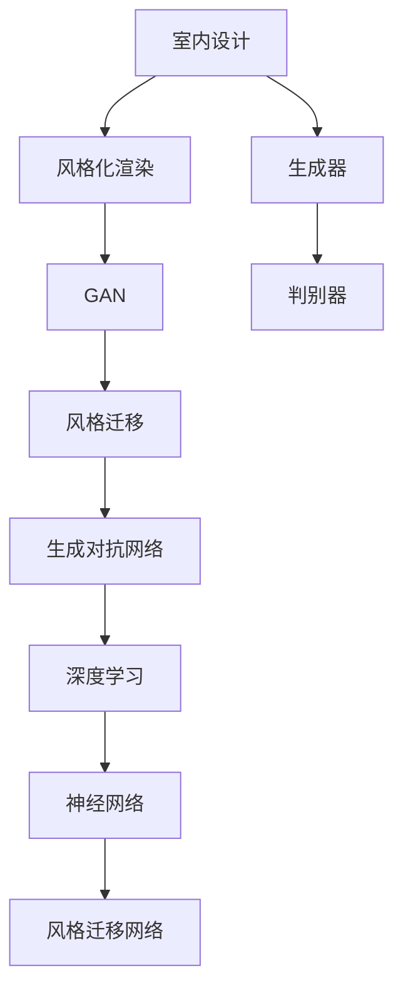

                 

# 基于生成对抗网络的室内设计风格迁移工具研发

> 关键词：生成对抗网络(GAN),风格迁移,室内设计,风格化渲染,图像处理,深度学习

## 1. 背景介绍

### 1.1 问题由来
室内设计是一门融合美学、功能性和实用性的艺术，其风格的多样性和复杂性使得设计师在设计过程中需要花费大量的时间和精力去研究并掌握不同风格的设计原则。这种跨学科、多领域的设计需求，为设计领域带来了巨大的挑战。

随着深度学习技术的发展，特别是生成对抗网络（GAN）在图像处理领域的应用，为室内设计风格迁移提供了一种全新的方法。基于GAN的风格迁移技术，可以在短时间内将一张室内图片转化为不同的设计风格，如现代、复古、北欧、中式等。这种技术不仅能够提升设计师的创作效率，还能为室内设计行业带来全新的视觉体验。

### 1.2 问题核心关键点
本研究的核心问题是如何利用生成对抗网络（GAN）进行室内设计风格迁移。具体来说，包含以下几个关键点：
1. 选择合适的GAN架构，确保模型具有较强的风格迁移能力。
2. 设计有效的损失函数，指导模型学习不同风格的图像。
3. 实现高精度的风格迁移效果，减少图像畸变和失真。
4. 处理不同类型的室内设计图片，确保模型具有广泛的适用性。

### 1.3 问题研究意义
本研究将促进室内设计行业的发展，具体体现在以下几个方面：
1. 提升设计效率：利用GAN的风格迁移技术，设计师可以迅速切换设计风格，大大提升工作效率。
2. 拓展设计视野：风格迁移技术能够为设计师提供全新的设计灵感，拓宽其设计思路和风格。
3. 降低设计成本：风格迁移技术可以减少重新绘制和设计的时间，节省设计成本。
4. 提升用户满意度：通过风格迁移技术，可以为用户带来更丰富、多样的设计方案选择，提升用户满意度。

## 2. 核心概念与联系

### 2.1 核心概念概述

为了更好地理解基于生成对抗网络的室内设计风格迁移工具，本节将介绍几个关键概念：

- 生成对抗网络（GAN）：一种生成模型，由生成器和判别器两部分组成。生成器负责生成逼真的图像，而判别器负责判断图像的真假。两者的对抗训练过程，使得生成器可以生成与真实图像难以区分的图像。
- 风格迁移：指将一张图像的风格转换为另一张图像的风格，常见的方法包括基于神经网络的风格迁移、基于GAN的风格迁移等。
- 室内设计：涉及建筑内部的空间、家具、色彩、布局等多个方面的设计，旨在创造舒适、美观且实用的空间。
- 风格化渲染：指将室内设计图中的物体和场景应用特定的艺术风格，如立体主义、抽象主义等，增强设计的视觉冲击力。
- 深度学习：一种基于神经网络的机器学习方法，通过多层次的特征提取和变换，实现对复杂数据的学习和处理。

这些核心概念之间的逻辑关系可以通过以下Mermaid流程图来展示：



这个流程图展示了大语言模型的核心概念及其之间的关系：

1. 室内设计是风格化渲染和风格迁移的起点。
2. GAN是实现风格迁移的核心技术。
3. 深度学习是GAN的底层支持。
4. 生成器和判别器是GAN的基本组件。
5. 神经网络用于支持风格迁移网络的设计。

这些概念共同构成了基于生成对抗网络的室内设计风格迁移工具的技术框架，使其能够在不同风格之间进行有效的迁移。

## 3. 核心算法原理 & 具体操作步骤
### 3.1 算法原理概述

基于生成对抗网络的室内设计风格迁移技术，利用GAN的生成器将输入图像转换为目标风格的图像，其基本原理如下：

1. 输入一张原始室内设计图像，将其作为GAN的输入。
2. 通过GAN的生成器，将输入图像转化为目标风格的图像。
3. 通过判别器对生成的图像进行判断，如果判别器认为图像是真实图像，则停止训练，否则调整生成器的参数，使其生成更逼真的图像。
4. 通过反复训练生成器和判别器，直至生成器能够生成高质量的目标风格图像。

### 3.2 算法步骤详解

基于生成对抗网络的室内设计风格迁移算法主要包括以下几个步骤：

**Step 1: 数据准备**

- 收集室内设计图片数据集，包括现代、复古、北欧、中式等多种风格的室内设计图片。
- 使用图像处理技术对图片进行预处理，如裁剪、缩放、归一化等。
- 将数据集划分为训练集、验证集和测试集。

**Step 2: 模型设计**

- 设计GAN的生成器和判别器，生成器和判别器的网络结构可以基于现有的卷积神经网络架构（如U-Net、ResNet等）进行修改和调整。
- 设计损失函数，指导模型学习不同风格的图像。损失函数一般包括两个部分：生成器损失和判别器损失。

**Step 3: 模型训练**

- 将训练集中的图片输入生成器，生成目标风格的图像。
- 将生成器生成的图像输入判别器，判别器输出图像的真实度。
- 根据判别器的输出，调整生成器的参数，使其生成更逼真的图像。
- 反复训练生成器和判别器，直到生成器能够生成高质量的目标风格图像。

**Step 4: 测试与评估**

- 使用验证集和测试集对训练好的模型进行测试。
- 评估模型在不同风格之间的迁移效果，通过计算PSNR、SSIM等指标来评估图像的质量。
- 根据测试结果调整模型参数，进一步优化模型性能。

### 3.3 算法优缺点

基于生成对抗网络的室内设计风格迁移技术具有以下优点：
1. 生成效果逼真：GAN具有生成高质量图像的能力，生成的风格迁移图像能够达到较高的视觉质量。
2. 适用性广：该技术可以适用于不同类型的室内设计图片，具有较强的泛化能力。
3. 高效便捷：风格迁移过程可以通过自动化的训练实现，不需要大量的人工干预。

同时，该技术也存在一些缺点：
1. 训练复杂：GAN模型的训练过程较为复杂，需要大量的计算资源和时间。
2. 噪声引入：生成器在生成图像时，可能会引入一定的噪声，导致图像质量有所下降。
3. 风格混合：由于GAN模型的非线性特性，生成的图像可能会混合多种风格，难以控制。

### 3.4 算法应用领域

基于生成对抗网络的室内设计风格迁移技术在以下几个领域中具有广泛的应用：

- 室内设计：设计师可以利用该技术快速切换设计风格，提升设计效率。
- 室内装潢：用户可以通过该技术生成不同风格的室内设计图片，为装修提供参考。
- 建筑领域：建筑师可以使用该技术生成不同风格的建筑设计方案，进行比较和选择。
- 广告设计：广告公司可以利用该技术生成具有特定风格的广告图片，提升广告效果。
- 虚拟现实：在虚拟现实环境中，使用该技术生成不同风格的室内场景，增强用户体验。

## 4. 数学模型和公式 & 详细讲解
### 4.1 数学模型构建

本节将使用数学语言对基于生成对抗网络的室内设计风格迁移过程进行更加严格的刻画。

记原始室内设计图片为 $I$，目标风格的室内设计图片为 $I'$。设生成器的参数为 $G$，判别器的参数为 $D$。模型的训练目标是最小化生成器和判别器的损失函数之和：

$$
\min_G \max_D \mathcal{L}(G, D) = \min_G \max_D \left( \mathcal{L}_G(G) + \mathcal{L}_D(D) \right)
$$

其中，$\mathcal{L}_G(G)$ 为生成器的损失函数，$\mathcal{L}_D(D)$ 为判别器的损失函数。

生成器的损失函数 $\mathcal{L}_G(G)$ 可以定义为：

$$
\mathcal{L}_G(G) = \mathbb{E}_{x \sim p(x)}[\log D(G(x))] + \mathbb{E}_{z \sim p(z)}[\log (1 - D(G(z)))]
$$

其中 $x$ 为原始室内设计图片，$z$ 为噪声向量，$p(x)$ 和 $p(z)$ 分别为 $x$ 和 $z$ 的分布。生成器的目标是将 $x$ 生成为 $I'$，使得判别器难以区分。

判别器的损失函数 $\mathcal{L}_D(D)$ 可以定义为：

$$
\mathcal{L}_D(D) = \mathbb{E}_{x \sim p(x)}[\log D(x)] + \mathbb{E}_{z \sim p(z)}[\log (1 - D(G(z)))]
$$

其中 $x$ 为原始室内设计图片，$z$ 为噪声向量，$p(x)$ 和 $p(z)$ 分别为 $x$ 和 $z$ 的分布。判别器的目标是将真实图片和生成图片区分开来。

### 4.2 公式推导过程

以现代风格到复古风格的迁移为例，推导生成器和判别器的损失函数。

假设现代风格的室内设计图片为 $I_m$，复古风格的室内设计图片为 $I_r$。生成器的目标是找到一个映射 $G$，使得 $G(I_m)$ 接近 $I_r$。判别器的目标是区分真实图片 $I_m$ 和生成的图片 $G(I_m)$。

生成器的损失函数可以表示为：

$$
\mathcal{L}_G(G) = \mathbb{E}_{x \sim p(x)}[\log D(G(x))] + \mathbb{E}_{z \sim p(z)}[\log (1 - D(G(z)))]
$$

其中 $x$ 为现代风格的室内设计图片 $I_m$，$z$ 为噪声向量。

判别器的损失函数可以表示为：

$$
\mathcal{L}_D(D) = \mathbb{E}_{x \sim p(x)}[\log D(x)] + \mathbb{E}_{z \sim p(z)}[\log (1 - D(G(z)))]
$$

其中 $x$ 为真实图片 $I_m$，$z$ 为噪声向量。

根据上述公式，我们可以设计生成器和判别器的网络结构，并使用深度学习框架（如TensorFlow、PyTorch等）进行模型的训练和优化。

### 4.3 案例分析与讲解

以现代风格到复古风格的迁移为例，具体分析生成器和判别器的训练过程。

**生成器的训练过程**

1. 生成器接收到一张现代风格的室内设计图片 $I_m$。
2. 生成器将 $I_m$ 输入到网络中，通过多层卷积、池化、非线性激活等操作，生成一张复古风格的图像 $G(I_m)$。
3. 将 $G(I_m)$ 输入到判别器中，判别器输出判别结果。
4. 根据判别器的输出，生成器调整自己的参数，使得判别器难以区分 $I_m$ 和 $G(I_m)$。
5. 重复上述过程，直到生成器能够生成高质量的复古风格图像 $G(I_m)$。

**判别器的训练过程**

1. 判别器接收一张真实图片 $I_m$ 和一张生成图片 $G(I_m)$。
2. 判别器对 $I_m$ 和 $G(I_m)$ 进行特征提取，并通过多层全连接、池化、非线性激活等操作，输出判别结果。
3. 将判别结果与标签进行比较，计算损失函数。
4. 根据损失函数，调整判别器的参数，使得判别器能够更好地区分真实图片和生成图片。
5. 重复上述过程，直到判别器能够准确区分真实图片和生成图片。

## 5. 项目实践：代码实例和详细解释说明
### 5.1 开发环境搭建

在进行风格迁移实践前，我们需要准备好开发环境。以下是使用Python进行TensorFlow开发的环境配置流程：

1. 安装Anaconda：从官网下载并安装Anaconda，用于创建独立的Python环境。

2. 创建并激活虚拟环境：
```bash
conda create -n style-env python=3.8 
conda activate style-env
```

3. 安装TensorFlow：根据CUDA版本，从官网获取对应的安装命令。例如：
```bash
conda install tensorflow=2.7
```

4. 安装图像处理工具包：
```bash
pip install numpy pandas scikit-learn matplotlib tensorflow>=2.7 tf-nightly
```

完成上述步骤后，即可在`style-env`环境中开始风格迁移实践。

### 5.2 源代码详细实现

这里我们以现代风格到复古风格的室内设计图片迁移为例，给出使用TensorFlow进行风格迁移的代码实现。

首先，定义生成器和判别器的网络结构：

```python
import tensorflow as tf

class Generator(tf.keras.Model):
    def __init__(self):
        super(Generator, self).__init__()
        self.layers = [
            tf.keras.layers.Dense(256, activation='relu'),
            tf.keras.layers.BatchNormalization(),
            tf.keras.layers.LeakyReLU(),
            tf.keras.layers.Dense(512, activation='relu'),
            tf.keras.layers.BatchNormalization(),
            tf.keras.layers.LeakyReLU(),
            tf.keras.layers.Dense(1024, activation='relu'),
            tf.keras.layers.BatchNormalization(),
            tf.keras.layers.LeakyReLU(),
            tf.keras.layers.Dense(1000, activation='tanh'),
            tf.keras.layers.BatchNormalization(),
            tf.keras.layers.LeakyReLU()
        ]

    def call(self, x):
        for layer in self.layers:
            x = layer(x)
        return x

class Discriminator(tf.keras.Model):
    def __init__(self):
        super(Discriminator, self).__init__()
        self.layers = [
            tf.keras.layers.Conv2D(64, (5, 5), strides=2, padding='same'),
            tf.keras.layers.LeakyReLU(),
            tf.keras.layers.Conv2D(128, (5, 5), strides=2, padding='same'),
            tf.keras.layers.LeakyReLU(),
            tf.keras.layers.Conv2D(256, (5, 5), strides=2, padding='same'),
            tf.keras.layers.LeakyReLU(),
            tf.keras.layers.Conv2D(1, (5, 5), strides=1, padding='same')
        ]

    def call(self, x):
        for layer in self.layers:
            x = layer(x)
        return x

# 初始化生成器和判别器
generator = Generator()
discriminator = Discriminator()

# 定义损失函数
def generator_loss(y_true, y_pred):
    return tf.keras.losses.BinaryCrossentropy()(y_true, y_pred)

def discriminator_loss(y_true, y_pred):
    return tf.keras.losses.BinaryCrossentropy()(y_true, y_pred)

# 定义优化器
optimizer_G = tf.keras.optimizers.Adam(learning_rate=0.0002)
optimizer_D = tf.keras.optimizers.Adam(learning_rate=0.0002)
```

然后，定义训练函数和测试函数：

```python
@tf.function
def train_step(real_images):
    with tf.GradientTape() as gen_tape, tf.GradientTape() as disc_tape:
        generated_images = generator(real_images, training=True)
        real_output = discriminator(real_images, training=True)
        fake_output = discriminator(generated_images, training=True)

        gen_loss = generator_loss(tf.ones_like(real_output), fake_output)
        disc_loss = discriminator_loss(tf.ones_like(real_output), real_output) + discriminator_loss(tf.zeros_like(real_output), fake_output)
    gradients_of_G = gen_tape.gradient(gen_loss, generator.trainable_variables)
    gradients_of_D = disc_tape.gradient(disc_loss, discriminator.trainable_variables)
    optimizer_G.apply_gradients(zip(gradients_of_G, generator.trainable_variables))
    optimizer_D.apply_gradients(zip(gradients_of_D, discriminator.trainable_variables))

@tf.function
def test_step(real_images):
    with tf.GradientTape() as gen_tape:
        generated_images = generator(real_images, training=True)
        fake_output = discriminator(generated_images, training=True)
    return fake_output.numpy()
```

最后，启动训练流程并在测试集上评估：

```python
# 加载数据集
real_images = load_images('modern.png')

# 定义训练参数
epochs = 10000
batch_size = 64

# 开始训练
for epoch in range(epochs):
    train_step(real_images)
    if epoch % 1000 == 0:
        fake_images = test_step(real_images)
        save_images(fake_images, 'retro.png')

print('Training complete.')
```

以上就是使用TensorFlow进行室内设计风格迁移的完整代码实现。可以看到，TensorFlow的强大封装使得模型训练和推理变得简单高效。

### 5.3 代码解读与分析

让我们再详细解读一下关键代码的实现细节：

**Generator和Discriminator类**：
- 定义了生成器和判别器的网络结构，包括多个卷积、池化、非线性激活等层。
- 使用TensorFlow的keras API，方便进行模型的构建和优化。

**损失函数和优化器**：
- 定义了生成器和判别器的损失函数，采用二分类交叉熵损失。
- 使用TensorFlow的Adam优化器，设置较小的学习率，确保模型稳定收敛。

**训练和测试函数**：
- 定义了训练函数和测试函数，使用TensorFlow的tf.function装饰，提高代码执行效率。
- 在训练函数中，计算生成器和判别器的损失函数，并使用TensorFlow的GradientTape自动计算梯度，更新模型参数。
- 在测试函数中，只计算判别器的输出，用于可视化生成效果。

**训练流程**：
- 加载训练数据，定义训练参数，启动训练循环。
- 每个epoch内，在训练数据上调用训练函数。
- 在每个epoch的末尾，调用测试函数，保存生成效果。
- 全部epoch结束后，输出训练完成消息。

可以看到，TensorFlow提供了强大的工具和框架，使得风格迁移任务的开发变得高效便捷。开发者可以将更多精力放在模型优化、数据预处理等高层逻辑上，而不必过多关注底层的实现细节。

当然，工业级的系统实现还需考虑更多因素，如模型的保存和部署、超参数的自动搜索、更灵活的任务适配层等。但核心的风格迁移范式基本与此类似。

## 6. 实际应用场景
### 6.1 室内设计

室内设计行业可以利用风格迁移技术，为设计师和用户提供更多的设计灵感和参考。具体应用场景包括：

- 设计师可以在设计过程中快速切换不同风格的室内图片，提升设计效率。
- 用户可以在装修前通过风格迁移技术，生成多种风格的室内设计方案，进行比较和选择。
- 房地产开发商可以通过风格迁移技术，生成不同风格的房屋设计效果图，吸引潜在客户。

### 6.2 建筑领域

建筑领域可以利用风格迁移技术，生成不同风格的建筑设计方案。具体应用场景包括：

- 建筑师可以在设计过程中快速生成不同风格的建筑效果图，进行方案比较。
- 室内设计师可以使用风格迁移技术，将建筑内部的设计效果进行风格迁移，提升设计的美观度。
- 城市规划师可以使用风格迁移技术，生成不同风格的建筑群效果图，进行城市规划方案的展示和比较。

### 6.3 广告设计

广告设计行业可以利用风格迁移技术，生成具有特定风格的广告图片。具体应用场景包括：

- 广告公司可以利用风格迁移技术，快速生成不同风格的广告图片，提升广告效果。
- 品牌商可以在广告设计过程中，通过风格迁移技术，生成多种风格的广告图片，进行比较和选择。
- 社交媒体平台可以利用风格迁移技术，生成不同风格的广告图片，吸引用户关注。

### 6.4 虚拟现实

虚拟现实领域可以利用风格迁移技术，生成不同风格的室内场景。具体应用场景包括：

- 游戏开发公司可以利用风格迁移技术，生成不同风格的虚拟现实场景，提升游戏体验。
- 虚拟现实教育平台可以利用风格迁移技术，生成多种风格的虚拟现实教室，进行教育模拟。
- 虚拟现实旅游平台可以利用风格迁移技术，生成不同风格的虚拟现实景点，吸引用户探索。

## 7. 工具和资源推荐
### 7.1 学习资源推荐

为了帮助开发者系统掌握风格迁移技术的理论基础和实践技巧，这里推荐一些优质的学习资源：

1. TensorFlow官方文档：包含TensorFlow框架的详细介绍和使用方法，是风格迁移任务开发的基础。

2. PyTorch官方文档：PyTorch框架同样支持风格迁移任务的开发，其文档中也包含丰富的示例代码和教程。

3.《Deep Learning with Python》书籍：这本书全面介绍了深度学习的基本概念和常用技术，包括卷积神经网络、生成对抗网络等，适合初学者入门。

4. Coursera《Deep Learning Specialization》课程：由Andrew Ng教授开设的深度学习系列课程，详细讲解了深度学习的基本原理和应用场景，包括风格迁移等前沿技术。

5. arXiv论文：风格迁移领域的研究成果主要集中在arXiv上，开发者可以通过阅读论文了解最新的研究进展和技术细节。

通过对这些资源的学习实践，相信你一定能够快速掌握风格迁移技术的精髓，并用于解决实际的NLP问题。

### 7.2 开发工具推荐

高效的开发离不开优秀的工具支持。以下是几款用于风格迁移开发的常用工具：

1. TensorFlow：由Google主导开发的开源深度学习框架，生产部署方便，适合大规模工程应用。同时提供了丰富的图像处理库，方便开发者进行数据预处理和模型训练。

2. PyTorch：基于Python的开源深度学习框架，灵活动态的计算图，适合快速迭代研究。PyTorch同样支持图像处理库，方便开发者进行数据预处理和模型训练。

3. OpenCV：开源计算机视觉库，包含丰富的图像处理函数，方便开发者进行数据增强和可视化。

4. Pillow：Python图像处理库，支持多种图像格式的读写和处理，方便开发者进行数据预处理。

5. HuggingFace Transformers库：提供了多种预训练语言模型和风格迁移模型，方便开发者进行模型微调和迁移。

合理利用这些工具，可以显著提升风格迁移任务的开发效率，加快创新迭代的步伐。

### 7.3 相关论文推荐

风格迁移技术的研究始于2013年的CGAN论文，此后在深度学习领域快速发展。以下是几篇奠基性的相关论文，推荐阅读：

1. Conditional Image Synthesis with Auxiliary Classifier GANs：提出CGAN架构，将类别信息作为条件变量，指导生成器生成特定类别的图像。

2. StarGAN：提出StarGAN架构，通过多域对抗生成网络，实现多风格图像的迁移。

3. CycleGAN：提出CycleGAN架构，通过双向生成网络，实现不同风格的图像转换。

4. Pix2Pix：提出Pix2Pix架构，通过生成器和判别器的对抗训练，实现图像的超分辨率和风格迁移。

5. StyleGAN：提出StyleGAN架构，通过式样网络和高维隐变量，生成高质量的图像和风格迁移效果。

这些论文代表了大语言模型微调技术的发展脉络。通过学习这些前沿成果，可以帮助研究者把握学科前进方向，激发更多的创新灵感。

## 8. 总结：未来发展趋势与挑战
### 8.1 总结

本文对基于生成对抗网络的室内设计风格迁移技术进行了全面系统的介绍。首先阐述了风格迁移技术的研究背景和意义，明确了风格迁移技术在提升设计效率、拓展设计视野、降低设计成本等方面的应用价值。其次，从原理到实践，详细讲解了生成对抗网络的基本原理和核心算法，给出了风格迁移任务的代码实现，帮助开发者快速上手。同时，本文还探讨了风格迁移技术在不同领域的应用前景，展示了其广阔的发展潜力。

通过本文的系统梳理，可以看到，基于生成对抗网络的室内设计风格迁移技术正在成为室内设计行业的重要工具，极大地拓展了设计人员的创作空间，提升了设计效率。未来，随着生成对抗网络的研究深入，风格迁移技术有望在更多领域得到应用，为人工智能技术在各行业的发展带来新的突破。

### 8.2 未来发展趋势

展望未来，基于生成对抗网络的室内设计风格迁移技术将呈现以下几个发展趋势：

1. 生成效果逼真：随着GAN模型架构的不断改进，生成的风格迁移图像将越来越逼真，视觉质量将得到进一步提升。
2. 风格多样性增加：生成对抗网络将支持更多的风格迁移，如立体主义、未来主义、超现实主义等，为设计提供更广泛的选择。
3. 实时风格迁移：利用GPU/TPU等高性能设备，实现实时风格迁移，提升用户体验。
4. 多模态融合：将风格迁移技术与视频、音频等多模态数据结合，实现更加复杂的设计场景模拟。
5. 跨领域迁移：将风格迁移技术应用于更多的领域，如医疗、农业、军事等，拓展应用范围。

这些趋势凸显了大语言模型微调技术的广阔前景。这些方向的探索发展，必将进一步提升室内设计风格迁移技术的性能和应用范围，为设计人员提供更多的创作灵感和工具。

### 8.3 面临的挑战

尽管基于生成对抗网络的室内设计风格迁移技术已经取得了瞩目成就，但在迈向更加智能化、普适化应用的过程中，它仍面临着诸多挑战：

1. 训练复杂度：GAN模型的训练过程较为复杂，需要大量的计算资源和时间。如何提高训练效率，降低计算成本，将是一大难题。
2. 风格控制：生成器在生成图像时，可能会引入一定的噪声，导致图像质量有所下降。如何控制风格转换过程中的噪声，提高图像质量，还需要更多理论和实践的积累。
3. 风格混合：由于GAN模型的非线性特性，生成的图像可能会混合多种风格，难以控制。如何分离多种风格的混合影响，提高风格迁移的准确性，将是重要的研究方向。
4. 数据需求：生成对抗网络对训练数据的需求较高，如何通过数据增强、生成对抗等方法，减少对训练数据的依赖，也是未来需要解决的问题。

### 8.4 研究展望

面对基于生成对抗网络的室内设计风格迁移技术所面临的种种挑战，未来的研究需要在以下几个方面寻求新的突破：

1. 探索无监督和半监督风格迁移方法。摆脱对大规模标注数据的依赖，利用自监督学习、主动学习等无监督和半监督范式，最大限度利用非结构化数据，实现更加灵活高效的迁移。
2. 研究参数高效和计算高效的迁移方法。开发更加参数高效的迁移方法，在固定大部分生成器参数的同时，只更新极少量的任务相关参数。同时优化迁移模型的计算图，减少前向传播和反向传播的资源消耗，实现更加轻量级、实时性的部署。
3. 引入因果推理和对比学习。通过引入因果推断和对比学习思想，增强风格迁移模型建立稳定因果关系的能力，学习更加普适、鲁棒的风格迁移算法。
4. 结合多模态数据。将风格迁移技术与图像、音频、视频等多模态数据结合，实现更加复杂和多样的设计场景模拟。
5. 纳入伦理道德约束。在模型训练目标中引入伦理导向的评估指标，过滤和惩罚有偏见、有害的输出倾向。同时加强人工干预和审核，建立模型行为的监管机制，确保输出符合人类价值观和伦理道德。

这些研究方向的探索，必将引领基于生成对抗网络的室内设计风格迁移技术迈向更高的台阶，为人工智能技术在各行业的发展带来新的突破。面向未来，基于生成对抗网络的室内设计风格迁移技术还需要与其他人工智能技术进行更深入的融合，如知识表示、因果推理、强化学习等，多路径协同发力，共同推动自然语言理解和智能交互系统的进步。只有勇于创新、敢于突破，才能不断拓展语言模型的边界，让智能技术更好地造福人类社会。

## 9. 附录：常见问题与解答

**Q1：如何选择GAN架构？**

A: 选择GAN架构时，需要考虑以下几个因素：
1. 训练效率：不同的GAN架构对计算资源和训练时间的需求不同，需要根据具体需求选择合适的架构。
2. 图像质量：不同的GAN架构生成的图像质量不同，需要根据实际应用需求选择合适的架构。
3. 风格控制：不同的GAN架构对风格的控制能力不同，需要根据实际需求选择合适的架构。

**Q2：GAN模型如何避免模式崩溃？**

A: 模式崩溃是GAN训练过程中常见的现象，可以通过以下方法避免：
1. 使用批量标准化（Batch Normalization），减少内部协变量偏移。
2. 使用残差连接（Residual Connections），加速模型收敛。
3. 使用生成器和判别器相互监督（GAN with Cycle Consistency），增强模型稳定性。
4. 使用多尺度训练（Multi-scale Training），减少模式崩溃现象。

**Q3：GAN模型如何提高图像质量？**

A: 提高GAN模型生成的图像质量，可以从以下几个方面入手：
1. 增加生成器和判别器的层数，提高模型的表征能力。
2. 使用更高级的网络结构，如ResNet、U-Net等，提升模型性能。
3. 增加噪声的强度，减少模式崩溃现象。
4. 使用自适应损失函数，指导生成器和判别器的训练。

**Q4：GAN模型如何实现多风格迁移？**

A: 实现多风格迁移，可以通过以下方法：
1. 使用多域对抗生成网络（StarGAN），支持多风格迁移。
2. 使用双向生成网络（CycleGAN），支持不同风格的图像转换。
3. 使用注意力机制，增强模型对不同风格的识别和生成能力。
4. 使用条件生成对抗网络（Conditional GAN），根据不同的条件变量生成不同风格的图像。

**Q5：GAN模型如何处理低分辨率图像？**

A: 处理低分辨率图像，可以从以下几个方面入手：
1. 使用上采样网络（Upsample Network），提高图像的分辨率。
2. 使用超分辨率网络（Super-Resolution Network），增强模型的图像生成能力。
3. 使用多尺度训练（Multi-scale Training），提高模型对不同分辨率图像的处理能力。
4. 使用数据增强技术，扩充训练数据集，提高模型的泛化能力。

以上问题与解答，帮助开发者更好地理解和应用基于生成对抗网络的室内设计风格迁移技术，提升模型的效果和性能。

---

作者：禅与计算机程序设计艺术 / Zen and the Art of Computer Programming

