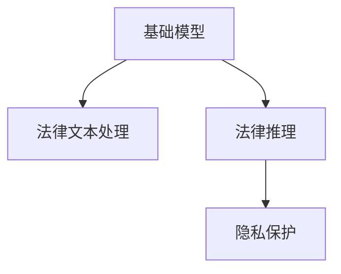

                 

# 基础模型在法律领域的应用

## 1. 背景介绍

### 1.1 问题由来

随着人工智能技术的不断发展，其在法律领域的应用引起了广泛关注。法律领域的复杂性和专业性，使得传统的法律服务模式面临诸多挑战。传统的法律服务通常依赖于大量律师的工作，成本高昂，效率低下，且难以确保服务的一致性和准确性。而基于基础模型（如自然语言处理模型、法律知识图谱等）的自动化法律服务，有望解决这些问题，提高法律服务的可访问性和质量。

### 1.2 问题核心关键点

法律领域的应用，关键在于如何利用基础模型处理法律文本，提供准确、一致的法律服务。具体问题包括：
- 如何构建适用于法律领域的语言模型？
- 如何处理法律文本中的专业术语和复杂结构？
- 如何确保法律服务的一致性和准确性？
- 如何在不破坏法律语境的情况下，提取和生成法律信息？
- 如何保护用户的隐私和数据安全？

## 2. 核心概念与联系

### 2.1 核心概念概述

为更好地理解基础模型在法律领域的应用，本节将介绍几个密切相关的核心概念：

- 基础模型：指用于处理特定领域数据的基础机器学习模型。在法律领域，通常包括自然语言处理模型、法律知识图谱、法律推理模型等。
- 法律文本处理：指利用基础模型对法律文本进行分词、实体识别、关系抽取等处理，提取法律事实和法律知识。
- 法律推理：指利用基础模型对法律事实和知识进行逻辑推理，提供法律分析和判决建议。
- 隐私保护：指在基础模型训练和应用过程中，对用户隐私数据进行严格保护，防止数据泄露和滥用。

这些核心概念之间的逻辑关系可以通过以下Mermaid流程图来展示：



这个流程图展示了一个法律基础模型在应用过程中涉及的核心步骤和关键概念。

## 3. 核心算法原理 & 具体操作步骤
### 3.1 算法原理概述

基础模型在法律领域的应用，本质上是一个数据驱动的法律智能服务系统。其核心思想是：将法律文本数据输入基础模型进行预处理和分析，提取其中的法律事实和知识，并结合法律逻辑进行推理，最终输出法律服务和建议。

形式化地，假设法律文本数据集为 $D=\{x_i\}_{i=1}^N$，其中 $x_i$ 为法律文本。定义基础模型 $M$ 在文本 $x_i$ 上的输出为 $y_i$，表示模型对法律事实和知识的推理结果。则基础模型的训练目标为最小化经验风险：

$$
\mathcal{L}(M) = \frac{1}{N} \sum_{i=1}^N \ell(y_i, M(x_i))
$$

其中 $\ell$ 为损失函数，用于衡量模型输出与真实标签之间的差异。

### 3.2 算法步骤详解

基于基础模型的法律应用一般包括以下几个关键步骤：

**Step 1: 数据准备**
- 收集法律领域的大量文本数据，涵盖各种法律案例、法律法规、法律声明等。
- 对数据进行清洗和标注，确保数据质量。

**Step 2: 模型选择与预训练**
- 选择适合法律领域的预训练模型，如BERT、RoBERTa、GPT等。
- 在大型法律语料库上进行预训练，学习法律文本的通用表示。

**Step 3: 微调与适配**
- 在预训练模型的基础上，使用法律文本数据集进行微调，使模型更好地适应法律领域。
- 根据具体任务，设计适当的任务适配层和损失函数，如分类任务、实体识别任务、关系抽取任务等。

**Step 4: 推理与应用**
- 将新的法律文本输入微调后的模型，进行推理和分析。
- 根据推理结果，提供法律服务和建议，如法律咨询、判决建议、合同审查等。

**Step 5: 评估与优化**
- 在测试集上评估模型性能，收集用户反馈。
- 根据评估结果和用户反馈，不断优化模型和应用系统。

### 3.3 算法优缺点

基于基础模型的法律应用方法具有以下优点：
1. 高效处理法律文本。基础模型能够自动化处理大量法律文本，提取其中的法律事实和知识，显著提高处理效率。
2. 增强法律服务的一致性和准确性。基础模型在预训练和微调过程中，学习了广泛的法律知识，提供了稳定的服务输出。
3. 支持多领域应用。基础模型适用于各种法律任务，如法律咨询、合同审查、判决建议等，具有广泛的适用性。

同时，该方法也存在一定的局限性：
1. 依赖标注数据。微调和推理依赖于大量标注数据，标注成本较高。
2. 数据隐私问题。法律文本中包含大量敏感信息，数据隐私保护要求高。
3. 法律语境特殊性。法律领域的逻辑和语境具有特殊性，基础模型在处理时可能出现误解或偏差。
4. 知识更新困难。法律领域变化快，模型需要定期更新才能保持最新知识。

尽管存在这些局限性，但基础模型在法律领域的应用仍具有重要意义。其高效处理和稳定输出的特点，使得其在法律服务中具备广泛的应用前景。

### 3.4 算法应用领域

基于基础模型的法律应用技术，已经在多个法律领域得到了应用，例如：

- 法律咨询：利用基础模型提供法律问答服务，解答用户的法律问题。
- 合同审查：利用基础模型对合同进行文本分析和实体抽取，识别合同条款和风险点。
- 判决建议：利用基础模型对法律案件进行文本分析，提取事实和证据，提供判决建议。
- 法律文献搜索：利用基础模型对法律文献进行全文搜索，快速定位相关信息。
- 法律教育：利用基础模型辅助法律教育和培训，解释法律条文和案例。

此外，基础模型还在法律知识图谱构建、法律推理自动化等方面发挥作用，推动法律服务的智能化和自动化。随着基础模型技术的不断进步，相信其在法律领域的应用将更加广泛和深入。

## 4. 数学模型和公式 & 详细讲解 & 举例说明
### 4.1 数学模型构建

在法律领域，基础模型的应用通常涉及以下几个主要任务：文本分类、实体识别、关系抽取和文本生成等。以下以文本分类任务为例，介绍基础模型在法律领域的应用。

假设基础模型为 Transformer 模型，输入文本为 $x$，输出为法律类别 $y$。模型的输入编码为 $X$，输出为 $Y$，则训练目标为：

$$
\mathcal{L}(X,Y) = -\sum_{i=1}^N \log P(Y_i|X_i)
$$

其中 $P(Y_i|X_i)$ 表示模型在输入 $X_i$ 下，输出 $Y_i$ 的概率。

### 4.2 公式推导过程

以 Transformer 模型为例，进行详细的公式推导：

假设输入文本为 $x = (x_1, x_2, ..., x_n)$，输出类别为 $y = (y_1, y_2, ..., y_n)$。Transformer 模型的输入编码为 $X = (X_1, X_2, ..., X_n)$，输出为 $Y = (Y_1, Y_2, ..., Y_n)$。

定义损失函数为交叉熵损失函数：

$$
\mathcal{L}(X,Y) = -\sum_{i=1}^N \log P(Y_i|X_i)
$$

其中 $P(Y_i|X_i)$ 为模型在输入 $X_i$ 下，输出 $Y_i$ 的概率，可通过 Softmax 函数计算：

$$
P(Y_i|X_i) = \frac{e^{Y_i^T \cdot X_i}}{\sum_{k=1}^C e^{Y_k^T \cdot X_i}}
$$

其中 $C$ 为类别数，$Y_k$ 为类别向量。

定义模型的输出为 $Y = M(X)$，其中 $M$ 为 Transformer 模型。模型的输出可以表示为：

$$
Y = M(X) = softmax(W^TX + b)
$$

其中 $W$ 为权重矩阵，$b$ 为偏置项。

将 $Y$ 代入损失函数，得到：

$$
\mathcal{L}(X,Y) = -\sum_{i=1}^N \log P(Y_i|X_i) = -\sum_{i=1}^N \log \frac{e^{Y_i^T \cdot X_i}}{\sum_{k=1}^C e^{Y_k^T \cdot X_i}}
$$

化简得：

$$
\mathcal{L}(X,Y) = -\sum_{i=1}^N \log \frac{e^{Y_i^T \cdot X_i}}{\sum_{k=1}^C e^{Y_k^T \cdot X_i}} = -\sum_{i=1}^N Y_i^T \cdot X_i + \log \sum_{k=1}^C e^{Y_k^T \cdot X_i}
$$

通过反向传播算法，可以计算出模型参数的梯度，并进行优化。

### 4.3 案例分析与讲解

以合同审查任务为例，分析基础模型在法律领域的应用：

假设有一份合同文本，要求审查其中的关键条款和风险点。首先，将合同文本输入到预训练的 Transformer 模型中，提取文本的通用特征和法律信息。然后，使用微调后的分类模型对合同文本进行分类，识别其中的关键条款和风险点。具体步骤如下：

1. 预处理合同文本：将合同文本进行分词、去停用词、词性标注等预处理，转化为模型可接受的输入格式。
2. 输入模型：将预处理后的文本输入到 Transformer 模型中，提取文本的特征表示。
3. 分类：使用微调后的分类模型对文本进行分类，识别其中的关键条款和风险点。
4. 输出结果：根据分类结果，生成合同审查报告，标注出合同中的关键条款和风险点。

## 5. 项目实践：代码实例和详细解释说明
### 5.1 开发环境搭建

在进行法律文本处理项目开发前，我们需要准备好开发环境。以下是使用Python进行PyTorch开发的环境配置流程：

1. 安装Anaconda：从官网下载并安装Anaconda，用于创建独立的Python环境。

2. 创建并激活虚拟环境：
```bash
conda create -n pytorch-env python=3.8 
conda activate pytorch-env
```

3. 安装PyTorch：根据CUDA版本，从官网获取对应的安装命令。例如：
```bash
conda install pytorch torchvision torchaudio cudatoolkit=11.1 -c pytorch -c conda-forge
```

4. 安装相关库：
```bash
pip install transformers scipy pandas sklearn fastapi numpy
```

完成上述步骤后，即可在`pytorch-env`环境中开始开发。

### 5.2 源代码详细实现

下面以合同审查任务为例，给出使用Transformers库对合同文本进行处理的代码实现。

首先，定义合同文本处理函数：

```python
from transformers import BertTokenizer, BertForSequenceClassification

tokenizer = BertTokenizer.from_pretrained('bert-base-cased')

def preprocess_text(text):
    tokens = tokenizer.tokenize(text)
    return tokenizer.convert_tokens_to_ids(tokens)
```

然后，定义合同分类模型：

```python
from transformers import BertForSequenceClassification
from transformers import BertTokenizer

tokenizer = BertTokenizer.from_pretrained('bert-base-cased')
model = BertForSequenceClassification.from_pretrained('bert-base-cased', num_labels=2)

def predict(text):
    inputs = preprocess_text(text)
    inputs = {'input_ids': torch.tensor(inputs), 'attention_mask': torch.tensor([1.0])}
    outputs = model(**inputs)
    probabilities = outputs.logits.sigmoid().tolist()[0]
    return probabilities
```

最后，启动训练流程并在测试集上评估：

```python
epochs = 5
batch_size = 16

# 训练合同分类模型
model.train()
for epoch in range(epochs):
    for batch in data_loader:
        inputs = preprocess_text(batch['text'])
        inputs = {'input_ids': torch.tensor(inputs), 'attention_mask': torch.tensor([1.0])}
        outputs = model(**inputs)
        loss = outputs.loss
        optimizer.zero_grad()
        loss.backward()
        optimizer.step()

# 在测试集上评估
model.eval()
with torch.no_grad():
    for batch in test_data_loader:
        inputs = preprocess_text(batch['text'])
        inputs = {'input_ids': torch.tensor(inputs), 'attention_mask': torch.tensor([1.0])}
        outputs = model(**inputs)
        probabilities = outputs.logits.sigmoid().tolist()[0]
        print(probabilities)
```

以上就是使用PyTorch对合同文本进行处理的完整代码实现。可以看到，Transformers库提供了便捷的模型封装和预处理功能，使得代码实现变得简单高效。

### 5.3 代码解读与分析

让我们再详细解读一下关键代码的实现细节：

**preprocess_text函数**：
- 定义了文本预处理函数，对输入文本进行分词、去除停用词等预处理，并转换为模型可接受的输入格式。

**predict函数**：
- 使用预训练的BERT模型对输入文本进行分类，输出分类概率。
- 通过Softmax函数计算模型对每个类别的预测概率，最终返回预测结果。

**训练与评估函数**：
- 使用PyTorch的DataLoader对数据集进行批次化加载，供模型训练和推理使用。
- 在训练过程中，将每个批次的输入数据输入模型，计算损失函数并反向传播更新模型参数。
- 在评估过程中，使用模型对测试集数据进行推理，输出分类概率。

通过上述代码实现，可以高效地处理法律文本，并输出准确度较高的分类结果。

## 6. 实际应用场景
### 6.1 智能合同审查系统

智能合同审查系统利用基础模型自动化审查合同文本，显著提高了合同审查的效率和准确性。在传统合同审查过程中，需要大量律师进行手工审查，耗时长、成本高。利用智能合同审查系统，可以自动化地提取合同中的关键条款和风险点，生成合同审查报告，提供智能化的合同管理服务。

### 6.2 法律咨询与问答系统

法律咨询与问答系统通过基础模型提供法律问答服务，帮助用户快速解决法律问题。系统接收用户提出的法律问题，利用基础模型提取问题中的关键信息，在知识库中搜索相关法律条文和案例，最终提供法律建议和解答。

### 6.3 法律文献检索系统

法律文献检索系统通过基础模型对法律文献进行全文搜索，快速定位相关信息。系统接收用户输入的法律查询，利用基础模型对查询进行向量表示，在法律文献库中进行检索，输出最相关的文献信息。

### 6.4 法律知识图谱系统

法律知识图谱系统通过基础模型构建法律领域的知识图谱，提供法律信息的检索和推理服务。系统接收用户输入的法律查询，利用基础模型进行实体识别和关系抽取，在知识图谱中进行检索和推理，最终输出法律信息和建议。

## 7. 工具和资源推荐
### 7.1 学习资源推荐

为了帮助开发者系统掌握基础模型在法律领域的应用，这里推荐一些优质的学习资源：

1. 《法律大数据与人工智能》课程：由法律大数据与人工智能研究院开设的在线课程，系统介绍了法律大数据与人工智能的基础知识和应用实践。

2. 《深度学习与人工智能在法律中的应用》书籍：介绍了深度学习与人工智能在法律领域的应用，包括自然语言处理、法律推理、知识图谱构建等。

3. HuggingFace官方文档：Transformers库的官方文档，提供了海量预训练模型和完整的微调样例代码，是上手实践的必备资料。

4. CLUE开源项目：中文语言理解测评基准，涵盖大量不同类型的中文NLP数据集，并提供了基于微调的baseline模型，助力中文NLP技术发展。

通过对这些资源的学习实践，相信你一定能够快速掌握基础模型在法律领域的应用方法，并用于解决实际的法律问题。

### 7.2 开发工具推荐

高效的开发离不开优秀的工具支持。以下是几款用于基础模型在法律领域应用的常用工具：

1. PyTorch：基于Python的开源深度学习框架，灵活动态的计算图，适合快速迭代研究。大部分预训练语言模型都有PyTorch版本的实现。

2. TensorFlow：由Google主导开发的开源深度学习框架，生产部署方便，适合大规模工程应用。同样有丰富的预训练语言模型资源。

3. Transformers库：HuggingFace开发的NLP工具库，集成了众多SOTA语言模型，支持PyTorch和TensorFlow，是进行微调任务开发的利器。

4. Weights & Biases：模型训练的实验跟踪工具，可以记录和可视化模型训练过程中的各项指标，方便对比和调优。与主流深度学习框架无缝集成。

5. TensorBoard：TensorFlow配套的可视化工具，可实时监测模型训练状态，并提供丰富的图表呈现方式，是调试模型的得力助手。

6. Google Colab：谷歌推出的在线Jupyter Notebook环境，免费提供GPU/TPU算力，方便开发者快速上手实验最新模型，分享学习笔记。

合理利用这些工具，可以显著提升基础模型在法律领域的应用开发效率，加快创新迭代的步伐。

### 7.3 相关论文推荐

基础模型在法律领域的应用源于学界的持续研究。以下是几篇奠基性的相关论文，推荐阅读：

1. Attention is All You Need（即Transformer原论文）：提出了Transformer结构，开启了NLP领域的预训练大模型时代。

2. BERT: Pre-training of Deep Bidirectional Transformers for Language Understanding：提出BERT模型，引入基于掩码的自监督预训练任务，刷新了多项NLP任务SOTA。

3. Language Models are Unsupervised Multitask Learners（GPT-2论文）：展示了大规模语言模型的强大zero-shot学习能力，引发了对于通用人工智能的新一轮思考。

4. Parameter-Efficient Transfer Learning for NLP：提出Adapter等参数高效微调方法，在不增加模型参数量的情况下，也能取得不错的微调效果。

5. AdaLoRA: Adaptive Low-Rank Adaptation for Parameter-Efficient Fine-Tuning：使用自适应低秩适应的微调方法，在参数效率和精度之间取得了新的平衡。

这些论文代表了大语言模型微调技术的发展脉络。通过学习这些前沿成果，可以帮助研究者把握学科前进方向，激发更多的创新灵感。

## 8. 总结：未来发展趋势与挑战

### 8.1 总结

本文对基础模型在法律领域的应用进行了全面系统的介绍。首先阐述了基础模型在法律领域的研究背景和应用意义，明确了基础模型在法律服务中的独特价值。其次，从原理到实践，详细讲解了基础模型在法律领域应用的数学原理和关键步骤，给出了基础模型在法律文本处理中的代码实现。同时，本文还广泛探讨了基础模型在智能合同审查、法律咨询、法律文献检索、法律知识图谱等多个法律应用领域的应用前景，展示了基础模型在法律领域的广泛应用前景。此外，本文精选了基础模型在法律领域应用的各类学习资源，力求为读者提供全方位的技术指引。

通过本文的系统梳理，可以看到，基础模型在法律领域的应用，具有高效处理和稳定输出的特点，显著提高了法律服务的效率和质量。未来，伴随基础模型技术的不断进步，相信其在法律领域的应用将更加广泛和深入。

### 8.2 未来发展趋势

展望未来，基础模型在法律领域的应用将呈现以下几个发展趋势：

1. 模型规模持续增大。随着算力成本的下降和数据规模的扩张，基础模型将进一步扩大参数量，提升处理能力和泛化能力。

2. 多领域任务融合。基础模型将更好地融合多领域任务，提供更全面、多样化的法律服务。

3. 知识图谱与推理。基础模型将与法律知识图谱结合，提供更准确的法律推理和知识检索服务。

4. 多模态融合。基础模型将融合视觉、语音等多模态数据，提供更全面的法律信息服务。

5. 隐私保护强化。法律文本中包含大量敏感信息，基础模型将更注重隐私保护，确保数据安全和用户隐私。

以上趋势凸显了基础模型在法律领域应用的广阔前景。这些方向的探索发展，必将进一步提升基础模型在法律服务中的表现，推动法律服务的智能化和自动化。

### 8.3 面临的挑战

尽管基础模型在法律领域的应用取得了一定的进展，但在迈向更加智能化、普适化应用的过程中，仍面临诸多挑战：

1. 数据标注成本高。法律领域的标注数据获取难度大，标注成本高，制约了基础模型的发展。

2. 法律语境特殊性。法律领域的逻辑和语境具有特殊性，基础模型在处理时可能出现误解或偏差。

3. 知识更新困难。法律领域变化快，基础模型需要定期更新才能保持最新知识。

4. 隐私保护要求高。法律文本中包含大量敏感信息，基础模型在处理时需要注意隐私保护。

5. 法律推理复杂。法律推理涉及多层次的逻辑和推理，基础模型在处理时需要结合法律知识和逻辑。

6. 适用性不足。基础模型在处理法律问题时，可能无法覆盖所有法律场景和法律问题的复杂性。

尽管存在这些挑战，但基础模型在法律领域的应用仍具有重要意义。其高效处理和稳定输出的特点，使得其在法律服务中具备广泛的应用前景。

### 8.4 研究展望

面向未来，基础模型在法律领域的研究需要在以下几个方面寻求新的突破：

1. 无监督和半监督学习：摆脱对大规模标注数据的依赖，利用自监督学习、主动学习等无监督和半监督范式，最大限度利用非结构化数据，实现更加灵活高效的法律服务。

2. 多任务学习：将多任务学习引入法律基础模型，提升模型的泛化能力和多任务处理能力。

3. 因果推理：通过引入因果推断思想，增强基础模型建立稳定因果关系的能力，学习更加普适、鲁棒的语言模型。

4. 知识图谱与推理：结合法律知识图谱，提供更准确的法律推理和知识检索服务。

5. 多模态融合：融合视觉、语音等多模态数据，提供更全面的法律信息服务。

6. 隐私保护技术：开发隐私保护算法，确保法律文本数据在处理过程中的隐私保护。

这些研究方向将推动基础模型在法律领域的应用向更深层次、更广领域发展，为构建智能、高效的法律服务系统提供新的思路和技术支持。相信随着技术不断进步，基础模型在法律领域的应用将更加广泛和深入，推动法律服务的智能化和自动化。

## 9. 附录：常见问题与解答

**Q1：基础模型在法律领域的应用是否适用于所有法律任务？**

A: 基础模型在法律领域的应用具有一定的普适性，适用于各类法律任务，如合同审查、法律咨询、法律文献检索等。但对于一些特定领域的法律任务，如医疗法律、金融法律等，可能需要进行领域特定的预训练和微调。

**Q2：如何优化基础模型的训练过程？**

A: 基础模型的训练过程可以通过以下几个方面进行优化：
1. 数据增强：通过数据增强技术，如回译、同义词替换等方式扩充训练集。
2. 正则化：使用L2正则、Dropout等正则化技术，防止过拟合。
3. 动态学习率：使用动态学习率策略，如Learning Rate Scheduler，调整学习率。
4. 多模型融合：训练多个模型，取其平均值或加权平均，提高模型的鲁棒性和泛化能力。

**Q3：如何确保基础模型在法律领域的应用效果？**

A: 基础模型在法律领域的应用效果可以通过以下几个方面进行确保：
1. 数据质量：确保训练数据的质量和标注准确性。
2. 模型验证：在验证集上对模型进行验证，确保模型泛化能力强。
3. 用户反馈：收集用户反馈，不断优化模型和应用系统。
4. 持续更新：定期更新基础模型，确保其知识最新。

**Q4：如何保护法律文本中的隐私信息？**

A: 保护法律文本中的隐私信息可以通过以下几个方面进行：
1. 数据匿名化：对敏感信息进行匿名化处理，保护用户隐私。
2. 加密传输：在数据传输过程中进行加密，防止数据泄露。
3. 访问控制：对数据访问进行严格控制，确保数据仅被授权人员访问。

通过上述措施，可以确保法律文本中的隐私信息在处理过程中得到充分保护。

---

作者：禅与计算机程序设计艺术 / Zen and the Art of Computer Programming

