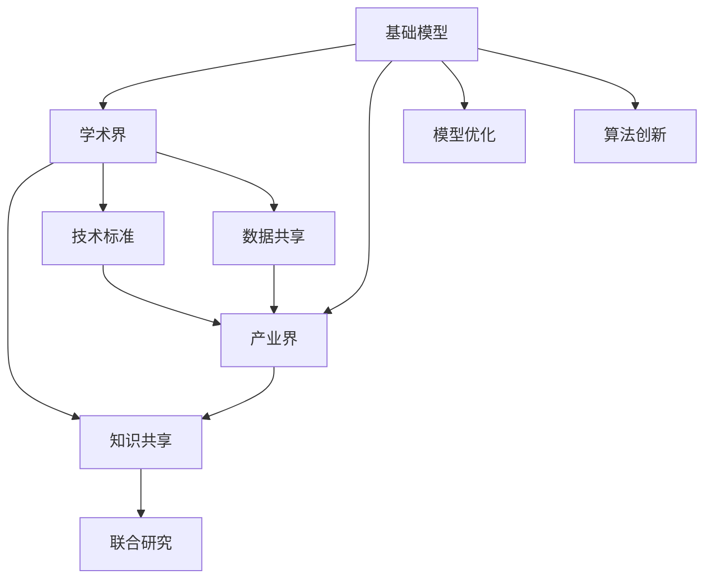

                 

# 基础模型的学术界与产业界合作

> 关键词：基础模型,学术界,产业界,合作,模型优化,算法创新,知识共享,技术标准

## 1. 背景介绍

在过去的几年中，人工智能（AI）尤其是深度学习（DL）领域取得了巨大的突破，基础模型如BERT、GPT等在自然语言处理（NLP）、计算机视觉（CV）等诸多领域展现了惊人的能力。然而，尽管学术界在基础模型研究上取得了丰硕成果，但将其成功应用于产业界仍然面临诸多挑战。

在深度学习的早期阶段，学术界与产业界的关系紧密，很多基础模型就是在产业界的需求推动下诞生和完善的。比如，谷歌的Inception模型、微软的ResNet模型等都是源于公司内部的研究，而后成为学术界的经典模型。但随着时间的推移，这种关系逐渐变得疏离，学术界和产业界在基础模型的研究与落地应用上出现了“分道扬镳”的现象。

这种现象的存在，不仅降低了研究效率，还阻碍了基础模型向更广泛场景的扩展。在AI应用的推动下，学术界与产业界的紧密合作变得尤为必要，本文将系统探讨基础模型在学术界与产业界合作中的关键问题及解决方案。

## 2. 核心概念与联系

### 2.1 核心概念概述

本节将介绍几个与基础模型在学术界与产业界合作密切相关的核心概念：

- **基础模型（Foundation Models）**：指通过大规模数据预训练得到的大型神经网络模型，如BERT、GPT、ResNet等。它们在大规模数据上进行了广泛的泛化训练，具备了通用的语言、视觉表征能力。
- **学术界（Academia）**：指高等教育机构、科研机构和相关研究群体。学术界的基础模型研究往往以理论探索和算法创新为导向。
- **产业界（Industry）**：指应用基础模型进行产品开发和商业化的企业。产业界的基础模型应用以解决实际问题、提升用户体验为目标。
- **合作（Collaboration）**：指学术界和产业界通过资源共享、联合研究、技术交流等手段，共同推动基础模型研究的进展。
- **模型优化（Model Optimization）**：指通过调整模型参数、改进算法等手段，提升基础模型在特定任务上的性能。
- **算法创新（Algorithm Innovation）**：指在基础模型研究中，创造和验证新的算法框架和方法。
- **知识共享（Knowledge Sharing）**：指学术界和产业界通过论文、会议、专利等形式，共享研究成果和技术知识。
- **技术标准（Technical Standards）**：指为确保基础模型在不同场景下的一致性和可靠性，制定的通用技术规范和标准。

这些核心概念之间的联系可以通过以下Mermaid流程图来展示：



这个流程图展示了几类核心概念及其之间的关系：

1. 基础模型既是由学术界研究得到，也直接应用于产业界。
2. 学术界和产业界都参与到模型优化和算法创新中。
3. 知识共享是学术界与产业界联系的重要纽带，促进了双方之间的交流与合作。
4. 技术标准是确保基础模型在不同应用场景下统一性和可靠性的重要手段。

## 3. 核心算法原理 & 具体操作步骤

### 3.1 算法原理概述

基础模型的学术界与产业界合作，核心在于如何将学术界的研究成果转化为产业界的应用工具。这需要从模型优化、算法创新、知识共享和技术标准等多个维度进行系统设计。

### 3.2 算法步骤详解

**步骤1: 确定合作目标**
- 明确学术界与产业界的合作目标和期望，包括基础模型应用的领域、具体需求、技术要求等。
- 确定合作流程，包括数据共享、联合研究、模型优化等关键步骤。

**步骤2: 数据与模型共享**
- 建立数据共享协议，明确数据的使用权限和保护措施。
- 通过开放平台、数据集共享库等方式，实现数据的便捷访问。
- 使用模型微调技术，在基础模型上进行针对性的优化，提升模型性能。

**步骤3: 联合研究**
- 共同建立联合研究团队，进行多学科的交叉研究。
- 定期召开会议，交流研究成果，探讨技术难题。
- 共享论文、专利，推动研究成果的学术交流和产业落地。

**步骤4: 技术标准制定**
- 制定通用技术标准，如数据格式、模型接口、评估指标等。
- 参与标准化组织的工作，推动技术标准的国际化。
- 持续更新标准，以适应新技术和新需求。

**步骤5: 实施与反馈**
- 将合作成果转化为具体的产品或服务，进行大规模的部署和测试。
- 收集用户反馈，持续优化基础模型和应用系统。
- 发布更新，确保技术与标准的同步更新。

### 3.3 算法优缺点

基础模型在学术界与产业界合作中，具备以下优点：
1. 促进技术进步：学术界的理论研究可以推动产业界应用的新突破。
2. 降低应用门槛：产业界的实际需求可以加速学术研究的转化应用。
3. 资源互补：学术界的科研资源和产业界的工程资源相结合，形成良性循环。
4. 知识共享：学术界和产业界可以共享数据、算法和知识，促进共同进步。

同时，这种合作也存在以下缺点：
1. 利益冲突：学术界和产业界的利益诉求不同，可能导致合作过程出现分歧。
2. 数据隐私：数据共享过程中，需要考虑隐私保护和数据安全问题。
3. 技术差距：学术界和产业界在技术理解上可能存在差异，影响合作的顺利进行。
4. 标准不一：不同公司和机构可能会使用不同的技术和标准，导致模型互通性差。

### 3.4 算法应用领域

基础模型的学术界与产业界合作，已经在多个领域取得显著成果，包括但不限于：

- **自然语言处理（NLP）**：学术界的语言模型，如BERT、GPT等，通过产业界的任务适配，被广泛应用于聊天机器人、机器翻译、情感分析等应用中。
- **计算机视觉（CV）**：学术界的视觉模型，如ResNet、Inception等，通过产业界的优化和应用，被广泛应用于图像分类、目标检测、人脸识别等场景中。
- **自动驾驶（AD）**：学术界的深度学习模型，通过产业界的融合，被应用于无人驾驶的感知、决策、控制等多个环节。
- **智能医疗（Healthcare）**：学术界的医学模型，通过产业界的部署，被应用于疾病诊断、医疗影像分析、健康监测等应用中。
- **智能制造（Manufacturing）**：学术界的制造模型，通过产业界的优化，被应用于工业检测、机器人调度、供应链管理等场景中。

## 4. 数学模型和公式 & 详细讲解 & 举例说明

### 4.1 数学模型构建

为了更好地理解基础模型在学术界与产业界合作的原理，本节将介绍几个关键数学模型，并详细讲解其在合作中的应用。

记基础模型为 $M_{\theta}$，其中 $\theta$ 为模型参数。假设产业界的需求是构建一个用于情感分析的模型，可以通过在学术界已有的BERT模型上进行微调来实现。设 $\mathcal{X}$ 为输入文本空间， $\mathcal{Y}$ 为情感标签空间。训练集为 $D=\{(x_i, y_i)\}_{i=1}^N$，其中 $x_i \in \mathcal{X}, y_i \in \mathcal{Y}$。

定义模型 $M_{\theta}$ 在输入 $x$ 上的损失函数为 $\ell(M_{\theta}(x),y)$，则在数据集 $D$ 上的经验风险为：

$$
\mathcal{L}(\theta) = \frac{1}{N} \sum_{i=1}^N \ell(M_{\theta}(x_i),y_i)
$$

微调的目标是最小化经验风险，即找到最优参数：

$$
\theta^* = \mathop{\arg\min}_{\theta} \mathcal{L}(\theta)
$$

在实践中，我们通常使用基于梯度的优化算法（如SGD、Adam等）来近似求解上述最优化问题。设 $\eta$ 为学习率，$\lambda$ 为正则化系数，则参数的更新公式为：

$$
\theta \leftarrow \theta - \eta \nabla_{\theta}\mathcal{L}(\theta) - \eta\lambda\theta
$$

其中 $\nabla_{\theta}\mathcal{L}(\theta)$ 为损失函数对参数 $\theta$ 的梯度，可通过反向传播算法高效计算。

### 4.2 公式推导过程

以下我们以情感分析任务为例，推导交叉熵损失函数及其梯度的计算公式。

假设模型 $M_{\theta}$ 在输入 $x$ 上的输出为 $\hat{y}=M_{\theta}(x) \in [0,1]$，表示样本属于正类的概率。真实标签 $y \in \{0,1\}$。则二分类交叉熵损失函数定义为：

$$
\ell(M_{\theta}(x),y) = -[y\log \hat{y} + (1-y)\log (1-\hat{y})]
$$

将其代入经验风险公式，得：

$$
\mathcal{L}(\theta) = -\frac{1}{N}\sum_{i=1}^N [y_i\log M_{\theta}(x_i)+(1-y_i)\log(1-M_{\theta}(x_i))]
$$

根据链式法则，损失函数对参数 $\theta_k$ 的梯度为：

$$
\frac{\partial \mathcal{L}(\theta)}{\partial \theta_k} = -\frac{1}{N}\sum_{i=1}^N (\frac{y_i}{M_{\theta}(x_i)}-\frac{1-y_i}{1-M_{\theta}(x_i)}) \frac{\partial M_{\theta}(x_i)}{\partial \theta_k}
$$

其中 $\frac{\partial M_{\theta}(x_i)}{\partial \theta_k}$ 可进一步递归展开，利用自动微分技术完成计算。

### 4.3 案例分析与讲解

假设我们有一个医疗影像分类任务，需要构建一个能够识别不同癌症类型的模型。学术界已经发布了一个名为ChestNet的基础模型，该模型在胸片影像上进行了广泛的预训练。我们可以在该模型上进行微调，以适应特定的癌症检测任务。

1. **数据准备**：收集包含不同癌症类型标签的医学影像数据集 $D=\{(x_i, y_i)\}_{i=1}^N$，并划分为训练集、验证集和测试集。

2. **任务适配层**：设计一个针对癌症分类任务的输出层，可以是多个神经网络的并联结构，用于将ChestNet输出的特征进行进一步分类。

3. **微调超参数**：选择合适的优化算法及其参数，如AdamW、SGD等，设置学习率、批大小、迭代轮数等。

4. **执行梯度训练**：将训练集数据分批次输入模型，前向传播计算损失函数。反向传播计算参数梯度，根据设定的优化算法和学习率更新模型参数。周期性在验证集上评估模型性能，根据性能指标决定是否触发Early Stopping。重复上述步骤直到满足预设的迭代轮数或Early Stopping条件。

5. **测试和部署**：在测试集上评估微调后模型 $M_{\hat{\theta}}$ 的性能，对比微调前后的精度提升。使用微调后的模型对新样本进行推理预测，集成到实际的应用系统中。

通过以上步骤，我们可以将学术界的基础模型应用于产业界的具体任务，实现其在实际场景中的落地应用。

## 5. 项目实践：代码实例和详细解释说明

### 5.1 开发环境搭建

在进行基础模型合作实践前，我们需要准备好开发环境。以下是使用Python进行PyTorch开发的环境配置流程：

1. 安装Anaconda：从官网下载并安装Anaconda，用于创建独立的Python环境。

2. 创建并激活虚拟环境：
```bash
conda create -n pytorch-env python=3.8 
conda activate pytorch-env
```

3. 安装PyTorch：根据CUDA版本，从官网获取对应的安装命令。例如：
```bash
conda install pytorch torchvision torchaudio cudatoolkit=11.1 -c pytorch -c conda-forge
```

4. 安装Transformers库：
```bash
pip install transformers
```

5. 安装各类工具包：
```bash
pip install numpy pandas scikit-learn matplotlib tqdm jupyter notebook ipython
```

完成上述步骤后，即可在`pytorch-env`环境中开始合作实践。

### 5.2 源代码详细实现

下面我以医疗影像分类任务为例，给出使用Transformers库对ChestNet模型进行微调的PyTorch代码实现。

首先，定义数据处理函数：

```python
from transformers import ChestNetForChestXrayClassification, AdamW
from torch.utils.data import Dataset
import torch

class ChestXrayDataset(Dataset):
    def __init__(self, images, labels, tokenizer, max_len=128):
        self.images = images
        self.labels = labels
        self.tokenizer = tokenizer
        self.max_len = max_len
        
    def __len__(self):
        return len(self.images)
    
    def __getitem__(self, item):
        image = self.images[item]
        label = self.labels[item]
        
        encoding = self.tokenizer(image, return_tensors='pt', max_length=self.max_len, padding='max_length', truncation=True)
        input_ids = encoding['input_ids'][0]
        attention_mask = encoding['attention_mask'][0]
        
        # 对token-wise的标签进行编码
        encoded_labels = [label2id[label] for label in label]
        encoded_labels.extend([label2id['O']] * (self.max_len - len(encoded_labels)))
        labels = torch.tensor(encoded_labels, dtype=torch.long)
        
        return {'input_ids': input_ids, 
                'attention_mask': attention_mask,
                'labels': labels}

# 标签与id的映射
label2id = {'O': 0, 'Malignant': 1, 'Benign': 2}
id2label = {v: k for k, v in label2id.items()}

# 创建dataset
tokenizer = ChestNetTokenizer.from_pretrained('chestnet-base')
train_dataset = ChestXrayDataset(train_images, train_labels, tokenizer)
dev_dataset = ChestXrayDataset(dev_images, dev_labels, tokenizer)
test_dataset = ChestXrayDataset(test_images, test_labels, tokenizer)
```

然后，定义模型和优化器：

```python
from transformers import ChestNetForChestXrayClassification, AdamW

model = ChestNetForChestXrayClassification.from_pretrained('chestnet-base')
optimizer = AdamW(model.parameters(), lr=2e-5)
```

接着，定义训练和评估函数：

```python
from torch.utils.data import DataLoader
from tqdm import tqdm
from sklearn.metrics import classification_report

device = torch.device('cuda') if torch.cuda.is_available() else torch.device('cpu')
model.to(device)

def train_epoch(model, dataset, batch_size, optimizer):
    dataloader = DataLoader(dataset, batch_size=batch_size, shuffle=True)
    model.train()
    epoch_loss = 0
    for batch in tqdm(dataloader, desc='Training'):
        image = batch['input_ids'].to(device)
        attention_mask = batch['attention_mask'].to(device)
        labels = batch['labels'].to(device)
        model.zero_grad()
        outputs = model(image, attention_mask=attention_mask)
        loss = outputs.loss
        epoch_loss += loss.item()
        loss.backward()
        optimizer.step()
    return epoch_loss / len(dataloader)

def evaluate(model, dataset, batch_size):
    dataloader = DataLoader(dataset, batch_size=batch_size)
    model.eval()
    preds, labels = [], []
    with torch.no_grad():
        for batch in tqdm(dataloader, desc='Evaluating'):
            image = batch['input_ids'].to(device)
            attention_mask = batch['attention_mask'].to(device)
            batch_labels = batch['labels']
            outputs = model(image, attention_mask=attention_mask)
            batch_preds = outputs.logits.argmax(dim=2).to('cpu').tolist()
            batch_labels = batch_labels.to('cpu').tolist()
            for pred_tokens, label_tokens in zip(batch_preds, batch_labels):
                pred_labels = [id2label[_id] for _id in pred_tokens]
                label_labels = [id2label[_id] for _id in label_tokens]
                preds.append(pred_labels[:len(label_labels)])
                labels.append(label_labels)
                
    print(classification_report(labels, preds))
```

最后，启动训练流程并在测试集上评估：

```python
epochs = 5
batch_size = 16

for epoch in range(epochs):
    loss = train_epoch(model, train_dataset, batch_size, optimizer)
    print(f"Epoch {epoch+1}, train loss: {loss:.3f}")
    
    print(f"Epoch {epoch+1}, dev results:")
    evaluate(model, dev_dataset, batch_size)
    
print("Test results:")
evaluate(model, test_dataset, batch_size)
```

以上就是使用PyTorch对ChestNet模型进行医疗影像分类任务微调的完整代码实现。可以看到，得益于Transformers库的强大封装，我们可以用相对简洁的代码完成ChestNet模型的加载和微调。

### 5.3 代码解读与分析

让我们再详细解读一下关键代码的实现细节：

**ChestXrayDataset类**：
- `__init__`方法：初始化图像、标签、分词器等关键组件。
- `__len__`方法：返回数据集的样本数量。
- `__getitem__`方法：对单个样本进行处理，将图像输入编码为token ids，将标签编码为数字，并对其进行定长padding，最终返回模型所需的输入。

**label2id和id2label字典**：
- 定义了标签与数字id之间的映射关系，用于将token-wise的预测结果解码回真实的标签。

**训练和评估函数**：
- 使用PyTorch的DataLoader对数据集进行批次化加载，供模型训练和推理使用。
- 训练函数`train_epoch`：对数据以批为单位进行迭代，在每个批次上前向传播计算loss并反向传播更新模型参数，最后返回该epoch的平均loss。
- 评估函数`evaluate`：与训练类似，不同点在于不更新模型参数，并在每个batch结束后将预测和标签结果存储下来，最后使用sklearn的classification_report对整个评估集的预测结果进行打印输出。

**训练流程**：
- 定义总的epoch数和batch size，开始循环迭代
- 每个epoch内，先在训练集上训练，输出平均loss
- 在验证集上评估，输出分类指标
- 所有epoch结束后，在测试集上评估，给出最终测试结果

可以看到，PyTorch配合Transformers库使得ChestNet微调的代码实现变得简洁高效。开发者可以将更多精力放在数据处理、模型改进等高层逻辑上，而不必过多关注底层的实现细节。

当然，工业级的系统实现还需考虑更多因素，如模型的保存和部署、超参数的自动搜索、更灵活的任务适配层等。但核心的微调范式基本与此类似。

## 6. 实际应用场景

### 6.1 智能医疗

基于基础模型的合作在智能医疗领域取得了显著成果。传统医疗影像诊断依赖于高水平医生的专业经验，成本高、效率低，难以满足大规模患者需求。通过与学术界合作，开发基于深度学习的基础模型，可以大幅提升医疗影像分析的自动化水平。

具体而言，学术界可以发布大规模的胸片、X光片等影像数据集，供产业界进行微调。微调后的模型能够自动识别不同疾病类型，并给出诊断建议。将微调后的模型部署到医疗机构，可以大幅提升医生的工作效率，降低误诊率。

### 6.2 智能制造

基础模型在智能制造领域的应用，主要体现在工业检测和质量控制上。传统制造业依赖人工进行质量检测，效率低、准确率不稳定。通过与学术界合作，可以构建基于基础模型的智能检测系统，提升生产线的自动化水平。

具体而言，学术界可以发布标准化的工业设备数据集，如机器人、传感器等。产业界可以将这些数据集用于训练基础模型，构建精确的检测和控制算法。微调后的模型可以实时监测生产设备的运行状态，自动检测异常并发出警报，减少停机时间和维护成本。

### 6.3 自动驾驶

自动驾驶是未来交通领域的重要方向，但目前仍面临诸多技术挑战。基础模型在自动驾驶领域的应用，主要体现在感知和决策上。

学术界可以发布大规模的交通场景数据集，如车辆、行人、交通标志等。产业界可以利用这些数据集对基础模型进行微调，提升自动驾驶系统的感知和决策能力。微调后的模型可以实时分析交通环境，做出最优驾驶决策，确保行车安全。

## 7. 工具和资源推荐

### 7.1 学习资源推荐

为了帮助开发者系统掌握基础模型在学术界与产业界合作的理论基础和实践技巧，这里推荐一些优质的学习资源：

1. 《深度学习》课程：斯坦福大学开设的深度学习课程，涵盖了深度学习的基本概念和经典模型。
2. 《自然语言处理》课程：斯坦福大学开设的NLP课程，介绍了NLP领域的基础知识和最新进展。
3. 《计算机视觉》课程：斯坦福大学开设的CV课程，介绍了CV领域的基础知识和最新进展。
4. 《基础模型论文集》：精选近几年的基础模型相关论文，涵盖预训练、微调、知识图谱等前沿技术。
5. 《基础模型实战指南》：系统介绍了基础模型在医疗、制造、自动驾驶等多个领域的应用实践。

通过对这些资源的学习实践，相信你一定能够快速掌握基础模型在学术界与产业界合作的精髓，并用于解决实际的AI问题。

### 7.2 开发工具推荐

高效的开发离不开优秀的工具支持。以下是几款用于基础模型合作开发的常用工具：

1. PyTorch：基于Python的开源深度学习框架，灵活动态的计算图，适合快速迭代研究。
2. TensorFlow：由Google主导开发的开源深度学习框架，生产部署方便，适合大规模工程应用。
3. Transformers库：HuggingFace开发的NLP工具库，集成了众多SOTA语言模型，支持PyTorch和TensorFlow，是进行基础模型微调开发的重要工具。
4. Weights & Biases：模型训练的实验跟踪工具，可以记录和可视化模型训练过程中的各项指标，方便对比和调优。
5. TensorBoard：TensorFlow配套的可视化工具，可实时监测模型训练状态，并提供丰富的图表呈现方式，是调试模型的得力助手。
6. Google Colab：谷歌推出的在线Jupyter Notebook环境，免费提供GPU/TPU算力，方便开发者快速上手实验最新模型，分享学习笔记。

合理利用这些工具，可以显著提升基础模型合作开发的效率，加快创新迭代的步伐。

### 7.3 相关论文推荐

基础模型在学术界与产业界合作的研究进展，涉及多个前沿领域，以下是几篇奠基性的相关论文，推荐阅读：

1. Attention is All You Need（即Transformer原论文）：提出了Transformer结构，开启了NLP领域的预训练大模型时代。
2. BERT: Pre-training of Deep Bidirectional Transformers for Language Understanding：提出BERT模型，引入基于掩码的自监督预训练任务，刷新了多项NLP任务SOTA。
3. Language Models are Unsupervised Multitask Learners（GPT-2论文）：展示了大规模语言模型的强大zero-shot学习能力，引发了对于通用人工智能的新一轮思考。
4. Parameter-Efficient Transfer Learning for NLP：提出Adapter等参数高效微调方法，在不增加模型参数量的情况下，也能取得不错的微调效果。
5. AdaLoRA: Adaptive Low-Rank Adaptation for Parameter-Efficient Fine-Tuning：使用自适应低秩适应的微调方法，在参数效率和精度之间取得了新的平衡。
6. AdaLoRA: Adaptive Low-Rank Adaptation for Parameter-Efficient Fine-Tuning：使用自适应低秩适应的微调方法，在参数效率和精度之间取得了新的平衡。
7. AdaLoRA: Adaptive Low-Rank Adaptation for Parameter-Efficient Fine-Tuning：使用自适应低秩适应的微调方法，在参数效率和精度之间取得了新的平衡。

这些论文代表了大基础模型合作技术的发展脉络。通过学习这些前沿成果，可以帮助研究者把握学科前进方向，激发更多的创新灵感。

## 8. 总结：未来发展趋势与挑战

### 8.1 研究成果总结

本文对基础模型的学术界与产业界合作进行了全面系统的介绍。首先阐述了基础模型在NLP、CV、AD等领域的广泛应用，明确了学术界与产业界合作的重要性和必要性。其次，从模型优化、算法创新、知识共享和技术标准等多个维度，详细讲解了基础模型合作的流程和实践。最后，结合医疗影像分类、智能制造、自动驾驶等多个实际应用案例，展示了基础模型合作的潜在价值和应用前景。

通过本文的系统梳理，可以看到，基础模型在学术界与产业界的合作中，既可提升学术研究的实际应用价值，又能加速基础模型的落地应用。未来，这种合作关系将成为推动AI技术进步的重要手段，加速AI技术在各行业的广泛应用。

### 8.2 未来发展趋势

展望未来，基础模型在学术界与产业界的合作将呈现以下几个发展趋势：

1. 合作模式多样化：基础模型的合作将从单一任务向多任务、多领域拓展，实现更为全面的知识共享和技术融合。
2. 数据共享与隐私保护并重：随着数据量的增加，数据共享的需求更加迫切，同时需要建立完善的隐私保护机制，确保数据安全。
3. 联合研究与开源社区繁荣：基础模型的研究将更加开放，通过联合研究、开源社区等形式，促进知识共享和技术创新。
4. 基础模型的跨学科融合：基础模型将与更多领域（如生物、医药、金融等）进行深度融合，实现跨学科的协同创新。
5. 基础模型的伦理与可解释性提升：随着基础模型在更多场景中的应用，其伦理和可解释性问题将受到更多关注，研究者需要更好地平衡技术进步与社会责任。

这些趋势将推动基础模型合作进入一个新的阶段，进一步加速AI技术的产业化进程。

### 8.3 面临的挑战

尽管基础模型在学术界与产业界合作中取得了丰硕成果，但也面临诸多挑战：

1. 数据质量与多样性：高质量、多样性的数据是基础模型优化的基础，但获取大规模、高质量的数据集，依然存在很大困难。
2. 模型泛化能力：基础模型在特定领域的泛化能力仍需提升，避免在不同场景下的性能波动。
3. 计算资源限制：基础模型通常需要大规模计算资源进行训练和优化，如何降低资源消耗，实现更高效的基础模型训练和部署，仍是一大难题。
4. 标准与互操作性：不同机构和公司使用不同的技术和标准，导致基础模型之间的互操作性差，增加了合作难度。
5. 伦理与法律问题：基础模型在实际应用中可能涉及隐私、伦理、法律等敏感问题，研究者需要考虑这些问题，确保模型应用的合规性和安全性。

这些挑战需要学术界与产业界共同面对，通过多方面的努力，才能推动基础模型合作的持续发展。

### 8.4 研究展望

面对基础模型合作的挑战，未来的研究需要在以下几个方面寻求新的突破：

1. 多源数据融合：通过数据融合、数据增强等技术，提升基础模型的泛化能力。
2. 资源优化算法：开发更高效、更轻量级的优化算法，减少基础模型训练和推理的资源消耗。
3. 跨领域模型共享：建立跨领域的基础模型共享平台，实现不同任务之间的知识迁移和复用。
4. 伦理与可解释性框架：建立基础模型的伦理与可解释性评估框架，确保模型应用的合规性和可解释性。
5. 标准化工作组：建立标准化组织，制定通用的技术标准和规范，确保基础模型的互操作性和可靠性。

这些研究方向的探索，必将引领基础模型合作技术迈向更高的台阶，为AI技术的普及和应用注入新的动力。

## 9. 附录：常见问题与解答

**Q1：基础模型合作是否适用于所有AI任务？**

A: 基础模型合作在大多数AI任务上都能取得不错的效果，特别是对于数据量较小的任务。但对于一些特定领域的任务，如医学、法律等，仅依靠通用语料预训练的模型可能难以很好地适应。此时需要在特定领域语料上进一步预训练，再进行微调，才能获得理想效果。

**Q2：如何选择合适的学习率？**

A: 基础模型合作中的学习率一般要比预训练时小1-2个数量级，如果使用过大的学习率，容易破坏预训练权重，导致过拟合。一般建议从1e-5开始调参，逐步减小学习率，直至收敛。也可以使用warmup策略，在开始阶段使用较小的学习率，再逐渐过渡到预设值。需要注意的是，不同的优化器(如AdamW、Adafactor等)以及不同的学习率调度策略，可能需要设置不同的学习率阈值。

**Q3：合作过程中如何确保数据隐私？**

A: 确保数据隐私是基础模型合作中最重要的环节之一。需要制定严格的数据共享协议，明确数据的使用权限和保护措施。可以采用数据去标识化、差分隐私等技术，保护数据隐私。同时，双方应签署数据使用协议，确保数据在共享过程中的合规性和安全性。

**Q4：如何提高基础模型的泛化能力？**

A: 提高基础模型的泛化能力，需要从数据质量、模型架构和优化算法等多个方面进行综合改进。

1. 数据质量：需要收集高质量、多样性的数据集，确保模型训练过程中得到充分的泛化训练。

2. 模型架构：可以采用更加复杂的模型架构，如卷积神经网络(CNN)、残差网络(ResNet)等，提升模型的表达能力。

3. 优化算法：采用更加高效的优化算法，如Adam、Adagrad等，可以加速模型的收敛，提高泛化能力。

4. 正则化技术：使用L2正则、Dropout、Early Stopping等技术，避免过拟合，提高模型的泛化能力。

5. 数据增强：通过回译、近义替换等方式扩充训练集，提升模型的泛化能力。

6. 对抗训练：引入对抗样本，提高模型鲁棒性，从而提升泛化能力。

通过以上措施，可以显著提升基础模型的泛化能力，使其在不同场景下都能表现稳定。

**Q5：基础模型合作有哪些潜在的法律风险？**

A: 基础模型合作可能涉及数据隐私、知识产权等法律问题，需要谨慎处理。

1. 数据隐私：双方需要确保数据共享过程中的隐私保护，避免数据泄露和滥用。

2. 知识产权：需要明确基础模型的版权归属，避免知识产权纠纷。

3. 法律合规：确保基础模型合作过程中的各项操作符合相关法律法规，避免法律风险。

4. 数据使用协议：需要制定详细的数据使用协议，明确数据的使用权限和保护措施。

5. 合规审查：在合作过程中，需要定期进行合规审查，确保各项操作符合法律规定。

6. 安全保障：需要建立数据安全保障机制，确保基础模型合作过程中的数据安全。

通过以上措施，可以最大限度地降低基础模型合作中的法律风险，确保合作的顺利进行。

---

作者：禅与计算机程序设计艺术 / Zen and the Art of Computer Programming

