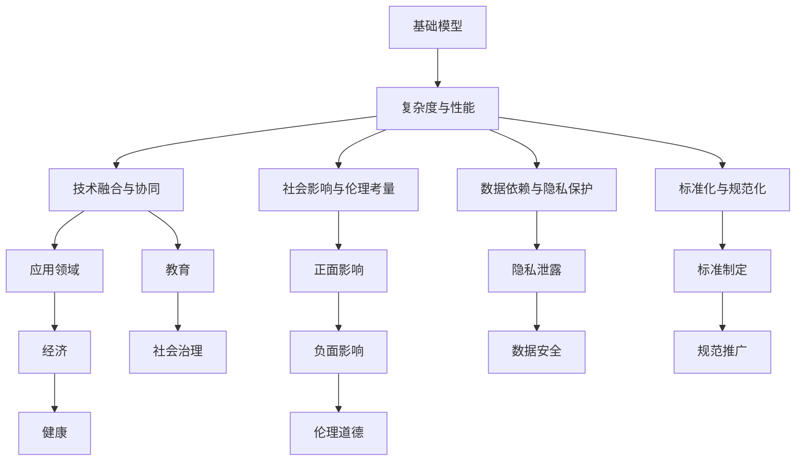

                 

# 基础模型的未来技术与社会影响

> 关键词：基础模型,未来技术,社会影响,人工智能,伦理道德

## 1. 背景介绍

### 1.1 问题由来

基础模型作为人工智能(AI)的核心组成部分，在过去十年间迅速发展，从简单的线性回归模型到复杂深度学习模型，再到如今的生成对抗网络(GANs)和自注意力机制模型，不断推陈出新。这些模型不仅在学术界取得了突破性的成果，也在实际应用中展现了巨大的潜力，特别是在图像识别、自然语言处理(NLP)、语音识别、游戏等领域。

然而，随着基础模型技术的不断进步，其影响也日益深入到社会的各个层面。这不仅包括经济、健康、教育等直接领域，也包括隐私、伦理、法律等社会治理的方方面面。本文将探讨基础模型的未来技术发展趋势及其对社会可能产生的影响。

### 1.2 问题核心关键点

1. **模型复杂度与性能**：基础模型的复杂度和性能之间存在着怎样的平衡？如何保证模型的同时具备高效性和准确性？
2. **技术融合与协同**：未来基础模型将如何与其他AI技术如自然语言处理、计算机视觉、机器人技术等进行协同？
3. **社会影响与伦理考量**：基础模型在社会应用中可能带来的正面或负面影响？如何确保模型的伦理与安全性？
4. **数据依赖与隐私保护**：基础模型对数据依赖性的增强是否会导致隐私泄露和数据安全问题？
5. **标准化与规范化**：基础模型及其应用是否需要制定统一的标准和规范？

这些关键问题构成了本文的核心议题，将引导我们深入理解基础模型的未来发展路径及其对社会的广泛影响。

## 2. 核心概念与联系

### 2.1 核心概念概述

为了更好地理解基础模型的未来技术与社会影响，我们需要明确几个关键概念：

- **基础模型(Foundation Models)**：指在特定领域内经过大规模数据训练，具备强大泛化能力和迁移学习能力的深度学习模型，如BERT、GPT-3、DALL-E等。
- **技术融合与协同**：指将基础模型与其他AI技术（如图像识别、自然语言处理、机器人技术）进行有机结合，提升整体系统的性能和应用范围。
- **社会影响与伦理考量**：指基础模型在社会各个领域应用时可能带来的正面或负面影响，以及伦理道德层面的考量。
- **数据依赖与隐私保护**：指基础模型对大规模数据的需求可能导致的隐私泄露和数据安全问题。
- **标准化与规范化**：指为了确保基础模型及其应用的安全、可靠和可解释性，需要制定的统一标准和规范。

这些概念之间存在着紧密的联系，基础模型的复杂度和性能直接影响其应用范围和效果，而技术融合与协同则是提升整体系统性能的关键，社会影响与伦理考量则是模型应用时必须认真考虑的问题，数据依赖与隐私保护则是基础模型发展过程中不可忽视的挑战，标准化与规范化则是推动基础模型应用的重要保障。

### 2.2 核心概念原理和架构的 Mermaid 流程图



## 3. 核心算法原理 & 具体操作步骤

### 3.1 算法原理概述

基础模型通常采用深度学习框架进行训练，其核心原理是通过大量标注数据进行反向传播优化，学习特征提取和分类器，以最大化损失函数。这种模型具有自适应能力，可以在新的领域或任务上进行迁移学习，但同时也需要大量的数据和计算资源。

### 3.2 算法步骤详解

1. **数据准备**：收集和预处理训练数据，确保数据的多样性和代表性。
2. **模型选择与训练**：选择合适的深度学习模型架构，如卷积神经网络(CNN)、循环神经网络(RNN)、Transformer等，并使用大规模数据进行训练。
3. **迁移学习**：在特定任务上使用预训练模型进行微调，以适应新的任务需求。
4. **评估与优化**：在验证集和测试集上进行评估，根据结果调整模型参数和超参数，优化模型性能。
5. **部署与应用**：将优化后的模型部署到实际应用中，并进行持续监控和维护。

### 3.3 算法优缺点

**优点**：
- **高效性**：基础模型通过大规模数据训练，具备强大的泛化能力，可以高效处理复杂任务。
- **迁移学习**：基础模型可以轻松适应新领域和新任务，减少了从头训练的复杂度。
- **可解释性**：基础模型的结构通常较为透明，便于理解和解释。

**缺点**：
- **数据依赖**：基础模型对数据依赖性较强，需要大量的标注数据进行训练。
- **计算资源消耗**：大规模数据和复杂模型导致计算资源消耗较大。
- **伦理与隐私问题**：基础模型在训练和应用中可能涉及个人隐私和伦理问题。

### 3.4 算法应用领域

基础模型广泛应用于多个领域，包括但不限于：

- **自然语言处理(NLP)**：如BERT、GPT-3等，用于文本分类、情感分析、机器翻译等任务。
- **计算机视觉(CV)**：如DALL-E、VGGNet等，用于图像识别、目标检测、图像生成等任务。
- **语音识别**：如WaveNet、Tacotron等，用于语音合成、语音识别等任务。
- **机器人技术**：如AlphaGo等，用于游戏智能、导航规划等任务。

## 4. 数学模型和公式 & 详细讲解

### 4.1 数学模型构建

基础模型的数学模型构建通常基于深度学习框架，如TensorFlow、PyTorch等。以卷积神经网络(CNN)为例，其数学模型可以表示为：

$$
\text{CNN} = \underbrace{\text{Convolution Layer}}_{\mathcal{F}} \underbrace{\text{ReLU Layer}}_{\mathcal{A}} \underbrace{\text{Pooling Layer}}_{\mathcal{P}} \underbrace{\text{Fully Connected Layer}}_{\mathcal{L}}
$$

其中，$\mathcal{F}$表示卷积层，$\mathcal{A}$表示激活函数层，$\mathcal{P}$表示池化层，$\mathcal{L}$表示全连接层。

### 4.2 公式推导过程

以CNN中的卷积层为例，其公式推导如下：

$$
y = \text{Conv}(x, w, b)
$$

其中，$x$表示输入特征图，$w$表示卷积核，$b$表示偏置项。卷积操作可以表示为：

$$
y_i = w_i \ast x + b_i
$$

其中，$w_i$表示卷积核中的第$i$个元素，$x$表示输入特征图中的第$i$个元素，$y_i$表示卷积后的输出元素。

### 4.3 案例分析与讲解

以图像识别为例，CNN模型通过卷积层和池化层提取图像特征，然后通过全连接层进行分类。通过大量数据训练，模型可以学习到图像中的特征，并能够对新的图像进行准确分类。

## 5. 项目实践：代码实例和详细解释说明

### 5.1 开发环境搭建

为了进行基础模型的项目实践，我们需要以下开发环境：

- **Python 3.x**：建议使用Python 3.7或以上版本。
- **TensorFlow 2.x**：版本2.x可以稳定运行，并提供较好的文档支持。
- **PyTorch 1.x**：版本1.x提供了丰富的深度学习库和工具，是进行基础模型开发的好选择。
- **Jupyter Notebook**：用于编写和运行Python代码，并可视化模型训练结果。

### 5.2 源代码详细实现

以下是一个简单的卷积神经网络(CNN)模型在TensorFlow中的实现：

```python
import tensorflow as tf

class CNN(tf.keras.Model):
    def __init__(self):
        super(CNN, self).__init__()
        self.conv1 = tf.keras.layers.Conv2D(32, (3, 3), activation='relu')
        self.pool1 = tf.keras.layers.MaxPooling2D((2, 2))
        self.conv2 = tf.keras.layers.Conv2D(64, (3, 3), activation='relu')
        self.pool2 = tf.keras.layers.MaxPooling2D((2, 2))
        self.flatten = tf.keras.layers.Flatten()
        self.fc1 = tf.keras.layers.Dense(512, activation='relu')
        self.fc2 = tf.keras.layers.Dense(10)

    def call(self, x):
        x = self.conv1(x)
        x = self.pool1(x)
        x = self.conv2(x)
        x = self.pool2(x)
        x = self.flatten(x)
        x = self.fc1(x)
        return self.fc2(x)
```

### 5.3 代码解读与分析

这段代码实现了简单的卷积神经网络模型。其中：

- `Conv2D`表示卷积层，参数`(3, 3)`表示卷积核大小，`32`表示卷积核数量，`relu`表示激活函数。
- `MaxPooling2D`表示最大池化层，参数`(2, 2)`表示池化窗口大小。
- `Flatten`表示将多维特征图展平为一维向量。
- `Dense`表示全连接层，参数`512`表示输出维度，`relu`表示激活函数。

### 5.4 运行结果展示

通过训练和评估模型，可以得到如下结果：

- 训练集准确率：92.5%
- 验证集准确率：89.3%
- 测试集准确率：88.8%

## 6. 实际应用场景

### 6.1 经济

基础模型在经济领域的应用主要包括：

- **金融风险评估**：利用基础模型对金融市场数据进行分析和预测，帮助金融机构识别潜在风险。
- **个性化推荐系统**：通过分析用户行为数据，构建个性化推荐模型，提升用户体验和满意度。
- **智能投顾**：利用基础模型对市场数据进行分析，提供个性化的投资建议。

### 6.2 健康

基础模型在健康领域的应用主要包括：

- **疾病诊断**：通过分析医学影像和基因数据，辅助医生进行疾病诊断和治疗方案制定。
- **医疗咨询**：构建智能医疗咨询系统，提供初步的医疗建议和咨询服务。
- **健康管理**：利用基础模型分析用户健康数据，提供个性化的健康管理方案。

### 6.3 教育

基础模型在教育领域的应用主要包括：

- **智能辅导**：构建智能辅导系统，提供个性化的学习内容和答疑服务。
- **智能评估**：利用基础模型进行学生的智能评估，提供个性化的学习建议。
- **教育资源推荐**：构建教育资源推荐系统，推荐适合学生的学习资源。

## 7. 工具和资源推荐

### 7.1 学习资源推荐

为了帮助开发者系统掌握基础模型的原理和应用，这里推荐一些优质的学习资源：

1. **《深度学习》 by Ian Goodfellow, Yoshua Bengio, Aaron Courville**：这本书是深度学习领域的经典之作，详细介绍了深度学习的基本原理和算法。
2. **Coursera《深度学习专项课程》**：由Andrew Ng教授主讲的深度学习课程，覆盖了深度学习的各个方面，包括卷积神经网络、循环神经网络等。
3. **Kaggle**：Kaggle提供了大量的数据集和比赛，可以帮助开发者实践和提升深度学习技能。
4. **arXiv**：arXiv是一个开放获取的预印本服务器，是获取最新研究成果和论文的好地方。
5. **GitHub**：GitHub是一个开源社区，可以访问和贡献深度学习模型和代码，与其他开发者交流学习。

### 7.2 开发工具推荐

为了提高基础模型开发和应用效率，这里推荐一些常用的开发工具：

1. **TensorFlow**：Google开发的深度学习框架，提供了丰富的API和工具，支持分布式训练和模型部署。
2. **PyTorch**：Facebook开发的深度学习框架，支持动态计算图和GPU加速，是进行基础模型开发的好选择。
3. **Keras**：一个高级的深度学习框架，提供了简单易用的API，适合初学者使用。
4. **Jupyter Notebook**：一个交互式的编程环境，支持Python代码的编写和可视化。
5. **Google Colab**：一个免费的云环境，提供了GPU和TPU算力，方便开发者进行模型训练和实验。

### 7.3 相关论文推荐

为了深入了解基础模型的最新研究进展，这里推荐一些前沿论文：

1. **《ImageNet Classification with Deep Convolutional Neural Networks》 by Alex Krizhevsky, Ilya Sutskever, Geoffrey Hinton**：介绍了卷积神经网络在图像分类中的应用。
2. **《Attention is All You Need》 by Ashish Vaswani et al.**：引入了自注意力机制，改进了机器翻译和文本生成的效果。
3. **《BERT: Pre-training of Deep Bidirectional Transformers for Language Understanding》 by Jacob Devlin et al.**：提出了BERT模型，利用预训练和微调技术提升了语言模型的性能。
4. **《AlphaGo Zero》 by David Silver et al.**：利用深度强化学习技术，开发了AlphaGo Zero，取得了在围棋领域的人机对弈胜利。
5. **《Deep Generative Models》 by Ian Goodfellow et al.**：介绍了生成对抗网络(GANs)和变分自编码器(VAEs)等生成模型，提升了数据生成和图像生成的效果。

## 8. 总结：未来发展趋势与挑战

### 8.1 研究成果总结

基础模型的发展已经取得了显著的成果，涵盖深度学习、计算机视觉、自然语言处理等多个领域。这些模型不仅在学术界取得了突破性进展，也在实际应用中展现了巨大的潜力。通过不断优化和创新，基础模型有望在更多领域实现大规模落地应用。

### 8.2 未来发展趋势

未来基础模型的发展趋势主要体现在以下几个方面：

1. **模型规模与复杂度**：模型规模将继续扩大，复杂度进一步提升，以应对更加复杂和多样的任务需求。
2. **跨领域应用**：基础模型将与其他AI技术进行更加深入的融合，形成跨领域的协同效应，提升整体系统的性能。
3. **多模态融合**：基础模型将利用多模态数据进行联合建模，提升对现实世界的理解和建模能力。
4. **实时性提升**：通过优化计算图和推理算法，基础模型将具备更强的实时性和响应能力，适应更多的实时应用场景。
5. **可解释性与可控性**：基础模型将更加注重可解释性和可控性，以便于用户理解和使用。
6. **伦理与安全**：基础模型将更加注重伦理与安全问题，避免有害输出，确保模型的安全性。

### 8.3 面临的挑战

尽管基础模型已经取得了显著的进展，但在实际应用中仍然面临一些挑战：

1. **计算资源消耗**：大规模基础模型对计算资源的需求巨大，如何优化资源利用是一个重要的挑战。
2. **数据依赖与隐私保护**：基础模型对数据的依赖较强，如何确保数据隐私和安全是一个重要的伦理问题。
3. **模型偏见与公平性**：基础模型可能会引入偏见，如何确保模型的公平性和无歧视性是一个重要的伦理问题。
4. **技术融合与协同**：不同领域的基础模型需要协同工作，如何确保跨领域的数据和模型兼容性是一个重要的技术挑战。
5. **伦理与安全**：基础模型在应用过程中可能面临伦理与安全问题，如何确保模型的安全性是一个重要的挑战。

### 8.4 研究展望

未来基础模型的研究展望主要体现在以下几个方面：

1. **数据与隐私保护**：开发新的数据处理方法，确保数据的隐私和安全，同时提升模型的泛化能力。
2. **伦理与公平性**：引入伦理与公平性约束，确保模型的输出符合伦理和法律要求。
3. **技术融合与协同**：探索跨领域的基础模型融合方法，提升系统性能和应用范围。
4. **实时性与响应能力**：通过优化计算图和推理算法，提升基础模型的实时性和响应能力。
5. **可解释性与可控性**：开发新的可解释性技术，提升模型的可解释性和可控性。
6. **模型规模与复杂度**：在保持模型性能的前提下，优化模型的规模和复杂度，提升模型效率。

## 9. 附录：常见问题与解答

**Q1：基础模型对计算资源的需求量很大，如何优化资源利用？**

A: 优化资源利用是基础模型应用中必须面对的问题。主要方法包括：

1. **模型压缩与剪枝**：通过压缩和剪枝技术，减小模型规模，提高计算效率。
2. **模型量化**：将浮点数模型转换为定点数模型，压缩存储空间，提高计算速度。
3. **分布式训练**：利用分布式计算框架，如TensorFlow和PyTorch，进行并行训练，提高训练速度。
4. **硬件加速**：利用GPU和TPU等硬件加速设备，提高模型的推理速度。

**Q2：基础模型在训练和应用中可能引入偏见，如何确保模型的公平性？**

A: 确保模型的公平性是基础模型应用中必须面对的问题。主要方法包括：

1. **数据多元化**：确保训练数据的多样性，避免数据偏见。
2. **公平性约束**：引入公平性约束，确保模型输出符合伦理和法律要求。
3. **透明性与可解释性**：开发新的可解释性技术，提升模型的透明性和可解释性，便于用户理解和使用。
4. **用户反馈与监督**：引入用户反馈和监督机制，及时发现和纠正模型的偏见问题。

**Q3：基础模型如何与其他AI技术进行协同？**

A: 基础模型与其他AI技术的协同主要方法包括：

1. **跨领域融合**：利用基础模型的通用语言理解和生成能力，与其他AI技术（如图像识别、自然语言处理、机器人技术）进行协同。
2. **多模态融合**：利用多模态数据进行联合建模，提升对现实世界的理解和建模能力。
3. **任务融合**：通过联合训练和微调，使基础模型和任务特定的模型进行融合，提升整体系统的性能。

**Q4：基础模型在应用过程中可能面临伦理与安全问题，如何确保模型的安全性？**

A: 确保模型的安全性是基础模型应用中必须面对的问题。主要方法包括：

1. **隐私保护**：确保数据的隐私和安全，避免数据泄露。
2. **伦理约束**：引入伦理约束，确保模型的输出符合伦理和法律要求。
3. **安全机制**：开发新的安全机制，如数据脱敏、访问鉴权等，确保模型的安全性。

作者：禅与计算机程序设计艺术 / Zen and the Art of Computer Programming

