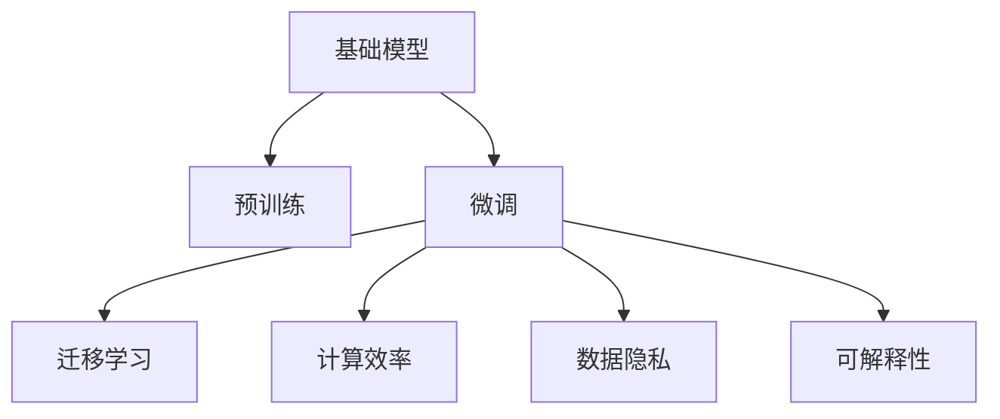

                 

# 基础模型的未来技术发展与挑战

## 1. 背景介绍

### 1.1 问题由来
在过去十年间，人工智能(AI)技术的发展已经取得了显著的进步，尤其是在基础模型方面。深度学习模型的创新和演进，极大地推动了NLP、计算机视觉、推荐系统等众多领域的进步。这些基础模型通过在海量数据上进行的预训练，获取了强大的表征能力，并在各种下游任务上表现出色。然而，随着模型复杂性的增加和数据分布的变化，基础模型也面临着一系列新的挑战。本文将从多个维度探讨基础模型未来的技术发展与面临的挑战，旨在为未来的研究与实践提供有价值的参考。

### 1.2 问题核心关键点
基础模型的核心在于通过预训练获取通用的表征能力，并在下游任务上进行微调，从而提升模型在特定任务上的性能。然而，这一过程中也存在若干核心挑战，包括过拟合、计算资源消耗、数据隐私与安全性等。如何应对这些挑战，推动基础模型向更高效、更安全、更可解释的方向发展，是当前和未来的关键课题。

### 1.3 问题研究意义
基础模型的研究与应用，对于推动AI技术在各行各业的普及与应用具有重要意义。其在自动化、智能交互、医疗健康、教育娱乐等领域的应用，能够显著提升系统效率、用户体验和决策质量。未来，通过不断探索和优化基础模型，有望实现更加智能化、普适化的AI应用，推动人类社会的进步。

## 2. 核心概念与联系

### 2.1 核心概念概述

为更好地理解基础模型的未来技术发展与挑战，本节将介绍几个关键概念：

- **基础模型**：如BERT、GPT等预训练语言模型，以及在大规模数据上训练得到的通用表征。
- **预训练**：通过在大规模无标签数据上进行自监督学习，获取通用表征的过程。
- **微调**：在预训练模型基础上，使用下游任务的有标签数据进行优化，提升模型在特定任务上的性能。
- **迁移学习**：利用基础模型在不同任务之间的知识迁移，实现多任务学习。
- **计算效率**：指模型在推理和训练过程中的计算资源消耗，包括时间、内存、计算设备等。
- **数据隐私**：涉及数据收集、存储、传输和使用的安全性，保护个人隐私和数据权益。
- **可解释性**：指模型输出的解释和理解，有助于对模型决策过程的审查和优化。

这些核心概念之间的关系可以用以下Mermaid流程图表示：



这个流程图展示了基础模型的核心概念及其相互关系：

1. 基础模型通过预训练获得通用表征。
2. 微调利用基础模型在下游任务上的表现进行优化。
3. 迁移学习利用基础模型在不同任务之间的知识迁移。
4. 计算效率影响模型的训练和推理速度。
5. 数据隐私与安全保障模型使用的数据不泄露。
6. 可解释性确保模型的决策过程透明且可理解。

## 3. 核心算法原理 & 具体操作步骤

### 3.1 算法原理概述

基础模型的核心在于预训练和微调的过程。预训练的目标是在大规模数据上学习到通用的表征能力，微调则是在预训练基础上，针对特定任务进行优化，提升模型性能。

形式化地，假设基础模型为 $M_{\theta}$，其中 $\theta$ 为模型参数。在预训练阶段，模型在无标签数据集 $D_{unlabeled}$ 上进行训练，最小化数据分布的距离损失，即：

$$
\min_{\theta} \mathbb{E}_{(x,y) \sim D_{unlabeled}} \ell(M_{\theta}(x),y)
$$

在微调阶段，模型在带有标签的数据集 $D_{labeled}$ 上进行训练，最小化任务损失，即：

$$
\min_{\theta} \mathbb{E}_{(x,y) \sim D_{labeled}} \ell(M_{\theta}(x),y)
$$

### 3.2 算法步骤详解

基于基础模型的预训练和微调过程，本节将详细介绍关键步骤：

**Step 1: 数据准备**
- 收集无标签数据集 $D_{unlabeled}$，如大规模文本语料库。
- 根据任务需求，选择或构建标注数据集 $D_{labeled}$。

**Step 2: 预训练**
- 在无标签数据集上，使用自监督学习方法（如掩码语言模型、下一句子预测等）训练基础模型 $M_{\theta}$，获取通用表征。

**Step 3: 微调**
- 在标注数据集上，对预训练模型进行微调，以适应特定任务需求。
- 选择适当的损失函数，如交叉熵、均方误差等。
- 设定合适的学习率、批大小、迭代轮数等超参数。

**Step 4: 模型评估与部署**
- 在验证集上评估微调模型的性能，根据评估结果调整超参数。
- 在测试集上评估最终模型性能，评估微调的效果。
- 将模型部署到实际应用场景中，进行推理预测。

### 3.3 算法优缺点

基础模型微调具有以下优点：

- 通用性强：预训练模型能够处理多种任务，只需少量标注数据即可提升特定任务性能。
- 计算效率高：预训练模型具有高泛化性，在微调时所需的计算资源较少。
- 可解释性强：预训练模型通过自监督学习获得通用表征，决策过程透明，易于解释。

同时，该方法也存在以下缺点：

- 数据依赖高：微调效果依赖于标注数据的质量和数量，获取高质量标注数据的成本较高。
- 性能提升有限：当目标任务与预训练数据的分布差异较大时，微调的性能提升有限。
- 风险传递：预训练模型中的固有偏见和有害信息可能通过微调传递到下游任务，造成负面影响。

尽管存在这些局限性，但基础模型的预训练和微调方法仍然是当前主流的研究和应用范式。未来研究应重点关注如何进一步降低对标注数据的依赖，提高模型的少样本学习和跨领域迁移能力，同时兼顾可解释性和伦理安全性等因素。

### 3.4 算法应用领域

基础模型已经在NLP、计算机视觉、推荐系统等多个领域得到了广泛应用。例如：

- **NLP领域**：利用BERT、GPT等模型进行文本分类、命名实体识别、情感分析、机器翻译等任务。
- **计算机视觉领域**：利用ResNet、VGG等模型进行图像分类、目标检测、人脸识别等任务。
- **推荐系统领域**：利用基础模型进行个性化推荐、广告推荐、内容推荐等任务。

除了这些经典应用外，基础模型还被创新性地应用到更多场景中，如可控文本生成、常识推理、代码生成、数据增强等，为AI技术带来了新的突破。随着预训练模型和微调方法的不断进步，相信AI技术将在更广阔的应用领域大放异彩。

## 4. 数学模型和公式 & 详细讲解 & 举例说明

### 4.1 数学模型构建

为了更好地理解基础模型的预训练和微调过程，本节将从数学模型角度进行深入讲解。

假设基础模型为 $M_{\theta}$，其中 $\theta$ 为模型参数。预训练的目标是在大规模无标签数据集 $D_{unlabeled}$ 上最小化数据分布的距离损失：

$$
\min_{\theta} \mathbb{E}_{(x,y) \sim D_{unlabeled}} \ell(M_{\theta}(x),y)
$$

其中 $\ell$ 为损失函数，如掩码语言模型的交叉熵损失。微调的目标是在标注数据集 $D_{labeled}$ 上最小化任务损失：

$$
\min_{\theta} \mathbb{E}_{(x,y) \sim D_{labeled}} \ell(M_{\theta}(x),y)
$$

### 4.2 公式推导过程

以BERT模型为例，其预训练的目标是在大规模无标签文本数据上学习到通用表征。BERT模型采用掩码语言模型和下一句子预测两种自监督任务，具体推导如下：

- 掩码语言模型：在输入文本 $x$ 中随机掩码部分单词，模型预测被掩码单词的正确位置。
- 下一句子预测：模型预测两个句子 $x$ 和 $y$ 是否连续出现。

假设输入文本 $x$ 的长度为 $n$，随机掩码的比例为 $p$。掩码语言模型的损失函数为：

$$
L_{mask} = -\sum_{i=1}^n \log p_i
$$

其中 $p_i$ 为第 $i$ 个单词被掩码的概率。下一句子预测的损失函数为：

$$
L_{next} = -\sum_{i=1}^n \log s_i
$$

其中 $s_i$ 为预测句子 $i$ 和 $i+1$ 是否连续出现的概率。

预训练的目标是最小化掩码语言模型和下一句子预测的联合损失：

$$
\min_{\theta} \mathbb{E}_{(x,y) \sim D_{unlabeled}} (L_{mask} + L_{next})
$$

在微调阶段，假设微调任务为二分类任务，即输入文本 $x$ 对应的标签为 $y$。微调的目标是最小化交叉熵损失：

$$
\min_{\theta} \mathbb{E}_{(x,y) \sim D_{labeled}} \ell(M_{\theta}(x),y)
$$

其中 $\ell$ 为二分类交叉熵损失函数。

### 4.3 案例分析与讲解

以情感分析任务为例，假设基础模型为BERT，预训练后的模型为 $M_{\theta_{pretrain}}$。在微调阶段，我们使用情感标注数据集 $D_{labeled}$，包含 $N$ 条带标签的文本。微调的目标是最小化二分类交叉熵损失：

$$
\min_{\theta} \frac{1}{N}\sum_{i=1}^N \ell(M_{\theta_{pretrain}}(x_i),y_i)
$$

其中 $\ell$ 为二分类交叉熵损失函数，$x_i$ 为第 $i$ 条文本，$y_i$ 为对应的情感标签。

为了提升微调效果，可以采用数据增强、正则化、对抗训练等技术。数据增强包括回译、同义词替换等，正则化包括L2正则、Dropout等，对抗训练包括生成对抗样本等。

## 5. 项目实践：代码实例和详细解释说明

### 5.1 开发环境搭建

在进行基础模型微调实践前，需要先准备好开发环境。以下是使用Python进行PyTorch开发的环境配置流程：

1. 安装Anaconda：从官网下载并安装Anaconda，用于创建独立的Python环境。

2. 创建并激活虚拟环境：
```bash
conda create -n pytorch-env python=3.8 
conda activate pytorch-env
```

3. 安装PyTorch：根据CUDA版本，从官网获取对应的安装命令。例如：
```bash
conda install pytorch torchvision torchaudio cudatoolkit=11.1 -c pytorch -c conda-forge
```

4. 安装TensorFlow：由Google主导开发的开源深度学习框架，生产部署方便，适合大规模工程应用。同样有丰富的预训练语言模型资源。

5. 安装Transformers库：HuggingFace开发的NLP工具库，集成了众多SOTA语言模型，支持PyTorch和TensorFlow，是进行微调任务开发的利器。

6. 安装各类工具包：
```bash
pip install numpy pandas scikit-learn matplotlib tqdm jupyter notebook ipython
```

完成上述步骤后，即可在`pytorch-env`环境中开始微调实践。

### 5.2 源代码详细实现

下面我们以情感分析任务为例，给出使用Transformers库对BERT模型进行微调的PyTorch代码实现。

首先，定义情感分析任务的数据处理函数：

```python
from transformers import BertTokenizer
from torch.utils.data import Dataset
import torch

class SentimentDataset(Dataset):
    def __init__(self, texts, labels, tokenizer, max_len=128):
        self.texts = texts
        self.labels = labels
        self.tokenizer = tokenizer
        self.max_len = max_len
        
    def __len__(self):
        return len(self.texts)
    
    def __getitem__(self, item):
        text = self.texts[item]
        label = self.labels[item]
        
        encoding = self.tokenizer(text, return_tensors='pt', max_length=self.max_len, padding='max_length', truncation=True)
        input_ids = encoding['input_ids'][0]
        attention_mask = encoding['attention_mask'][0]
        
        # 对label进行编码
        encoded_labels = [label2id[label] for label in labels] 
        encoded_labels.extend([label2id['O']] * (self.max_len - len(encoded_labels)))
        labels = torch.tensor(encoded_labels, dtype=torch.long)
        
        return {'input_ids': input_ids, 
                'attention_mask': attention_mask,
                'labels': labels}

# 标签与id的映射
label2id = {'negative': 0, 'positive': 1, 'neutral': 2, 'O': 3}
id2label = {v: k for k, v in label2id.items()}

# 创建dataset
tokenizer = BertTokenizer.from_pretrained('bert-base-cased')

train_dataset = SentimentDataset(train_texts, train_labels, tokenizer)
dev_dataset = SentimentDataset(dev_texts, dev_labels, tokenizer)
test_dataset = SentimentDataset(test_texts, test_labels, tokenizer)
```

然后，定义模型和优化器：

```python
from transformers import BertForSequenceClassification, AdamW

model = BertForSequenceClassification.from_pretrained('bert-base-cased', num_labels=len(label2id))

optimizer = AdamW(model.parameters(), lr=2e-5)
```

接着，定义训练和评估函数：

```python
from torch.utils.data import DataLoader
from tqdm import tqdm
from sklearn.metrics import classification_report

device = torch.device('cuda') if torch.cuda.is_available() else torch.device('cpu')
model.to(device)

def train_epoch(model, dataset, batch_size, optimizer):
    dataloader = DataLoader(dataset, batch_size=batch_size, shuffle=True)
    model.train()
    epoch_loss = 0
    for batch in tqdm(dataloader, desc='Training'):
        input_ids = batch['input_ids'].to(device)
        attention_mask = batch['attention_mask'].to(device)
        labels = batch['labels'].to(device)
        model.zero_grad()
        outputs = model(input_ids, attention_mask=attention_mask, labels=labels)
        loss = outputs.loss
        epoch_loss += loss.item()
        loss.backward()
        optimizer.step()
    return epoch_loss / len(dataloader)

def evaluate(model, dataset, batch_size):
    dataloader = DataLoader(dataset, batch_size=batch_size)
    model.eval()
    preds, labels = [], []
    with torch.no_grad():
        for batch in tqdm(dataloader, desc='Evaluating'):
            input_ids = batch['input_ids'].to(device)
            attention_mask = batch['attention_mask'].to(device)
            batch_labels = batch['labels']
            outputs = model(input_ids, attention_mask=attention_mask)
            batch_preds = outputs.logits.argmax(dim=2).to('cpu').tolist()
            batch_labels = batch_labels.to('cpu').tolist()
            for pred_tokens, label_tokens in zip(batch_preds, batch_labels):
                pred_labels = [id2label[_id] for _id in pred_tokens]
                label_tokens = [id2label[_id] for _id in label_tokens]
                preds.append(pred_labels[:len(label_tokens)])
                labels.append(label_tokens)
                
    print(classification_report(labels, preds))
```

最后，启动训练流程并在测试集上评估：

```python
epochs = 5
batch_size = 16

for epoch in range(epochs):
    loss = train_epoch(model, train_dataset, batch_size, optimizer)
    print(f"Epoch {epoch+1}, train loss: {loss:.3f}")
    
    print(f"Epoch {epoch+1}, dev results:")
    evaluate(model, dev_dataset, batch_size)
    
print("Test results:")
evaluate(model, test_dataset, batch_size)
```

以上就是使用PyTorch对BERT进行情感分析任务微调的完整代码实现。可以看到，得益于Transformers库的强大封装，我们可以用相对简洁的代码完成BERT模型的加载和微调。

### 5.3 代码解读与分析

让我们再详细解读一下关键代码的实现细节：

**SentimentDataset类**：
- `__init__`方法：初始化文本、标签、分词器等关键组件。
- `__len__`方法：返回数据集的样本数量。
- `__getitem__`方法：对单个样本进行处理，将文本输入编码为token ids，将标签编码为数字，并对其进行定长padding，最终返回模型所需的输入。

**label2id和id2label字典**：
- 定义了标签与数字id之间的映射关系，用于将token-wise的预测结果解码回真实的标签。

**训练和评估函数**：
- 使用PyTorch的DataLoader对数据集进行批次化加载，供模型训练和推理使用。
- 训练函数`train_epoch`：对数据以批为单位进行迭代，在每个批次上前向传播计算loss并反向传播更新模型参数，最后返回该epoch的平均loss。
- 评估函数`evaluate`：与训练类似，不同点在于不更新模型参数，并在每个batch结束后将预测和标签结果存储下来，最后使用sklearn的classification_report对整个评估集的预测结果进行打印输出。

**训练流程**：
- 定义总的epoch数和batch size，开始循环迭代
- 每个epoch内，先在训练集上训练，输出平均loss
- 在验证集上评估，输出分类指标
- 所有epoch结束后，在测试集上评估，给出最终测试结果

可以看到，PyTorch配合Transformers库使得BERT微调的代码实现变得简洁高效。开发者可以将更多精力放在数据处理、模型改进等高层逻辑上，而不必过多关注底层的实现细节。

当然，工业级的系统实现还需考虑更多因素，如模型的保存和部署、超参数的自动搜索、更灵活的任务适配层等。但核心的微调范式基本与此类似。

## 6. 实际应用场景

### 6.1 智能客服系统

基础模型的微调技术可以广泛应用于智能客服系统的构建。传统客服往往需要配备大量人力，高峰期响应缓慢，且一致性和专业性难以保证。而使用微调后的基础模型进行客服对话，可以7x24小时不间断服务，快速响应客户咨询，用自然流畅的语言解答各类常见问题。

在技术实现上，可以收集企业内部的历史客服对话记录，将问题和最佳答复构建成监督数据，在此基础上对基础模型进行微调。微调后的基础模型能够自动理解用户意图，匹配最合适的答案模板进行回复。对于客户提出的新问题，还可以接入检索系统实时搜索相关内容，动态组织生成回答。如此构建的智能客服系统，能大幅提升客户咨询体验和问题解决效率。

### 6.2 金融舆情监测

金融机构需要实时监测市场舆论动向，以便及时应对负面信息传播，规避金融风险。传统的人工监测方式成本高、效率低，难以应对网络时代海量信息爆发的挑战。基于基础模型微调的文本分类和情感分析技术，为金融舆情监测提供了新的解决方案。

具体而言，可以收集金融领域相关的新闻、报道、评论等文本数据，并对其进行主题标注和情感标注。在此基础上对基础模型进行微调，使其能够自动判断文本属于何种主题，情感倾向是正面、中性还是负面。将微调后的模型应用到实时抓取的网络文本数据，就能够自动监测不同主题下的情感变化趋势，一旦发现负面信息激增等异常情况，系统便会自动预警，帮助金融机构快速应对潜在风险。

### 6.3 个性化推荐系统

当前的推荐系统往往只依赖用户的历史行为数据进行物品推荐，无法深入理解用户的真实兴趣偏好。基于基础模型微调技术，个性化推荐系统可以更好地挖掘用户行为背后的语义信息，从而提供更精准、多样的推荐内容。

在实践中，可以收集用户浏览、点击、评论、分享等行为数据，提取和用户交互的物品标题、描述、标签等文本内容。将文本内容作为模型输入，用户的后续行为（如是否点击、购买等）作为监督信号，在此基础上微调基础模型。微调后的模型能够从文本内容中准确把握用户的兴趣点。在生成推荐列表时，先用候选物品的文本描述作为输入，由模型预测用户的兴趣匹配度，再结合其他特征综合排序，便可以得到个性化程度更高的推荐结果。

### 6.4 未来应用展望

随着基础模型的不断发展，其应用领域将进一步拓展，为各行各业带来更深远的影响。

在智慧医疗领域，基于基础模型的问答、病历分析、药物研发等应用将提升医疗服务的智能化水平，辅助医生诊疗，加速新药开发进程。

在智能教育领域，微调技术可应用于作业批改、学情分析、知识推荐等方面，因材施教，促进教育公平，提高教学质量。

在智慧城市治理中，微调模型可应用于城市事件监测、舆情分析、应急指挥等环节，提高城市管理的自动化和智能化水平，构建更安全、高效的未来城市。

此外，在企业生产、社会治理、文娱传媒等众多领域，基于基础模型的微调方法也将不断涌现，为传统行业数字化转型升级提供新的技术路径。相信随着技术的日益成熟，基础模型的微调方法将成为AI落地应用的重要范式，推动人工智能技术向更广阔的领域加速渗透。

## 7. 工具和资源推荐

### 7.1 学习资源推荐

为了帮助开发者系统掌握基础模型微调的理论基础和实践技巧，这里推荐一些优质的学习资源：

1. 《Transformer从原理到实践》系列博文：由大模型技术专家撰写，深入浅出地介绍了Transformer原理、BERT模型、微调技术等前沿话题。

2. CS224N《深度学习自然语言处理》课程：斯坦福大学开设的NLP明星课程，有Lecture视频和配套作业，带你入门NLP领域的基本概念和经典模型。

3. 《Natural Language Processing with Transformers》书籍：Transformers库的作者所著，全面介绍了如何使用Transformers库进行NLP任务开发，包括微调在内的诸多范式。

4. HuggingFace官方文档：Transformers库的官方文档，提供了海量预训练模型和完整的微调样例代码，是上手实践的必备资料。

5. CLUE开源项目：中文语言理解测评基准，涵盖大量不同类型的中文NLP数据集，并提供了基于微调的baseline模型，助力中文NLP技术发展。

通过对这些资源的学习实践，相信你一定能够快速掌握基础模型微调的精髓，并用于解决实际的NLP问题。

### 7.2 开发工具推荐

高效的开发离不开优秀的工具支持。以下是几款用于基础模型微调开发的常用工具：

1. PyTorch：基于Python的开源深度学习框架，灵活动态的计算图，适合快速迭代研究。大部分预训练语言模型都有PyTorch版本的实现。

2. TensorFlow：由Google主导开发的开源深度学习框架，生产部署方便，适合大规模工程应用。同样有丰富的预训练语言模型资源。

3. Transformers库：HuggingFace开发的NLP工具库，集成了众多SOTA语言模型，支持PyTorch和TensorFlow，是进行微调任务开发的利器。

4. Weights & Biases：模型训练的实验跟踪工具，可以记录和可视化模型训练过程中的各项指标，方便对比和调优。与主流深度学习框架无缝集成。

5. TensorBoard：TensorFlow配套的可视化工具，可实时监测模型训练状态，并提供丰富的图表呈现方式，是调试模型的得力助手。

6. Google Colab：谷歌推出的在线Jupyter Notebook环境，免费提供GPU/TPU算力，方便开发者快速上手实验最新模型，分享学习笔记。

合理利用这些工具，可以显著提升基础模型微调的开发效率，加快创新迭代的步伐。

### 7.3 相关论文推荐

基础模型的研究与应用，源于学界的持续研究。以下是几篇奠基性的相关论文，推荐阅读：

1. Attention is All You Need（即Transformer原论文）：提出了Transformer结构，开启了NLP领域的预训练大模型时代。

2. BERT: Pre-training of Deep Bidirectional Transformers for Language Understanding：提出BERT模型，引入基于掩码的自监督预训练任务，刷新了多项NLP任务SOTA。

3. Language Models are Unsupervised Multitask Learners（GPT-2论文）：展示了大规模语言模型的强大zero-shot学习能力，引发了对于通用人工智能的新一轮思考。

4. Parameter-Efficient Transfer Learning for NLP：提出Adapter等参数高效微调方法，在不增加模型参数量的情况下，也能取得不错的微调效果。

5. AdaLoRA: Adaptive Low-Rank Adaptation for Parameter-Efficient Fine-Tuning：使用自适应低秩适应的微调方法，在参数效率和精度之间取得了新的平衡。

6. Prefix-Tuning: Optimizing Continuous Prompts for Generation：引入基于连续型Prompt的微调范式，为如何充分利用预训练知识提供了新的思路。

这些论文代表了大语言模型微调技术的发展脉络。通过学习这些前沿成果，可以帮助研究者把握学科前进方向，激发更多的创新灵感。

## 8. 总结：未来发展趋势与挑战

### 8.1 总结

本文对基于基础模型的微调方法进行了全面系统的介绍。首先阐述了基础模型和微调技术的研究背景和意义，明确了微调在拓展预训练模型应用、提升下游任务性能方面的独特价值。其次，从原理到实践，详细讲解了基础模型的预训练和微调过程，给出了微调任务开发的完整代码实例。同时，本文还广泛探讨了微调方法在智能客服、金融舆情、个性化推荐等多个行业领域的应用前景，展示了微调范式的巨大潜力。此外，本文精选了微调技术的各类学习资源，力求为读者提供全方位的技术指引。

通过本文的系统梳理，可以看到，基于基础模型的微调方法在NLP、计算机视觉、推荐系统等领域的应用已经取得了显著成果，极大地推动了相关技术的进步。未来，随着基础模型的不断发展，其在更多领域的应用将不断拓展，为人工智能技术的产业化应用提供更为坚实的技术支持。

### 8.2 未来发展趋势

展望未来，基础模型的预训练和微调技术将呈现以下几个发展趋势：

1. 模型规模持续增大。随着算力成本的下降和数据规模的扩张，基础模型的参数量还将持续增长。超大规模语言模型蕴含的丰富语言知识，有望支撑更加复杂多变的下游任务微调。

2. 微调方法日趋多样。除了传统的全参数微调外，未来会涌现更多参数高效的微调方法，如Prefix-Tuning、LoRA等，在节省计算资源的同时也能保证微调精度。

3. 持续学习成为常态。随着数据分布的不断变化，微调模型也需要持续学习新知识以保持性能。如何在不遗忘原有知识的同时，高效吸收新样本信息，将成为重要的研究课题。

4. 标注样本需求降低。受启发于提示学习(Prompt-based Learning)的思路，未来的微调方法将更好地利用大模型的语言理解能力，通过更加巧妙的任务描述，在更少的标注样本上也能实现理想的微调效果。

5. 模型通用性增强。经过海量数据的预训练和多领域任务的微调，未来的基础模型将具备更强大的常识推理和跨领域迁移能力，逐步迈向通用人工智能(AGI)的目标。

以上趋势凸显了大模型微调技术的广阔前景。这些方向的探索发展，必将进一步提升NLP系统的性能和应用范围，为人类社会的进步提供更为强大的动力。

### 8.3 面临的挑战

尽管基础模型的预训练和微调方法已经取得了显著进展，但在迈向更加智能化、普适化应用的过程中，仍面临诸多挑战：

1. 标注成本瓶颈。虽然微调大大降低了标注数据的需求，但对于长尾应用场景，难以获得充足的高质量标注数据，成为制约微调性能的瓶颈。如何进一步降低微调对标注样本的依赖，将是一大难题。

2. 模型鲁棒性不足。当前微调模型面对域外数据时，泛化性能往往大打折扣。对于测试样本的微小扰动，微调模型的预测也容易发生波动。如何提高微调模型的鲁棒性，避免灾难性遗忘，还需要更多理论和实践的积累。

3. 推理效率有待提高。大规模基础模型虽然精度高，但在实际部署时往往面临推理速度慢、内存占用大等效率问题。如何在保证性能的同时，简化模型结构，提升推理速度，优化资源占用，将是重要的优化方向。

4. 可解释性亟需加强。当前微调模型更像是"黑盒"系统，难以解释其内部工作机制和决策逻辑。对于医疗、金融等高风险应用，算法的可解释性和可审计性尤为重要。如何赋予微调模型更强的可解释性，将是亟待攻克的难题。

5. 安全性有待保障。预训练基础模型难免会学习到有偏见、有害的信息，通过微调传递到下游任务，产生误导性、歧视性的输出，给实际应用带来安全隐患。如何从数据和算法层面消除模型偏见，避免恶意用途，确保输出的安全性，也将是重要的研究课题。

6. 知识整合能力不足。现有的微调模型往往局限于任务内数据，难以灵活吸收和运用更广泛的先验知识。如何让微调过程更好地与外部知识库、规则库等专家知识结合，形成更加全面、准确的信息整合能力，还有很大的想象空间。

正视基础模型微调面临的这些挑战，积极应对并寻求突破，将是大模型微调走向成熟的必由之路。相信随着学界和产业界的共同努力，这些挑战终将一一被克服，基础模型的微调方法将成为人工智能技术落地应用的重要范式，推动人工智能技术向更广阔的领域加速渗透。

### 8.4 研究展望

面对基础模型微调所面临的挑战，未来的研究需要在以下几个方面寻求新的突破：

1. 探索无监督和半监督微调方法。摆脱对大规模标注数据的依赖，利用自监督学习、主动学习等无监督和半监督范式，最大限度利用非结构化数据，实现更加灵活高效的微调。

2. 研究参数高效和计算高效的微调范式。开发更加参数高效的微调方法，在固定大部分预训练参数的同时，只更新极少量的任务相关参数。同时优化微调模型的计算图，减少前向传播和反向传播的资源消耗，实现更加轻量级、实时性的部署。

3. 融合因果和对比学习范式。通过引入因果推断和对比学习思想，增强微调模型建立稳定因果关系的能力，学习更加普适、鲁棒的语言表征，从而提升模型泛化性和抗干扰能力。

4. 引入更多先验知识。将符号化的先验知识，如知识图谱、逻辑规则等，与神经网络模型进行巧妙融合，引导微调过程学习更准确、合理的语言模型。同时加强不同模态数据的整合，实现视觉、语音等多模态信息与文本信息的协同建模。

5. 结合因果分析和博弈论工具。将因果分析方法引入微调模型，识别出模型决策的关键特征，增强输出解释的因果性和逻辑性。借助博弈论工具刻画人机交互过程，主动探索并规避模型的脆弱点，提高系统稳定性。

6. 纳入伦理道德约束。在模型训练目标中引入伦理导向的评估指标，过滤和惩罚有偏见、有害的输出倾向。同时加强人工干预和审核，建立模型行为的监管机制，确保输出符合人类价值观和伦理道德。

这些研究方向的探索，必将引领基础模型微调技术迈向更高的台阶，为构建安全、可靠、可解释、可控的智能系统铺平道路。面向未来，基础模型的微调技术还需要与其他人工智能技术进行更深入的融合，如知识表示、因果推理、强化学习等，多路径协同发力，共同推动自然语言理解和智能交互系统的进步。只有勇于创新、敢于突破，才能不断拓展基础模型的边界，让智能技术更好地造福人类社会。

## 9. 附录：常见问题与解答

**Q1：基础模型微调是否适用于所有NLP任务？**

A: 基础模型的微调方法在大多数NLP任务上都能取得不错的效果，特别是对于数据量较小的任务。但对于一些特定领域的任务，如医学、法律等，仅仅依靠通用语料预训练的模型可能难以很好地适应。此时需要在特定领域语料上进一步预训练，再进行微调，才能获得理想效果。此外，对于一些需要时效性、个性化很强的任务，如对话、推荐等，微调方法也需要针对性的改进优化。

**Q2：如何选择基础模型的预训练和微调超参数？**

A: 选择基础模型的预训练和微调超参数需要根据具体任务进行细致的调整。通常预训练的学习率设定在1e-4到1e-2之间，微调的学习率需要更小，一般设定在1e-5左右。批次大小和迭代轮数也需要根据任务复杂度和数据规模进行优化。一般建议从较大的批次和较多的迭代轮数开始，逐步减小直至收敛。

**Q3：如何进行数据预处理和增强？**

A: 数据预处理包括文本的Tokenization、标准化、分词器配置等。数据增强可以通过回译、同义词替换、随机丢弃等方式进行，增加训练集的多样性，提高模型的泛化能力。

**Q4：如何缓解基础模型的过拟合问题？**

A: 缓解过拟合问题可以采用数据增强、正则化、对抗训练等技术。数据增强包括回译、同义词替换等，正则化包括L2正则、Dropout等，对抗训练包括生成对抗样本等。同时，也可以通过参数共享、多模型集成等方法来减小过拟合风险。

**Q5：如何提升基础模型的推理效率？**

A: 提升推理效率可以从模型裁剪、量化加速、模型并行等方面入手。模型裁剪可以去除不必要的层和参数，减小模型尺寸，加快推理速度。量化加速可以采用定点计算，压缩存储空间，提高计算效率。模型并行可以通过数据并行、模型并行、混合并行等方式，提高模型训练和推理的并行度。

**Q6：如何保证基础模型的可解释性和安全性？**

A: 可解释性可以通过特征可视化、注意力机制、因果推理等方式实现，帮助理解模型的决策过程。安全性可以从数据来源、模型训练过程、输出审查等方面进行保障，确保数据隐私和安全，避免有害信息的输出。

通过以上常见问题的解答，希望能够帮助你更好地理解和应用基础模型的微调方法，推动AI技术在更多领域的应用和创新。

---

作者：禅与计算机程序设计艺术 / Zen and the Art of Computer Programming

