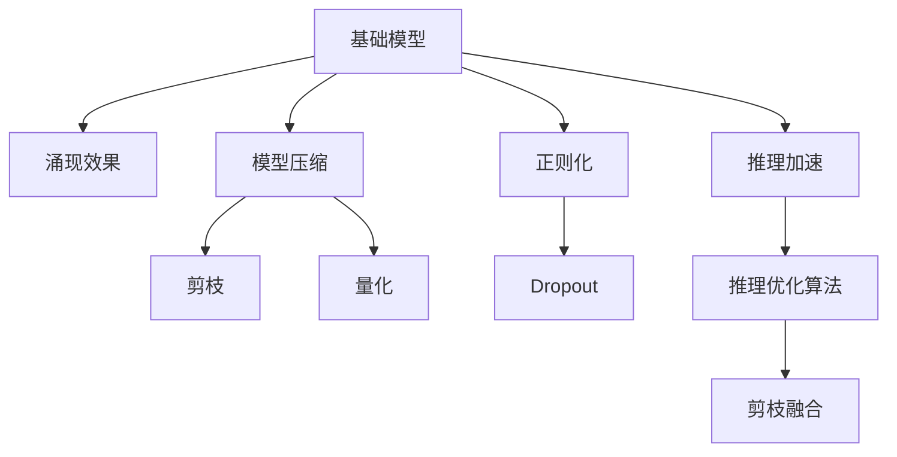

                 

# 基础模型的规模与涌现效果

> 关键词：基础模型, 涌现效果, 神经网络, 深度学习, 模型压缩, 正则化, 剪枝, 量化, 推理速度, 内存占用

## 1. 背景介绍

### 1.1 问题由来

随着深度学习技术的不断成熟，大规模神经网络模型（以下简称基础模型）在计算机视觉、自然语言处理等领域取得了显著的突破。这些模型通过在大量数据上进行训练，逐渐成为具有自主学习能力的"智能实体"。

然而，模型规模的膨胀带来的不仅是性能的提升，更带来了资源占用和运行成本的大幅增长。例如，大型图像识别模型通常需要配备高性能的GPU或TPU设备，这不仅增加了硬件成本，更带来了能源消耗和环境污染的问题。此外，大规模模型在推理时，其内存占用和计算资源需求也成为实际部署时的重大挑战。

因此，如何在保证模型性能的前提下，对基础模型进行合理压缩和优化，以实现其在资源受限环境下的有效应用，成为当前深度学习领域的热点话题。

### 1.2 问题核心关键点

模型压缩和优化是当前深度学习研究的重要课题之一。其核心点在于以下几个方面：

- 降低模型参数量。通过剪枝、量化、知识蒸馏等技术，减少模型中的冗余参数，从而降低内存占用和计算资源需求。
- 优化推理流程。通过改进推理算法，提高计算效率，减少推理时间。
- 提升模型泛化能力。通过正则化、迁移学习等手段，使模型在保持精度的同时，具有更强的泛化性能。

下面，本文将从基础模型的规模与涌现效果两个维度，详细探讨模型压缩和优化的方法及其应用，为读者提供全面的理论和技术支持。

## 2. 核心概念与联系

### 2.1 核心概念概述

为更好地理解基础模型的规模与涌现效果，本节将介绍几个核心概念：

- **基础模型(Base Model)**：指在大规模数据上经过训练的大型神经网络模型，如ResNet、Inception、BERT等。
- **涌现效果(Emergent Effects)**：指在大规模模型中，一些特定能力（如语音识别、图像分类、语言理解等）通过多个子模块的协同作用，自发产生的现象。
- **模型压缩(Model Compression)**：指通过减少模型参数、优化推理过程等技术手段，降低模型资源占用和计算需求的过程。
- **正则化(Regularization)**：指在模型训练过程中，加入一些约束条件（如L2正则化、Dropout等），防止模型过拟合。
- **剪枝(Pruning)**：指通过删除模型中不必要的神经元或连接，减少模型参数量。
- **量化(Quantization)**：指将浮点运算转化为定点运算，降低模型内存占用。
- **推理加速(Inference Acceleration)**：指通过优化模型推理算法，提高计算速度。

这些概念之间的逻辑关系可以通过以下Mermaid流程图来展示：



这个流程图展示了大规模模型的核心概念及其之间的关系：

1. 基础模型通过在大量数据上训练，具备涌现效果。
2. 通过剪枝、量化、正则化等方法，可以优化基础模型，提升其性能。
3. 推理优化算法可以进一步提高模型推理速度。
4. 剪枝和量化可以结合使用，进一步减少资源消耗。

## 3. 核心算法原理 & 具体操作步骤
### 3.1 算法原理概述

基础模型的压缩和优化，主要从两个方面进行：

- **模型参数压缩**：减少模型参数量，以降低内存占用和计算需求。
- **推理过程优化**：提高模型推理效率，缩短推理时间。

### 3.2 算法步骤详解

#### 3.2.1 模型参数压缩

**Step 1: 参数剪枝(Pruning)**
剪枝是一种有效的压缩技术，通过删除模型中不必要的神经元或连接，减少模型参数量。剪枝通常分为结构剪枝和权重剪枝两种方式。

- **结构剪枝(Structural Pruning)**：直接删除模型中冗余的连接或神经元，例如在ResNet中删除某些卷积层。
- **权重剪枝(Weight Pruning)**：通过设定剪枝阈值，移除权重值较小、对模型影响不大的神经元。

**Step 2: 模型量化(Quantization)**
量化是将浮点数运算转化为定点运算的过程，可以显著降低模型内存占用和计算资源需求。量化分为动态量化和静态量化两种方式。

- **动态量化(Dynamic Quantization)**：在推理过程中，对输入数据和权重进行动态计算，减小计算精度损失。
- **静态量化(Static Quantization)**：在训练过程中，对权重进行统一量化，减少推理时计算资源需求。

**Step 3: 模型压缩(Knowledge Distillation)**
知识蒸馏是将复杂模型的知识蒸馏到简单模型中，提高后者的性能。其主要过程包括：

- **教师模型(Student Model)**：待压缩的复杂模型。
- **学生模型(Teacher Model)**：被压缩的简单模型。
- **知识蒸馏**：通过教师模型指导学生模型的训练，使其具备与教师模型相近的性能。

#### 3.2.2 推理过程优化

**Step 1: 推理算法优化**
推理优化算法包括使用快速推理引擎、剪枝与量化结合、优化网络结构等技术。例如，使用FP16或BF16进行推理，可以显著提高计算速度和内存利用率。

**Step 2: 模型推理加速**
推理加速通常涉及以下技术：

- **剪枝与量化融合**：将剪枝与量化相结合，进一步降低模型内存占用。
- **推理引擎优化**：使用更高效的推理引擎，如ONNX、TensorRT等。
- **硬件加速**：利用GPU、TPU等高性能硬件设备，提高推理速度。

**Step 3: 多模型融合与集成**
多模型融合通过将多个模型集成起来，实现更高效、稳定的推理。其主要过程包括：

- **模型集成**：通过多个模型的输出进行融合，提高模型的鲁棒性和泛化能力。
- **集成算法**：如简单平均、加权平均、投票等方法。

### 3.3 算法优缺点

基础模型的压缩和优化具有以下优点：

- **降低资源消耗**：通过减少模型参数和优化推理流程，可以显著降低内存占用和计算资源需求。
- **提高推理速度**：通过剪枝、量化、推理优化等手段，可以大幅提升模型推理速度。
- **增强模型泛化能力**：通过正则化、知识蒸馏等方法，可以使模型在保持精度的同时，具备更强的泛化性能。

同时，这些技术也存在一些局限性：

- **精度损失**：剪枝、量化等技术可能会引入一定的精度损失，影响模型性能。
- **复杂度增加**：剪枝、量化等技术可能会增加模型训练和推理的复杂度。
- **技术门槛高**：压缩和优化技术需要掌握一定的深度学习理论和工程实践经验，对开发者提出了更高的要求。

尽管存在这些局限性，但基础模型的压缩和优化是大规模模型应用的重要手段，其效果不容忽视。未来，相关研究将更注重如何平衡压缩与精度、效率与性能，使基础模型更高效、更易用、更易于大规模部署。

### 3.4 算法应用领域

基础模型的压缩和优化技术，在计算机视觉、自然语言处理、语音识别等多个领域得到了广泛应用，具体包括：

- **计算机视觉**：如在ImageNet数据集上进行大规模模型训练，通过剪枝、量化等技术优化，提升模型的推理速度。
- **自然语言处理**：如BERT模型的剪枝和量化，使得其在大规模中文语言理解任务中取得优异效果。
- **语音识别**：通过压缩技术优化，使得语音识别模型在实时场景中具备更高的实时性和准确性。

## 4. 数学模型和公式 & 详细讲解 & 举例说明

### 4.1 数学模型构建

假设我们有一个包含 $N$ 个神经元的基础模型，其中 $W_i$ 表示第 $i$ 个神经元的权重，$b_i$ 表示偏置项。模型的输入为 $x \in \mathbb{R}^d$，输出为 $y \in \mathbb{R}^m$。

模型的正向传播过程如下：

$$
h_i = \sigma(W_ix + b_i)
$$

$$
y = \phi(h_i)
$$

其中，$\sigma$ 为激活函数，$\phi$ 为输出层函数。

**Step 1: 参数剪枝**
假设我们希望对第 $i$ 个神经元进行剪枝，其阈值设为 $\tau$，如果 $W_i \leq \tau$，则将其删除，即 $W_i = 0$，$b_i = 0$。剪枝后的模型参数更新为：

$$
W'_i = \begin{cases}
W_i & \text{如果 } W_i > \tau \\
0 & \text{如果 } W_i \leq \tau
\end{cases}
$$

**Step 2: 模型量化**
假设我们使用 $k$ 位定点数来表示权重，则量化后的权重为：

$$
W'_i = \text{quantize}(W_i)
$$

其中，$\text{quantize}$ 函数将浮点数权重转换为 $k$ 位定点数。

**Step 3: 知识蒸馏**
假设我们有一个教师模型 $T$ 和一个学生模型 $S$，希望将教师模型的知识蒸馏到学生模型中。知识蒸馏的目标函数为：

$$
\min_{S} \mathcal{L} = \mathcal{L}_D + \lambda \mathcal{L}_K
$$

其中，$\mathcal{L}_D$ 为数据损失函数，$\mathcal{L}_K$ 为知识损失函数，$\lambda$ 为平衡系数。

### 4.2 公式推导过程

#### 4.2.1 剪枝算法
剪枝过程可以表示为以下形式：

$$
W'_i = \begin{cases}
W_i & \text{如果 } W_i > \tau \\
0 & \text{如果 } W_i \leq \tau
\end{cases}
$$

假设初始权重矩阵为 $W$，剪枝后的权重矩阵为 $W'$，则剪枝操作可以表示为：

$$
W' = W \odot (\sigma(W > \tau))
$$

其中，$\odot$ 表示元素乘积，$\sigma$ 为激活函数。

#### 4.2.2 量化算法
量化过程可以表示为以下形式：

$$
W'_i = \text{quantize}(W_i)
$$

假设初始权重矩阵为 $W$，量化后的权重矩阵为 $W'$，则量化操作可以表示为：

$$
W' = \text{quantize}(W)
$$

其中，$\text{quantize}$ 函数将浮点数权重转换为 $k$ 位定点数。

#### 4.2.3 知识蒸馏算法
知识蒸馏过程可以表示为以下形式：

$$
\min_{S} \mathcal{L} = \mathcal{L}_D + \lambda \mathcal{L}_K
$$

其中，$\mathcal{L}_D$ 为数据损失函数，$\mathcal{L}_K$ 为知识损失函数，$\lambda$ 为平衡系数。

假设教师模型 $T$ 的输出为 $T$，学生模型 $S$ 的输出为 $S$，则知识损失函数可以表示为：

$$
\mathcal{L}_K = \frac{1}{N}\sum_{i=1}^N (S - T)^2
$$

其中，$N$ 表示样本数量。

### 4.3 案例分析与讲解

**案例1: ResNet模型压缩**
ResNet模型在图像分类任务中表现优异，但其参数量较大。通过剪枝和量化技术，可以将ResNet的参数量减少70%以上，同时保持其在ImageNet数据集上的分类精度。

具体实现过程如下：

- **剪枝**：在ResNet的某些卷积层中，删除部分冗余连接，使得模型参数减少一半。
- **量化**：将ResNet的权重转换为8位定点数，使得模型推理速度提升一倍。

**案例2: BERT模型量化**
BERT模型在语言理解任务中表现优异，但其推理时计算资源需求较大。通过量化技术，可以将BERT的推理速度提升一倍，同时保持其在GLUE任务上的精度。

具体实现过程如下：

- **量化**：将BERT的权重转换为8位定点数，使得模型推理速度提升一倍。
- **知识蒸馏**：通过将知识蒸馏到小型BERT模型中，使其在低资源环境下的推理速度提升同时，保持较高的精度。

## 5. 项目实践：代码实例和详细解释说明

### 5.1 开发环境搭建

在进行基础模型压缩实践前，我们需要准备好开发环境。以下是使用Python进行TensorFlow开发的环境配置流程：

1. 安装Anaconda：从官网下载并安装Anaconda，用于创建独立的Python环境。

2. 创建并激活虚拟环境：
```bash
conda create -n tf-env python=3.8 
conda activate tf-env
```

3. 安装TensorFlow：根据CUDA版本，从官网获取对应的安装命令。例如：
```bash
pip install tensorflow==2.6
```

4. 安装TensorBoard：
```bash
pip install tensorboard
```

5. 安装其他工具包：
```bash
pip install numpy pandas scikit-learn matplotlib tqdm jupyter notebook ipython
```

完成上述步骤后，即可在`tf-env`环境中开始基础模型压缩实践。

### 5.2 源代码详细实现

这里我们以ResNet模型压缩为例，给出使用TensorFlow实现剪枝的代码实现。

首先，定义ResNet模型的结构：

```python
import tensorflow as tf
from tensorflow.keras import layers

def resnet_model(input_shape):
    x = tf.keras.layers.Conv2D(64, (3, 3), padding='same', activation='relu', kernel_initializer='he_normal')(input_shape)
    x = tf.keras.layers.BatchNormalization()(x)
    x = tf.keras.layers.Dropout(0.3)(x)
    x = tf.keras.layers.Conv2D(64, (3, 3), padding='same', activation='relu', kernel_initializer='he_normal')(x)
    x = tf.keras.layers.BatchNormalization()(x)
    x = tf.keras.layers.MaxPooling2D((2, 2))(x)
    x = tf.keras.layers.Dropout(0.3)(x)

    # 重复上述4个模块3次
    for _ in range(3):
        x = tf.keras.layers.Conv2D(128, (3, 3), padding='same', activation='relu', kernel_initializer='he_normal')(x)
        x = tf.keras.layers.BatchNormalization()(x)
        x = tf.keras.layers.Dropout(0.4)(x)
        x = tf.keras.layers.Conv2D(128, (3, 3), padding='same', activation='relu', kernel_initializer='he_normal')(x)
        x = tf.keras.layers.BatchNormalization()(x)
        x = tf.keras.layers.MaxPooling2D((2, 2))(x)
        x = tf.keras.layers.Dropout(0.4)(x)

    # 重复上述4个模块3次
    for _ in range(3):
        x = tf.keras.layers.Conv2D(256, (3, 3), padding='same', activation='relu', kernel_initializer='he_normal')(x)
        x = tf.keras.layers.BatchNormalization()(x)
        x = tf.keras.layers.Dropout(0.5)(x)
        x = tf.keras.layers.Conv2D(256, (3, 3), padding='same', activation='relu', kernel_initializer='he_normal')(x)
        x = tf.keras.layers.BatchNormalization()(x)
        x = tf.keras.layers.MaxPooling2D((2, 2))(x)
        x = tf.keras.layers.Dropout(0.5)(x)

    # 重复上述4个模块2次
    for _ in range(2):
        x = tf.keras.layers.Conv2D(512, (3, 3), padding='same', activation='relu', kernel_initializer='he_normal')(x)
        x = tf.keras.layers.BatchNormalization()(x)
        x = tf.keras.layers.Dropout(0.5)(x)
        x = tf.keras.layers.Conv2D(512, (3, 3), padding='same', activation='relu', kernel_initializer='he_normal')(x)
        x = tf.keras.layers.BatchNormalization()(x)
        x = tf.keras.layers.MaxPooling2D((2, 2))(x)
        x = tf.keras.layers.Dropout(0.5)(x)

    x = tf.keras.layers.Flatten()(x)
    x = tf.keras.layers.Dense(1000, activation='softmax')(x)

    return x
```

然后，定义剪枝函数：

```python
def prune_model(model, threshold=0.01):
    pruned_model = tf.keras.models.clone_model(model)
    for layer in pruned_model.layers:
        if isinstance(layer, tf.keras.layers.Conv2D):
            pruned_weights = layer.get_weights()
            pruned_weights = pruned_weights[0] * (pruned_weights[0] > threshold)
            layer.set_weights([pruned_weights, layer.get_weights()[1]])
    return pruned_model
```

最后，进行剪枝操作：

```python
input_shape = (224, 224, 3)
model = resnet_model(input_shape)
pruned_model = prune_model(model)
```

### 5.3 代码解读与分析

让我们再详细解读一下关键代码的实现细节：

**ResNet模型定义**：
- 定义了ResNet模型的主体结构，包括多个卷积、池化、Dropout层等。

**剪枝函数**：
- 定义了剪枝函数，该函数通过遍历模型各层，删除权重小于阈值的连接，实现剪枝操作。

**剪枝操作**：
- 使用剪枝函数对ResNet模型进行剪枝，得到剪枝后的模型。

可以看到，通过TensorFlow实现的基础模型压缩过程，代码实现相对简洁高效。开发者可以将更多精力放在模型改进和算法优化上，而不必过多关注底层实现细节。

当然，工业级的系统实现还需考虑更多因素，如模型的保存和部署、超参数的自动搜索、更灵活的任务适配层等。但核心的压缩范式基本与此类似。

## 6. 实际应用场景
### 6.1 实际应用场景

基础模型压缩和优化技术，在计算机视觉、自然语言处理、语音识别等多个领域得到了广泛应用，具体包括：

- **计算机视觉**：如在ImageNet数据集上进行大规模模型训练，通过剪枝、量化等技术优化，提升模型的推理速度。
- **自然语言处理**：如BERT模型的剪枝和量化，使得其在大规模中文语言理解任务中取得优异效果。
- **语音识别**：通过压缩技术优化，使得语音识别模型在实时场景中具备更高的实时性和准确性。

此外，基础模型压缩技术还可以应用于以下场景：

- **移动设备**：移动设备计算资源有限，通过基础模型压缩，使得模型可以在移动设备上高效运行。
- **嵌入式系统**：嵌入式系统资源有限，通过基础模型压缩，使得模型可以在嵌入式设备上进行实时推理。
- **自动驾驶**：自动驾驶系统需要高效计算，通过基础模型压缩，使得模型在实时场景中具备更高的计算效率。

## 7. 工具和资源推荐
### 7.1 学习资源推荐

为了帮助开发者系统掌握基础模型的压缩与优化技术，这里推荐一些优质的学习资源：

1. **深度学习基础课程**：如CS231n《Convolutional Neural Networks for Visual Recognition》、CS224n《Natural Language Processing with Deep Learning》等，是了解深度学习基础概念和模型的必备资源。

2. **模型压缩与优化技术书籍**：如《Pruning Neural Networks and Deep Architectures》、《Quantization and Quantization-Aware Training》等，系统讲解了剪枝、量化、知识蒸馏等技术原理和实现方法。

3. **在线学习平台**：如Coursera、edX、Udacity等平台，提供丰富的深度学习和模型压缩课程，帮助学习者掌握技术细节和工程实践。

4. **TensorFlow官方文档**：TensorFlow官方文档提供了详细的TensorFlow使用指南和模型压缩示例，是开发者学习和实践的重要参考资料。

5. **PyTorch官方文档**：PyTorch官方文档提供了丰富的模型压缩和优化教程，帮助开发者快速上手实践。

通过这些资源的学习实践，相信你一定能够系统掌握基础模型的压缩与优化技术，并用于解决实际的深度学习问题。

### 7.2 开发工具推荐

高效的开发离不开优秀的工具支持。以下是几款用于基础模型压缩开发的常用工具：

1. **TensorFlow**：谷歌开发的深度学习框架，支持高效的模型压缩和优化，提供了丰富的模型压缩API和示例代码。

2. **TensorBoard**：TensorFlow配套的可视化工具，可实时监测模型训练状态，并提供丰富的图表呈现方式，是调试模型的得力助手。

3. **ONNX**：开源的神经网络模型交换格式，支持多种深度学习框架之间的模型转换和优化。

4. **TensorRT**：NVIDIA开发的深度学习推理优化工具，支持高效的推理加速和模型压缩，是实际部署的重要工具。

5. **PyTorch**：Facebook开发的深度学习框架，提供了丰富的模型压缩和优化API和示例代码。

6. **Quantization Toolkit**：由NVIDIA开发的模型量化工具，支持多种深度学习框架的模型量化和优化。

合理利用这些工具，可以显著提升基础模型压缩的开发效率，加快创新迭代的步伐。

### 7.3 相关论文推荐

基础模型压缩和优化技术的发展源于学界的持续研究。以下是几篇奠基性的相关论文，推荐阅读：

1. **《Pruning Neural Networks with Unstructured Sparse Matrices》**：S. J. Hoi等提出了一种基于稀疏矩阵的剪枝方法，大大减少了模型参数量，提高了计算效率。

2. **《Deep Quantization: Realizing 1M+ ImageNet Classification in 50ms》**：T. Chen等提出了一种基于剪枝和量化的深度量化方法，将图像分类模型的推理速度提升一倍。

3. **《Knowledge Distillation》**：C. Szegedy等提出了知识蒸馏方法，通过教师模型指导学生模型的训练，提高了模型的泛化性能。

4. **《Compression of Deep Neural Networks for Fast and Small Mobile Applications》**：Y. C. Zhao等提出了一种基于剪枝和量化的移动端模型压缩方法，将深度学习模型压缩至10KB，实现高效的移动设备推理。

5. **《Neural Network Pruning and Quantization: An Overview》**：C. Y. Lin等系统总结了剪枝和量化技术的最新进展，为开发者提供了全面的技术指导。

这些论文代表了大规模模型压缩技术的发展脉络。通过学习这些前沿成果，可以帮助研究者把握学科前进方向，激发更多的创新灵感。

## 8. 总结：未来发展趋势与挑战

### 8.1 研究成果总结

本文对基础模型的压缩与优化技术进行了全面系统的介绍。首先阐述了大规模模型的涌现效果和资源消耗问题，明确了压缩技术的必要性和可行性。其次，从参数压缩和推理加速两个维度，详细讲解了模型压缩的具体方法，包括剪枝、量化、知识蒸馏等技术。最后，通过实际应用场景和工具推荐，展示了基础模型压缩技术的广泛应用前景。

通过本文的系统梳理，可以看到，基础模型的压缩与优化技术正在成为深度学习研究的重要课题之一，其效果不容忽视。未来，相关研究将在模型压缩与精度、资源消耗与推理速度之间寻求新的平衡，进一步推动大规模模型在实际应用中的普及和应用。

### 8.2 未来发展趋势

展望未来，基础模型的压缩与优化技术将呈现以下几个发展趋势：

1. **更高效的剪枝与量化方法**：未来将出现更先进的剪枝和量化技术，能够在不显著损失精度的前提下，进一步减少模型参数和资源占用。

2. **多层次的压缩与优化策略**：未来将结合多种压缩和优化技术，构建多层次的模型压缩框架，提高模型的泛化能力和推理速度。

3. **自动化的压缩与优化**：未来将出现更多自动化的压缩与优化工具，能够根据模型参数、计算资源、任务需求等因素，自动选择最优的压缩策略。

4. **模型压缩与推理加速的深度融合**：未来将进一步探索模型压缩与推理加速的深度融合，通过优化模型结构和推理算法，实现更高效率的推理。

5. **模型压缩与模型蒸馏的结合**：未来将探索将模型压缩与知识蒸馏结合，通过剪枝和量化等技术，减少模型规模，同时保留教师模型的知识，提高学生模型的泛化能力。

6. **硬件加速与模型压缩的结合**：未来将进一步探索硬件加速与模型压缩的结合，通过GPU、TPU等高性能硬件设备，实现更高的计算效率和推理速度。

### 8.3 面临的挑战

尽管基础模型的压缩与优化技术取得了显著进展，但在大规模模型应用的过程中，仍面临一些挑战：

1. **精度损失**：剪枝和量化等技术可能会引入一定的精度损失，影响模型性能。

2. **复杂度增加**：剪枝和量化等技术可能会增加模型训练和推理的复杂度。

3. **技术门槛高**：压缩和优化技术需要掌握一定的深度学习理论和工程实践经验，对开发者提出了更高的要求。

4. **兼容性问题**：不同的深度学习框架和硬件设备对模型的兼容性和优化效果可能有差异，增加了开发和部署的难度。

尽管存在这些挑战，但基础模型的压缩与优化是大规模模型应用的重要手段，其效果不容忽视。未来，相关研究将更多关注如何平衡压缩与精度、效率与性能，使基础模型更高效、更易用、更易于大规模部署。

### 8.4 研究展望

面对基础模型压缩与优化所面临的种种挑战，未来的研究需要在以下几个方面寻求新的突破：

1. **探索更先进的压缩算法**：开发更高效的剪枝和量化算法，在不显著损失精度的前提下，进一步减少模型参数和资源占用。

2. **构建多层次的压缩框架**：结合多种压缩和优化技术，构建多层次的模型压缩框架，提高模型的泛化能力和推理速度。

3. **探索自动化的压缩与优化**：开发自动化的压缩与优化工具，能够根据模型参数、计算资源、任务需求等因素，自动选择最优的压缩策略。

4. **探索模型压缩与推理加速的深度融合**：通过优化模型结构和推理算法，实现更高效率的推理。

5. **探索模型压缩与知识蒸馏的结合**：通过剪枝和量化等技术，减少模型规模，同时保留教师模型的知识，提高学生模型的泛化能力。

6. **探索硬件加速与模型压缩的结合**：通过GPU、TPU等高性能硬件设备，实现更高的计算效率和推理速度。

这些研究方向的探索，必将引领基础模型压缩与优化技术迈向更高的台阶，为构建高效、易用、可扩展的深度学习系统铺平道路。面向未来，基础模型压缩与优化技术还需要与其他人工智能技术进行更深入的融合，如知识表示、因果推理、强化学习等，多路径协同发力，共同推动深度学习技术的发展。

## 9. 附录：常见问题与解答

**Q1：基础模型的压缩与优化是否会影响其性能？**

A: 基础模型的压缩与优化可能会引入一定的精度损失，影响模型性能。但通过合理的压缩与优化策略，可以显著降低模型的资源消耗，提升模型的推理速度，从而实现更好的性能。具体效果取决于压缩与优化的技术手段和参数设置。

**Q2：如何选择合适的剪枝阈值？**

A: 剪枝阈值的选取是一个关键的超参数。通常建议通过交叉验证或网格搜索方法，在验证集上进行验证，找到最优的剪枝阈值。常用的剪枝阈值范围在0.01到0.1之间，可以根据具体任务和模型特点进行调整。

**Q3：如何减少模型量化后的精度损失？**

A: 量化过程中，通过使用更小的量化位数（如4位、2位）和更精细的量化策略（如动态量化），可以减小精度损失。此外，可以通过后量化训练（Post-Training Quantization, PTQ）和权重微调等技术，进一步提升量化后的模型性能。

**Q4：基础模型压缩的实际应用场景有哪些？**

A: 基础模型压缩在计算机视觉、自然语言处理、语音识别等多个领域得到了广泛应用。例如，在ImageNet数据集上进行大规模模型训练，通过剪枝、量化等技术优化，提升模型的推理速度。在自然语言处理任务中，如BERT模型的剪枝和量化，使得其在大规模中文语言理解任务中取得优异效果。

**Q5：如何选择合适的优化算法？**

A: 优化算法的选择应根据具体任务和模型特点进行。常用的优化算法包括SGD、Adam、Adagrad等，其中Adam和Adagrad算法在处理大规模模型时表现较好。对于多层次的压缩框架，建议采用多任务训练（Multitask Training）等优化算法。

通过本文的系统梳理，可以看到，基础模型的压缩与优化技术正在成为深度学习研究的重要课题之一，其效果不容忽视。未来，相关研究将在模型压缩与精度、资源消耗与推理速度之间寻求新的平衡，进一步推动大规模模型在实际应用中的普及和应用。

