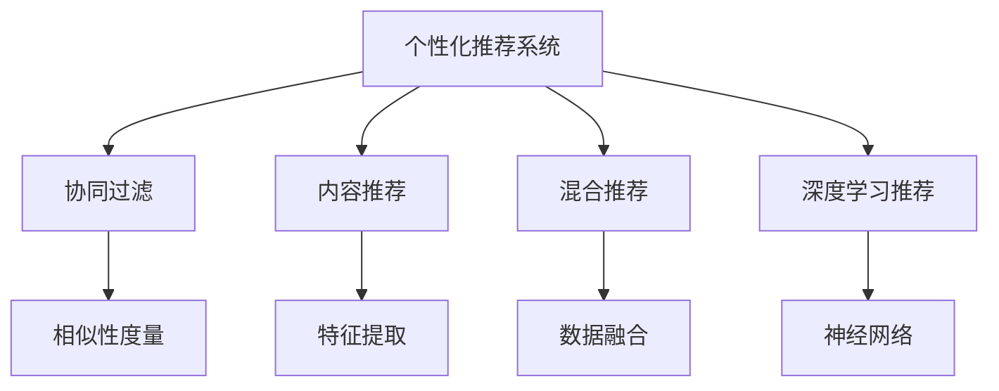

                 

# 增加客单价：个性化推荐的优势

> 关键词：个性化推荐, 个性化推荐算法, 数据分析, 客户行为分析, 产品推荐, 消费者行为, 消费心理学, 电子商务, 零售业, 客户流失率, 客单价提升

## 1. 背景介绍

### 1.1 问题由来
在现代电商和零售业中，如何提升客户购买体验，增加客单价（Average Order Value, AOV），是所有企业都面临的重要挑战。传统的营销手段如广告、打折、满减等虽然能够吸引新客户，但难以显著提升客户对单个订单的贡献度，且容易降低客户对品牌的忠诚度。个性化推荐技术的兴起，通过精准匹配客户需求，推荐其可能感兴趣的商品，不仅能够增加客单价，还能提升客户满意度和品牌忠诚度。

### 1.2 问题核心关键点
个性化推荐的核心在于深度理解客户行为，并根据其过往历史和当前偏好，推荐最可能感兴趣的商品。相较于传统的全站推荐、随机推荐等粗粒度推荐策略，个性化推荐能够实现以下几大优势：
1. **精准匹配**：通过分析客户历史购买记录、浏览行为、评价信息等多维度数据，深入挖掘客户偏好，提升推荐结果的匹配度。
2. **交叉销售**：通过推荐相关或互补产品，实现一个订单购买多种商品，提升客单价。
3. **多渠道协同**：通过跨平台、跨设备的数据融合，实现全场景下的个性化推荐。
4. **实时动态**：通过持续学习和动态调整推荐模型，适应客户需求的变化。

### 1.3 问题研究意义
个性化推荐技术的应用，对于电商和零售业具有重要意义：

1. **提升销售额**：通过精准推荐，促进客户下单，显著提升单个订单的平均购买金额。
2. **增加客户粘性**：个性化的购物体验增强客户满意度，增加客户的复购率。
3. **降低获客成本**：个性化推荐能够通过已有客户的推荐，吸引新客户，降低获客营销成本。
4. **优化库存管理**：精准预测客户需求，减少库存积压，提升库存周转率。
5. **驱动业务增长**：个性化推荐能够实现对不同客户群体的精准营销，加速业务发展。

## 2. 核心概念与联系

### 2.1 核心概念概述

为更好地理解个性化推荐技术的原理，本节将介绍几个密切相关的核心概念：

- **个性化推荐系统（Personalized Recommendation System, PRS）**：利用用户行为数据和模型算法，自动生成个性化推荐结果的系统。
- **协同过滤（Collaborative Filtering）**：通过分析用户和物品之间的交互行为，推荐相似用户喜欢的物品。
- **内容推荐（Content-Based Recommendation）**：根据物品特征与用户兴趣的匹配度进行推荐。
- **混合推荐（Hybrid Recommendation）**：结合协同过滤和内容推荐，综合多种因素生成推荐结果。
- **深度学习推荐（Deep Learning Recommendation）**：利用神经网络等深度学习模型，从大量数据中提取隐含的复杂关系，生成高质量推荐。

这些核心概念之间的逻辑关系可以通过以下Mermaid流程图来展示：



这个流程图展示了个性化推荐系统的核心概念及其之间的关系：

1. 个性化推荐系统通过协同过滤、内容推荐、混合推荐和深度学习推荐等方法，生成推荐结果。
2. 协同过滤利用相似性度量，分析用户和物品之间的交互行为。
3. 内容推荐通过特征提取，根据物品特征与用户兴趣的匹配度进行推荐。
4. 混合推荐将协同过滤和内容推荐融合，生成更加全面、准确的结果。
5. 深度学习推荐使用神经网络模型，提取数据中的复杂关系，提升推荐质量。

这些概念共同构成了个性化推荐技术的基本框架，使其能够实现精准的个性化推荐。

## 3. 核心算法原理 & 具体操作步骤

### 3.1 算法原理概述

个性化推荐的核心思想是利用客户的历史行为数据，通过模型算法生成推荐结果。具体而言，个性化推荐系统通常包含以下几个核心步骤：

1. **数据采集**：从各种渠道收集客户行为数据，如浏览记录、购买记录、评价信息等。
2. **特征工程**：将原始数据转化为模型能够处理的特征，如商品ID、用户ID、评分等。
3. **模型训练**：根据历史数据训练推荐模型，常用的模型包括协同过滤、内容推荐、深度学习等。
4. **推荐生成**：根据新客户的行为数据，利用训练好的模型生成个性化推荐结果。
5. **评估优化**：通过A/B测试、点击率等指标，评估推荐效果，根据反馈数据不断优化模型。

### 3.2 算法步骤详解

以下是详细讲解个性化推荐系统的核心算法步骤：

**Step 1: 数据采集与预处理**

首先，需要从不同的渠道（如APP、网站、社交媒体等）收集客户的行为数据。数据包括：
- **浏览记录**：客户访问过哪些页面、商品等信息。
- **购买记录**：客户购买过哪些商品，购买时间、数量、金额等。
- **评价信息**：客户对商品或服务的评价内容。

数据的预处理包括：
- **去重去噪**：去除重复和无关的记录，清洗异常值。
- **归一化**：对不同维度数据进行标准化处理，如归一化、对数变换等。
- **维度缩减**：采用主成分分析（PCA）、降维等方法，降低特征维度，提高计算效率。

**Step 2: 特征工程**

特征工程是将原始数据转化为模型能够处理的特征的过程。常见的特征包括：
- **用户特征**：用户ID、年龄、性别、地域等。
- **物品特征**：商品ID、价格、类别、品牌等。
- **行为特征**：浏览次数、购买次数、评价评分、点击率等。

特征工程的核心目标是提高模型对用户行为的理解和预测能力。例如，可以通过以下方法提取用户特征：
- **年龄性别特征**：利用用户的生日、性别信息，生成年龄段、性别分类等特征。
- **地域特征**：根据用户注册地址或IP地址，生成地域编码等特征。
- **行为特征**：通过用户历史行为数据，生成点击率、购买频率、平均订单金额等特征。

**Step 3: 模型训练与评估**

模型训练是利用历史数据训练推荐模型的过程。常用的模型包括：

1. **协同过滤**：基于用户和物品之间的交互行为，推荐相似用户喜欢的物品。
   - **用户-物品矩阵**：将用户和物品的交互行为记录成矩阵，利用用户和物品之间的相似度计算推荐结果。
   - **邻域算法**：根据相似用户推荐物品，常用的算法包括基于用户的KNN、基于物品的KNN等。
   - **矩阵分解**：将用户-物品矩阵分解成用户特征矩阵和物品特征矩阵，通过矩阵乘积计算推荐结果。

2. **内容推荐**：根据物品特征与用户兴趣的匹配度进行推荐。
   - **特征提取**：利用TF-IDF、词向量等方法，将物品特征转化为向量形式。
   - **相似性计算**：利用余弦相似度、欧几里得距离等方法，计算物品之间的相似度。
   - **推荐算法**：基于相似度的推荐算法，如基于物品的协同过滤、基于内容的协同过滤等。

3. **混合推荐**：将协同过滤和内容推荐融合，生成更加全面、准确的结果。
   - **融合方法**：采用加权融合、线性融合、混合矩阵等方法，将两种推荐结果进行组合。
   - **数据融合**：利用用户的购买记录、浏览行为、评分等数据，进行多维度的数据融合。

4. **深度学习推荐**：利用神经网络等深度学习模型，从大量数据中提取隐含的复杂关系，生成高质量推荐。
   - **神经网络架构**：采用多层感知机（MLP）、卷积神经网络（CNN）、循环神经网络（RNN）等架构。
   - **嵌入表示**：将用户和物品的特征转化为高维向量，进行语义相似度计算。
   - **推荐策略**：基于预测结果的推荐策略，如基于内容的推荐、基于序列的推荐等。

模型评估是利用测试数据评估推荐模型效果的过程。常用的评估指标包括：
- **准确率（Precision）**：推荐结果中准确预测为正例的比例。
- **召回率（Recall）**：正例被推荐出来的比例。
- **F1分数（F1 Score）**：准确率和召回率的调和平均数。
- **点击率（Click-Through Rate, CTR）**：用户点击推荐结果的比例。
- **转化率（Conversion Rate）**：用户实际购买推荐商品的比例。

**Step 4: 推荐生成与优化**

推荐生成是利用训练好的模型生成个性化推荐结果的过程。推荐结果通常包括：
- **商品ID**：推荐商品的唯一标识。
- **商品标题**：推荐商品的名称。
- **商品图片**：推荐商品的图片。
- **价格**：推荐商品的价格。
- **评分**：用户对推荐商品的评分。

推荐优化的核心目标是不断优化模型，提升推荐效果。常用的优化方法包括：
- **A/B测试**：通过多版本测试，比较不同模型的效果。
- **交叉验证**：将数据划分为训练集和验证集，进行模型验证和调整。
- **超参数调优**：通过网格搜索、随机搜索等方法，优化模型超参数。
- **模型更新**：根据新数据不断更新模型，保持模型的时效性和准确性。

### 3.3 算法优缺点

个性化推荐系统具有以下优点：
1. **精准匹配**：利用客户历史数据，深度挖掘用户偏好，提升推荐准确率。
2. **提升客单价**：通过交叉销售和交叉推荐，增加单个订单的平均购买金额。
3. **降低获客成本**：通过已有客户的推荐，吸引新客户，减少营销成本。
4. **个性化体验**：根据用户行为数据，提供个性化的购物体验，提升客户满意度。
5. **实时动态**：通过持续学习和动态调整推荐模型，适应客户需求的变化。

同时，个性化推荐系统也存在一些局限性：
1. **冷启动问题**：新客户缺乏历史数据，难以进行精准推荐。
2. **数据隐私**：客户行为数据涉及隐私，数据收集和存储需要严格遵守法律法规。
3. **多样性问题**：过度依赖用户历史行为，可能导致推荐结果多样性不足。
4. **模型复杂度**：复杂的模型需要更多的计算资源和时间，可能面临性能瓶颈。
5. **算法透明性**：推荐算法黑盒化，难以解释其内部逻辑和决策过程。

尽管存在这些局限性，但就目前而言，个性化推荐系统仍是大数据时代推荐技术的重要手段。未来相关研究的重点在于如何进一步提升推荐模型的透明性和可解释性，同时降低对数据隐私的依赖。

### 3.4 算法应用领域

个性化推荐技术在电商和零售领域具有广泛的应用：

1. **商品推荐**：通过分析客户购买历史和浏览行为，推荐可能感兴趣的商品。
2. **定制服务**：根据客户偏好和需求，提供定制化商品或服务。
3. **优惠券推荐**：基于客户消费习惯，推荐合适的优惠券或折扣信息。
4. **广告投放**：根据客户兴趣，精准投放广告，提升广告效果。
5. **用户分析**：通过客户行为数据，分析用户需求和偏好，优化产品和服务。

除了电商和零售领域，个性化推荐技术在其他领域也有应用，例如：

- **新闻推荐**：根据用户阅读历史，推荐可能感兴趣的新闻。
- **音乐推荐**：根据用户听歌历史，推荐可能喜欢的音乐。
- **视频推荐**：根据用户观影历史，推荐可能感兴趣的视频。

## 4. 数学模型和公式 & 详细讲解

### 4.1 数学模型构建

本节将使用数学语言对个性化推荐系统的核心模型进行更加严格的刻画。

假设客户历史行为数据为 $\mathcal{D}=\{(x_i, y_i)\}_{i=1}^N$，其中 $x_i$ 为特征向量，$y_i$ 为标签（购买、浏览等行为）。设推荐模型的参数为 $\theta$，训练过程的目标是最小化损失函数 $\mathcal{L}(\theta)$，使得预测结果与真实标签的误差最小化。

目标函数为：

$$
\min_{\theta} \mathcal{L}(\theta) = \frac{1}{N} \sum_{i=1}^N \ell(y_i, \hat{y}_i(\theta))
$$

其中 $\hat{y}_i(\theta)$ 为模型在特征 $x_i$ 下的预测结果，$\ell(y_i, \hat{y}_i(\theta))$ 为预测误差。常用的预测误差函数包括均方误差（MSE）、交叉熵（Cross-Entropy）等。

### 4.2 公式推导过程

以协同过滤模型为例，推导推荐结果的计算公式。

假设用户-物品矩阵 $\mathbf{P} \in \mathbb{R}^{m \times n}$，其中 $m$ 为用户数，$n$ 为物品数。设用户 $u$ 对物品 $i$ 的评分 $p_{ui}$ 为正样本，评分为 $0$ 或负样本为负样本。设用户 $u$ 对物品 $i$ 的评分预测值 $\hat{p}_{ui}(\theta)$ 为：

$$
\hat{p}_{ui}(\theta) = \mathbf{p}_{ui}^T \mathbf{w} + b
$$

其中 $\mathbf{p}_{ui} \in \mathbb{R}^{n}$ 为物品 $i$ 的特征向量，$\mathbf{w} \in \mathbb{R}^{n}$ 为模型的权重向量，$b$ 为偏置项。

目标函数为：

$$
\min_{\theta} \mathcal{L}(\theta) = \frac{1}{N} \sum_{i=1}^N \ell(y_i, \hat{y}_i(\theta))
$$

其中 $\ell(y_i, \hat{y}_i(\theta))$ 为预测误差函数，常用的函数包括均方误差（MSE）和二分类交叉熵（Binary Cross-Entropy）。

假设用户 $u$ 对物品 $i$ 的评分预测值为正样本的概率为：

$$
\hat{y}_{ui}(\theta) = \sigma(\hat{p}_{ui}(\theta))
$$

其中 $\sigma(z) = \frac{1}{1+e^{-z}}$ 为sigmoid函数。

根据预测结果，为用户推荐物品 $i$ 的概率为：

$$
\Pr(i | u, \theta) = \frac{\exp(\hat{p}_{ui}(\theta))}{\sum_j \exp(\hat{p}_{uj}(\theta))}
$$

根据上式，可以生成推荐结果 $\mathcal{R}_u = \{(i, \Pr(i | u, \theta))\}_{i=1}^n$，其中 $\mathcal{R}_u$ 为用户 $u$ 的推荐列表。

## 5. 项目实践：代码实例和详细解释说明

### 5.1 开发环境搭建

在进行个性化推荐系统开发前，我们需要准备好开发环境。以下是使用Python进行PyTorch开发的环境配置流程：

1. 安装Anaconda：从官网下载并安装Anaconda，用于创建独立的Python环境。

2. 创建并激活虚拟环境：
```bash
conda create -n pytorch-env python=3.8 
conda activate pytorch-env
```

3. 安装PyTorch：根据CUDA版本，从官网获取对应的安装命令。例如：
```bash
conda install pytorch torchvision torchaudio cudatoolkit=11.1 -c pytorch -c conda-forge
```

4. 安装TensorFlow：
```bash
conda install tensorflow tensorflow-gpu=2.4.1
```

5. 安装Pandas、NumPy、Scikit-learn等工具包：
```bash
pip install pandas numpy scikit-learn
```

完成上述步骤后，即可在`pytorch-env`环境中开始推荐系统开发。

### 5.2 源代码详细实现

下面我们以协同过滤推荐系统为例，给出使用PyTorch进行模型训练和推荐生成的PyTorch代码实现。

首先，定义用户-物品矩阵的读取和处理函数：

```python
import pandas as pd
import numpy as np
from sklearn.preprocessing import MinMaxScaler

def load_and_preprocess_data(file_path):
    # 读取数据
    data = pd.read_csv(file_path)
    
    # 数据处理
    user_ids = data['user_id'].unique().tolist()
    item_ids = data['item_id'].unique().tolist()
    
    # 构建用户-物品矩阵
    P = pd.pivot_table(data, values='rating', index='user_id', columns='item_id', fill_value=0)
    
    # 归一化处理
    P = MinMaxScaler().fit_transform(P.values)
    
    # 转置矩阵
    P = P.T
    
    return user_ids, item_ids, P
```

然后，定义协同过滤模型的训练函数：

```python
import torch
import torch.nn as nn
import torch.nn.functional as F
import torch.optim as optim

class CollaborativeFilteringModel(nn.Module):
    def __init__(self, n_users, n_items, embedding_dim):
        super(CollaborativeFilteringModel, self).__init__()
        self.user_embedding = nn.Embedding(n_users, embedding_dim)
        self.item_embedding = nn.Embedding(n_items, embedding_dim)
        self.prediction = nn.Linear(embedding_dim, 1)
    
    def forward(self, user_ids, item_ids):
        user_embedding = self.user_embedding(user_ids)
        item_embedding = self.item_embedding(item_ids)
        prediction = self.prediction((user_embedding * item_embedding).sum(dim=1))
        return prediction

def train_model(model, P, batch_size, epochs, learning_rate):
    criterion = nn.BCELoss()
    optimizer = optim.Adam(model.parameters(), lr=learning_rate)
    
    for epoch in range(epochs):
        total_loss = 0
        for user_id in user_ids:
            for item_id in P.columns:
                if P[user_id][item_id] == 0:
                    continue
                optimizer.zero_grad()
                prediction = model(user_id, item_id)
                loss = criterion(prediction, torch.tensor(P[user_id][item_id]))
                loss.backward()
                optimizer.step()
                total_loss += loss.item()
        
        print(f"Epoch {epoch+1}, train loss: {total_loss/len(P)}")
    
    return model
```

接着，定义推荐生成函数：

```python
def predict(model, P, user_id, top_n):
    user_embedding = model.user_embedding(torch.tensor(user_id))
    user_top_n = model.prediction(user_embedding)[:top_n]
    return list(zip(item_ids, user_top_n.tolist()))
```

最后，启动训练流程并在测试集上评估：

```python
user_ids, item_ids, P = load_and_preprocess_data('data.csv')
model = CollaborativeFilteringModel(len(user_ids), len(item_ids), 10)
model = train_model(model, P, batch_size=32, epochs=10, learning_rate=0.01)

print(f"Top 5 recommendations for user {user_id}:")
for item_id, score in predict(model, P, user_id, 5):
    print(f"Item: {item_id}, Score: {score}")
```

以上就是使用PyTorch对协同过滤推荐系统进行训练和推荐生成的完整代码实现。可以看到，得益于PyTorch的强大封装，我们可以用相对简洁的代码完成协同过滤模型的实现。

### 5.3 代码解读与分析

让我们再详细解读一下关键代码的实现细节：

**load_and_preprocess_data函数**：
- 读取用户-物品评分数据。
- 构建用户-物品矩阵 $P$。
- 进行归一化处理，确保模型训练的稳定性。

**CollaborativeFilteringModel类**：
- 定义了协同过滤模型的结构。
- 包含用户嵌入层、物品嵌入层和预测层。
- 实现前向传播和损失计算。

**train_model函数**：
- 定义了模型的训练过程。
- 使用Adam优化器和二分类交叉熵损失函数。
- 在每个epoch中，对每个用户-物品评分进行训练，更新模型参数。

**predict函数**：
- 实现模型的推荐生成过程。
- 根据用户ID，生成预测评分。
- 返回评分最高的前top_n个物品ID。

**训练流程**：
- 定义总的epoch数和批大小，开始循环迭代。
- 每个epoch内，在训练集中对每个用户-物品评分进行训练。
- 输出每个epoch的平均loss。

可以看到，使用PyTorch和TensorFlow等深度学习框架进行推荐系统的开发，可以极大地提升开发效率和模型性能。开发者可以更专注于模型的设计和优化，而不必过多关注底层实现细节。

当然，工业级的系统实现还需考虑更多因素，如模型的保存和部署、超参数的自动搜索、推荐结果的展示等。但核心的推荐范式基本与此类似。

## 6. 实际应用场景

### 6.1 电商个性化推荐

在电商领域，个性化推荐系统能够显著提升客户购物体验和销售额。具体应用场景包括：

- **商品推荐**：根据客户浏览和购买历史，推荐可能感兴趣的商品。
- **交叉销售**：结合客户当前浏览商品，推荐相关或互补产品。
- **个性化广告**：根据客户兴趣，推送个性化广告，提高广告点击率和转化率。

### 6.2 视频流媒体推荐

视频流媒体平台利用个性化推荐系统，为用户推荐可能感兴趣的视频内容，提升用户观看时长和满意度。具体应用场景包括：

- **内容推荐**：根据用户观看历史，推荐可能喜欢的视频内容。
- **个性化频道**：根据用户兴趣，推荐定制化的视频频道。
- **直播互动**：根据用户行为，推荐主播或直播内容。

### 6.3 新闻推荐

新闻平台利用个性化推荐系统，根据用户阅读历史，推荐可能感兴趣的新闻内容。具体应用场景包括：

- **新闻推荐**：根据用户浏览记录，推荐相关新闻内容。
- **个性化专栏**：根据用户兴趣，推荐定制化的新闻专栏。
- **动态话题**：根据用户兴趣，推荐热门话题和新闻。

### 6.4 社交媒体推荐

社交媒体平台利用个性化推荐系统，为用户推荐可能感兴趣的内容。具体应用场景包括：

- **内容推荐**：根据用户浏览记录，推荐相关内容。
- **关系推荐**：根据用户社交关系，推荐可能感兴趣的朋友。
- **个性化订阅**：根据用户兴趣，推荐个性化的订阅内容。

## 7. 工具和资源推荐

### 7.1 学习资源推荐

为了帮助开发者系统掌握个性化推荐技术的理论基础和实践技巧，这里推荐一些优质的学习资源：

1. 《推荐系统：算法与实现》系列博文：由专家撰写，深入浅出地介绍了推荐系统的基本原理和实现方法。

2. 《推荐系统实战》书籍：基于TensorFlow实现推荐系统，包含丰富的实战案例和代码示例。

3. 《Deep Learning for Recommendation Engines》论文：介绍了基于深度学习的推荐系统架构和算法。

4. Kaggle推荐系统竞赛：通过实际数据集竞赛，实践推荐系统的开发和优化。

5. Coursera《推荐系统》课程：由斯坦福大学开设的推荐系统课程，系统讲解了推荐系统的理论基础和应用实例。

通过对这些资源的学习实践，相信你一定能够快速掌握个性化推荐技术的精髓，并用于解决实际的推荐问题。

### 7.2 开发工具推荐

高效的开发离不开优秀的工具支持。以下是几款用于个性化推荐系统开发的常用工具：

1. TensorFlow：基于Google的深度学习框架，支持分布式计算，适合大规模工程应用。

2. PyTorch：由Facebook开发的开源深度学习框架，灵活的动态图设计，适合快速迭代研究。

3. Spark MLlib：Apache Spark的机器学习库，支持大规模数据处理和机器学习任务。

4. Hadoop：用于大数据处理和分析的开源平台，适合大规模数据集的处理。

5. Elasticsearch：基于Lucene的分布式搜索引擎，适合大规模文本数据的存储和检索。

合理利用这些工具，可以显著提升个性化推荐系统的开发效率，加速推荐模型的迭代和优化。

### 7.3 相关论文推荐

个性化推荐技术的发展源于学界的持续研究。以下是几篇奠基性的相关论文，推荐阅读：

1. Matrix Factorization Techniques for Recommender Systems：提出了基于矩阵分解的协同过滤方法，广泛应用于推荐系统。

2. Neural Collaborative Filtering：利用神经网络模型进行协同过滤推荐，提升了推荐模型的效果。

3. Attention-Based Recommender Systems：引入注意力机制，增强推荐模型的自适应能力和多样性。

4. Deep Interest Network：利用深度学习模型，从用户兴趣的多个维度进行推荐。

5. Factorization Machines：提出了基于因子分解的推荐算法，广泛应用于电商和视频推荐。

这些论文代表了个性化推荐技术的发展脉络。通过学习这些前沿成果，可以帮助研究者把握学科前进方向，激发更多的创新灵感。

## 8. 总结：未来发展趋势与挑战

### 8.1 总结

本文对个性化推荐技术进行了全面系统的介绍。首先阐述了个性化推荐系统的研究背景和意义，明确了其对于提升电商和零售领域客单价的重要作用。其次，从原理到实践，详细讲解了个性化推荐模型的构建和训练过程，给出了推荐系统开发的完整代码实例。同时，本文还广泛探讨了个性化推荐技术在多个行业领域的应用前景，展示了其巨大的潜力。此外，本文精选了推荐技术的各类学习资源，力求为读者提供全方位的技术指引。

通过本文的系统梳理，可以看到，个性化推荐技术正在成为电商和零售领域的重要范式，极大地提升客户购物体验和销售额。随着推荐模型的不断进步，未来推荐技术必将在更多领域得到应用，为各行各业带来新的变革。

### 8.2 未来发展趋势

展望未来，个性化推荐技术将呈现以下几个发展趋势：

1. **深度学习模型的应用**：深度学习模型由于其强大的表示能力，将在推荐系统中得到更广泛的应用。基于神经网络的推荐模型将逐步取代传统的协同过滤和内容推荐模型。

2. **多模态数据融合**：随着用户数据的多样性增加，推荐系统将越来越多地利用多模态数据（如文本、图像、视频等），提高推荐结果的准确性和多样性。

3. **实时动态推荐**：推荐系统将利用实时数据流，进行动态推荐调整，提升推荐的时效性和个性化程度。

4. **自适应推荐**：推荐系统将结合用户行为数据和环境变化，实现自适应推荐，不断优化推荐结果。

5. **用户隐私保护**：推荐系统将越来越多地关注用户隐私保护，采用差分隐私、联邦学习等技术，保护用户数据安全。

6. **跨平台协同**：推荐系统将实现跨平台、跨设备的数据融合，提升推荐结果的一致性和可靠性。

以上趋势凸显了个性化推荐技术的广阔前景。这些方向的探索发展，必将进一步提升推荐系统的性能和应用范围，为电子商务、视频流媒体、社交媒体等多个行业带来新的变革。

### 8.3 面临的挑战

尽管个性化推荐技术已经取得了瞩目成就，但在迈向更加智能化、普适化应用的过程中，它仍面临以下挑战：

1. **冷启动问题**：新用户缺乏历史数据，难以进行精准推荐。
2. **数据隐私**：用户行为数据涉及隐私，数据收集和存储需要严格遵守法律法规。
3. **多样性问题**：过度依赖用户历史行为，可能导致推荐结果多样性不足。
4. **模型复杂度**：复杂的模型需要更多的计算资源和时间，可能面临性能瓶颈。
5. **算法透明性**：推荐算法黑盒化，难以解释其内部逻辑和决策过程。

尽管存在这些挑战，但就目前而言，个性化推荐系统仍是大数据时代推荐技术的重要手段。未来相关研究的重点在于如何进一步提升推荐模型的透明性和可解释性，同时降低对数据隐私的依赖。

### 8.4 研究展望

面对个性化推荐系统所面临的挑战，未来的研究需要在以下几个方面寻求新的突破：

1. **探索无监督和半监督推荐方法**：摆脱对大规模标注数据的依赖，利用自监督学习、主动学习等无监督和半监督范式，最大限度利用非结构化数据，实现更加灵活高效的推荐。

2. **研究参数高效和计算高效的推荐范式**：开发更加参数高效的推荐方法，在固定大部分推荐参数的情况下，只更新极少量的任务相关参数。同时优化推荐模型的计算图，减少前向传播和反向传播的资源消耗，实现更加轻量级、实时性的部署。

3. **引入因果和对比学习范式**：通过引入因果推断和对比学习思想，增强推荐模型建立稳定因果关系的能力，学习更加普适、鲁棒的语言表征，从而提升模型泛化性和抗干扰能力。

4. **融合更多先验知识**：将符号化的先验知识，如知识图谱、逻辑规则等，与神经网络模型进行巧妙融合，引导推荐过程学习更准确、合理的推荐结果。

5. **结合因果分析和博弈论工具**：将因果分析方法引入推荐模型，识别出推荐结果的关键特征，增强输出解释的因果性和逻辑性。借助博弈论工具刻画人机交互过程，主动探索并规避推荐模型的脆弱点，提高系统稳定性。

6. **纳入伦理道德约束**：在推荐模型训练目标中引入伦理导向的评估指标，过滤和惩罚有偏见、有害的输出倾向。同时加强人工干预和审核，建立推荐模型行为的监管机制，确保输出符合人类价值观和伦理道德。

这些研究方向的探索，必将引领个性化推荐技术迈向更高的台阶，为构建智能推荐系统提供新的技术路径。面向未来，个性化推荐技术还需要与其他人工智能技术进行更深入的融合，如知识表示、因果推理、强化学习等，多路径协同发力，共同推动推荐系统的进步。只有勇于创新、敢于突破，才能不断拓展推荐系统的边界，让智能技术更好地造福人类社会。

## 9. 附录：常见问题与解答

**Q1：个性化推荐系统的核心算法有哪些？**

A: 个性化推荐系统的核心算法包括协同过滤、内容推荐、混合推荐和深度学习推荐。其中，协同过滤和内容推荐是最基本的推荐方法，混合推荐和深度学习推荐则是进一步的提升和优化。

**Q2：个性化推荐系统在电商中如何应用？**

A: 个性化推荐系统在电商中的应用主要包括商品推荐、交叉销售和个性化广告。具体实现方式包括基于用户历史行为数据的推荐、基于商品相似度的推荐和基于用户兴趣的推荐。

**Q3：推荐系统的训练数据如何处理？**

A: 推荐系统的训练数据通常需要进行归一化、去重去噪和维度缩减等预处理操作。同时，需要注意处理冷启动问题和数据隐私问题，保护用户数据安全。

**Q4：推荐系统的评估指标有哪些？**

A: 推荐系统的评估指标包括准确率（Precision）、召回率（Recall）、F1分数（F1 Score）、点击率（Click-Through Rate, CTR）和转化率（Conversion Rate）。这些指标能够全面评估推荐系统的性能和效果。

**Q5：推荐系统的推荐结果如何生成？**

A: 推荐系统的推荐结果通常基于模型预测的评分进行排序，选取评分最高的商品作为推荐结果。同时，可以考虑利用多种推荐策略进行融合，提升推荐结果的多样性和准确性。

通过本文的系统梳理，可以看到，个性化推荐技术正在成为电商和零售领域的重要范式，极大地提升客户购物体验和销售额。随着推荐模型的不断进步，未来推荐技术必将在更多领域得到应用，为各行各业带来新的变革。

