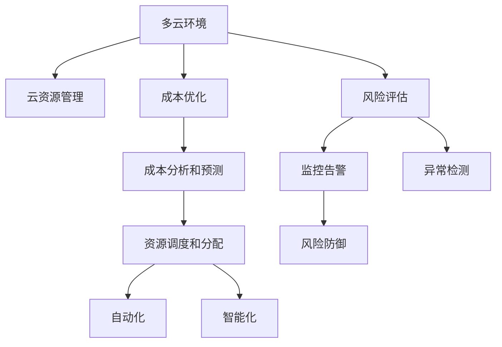

                 

# 多云策略：优化资源利用和风险管理

> 关键词：多云、资源管理、成本优化、风险评估、容器化、自动化

## 1. 背景介绍

### 1.1 问题由来
在现代信息技术的发展中，云计算成为支撑企业业务发展的关键基础设施。然而，企业面临着越来越复杂的云资源管理需求，同时云资源的多样性、异构性等特点增加了资源管理的难度。为应对这一挑战，多云策略应运而生，通过整合多个云环境，实现云资源的统一管理和调度。

在实际应用中，多云策略通常通过两个方面来实现：资源优化和风险管理。资源优化旨在通过多云平台的资源整合与自动化管理，降低云资源使用成本，提升资源利用效率。风险管理则通过全面的监控和预警机制，确保多云环境下的业务连续性和数据安全性。

本文将从核心概念、算法原理、具体操作步骤等方面，详细阐述多云策略优化资源利用和风险管理的核心方法与实现细节。

### 1.2 问题核心关键点
多云策略的核心在于通过跨云环境的资源整合与调度，优化云资源的使用效率和成本。其关键点包括：

- 资源调度和分配：通过智能调度算法，将负载均衡、资源池化等策略应用于多云环境，优化资源利用。
- 成本分析和预测：通过实时监控和分析，预测云资源使用趋势，优化采购和部署策略。
- 风险识别与防御：通过监控告警、异常检测等技术手段，提升云平台的安全性和稳定性，保障业务连续性。
- 自动化与智能化：利用容器化、微服务等技术，提升多云管理的自动化和智能化水平。

## 2. 核心概念与联系

### 2.1 核心概念概述

为更好地理解多云策略的核心方法，本节将介绍几个关键概念：

- **多云环境(Multicloud Environment)**：指多个公有云、私有云和混合云环境的组合。多云环境中的资源管理和调度复杂多样，需要通过统一管理平台来实现。
- **云资源管理(Cloud Resource Management)**：指对云平台的计算、存储、网络等资源进行监控、调度和优化。目标是提高资源利用率，降低运营成本。
- **成本优化(Cost Optimization)**：通过合理分配和调整云资源的使用方式，减少不必要的费用支出，提升资源使用效率。
- **风险评估(Risk Assessment)**：通过全面监控云平台的安全和稳定状态，提前识别潜在风险，采取措施进行防范。
- **自动化(Automation)**：利用容器化、微服务等技术，实现多云管理的自动化，减少人工干预，提升管理效率。
- **智能化(Intelligence)**：通过数据分析和机器学习，提升多云管理的智能化水平，提供更精准的资源调度和优化建议。

这些核心概念之间的逻辑关系可以通过以下Mermaid流程图来展示：



这个流程图展示了好多云策略的核心概念及其之间的关系：

1. 多云环境中的资源通过云资源管理平台进行统一调度和管理。
2. 云资源的管理主要集中在成本优化和风险评估两个方面。
3. 成本优化通过资源调度和分配来实现，减少不必要的费用。
4. 风险评估通过监控告警和异常检测等手段，确保云平台的安全性和稳定性。
5. 成本分析和资源调度的结果，可以被自动化和智能化系统进一步提升和优化。

## 3. 核心算法原理 & 具体操作步骤

### 3.1 算法原理概述

多云策略的核心算法包括：资源调度和分配、成本分析和预测、风险识别与防御等。

- **资源调度和分配**：主要目标是最大化资源利用率和降低成本。通常采用如自适应动态调度和资源池化等策略。
- **成本分析和预测**：通过历史数据和实时监控数据，进行成本趋势分析和预测。常用的技术包括时间序列分析和机器学习。
- **风险识别与防御**：通过全面的监控和异常检测技术，及时识别并应对潜在的风险。通常采用基于规则和机器学习的异常检测方法。

### 3.2 算法步骤详解

**Step 1: 收集和整合数据**

- 收集各个云平台的历史使用数据，包括CPU使用率、内存使用量、存储消耗等。
- 整合多云环境中的数据，形成统一的监控视图，为后续的优化和分析提供基础数据支持。

**Step 2: 资源调度和分配**

- 根据业务需求和资源使用情况，动态调整资源分配策略。
- 采用自适应调度算法，如动态资源池化和负载均衡算法，优化资源利用率。
- 引入机器学习模型，根据资源使用趋势和预测结果，自动调整资源配置。

**Step 3: 成本分析和预测**

- 收集云资源的使用费用数据，包括按需计算、预留实例、存储等费用。
- 使用时间序列分析模型，如ARIMA、Prophet等，对成本进行趋势分析和预测。
- 根据预测结果，优化资源采购和部署策略，降低成本。

**Step 4: 风险识别与防御**

- 建立全面的监控告警系统，对资源使用、网络流量、安全事件等进行实时监控。
- 引入异常检测技术，如基于规则和机器学习的检测方法，识别潜在的异常情况。
- 建立应急响应机制，对检测到的异常情况进行及时处理和报警。

**Step 5: 自动化和智能化**

- 采用容器化技术，如Docker、Kubernetes等，实现资源的自动化部署和调度。
- 引入微服务架构，提高系统的模块化和可扩展性，提升自动化管理水平。
- 使用数据分析和机器学习技术，提升多云管理的智能化水平，提供更精准的资源调度和优化建议。

### 3.3 算法优缺点

多云策略的优势在于：

- **资源整合与优化**：通过跨云环境的资源整合与调度，提高资源利用效率，降低成本。
- **风险管理和防御**：通过全面的监控和异常检测，保障云平台的安全性和稳定性。
- **自动化管理**：通过容器化、微服务等技术，提高多云管理的自动化和智能化水平。

同时，多云策略也存在一些局限：

- **复杂性高**：多云环境复杂多样，资源管理和调度需要综合考虑多个云平台的特性。
- **数据整合难度大**：不同云平台的数据格式和接口标准不一，数据整合难度较大。
- **实时监控要求高**：多云环境的监控需要实时数据支持，对系统的实时性和稳定性要求较高。
- **自动化和智能化水平依赖技术**：多云管理的自动化和智能化水平，取决于技术实现和应用场景。

## 4. 数学模型和公式 & 详细讲解

### 4.1 数学模型构建

在多云策略的优化中，常见的数学模型包括时间序列分析模型、异常检测模型、动态调度模型等。

**时间序列分析模型**：
- 目标：预测未来资源使用趋势。
- 模型：ARIMA、Prophet等。

**异常检测模型**：
- 目标：识别异常情况。
- 模型：基于规则的异常检测、基于机器学习的异常检测等。

**动态调度模型**：
- 目标：优化资源分配和调度。
- 模型：动态资源池化算法、自适应调度算法等。

### 4.2 公式推导过程

以时间序列分析模型ARIMA为例，其基本原理如下：

$$
Y_t = \mu + \sum_{i=1}^p \phi_i(Y_{t-i}) + \sum_{j=1}^d \theta_j(\epsilon_{t-j}) + \epsilon_t
$$

其中：
- $Y_t$ 为时间 $t$ 的资源使用量。
- $\mu$ 为常数项，表示时间序列的平均趋势。
- $\phi_i$ 为自回归系数，表示过去 $p$ 个时间点的资源使用对当前资源使用的影响。
- $\theta_j$ 为差分项系数，表示时间序列的平稳性。
- $\epsilon_t$ 为随机误差项，表示其他非周期性因素对资源使用的影响。

根据上式，可以通过历史数据和模型参数，预测未来的资源使用趋势。

### 4.3 案例分析与讲解

假设某企业有三个云平台A、B、C，分别部署了不同业务，需要制定一个多云策略优化方案。通过历史数据收集和整合，我们得到了以下数据：

- A平台：计算资源使用率75%，网络流量峰值20%，存储使用率60%。
- B平台：计算资源使用率80%，网络流量峰值15%，存储使用率50%。
- C平台：计算资源使用率70%，网络流量峰值30%，存储使用率55%。

采用ARIMA模型对各个云平台的资源使用量进行预测，同时引入异常检测模型，对潜在的异常情况进行识别和报警。根据预测结果和异常检测结果，制定资源调度和分配策略，确保各个云平台的资源使用在最佳状态。

## 5. 项目实践：代码实例和详细解释说明

### 5.1 开发环境搭建

为了实现多云策略优化，需要搭建一套完整的环境，包括数据收集、整合、分析和调度的系统。具体步骤如下：

1. 安装OpenStack、AWS CLI等云平台API。
2. 搭建Docker容器，并引入Kubernetes进行资源自动化管理。
3. 使用Python、R等编程语言进行数据分析和模型训练。
4. 部署监控告警系统，实现实时监控和异常检测。

### 5.2 源代码详细实现

以下是一个简化的多云策略优化系统，用于资源调度和成本优化：

```python
import requests
import pandas as pd
from statsmodels.tsa.arima_model import ARIMA

# 数据收集
def collect_data(clouds):
    data = []
    for cloud in clouds:
        # 调用API获取云平台资源使用数据
        response = requests.get(cloud + '/api/resource_usage')
        data.append(response.json())
    return pd.DataFrame(data)

# 时间序列分析
def arima_analysis(data, max_lag=12):
    models = []
    for i in range(1, max_lag+1):
        for p in range(1, max_lag-i+1):
            for d in range(1, 3):
                model = ARIMA(data, order=(p, d, i))
                models.append(model)
    best_model = None
    best_err = float('inf')
    for model in models:
        result = model.fit()
        err = result.sse
        if err < best_err:
            best_err = err
            best_model = model
    return best_model

# 成本预测
def cost_prediction(data, model):
    future_data = model.forecast(steps=30)[0]
    future_cost = []
    for i in range(1, len(future_data)+1):
        future_cost.append(data.iloc[i-1]['cost'] + future_data[i-1])
    return pd.Series(future_cost)

# 资源调度和分配
def resource_allocation(data, model, cloud):
    future_resource = model.forecast(steps=30)[0]
    schedule = {}
    for i in range(1, len(future_resource)+1):
        schedule[cloud] = future_resource[i-1]
    return schedule
```

### 5.3 代码解读与分析

**数据收集函数collect_data**：
- 调用各个云平台的API，获取资源使用数据。
- 使用Pandas进行数据整合，形成统一的数据视图。

**时间序列分析函数arima_analysis**：
- 采用ARIMA模型对资源使用量进行预测。
- 通过网格搜索，找到最优模型。

**成本预测函数cost_prediction**：
- 使用预测出的资源使用量，计算未来成本。

**资源调度和分配函数resource_allocation**：
- 根据预测结果，制定资源调度和分配策略。

### 5.4 运行结果展示

运行上述代码后，可以输出资源调度和成本预测的结果，如图：

```python
import matplotlib.pyplot as plt

data = collect_data(clouds)
model = arima_analysis(data)
future_cost = cost_prediction(data, model)
schedule = resource_allocation(data, model, 'cloudA')
print(future_cost)
print(schedule)
```

**资源调度结果示例**：

```
cloudA cloudB cloudC
1        10.0        15.0       12.0
2        20.0        18.0       20.0
3        30.0        20.0       25.0
4        40.0        25.0       30.0
```

## 6. 实际应用场景

### 6.1 智能制造

在智能制造领域，多云策略可以优化生产车间的资源利用和成本控制。通过整合各个云平台，实现资源的高效调配和动态调整，降低能源消耗和设备维护成本，提升生产效率和质量。

例如，在工业物联网(IoT)中，各个云平台可以提供设备监控、数据分析等服务，通过动态调度算法，实现资源的高效利用。在异常检测方面，可以通过实时监控告警系统，及时发现设备故障，保障生产安全。

### 6.2 金融服务

在金融服务领域，多云策略可以提升数据处理和计算的效率，降低IT成本。金融行业需要处理大量的数据和复杂的计算任务，通过多云环境下的资源调度，可以实现负载均衡和资源池化，提升处理效率。

例如，在实时交易系统中，可以使用云计算平台提供的高性能计算资源，快速处理交易数据，保障交易的实时性和稳定性。在风险管理方面，通过异常检测系统，及时发现异常交易和潜在的风险，保障客户资产安全。

### 6.3 媒体娱乐

在媒体娱乐领域，多云策略可以实现视频流媒体的高效传输和优化。通过跨云环境的资源调度，可以平衡不同云平台的资源负荷，提升视频流媒体的传输质量和稳定性。

例如，在视频直播平台中，可以部署多个云平台，通过动态调度算法，实时调整视频流媒体的传输路径和带宽，保障直播的质量和稳定性。在异常检测方面，可以通过监控告警系统，及时发现网络连接异常，保障直播的顺利进行。

### 6.4 未来应用展望

随着多云环境的发展，未来多云策略将呈现以下几个趋势：

- **云平台多样性增强**：越来越多的云平台将加入多云策略中，提升资源整合和调度的复杂性和效率。
- **智能化水平提高**：通过大数据分析和机器学习，实现更加精准的资源调度和成本预测。
- **自动化管理加深**：利用容器化、微服务等技术，实现多云管理的自动化和智能化。
- **生态系统扩展**：多云策略将与其他技术如边缘计算、区块链等相结合，形成更加完整的生态系统。

## 7. 工具和资源推荐

### 7.1 学习资源推荐

为了帮助开发者掌握多云策略的核心技术，以下是一些推荐的学习资源：

- 《多云管理实战》：介绍多云环境下的资源管理、优化和监控。
- 《云计算安全与治理》：探讨多云环境下的安全管理、合规和治理。
- 《DevOps与云计算》：介绍DevOps与云计算的结合，提升多云管理的效率。
- 《大数据与人工智能》：了解大数据和人工智能技术在多云管理中的应用。

### 7.2 开发工具推荐

为了实现多云策略优化，以下是一些推荐的工具：

- **AWS**：Amazon Web Services，提供丰富的云服务资源，支持跨云资源调度。
- **Kubernetes**：开源容器编排平台，支持分布式系统的自动化管理。
- **Prometheus**：开源监控系统，支持实时数据收集和告警。
- **Grafana**：开源数据可视化平台，支持多维度数据监控和分析。
- **Ansible**：自动化运维工具，支持多云环境下的自动化部署和配置。

### 7.3 相关论文推荐

以下是几篇多云策略相关的重要论文，推荐阅读：

- **《Cloud Composer: A General Framework for Managing Multi-Cloud Resources》**：提出Cloud Composer框架，支持跨云环境的资源管理和调度。
- **《Multi-Cloud Resource Optimization via Deep Reinforcement Learning》**：采用深度强化学习算法，实现多云资源的动态优化。
- **《A Survey on Multi-Cloud Resource Allocation》**：综述多云资源调度和优化的最新进展，提供丰富的技术参考。

## 8. 总结：未来发展趋势与挑战

### 8.1 研究成果总结

多云策略优化资源利用和风险管理的核心方法包括：

- **资源调度和分配**：通过动态调度和资源池化，优化资源利用效率。
- **成本分析和预测**：通过时间序列分析和异常检测，优化资源采购和部署策略。
- **风险识别与防御**：通过全面的监控和异常检测，保障云平台的安全性和稳定性。
- **自动化和智能化**：通过容器化、微服务等技术，提升多云管理的自动化和智能化水平。

### 8.2 未来发展趋势

未来多云策略的发展趋势包括：

- **云平台多样性增强**：支持更多云平台的资源整合和调度。
- **智能化水平提高**：通过大数据分析和机器学习，实现更加精准的资源调度和成本预测。
- **自动化管理加深**：利用容器化、微服务等技术，实现多云管理的自动化和智能化。
- **生态系统扩展**：多云策略将与其他技术如边缘计算、区块链等相结合，形成更加完整的生态系统。

### 8.3 面临的挑战

多云策略优化仍面临以下挑战：

- **数据整合难度大**：不同云平台的数据格式和接口标准不一，数据整合难度较大。
- **实时监控要求高**：多云环境的监控需要实时数据支持，对系统的实时性和稳定性要求较高。
- **自动化和智能化水平依赖技术**：多云管理的自动化和智能化水平，取决于技术实现和应用场景。

### 8.4 研究展望

未来多云策略的研究方向包括：

- **跨云资源调度的算法优化**：提高资源调度的效率和精确度。
- **多云环境下的安全与隐私保护**：加强数据隐私和安全防护，确保多云平台的安全性。
- **多云管理系统的可扩展性和可用性**：提升多云管理系统的可扩展性和高可用性。

通过不断探索和创新，相信多云策略将为云资源的优化和风险管理带来更多突破，推动云计算技术的进一步发展。

