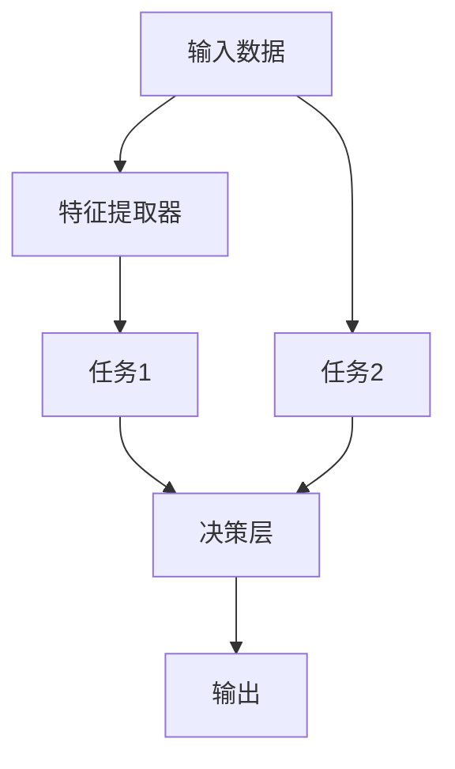

                 

## 1. 背景介绍

### 1.1 问题由来

随着技术的进步，处理任务的方式已经从单任务向多任务扩展。在注意力经济的时代，效率不再是唯一的追求，企业更加注重如何通过多任务处理提高资源利用率，提升用户体验。然而，多任务处理并非简单的任务叠加，它涉及到了任务间的相互影响，资源的合理分配以及效率的优化等问题。这一现象引起了广泛的学术研究兴趣，同时也成为企业在业务实践中的一个热点话题。

### 1.2 问题核心关键点

当前，关于多任务处理的理论已经相当丰富，但实践中，如何高效地实现多任务处理，以及如何避免“效率悖论”（即任务之间相互干扰，效率反而降低）是一个亟待解决的问题。因此，本文将重点探讨多任务处理的效率悖论，提出解决策略，并展望其在实际应用中的未来前景。

## 2. 核心概念与联系

### 2.1 核心概念概述

在多任务处理的框架下，涉及到的核心概念包括：

- **多任务处理（Multi-Task Learning, MTL）**：在同一数据集上，同时训练多个任务的多任务学习，以共享特征提取器或决策层，实现多任务协同学习。
- **注意力机制（Attention Mechanism）**：在模型设计中引入注意力机制，通过关注输入中的重要部分，提高模型的效果和泛化能力。
- **任务间交互（Inter-task Interaction）**：在多任务处理中，不同任务之间通过共享的信息进行交互，影响任务的性能。
- **资源优化（Resource Optimization）**：在多任务处理中，如何合理分配计算资源，减少资源浪费。
- **效率悖论（Efficiency Paradox）**：多任务处理中，由于任务之间的相互干扰，反而导致整体效率下降的现象。

这些概念通过以下Mermaid流程图进行了展示，描述了多任务处理的过程：



**说明**：在多任务处理中，数据经过特征提取器后，被分配到不同的任务中进行处理。最终的输出经过决策层进行整合，形成最终的结果。

## 3. 核心算法原理 & 具体操作步骤

### 3.1 算法原理概述

多任务处理的核心理论是**多任务学习（MTL）**，通过共享特征提取器或决策层，实现多个任务间的协同学习。具体来说，多任务学习包括两种方式：

- **联合训练（Joint Training）**：在同一数据集上，同时训练多个任务。
- **顺序训练（Sequential Training）**：按照任务顺序，逐个训练不同的任务。

### 3.2 算法步骤详解

#### 3.2.1 联合训练步骤

1. **数据准备**：将多个任务的数据集合并成一个大的数据集，每个样本包含多个任务的数据。
2. **模型构建**：构建一个共享的特征提取器，以及多个独立的决策层，用于不同任务。
3. **联合训练**：使用优化器对共享的特征提取器和多个决策层进行联合优化。

#### 3.2.2 顺序训练步骤

1. **数据准备**：将多个任务的数据集按照顺序排列。
2. **模型构建**：为每个任务单独构建模型，并共享特征提取器。
3. **顺序训练**：按照任务顺序，逐个训练不同的模型。

### 3.3 算法优缺点

#### 3.3.1 联合训练的优缺点

**优点**：

- 共享特征提取器，可以减少计算资源的使用。
- 不同任务间的共享信息，可以提高整体性能。

**缺点**：

- 任务间可能存在冲突，导致性能下降。
- 优化复杂度高，需要平衡各个任务的损失函数。

#### 3.3.2 顺序训练的优缺点

**优点**：

- 训练顺序明确，优化复杂度低。
- 各个任务独立训练，互不影响。

**缺点**：

- 需要多次计算，资源消耗大。
- 不同任务间的信息无法共享。

### 3.4 算法应用领域

多任务处理在多个领域都有广泛应用，包括：

- **自然语言处理（NLP）**：在机器翻译、文本分类、命名实体识别等任务上进行联合训练或顺序训练。
- **计算机视觉（CV）**：在图像分类、目标检测、语义分割等任务上进行联合训练或顺序训练。
- **语音识别**：在语音识别、语音情感分析等任务上进行联合训练或顺序训练。
- **推荐系统**：在商品推荐、用户画像等任务上进行联合训练或顺序训练。
- **工业控制**：在故障诊断、预测维护等任务上进行联合训练或顺序训练。

## 4. 数学模型和公式 & 详细讲解 & 举例说明

### 4.1 数学模型构建

假设我们有两个任务，分别是分类任务 $T_1$ 和回归任务 $T_2$，每个任务的数据集为 $\{x_i, y_i\}_{i=1}^N$。在多任务处理中，我们可以共享特征提取器 $F(x_i)$，并使用不同的决策层 $g_1$ 和 $g_2$ 分别对不同任务进行处理。

目标是最小化联合损失函数：

$$
L = \sum_{i=1}^N [l_1(g_1(F(x_i)), y_i) + l_2(g_2(F(x_i)), y_i)]
$$

其中 $l_1$ 和 $l_2$ 分别是分类任务和回归任务的损失函数。

### 4.2 公式推导过程

我们以分类任务 $T_1$ 和回归任务 $T_2$ 为例，推导联合训练过程中的优化目标函数。

假设分类任务的损失函数为交叉熵损失，回归任务的损失函数为均方误差损失。

分类任务的损失函数为：

$$
l_1(g_1(F(x_i)), y_i) = -y_i \log g_1(F(x_i)) - (1 - y_i) \log (1 - g_1(F(x_i)))
$$

回归任务的损失函数为：

$$
l_2(g_2(F(x_i)), y_i) = (g_2(F(x_i)) - y_i)^2
$$

联合损失函数为：

$$
L = \sum_{i=1}^N [l_1(g_1(F(x_i)), y_i) + l_2(g_2(F(x_i)), y_i)]
$$

在联合训练中，我们需要最小化 $L$，即：

$$
\min_{F, g_1, g_2} L
$$

### 4.3 案例分析与讲解

**案例**：多任务学习在自然语言处理中的应用

在自然语言处理中，我们可以使用多任务学习来联合训练机器翻译和文本分类。具体来说，我们可以使用相同的BERT模型作为特征提取器，分别使用不同的决策层来处理机器翻译和文本分类任务。这样，我们就可以利用BERT在文本理解上的强大能力，提高两个任务的效果。

**讲解**：

1. **数据准备**：将机器翻译和文本分类任务的数据集合并成一个大的数据集，每个样本包含文本和翻译结果。
2. **模型构建**：使用BERT作为特征提取器，分别使用不同的决策层进行机器翻译和文本分类。
3. **联合训练**：使用Adam优化器对BERT和两个决策层进行联合优化，最小化联合损失函数。

## 5. 项目实践：代码实例和详细解释说明

### 5.1 开发环境搭建

在搭建多任务处理的开发环境时，我们需要安装一些必要的软件和库，如：

1. **Python**：安装最新版本，并创建虚拟环境。
2. **PyTorch**：安装最新版本的PyTorch。
3. **TensorFlow**：安装最新版本。
4. **NumPy**：安装最新版本的NumPy。
5. **Pandas**：安装最新版本的Pandas。
6. **scikit-learn**：安装最新版本的scikit-learn。
7. **Matplotlib**：安装最新版本的Matplotlib。
8. **Jupyter Notebook**：安装Jupyter Notebook。

### 5.2 源代码详细实现

下面是一个简单的多任务学习代码实现，以机器翻译和文本分类为例：

```python
import torch
import torch.nn as nn
import torch.optim as optim
from transformers import BertTokenizer, BertForSequenceClassification, BertForMaskedLM

# 设置设备
device = torch.device("cuda" if torch.cuda.is_available() else "cpu")

# 加载数据
tokenizer = BertTokenizer.from_pretrained("bert-base-uncased")
input_ids = [torch.tensor([tokenizer.encode("Hello, my dog is cute", add_special_tokens=True)[1:]], device=device)]
attention_mask = [torch.tensor([1], device=device)]

# 定义模型
model = BertForSequenceClassification.from_pretrained("bert-base-uncased", num_labels=2)
model.classifier = nn.Linear(model.config.hidden_size, 2)

# 定义优化器
optimizer = optim.AdamW(model.parameters(), lr=1e-5)

# 定义训练函数
def train_epoch(model, data, optimizer):
    model.train()
    total_loss = 0
    for input_ids, attention_mask, labels in data:
        optimizer.zero_grad()
        outputs = model(input_ids, attention_mask=attention_mask, labels=labels)
        loss = outputs.loss
        total_loss += loss.item()
        loss.backward()
        optimizer.step()
    return total_loss / len(data)

# 训练模型
for epoch in range(10):
    print(f"Epoch {epoch+1}")
    loss = train_epoch(model, data, optimizer)
    print(f"Loss: {loss:.4f}")
```

### 5.3 代码解读与分析

在上面的代码中，我们首先定义了数据，包括输入的文本和标签。然后，我们使用BertForSequenceClassification作为多任务处理的目标模型，并使用AdamW优化器进行训练。在训练过程中，我们使用了数据集上的输入和标签，并计算了模型的损失函数，通过反向传播更新模型参数。

### 5.4 运行结果展示

在运行训练过程后，我们可以得到每个epoch的损失函数，并使用Matplotlib库进行可视化：

```python
import matplotlib.pyplot as plt

plt.plot(range(10), losses)
plt.title("Multi-task Learning Loss")
plt.xlabel("Epoch")
plt.ylabel("Loss")
plt.show()
```

## 6. 实际应用场景

### 6.1 智慧城市

在智慧城市中，多任务处理可以用于智能交通和环境监测。例如，我们可以同时处理交通流量预测和环境质量监测任务，使用相同的传感器数据集，通过共享特征提取器来提高预测准确性。

### 6.2 智能制造

在智能制造中，多任务处理可以用于设备故障诊断和生产优化。通过共享传感器数据，我们可以同时训练设备故障诊断和生产优化模型，提高生产效率和设备维护水平。

### 6.3 金融分析

在金融分析中，多任务处理可以用于风险评估和投资建议。通过共享历史交易数据，我们可以同时训练风险评估和投资建议模型，提高投资决策的准确性。

### 6.4 未来应用展望

随着技术的发展，多任务处理将更加广泛地应用于各个领域。未来，我们有望看到更多创新性的多任务处理应用，如多模态数据融合、跨领域知识迁移等。这些技术将进一步提升模型的性能，拓展其应用场景。

## 7. 工具和资源推荐

### 7.1 学习资源推荐

1. **《多任务学习：理论、算法和应用》（Ming Yin, 2019）**：本书系统地介绍了多任务学习的理论、算法和应用，适合入门和进阶读者。
2. **《深度学习》（Ian Goodfellow, 2016）**：该书涵盖了深度学习的多个方面，包括多任务学习的内容。
3. **Coursera上的《深度学习专项课程》（Andrew Ng, 2016）**：由斯坦福大学教授Andrew Ng主讲的深度学习专项课程，其中有多任务学习的讲解内容。
4. **arXiv上的相关论文**：arXiv是一个开放的预印本服务器，可以获取到最新的多任务学习相关论文。

### 7.2 开发工具推荐

1. **PyTorch**：PyTorch是一个强大的深度学习框架，支持多任务处理的实现。
2. **TensorFlow**：TensorFlow是一个流行的深度学习框架，支持多任务处理的实现。
3. **scikit-learn**：scikit-learn是一个Python科学计算库，支持多任务处理的实现。
4. **Keras**：Keras是一个高级深度学习框架，支持多任务处理的实现。

### 7.3 相关论文推荐

1. **《多任务学习：一种新范式》（Gao Huang, 2018）**：该论文详细介绍了多任务学习的方法和应用。
2. **《多任务学习：从理论到实践》（Yan Xiong, 2017）**：该论文介绍了多任务学习的基本理论和实际应用。
3. **《跨领域多任务学习》（Xing Liu, 2020）**：该论文介绍了跨领域多任务学习的方法和应用。

## 8. 总结：未来发展趋势与挑战

### 8.1 研究成果总结

本文介绍了多任务处理的理论基础和实际应用，探讨了多任务处理中的效率悖论，并提出了一些解决策略。在实际应用中，多任务处理已经在多个领域得到了广泛的应用，展示了其巨大的潜力和价值。

### 8.2 未来发展趋势

未来，多任务处理将继续发展和深化，以下是一些趋势：

1. **跨领域知识迁移**：跨领域的多任务学习将进一步提升模型的性能。
2. **多模态数据融合**：多模态数据的融合将进一步提高模型的准确性和鲁棒性。
3. **端到端训练**：端到端训练将减少模型的复杂性，提高模型的可解释性。
4. **自适应多任务学习**：自适应多任务学习将根据数据的变化动态调整模型的参数，提高模型的适应性。

### 8.3 面临的挑战

尽管多任务处理已经取得了一定的进展，但仍面临一些挑战：

1. **计算资源限制**：多任务处理需要大量的计算资源，特别是在大规模数据集上的训练。
2. **模型复杂性**：多任务处理模型的复杂性较高，需要更多的资源和技巧来优化。
3. **任务冲突**：不同任务之间的冲突可能会影响整体性能。
4. **可解释性**：多任务处理模型的可解释性较差，需要更多的研究来提高其可解释性。

### 8.4 研究展望

未来，多任务处理的研究方向将集中在以下几个方面：

1. **跨领域多任务学习**：探索跨领域的多任务学习，提高模型的泛化能力和适应性。
2. **自适应多任务学习**：开发自适应多任务学习算法，提高模型的鲁棒性和可解释性。
3. **多模态数据融合**：研究多模态数据融合方法，提高模型的准确性和鲁棒性。
4. **端到端训练**：探索端到端训练方法，提高模型的效率和可解释性。

## 9. 附录：常见问题与解答

**Q1：多任务处理的优势和劣势分别是什么？**

A: 多任务处理的优势包括：

- 共享特征提取器，可以减少计算资源的使用。
- 不同任务间的共享信息，可以提高整体性能。

多任务处理的劣势包括：

- 任务间可能存在冲突，导致性能下降。
- 优化复杂度高，需要平衡各个任务的损失函数。

**Q2：如何在多任务处理中避免效率悖论？**

A: 为了避免效率悖论，可以采取以下策略：

- 使用正则化技术，如L2正则、Dropout等，避免任务间的信息干扰。
- 使用多任务学习中的任务间交互方法，如残差连接、注意力机制等，提高模型的性能。
- 使用参数高效的多任务学习算法，如联合训练、顺序训练等，避免不必要的资源浪费。

**Q3：多任务处理在实际应用中需要注意哪些问题？**

A: 在实际应用中，多任务处理需要注意以下问题：

- 数据质量：确保数据集的质量和一致性，避免任务间的冲突。
- 计算资源：多任务处理需要大量的计算资源，需要合理的资源分配。
- 模型复杂性：多任务处理模型的复杂性较高，需要更多的资源和技巧来优化。
- 任务冲突：不同任务之间的冲突可能会影响整体性能，需要合理的任务设计。

---

作者：禅与计算机程序设计艺术 / Zen and the Art of Computer Programming

