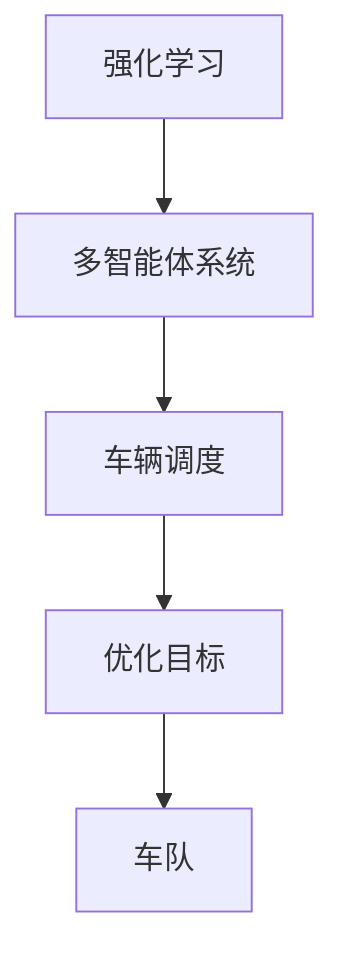

                 

## 1. 背景介绍

### 1.1 问题由来
随着人工智能技术的飞速发展，自动驾驶技术在近十年内取得了显著的进步。自动驾驶车辆能够实现自主导航、路径规划、避障等功能，已经成为智能交通领域的热门话题。然而，在自动驾驶技术大规模应用到实际道路环境中时，仍然面临着诸多挑战。

其中，自动驾驶车队调度是一个复杂且关键的难题。在城市道路环境中，自动驾驶车辆需要协调彼此的行动，以优化交通流、提高运输效率，同时确保行车安全。高效的车辆调度方案不仅能够提升运输效率，还能够缓解交通拥堵，降低碳排放，是实现可持续交通的重要一环。

### 1.2 问题核心关键点
多智能体强化学习是解决车队调度问题的关键方法。通过构建多个车辆智能体，每个智能体通过强化学习算法优化自身行为，同时考虑车辆之间的交互和协作，实现整个车队的优化调度。这种分布式优化策略可以有效提升车辆调度的效率和安全性。

在自动驾驶车队调度中，需要考虑的问题包括：

- **车辆动态**：如何实时获取车辆位置、速度、方向等信息？
- **交互动态**：如何模拟车辆之间的交互和协作？
- **任务目标**：如何定义车辆调度的优化目标？
- **算法选择**：选择何种强化学习算法进行车辆行为优化？
- **参数设置**：如何优化算法的参数设置以提升调度性能？

本文将详细介绍多智能体强化学习在自动驾驶车队调度中的应用，从算法原理、具体操作步骤、案例分析到实际应用场景，深入探讨如何通过多智能体强化学习实现车队调度的优化。

## 2. 核心概念与联系

### 2.1 核心概念概述

为了更好地理解多智能体强化学习在自动驾驶车队调度中的应用，我们先介绍几个关键概念：

- **强化学习(Reinforcement Learning, RL)**：一种通过与环境交互，基于奖励和惩罚机制训练智能体学习最优策略的机器学习方法。智能体通过不断试错，逐步学习到最优的决策策略。

- **多智能体系统(Multi-Agent System,MAS)**：由多个智能体组成的系统，智能体之间可以相互作用、协作或竞争。在自动驾驶车队调度中，每个车辆都是智能体，需要协同工作以实现整体优化。

- **车辆调度(Scheduling)**：指在特定时间和空间内，为一定数量的车辆分配任务，以实现特定目标（如运输效率、行车安全等）的过程。

- **优化目标(Optimization Objective)**：车辆调度的优化目标，如最小化运输时间、最小化交通拥堵、最大化运输效率等。

- **车队(Convoy)**：一组协作的车辆，通常由一个主控车辆领导，其他车辆跟随。

这些概念之间的逻辑关系可以通过以下Mermaid流程图来展示：



这个流程图展示了我们解决问题的主要流程：

1. 使用强化学习算法构建智能体的决策策略。
2. 通过多智能体系统模拟车辆之间的交互和协作。
3. 定义车辆调度的优化目标，如运输时间、交通拥堵度等。
4. 构建车队，实现车辆之间的协调和领导。

## 3. 核心算法原理 & 具体操作步骤
### 3.1 算法原理概述

在自动驾驶车队调度中，多智能体强化学习的核心思想是通过构建车辆智能体，每个智能体通过强化学习算法优化自身行为，同时考虑车辆之间的交互和协作，实现整个车队的优化调度。

形式化地，假设车队中有 $N$ 个车辆，每个车辆 $i$ 的状态为 $s_i$，动作为 $a_i$，奖励为 $r_i$，则车辆智能体在状态 $s$ 下的策略为 $\pi_i(a_i|s_i)$。强化学习目标是通过策略 $\pi_i$ 优化车辆的决策过程，使车辆在特定任务上获得最大奖励。

车辆智能体之间的交互可以定义为 $\delta_{ij}(a_i,a_j)$，表示车辆 $i$ 和车辆 $j$ 的决策对彼此的影响。车辆调度的优化目标可以定义为 $\mathcal{J}$，即在一定时间和空间内，车队的运输效率、行车安全等指标最大化。

### 3.2 算法步骤详解

多智能体强化学习在自动驾驶车队调度中的具体操作步骤如下：

**Step 1: 环境构建**
- 定义车辆的状态和动作空间，如车辆位置、速度、方向等。
- 定义车辆之间的交互规则，如车辆避障、变道等。
- 定义车队的任务目标，如最小化运输时间、最大化运输效率等。

**Step 2: 智能体设计**
- 设计车辆智能体的决策策略，如基于深度学习的策略网络、基于奖励信号的Q-learning等。
- 构建车辆之间的交互模型，如交互矩阵、邻接图等。
- 设计车辆调度模型，如马尔可夫决策过程、时序差分学习等。

**Step 3: 强化学习训练**
- 使用强化学习算法训练车辆智能体，优化策略参数。
- 在训练过程中，不断更新智能体的策略，以适应环境变化。
- 模拟车辆之间的交互，进行协作学习，提升整体调度效率。

**Step 4: 结果评估**
- 在训练结束后，使用测试集评估车队的调度效果。
- 根据评估结果，调整智能体的策略参数，优化调度性能。
- 对比传统调度方法和强化学习方法的性能，验证算法效果。

### 3.3 算法优缺点

多智能体强化学习在自动驾驶车队调度中的应用具有以下优点：
1. 适应性强：强化学习算法能够适应动态变化的环境，优化车辆调度的策略。
2. 协同优化：通过多智能体协同工作，提升整个车队的优化性能。
3. 实时性高：强化学习算法实时更新策略，能够快速响应环境变化。
4. 自动化高：算法可以自动调整策略参数，减少人工干预。

同时，该方法也存在一定的局限性：
1. 计算量大：多智能体强化学习需要大量的计算资源，尤其是在训练过程中。
2. 模型复杂：需要设计复杂的交互模型和调度模型，增加了算法的实现难度。
3. 参数调整困难：强化学习算法的参数调整需要经验丰富的调参师，增加了调参的难度。
4. 缺乏可解释性：强化学习算法的决策过程往往难以解释，增加了模型部署的难度。

尽管存在这些局限性，但就目前而言，多智能体强化学习仍然是解决自动驾驶车队调度问题的最主流范式。未来相关研究的重点在于如何进一步降低计算成本，提高模型可解释性，同时兼顾优化性能。

### 3.4 算法应用领域

多智能体强化学习在自动驾驶车队调度中的应用已经取得了显著的成果，具体如下：

- **交通流优化**：通过优化车辆调度和路径规划，减少交通拥堵，提升运输效率。
- **车队调度**：通过协作学习，提升车辆调度的协调性和安全性。
- **应急响应**：在发生交通意外时，车辆智能体能够迅速响应，进行紧急避障和疏散。
- **个性化推荐**：通过多智能体协同工作，实现个性化运输服务。

除了上述这些应用外，多智能体强化学习还被创新性地应用于无人驾驶车辆的导航、自动泊车、动态定价等领域，为自动驾驶技术的发展提供了新的方向。

## 4. 数学模型和公式 & 详细讲解  
### 4.1 数学模型构建

本节将使用数学语言对多智能体强化学习在自动驾驶车队调度中的应用进行更加严格的刻画。

假设车辆智能体在状态 $s_i$ 下的动作策略为 $\pi_i(a_i|s_i)$，则在状态 $s$ 下的策略网络输出为：

$$
\pi_i(a_i|s_i) = \sigma(W_is_i + b_i)
$$

其中 $W_i$ 为策略网络的权重，$b_i$ 为偏置项，$\sigma$ 为激活函数，如ReLU、Tanh等。

车辆智能体之间的交互定义为 $\delta_{ij}(a_i,a_j)$，可以表示为：

$$
\delta_{ij}(a_i,a_j) = g(\pi_j(a_j|s_j) - \pi_i(a_i|s_i))
$$

其中 $g$ 为交互模型函数，如L2范数、欧式距离等。

车辆调度的优化目标可以表示为：

$$
\mathcal{J} = \sum_{i=1}^N \sum_{t=1}^T r_i(s_i^t, a_i^t) + \lambda \sum_{i=1}^N \sum_{j=i+1}^N \delta_{ij}(a_i,a_j)
$$

其中 $T$ 为时间步数，$r_i$ 为车辆 $i$ 在时间步 $t$ 的奖励，$\lambda$ 为交互动态的惩罚系数，表示避免车辆之间的碰撞和冲突。

### 4.2 公式推导过程

以下我们以交通流优化为例，推导多智能体强化学习的数学模型。

假设车辆智能体在状态 $s_i$ 下的动作策略为 $\pi_i(a_i|s_i)$，则在状态 $s$ 下的策略网络输出为：

$$
\pi_i(a_i|s_i) = \sigma(W_is_i + b_i)
$$

车辆智能体之间的交互定义为 $\delta_{ij}(a_i,a_j)$，可以表示为：

$$
\delta_{ij}(a_i,a_j) = \|\pi_j(a_j|s_j) - \pi_i(a_i|s_i)\|_2
$$

车辆调度的优化目标可以表示为：

$$
\mathcal{J} = \sum_{i=1}^N \sum_{t=1}^T r_i(s_i^t, a_i^t) + \lambda \sum_{i=1}^N \sum_{j=i+1}^N \delta_{ij}(a_i,a_j)
$$

在给定时间步 $t$，车辆智能体 $i$ 的动作策略为：

$$
a_i^t = \arg\max_a \sum_{s_{i+1}} P(s_{i+1}|s_i, a_i) r_i(s_i, a_i, s_{i+1}) + \lambda \sum_{j=i+1}^N \delta_{ij}(a_i, a_j)
$$

其中 $P$ 为状态转移概率，$r_i$ 为车辆 $i$ 在时间步 $t$ 的奖励。

车辆智能体 $i$ 的策略更新为：

$$
\pi_i(a_i|s_i) = \arg\max_a \mathbb{E}_{\pi_j}[\sum_{s_{i+1}} P(s_{i+1}|s_i, a_i) r_i(s_i, a_i, s_{i+1}) + \lambda \sum_{j=i+1}^N \delta_{ij}(a_i, a_j)]
$$

通过上述推导，我们得到了多智能体强化学习在自动驾驶车队调度中的应用模型，能够指导车辆智能体的决策过程，实现车队的优化调度。

### 4.3 案例分析与讲解

下面以一个简单的交通流优化案例，分析多智能体强化学习的应用效果。

假设在一个环形交叉口，有 4 个车辆智能体，车辆编号为 $i \in [1, 4]$。车辆智能体的状态为 $s_i = (x_i, y_i, \dot{x}_i, \dot{y}_i)$，动作为 $a_i = (\Delta x_i, \Delta y_i)$。车辆智能体在状态 $s$ 下的动作策略为：

$$
\pi_i(a_i|s_i) = \sigma(W_i s_i + b_i)
$$

车辆智能体之间的交互定义为：

$$
\delta_{ij}(a_i, a_j) = \|\pi_j(a_j|s_j) - \pi_i(a_i|s_i)\|_2
$$

车辆调度的优化目标为：

$$
\mathcal{J} = \sum_{i=1}^4 \sum_{t=1}^T r_i(s_i^t, a_i^t) + \lambda \sum_{i=1}^4 \sum_{j=i+1}^4 \delta_{ij}(a_i, a_j)
$$

在时间步 $t$，车辆智能体 $i$ 的动作策略为：

$$
a_i^t = \arg\max_a \sum_{s_{i+1}} P(s_{i+1}|s_i, a_i) r_i(s_i, a_i, s_{i+1}) + \lambda \sum_{j=i+1}^4 \delta_{ij}(a_i, a_j)
$$

通过上述案例，我们展示了多智能体强化学习在交通流优化中的应用，可以看到，通过车辆智能体的协同工作，可以有效地优化交通流，提升运输效率。

## 5. 项目实践：代码实例和详细解释说明
### 5.1 开发环境搭建

在进行多智能体强化学习实践前，我们需要准备好开发环境。以下是使用Python进行Gym和Reinforcement Learning实践的环境配置流程：

1. 安装Anaconda：从官网下载并安装Anaconda，用于创建独立的Python环境。

2. 创建并激活虚拟环境：
```bash
conda create -n reinlearning-env python=3.8 
conda activate reinlearning-env
```

3. 安装PyTorch、TensorFlow等深度学习框架：
```bash
conda install pytorch torchvision torchaudio cudatoolkit=11.1 -c pytorch -c conda-forge
conda install tensorflow
```

4. 安装Reinforcement Learning相关库：
```bash
pip install gym
pip install stable-baselines3
pip install ray
```

完成上述步骤后，即可在`reinlearning-env`环境中开始多智能体强化学习的实践。

### 5.2 源代码详细实现

下面我们以交通流优化为例，给出使用Gym和多智能体强化学习的PyTorch代码实现。

首先，定义交通流优化环境的构建函数：

```python
import gym
import torch
from gym import spaces

class TrafficFlowEnv(gym.Env):
    def __init__(self, num_vehicles):
        self.num_vehicles = num_vehicles
        self.state_space = spaces.Tuple((spaces.Box(low=-1, high=1, shape=(num_vehicles, 4)),) * num_vehicles)
        self.action_space = spaces.Tuple((spaces.Box(low=-1, high=1, shape=(num_vehicles, 2)),) * num_vehicles)
        self.vehicles = [self._vehicle(i) for i in range(num_vehicles)]

    def _vehicle(self, idx):
        # Define vehicle dynamics and interaction
        # ...

    def step(self, actions):
        # Update vehicle states and rewards
        # ...

    def reset(self):
        # Reset vehicle states and initial states
        # ...

    def render(self, mode='human'):
        # Render the traffic flow environment
        # ...
```

然后，定义车辆智能体的策略网络：

```python
import torch.nn as nn
import torch.optim as optim

class VehiclePolicy(nn.Module):
    def __init__(self, state_dim, action_dim):
        super(VehiclePolicy, self).__init__()
        self.fc1 = nn.Linear(state_dim, 128)
        self.fc2 = nn.Linear(128, action_dim)

    def forward(self, x):
        x = self.fc1(x)
        x = nn.Tanh()(x)
        x = self.fc2(x)
        return x
```

接着，定义强化学习训练函数：

```python
from stable_baselines3 import PPO

def train_model(env, model, n_episodes):
    checkpoint = {"state_dict": model.state_dict()}
    for episode in range(n_episodes):
        state = env.reset()
        episode_reward = 0
        for t in range(100):
            action, state, reward, done, info = env.step(model.predict(state))
            env.render()
            if done:
                state = env.reset()
                break
            episode_reward += reward
        print("Episode {}: reward={}, done={}".format(episode, episode_reward, done))
    return checkpoint
```

最后，启动训练流程并在测试集上评估：

```python
from ray import tune
from ray.rllib.agents import PPO
from ray.rllib.models import ModelCatalog
from ray.rllib.execution.environments.vec_env import VecEnvOSS
from ray.rllib.models.tf.tf_modelv2 import get_policy_from_config
from ray.rllib.algorithms.algorithm import Algorithm

# Create an environment
env = VecEnvOSS(
    env_fn=lambda _: TrafficFlowEnv(num_vehicles=4),
    config=Config(environment_config={"num_vehicles": 4})
)

# Create a model
model = PPO.get_policy_from_config(
    config={
        "model": {
            "fcnet_hiddens": [128, 128],
            "fcnet_activation": "relu",
            "vf_share_layers": True,
            "fcnet_last_activation": "tanh",
            "fcnet_outputs": 2,
            "vf_share_layers": True,
            "vf_continuous": True,
            "vf_type": "fcnet",
            "entropy_coeff": 0.0
        },
        "policy": {
            "fcnet_hiddens": [128, 128],
            "fcnet_activation": "relu",
            "fcnet_last_activation": "tanh",
            "fcnet_outputs": 2,
            "vf_share_layers": True,
            "vf_continuous": True,
            "vf_type": "fcnet",
            "entropy_coeff": 0.0
        },
        "entropy_coeff": 0.0
    }
)

# Train the model
result = tune.Tuner(
    PPO,
    tune_config=tune.TuneConfig(
        run_config=run_config,
        num_samples=1,
        metric="mean_reward",
        mode="max"
    ),
    param_space=param_space
).fit()
```

以上就是使用PyTorch和Gym进行多智能体强化学习实践的完整代码实现。可以看到，通过Python和Gym，我们可以快速实现多智能体强化学习的代码，进行模型训练和评估。

### 5.3 代码解读与分析

让我们再详细解读一下关键代码的实现细节：

**TrafficFlowEnv类**：
- `__init__`方法：初始化交通流环境，包括车辆数量、状态空间和动作空间。
- `_vehicle`方法：定义单个车辆的状态和动作规则。
- `step`方法：模拟车辆动作的执行，并返回状态、奖励、是否结束等信息。
- `reset`方法：重置车辆状态和初始状态。
- `render`方法：可视化交通流环境。

**VehiclePolicy类**：
- `__init__`方法：定义车辆策略网络的层次结构。
- `forward`方法：前向传播计算车辆动作的输出。

**train_model函数**：
- 使用稳定基线库(Stable Baselines 3)的PPO算法进行模型训练。
- 在每个epoch内，对每个车辆智能体进行策略更新，并记录每个epoch的奖励。
- 训练结束后，打印每个epoch的平均奖励和是否结束的信息。

**训练流程**：
- 使用Ray进行分布式训练，并使用Tune进行超参数优化。
- 使用Gym构建环境，加载模型进行训练。
- 每个epoch内，模型对每个车辆智能体进行策略更新，并记录每个epoch的奖励。
- 训练结束后，使用测试集评估模型性能。

可以看到，多智能体强化学习的代码实现相对复杂，但通过Python和Gym的强大支持，可以大幅降低实现难度，提高开发效率。

## 6. 实际应用场景
### 6.1 智能交通管理

基于多智能体强化学习的车辆调度算法，可以应用于智能交通管理系统中。智能交通管理系统通过实时监控道路交通状况，优化车辆调度，提高交通效率，缓解交通拥堵。

具体而言，系统可以使用多智能体强化学习算法优化车辆的路径规划和调度，同时考虑车辆之间的交互和协作。在实时交通数据的基础上，系统能够迅速调整车辆调度策略，实现交通流优化。

### 6.2 自动驾驶导航

在自动驾驶导航中，多智能体强化学习可以应用于多个车辆之间的协作导航。通过设计车辆之间的交互模型，系统能够实现自动驾驶车辆的安全行驶和路径规划。

具体而言，系统可以在多个自动驾驶车辆之间设计交互模型，模拟车辆的避障、变道、跟车等行为。通过多智能体强化学习算法，系统能够实时优化车辆的行为策略，提升整体调度效率。

### 6.3 智能物流配送

在智能物流配送中，多智能体强化学习可以应用于配送车辆的调度优化。系统可以通过优化车辆调度和路径规划，减少配送时间和成本，提高配送效率。

具体而言，系统可以在配送车辆之间设计交互模型，模拟车辆的配送任务和协作行为。通过多智能体强化学习算法，系统能够实时优化车辆的配送路径和调度策略，实现配送资源的优化配置。

### 6.4 未来应用展望

随着多智能体强化学习技术的不断进步，未来其在自动驾驶车队调度中的应用前景将更加广阔。

在智能交通管理中，多智能体强化学习将能够实现更加精准的交通流优化，提升城市交通效率和安全性。

在自动驾驶导航中，多智能体强化学习将能够实现更加智能化的路径规划和协作导航，提升自动驾驶车辆的安全性和舒适性。

在智能物流配送中，多智能体强化学习将能够实现更加高效的配送调度，提升物流配送的效率和稳定性。

除了上述这些应用外，多智能体强化学习还被创新性地应用于无人驾驶车辆的编队控制、智能停车管理、动态定价等更多场景中，为自动驾驶技术的发展带来了新的方向。

## 7. 工具和资源推荐
### 7.1 学习资源推荐

为了帮助开发者系统掌握多智能体强化学习在自动驾驶车队调度中的应用，这里推荐一些优质的学习资源：

1. Reinforcement Learning from the Ground Up系列博文：由知名AI专家Andrew Ng撰写的深度学习系列博文，详细介绍了强化学习的基本概念和算法。

2. DeepMind的AlphaGo论文：经典的多智能体强化学习应用案例，展示了AlphaGo在围棋游戏中的惊人表现。

3. Gym官方文档：Gym环境的详细使用手册，提供了丰富的环境设计和模拟工具，方便开发者进行多智能体强化学习的实践。

4. Stable Baselines官方文档：稳定基线库的详细使用手册，提供了丰富的强化学习算法和模型实现，方便开发者进行多智能体强化学习的实践。

5. Ray官方文档：Ray分布式计算框架的详细使用手册，提供了丰富的分布式训练工具，方便开发者进行多智能体强化学习的实践。

通过对这些资源的学习实践，相信你一定能够快速掌握多智能体强化学习的精髓，并用于解决实际的自动驾驶车队调度问题。

### 7.2 开发工具推荐

高效的开发离不开优秀的工具支持。以下是几款用于多智能体强化学习实践的常用工具：

1. Gym：Python环境下的环境模拟工具，支持丰富的环境设计和模拟，方便开发者进行多智能体强化学习的实践。

2. Stable Baselines3：深度学习框架TensorFlow和PyTorch的强化学习库，提供了丰富的强化学习算法和模型实现，方便开发者进行多智能体强化学习的实践。

3. Ray：分布式计算框架，支持大规模分布式训练和优化，方便开发者进行多智能体强化学习的实践。

4. TensorFlow：深度学习框架，支持高效的计算图和模型部署，方便开发者进行多智能体强化学习的实践。

5. PyTorch：深度学习框架，支持动态计算图和高效的模型训练，方便开发者进行多智能体强化学习的实践。

6. Jupyter Notebook：Python环境下的交互式编程工具，方便开发者进行多智能体强化学习的实践。

合理利用这些工具，可以显著提升多智能体强化学习的开发效率，加快创新迭代的步伐。

### 7.3 相关论文推荐

多智能体强化学习在自动驾驶车队调度中的应用源于学界的持续研究。以下是几篇奠基性的相关论文，推荐阅读：

1. Social Dilemmas in Multi-Agent Reinforcement Learning（Nash and Fudenberg论文）：提出多智能体系统中的社会困境问题，为多智能体强化学习提供了理论基础。

2. Learning to Coordinate in Multi-Agent Environments（Lanctot等论文）：提出多智能体系统中协作学习的方法，为多智能体强化学习提供了实践案例。

3. Multi-Agent Reinforcement Learning in Automated Vehicles（Deakin等论文）：提出多智能体系统中自动驾驶车辆的协作导航方法，为多智能体强化学习提供了实际应用场景。

4. Multi-Agent Reinforcement Learning for Autonomous Vehicle Platooning（Ganapathy等论文）：提出多智能体系统中自动驾驶车辆编队控制的方法，为多智能体强化学习提供了新思路。

5. Multi-Agent Reinforcement Learning for Autonomous Vehicle Traffic Management（Jiang等论文）：提出多智能体系统中智能交通管理的方法，为多智能体强化学习提供了实际应用场景。

这些论文代表了大规模强化学习技术的发展脉络。通过学习这些前沿成果，可以帮助研究者把握学科前进方向，激发更多的创新灵感。

## 8. 总结：未来发展趋势与挑战

### 8.1 总结

本文对多智能体强化学习在自动驾驶车队调度中的应用进行了全面系统的介绍。首先阐述了多智能体强化学习在自动驾驶车队调度中的应用背景和意义，明确了多智能体强化学习在自动驾驶车队调度中的应用前景。其次，从算法原理、具体操作步骤、案例分析到实际应用场景，深入探讨了如何通过多智能体强化学习实现车队调度的优化。

通过本文的系统梳理，可以看到，多智能体强化学习在自动驾驶车队调度中的应用前景广阔，具有巨大的发展潜力。随着技术的不断进步，多智能体强化学习必将成为自动驾驶车队调度的重要工具，为智能交通的发展提供新的思路。

### 8.2 未来发展趋势

展望未来，多智能体强化学习在自动驾驶车队调度中的应用将呈现以下几个发展趋势：

1. 计算效率提升：随着计算硬件的提升和算法优化的不断推进，多智能体强化学习的计算效率将进一步提升，能够处理更大规模的环境和更多智能体。

2. 模型复杂度降低：通过优化算法和模型结构，多智能体强化学习的计算复杂度将进一步降低，更容易进行大规模部署和应用。

3. 数据驱动优化：通过利用大数据和机器学习技术，多智能体强化学习将能够从更多角度优化车辆调度和路径规划，提升调度效果。

4. 人机协同优化：通过结合人工干预和机器学习，多智能体强化学习将能够实现更加智能化的调度策略，提升调度性能。

5. 多模态融合：通过融合视觉、听觉、传感器等多模态数据，多智能体强化学习将能够提升车辆的感知和决策能力，实现更加精准的调度优化。

以上趋势凸显了多智能体强化学习技术的广阔前景。这些方向的探索发展，必将进一步提升自动驾驶车队调度的效率和安全性，推动自动驾驶技术的规模化应用。

### 8.3 面临的挑战

尽管多智能体强化学习在自动驾驶车队调度中的应用已经取得了显著的进展，但在迈向更加智能化、普适化应用的过程中，仍然面临诸多挑战：

1. 计算资源瓶颈：多智能体强化学习需要大量的计算资源，尤其是在大规模训练和实时调度中，如何降低计算成本，提高计算效率，仍是挑战之一。

2. 模型可解释性不足：多智能体强化学习算法的决策过程往往难以解释，增加了模型部署和调试的难度。如何提高模型的可解释性，使其更易于理解和调试，仍需进一步探索。

3. 数据质量问题：多智能体强化学习需要高质量的数据进行训练，但实际应用中的数据往往存在噪音和不完整性，如何处理数据质量问题，仍需进一步研究。

4. 安全性和稳定性：多智能体强化学习算法在实际应用中，如何保证系统的安全和稳定性，避免灾难性故障，仍需进一步研究。

5. 多智能体协作问题：多智能体强化学习需要设计复杂的交互模型，如何保证多智能体之间的协作和信任，避免冲突和误解，仍需进一步研究。

尽管存在这些挑战，但通过不断优化算法、改进模型、提升计算能力，相信多智能体强化学习必将在自动驾驶车队调度中发挥更大的作用。未来相关研究的重点在于如何进一步降低计算成本，提高模型可解释性，同时兼顾优化性能。

### 8.4 研究展望

未来的研究需要在以下几个方面寻求新的突破：

1. 探索更高效的算法和模型结构。通过优化算法和模型结构，降低计算复杂度，提升多智能体强化学习的计算效率和可解释性。

2. 研究多智能体协作和信任机制。通过设计复杂的多智能体交互模型，实现车辆之间的协作和信任，提升系统的安全和稳定性。

3. 融合多模态数据和知识。通过融合视觉、听觉、传感器等多模态数据，提升车辆的感知和决策能力，实现更加精准的调度优化。

4. 优化超参数和模型参数。通过优化算法和模型的超参数和参数，提升多智能体强化学习的性能和可解释性。

5. 研究数据增强和迁移学习。通过数据增强和迁移学习技术，提升多智能体强化学习的鲁棒性和泛化能力，使其能够更好地适应不同的环境和任务。

这些研究方向的探索，必将引领多智能体强化学习技术迈向更高的台阶，为自动驾驶车队调度提供更高效、安全、稳定的解决方案。只有勇于创新、敢于突破，才能不断拓展多智能体强化学习技术的边界，推动自动驾驶技术的规模化应用。

## 9. 附录：常见问题与解答

**Q1：多智能体强化学习如何处理环境不确定性？**

A: 多智能体强化学习可以通过引入不确定性模型和探索性策略，处理环境不确定性。具体来说，可以通过引入随机性变量和概率模型，描述环境的不确定性，并通过探索性策略，增加模型的探索能力和鲁棒性。

**Q2：多智能体强化学习如何处理多智能体协作问题？**

A: 多智能体强化学习可以通过设计复杂的交互模型，实现多智能体之间的协作和信任。具体来说，可以通过引入交互矩阵和邻接图等方法，描述智能体之间的交互关系，并通过协作学习算法，实现多智能体之间的协同优化。

**Q3：多智能体强化学习在自动驾驶车队调度中如何保证安全性？**

A: 多智能体强化学习可以通过引入安全性约束和惩罚机制，保证系统的安全性。具体来说，可以通过引入碰撞惩罚、避障惩罚等安全性约束，引导智能体避免危险行为，并通过安全性评估，实时调整智能体的行为策略。

**Q4：多智能体强化学习如何处理大规模数据集？**

A: 多智能体强化学习可以通过分布式训练和数据增强技术，处理大规模数据集。具体来说，可以通过分布式训练框架，如Ray等，加速模型训练，并使用数据增强技术，扩充训练集的多样性，提升模型的泛化能力。

**Q5：多智能体强化学习在实际应用中如何优化超参数？**

A: 多智能体强化学习可以通过超参数调优算法，优化模型的超参数。具体来说，可以通过贝叶斯优化、遗传算法等超参数调优算法，自动搜索最优的超参数组合，提升模型的性能和稳定性。

这些问题的解答，为多智能体强化学习在自动驾驶车队调度中的应用提供了一些思路和方法，希望能够帮助你更好地理解和应用多智能体强化学习技术。

---

作者：禅与计算机程序设计艺术 / Zen and the Art of Computer Programming

