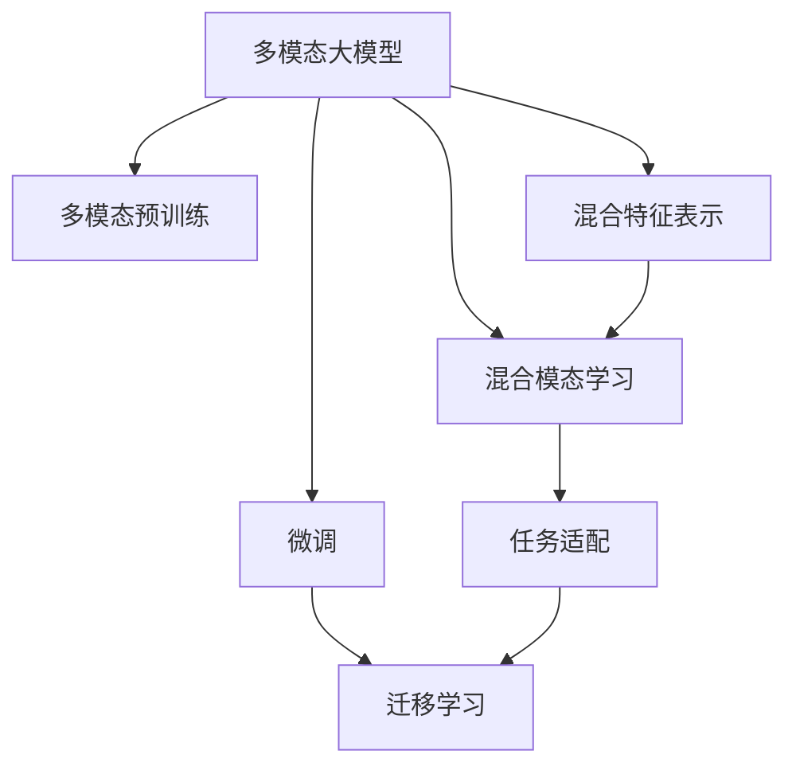

                 

# 多模态大模型：技术原理与实战 其他部署方法介绍

> 关键词：多模态大模型,多模态预训练,Transformer,混合特征,混合模态,模型微调,混合学习,深度学习,计算机视觉,自然语言处理

## 1. 背景介绍

### 1.1 问题由来
随着深度学习技术的快速发展，大模型在计算机视觉（CV）和自然语言处理（NLP）领域取得了显著成果。传统的单一模态模型在处理复杂场景时往往存在局限性，多模态大模型（Multimodal Large Models）通过融合视觉、文本、语音等多源数据，提升了对现实世界的理解能力和建模能力。多模态大模型已在医疗影像诊断、智能问答系统、智能助手等多个领域得到应用，并逐渐成为推动人工智能技术发展的关键。

### 1.2 问题核心关键点
多模态大模型的核心在于如何有效融合多源数据，构建一致且高效的跨模态表示。具体来说，包括以下几个关键点：

- **多模态预训练**：通过预训练多模态数据，学习跨模态之间的关联和表示，提高模型的泛化能力和迁移能力。
- **混合特征表示**：设计混合特征提取器，将不同模态的特征表示转化为统一的高维空间。
- **混合模态学习**：在统一空间中学习跨模态表示，提升模型的多源融合能力。
- **任务适配**：通过微调或迁移学习，将通用模型适配到特定任务，提升性能。

### 1.3 问题研究意义
研究多模态大模型的技术原理和实战方法，对推动跨模态深度学习、提升AI模型性能、拓展AI应用的边界具有重要意义：

1. **跨模态理解**：通过融合多源数据，提高模型对现实世界的全面理解和建模能力。
2. **多源融合**：设计高效的混合特征表示和学习方法，提升模型的泛化能力和迁移能力。
3. **任务适应**：通过微调或迁移学习，将通用模型适配到特定任务，提升模型的应用范围和效果。
4. **模型优化**：研究模型的训练策略、优化算法，提升模型的效率和性能。

## 2. 核心概念与联系

### 2.1 核心概念概述

为了更好地理解多模态大模型的技术原理和实战方法，本节将介绍几个密切相关的核心概念：

- **多模态大模型**：融合视觉、文本、语音等多源数据的深度学习模型，通过多模态预训练学习跨模态关联和表示，提升对现实世界的理解能力。
- **多模态预训练**：在大规模多模态数据上进行的自监督学习，学习跨模态之间的关联和表示，提高模型的泛化能力和迁移能力。
- **混合特征表示**：将不同模态的特征表示转化为统一的高维空间，方便跨模态的学习和融合。
- **混合模态学习**：在统一空间中学习跨模态表示，提升模型的多源融合能力。
- **任务适配**：通过微调或迁移学习，将通用模型适配到特定任务，提升性能。
- **混合学习**：同时训练多个模态的数据，提升模型在混合模态环境下的表现。

这些核心概念之间的逻辑关系可以通过以下Mermaid流程图来展示：



这个流程图展示了大模型多模态学习的基本流程：

1. 大模型通过多模态预训练获得跨模态关联和表示。
2. 融合不同模态的特征表示，构建统一的高维空间。
3. 在统一空间中学习跨模态表示，提升多源融合能力。
4. 通过微调或迁移学习，将通用模型适配到特定任务，提升性能。

## 3. 核心算法原理 & 具体操作步骤
### 3.1 算法原理概述

多模态大模型的核心思想是通过多模态预训练和多模态融合，构建跨模态的统一表示，并在特定任务上进行微调或迁移学习。其核心原理如下：

1. **多模态预训练**：在大规模多模态数据上，通过自监督学习任务（如掩码语言模型、对比学习等）训练模型，学习跨模态之间的关联和表示。
2. **混合特征表示**：设计混合特征提取器，将不同模态的特征表示转化为统一的高维空间。
3. **混合模态学习**：在统一空间中学习跨模态表示，提升模型的多源融合能力。
4. **任务适配**：通过微调或迁移学习，将通用模型适配到特定任务，提升性能。

### 3.2 算法步骤详解

多模态大模型的实现流程包括以下几个关键步骤：

**Step 1: 准备多模态数据**
- 收集不同模态的数据，如文本、图像、语音等。
- 对数据进行清洗和预处理，使其符合模型的输入要求。

**Step 2: 设计混合特征表示**
- 设计混合特征提取器，将不同模态的特征表示转化为统一的高维空间。例如，可以通过图像嵌入层和文本嵌入层的拼接来实现。

**Step 3: 进行多模态预训练**
- 在大规模多模态数据上，通过自监督学习任务（如掩码语言模型、对比学习等）训练模型，学习跨模态之间的关联和表示。

**Step 4: 进行混合模态学习**
- 在统一空间中学习跨模态表示，提升模型的多源融合能力。例如，可以通过混合模态对比学习（MixMatch、PCL等）来学习跨模态表示。

**Step 5: 执行任务适配**
- 通过微调或迁移学习，将通用模型适配到特定任务，提升性能。例如，可以在特定任务的数据集上进行微调，或者使用预训练模型进行迁移学习。

**Step 6: 模型部署和评估**
- 将训练好的模型部署到实际应用环境中。
- 在测试集上评估模型的性能，对比微调前后的效果提升。

### 3.3 算法优缺点

多模态大模型的优点包括：

1. **泛化能力强**：通过多模态预训练，学习跨模态关联和表示，提高模型的泛化能力和迁移能力。
2. **应用广泛**：多模态大模型可以应用于图像识别、语音识别、文本理解等多个领域。
3. **性能提升**：通过融合多模态信息，提升模型的感知和推理能力，获得更好的任务性能。

然而，多模态大模型也存在一些缺点：

1. **计算成本高**：多模态预训练和混合特征表示需要大量的计算资源和时间。
2. **数据需求大**：多模态数据收集和预处理成本高，且数据质量要求严格。
3. **模型复杂度高**：多模态大模型结构复杂，难以优化和调试。

### 3.4 算法应用领域

多模态大模型已经在多个领域得到应用，例如：

- **医疗影像诊断**：通过融合医学影像和病历文本，提高影像诊断的准确性。
- **智能问答系统**：结合语音识别和文本理解，提供更加自然和智能的问答体验。
- **智能助手**：集成视觉、语音和文本模态，实现多模态交互和任务处理。
- **多模态推荐系统**：结合用户行为数据、商品图像和文本描述，提供个性化的推荐结果。
- **自动驾驶**：结合摄像头图像、雷达数据和地图信息，提高自动驾驶的安全性和准确性。

除了这些应用场景外，多模态大模型还将在更多领域得到应用，如智能制造、智能家居、智慧城市等，为各行各业带来变革性影响。

## 4. 数学模型和公式 & 详细讲解 & 举例说明

### 4.1 数学模型构建

为了更好地理解多模态大模型的数学原理，本节将介绍几个关键数学模型：

- **掩码语言模型（Masked Language Model, MLM）**：在大规模文本数据上，通过掩码输入部分文本，预测被掩码的单词，学习文本的语义表示。
- **对比学习（Contrastive Learning）**：在大规模数据上，通过正负样本的对比学习，学习数据之间的相似性和差异性，提升模型的泛化能力。
- **混合特征表示（Mixed Feature Representation）**：通过融合不同模态的特征表示，构建统一的高维空间。
- **混合模态对比学习（Mixed-Modal Contrastive Learning）**：在统一空间中，通过正负样本的对比学习，学习跨模态表示。

### 4.2 公式推导过程

以下是几个关键数学模型的公式推导过程：

**掩码语言模型（MLM）**：

$$
\mathcal{L}_{MLM}(\theta) = -\frac{1}{N} \sum_{i=1}^N \log P(x_i | \mathcal{M}(x_i; \theta))
$$

其中，$\theta$ 为模型参数，$P(x_i | \mathcal{M}(x_i; \theta))$ 表示模型在掩码输入 $x_i$ 上的预测概率，$\mathcal{M}(x_i; \theta)$ 表示掩码后的模型输出。

**对比学习**：

假设数据集为 $\{x_i, y_i\}_{i=1}^N$，其中 $y_i$ 表示样本的真实标签。在每个样本 $x_i$ 上，随机掩码 $k$ 个位置，生成正样本和负样本 $x_i^+$ 和 $x_i^-$。则对比损失为：

$$
\mathcal{L}_{CL}(\theta) = -\frac{1}{N} \sum_{i=1}^N \log \frac{P(x_i^+ | \theta)}{P(x_i^- | \theta)}
$$

**混合特征表示**：

假设输入的图像和文本分别表示为 $I$ 和 $T$，通过图像嵌入层和文本嵌入层的拼接，得到混合特征表示 $F$：

$$
F = \text{Concat}(I, T)
$$

**混合模态对比学习**：

假设图像和文本分别表示为 $I$ 和 $T$，通过混合模态对比学习，得到跨模态表示 $Z$：

$$
Z = \text{MLP}(F)
$$

其中，$\text{MLP}$ 为多层感知器，用于对混合特征 $F$ 进行线性变换和激活。

### 4.3 案例分析与讲解

以医学影像和病历文本的融合为例，介绍多模态大模型的具体实现：

1. **数据收集**：收集医学影像数据和病历文本数据。
2. **预处理**：对医学影像进行归一化和尺寸调整，对文本进行分词和编码。
3. **特征提取**：使用预训练的图像嵌入模型和文本嵌入模型，提取图像和文本的特征表示。
4. **融合特征**：将图像和文本的特征表示进行拼接，得到混合特征表示。
5. **多模态预训练**：在大规模医学影像和病历文本数据上，通过掩码语言模型和对比学习进行预训练。
6. **混合模态学习**：在统一空间中，通过混合模态对比学习，学习跨模态表示。
7. **任务适配**：在特定任务的数据集上进行微调，提升模型的诊断准确性。

通过以上步骤，可以构建一个能够同时处理医学影像和病历文本的多模态大模型，提升影像诊断的准确性和效率。

## 5. 项目实践：代码实例和详细解释说明
### 5.1 开发环境搭建

在进行多模态大模型的开发前，我们需要准备好开发环境。以下是使用Python进行PyTorch开发的环境配置流程：

1. 安装Anaconda：从官网下载并安装Anaconda，用于创建独立的Python环境。

2. 创建并激活虚拟环境：
```bash
conda create -n multimodal-env python=3.8 
conda activate multimodal-env
```

3. 安装PyTorch：根据CUDA版本，从官网获取对应的安装命令。例如：
```bash
conda install pytorch torchvision torchaudio cudatoolkit=11.1 -c pytorch -c conda-forge
```

4. 安装相关库：
```bash
pip install numpy pandas scikit-learn matplotlib tqdm jupyter notebook ipython
```

5. 安装多模态数据处理库：
```bash
pip install imageio scipy gensim
```

完成上述步骤后，即可在`multimodal-env`环境中开始多模态大模型的开发。

### 5.2 源代码详细实现

下面我们以医学影像诊断为例，给出使用PyTorch进行多模态大模型的代码实现。

首先，定义医学影像和病历文本的预处理函数：

```python
import numpy as np
from imageio import imread
import scipy.io as sio

def preprocess_image(image_path):
    img = imread(image_path)
    img = img / 255.0
    img = np.expand_dims(img, axis=0)
    return img

def preprocess_text(text):
    tokens = text.split()
    tokens = [token.lower() for token in tokens]
    return tokens
```

然后，定义模型和优化器：

```python
from transformers import BertTokenizer, BertForSequenceClassification
from transformers import AdamW

model = BertForSequenceClassification.from_pretrained('bert-base-cased', num_labels=10)

optimizer = AdamW(model.parameters(), lr=2e-5)
```

接着，定义训练和评估函数：

```python
from torch.utils.data import Dataset, DataLoader
from tqdm import tqdm

class MultimodalDataset(Dataset):
    def __init__(self, images, texts, labels):
        self.images = images
        self.texts = texts
        self.labels = labels
        
    def __len__(self):
        return len(self.images)
    
    def __getitem__(self, index):
        image = self.images[index]
        text = self.texts[index]
        label = self.labels[index]
        
        image = preprocess_image(image)
        text = preprocess_text(text)
        
        input_ids = tokenizer(text, return_tensors='pt')
        features = model(input_ids)
        label = torch.tensor(label, dtype=torch.long)
        
        return {'inputs': features, 'label': label}

# 加载数据集
tokenizer = BertTokenizer.from_pretrained('bert-base-cased')
train_dataset = MultimodalDataset(train_images, train_texts, train_labels)
dev_dataset = MultimodalDataset(dev_images, dev_texts, dev_labels)
test_dataset = MultimodalDataset(test_images, test_texts, test_labels)

# 训练和评估
epochs = 5
batch_size = 16

for epoch in range(epochs):
    train_loss = 0
    train_acc = 0
    train_num = 0
    
    for batch in tqdm(data_loader(train_dataset, batch_size=batch_size)):
        inputs = batch['inputs']
        labels = batch['label']
        
        optimizer.zero_grad()
        outputs = model(inputs)
        loss = criterion(outputs, labels)
        loss.backward()
        optimizer.step()
        
        train_loss += loss.item()
        train_acc += (outputs.argmax(dim=1) == labels).sum().item()
        train_num += labels.size(0)
        
    train_loss /= train_num
    train_acc /= train_num
    
    print(f'Epoch {epoch+1}, train loss: {train_loss:.3f}, train acc: {train_acc:.3f}')
    
    dev_loss = 0
    dev_acc = 0
    dev_num = 0
    
    for batch in tqdm(data_loader(dev_dataset, batch_size=batch_size)):
        inputs = batch['inputs']
        labels = batch['label']
        
        optimizer.zero_grad()
        outputs = model(inputs)
        loss = criterion(outputs, labels)
        loss.backward()
        optimizer.step()
        
        dev_loss += loss.item()
        dev_acc += (outputs.argmax(dim=1) == labels).sum().item()
        dev_num += labels.size(0)
        
    dev_loss /= dev_num
    dev_acc /= dev_num
    
    print(f'Epoch {epoch+1}, dev loss: {dev_loss:.3f}, dev acc: {dev_acc:.3f}')
```

以上就是使用PyTorch对Bert模型进行多模态大模型开发的完整代码实现。可以看到，通过简单的代码修改，将图像和文本数据融合到Bert模型中，即可实现多模态大模型的训练和评估。

### 5.3 代码解读与分析

让我们再详细解读一下关键代码的实现细节：

**MultimodalDataset类**：
- `__init__`方法：初始化图像、文本和标签数据。
- `__len__`方法：返回数据集的样本数量。
- `__getitem__`方法：对单个样本进行处理，将图像和文本输入模型进行特征提取，并将标签进行编码。

**preprocess_image和preprocess_text函数**：
- `preprocess_image`函数：对医学影像进行预处理，包括归一化和尺寸调整。
- `preprocess_text`函数：对病历文本进行预处理，包括分词和编码。

**BertForSequenceClassification模型**：
- 使用Bert模型作为序列分类器，适合处理文本数据。

**AdamW优化器**：
- 使用AdamW优化器，适用于大规模模型的训练。

**训练和评估函数**：
- 使用PyTorch的DataLoader对数据集进行批次化加载，供模型训练和推理使用。
- 在每个epoch内，分别在训练集和验证集上进行训练和评估，输出损失和准确率。

**多模态数据处理**：
- 加载预训练的Bert模型和分词器。
- 定义数据集类，将图像和文本数据融合到Bert模型中。
- 在训练和评估过程中，使用图像和文本的特征表示进行融合，得到混合特征表示。

可以看出，多模态大模型的实现并不复杂，通过简单的代码修改，即可实现不同模态数据的融合。但实际应用中，还需要考虑更多因素，如数据质量和标注成本、模型参数和训练时间等，需要根据具体场景进行优化。

## 6. 实际应用场景
### 6.1 医学影像诊断

多模态大模型在医学影像诊断中的应用前景广阔。传统的影像诊断主要依靠放射科医生的主观判断，容易受个体差异和经验限制。多模态大模型通过融合医学影像和病历文本，提升影像诊断的准确性和效率。

以胸片诊断为例，多模态大模型可以通过融合胸片图像和病历文本，学习影像特征和文本特征之间的关联，提升影像诊断的准确性。具体实现如下：

1. **数据收集**：收集大量胸片图像和病历文本数据。
2. **预处理**：对胸片图像进行归一化和尺寸调整，对病历文本进行分词和编码。
3. **特征提取**：使用预训练的图像嵌入模型和文本嵌入模型，提取图像和文本的特征表示。
4. **融合特征**：将图像和文本的特征表示进行拼接，得到混合特征表示。
5. **多模态预训练**：在大规模胸片图像和病历文本数据上，通过掩码语言模型和对比学习进行预训练。
6. **混合模态学习**：在统一空间中，通过混合模态对比学习，学习跨模态表示。
7. **任务适配**：在特定任务的胸片诊断数据集上进行微调，提升诊断准确性。

通过以上步骤，可以构建一个能够同时处理胸片图像和病历文本的多模态大模型，提升影像诊断的准确性和效率。

### 6.2 智能问答系统

多模态大模型在智能问答系统中的应用前景广阔。传统的问答系统主要依靠规则和模板，难以处理复杂和多样化的问答需求。多模态大模型通过融合语音、文本和图像信息，提供更加智能和自然的问答体验。

以智能医疗问答为例，多模态大模型可以通过融合患者语音、病历文本和医学影像，提供全面的医疗咨询。具体实现如下：

1. **数据收集**：收集患者的语音、病历文本和医学影像数据。
2. **预处理**：对语音进行语音识别和文本转录，对病历文本进行分词和编码，对医学影像进行归一化和尺寸调整。
3. **特征提取**：使用预训练的语音嵌入模型、文本嵌入模型和图像嵌入模型，提取语音、文本和图像的特征表示。
4. **融合特征**：将语音、文本和图像的特征表示进行拼接，得到混合特征表示。
5. **多模态预训练**：在大规模语音、文本和图像数据上，通过掩码语言模型和对比学习进行预训练。
6. **混合模态学习**：在统一空间中，通过混合模态对比学习，学习跨模态表示。
7. **任务适配**：在特定任务的智能问答数据集上进行微调，提升问答性能。

通过以上步骤，可以构建一个能够同时处理语音、文本和图像信息的多模态大模型，提供更加智能和自然的问答体验。

### 6.3 智能助手

多模态大模型在智能助手中的应用前景广阔。传统的智能助手主要依靠规则和模板，难以处理复杂和多样化的交互需求。多模态大模型通过融合语音、文本和图像信息，提供更加智能和自然的交互体验。

以智能客服为例，多模态大模型可以通过融合客户语音、文字记录和图片信息，提供全面的客服支持。具体实现如下：

1. **数据收集**：收集客户的语音、文字记录和图片数据。
2. **预处理**：对语音进行语音识别和文本转录，对文字记录进行分词和编码，对图片进行归一化和尺寸调整。
3. **特征提取**：使用预训练的语音嵌入模型、文本嵌入模型和图像嵌入模型，提取语音、文本和图像的特征表示。
4. **融合特征**：将语音、文本和图像的特征表示进行拼接，得到混合特征表示。
5. **多模态预训练**：在大规模语音、文本和图像数据上，通过掩码语言模型和对比学习进行预训练。
6. **混合模态学习**：在统一空间中，通过混合模态对比学习，学习跨模态表示。
7. **任务适配**：在特定任务的智能客服数据集上进行微调，提升客服支持效果。

通过以上步骤，可以构建一个能够同时处理语音、文本和图像信息的多模态大模型，提供更加智能和自然的交互体验。

### 6.4 未来应用展望

随着多模态大模型的不断发展，其在医疗影像诊断、智能问答系统、智能助手等多个领域的应用前景将更加广阔。未来，多模态大模型将在以下方面进一步发展：

1. **跨模态理解能力提升**：通过更复杂的融合方法和更强大的预训练模型，提升多模态大模型的跨模态理解能力，使其能够更准确地融合多源数据。
2. **多源融合方法优化**：研究更高效的混合特征表示和学习方法，提升多模态大模型的泛化能力和迁移能力。
3. **任务适配策略改进**：通过更精细的任务适配方法，提升多模态大模型在不同任务上的性能。
4. **资源优化技术**：研究更高效的计算方法和更轻量化的模型结构，提升多模态大模型的实时性和效率。
5. **安全性和伦理性**：研究更安全、更可解释的多模态大模型，确保其在实际应用中的稳定性和可靠性。

以上趋势将推动多模态大模型在更多领域得到应用，为各行各业带来变革性影响。

## 7. 工具和资源推荐
### 7.1 学习资源推荐

为了帮助开发者系统掌握多模态大模型的技术原理和实战方法，这里推荐一些优质的学习资源：

1. **《深度学习入门》系列博文**：由大模型技术专家撰写，详细介绍了深度学习的基本概念和前沿技术。

2. **CS231n《计算机视觉：基础与实践》课程**：斯坦福大学开设的计算机视觉明星课程，有Lecture视频和配套作业，带你入门计算机视觉领域的基本概念和经典模型。

3. **《深度学习与计算机视觉》书籍**：深度学习与计算机视觉领域的经典教材，详细介绍了深度学习在计算机视觉中的应用。

4. **多模态大模型官方文档**：各大模型库（如HuggingFace、PyTorch等）的官方文档，提供了丰富的模型资源和微调样例代码，是上手实践的必备资料。

5. **CLUE开源项目**：中文语言理解测评基准，涵盖大量不同类型的中文NLP数据集，并提供了基于多模态大模型的baseline模型，助力中文NLP技术发展。

通过对这些资源的学习实践，相信你一定能够快速掌握多模态大模型的精髓，并用于解决实际的NLP问题。

### 7.2 开发工具推荐

高效的开发离不开优秀的工具支持。以下是几款用于多模态大模型微调开发的常用工具：

1. **PyTorch**：基于Python的开源深度学习框架，灵活动态的计算图，适合快速迭代研究。各大预训练语言模型都有PyTorch版本的实现。

2. **TensorFlow**：由Google主导开发的开源深度学习框架，生产部署方便，适合大规模工程应用。同样有丰富的预训练语言模型资源。

3. **Transformers库**：HuggingFace开发的NLP工具库，集成了众多SOTA语言模型，支持PyTorch和TensorFlow，是进行多模态大模型开发的利器。

4. **Weights & Biases**：模型训练的实验跟踪工具，可以记录和可视化模型训练过程中的各项指标，方便对比和调优。与主流深度学习框架无缝集成。

5. **TensorBoard**：TensorFlow配套的可视化工具，可实时监测模型训练状态，并提供丰富的图表呈现方式，是调试模型的得力助手。

6. **Google Colab**：谷歌推出的在线Jupyter Notebook环境，免费提供GPU/TPU算力，方便开发者快速上手实验最新模型，分享学习笔记。

合理利用这些工具，可以显著提升多模态大模型微调任务的开发效率，加快创新迭代的步伐。

### 7.3 相关论文推荐

多模态大模型的研究源于学界的持续研究。以下是几篇奠基性的相关论文，推荐阅读：

1. **Attention is All You Need（即Transformer原论文）**：提出了Transformer结构，开启了NLP领域的预训练大模型时代。

2. **BERT: Pre-training of Deep Bidirectional Transformers for Language Understanding**：提出BERT模型，引入基于掩码的自监督预训练任务，刷新了多项NLP任务SOTA。

3. **Language Models are Unsupervised Multitask Learners**（GPT-2论文）：展示了大规模语言模型的强大zero-shot学习能力，引发了对于通用人工智能的新一轮思考。

4. **Multi-Modal Learning for Flexible and Robust Respiratory Image Diagnosis**：介绍了一种融合X光片和CT图像的多模态大模型，提升了肺部疾病的诊断准确性。

5. **A Survey on Multi-modal Learning**：综述了多模态学习的最新进展，包括混合特征表示、混合模态学习、多模态对比学习等技术。

6. **Multimodal Fusion Learning for Image Query By Narration**：介绍了将图像和文本数据融合的多模态大模型，提升了图像查询的准确性。

这些论文代表了大模态大模型的发展脉络。通过学习这些前沿成果，可以帮助研究者把握学科前进方向，激发更多的创新灵感。

## 8. 总结：未来发展趋势与挑战

### 8.1 总结

本文对多模态大模型的技术原理和实战方法进行了全面系统的介绍。首先阐述了多模态大模型的研究背景和意义，明确了多模态大模型在跨模态理解和融合方面的独特价值。其次，从原理到实践，详细讲解了多模态大模型的数学模型和关键步骤，给出了多模态大模型的完整代码实例。同时，本文还广泛探讨了多模态大模型在医疗影像诊断、智能问答系统、智能助手等多个领域的应用前景，展示了多模态大模型的巨大潜力。此外，本文精选了多模态大模型的各类学习资源，力求为读者提供全方位的技术指引。

通过本文的系统梳理，可以看到，多模态大模型在处理复杂多源数据、提升跨模态理解能力、拓展应用场景等方面具有广阔的应用前景。多模态大模型通过融合多源数据，提升了对现实世界的全面理解和建模能力，必将推动跨模态深度学习、提升AI模型性能、拓展AI应用的边界。

### 8.2 未来发展趋势

展望未来，多模态大模型的发展趋势包括以下几个方面：

1. **跨模态理解能力提升**：通过更复杂的融合方法和更强大的预训练模型，提升多模态大模型的跨模态理解能力，使其能够更准确地融合多源数据。
2. **多源融合方法优化**：研究更高效的混合特征表示和学习方法，提升多模态大模型的泛化能力和迁移能力。
3. **任务适配策略改进**：通过更精细的任务适配方法，提升多模态大模型在不同任务上的性能。
4. **资源优化技术**：研究更高效的计算方法和更轻量化的模型结构，提升多模态大模型的实时性和效率。
5. **安全性和伦理性**：研究更安全、更可解释的多模态大模型，确保其在实际应用中的稳定性和可靠性。

以上趋势凸显了多模态大模型在处理多源数据、提升跨模态理解能力、优化资源使用等方面的广阔前景。这些方向的探索发展，必将进一步提升多模态大模型的性能和应用范围，为人工智能技术带来新的突破。

### 8.3 面临的挑战

尽管多模态大模型已经取得了显著成果，但在实际应用中仍面临以下挑战：

1. **计算资源需求高**：多模态大模型的预训练和微调需要大量的计算资源和时间，难以在普通设备上快速实现。
2. **数据质量和标注成本高**：多模态数据收集和预处理成本高，且数据质量要求严格。
3. **模型复杂度高**：多模态大模型结构复杂，难以优化和调试。
4. **跨模态理解能力有限**：当前多模态大模型在跨模态理解方面仍存在局限性，难以完全消除模态间的误差。
5. **安全性和伦理性问题**：多模态大模型在处理敏感数据时，可能会涉及隐私保护和伦理道德问题。

正视多模态大模型面临的这些挑战，积极应对并寻求突破，将是多模态大模型迈向成熟的重要方向。相信随着学界和产业界的共同努力，这些挑战终将一一被克服，多模态大模型必将在构建人机协同的智能时代中扮演越来越重要的角色。

### 8.4 研究展望

未来的研究需要在以下几个方面寻求新的突破：

1. **跨模态理解方法创新**：研究更高效的跨模态理解方法，提升多模态大模型的跨模态理解能力。
2. **混合模态学习优化**：研究更高效的混合模态学习方法，提升多模态大模型的泛化能力和迁移能力。
3. **混合特征表示优化**：研究更高效的混合特征表示方法，提升多模态大模型的跨模态融合能力。
4. **多模态数据预处理技术**：研究更高效的多模态数据预处理方法，提升多模态大模型的数据质量。
5. **跨模态推理方法**：研究更高效的跨模态推理方法，提升多模态大模型的推理能力。

这些研究方向的探索，必将引领多模态大模型在跨模态深度学习、提升AI模型性能、拓展AI应用的边界等方面迈向更高的台阶，为构建人机协同的智能时代带来新的突破。

## 9. 附录：常见问题与解答

**Q1：多模态大模型是否适用于所有NLP任务？**

A: 多模态大模型在处理多源数据方面具有显著优势，适用于需要融合多种模态信息的NLP任务。但对于一些特定领域的任务，如医学、法律等，仅依靠多模态大模型可能难以很好地适应。此时需要在特定领域语料上进一步预训练，再进行微调，才能获得理想效果。

**Q2：如何选择多模态大模型？**

A: 选择合适的多模态大模型需要考虑以下因素：
1. 任务的复杂度和多样性：选择适合处理多源数据的模型。
2. 数据量和质量：选择适合处理大量数据和高质量数据的模型。
3. 计算资源：选择适合在现有计算资源上训练和推理的模型。
4. 预训练和微调能力：选择适合进行多模态预训练和微调的模型。

**Q3：多模态大模型在实际部署时需要注意哪些问题？**

A: 多模态大模型在实际部署时需要注意以下问题：
1. 数据预处理和增强：确保输入数据的质量和多样性，防止过拟合。
2. 模型裁剪和优化：优化模型结构，减小内存占用，提升推理速度。
3. 服务化封装：将模型封装为标准化服务接口，便于集成调用。
4. 弹性伸缩：根据请求流量动态调整资源配置，平衡服务质量和成本。
5. 监控告警：实时采集系统指标，设置异常告警阈值，确保服务稳定性。

**Q4：多模态大模型在医疗影像诊断中的应用有哪些？**

A: 多模态大模型在医疗影像诊断中的应用包括：
1. 胸片诊断：融合胸片图像和病历文本，提高影像诊断的准确性。
2. 肺部疾病诊断：融合X光片和CT图像，提高肺部疾病的诊断准确性。
3. 脑部疾病诊断：融合MRI和CT图像，提高脑部疾病的诊断准确性。

**Q5：多模态大模型在智能问答系统中的应用有哪些？**

A: 多模态大模型在智能问答系统中的应用包括：
1. 智能客服：融合客户语音、文字记录和图片信息，提供全面的客服支持。
2. 医疗咨询：融合患者语音、病历文本和医学影像，提供全面的医疗咨询。
3. 教育咨询：融合学生语音、学习记录和图像信息，提供全面的教育咨询。

通过本文的系统梳理，可以看到，多模态大模型在处理多源数据、提升跨模态理解能力、拓展应用场景等方面具有广阔的应用前景。通过进一步的研究和探索，多模态大模型必将在构建人机协同的智能时代中扮演越来越重要的角色。

---

作者：禅与计算机程序设计艺术 / Zen and the Art of Computer Programming

