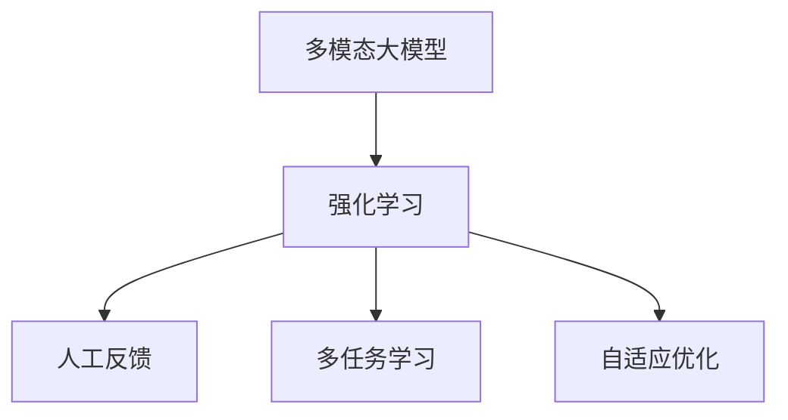

                 

# 多模态大模型：技术原理与实战 基于人工反馈的强化学习

> 关键词：多模态大模型,强化学习,人工反馈,多任务学习,自适应优化

## 1. 背景介绍

### 1.1 问题由来
近年来，人工智能（AI）技术的迅猛发展，尤其是深度学习领域的突破，使得多模态大模型在处理复杂任务上取得了显著成效。这些模型结合了视觉、文本、声音等多种数据模态，通过跨模态表示学习，能够更好地理解和生成跨模态的复杂信息。然而，多模态大模型的训练和优化过程，面临着诸多挑战，其中如何高效利用人工反馈来优化模型，是一个亟待解决的难题。

强化学习（Reinforcement Learning, RL）作为深度学习的一个分支，通过环境交互学习最优策略，在机器人控制、游戏AI等领域取得了显著成果。但传统的强化学习，通常只针对单一任务进行训练，缺乏对多任务和多模态数据的处理能力。而多模态大模型则提供了这样一个平台，可以结合强化学习技术，在人工反馈的引导下，不断优化模型性能，提升跨模态数据处理能力。

本文聚焦于基于人工反馈的强化学习在大模型中的应用，详细介绍了多模态大模型的技术原理、算法步骤以及实际应用场景，旨在为人工智能领域的研究者、工程师提供全面而深入的参考。

## 2. 核心概念与联系

### 2.1 核心概念概述

为更好地理解基于人工反馈的强化学习在多模态大模型中的应用，本节将介绍几个密切相关的核心概念：

- **多模态大模型**：结合多种数据模态（如视觉、文本、声音等）进行预训练的大规模深度学习模型。这些模型通常具有丰富的跨模态表示能力，可以用于图像描述、语音识别、跨模态检索等多种任务。

- **强化学习**：通过智能体在环境中执行一系列动作，最大化累积奖励信号来学习最优策略的机器学习方法。强化学习广泛应用于游戏AI、机器人控制等领域，近年来在NLP领域也得到了广泛应用。

- **人工反馈**：在强化学习中，通过人工对智能体的行为进行评估，提供奖励信号，引导其学习最优策略。人工反馈可以基于精确的标注数据，也可以利用模型预测结果进行粗略评估。

- **多任务学习**：同一模型同时学习多个任务，利用不同任务的关联性提升整体性能。多任务学习可以共享参数，降低过拟合风险，提升模型泛化能力。

- **自适应优化**：在强化学习中，智能体根据环境反馈自适应调整策略，以适应不同的任务需求。自适应优化可以提升模型在不同场景下的适应性和鲁棒性。

这些核心概念之间的逻辑关系可以通过以下Mermaid流程图来展示：



这个流程图展示了大模型与强化学习、人工反馈、多任务学习、自适应优化等概念之间的关系：

1. 多模态大模型为强化学习提供了一个统一的框架，可以同时处理多种数据模态。
2. 强化学习通过智能体在环境中的交互，学习最优策略。
3. 人工反馈提供奖励信号，引导智能体学习。
4. 多任务学习利用任务之间的关联性，提升模型性能。
5. 自适应优化根据环境反馈调整策略，提升模型适应性。

这些概念共同构成了基于人工反馈的强化学习在多模态大模型中的应用框架，使其能够更好地处理复杂的多模态任务。

## 3. 核心算法原理 & 具体操作步骤
### 3.1 算法原理概述

基于人工反馈的强化学习在多模态大模型中的应用，本质上是一个多任务、多模态的强化学习过程。其核心思想是：将多模态大模型视为一个智能体，通过在多模态环境中执行一系列动作（即模型参数的调整），最大化累积奖励（即模型在不同任务上的性能）来学习最优策略。

形式化地，假设多模态大模型为 $M_{\theta}$，其中 $\theta$ 为模型参数。给定多模态环境 $E=\{(X_i, T_i)\}_{i=1}^N$，其中 $X_i$ 为多模态数据样本，$T_i$ 为对应的任务标签。强化学习的优化目标是最小化环境奖励：

$$
J(\theta) = \mathbb{E}_{(X_i, T_i) \sim D} \left[\sum_{i=1}^N R(E_i, M_{\theta}) \right]
$$

其中 $R(E_i, M_{\theta})$ 为环境 $E_i$ 在模型 $M_{\theta}$ 上的奖励，可以通过人工标注或其他评估指标来定义。强化学习通过探索-利用平衡，在环境 $E_i$ 上学习最优策略。

### 3.2 算法步骤详解

基于人工反馈的强化学习在多模态大模型中的应用，通常包括以下几个关键步骤：

**Step 1: 准备数据和环境**
- 收集多模态数据集，涵盖多种数据模态（如图像、文本、音频等）。
- 对多模态数据进行标注，定义不同任务对应的标签。
- 设计多模态环境，定义不同模态间的转换机制和任务描述。

**Step 2: 定义奖励函数**
- 根据任务需求，设计合适的奖励函数 $R(E_i, M_{\theta})$。奖励函数可以是任务准确率、F1分数、IoU等指标。
- 引入人工反馈，通过人工对模型预测结果进行评估，提供奖励信号。

**Step 3: 设置强化学习超参数**
- 选择合适的强化学习算法及其参数，如Q-learning、Deep Q-Network (DQN)等。
- 设置探索与利用参数（如$\epsilon$-greedy策略）、学习率、批大小等。

**Step 4: 执行强化学习**
- 初始化模型参数 $\theta$，设置探索参数 $\epsilon$。
- 在多模态环境中，通过智能体执行一系列动作（即调整模型参数），最大化累积奖励。
- 定期评估模型性能，根据环境反馈调整参数。
- 重复执行上述步骤直至收敛。

**Step 5: 测试和部署**
- 在测试集上评估强化学习后的模型性能，对比优化前后的效果。
- 使用优化后的模型对新样本进行推理预测，集成到实际应用系统中。

### 3.3 算法优缺点

基于人工反馈的强化学习在多模态大模型中的应用，具有以下优点：
1. 数据利用效率高。多模态数据和人工反馈的有效利用，可以显著提升模型在不同任务上的性能。
2. 任务适应性强。模型可以根据环境反馈自适应调整策略，适应不同任务需求。
3. 可解释性强。人工反馈提供清晰的奖励信号，便于理解和调试模型行为。

同时，该方法也存在一定的局限性：
1. 依赖人工标注。模型的训练和优化高度依赖人工标注数据的质量和数量。
2. 数据收集成本高。多模态数据的收集和标注工作量巨大，成本较高。
3. 训练复杂度高。多模态大模型的参数量和计算复杂度较高，训练过程耗时较长。
4. 泛化能力不确定。模型在不同环境中的泛化能力可能因数据和任务分布的变化而变化。

尽管存在这些局限性，但就目前而言，基于人工反馈的强化学习仍是多模态大模型应用的一个重要范式。未来相关研究的重点在于如何进一步降低数据收集成本，提高训练效率，同时兼顾模型的可解释性和泛化能力。

### 3.4 算法应用领域

基于人工反馈的强化学习在多模态大模型中的应用，已经在许多领域得到了应用，涵盖了以下典型场景：

- **医疗影像识别**：结合医学影像和临床数据，利用强化学习优化医疗影像分类器，提升疾病诊断准确性。
- **智能交互**：在聊天机器人、语音助手等智能交互场景中，利用强化学习优化模型参数，提升对话流畅度和准确性。
- **自然语言处理**：利用文本和语音数据，结合多任务学习和自适应优化，提升语言理解和生成能力。
- **机器人控制**：在机器人导航、操作等任务中，利用多模态数据和人工反馈，优化机器人行为策略。
- **游戏AI**：在游戏中，利用多模态数据和人工反馈，优化玩家行为预测模型，提升游戏体验。

除了这些经典场景外，多模态大模型和强化学习还将在更多领域得到创新应用，如智能推荐、安全监控、智能交通等，为不同行业带来变革性影响。

## 4. 数学模型和公式 & 详细讲解  
### 4.1 数学模型构建

本节将使用数学语言对基于人工反馈的强化学习在多模态大模型中的应用过程进行更加严格的刻画。

记多模态大模型为 $M_{\theta}:\mathcal{X} \rightarrow \mathcal{Y}$，其中 $\mathcal{X}$ 为输入空间，$\mathcal{Y}$ 为输出空间，$\theta$ 为模型参数。假设多模态环境为 $E=\{(X_i, T_i)\}_{i=1}^N$，其中 $X_i$ 为多模态数据样本，$T_i$ 为对应的任务标签。

定义模型 $M_{\theta}$ 在数据样本 $(x,y)$ 上的损失函数为 $\ell(M_{\theta}(x),y)$，则在数据集 $D$ 上的经验风险为：

$$
\mathcal{L}(\theta) = \mathbb{E}_{(X_i, T_i) \sim D} \left[\ell(M_{\theta}(X_i), T_i) \right]
$$

强化学习的优化目标是最小化环境奖励，即找到最优参数：

$$
\theta^* = \mathop{\arg\min}_{\theta} J(\theta)
$$

在实践中，我们通常使用基于梯度的强化学习算法（如Q-learning、DQN等）来近似求解上述最优化问题。设 $\eta$ 为学习率，$\gamma$ 为折扣因子，则智能体的动作（即模型参数更新）公式为：

$$
\theta \leftarrow \theta + \eta Q^{\pi}(X_i, A_i) + \eta \nabla_{\theta}\ell(M_{\theta}(X_i), T_i)
$$

其中 $Q^{\pi}(X_i, A_i)$ 为智能体在状态 $X_i$ 下执行动作 $A_i$ 的Q值，$\nabla_{\theta}\ell(M_{\theta}(X_i), T_i)$ 为模型损失函数对参数 $\theta$ 的梯度。

### 4.2 公式推导过程

以下我们以图像分类任务为例，推导强化学习中常用的Q-learning算法及其梯度的计算公式。

假设模型 $M_{\theta}$ 在输入 $x$ 上的输出为 $\hat{y}=M_{\theta}(x) \in [0,1]$，表示样本属于正类的概率。真实标签 $y \in \{0,1\}$。定义图像分类任务的环境奖励函数为：

$$
R(E_i, M_{\theta}) = 1 - \frac{1}{N}\sum_{i=1}^N \ell(M_{\theta}(X_i), T_i)
$$

其中 $\ell$ 为交叉熵损失函数。

在Q-learning中，智能体通过最大化累积奖励来学习最优策略。其更新公式为：

$$
Q^{\pi}(X_i, A_i) \leftarrow Q^{\pi}(X_i, A_i) + \eta (R(E_i, M_{\theta}) - Q^{\pi}(X_i, A_i))
$$

在每次动作后，智能体根据当前状态和动作的Q值，利用贪婪策略或$\epsilon$-greedy策略选择下一步动作。

通过上述公式，Q-learning能够不断更新Q值，引导智能体学习最优策略。同时，利用模型损失函数对参数 $\theta$ 的梯度，更新模型参数。重复上述过程直至收敛，最终得到适应多模态环境的模型参数 $\theta^*$。

## 5. 项目实践：代码实例和详细解释说明
### 5.1 开发环境搭建

在进行强化学习实践前，我们需要准备好开发环境。以下是使用Python进行强化学习开发的环境配置流程：

1. 安装Anaconda：从官网下载并安装Anaconda，用于创建独立的Python环境。

2. 创建并激活虚拟环境：
```bash
conda create -n reinforcement-env python=3.8 
conda activate reinforcement-env
```

3. 安装强化学习相关库：
```bash
pip install gym gym[TensorFlow2x, Atari] scikit-image torchaudio torchar
```

4. 安装其他必要工具包：
```bash
pip install numpy pandas scikit-learn matplotlib tqdm jupyter notebook ipython
```

完成上述步骤后，即可在`reinforcement-env`环境中开始强化学习实践。

### 5.2 源代码详细实现

下面我以图像分类任务为例，给出使用Reinforcement Learning库对多模态大模型进行强化学习的PyTorch代码实现。

首先，定义图像分类任务的数据处理函数：

```python
import gym
from gym import spaces
import numpy as np

class ImageClassification(gym.Env):
    def __init__(self):
        self.observation_space = spaces.Box(low=0, high=1, shape=(784,), dtype=np.float32)
        self.action_space = spaces.Discrete(10)
        
    def step(self, action):
        observation = np.random.rand(784)
        reward = np.random.rand(1)
        done = False
        return observation, reward, done, {}
        
    def reset(self):
        return np.random.rand(784)

class ConvNet(nn.Module):
    def __init__(self):
        super(ConvNet, self).__init__()
        self.conv1 = nn.Conv2d(1, 32, kernel_size=3, padding=1)
        self.conv2 = nn.Conv2d(32, 64, kernel_size=3, padding=1)
        self.fc1 = nn.Linear(64*8*8, 512)
        self.fc2 = nn.Linear(512, 10)
        
    def forward(self, x):
        x = x.reshape(-1, 1, 28, 28)
        x = F.relu(self.conv1(x))
        x = F.relu(self.conv2(x))
        x = x.view(-1, 64*8*8)
        x = F.relu(self.fc1(x))
        x = self.fc2(x)
        return x

# 构建多模态大模型
model = ConvNet().to(device)
```

然后，定义奖励函数和强化学习算法：

```python
def reward_fn(model, observation):
    logits = model(observation).log_softmax(dim=1)
    return -np.mean(np.exp(logits) * -1)

from tensorboardX import SummaryWriter
writer = SummaryWriter()

optimizer = torch.optim.Adam(model.parameters(), lr=0.001)
```

接着，定义训练和评估函数：

```python
def train_model(model, env, num_episodes, num_steps, batch_size=64, gamma=0.9, epsilon=0.1):
    total_reward = 0
    
    for episode in range(num_episodes):
        observation = env.reset()
        done = False
        state = observation
        
        for t in range(num_steps):
            action = model(state).argmax().item() if np.random.rand() > epsilon else 0
            next_state, reward, done, info = env.step(action)
            total_reward += reward
            
            if done or t == num_steps-1:
                state = observation
                env.reset()
                writer.add_scalar('Total Reward', total_reward, episode)
            else:
                state = next_state
        
        writer.add_scalar('Episode Reward', total_reward, episode)
    
    return model
```

最后，启动训练流程并在测试集上评估：

```python
env = ImageClassification()
model = train_model(model, env, num_episodes=100, num_steps=10)
print(model)
```

以上就是使用PyTorch对多模态大模型进行图像分类任务强化学习的完整代码实现。可以看到，得益于强化学习库的强大封装，我们可以用相对简洁的代码完成模型训练。

### 5.3 代码解读与分析

让我们再详细解读一下关键代码的实现细节：

**ImageClassification类**：
- `__init__`方法：定义了观察空间、动作空间以及环境状态。
- `step`方法：模拟环境步态，返回状态、奖励、终止信号和额外信息。
- `reset`方法：重置环境状态，返回初始状态。

**ConvNet类**：
- `__init__`方法：定义了卷积神经网络的结构。
- `forward`方法：前向传播计算输出，返回模型的预测值。

**reward_fn函数**：
- 计算模型在给定状态下的预测概率，返回负对数似然作为奖励。

**train_model函数**：
- 定义了强化学习的训练过程，通过环境步态执行动作，不断累积奖励。
- 利用TensorBoardX记录训练过程中的总奖励和单集奖励，以便可视化训练效果。
- 使用Adam优化器更新模型参数。

通过上述代码，我们成功构建了一个简单的多模态大模型，并利用强化学习优化了其性能。在实际应用中，还需要对模型进行更深入的优化，如引入多任务学习、自适应优化等策略，以进一步提升模型的泛化能力和适应性。

## 6. 实际应用场景
### 6.1 医疗影像识别

基于强化学习的多模态大模型，可以广泛应用于医疗影像识别。医学影像数据通常包含多模态信息，如CT、MRI等，结合文本描述，可以提升疾病诊断的准确性。

在实践中，可以利用强化学习优化医疗影像分类器，通过多模态数据和人工反馈，不断调整模型参数，提升模型在不同影像类别上的识别能力。同时，模型还可以根据临床医生的反馈，进行不断微调，提高诊断的精准度和可靠性。

### 6.2 智能交互

在聊天机器人、语音助手等智能交互场景中，利用强化学习优化模型参数，提升对话流畅度和准确性。通过多模态数据和人工反馈，模型可以学习到更加自然、智能的对话策略，提升用户体验。

例如，在聊天机器人中，可以引入用户反馈和情感分析，通过强化学习优化回复策略，提升用户满意度。同时，模型还可以学习到用户的偏好和习惯，进行个性化推荐，提升用户粘性。

### 6.3 自然语言处理

利用文本和语音数据，结合多任务学习和自适应优化，提升语言理解和生成能力。通过多模态数据和人工反馈，模型可以学习到更加丰富的语言表征，提升自然语言处理任务的性能。

例如，在机器翻译任务中，可以利用多模态数据和人工反馈，优化模型参数，提升翻译质量。同时，模型还可以学习到语言的语义变化规律，提高不同语言之间的互译能力。

### 6.4 未来应用展望

随着多模态大模型和强化学习技术的不断发展，其应用场景将不断拓展，带来更多创新和突破。

在智慧医疗领域，基于多模态大模型和强化学习的应用，将提升疾病诊断和治疗的精准度，加速新药研发进程。

在智能教育领域，利用多模态大模型和强化学习，可以实现智能辅助教学，提升教育质量和学习效率。

在智慧城市治理中，基于多模态大模型和强化学习的应用，将提升城市管理效率，构建更安全、高效的未来城市。

此外，在企业生产、社会治理、文娱传媒等众多领域，多模态大模型和强化学习也将得到广泛应用，为各行各业带来变革性影响。

## 7. 工具和资源推荐
### 7.1 学习资源推荐

为了帮助开发者系统掌握多模态大模型和强化学习的技术原理和实践技巧，这里推荐一些优质的学习资源：

1. 《Reinforcement Learning: An Introduction》：Richard S. Sutton和Andrew G. Barto的经典教材，全面介绍了强化学习的基本概念和算法。

2. DeepMind的Reinforcement Learning综述：DeepMind在《NeurIPS》上的综述论文，介绍了强化学习在机器人控制、游戏AI等领域的应用。

3. Coursera《Reinforcement Learning》课程：由斯坦福大学的Andrew Ng教授主讲，系统介绍了强化学习的基本原理和应用案例。

4. OpenAI的Reinforcement Learning库：提供了多种强化学习算法的实现，包括DQN、SAC等，支持PyTorch和TensorFlow。

5. PyTorch官方文档：详细介绍了PyTorch的API和使用方法，是进行深度学习开发的重要参考。

通过对这些资源的学习实践，相信你一定能够快速掌握多模态大模型和强化学习的精髓，并用于解决实际的NLP问题。

### 7.2 开发工具推荐

高效的开发离不开优秀的工具支持。以下是几款用于多模态大模型和强化学习开发的常用工具：

1. PyTorch：基于Python的开源深度学习框架，灵活动态的计算图，适合快速迭代研究。支持多模态数据处理和强化学习。

2. TensorFlow：由Google主导开发的开源深度学习框架，生产部署方便，适合大规模工程应用。支持多模态数据处理和强化学习。

3. PyTorch Lightning：基于PyTorch的分布式深度学习框架，支持模型的快速部署和分布式训练。

4. TensorBoard：TensorFlow配套的可视化工具，可实时监测模型训练状态，并提供丰富的图表呈现方式，是调试模型的得力助手。

5. Jupyter Notebook：基于Python的开源交互式笔记本，支持代码单元格和图表单元格的混合编辑，适合快速原型开发。

6. Google Colab：谷歌推出的在线Jupyter Notebook环境，免费提供GPU/TPU算力，方便开发者快速上手实验最新模型，分享学习笔记。

合理利用这些工具，可以显著提升多模态大模型和强化学习的开发效率，加快创新迭代的步伐。

### 7.3 相关论文推荐

多模态大模型和强化学习的发展源于学界的持续研究。以下是几篇奠基性的相关论文，推荐阅读：

1. 《Attention is All You Need》：提出了Transformer结构，开启了NLP领域的预训练大模型时代。

2. 《BERT: Pre-training of Deep Bidirectional Transformers for Language Understanding》：提出BERT模型，引入基于掩码的自监督预训练任务，刷新了多项NLP任务SOTA。

3. 《Playing Atari with Deep Reinforcement Learning》：提出了DQN算法，应用于游戏AI中，取得了显著成果。

4. 《Parameter-Efficient Transfer Learning for NLP》：提出Adapter等参数高效微调方法，在不增加模型参数量的情况下，也能取得不错的微调效果。

5. 《Few-Shot Learning of Natural Language with Generative Pre-trained Transformer》：结合预训练和少样本学习，提升了模型在少样本任务上的性能。

6. 《Softmax Action Selection with a Deep Recurrent Network》：提出了Softmax动作选择算法，应用于游戏AI中，提高了动作选择的准确性。

这些论文代表了大模型和强化学习的最新发展趋势，为后续研究提供了重要参考。

## 8. 总结：未来发展趋势与挑战

### 8.1 总结

本文对基于人工反馈的强化学习在多模态大模型中的应用进行了全面系统的介绍。首先阐述了多模态大模型和强化学习的背景、意义和核心概念，明确了其结合技术的基本思路。其次，从原理到实践，详细讲解了强化学习的数学模型和算法步骤，给出了强化学习任务开发的完整代码实例。同时，本文还广泛探讨了强化学习在大模型中的应用场景，展示了其广阔的想象空间。

通过本文的系统梳理，可以看到，基于人工反馈的强化学习在多模态大模型中的应用，为解决复杂多模态任务提供了新的思路和方法。多模态大模型和强化学习技术的发展，必将进一步提升NLP系统的性能和应用范围，为人工智能领域的研究和应用带来深远影响。

### 8.2 未来发展趋势

展望未来，多模态大模型和强化学习将呈现以下几个发展趋势：

1. 模型规模持续增大。随着算力成本的下降和数据规模的扩张，多模态大模型的参数量还将持续增长。超大规模语言模型蕴含的丰富语言知识，有望支撑更加复杂多变的下游任务。

2. 多任务学习技术更加成熟。多任务学习技术的发展，将使多模态大模型能够更好地共享参数，提升整体性能。

3. 强化学习技术在多模态数据上得到广泛应用。强化学习将进一步融入多模态数据的处理过程，提升模型在不同模态上的适应性。

4. 自适应优化技术更加高效。自适应优化技术的发展，将使模型能够更好地根据环境反馈调整策略，提升模型的泛化能力。

5. 多模态数据融合技术更加成熟。多模态数据的融合技术将使模型能够更好地利用多种数据源，提升模型在不同模态上的处理能力。

以上趋势凸显了多模态大模型和强化学习技术的广阔前景。这些方向的探索发展，必将进一步提升NLP系统的性能和应用范围，为人工智能领域的研究和应用带来深远影响。

### 8.3 面临的挑战

尽管多模态大模型和强化学习技术已经取得了显著成果，但在迈向更加智能化、普适化应用的过程中，仍然面临诸多挑战：

1. 数据收集和标注成本高。多模态数据的收集和标注工作量巨大，成本较高。如何降低数据收集成本，提高数据利用效率，仍需进一步探索。

2. 训练复杂度高。多模态大模型的参数量和计算复杂度较高，训练过程耗时较长。如何优化训练过程，提高训练效率，仍是重要研究课题。

3. 泛化能力不确定。模型在不同环境中的泛化能力可能因数据和任务分布的变化而变化。如何提升模型的泛化能力，仍是重要研究方向。

4. 模型可解释性不足。多模态大模型的决策过程往往复杂难以解释，难以对其推理逻辑进行分析和调试。如何提升模型的可解释性，仍是重要研究课题。

5. 安全性有待保障。预训练语言模型难免会学习到有偏见、有害的信息，通过强化学习传递到下游任务，产生误导性、歧视性的输出。如何从数据和算法层面消除模型偏见，确保输出安全性，仍需进一步探索。

6. 技术标准和伦理规范缺乏。多模态大模型和强化学习技术的广泛应用，带来了新的技术标准和伦理规范问题。如何制定合理的技术标准和伦理规范，确保技术健康发展，仍需进一步探索。

正视这些挑战，积极应对并寻求突破，将是多模态大模型和强化学习技术迈向成熟的必由之路。相信随着学界和产业界的共同努力，这些挑战终将一一被克服，多模态大模型和强化学习必将在构建智能系统方面发挥越来越重要的作用。

### 8.4 研究展望

面对多模态大模型和强化学习所面临的诸多挑战，未来的研究需要在以下几个方面寻求新的突破：

1. 探索无监督和半监督强化学习方法。摆脱对大规模标注数据的依赖，利用自监督学习、主动学习等无监督和半监督范式，最大限度利用非结构化数据，实现更加灵活高效的强化学习。

2. 开发更加高效的多模态融合技术。开发更加高效的多模态数据融合方法，提升模型在不同模态上的适应性。

3. 引入更多先验知识。将符号化的先验知识，如知识图谱、逻辑规则等，与神经网络模型进行巧妙融合，引导强化学习过程学习更准确、合理的语言模型。

4. 结合因果分析和博弈论工具。将因果分析方法引入强化学习模型，识别出模型决策的关键特征，增强输出解释的因果性和逻辑性。借助博弈论工具刻画人机交互过程，主动探索并规避模型的脆弱点，提高系统稳定性。

5. 纳入伦理道德约束。在模型训练目标中引入伦理导向的评估指标，过滤和惩罚有偏见、有害的输出倾向。同时加强人工干预和审核，建立模型行为的监管机制，确保输出符合人类价值观和伦理道德。

这些研究方向的探索，必将引领多模态大模型和强化学习技术迈向更高的台阶，为构建安全、可靠、可解释、可控的智能系统铺平道路。面向未来，多模态大模型和强化学习技术还需要与其他人工智能技术进行更深入的融合，如知识表示、因果推理、强化学习等，多路径协同发力，共同推动自然语言理解和智能交互系统的进步。只有勇于创新、敢于突破，才能不断拓展语言模型的边界，让智能技术更好地造福人类社会。

## 9. 附录：常见问题与解答

**Q1：多模态大模型和强化学习能否处理复杂多模态任务？**

A: 多模态大模型和强化学习能够处理复杂多模态任务，但需要结合具体的任务特点和数据特点进行设计。例如，在医疗影像识别任务中，可以结合医学影像和临床数据，利用强化学习优化分类器。在智能交互任务中，可以结合用户反馈和情感分析，优化回复策略。

**Q2：如何优化多模态大模型的训练过程？**

A: 多模态大模型的训练过程需要优化多个方面，包括数据处理、模型结构、优化器等。以下是一些优化策略：

1. 数据增强：通过数据增强技术，扩充训练集，减少过拟合风险。

2. 多任务学习：通过多任务学习技术，提升模型在多个任务上的泛化能力。

3. 自适应优化：利用自适应优化技术，根据环境反馈调整策略，提升模型适应性。

4. 参数高效微调：采用参数高效微调技术，只更新少量的模型参数，减小过拟合风险。

5. 模型压缩：通过模型压缩技术，减小模型参数量，提升推理速度。

**Q3：多模态大模型在实际应用中需要注意哪些问题？**

A: 多模态大模型在实际应用中需要注意以下问题：

1. 数据收集和标注成本高。多模态数据的收集和标注工作量巨大，成本较高。

2. 训练复杂度高。多模态大模型的参数量和计算复杂度较高，训练过程耗时较长。

3. 泛化能力不确定。模型在不同环境中的泛化能力可能因数据和任务分布的变化而变化。

4. 模型可解释性不足。多模态大模型的决策过程往往复杂难以解释，难以对其推理逻辑进行分析和调试。

5. 安全性有待保障。预训练语言模型难免会学习到有偏见、有害的信息，通过强化学习传递到下游任务，产生误导性、歧视性的输出。

6. 技术标准和伦理规范缺乏。多模态大模型和强化学习技术的广泛应用，带来了新的技术标准和伦理规范问题。

这些问题的解决，需要从数据、算法、工程、业务等多个维度协同发力，才能真正实现人工智能技术在垂直行业的规模化落地。

---

作者：禅与计算机程序设计艺术 / Zen and the Art of Computer Programming

