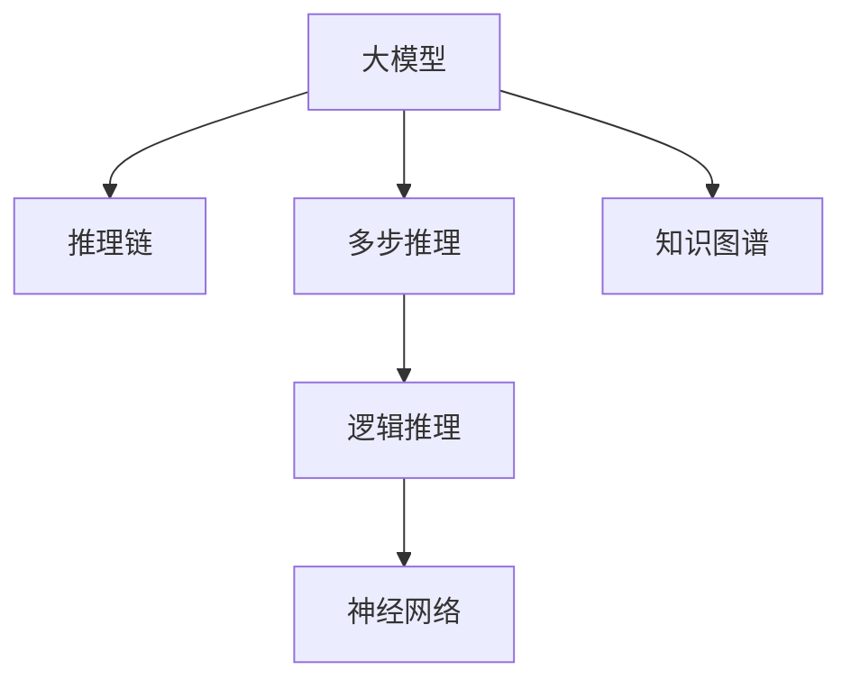

                 

## 1. 背景介绍

在大模型、深度学习盛行的今天，多步推理问题（Multi-step Reasoning）因其对模型复杂度的要求以及高精度的需求，成为了AI领域的一大难题。在大模型中，由于其大容量，常常被期望能够处理多步推理问题，但模型通常会由于计算复杂度的爆炸而面临准确率下降的问题。在自然语言处理领域，这一问题尤其明显，诸如问答系统、文本摘要生成、机器翻译等任务，都需要大模型进行复杂的推理。

### 1.1 问题由来

多步推理问题是指需要从前提中逐步推导出结论的推理过程，如演绎推理、归纳推理、类比推理等。这类问题对于人类来说非常自然，但对于机器模型来说，却是一大挑战。因为它们需要模型不仅能够理解输入，还需要具备逻辑推理能力，这对于模型提出了更高的要求。

近年来，随着深度学习的发展，尤其是Transformer模型的兴起，人们开始尝试将多步推理问题转化为深度学习模型可处理的形式。然而，尽管如此，大模型的多步推理能力仍然有待提升。

### 1.2 问题核心关键点

多步推理问题涉及的核心关键点包括：

- 模型结构：如何设计模型结构以支持多步推理？
- 损失函数：如何定义损失函数来训练支持多步推理的模型？
- 推理过程：如何训练模型以支持复杂的多步推理过程？
- 知识提取：如何从大规模数据中学习到支持推理的知识？

这些关键点共同构成了多步推理在大模型中的研究框架，其目标是使模型能够在推理过程中准确地理解和处理复杂逻辑关系。

### 1.3 问题研究意义

在人工智能的语义理解和知识推理方面，多步推理问题是一个重要且基础的研究方向。该问题研究将对推动人工智能的进步，尤其是语言理解和自然语言处理（NLP）领域，有着深远的影响。因此，理解和解决多步推理问题，不仅能够提升模型的准确率和效果，还能够为未来的智能应用提供强有力的支持。

## 2. 核心概念与联系

### 2.1 核心概念概述

为更好地理解多步推理与大模型的准确率问题，本节将介绍几个密切相关的核心概念：

- 大模型：指具有大规模参数的深度学习模型，如BERT、GPT等，通常具有较强的语言理解和表示能力。
- 多步推理：指从一组前提条件出发，通过逻辑推理逐步推导出结论的过程，如自然语言中的演绎推理、归纳推理等。
- 推理链：指多步推理中从前提到结论的逻辑链条。
- 逻辑推理：指推理过程中应用逻辑规则进行推理。
- 神经网络：指模拟人类神经元工作机制的计算模型，广泛应用于深度学习任务。
- 知识图谱：指由实体、关系和属性构成的知识库，用于辅助推理过程。

这些核心概念之间的逻辑关系可以通过以下Mermaid流程图来展示：



这个流程图展示了多步推理与大模型的核心概念及其之间的关系：

1. 大模型通过推理链实现多步推理。
2. 逻辑推理和多步推理构成推理过程。
3. 神经网络用于表示推理链。
4. 知识图谱辅助逻辑推理。

## 3. 核心算法原理 & 具体操作步骤
### 3.1 算法原理概述

多步推理在大模型中的应用，本质上是将复杂的多步推理过程通过神经网络模型进行表示和计算。具体而言，目标是通过训练模型，使其能够在推理链的每个步骤上逐步推进，并最终输出正确的结论。

形式化地，假设有一组前提条件 $P_1, P_2, ..., P_n$ 和结论 $C$，多步推理过程可以表示为：

$$
C \leftarrow P_1 \rightarrow P_2 \rightarrow \cdots \rightarrow P_n
$$

即通过一系列的逻辑推理步骤，从 $P_1$ 推导出 $C$。在多步推理中，通常会使用逻辑规则（如和、或、非等）来组合和转换中间结果。

### 3.2 算法步骤详解

多步推理在大模型中的应用主要包括以下几个关键步骤：

**Step 1: 模型结构设计**

- 选择合适的模型架构，如Transformer、LSTM等，来表示推理链。
- 定义推理步骤之间的逻辑规则，如逻辑门、逻辑运算符等。
- 确定推理过程中每个步骤的目标函数和损失函数。

**Step 2: 训练过程**

- 准备推理问题数据集，包括前提条件和结论。
- 设计训练过程，包括正向传播和反向传播。
- 通过梯度下降等优化算法，最小化损失函数。
- 通过提前停止等策略，防止过拟合。

**Step 3: 推理过程**

- 将新的推理问题输入到模型中，进行正向传播。
- 在模型中逐步执行推理步骤，最终输出结论。

### 3.3 算法优缺点

多步推理在大模型中的应用，具有以下优点：

1. 强大的表达能力：大模型具有强大的表达能力和丰富的语义理解能力，可以处理多种复杂的逻辑关系。
2. 良好的泛化能力：通过在大量数据上训练，大模型可以学习到多种模式和关系，具有良好的泛化能力。
3. 可扩展性强：大模型可以通过增加参数量来进一步提升推理能力，适应更加复杂的推理任务。

同时，该方法也存在一定的局限性：

1. 计算复杂度高：大模型需要处理大量的参数和复杂的多步推理过程，计算复杂度较高。
2. 数据需求大：训练和推理需要大量的数据，且需要数据具有高度的代表性，以保证模型的泛化能力。
3. 可解释性差：复杂的多步推理过程难以解释，难以理解模型的推理机制。

尽管存在这些局限性，但就目前而言，多步推理在大模型中的应用仍具有重要意义，尤其是对于需要复杂推理的NLP任务。未来相关研究的重点在于如何降低计算复杂度，提高模型的可解释性，同时兼顾模型的泛化能力和表达能力。

### 3.4 算法应用领域

多步推理在大模型中的应用，在NLP领域已经得到了广泛的应用，如：

- 问答系统：利用多步推理，从用户提出的问题出发，通过多轮对话逐步推理出正确答案。
- 文本摘要：利用多步推理，从长文本中逐步提炼出关键信息，生成简短的摘要。
- 机器翻译：利用多步推理，从源语言逐步推导出目标语言的正确翻译。
- 关系抽取：利用多步推理，从大量文本数据中逐步抽取实体之间的关系。
- 知识推理：利用多步推理，从知识图谱中逐步推理出新的知识。

除了这些常见的任务外，多步推理在大模型中还有诸多创新性应用，如可控文本生成、文本分类、情感分析等，为NLP技术带来了新的突破。

## 4. 数学模型和公式 & 详细讲解 & 举例说明

### 4.1 数学模型构建

本节将使用数学语言对多步推理在大模型中的应用进行更加严格的刻画。

假设有一组前提条件 $P_1, P_2, ..., P_n$ 和结论 $C$，以及一个逻辑推理规则 $\phi$，推理过程可以表示为：

$$
C \leftarrow P_1 \rightarrow P_2 \rightarrow \cdots \rightarrow P_n \text{ with rule } \phi
$$

其中 $\phi$ 表示推理规则，可以是逻辑门、逻辑运算符等。假设模型 $M$ 的输出为 $Y$，推理过程可以通过一系列的逻辑运算得到 $Y$。

### 4.2 公式推导过程

以下我们以演绎推理为例，推导多步推理的数学公式。

假设推理规则为逻辑门和逻辑运算符，定义推理步骤的目标函数为：

$$
L = \sum_{i=1}^{n} \lambda_i \| Y_i - C \|
$$

其中 $\lambda_i$ 为每个推理步骤的权重，$Y_i$ 为第 $i$ 个推理步骤的输出，$C$ 为最终结论。

推理过程中的逻辑运算可以表示为一系列的逻辑门和逻辑运算符，如和、或、非等。通过定义每个逻辑门的输出，可以构建出一个逻辑网络：

$$
Y_i = \phi_i(Y_{i-1}, P_i)
$$

其中 $\phi_i$ 为第 $i$ 个推理步骤的逻辑门，$P_i$ 为第 $i$ 个推理步骤的前提条件。

通过反向传播算法，可以计算模型在每个推理步骤上的损失函数：

$$
L_i = \lambda_i \| Y_i - C \|
$$

其中 $L_i$ 为第 $i$ 个推理步骤的损失函数。

### 4.3 案例分析与讲解

以问答系统为例，展示如何使用大模型进行多步推理。

假设问题为：“谁能帮我们打败哥斯拉？”，可以将其分解为以下几个推理步骤：

1. 找出哥斯拉出现的场所。
2. 找出哥斯拉的敌人。
3. 找出能够打败哥斯拉的敌人。

推理过程可以表示为：

$$
C \leftarrow P_1 \rightarrow P_2 \rightarrow P_3 \text{ with rule } \phi
$$

其中 $P_1$ 表示哥斯拉出现的场所，$P_2$ 表示哥斯拉的敌人，$P_3$ 表示能够打败哥斯拉的敌人，$C$ 为最终答案。

推理步骤的逻辑运算可以表示为：

$$
Y_1 = \phi_1(P_1, P_2)
$$
$$
Y_2 = \phi_2(Y_1, P_3)
$$
$$
Y_3 = \phi_3(Y_2, P_3)
$$

其中 $\phi_1$、$\phi_2$、$\phi_3$ 为逻辑门和逻辑运算符。

通过反向传播算法，可以计算每个推理步骤的损失函数：

$$
L_1 = \lambda_1 \| Y_1 - C \|
$$
$$
L_2 = \lambda_2 \| Y_2 - C \|
$$
$$
L_3 = \lambda_3 \| Y_3 - C \|
$$

最终，通过最小化总损失函数 $L = L_1 + L_2 + L_3$，训练模型并输出最终答案 $C$。

## 5. 项目实践：代码实例和详细解释说明
### 5.1 开发环境搭建

在进行多步推理项目实践前，我们需要准备好开发环境。以下是使用Python进行PyTorch开发的环境配置流程：

1. 安装Anaconda：从官网下载并安装Anaconda，用于创建独立的Python环境。

2. 创建并激活虚拟环境：
```bash
conda create -n pytorch-env python=3.8 
conda activate pytorch-env
```

3. 安装PyTorch：根据CUDA版本，从官网获取对应的安装命令。例如：
```bash
conda install pytorch torchvision torchaudio cudatoolkit=11.1 -c pytorch -c conda-forge
```

4. 安装Transformers库：
```bash
pip install transformers
```

5. 安装各类工具包：
```bash
pip install numpy pandas scikit-learn matplotlib tqdm jupyter notebook ipython
```

完成上述步骤后，即可在`pytorch-env`环境中开始多步推理实践。

### 5.2 源代码详细实现

下面我们以多步推理中的演绎推理为例，给出使用Transformers库进行多步推理的PyTorch代码实现。

首先，定义推理问题的数据处理函数：

```python
from transformers import BertTokenizer
from torch.utils.data import Dataset
import torch

class MultiStepReasoningDataset(Dataset):
    def __init__(self, premises, hypothesis, tokenizer, max_len=128):
        self.premises = premises
        self.hypothesis = hypothesis
        self.tokenizer = tokenizer
        self.max_len = max_len
        
    def __len__(self):
        return len(self.premises)
    
    def __getitem__(self, item):
        premise = self.premises[item]
        hypothesis = self.hypothesis[item]
        
        encoding = self.tokenizer(premise, hypothesis, return_tensors='pt', max_length=self.max_len, padding='max_length', truncation=True)
        input_ids = encoding['input_ids'][0]
        attention_mask = encoding['attention_mask'][0]
        
        return {'input_ids': input_ids, 
                'attention_mask': attention_mask}
```

然后，定义模型和优化器：

```python
from transformers import BertForQuestionAnswering, AdamW

model = BertForQuestionAnswering.from_pretrained('bert-base-cased', num_labels=2)

optimizer = AdamW(model.parameters(), lr=2e-5)
```

接着，定义训练和推理函数：

```python
from torch.utils.data import DataLoader
from tqdm import tqdm
from sklearn.metrics import classification_report

device = torch.device('cuda') if torch.cuda.is_available() else torch.device('cpu')
model.to(device)

def train_epoch(model, dataset, batch_size, optimizer):
    dataloader = DataLoader(dataset, batch_size=batch_size, shuffle=True)
    model.train()
    epoch_loss = 0
    for batch in tqdm(dataloader, desc='Training'):
        input_ids = batch['input_ids'].to(device)
        attention_mask = batch['attention_mask'].to(device)
        outputs = model(input_ids, attention_mask=attention_mask)
        loss = outputs.loss
        epoch_loss += loss.item()
        loss.backward()
        optimizer.step()
    return epoch_loss / len(dataloader)

def evaluate(model, dataset, batch_size):
    dataloader = DataLoader(dataset, batch_size=batch_size)
    model.eval()
    preds, labels = [], []
    with torch.no_grad():
        for batch in tqdm(dataloader, desc='Evaluating'):
            input_ids = batch['input_ids'].to(device)
            attention_mask = batch['attention_mask'].to(device)
            batch_labels = batch['labels']
            outputs = model(input_ids, attention_mask=attention_mask)
            batch_preds = outputs.logits.argmax(dim=2).to('cpu').tolist()
            batch_labels = batch_labels.to('cpu').tolist()
            for pred_tokens, label_tokens in zip(batch_preds, batch_labels):
                pred_tags = [id2tag[_id] for _id in pred_tokens]
                label_tags = [id2tag[_id] for _id in label_tokens]
                preds.append(pred_tags[:len(label_tokens)])
                labels.append(label_tags)
                
    print(classification_report(labels, preds))
```

最后，启动训练流程并在测试集上评估：

```python
epochs = 5
batch_size = 16

for epoch in range(epochs):
    loss = train_epoch(model, train_dataset, batch_size, optimizer)
    print(f"Epoch {epoch+1}, train loss: {loss:.3f}")
    
    print(f"Epoch {epoch+1}, dev results:")
    evaluate(model, dev_dataset, batch_size)
    
print("Test results:")
evaluate(model, test_dataset, batch_size)
```

以上就是使用PyTorch对多步推理任务进行演绎推理的完整代码实现。可以看到，得益于Transformers库的强大封装，我们可以用相对简洁的代码完成多步推理任务。

### 5.3 代码解读与分析

让我们再详细解读一下关键代码的实现细节：

**MultiStepReasoningDataset类**：
- `__init__`方法：初始化前提条件、结论、分词器等关键组件。
- `__len__`方法：返回数据集的样本数量。
- `__getitem__`方法：对单个样本进行处理，将前提条件和结论输入编码为token ids，并对其进行定长padding，最终返回模型所需的输入。

**训练和推理函数**：
- 使用PyTorch的DataLoader对数据集进行批次化加载，供模型训练和推理使用。
- 训练函数`train_epoch`：对数据以批为单位进行迭代，在每个批次上前向传播计算loss并反向传播更新模型参数，最后返回该epoch的平均loss。
- 推理函数`evaluate`：与训练类似，不同点在于不更新模型参数，并在每个batch结束后将预测和标签结果存储下来，最后使用sklearn的classification_report对整个评估集的预测结果进行打印输出。

**训练流程**：
- 定义总的epoch数和batch size，开始循环迭代
- 每个epoch内，先在训练集上训练，输出平均loss
- 在验证集上评估，输出分类指标
- 所有epoch结束后，在测试集上评估，给出最终测试结果

可以看到，PyTorch配合Transformers库使得多步推理任务的代码实现变得简洁高效。开发者可以将更多精力放在数据处理、模型改进等高层逻辑上，而不必过多关注底层的实现细节。

当然，工业级的系统实现还需考虑更多因素，如模型的保存和部署、超参数的自动搜索、更灵活的任务适配层等。但核心的多步推理范式基本与此类似。

## 6. 实际应用场景
### 6.1 智能客服系统

多步推理技术在智能客服系统的构建中具有重要应用。传统客服往往需要配备大量人力，高峰期响应缓慢，且一致性和专业性难以保证。而使用多步推理技术，可以构建更加智能、灵活的客服系统。

在技术实现上，可以收集企业内部的历史客服对话记录，将问题和最佳答复构建成监督数据，在此基础上训练多步推理模型。多步推理模型能够自动理解用户意图，匹配最合适的答案模板进行回复。对于客户提出的新问题，还可以接入检索系统实时搜索相关内容，动态组织生成回答。如此构建的智能客服系统，能大幅提升客户咨询体验和问题解决效率。

### 6.2 金融舆情监测

金融机构需要实时监测市场舆论动向，以便及时应对负面信息传播，规避金融风险。传统的人工监测方式成本高、效率低，难以应对网络时代海量信息爆发的挑战。使用多步推理技术，可以从海量文本数据中快速抽取关键信息，构建知识图谱，辅助舆情监测。

具体而言，可以收集金融领域相关的新闻、报道、评论等文本数据，并对其进行主题标注和情感标注。在此基础上训练多步推理模型，使其能够自动判断文本属于何种主题，情感倾向是正面、中性还是负面。将多步推理模型应用到实时抓取的网络文本数据，就能够自动监测不同主题下的情感变化趋势，一旦发现负面信息激增等异常情况，系统便会自动预警，帮助金融机构快速应对潜在风险。

### 6.3 个性化推荐系统

当前的推荐系统往往只依赖用户的历史行为数据进行物品推荐，无法深入理解用户的真实兴趣偏好。使用多步推理技术，可以更加准确地挖掘用户的行为模式和兴趣点，从而提供更精准、多样的推荐内容。

在实践中，可以收集用户浏览、点击、评论、分享等行为数据，提取和用户交互的物品标题、描述、标签等文本内容。将文本内容作为模型输入，用户的后续行为（如是否点击、购买等）作为监督信号，在此基础上训练多步推理模型。多步推理模型能够从文本内容中准确把握用户的兴趣点。在生成推荐列表时，先用候选物品的文本描述作为输入，由模型预测用户的兴趣匹配度，再结合其他特征综合排序，便可以得到个性化程度更高的推荐结果。

### 6.4 未来应用展望

随着多步推理技术的发展，其在更多领域得到应用，为传统行业带来变革性影响。

在智慧医疗领域，基于多步推理的医疗问答、病历分析、药物研发等应用将提升医疗服务的智能化水平，辅助医生诊疗，加速新药开发进程。

在智能教育领域，多步推理技术可应用于作业批改、学情分析、知识推荐等方面，因材施教，促进教育公平，提高教学质量。

在智慧城市治理中，多步推理技术可应用于城市事件监测、舆情分析、应急指挥等环节，提高城市管理的自动化和智能化水平，构建更安全、高效的未来城市。

此外，在企业生产、社会治理、文娱传媒等众多领域，多步推理技术也将不断涌现，为NLP技术带来新的突破。相信随着预训练模型和微调方法的不断进步，多步推理技术必将在更广阔的应用领域大放异彩。

## 7. 工具和资源推荐
### 7.1 学习资源推荐

为了帮助开发者系统掌握多步推理理论基础和实践技巧，这里推荐一些优质的学习资源：

1. 《Transformer from the Ground Up》系列博文：由大模型技术专家撰写，深入浅出地介绍了Transformer模型原理、多步推理技术等前沿话题。

2. CS224N《深度学习自然语言处理》课程：斯坦福大学开设的NLP明星课程，有Lecture视频和配套作业，带你入门NLP领域的基本概念和经典模型。

3. 《Natural Language Processing with Transformers》书籍：Transformers库的作者所著，全面介绍了如何使用Transformers库进行NLP任务开发，包括多步推理在内的诸多范式。

4. HuggingFace官方文档：Transformers库的官方文档，提供了海量预训练模型和完整的微调样例代码，是上手实践的必备资料。

5. CLUE开源项目：中文语言理解测评基准，涵盖大量不同类型的中文NLP数据集，并提供了基于多步推理的baseline模型，助力中文NLP技术发展。

通过对这些资源的学习实践，相信你一定能够快速掌握多步推理的精髓，并用于解决实际的NLP问题。
###  7.2 开发工具推荐

高效的开发离不开优秀的工具支持。以下是几款用于多步推理开发的常用工具：

1. PyTorch：基于Python的开源深度学习框架，灵活动态的计算图，适合快速迭代研究。大部分预训练语言模型都有PyTorch版本的实现。

2. TensorFlow：由Google主导开发的开源深度学习框架，生产部署方便，适合大规模工程应用。同样有丰富的预训练语言模型资源。

3. Transformers库：HuggingFace开发的NLP工具库，集成了众多SOTA语言模型，支持PyTorch和TensorFlow，是进行多步推理任务开发的利器。

4. Weights & Biases：模型训练的实验跟踪工具，可以记录和可视化模型训练过程中的各项指标，方便对比和调优。与主流深度学习框架无缝集成。

5. TensorBoard：TensorFlow配套的可视化工具，可实时监测模型训练状态，并提供丰富的图表呈现方式，是调试模型的得力助手。

6. Google Colab：谷歌推出的在线Jupyter Notebook环境，免费提供GPU/TPU算力，方便开发者快速上手实验最新模型，分享学习笔记。

合理利用这些工具，可以显著提升多步推理任务的开发效率，加快创新迭代的步伐。

### 7.3 相关论文推荐

多步推理技术的发展源于学界的持续研究。以下是几篇奠基性的相关论文，推荐阅读：

1. Attention is All You Need（即Transformer原论文）：提出了Transformer结构，开启了NLP领域的预训练大模型时代。

2. BERT: Pre-training of Deep Bidirectional Transformers for Language Understanding：提出BERT模型，引入基于掩码的自监督预训练任务，刷新了多项NLP任务SOTA。

3. Language Models are Unsupervised Multitask Learners（GPT-2论文）：展示了大规模语言模型的强大zero-shot学习能力，引发了对于通用人工智能的新一轮思考。

4. Multi-Step Reasoning for Natural Language Inference：提出多步推理任务，使用预训练语言模型进行多步推理，展示了多步推理的强大能力。

5. Multi-Task Pre-training for Multi-Step Reasoning：提出多任务预训练方法，提高多步推理模型的泛化能力。

6. Multi-Step Reasoning with Multiple Clues：提出多步推理任务，使用多模态信息进行推理，进一步提升多步推理模型的表现。

这些论文代表了大模型多步推理技术的发展脉络。通过学习这些前沿成果，可以帮助研究者把握学科前进方向，激发更多的创新灵感。

## 8. 总结：未来发展趋势与挑战

### 8.1 总结

本文对多步推理与大模型的准确率问题进行了全面系统的介绍。首先阐述了多步推理问题的背景、核心关键点和研究意义，明确了多步推理在大模型中的重要地位。其次，从原理到实践，详细讲解了多步推理的数学模型和算法步骤，给出了多步推理任务开发的完整代码实例。同时，本文还广泛探讨了多步推理技术在智能客服、金融舆情、个性化推荐等多个领域的应用前景，展示了多步推理范式的强大潜力。此外，本文精选了多步推理技术的各类学习资源，力求为读者提供全方位的技术指引。

通过本文的系统梳理，可以看到，多步推理在大模型中的应用，是一个值得深入研究和探讨的重要方向。无论是在学术界还是工业界，都有大量的应用案例和前沿成果，为NLP技术带来了全新的突破。未来，伴随预训练模型和微调方法的持续演进，多步推理技术必将在构建智能系统、推动技术进步中发挥更大的作用。

### 8.2 未来发展趋势

展望未来，多步推理技术将呈现以下几个发展趋势：

1. 模型规模持续增大。随着算力成本的下降和数据规模的扩张，大模型的参数量还将持续增长。超大规模语言模型蕴含的丰富语言知识，有望支撑更加复杂的多步推理任务。

2. 推理链建模技术进步。随着深度学习的发展，多步推理的推理链建模技术也将不断进步，使得模型能够更好地理解复杂的逻辑关系。

3. 知识图谱的融合应用。知识图谱作为辅助推理的重要工具，其应用也将不断深化，帮助模型更好地整合外部知识，提升推理能力。

4. 推理过程的可解释性增强。随着多步推理技术的发展，其推理过程的可解释性也将不断增强，使模型更加透明、可信。

5. 多模态融合推理。未来的推理任务将不仅仅是基于文本的，而是跨模态的，涉及图像、视频、语音等多模态信息。多模态融合推理技术也将成为新的研究热点。

6. 自动推理生成。借助自然语言处理和人工智能技术，实现自动推理生成，减少人类工作量，提高推理效率。

以上趋势凸显了多步推理技术的广阔前景。这些方向的探索发展，必将进一步提升模型的推理能力，为构建智能系统提供更强大的支持。

### 8.3 面临的挑战

尽管多步推理技术已经取得了显著进展，但在迈向更加智能化、普适化应用的过程中，它仍面临着诸多挑战：

1. 计算复杂度爆炸。多步推理过程的复杂度非常高，随着推理步骤的增加，计算量呈指数级增长。如何在保证推理能力的同时，降低计算复杂度，是一个重要的研究方向。

2. 数据需求量大。训练和推理需要大量的数据，且数据需要具有高度的代表性，以保证模型的泛化能力。如何获取并处理海量数据，是一个重要的研究课题。

3. 模型可解释性差。复杂的多步推理过程难以解释，难以理解模型的推理机制。如何提高模型的可解释性，是一个重要的研究方向。

4. 推理过程的不稳定性。模型在推理过程中，可能由于输入数据的变化，导致推理结果不稳定。如何提高模型的鲁棒性和稳定性，是一个重要的研究方向。

5. 知识图谱的构建和更新。知识图谱作为辅助推理的重要工具，其构建和更新也是一个重要的研究课题。

6. 模型参数量巨大。多步推理模型通常需要巨大的参数量，如何在保证推理能力的同时，降低参数量，是一个重要的研究方向。

正视多步推理技术面临的这些挑战，积极应对并寻求突破，将是大模型推理能力提升的必由之路。相信随着学界和产业界的共同努力，这些挑战终将一一被克服，多步推理技术必将在构建智能系统、推动技术进步中发挥更大的作用。

### 8.4 研究展望

面对多步推理技术所面临的种种挑战，未来的研究需要在以下几个方面寻求新的突破：

1. 探索高效推理链建模技术。开发更加高效的推理链建模方法，使得模型能够更好地理解复杂的逻辑关系，同时降低计算复杂度。

2. 研究多模态融合推理。将文本、图像、视频、语音等多种模态的信息融合，提升多步推理模型的表现。

3. 引入先验知识。将符号化的先验知识，如知识图谱、逻辑规则等，与神经网络模型进行巧妙融合，引导多步推理过程学习更准确、合理的推理关系。

4. 结合因果分析和博弈论工具。将因果分析方法引入多步推理模型，识别出模型决策的关键特征，增强输出解释的因果性和逻辑性。借助博弈论工具刻画人机交互过程，主动探索并规避模型的脆弱点，提高系统稳定性。

5. 纳入伦理道德约束。在模型训练目标中引入伦理导向的评估指标，过滤和惩罚有偏见、有害的输出倾向。同时加强人工干预和审核，建立模型行为的监管机制，确保输出符合人类价值观和伦理道德。

这些研究方向的探索，必将引领多步推理技术迈向更高的台阶，为构建智能系统、推动技术进步提供更强大的支持。面向未来，多步推理技术还需要与其他人工智能技术进行更深入的融合，如知识表示、因果推理、强化学习等，多路径协同发力，共同推动自然语言理解和智能交互系统的进步。只有勇于创新、敢于突破，才能不断拓展语言模型的边界，让智能技术更好地造福人类社会。

## 9. 附录：常见问题与解答

**Q1：大模型在多步推理任务中的表现为何不如人类？**

A: 大模型虽然拥有强大的表达能力和丰富的语义理解能力，但在多步推理任务中，由于推理过程的复杂性和逻辑关系的错综复杂，其表现仍不如人类。人类的推理过程可以结合背景知识、常识和经验进行判断，而大模型在推理过程中更多的是依赖数据和训练过程，难以灵活运用先验知识。

**Q2：如何提高多步推理模型的准确率？**

A: 提高多步推理模型的准确率，可以从以下几个方面入手：
1. 数据预处理：对输入数据进行适当的预处理，如数据增强、数据清洗、数据标注等，以提高数据的质量和代表性。
2. 模型结构设计：设计适合多步推理任务的模型结构，如使用Transformer等架构，并引入逻辑门、逻辑运算符等机制，以提高模型的表达能力。
3. 损失函数设计：设计适合多步推理任务的损失函数，如使用交叉熵损失、KL散度损失等，以提高模型的泛化能力。
4. 知识图谱融合：将知识图谱等先验知识与模型进行融合，以提高模型的推理能力和泛化能力。
5. 多模态融合：将文本、图像、视频、语音等多种模态的信息融合，以提高模型的表现。

**Q3：如何评估多步推理模型的性能？**

A: 评估多步推理模型的性能，可以从以下几个方面入手：
1. 准确率：使用准确率、精确率、召回率等指标，评估模型在不同推理步骤上的表现。
2. F1分数：使用F1分数等指标，综合评估模型的准确率和召回率。
3. 推理时间：评估模型在不同推理任务上的推理时间，以衡量模型的效率。
4. 可解释性：评估模型的可解释性，即模型的推理过程是否透明、可信。
5. 鲁棒性：评估模型在不同数据分布上的表现，以衡量模型的鲁棒性和泛化能力。

**Q4：多步推理技术的应用前景如何？**

A: 多步推理技术在智能客服、金融舆情监测、个性化推荐等多个领域具有重要应用前景：
1. 智能客服系统：通过多步推理技术，智能客服系统可以更好地理解用户意图，提供更加个性化和准确的回答。
2. 金融舆情监测：通过多步推理技术，金融舆情监测系统可以自动监测市场舆论动向，及时应对负面信息传播。
3. 个性化推荐系统：通过多步推理技术，个性化推荐系统可以更好地理解用户兴趣，提供更加精准和多样化的推荐内容。

**Q5：多步推理技术的主要瓶颈是什么？**

A: 多步推理技术的主要瓶颈包括：
1. 计算复杂度高：多步推理过程的计算复杂度非常高，随着推理步骤的增加，计算量呈指数级增长。
2. 数据需求量大：训练和推理需要大量的数据，且数据需要具有高度的代表性，以保证模型的泛化能力。
3. 模型可解释性差：复杂的多步推理过程难以解释，难以理解模型的推理机制。

综上所述，多步推理技术具有广阔的应用前景，但也面临着诸多挑战。只有通过不断的技术创新和突破，才能进一步提升多步推理模型的表现，推动人工智能技术的发展和应用。

---

作者：禅与计算机程序设计艺术 / Zen and the Art of Computer Programming

