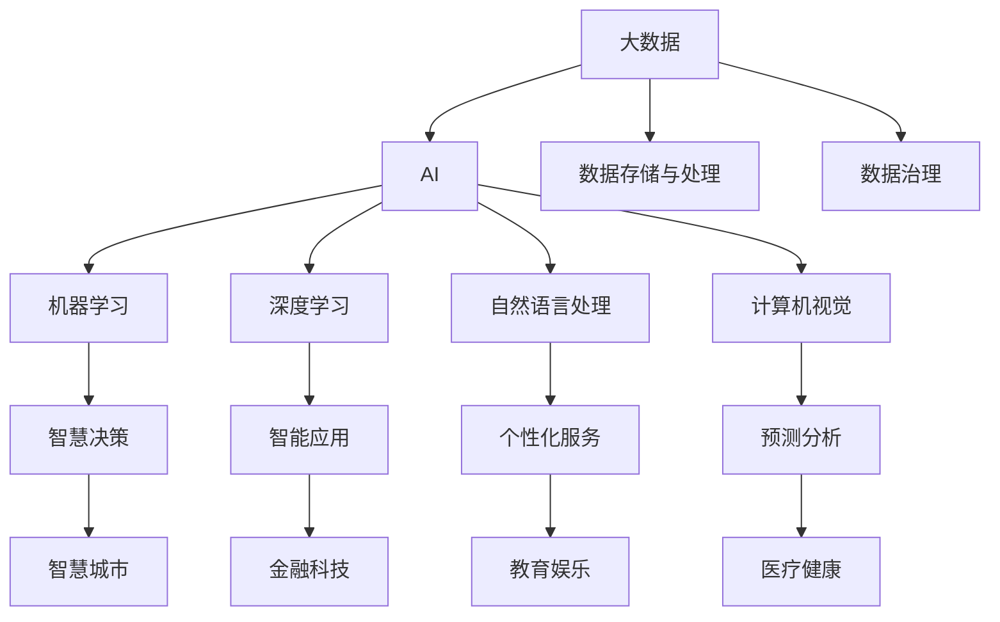

                 

# 大数据与AI的未来发展趋势

## 1. 背景介绍

### 1.1 问题由来

在当今信息化时代，大数据与人工智能（AI）技术的结合已成为推动社会进步和创新的关键力量。大数据提供了海量、多样化的信息资源，而AI通过算法和模型对这些数据进行深度分析和学习，从而产生出前所未有的智慧价值。大数据与AI的结合，正在重塑各行各业，从金融、医疗、零售到交通、教育、政府等，都呈现出智能化、自动化、个性化的趋势。

### 1.2 问题核心关键点

本文将详细探讨大数据与AI的未来发展趋势，重点从数据管理、算法优化、应用场景、技术挑战和未来展望等多个维度，深入分析其发展前景和潜在影响。通过系统梳理大数据与AI的核心概念和联系，结合最新的技术进展和实际应用案例，提供全面、深入的技术见解。

## 2. 核心概念与联系

### 2.1 核心概念概述

- **大数据(Big Data)**：指结构化、半结构化和非结构化数据的大规模集合，通常涉及数据的体积、速度和多样性，即3V特性（Volume, Velocity, Variety）。大数据技术包括数据存储、处理、分析、可视化和治理等。
- **人工智能(AI)**：模拟人类智能行为的计算机系统，涵盖机器学习、深度学习、自然语言处理、计算机视觉等多个子领域。AI旨在使机器能够自主完成复杂任务，解决人类难以解决的问题。
- **大数据与AI融合**：通过数据驱动和算法优化，大数据与AI技术的结合推动了智慧决策、智能应用、个性化服务、预测分析等多领域的创新发展。
- **算法优化**：在数据量巨大、类型多样、应用场景复杂的环境下，算法的优化和创新是大数据与AI融合的核心。
- **应用场景**：大数据与AI技术的应用遍及医疗健康、金融科技、智能制造、智慧城市、教育娱乐等多个领域，正在改变社会生产和生活方式。

这些核心概念之间的逻辑关系可以通过以下Mermaid流程图来展示：



## 3. 核心算法原理 & 具体操作步骤

### 3.1 算法原理概述

大数据与AI的结合主要依赖于数据的收集、存储、处理和分析，以及基于这些数据的模型训练和应用。核心算法原理主要包括以下几个方面：

1. **数据预处理**：对原始数据进行清洗、去重、转换、标注等处理，使之适合机器学习算法使用。
2. **特征工程**：从原始数据中提取、选择、构造有意义的特征，供算法学习使用。
3. **模型训练**：使用标注数据训练机器学习或深度学习模型，生成预测或分类模型。
4. **模型评估**：通过测试数据集评估模型性能，选择最优模型。
5. **模型应用**：将训练好的模型应用于实际业务场景，解决特定问题。

### 3.2 算法步骤详解

大数据与AI的融合涉及多个步骤，包括数据采集、存储、处理、分析、模型训练和应用等。以下详细描述其具体操作步骤：

1. **数据采集**：从不同来源收集数据，如网络爬虫、传感器、社交媒体、交易记录等。
2. **数据存储**：将采集到的数据存储到数据库或分布式文件系统中，如Hadoop、Spark、NoSQL数据库等。
3. **数据处理**：对存储的数据进行清洗、转换和增强等处理，如去重、缺失值填充、特征工程等。
4. **数据分析**：使用统计分析、数据挖掘等方法，从数据中提取有价值的信息和知识。
5. **模型训练**：根据业务需求，选择合适的算法和模型，使用标注数据进行训练，优化模型参数。
6. **模型评估**：在独立测试数据集上评估模型性能，调整模型参数。
7. **模型应用**：将训练好的模型部署到实际业务系统中，实现智能决策和应用。

### 3.3 算法优缺点

大数据与AI融合的算法具有以下优点：

- **数据驱动**：通过大量数据学习，提高了模型精度和泛化能力。
- **自动化**：减少了人工干预，提高了效率和一致性。
- **灵活性**：算法可以根据需求进行定制和优化，适应不同的应用场景。

同时，也存在一些局限性：

- **数据依赖**：模型的效果很大程度上取决于数据的质量和数量，数据不足或数据偏差可能影响模型性能。
- **计算复杂**：处理大规模数据和复杂模型需要高计算资源，成本较高。
- **解释性不足**：一些高级算法模型如深度学习，其内部机制复杂，难以解释和调试。

### 3.4 算法应用领域

大数据与AI的融合已经在多个领域展现出广泛的应用前景，包括但不限于：

- **医疗健康**：通过分析患者数据，预测疾病风险、个性化治疗方案、优化医疗资源配置等。
- **金融科技**：利用大数据和AI进行风险评估、欺诈检测、投资策略优化、客户服务自动化等。
- **智能制造**：通过工业互联网和物联网采集设备数据，实现智能生产、质量控制、设备维护等。
- **智慧城市**：结合城市基础设施数据和居民行为数据，提升城市管理效率、缓解交通拥堵、改善公共服务。
- **教育娱乐**：根据用户行为数据，推荐个性化课程、优化教育内容、提高学习效果、提供沉浸式娱乐体验。

## 4. 数学模型和公式 & 详细讲解

### 4.1 数学模型构建

在大数据与AI的融合中，数学模型扮演着重要角色。以下通过几个核心模型的构建，展示其基本框架和应用：

- **线性回归模型**：用于预测连续型变量，表达式为 $y = \beta_0 + \beta_1 x_1 + ... + \beta_n x_n + \epsilon$，其中 $\beta$ 为回归系数，$\epsilon$ 为误差项。
- **逻辑回归模型**：用于预测二分类变量，表达式为 $P(Y=1) = \frac{1}{1+e^{-\beta_0 - \beta_1 x_1 - ... - \beta_n x_n}}$。
- **决策树模型**：通过树形结构进行分类和回归，每个节点代表一个特征，分支代表特征值。
- **随机森林模型**：通过组合多个决策树，减少过拟合，提高泛化能力。
- **深度学习模型**：如卷积神经网络（CNN）、循环神经网络（RNN）、长短时记忆网络（LSTM）等，用于处理结构化和非结构化数据。

### 4.2 公式推导过程

以逻辑回归模型为例，其推导过程如下：

1. 假设线性回归模型的输出为 $y = \beta_0 + \beta_1 x_1 + ... + \beta_n x_n$。
2. 将输出 $y$ 与真实值 $Y$ 做对数几率损失函数（Log Loss），表达式为 $L = -\frac{1}{N} \sum_{i=1}^N (y_i \log \hat{y_i} + (1-y_i) \log(1-\hat{y_i}))$。
3. 利用梯度下降算法，求导数 $\frac{\partial L}{\partial \beta}$，更新参数 $\beta$，公式为 $\beta \leftarrow \beta - \eta \frac{\partial L}{\partial \beta}$，其中 $\eta$ 为学习率。

### 4.3 案例分析与讲解

以医疗健康领域的病患风险预测为例，通过收集患者的健康记录、生活习惯、家族病史等数据，构建逻辑回归模型，预测患者患某种疾病的概率。模型的训练数据集为已患该疾病的患者记录，测试数据集为未患该疾病但具有高风险因素的患者记录。训练完成后，模型在测试数据集上评估性能，如准确率、召回率、F1值等指标。

## 5. 项目实践：代码实例和详细解释说明

### 5.1 开发环境搭建

要实现大数据与AI的融合，首先需要配置好开发环境。以下是Python开发环境的具体配置步骤：

1. 安装Python：从官网下载并安装最新版本的Python，如Python 3.9以上。
2. 安装虚拟环境：使用 `virtualenv` 或 `conda` 创建虚拟环境，以隔离开发环境与系统环境。
3. 安装相关库：使用 `pip` 安装常用的Python科学计算库，如NumPy、Pandas、Scikit-Learn、TensorFlow等。
4. 安装分布式计算库：如Spark、Hadoop、Dask等，以支持大规模数据处理。

### 5.2 源代码详细实现

以下是一个基于TensorFlow的线性回归模型实现示例，用于预测房价：

```python
import tensorflow as tf
import numpy as np
from sklearn.model_selection import train_test_split

# 准备数据
X = np.random.rand(100, 1)
y = np.random.rand(100, 1) * 100 + 500

# 定义模型
model = tf.keras.Sequential([
    tf.keras.layers.Dense(units=1, input_shape=(1,))
])

# 编译模型
model.compile(optimizer=tf.keras.optimizers.Adam(), loss='mse')

# 训练模型
X_train, X_test, y_train, y_test = train_test_split(X, y, test_size=0.2)
model.fit(X_train, y_train, epochs=100, batch_size=32)

# 评估模型
y_pred = model.predict(X_test)
print('Mean Absolute Error:', np.mean(np.abs(y_pred - y_test)))
```

### 5.3 代码解读与分析

以上代码实现了基于TensorFlow的线性回归模型，用于预测房价。详细解读如下：

- 首先准备100个随机数据样本，每个样本有一个特征值和一个目标值。
- 使用 `Sequential` 定义线性回归模型，包含一个全连接层，输出一个值。
- 使用 `compile` 方法编译模型，选择Adam优化器和均方误差损失函数。
- 使用 `train_test_split` 将数据集分为训练集和测试集。
- 使用 `fit` 方法训练模型，设置100个epochs，批次大小为32。
- 使用 `predict` 方法预测测试集，并计算预测值与真实值之间的平均绝对误差。

## 6. 实际应用场景

### 6.1 智能制造

智能制造是工业4.0的重要组成部分，通过将大数据与AI技术深度融合，实现智能生产、质量控制和设备维护。例如，利用传感器采集的工业设备运行数据，结合机器学习算法进行故障预测和维护，显著提高了设备的可靠性和生产效率。

### 6.2 智慧城市

智慧城市通过采集城市基础设施数据和居民行为数据，实现交通流量管理、环境监测、公共安全等。例如，利用AI算法分析交通监控视频，识别交通违规行为，自动调整交通信号灯，缓解交通拥堵。

### 6.3 金融科技

金融科技领域利用大数据和AI进行风险评估、信用评分、欺诈检测等。例如，利用机器学习算法分析用户的消费记录、信用评分和社交网络数据，预测用户违约风险，优化贷款审批流程。

## 7. 工具和资源推荐

### 7.1 学习资源推荐

为了帮助开发者系统掌握大数据与AI的核心技术，以下是一些优质的学习资源：

- **《Python数据科学手册》**：该书系统介绍了Python在数据科学中的应用，包括NumPy、Pandas、Scikit-Learn等库的使用。
- **Coursera《机器学习》课程**：由斯坦福大学教授Andrew Ng主讲，涵盖了机器学习的基本理论和实践。
- **Kaggle**：这是一个数据科学竞赛平台，提供大量的数据集和模型，适合学习和实践。
- **TensorFlow官方文档**：提供了TensorFlow的全面介绍和详细的使用指南。
- **PyTorch官方文档**：提供了PyTorch的全面介绍和详细的使用指南。

通过这些学习资源，可以全面掌握大数据与AI的核心技术，并进行实际应用开发。

### 7.2 开发工具推荐

以下是一些常用的开发工具，适用于大数据与AI的应用开发：

- **Hadoop和Spark**：用于大规模数据处理和分布式计算。
- **TensorFlow和PyTorch**：用于机器学习和深度学习模型的构建。
- **Kafka和Flink**：用于实时数据流处理。
- **Jupyter Notebook**：用于数据科学和机器学习的交互式开发和可视化。
- **Airflow**：用于构建数据管道和任务调度。

使用这些工具，可以大大提高开发效率，加速大数据与AI的应用开发。

### 7.3 相关论文推荐

以下是几篇具有代表性的相关论文，推荐阅读：

- **《数据挖掘导论》**：介绍了数据挖掘的基本概念和技术。
- **《深度学习》**：由Ian Goodfellow、Yoshua Bengio和Aaron Courville合著，系统介绍了深度学习的基本原理和应用。
- **《机器学习实战》**：由Peter Harrington著，介绍了机器学习算法和实现方法。

这些论文代表了大数据与AI领域的最新研究成果，有助于深入理解其核心技术和应用实践。

## 8. 总结：未来发展趋势与挑战

### 8.1 总结

本文详细探讨了大数据与AI的融合技术，从核心概念、算法原理、操作步骤到实际应用，全面介绍了其未来发展趋势和面临的挑战。通过系统梳理，可以看出大数据与AI技术在各个领域的广泛应用前景，以及算法优化和模型应用的关键点。大数据与AI的结合，正在推动社会进步和行业变革，未来将带来更多创新和机遇。

### 8.2 未来发展趋势

展望未来，大数据与AI的融合技术将呈现以下几个趋势：

- **自动化和智能化**：随着算法和模型的不断优化，大数据与AI将更加智能化，能够自主进行复杂决策和应用。
- **实时化和大规模化**：通过实时数据流处理和分布式计算技术，大数据与AI将支持实时应用，处理大规模数据。
- **多模态融合**：将文本、图像、视频等多模态数据进行融合，提升模型的综合能力和应用场景。
- **边缘计算**：将数据和算法部署在边缘设备上，实现数据本地化处理和决策。
- **联邦学习**：在保护数据隐私的前提下，通过联邦学习技术共享模型，提升全局模型的泛化能力。

这些趋势将进一步推动大数据与AI技术的成熟和应用落地，带来更多的行业变革和创新。

### 8.3 面临的挑战

尽管大数据与AI的融合技术已经取得了显著进展，但仍面临诸多挑战：

- **数据隐私和安全**：数据隐私和安全性是重要问题，需要设计合理的隐私保护机制和数据安全措施。
- **模型解释性和可信度**：算法的可解释性和可信度不足，需要进一步研究和改进。
- **计算资源和成本**：处理大规模数据和高性能计算需要高成本，如何降低计算成本是重要问题。
- **跨领域应用**：不同领域的应用场景和需求不同，如何设计通用的算法和模型是重要挑战。
- **伦理和道德**：算法的伦理和道德问题，如偏见、歧视等，需要引起重视和改进。

这些挑战需要学界和产业界共同努力，才能推动大数据与AI技术的健康发展。

### 8.4 研究展望

未来，大数据与AI技术的融合将带来更多的创新和突破。以下是一些可能的研究方向：

- **联邦学习与隐私保护**：研究联邦学习技术，在保护数据隐私的前提下，共享模型和知识。
- **跨模态学习**：研究多模态数据的融合和表示学习，提升模型的综合能力。
- **边缘计算与实时化**：研究边缘计算技术，实现数据本地化处理和实时应用。
- **模型解释性与可信度**：研究模型的可解释性和可信度，提升算法的透明性和可信性。
- **伦理与道德**：研究算法的伦理和道德问题，确保技术的公平性和透明性。

这些研究方向将推动大数据与AI技术的进一步成熟和应用落地，带来更多的行业变革和创新。

## 9. 附录：常见问题与解答

**Q1: 大数据与AI技术的主要应用场景有哪些？**

A: 大数据与AI技术的主要应用场景包括医疗健康、金融科技、智能制造、智慧城市、教育娱乐等多个领域，通过数据分析和模型训练，实现智能决策、个性化服务、优化资源配置等功能。

**Q2: 如何处理大数据与AI融合过程中的数据隐私和安全问题？**

A: 处理数据隐私和安全问题，可以采用以下方法：
- 数据匿名化：通过数据脱敏和扰动等技术，保护用户隐私。
- 数据加密：使用加密技术对数据进行保护，防止数据泄露。
- 访问控制：设计合理的访问控制策略，限制数据访问权限。
- 隐私计算：使用联邦学习、差分隐私等技术，保护数据隐私。

**Q3: 如何提升大数据与AI融合模型的解释性和可信度？**

A: 提升模型的解释性和可信度，可以采用以下方法：
- 可解释性算法：使用可解释性强的算法，如决策树、逻辑回归等。
- 特征工程：对特征进行解释和分析，理解模型的决策逻辑。
- 模型可视化：使用可视化工具，展示模型的决策过程和特征重要性。
- 模型对比：通过对比不同模型的性能和解释性，选择最优模型。

通过这些方法，可以提升模型的解释性和可信度，确保算法的透明性和公平性。

---

作者：禅与计算机程序设计艺术 / Zen and the Art of Computer Programming

