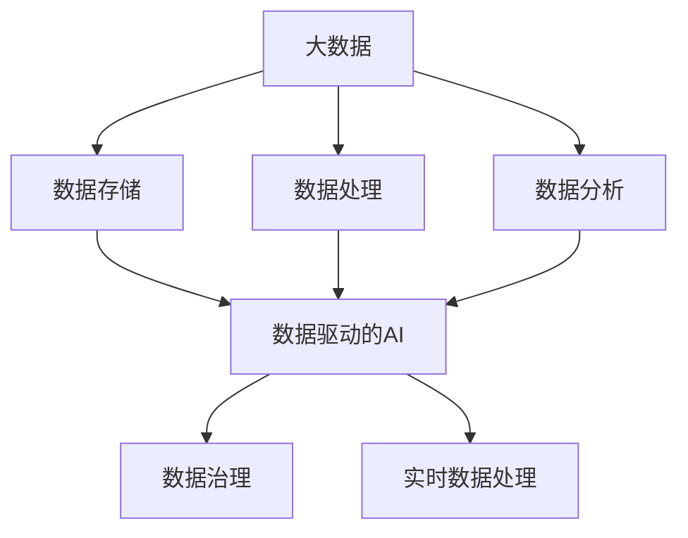

                 

# 大数据在AI中的重要性

## 1. 背景介绍

随着信息技术的迅猛发展，数据已经成为了新时代的核心资产，特别是大数据技术的发展，为人工智能(AI)提供了强大的动力和支撑。大数据在AI中的应用已经成为了推动AI技术不断进步的关键因素，对AI的发展产生了深远的影响。

### 1.1 数据的重要性

在大数据时代，数据被视为一种新的生产资料，对人工智能技术的推动作用日益显著。数据的多样性、丰富性、实时性等特点，使得大数据技术在AI领域中发挥着越来越重要的作用。无论是数据驱动的深度学习，还是基于知识的AI系统，都离不开数据的支持。

### 1.2 AI与大数据的融合

AI与大数据的融合已经成为了目前技术发展的重要趋势。大数据技术为AI提供了丰富的数据源，使得AI系统能够从中学习并提取出有价值的模式和知识。而AI技术的发展，则为大数据的处理和分析提供了新的方法和工具，使得数据的价值能够得到最大程度的利用。

## 2. 核心概念与联系

### 2.1 核心概念概述

为了深入理解大数据在AI中的重要性，本节将介绍几个密切相关的核心概念：

- **大数据**：指规模巨大、高速增长、多样性丰富、真实性高的数据集合。大数据技术主要涉及数据存储、数据处理、数据分析等领域，目标是实现数据价值的最大化利用。

- **人工智能**：一种通过计算机模拟人类智能行为的技术，包括机器学习、深度学习、自然语言处理、计算机视觉等多个方向。

- **数据驱动的AI**：指利用大数据技术驱动的AI系统，即通过分析、处理和利用大量数据，来训练AI模型，提升AI系统的性能和智能化水平。

- **AI与大数据的融合**：指AI技术和大数据技术的深度结合，通过数据驱动的AI系统，将数据转换为知识和智能，为各行各业提供智能化解决方案。

- **数据治理**：指对数据的采集、存储、管理、使用进行规范化和标准化，确保数据的质量和安全性，是实现大数据与AI融合的重要前提。

- **实时数据处理**：指对数据进行实时采集、处理和分析，使得AI系统能够及时响应变化，提升决策的及时性和准确性。

这些核心概念之间的逻辑关系可以通过以下Mermaid流程图来展示：



这个流程图展示了大数据在AI中的核心概念及其之间的关系：

1. 大数据通过数据存储、处理和分析等技术手段，为AI系统提供了丰富和高质量的数据源。
2. AI技术通过训练和优化算法，将数据转换为知识和智能，推动AI系统的应用和创新。
3. 数据治理和实时数据处理是确保数据质量和及时性的重要环节，为大数据与AI的深度融合提供了保障。

## 3. 核心算法原理 & 具体操作步骤

### 3.1 算法原理概述

在大数据背景下，AI技术的核心算法包括：

- **机器学习算法**：通过数据训练模型，并利用模型进行预测或分类，是数据驱动AI的基础。
- **深度学习算法**：通过多层次神经网络，自动学习和提取数据中的高阶特征，是实现复杂AI任务的关键。
- **自然语言处理算法**：通过文本数据处理和分析，实现对人类语言的理解和生成，是大数据在自然语言处理领域的重要应用。
- **计算机视觉算法**：通过图像数据处理和分析，实现对视觉信息的理解和生成，是大数据在计算机视觉领域的重要应用。

这些算法在大数据的支持下，能够从海量数据中学习出有效的特征和知识，从而实现对复杂问题的解决和智能决策的支持。

### 3.2 算法步骤详解

基于大数据的AI算法主要包括以下几个关键步骤：

**Step 1: 数据准备与预处理**

- 收集和整理数据：从不同的数据源中收集数据，并进行清洗和预处理，确保数据的质量和一致性。
- 数据标注和划分：对数据进行标注，并划分为训练集、验证集和测试集。

**Step 2: 数据存储与管理**

- 使用大数据技术进行数据存储：利用分布式存储技术，如Hadoop、Spark等，实现数据的分布式存储和管理。
- 数据治理和优化：通过数据治理技术，实现数据的规范化、标准化和质量控制，提升数据的使用效率和安全性。

**Step 3: 数据挖掘与特征提取**

- 使用数据挖掘技术，从数据中挖掘出潜在的模式和规律，为AI模型的训练提供基础。
- 特征提取与选择：利用特征提取和选择技术，从原始数据中提取出最有用的特征，用于训练AI模型。

**Step 4: 模型训练与优化**

- 模型训练：利用收集到的数据和特征，训练AI模型，并利用优化算法不断优化模型的性能。
- 模型评估与调参：通过在验证集上评估模型性能，调整模型的超参数和结构，确保模型的泛化能力和鲁棒性。

**Step 5: 模型应用与部署**

- 模型部署：将训练好的模型部署到实际应用场景中，实现对数据的分析和决策。
- 实时数据处理与更新：利用实时数据处理技术，对新数据进行实时分析和处理，保证AI系统始终处于最新状态。

### 3.3 算法优缺点

基于大数据的AI算法具有以下优点：

- **数据量大**：通过大数据技术，AI系统可以处理和分析海量数据，从而获得更丰富的数据源和更准确的分析结果。
- **模型性能高**：通过训练大量数据，AI模型可以学习到更复杂的特征和模式，提升模型的性能和准确性。
- **应用范围广**：大数据与AI的结合，使得AI技术可以应用于更广泛的领域，提升各行各业的生产力和智能化水平。

但同时，该方法也存在一定的局限性：

- **数据质量要求高**：大数据技术对数据质量和完整性要求较高，数据预处理和治理需要耗费大量时间和人力。
- **计算资源消耗大**：大数据技术需要强大的计算资源支持，对于小规模的数据分析，可能不具备经济性和可行性。
- **隐私和安全风险**：大数据技术涉及大量敏感数据，数据隐私和安全问题不容忽视，需要采取有效的数据保护措施。

## 4. 数学模型和公式 & 详细讲解 & 举例说明

### 4.1 数学模型构建

本节将使用数学语言对基于大数据的AI算法进行更加严格的刻画。

假设我们有一个数据集 $D=\{(x_i,y_i)\}_{i=1}^N$，其中 $x_i$ 为输入数据，$y_i$ 为输出标签。我们希望通过训练一个线性回归模型 $y=f(x;\theta)$，使得模型能够准确预测数据标签 $y$。

定义模型 $f(x;\theta)$ 为：

$$
f(x;\theta)=\theta^Tx
$$

其中 $\theta$ 为模型参数，$x$ 为输入特征向量。

损失函数 $L$ 通常选择均方误差（Mean Squared Error, MSE）：

$$
L=\frac{1}{N}\sum_{i=1}^N(y_i-f(x_i;\theta))^2
$$

模型的目标是最小化损失函数 $L$，即：

$$
\min_{\theta}\frac{1}{N}\sum_{i=1}^N(y_i-f(x_i;\theta))^2
$$

利用梯度下降算法，求解上述最优化问题：

$$
\theta \leftarrow \theta - \alpha\nabla_L(\theta)
$$

其中 $\alpha$ 为学习率，$\nabla_L(\theta)$ 为损失函数对 $\theta$ 的梯度，可通过反向传播算法高效计算。

### 4.2 公式推导过程

以上公式展示了线性回归模型的构建和优化过程。对于更复杂的AI算法，如深度学习、自然语言处理等，需要更复杂的模型结构、更多的超参数和更高级的优化算法，但基本思路类似，都是从数据中提取特征，训练模型，并利用模型进行预测和分析。

### 4.3 案例分析与讲解

以深度学习中的卷积神经网络（Convolutional Neural Network, CNN）为例，展示其在大数据应用中的基本原理和过程。

假设我们有一组图像数据 $D=\{(x_i,y_i)\}_{i=1}^N$，其中 $x_i$ 为图像，$y_i$ 为图像的标签。我们希望通过训练一个卷积神经网络模型，使得模型能够准确识别图像中的物体类别。

卷积神经网络由多个卷积层、池化层、全连接层组成。其中卷积层通过卷积核对输入图像进行特征提取，池化层通过最大池化或平均池化等操作，减少特征维度，提高模型泛化能力。最后，通过全连接层进行分类预测。

假设卷积神经网络模型为：

$$
f(x;\theta)=\theta^Tx
$$

其中 $\theta$ 为模型参数，$x$ 为输入特征向量。

损失函数 $L$ 通常选择交叉熵损失函数（Cross-Entropy Loss）：

$$
L=-\frac{1}{N}\sum_{i=1}^N\sum_{j=1}^{C}y_{ij}\log(f(x_i;\theta)_j)
$$

其中 $y_{ij}$ 为第 $i$ 个样本在类别 $j$ 上的标签，$C$ 为类别数。

模型的目标是最小化损失函数 $L$，即：

$$
\min_{\theta}\frac{1}{N}\sum_{i=1}^N\sum_{j=1}^{C}y_{ij}\log(f(x_i;\theta)_j)
$$

利用梯度下降算法，求解上述最优化问题：

$$
\theta \leftarrow \theta - \alpha\nabla_L(\theta)
$$

其中 $\alpha$ 为学习率，$\nabla_L(\theta)$ 为损失函数对 $\theta$ 的梯度，可通过反向传播算法高效计算。

## 5. 项目实践：代码实例和详细解释说明

### 5.1 开发环境搭建

在进行AI项目开发前，我们需要准备好开发环境。以下是使用Python进行TensorFlow开发的环境配置流程：

1. 安装Anaconda：从官网下载并安装Anaconda，用于创建独立的Python环境。

2. 创建并激活虚拟环境：
```bash
conda create -n tf-env python=3.8 
conda activate tf-env
```

3. 安装TensorFlow：根据CUDA版本，从官网获取对应的安装命令。例如：
```bash
conda install tensorflow
```

4. 安装各类工具包：
```bash
pip install numpy pandas scikit-learn matplotlib tqdm jupyter notebook ipython
```

完成上述步骤后，即可在`tf-env`环境中开始AI项目开发。

### 5.2 源代码详细实现

下面我们以图像分类任务为例，给出使用TensorFlow对卷积神经网络模型进行训练和微调的PyTorch代码实现。

首先，定义图像分类任务的数据处理函数：

```python
import tensorflow as tf
from tensorflow.keras.datasets import mnist
from tensorflow.keras.utils import to_categorical
from tensorflow.keras.models import Sequential
from tensorflow.keras.layers import Conv2D, MaxPooling2D, Flatten, Dense

def load_data():
    (x_train, y_train), (x_test, y_test) = mnist.load_data()
    x_train = x_train.reshape((x_train.shape[0], 28, 28, 1))
    x_test = x_test.reshape((x_test.shape[0], 28, 28, 1))
    x_train, x_test = x_train / 255.0, x_test / 255.0
    y_train, y_test = to_categorical(y_train), to_categorical(y_test)
    return x_train, y_train, x_test, y_test
```

然后，定义模型和优化器：

```python
model = Sequential()
model.add(Conv2D(32, (3, 3), activation='relu', input_shape=(28, 28, 1)))
model.add(MaxPooling2D((2, 2)))
model.add(Conv2D(64, (3, 3), activation='relu'))
model.add(MaxPooling2D((2, 2)))
model.add(Flatten())
model.add(Dense(64, activation='relu'))
model.add(Dense(10, activation='softmax'))

optimizer = tf.keras.optimizers.Adam(learning_rate=0.001)
```

接着，定义训练和评估函数：

```python
def train_epoch(model, x_train, y_train, x_test, y_test, batch_size=128, epochs=10):
    train_dataset = tf.data.Dataset.from_tensor_slices((x_train, y_train)).shuffle(60000).batch(batch_size)
    test_dataset = tf.data.Dataset.from_tensor_slices((x_test, y_test)).batch(batch_size)
    
    for epoch in range(epochs):
        model.compile(optimizer=optimizer, loss='categorical_crossentropy', metrics=['accuracy'])
        model.fit(train_dataset, epochs=1, validation_data=test_dataset)
        model.evaluate(test_dataset)
        
train_epoch(model, x_train, y_train, x_test, y_test)
```

最后，启动训练流程并在测试集上评估：

```python
train_epoch(model, x_train, y_train, x_test, y_test)
```

以上就是使用TensorFlow对卷积神经网络进行图像分类任务微调的完整代码实现。可以看到，得益于TensorFlow的强大封装，我们可以用相对简洁的代码完成CNN模型的加载和微调。

### 5.3 代码解读与分析

让我们再详细解读一下关键代码的实现细节：

**load_data函数**：
- `load_data`函数：从MNIST数据集中加载训练和测试数据，并进行预处理，包括归一化、标签独热编码等。

**模型定义**：
- 使用`Sequential`模型，添加多个卷积层和池化层，最后添加全连接层进行分类预测。
- 使用`tf.keras.optimizers.Adam`优化器，并设置学习率为0.001。

**训练和评估函数**：
- 使用`tf.data.Dataset`对数据进行批处理和数据增强，设置训练数据集和测试数据集。
- 在每个epoch内，通过`model.fit`进行模型训练，使用`model.evaluate`进行模型评估。

**训练流程**：
- 定义总的epoch数和batch size，开始循环迭代
- 每个epoch内，在训练集上训练，输出模型在验证集上的精度和损失
- 所有epoch结束后，在测试集上评估，给出最终的测试结果

可以看到，TensorFlow配合Keras库使得CNN微调的代码实现变得简洁高效。开发者可以将更多精力放在数据处理、模型改进等高层逻辑上，而不必过多关注底层的实现细节。

当然，工业级的系统实现还需考虑更多因素，如模型的保存和部署、超参数的自动搜索、更灵活的任务适配层等。但核心的微调范式基本与此类似。

## 6. 实际应用场景

### 6.1 智能推荐系统

基于深度学习的大数据技术，智能推荐系统已经成为了互联网应用的标配。通过大数据分析用户的浏览行为、点击历史、搜索记录等数据，深度学习模型能够从中挖掘出用户的兴趣偏好，为用户推荐个性化的商品、新闻、视频等内容。

在技术实现上，智能推荐系统通常包括以下几个关键步骤：

1. **数据收集**：通过各种手段收集用户的历史数据，包括浏览记录、点击记录、购买记录、搜索记录等。
2. **数据清洗与预处理**：对收集到的数据进行清洗、去重、归一化等预处理，确保数据的质量和一致性。
3. **特征提取**：从原始数据中提取有用的特征，如用户画像、商品特征、时间特征等。
4. **模型训练**：利用深度学习模型，如协同过滤、矩阵分解等，对数据进行建模，并训练出推荐模型。
5. **模型评估与优化**：通过A/B测试等手段，评估推荐模型的效果，并不断优化模型参数和算法。

通过以上步骤，智能推荐系统能够根据用户的历史行为和实时反馈，生成个性化的推荐结果，极大地提升了用户体验和满意度。

### 6.2 金融风险管理

在大数据技术的支持下，金融机构可以实时监测市场风险，及时预警并采取应对措施。通过分析大量的交易数据、舆情数据、社交媒体数据等，深度学习模型能够从中挖掘出潜在的风险因素，帮助金融机构识别潜在的欺诈行为、市场波动等风险。

在技术实现上，金融风险管理通常包括以下几个关键步骤：

1. **数据收集**：通过API接口、Web爬虫、社交媒体等手段收集交易数据、舆情数据、社交媒体数据等。
2. **数据清洗与预处理**：对收集到的数据进行清洗、去重、归一化等预处理，确保数据的质量和一致性。
3. **特征提取**：从原始数据中提取有用的特征，如交易金额、交易时间、舆情情感等。
4. **模型训练**：利用深度学习模型，如卷积神经网络、循环神经网络等，对数据进行建模，并训练出风险预警模型。
5. **模型评估与优化**：通过A/B测试等手段，评估风险预警模型的效果，并不断优化模型参数和算法。

通过以上步骤，金融风险管理系统能够实时监测市场风险，及时预警并采取应对措施，有效地防范和降低金融风险。

### 6.3 医疗诊断系统

大数据技术在医疗领域的应用同样非常广泛。通过分析大量的医疗数据、基因数据、影像数据等，深度学习模型能够从中挖掘出疾病的早期迹象、诊断方案等，辅助医生进行诊断和治疗。

在技术实现上，医疗诊断系统通常包括以下几个关键步骤：

1. **数据收集**：通过医院信息系统、基因测序设备、影像设备等手段收集医疗数据、基因数据、影像数据等。
2. **数据清洗与预处理**：对收集到的数据进行清洗、去重、归一化等预处理，确保数据的质量和一致性。
3. **特征提取**：从原始数据中提取有用的特征，如基因序列、影像特征、病历记录等。
4. **模型训练**：利用深度学习模型，如卷积神经网络、循环神经网络等，对数据进行建模，并训练出诊断模型。
5. **模型评估与优化**：通过A/B测试等手段，评估诊断模型的效果，并不断优化模型参数和算法。

通过以上步骤，医疗诊断系统能够根据患者的历史数据和实时数据，生成个性化的诊断和治疗方案，提高医疗服务的质量和效率。

## 7. 工具和资源推荐

### 7.1 学习资源推荐

为了帮助开发者系统掌握大数据在AI中的应用，这里推荐一些优质的学习资源：

1. **《大数据与人工智能》系列课程**：由国内知名大学和公司开设，涵盖大数据技术和AI算法的基本概念和应用场景。
2. **《TensorFlow实战》书籍**：由TensorFlow官方和社区成员共同编写，全面介绍了TensorFlow框架的使用方法和实战案例。
3. **《深度学习》系列书籍**：包括《深度学习》、《Python深度学习》等经典教材，详细介绍了深度学习的基本原理和算法实现。
4. **Kaggle竞赛平台**：全球知名的数据科学竞赛平台，提供大量的数据集和算法实现，适合实战练习和经验积累。
5. **深度学习社区（如GitHub、Stack Overflow等）**：汇聚了大量的AI和机器学习资源，是获取技术资讯和交流经验的好去处。

通过对这些资源的学习实践，相信你一定能够快速掌握大数据在AI中的应用，并用于解决实际的AI问题。

### 7.2 开发工具推荐

高效的开发离不开优秀的工具支持。以下是几款用于AI项目开发常用的工具：

1. **TensorFlow**：由Google主导开发的深度学习框架，功能丰富、易用性强，适合大规模工程应用。
2. **Keras**：基于TensorFlow和Theano等框架开发的高级API，提供了简单易用的API接口，适合快速原型设计和实验。
3. **PyTorch**：由Facebook主导开发的深度学习框架，动态计算图、易用性高，适合快速迭代研究。
4. **Anaconda**：Python环境的构建和管理系统，提供了虚拟环境管理、包管理等功能，适合跨项目和跨环境的开发。
5. **Jupyter Notebook**：交互式开发环境，适合快速原型设计和代码调试。

合理利用这些工具，可以显著提升AI项目开发的速度和质量，加快创新迭代的步伐。

### 7.3 相关论文推荐

大数据在AI中的应用研究源于学界的持续研究。以下是几篇奠基性的相关论文，推荐阅读：

1. **《数据挖掘：概念与技术》**：由吴恩达等编写，详细介绍了数据挖掘的基本概念和技术方法。
2. **《深度学习》**：由Ian Goodfellow等编写，全面介绍了深度学习的基本原理和算法实现。
3. **《大规模在线学习》**：由Andrew Ng等编写，介绍了大规模在线学习的理论和实践，适合大数据应用的研究。
4. **《基于大数据的推荐系统》**：由Google等公司发表，介绍了推荐系统在大数据背景下的基本原理和应用案例。
5. **《医疗数据分析与预测》**：由医疗领域的专家编写，介绍了医疗数据分析的基本方法和应用案例。

这些论文代表了大数据在AI领域的发展脉络。通过学习这些前沿成果，可以帮助研究者把握学科前进方向，激发更多的创新灵感。

## 8. 总结：未来发展趋势与挑战

### 8.1 研究成果总结

大数据在AI中的应用已经取得了显著的成果，成为了推动AI技术不断进步的重要因素。大数据技术为AI提供了丰富的数据源，使得AI系统能够从中学习并提取出有价值的模式和知识，提升了AI系统的性能和智能化水平。

### 8.2 未来发展趋势

展望未来，大数据在AI中的应用将继续发展，呈现出以下几个趋势：

1. **数据量不断增长**：随着物联网、互联网、社交媒体等技术的发展，数据的量将不断增长，为AI系统提供了更多数据源和更丰富的数据类型。
2. **数据质量不断提高**：数据清洗、数据标注等技术不断进步，数据的准确性和一致性将不断提升，为AI系统的训练和优化提供了更好的数据基础。
3. **AI技术的不断进步**：深度学习、自然语言处理、计算机视觉等AI技术不断进步，AI系统的性能和智能化水平将不断提升。
4. **跨领域的深度融合**：AI技术与医疗、金融、交通、教育等多个领域的深度融合，将为各行各业带来变革性的影响。
5. **AI伦理和法律的不断完善**：随着AI技术的广泛应用，伦理和法律问题将不断凸显，需要在数据隐私、模型透明性等方面加强监管和规范。

以上趋势凸显了大数据在AI中的应用前景。这些方向的探索发展，必将进一步提升AI系统的性能和智能化水平，为人类社会带来更多便利和进步。

### 8.3 面临的挑战

尽管大数据在AI中的应用已经取得了显著的成果，但在迈向更加智能化、普适化应用的过程中，仍面临诸多挑战：

1. **数据质量与数据治理**：数据质量不高、数据治理不到位等问题，可能影响AI系统的性能和可靠性。
2. **计算资源消耗**：大规模数据的存储、处理和分析需要巨大的计算资源，对硬件设施提出了更高的要求。
3. **隐私和安全风险**：数据的隐私和安全问题不容忽视，需要在数据收集和使用过程中加强保护措施。
4. **数据孤岛问题**：不同领域、不同机构之间的数据无法互通，导致数据孤岛现象，影响数据的全面利用和AI系统的推广应用。
5. **算法透明性和可解释性**：AI算法的复杂性和黑箱特性，使得其决策过程难以解释和理解，影响系统的可信度和可用性。

### 8.4 研究展望

面对大数据在AI中面临的挑战，未来的研究需要在以下几个方面寻求新的突破：

1. **数据治理与数据质量提升**：加强数据清洗、数据标注、数据治理等技术研究，提高数据质量，保障数据的安全和可靠性。
2. **跨领域数据融合与共享**：加强不同领域、不同机构之间的数据融合与共享，解决数据孤岛问题，提高数据的全面利用。
3. **高效计算资源优化**：优化计算资源的分配和管理，提高数据处理和分析的效率，降低计算资源的消耗。
4. **算法透明性与可解释性**：提高AI算法的透明性和可解释性，使得其决策过程可理解、可解释，提升系统的可信度和可用性。
5. **隐私保护与数据安全**：加强数据隐私和安全保护，确保数据在收集、存储、处理和使用过程中的安全性和隐私性。

## 9. 附录：常见问题与解答

**Q1：大数据技术在AI中的应用有哪些局限性？**

A: 大数据技术在AI中的应用也存在一些局限性：

1. **数据质量和数据治理**：大数据技术需要大量的高质量数据作为训练和优化基础，数据质量不高、数据治理不到位等问题可能影响AI系统的性能和可靠性。
2. **计算资源消耗**：大规模数据的存储、处理和分析需要巨大的计算资源，对硬件设施提出了更高的要求。
3. **隐私和安全风险**：数据的隐私和安全问题不容忽视，需要在数据收集和使用过程中加强保护措施。
4. **数据孤岛问题**：不同领域、不同机构之间的数据无法互通，导致数据孤岛现象，影响数据的全面利用和AI系统的推广应用。
5. **算法透明性与可解释性**：AI算法的复杂性和黑箱特性，使得其决策过程难以解释和理解，影响系统的可信度和可用性。

**Q2：如何应对大数据技术在AI应用中的局限性？**

A: 应对大数据技术在AI应用中的局限性，需要从多个方面进行改进：

1. **加强数据治理和数据质量提升**：加强数据清洗、数据标注、数据治理等技术研究，提高数据质量，保障数据的安全和可靠性。
2. **优化计算资源分配和管理**：优化计算资源的分配和管理，提高数据处理和分析的效率，降低计算资源的消耗。
3. **加强数据隐私和安全保护**：加强数据隐私和安全保护，确保数据在收集、存储、处理和使用过程中的安全性和隐私性。
4. **解决数据孤岛问题**：加强不同领域、不同机构之间的数据融合与共享，解决数据孤岛问题，提高数据的全面利用。
5. **提高算法透明性和可解释性**：提高AI算法的透明性和可解释性，使得其决策过程可理解、可解释，提升系统的可信度和可用性。

通过这些措施，可以最大限度地发挥大数据在AI中的应用潜力，推动AI技术不断进步，为人类社会带来更多便利和进步。

**Q3：如何在AI项目中应用大数据技术？**

A: 在AI项目中应用大数据技术，通常包括以下几个关键步骤：

1. **数据收集**：通过各种手段收集数据，包括历史数据、实时数据、结构化数据、非结构化数据等。
2. **数据清洗与预处理**：对收集到的数据进行清洗、去重、归一化等预处理，确保数据的质量和一致性。
3. **特征提取与选择**：从原始数据中提取有用的特征，如用户画像、商品特征、时间特征等，并选择合适的特征。
4. **模型训练与优化**：利用深度学习模型，如协同过滤、矩阵分解等，对数据进行建模，并训练出推荐模型，不断优化模型参数和算法。
5. **模型评估与部署**：通过A/B测试等手段，评估推荐模型的效果，并部署到实际应用场景中，实现对数据的分析和决策。

通过以上步骤，AI系统能够根据数据源和任务需求，提取有用的特征，训练出高效的模型，并在实际应用中实现数据驱动的智能化决策。

---

作者：禅与计算机程序设计艺术 / Zen and the Art of Computer Programming

