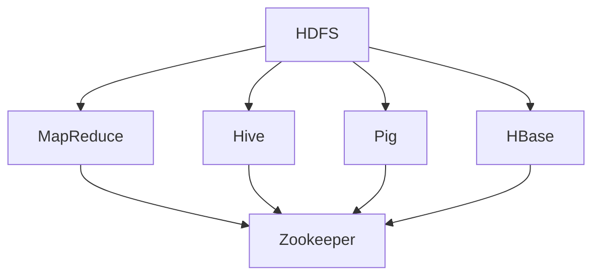

                 

## 1. 背景介绍

### 1.1 问题由来
随着互联网的快速发展和数据量的急剧增长，传统的单机数据处理方式已经无法满足日益复杂的数据存储和处理需求。为了应对这一挑战，2006年，雅虎提出了Hadoop项目，目标是构建一个可以处理大规模数据集、高可用、可扩展的开源软件生态系统。自此，Hadoop成为大数据处理领域的翘楚，对数据科学、大数据工程等领域产生了深远的影响。

### 1.2 问题核心关键点
Hadoop生态系统主要包含两个核心组件：Hadoop Distributed File System (HDFS)和MapReduce计算框架，以及一系列工具和组件（如Hive、Pig、HBase等），它们共同构建了一个强大的数据处理和分析平台。Hadoop的核心思想是通过分布式计算和存储，将大规模数据处理任务分布到多台计算机上进行并行处理，从而提高数据处理的效率和可靠性。

### 1.3 问题研究意义
研究Hadoop生态系统，对于理解现代大数据处理框架的核心技术和实现原理，掌握大数据工程中的关键技术和方法，具有重要意义。具体而言：

1. 提升数据处理效率。Hadoop通过分布式存储和计算，可以在海量数据集上实现高效的数据处理。
2. 增强数据处理可靠性。Hadoop采用冗余存储和多节点容错机制，保证了数据处理的高可用性和容错性。
3. 促进数据共享和分析。Hadoop生态系统提供了丰富的数据访问和分析工具，支持数据共享和高级分析。
4. 推动数据科学发展。Hadoop为数据科学家提供了强大的数据分析和建模工具，推动了数据科学的进步。
5. 加速大数据工程落地。Hadoop为大数据工程提供了完善的解决方案，帮助企业快速构建高效、可靠的大数据处理平台。

## 2. 核心概念与联系

### 2.1 核心概念概述

为更好地理解Hadoop生态系统的核心概念，本节将介绍几个密切相关的核心概念：

- **Hadoop Distributed File System (HDFS)**：Hadoop的分布式文件系统，用于存储海量数据。它将数据切分为块，并分布在多台计算机上进行分布式存储，保证了数据的可靠性和高可用性。

- **MapReduce**：一种编程模型，用于在大规模数据集上实现并行计算。MapReduce通过将数据划分为多个分区，在多个节点上并行执行map和reduce操作，实现高效的分布式计算。

- **Hive**：基于Hadoop的数据仓库系统，提供SQL查询接口，支持复杂的数据操作和分析。

- **Pig**：一种高层次的数据流编程语言，提供 Pig Latin 语法，便于数据处理和分析。

- **HBase**：分布式键值数据库，基于Hadoop HDFS，支持大规模数据的随机读写操作。

- **Zookeeper**：Hadoop的协调服务，用于管理集群中的节点和服务，保证分布式系统的协调一致性。

这些核心概念之间的逻辑关系可以通过以下Mermaid流程图来展示：



这个流程图展示了大数据处理生态系统的核心组件及其关系：

1. HDFS作为数据存储组件，提供数据可靠性保障。
2. MapReduce作为计算组件，实现大规模数据并行处理。
3. Hive和Pig作为数据处理组件，提供数据操作接口和高效数据处理能力。
4. HBase作为数据库组件，提供高性能数据存储和访问。
5. Zookeeper作为集群管理组件，保证分布式系统的协调一致性。

这些组件共同构成了Hadoop生态系统的基本架构，使其能够高效、可靠地处理大规模数据集。

## 3. 核心算法原理 & 具体操作步骤

### 3.1 算法原理概述

Hadoop生态系统的核心算法原理主要涉及分布式文件存储、MapReduce计算模型以及集群管理三个方面。

#### 3.1.1 分布式文件存储原理
HDFS采用“主-从”架构，通过元数据管理节点Namenode和数据存储节点Datanode实现分布式文件存储。每个数据块被复制到多个Datanode上，并分布在不同的节点上，以实现数据冗余和容错。

#### 3.1.2 MapReduce计算模型原理
MapReduce模型将大规模数据集分成多个分区，在多个节点上并行执行map和reduce操作。map操作将输入数据转化为中间结果，reduce操作将中间结果进行聚合和合并。MapReduce通过优化数据局部性和任务调度，实现了高效的数据并行计算。

#### 3.1.3 集群管理原理
Hadoop使用Zookeeper作为集群管理服务，用于协调集群中的节点和服务，保证分布式系统的稳定性。Zookeeper通过分布式锁、节点监视等功能，实现集群中节点的协调一致性。

### 3.2 算法步骤详解

#### 3.2.1 数据存储
- 创建HDFS集群：安装Hadoop软件包，启动Hadoop守护进程。
- 配置HDFS参数：设置Namenode和Datanode的配置文件，包括数据块大小、复制因子等。
- 创建文件和目录：通过Hadoop CLI或HDFS Web UI上传文件和目录，分布在多个Datanode上。

#### 3.2.2 数据处理
- 编写MapReduce程序：使用Java或Pig编写Map和Reduce操作，实现数据处理逻辑。
- 提交任务：通过Hadoop CLI或Hadoop Web UI提交MapReduce任务。
- 监控任务进度：使用Hadoop Web UI监控任务进度，检查任务状态。

#### 3.2.3 集群管理
- 安装Zookeeper：安装并启动Zookeeper集群，确保集群正常运行。
- 配置Hadoop参数：设置Hadoop的Zookeeper参数，使其能够访问Zookeeper集群。
- 监控集群状态：使用Hadoop Web UI监控集群状态，检查节点健康和任务状态。

### 3.3 算法优缺点

Hadoop生态系统具有以下优点：
1. 高可扩展性：通过水平扩展节点，可以处理海量数据。
2. 高可靠性：通过数据冗余和容错机制，保证了数据的可靠性和高可用性。
3. 高效性：通过分布式计算和优化数据局部性，实现了高效的数据处理。
4. 开源免费：开源软件，可以免费使用，支持社区广泛协作。

同时，该方法也存在一定的局限性：
1. 学习曲线陡峭：需要掌握Hadoop生态系统的复杂架构和工具。
2. 处理小规模数据效率低下：对于小规模数据集，使用Hadoop可能会造成资源浪费。
3. 数据存储和访问方式单一：主要依赖HDFS和HBase，对于其他类型的数据处理需求支持不足。
4. 维护复杂：集群管理和调试需要专业知识。

### 3.4 算法应用领域

Hadoop生态系统广泛应用于多个领域，如：

- 数据仓库和数据湖：支持大规模数据的存储和分析，构建数据仓库和数据湖。
- 大规模数据处理：处理海量数据集，支持ETL、数据清洗、特征工程等。
- 大数据分析：提供丰富的数据分析工具和接口，支持统计分析、机器学习等。
- 日志分析：处理和分析大量日志数据，支持实时监控和告警。
- 批处理计算：提供高效的大规模批处理计算能力，支持各种复杂的计算任务。

除了上述这些经典应用外，Hadoop还被创新性地应用到更多场景中，如数据挖掘、社交网络分析、智能推荐等，为大数据处理带来了新的突破。

## 4. 数学模型和公式 & 详细讲解  
### 4.1 数学模型构建

在Hadoop生态系统中，数学模型主要用于MapReduce计算模型的构建。假设有大规模数据集 $D$ 和函数 $f$，MapReduce计算模型的数学模型可以表示为：

$$
f(D) = \{map(d) \mid d \in D\} \rightarrow \{reduce(map(d_1), map(d_2), ..., map(d_n)) \mid d_1, d_2, ..., d_n \in D\}
$$

其中，$map$ 操作将输入数据 $d$ 转化为中间结果，$reduce$ 操作将中间结果进行聚合和合并。

### 4.2 公式推导过程

以一个简单的Word Count为例，推导MapReduce计算模型的公式。假设有文本文件 $text\_data$，需要统计其中每个单词的出现次数。

**Map操作**：
- 将文本文件 $text\_data$ 分割为单词列表 $word\_list$。
- 对每个单词 $w$ 统计出现次数 $count$。

**Reduce操作**：
- 对所有单词和其出现次数 $(w, count)$ 进行聚合，得到每个单词的总出现次数 $count_w$。

因此，MapReduce计算模型的数学公式可以表示为：

$$
count_w = \sum_{i=1}^{n} count_{w_i}
$$

其中 $w_i$ 为单词，$n$ 为单词数量。

### 4.3 案例分析与讲解

假设我们有一个包含1亿条用户行为的日志文件，需要统计每种行为出现的次数。我们可以使用Hadoop进行MapReduce计算：

- **Map操作**：每个Map节点负责处理1000万条记录，统计每种行为的出现次数，并将结果以 $<K, V> = {(行为ID, 出现次数)}$ 的形式输出。
- **Shuffle和Reduce操作**：将Map节点输出的结果进行Shuffle操作，按行为ID进行排序，然后交给Reduce节点进行聚合计算，统计每种行为的总出现次数。

通过MapReduce计算模型，我们可以高效、可靠地处理大规模数据集，实现复杂的数据分析和统计任务。

## 5. 项目实践：代码实例和详细解释说明

### 5.1 开发环境搭建

在进行Hadoop项目实践前，我们需要准备好开发环境。以下是使用Hadoop开发的环境配置流程：

1. 安装Java环境：从Oracle官网下载并安装Java JDK，确保Java环境正确配置。
2. 安装Hadoop：从Hadoop官网下载并安装Hadoop软件包，确保Hadoop环境正确配置。
3. 启动Hadoop集群：启动Namenode、Datanode和Zookeeper等守护进程，确保集群正常运行。
4. 配置Hadoop参数：设置Hadoop的配置文件，包括Namenode、Datanode、YARN等参数。

完成上述步骤后，即可在Hadoop集群上开始项目实践。

### 5.2 源代码详细实现

下面以Hadoop MapReduce计算为例，给出使用Hadoop进行Word Count计算的PyTorch代码实现。

```python
from mrjob.job import MRJob
import re

class MRWordCount(MRJob):

    def mapper(self, _, line):
        words = re.findall(r'\b\w+\b', line)
        yield (word, 1) for word in words

    def reducer(self, word, counts):
        yield (word, sum(counts))

if __name__ == '__main__':
    MRWordCount.run()
```

### 5.3 代码解读与分析

让我们再详细解读一下关键代码的实现细节：

**MRWordCount类**：
- `mapper`方法：接收一行日志数据，使用正则表达式提取单词，并输出每个单词及其出现次数。
- `reducer`方法：接收多个单词和其出现次数，进行聚合计算，输出每个单词的总出现次数。

**Hadoop环境搭建**：
- 使用Maven项目搭建Hadoop环境，通过`mrjob`包实现MapReduce任务。
- 使用正则表达式库`re`提取单词，并使用`yield`语句输出中间结果。
- 使用`reducer`方法对中间结果进行聚合计算，并使用`yield`语句输出最终结果。

通过上述代码，我们可以看到Hadoop MapReduce计算的基本实现方式：

1. Mapper函数将输入数据转换为中间结果，并输出结果。
2. Reducer函数接收多个中间结果，进行聚合计算，并输出最终结果。
3. Hadoop集群负责任务调度和节点管理，保证分布式计算的高效性和可靠性。

当然，实际开发中还需要考虑更多因素，如数据分割、任务调度、集群监控等，但核心的MapReduce计算模型基本与此类似。

## 6. 实际应用场景

### 6.1 大数据仓库

在数据仓库构建中，Hadoop作为分布式文件存储和计算平台，提供了高效、可靠的数据处理能力。企业可以使用Hadoop存储大量历史数据和日志数据，构建数据仓库，支持复杂的数据查询和分析。

### 6.2 实时数据处理

Hadoop的实时数据处理能力较差，但结合Apache Storm等流处理工具，可以实现实时数据处理和分析。例如，可以对实时生成的用户行为数据进行流式处理，实现实时监控和告警。

### 6.3 机器学习和深度学习

Hadoop生态系统提供了丰富的数据分析和处理工具，如Hive、Pig等，可以支持机器学习和深度学习任务的数据预处理和特征工程。企业可以在Hadoop集群上构建机器学习平台，支持各类机器学习算法和模型训练。

### 6.4 未来应用展望

未来，Hadoop生态系统将进一步发展，支持更多先进技术：

1. 云原生支持：Hadoop将更加深入地与云平台集成，提供更高效、更灵活的云原生解决方案。
2. 数据湖构建：支持更丰富的数据存储格式和处理方式，构建数据湖，支持全生命周期的数据管理和分析。
3. 人工智能融合：支持AI算法和模型训练，推动大数据与人工智能的深度融合。
4. 边缘计算支持：支持边缘计算架构，实现数据就近处理和分析，提高处理效率和响应速度。
5. 多平台集成：支持更多开源技术和工具的集成，提供更丰富的数据处理和分析能力。

以上趋势凸显了Hadoop生态系统的广阔前景，这些方向的探索发展，必将进一步提升Hadoop在数据处理和分析领域的地位，为更多企业带来价值。

## 7. 工具和资源推荐

### 7.1 学习资源推荐

为了帮助开发者系统掌握Hadoop生态系统的核心技术和实现原理，这里推荐一些优质的学习资源：

1. Hadoop官方文档：Hadoop官方网站提供详细的文档和教程，是学习Hadoop的必备资料。
2. Hadoop实战指南：一本实战性的Hadoop入门书籍，结合真实案例，介绍Hadoop的部署、配置和使用。
3. Hadoop生态系统课程：Coursera等在线平台提供的Hadoop课程，涵盖Hadoop生态系统的核心概念和实践技巧。
4. Hadoop生态系统博客：Hadoop社区和各大企业的博客文章，提供丰富的Hadoop实战经验和分享。
5. Hadoop开源项目：如Hadoop、Hive、Pig等项目的官方文档和源代码，是深入理解Hadoop生态系统的重要途径。

通过对这些资源的学习实践，相信你一定能够快速掌握Hadoop生态系统的精髓，并用于解决实际的数据处理和分析问题。

### 7.2 开发工具推荐

高效的开发离不开优秀的工具支持。以下是几款用于Hadoop开发常用的工具：

1. Eclipse：一个开源的集成开发环境，支持Hadoop的开发和调试。
2. IntelliJ IDEA：另一个流行的IDE，支持Hadoop的开发和调试。
3. Hadoop CLI：Hadoop的命令行工具，用于集群管理和任务提交。
4. Hadoop Web UI：Hadoop的Web界面，用于集群监控和任务管理。
5. Jupyter Notebook：一个强大的交互式开发环境，支持Hadoop的交互式开发和数据分析。

合理利用这些工具，可以显著提升Hadoop项目的开发效率，加快创新迭代的步伐。

### 7.3 相关论文推荐

Hadoop生态系统的发展源于学界的持续研究。以下是几篇奠基性的相关论文，推荐阅读：

1. MapReduce: Simplified Data Processing on Large Clusters：谷歌的MapReduce论文，首次提出了分布式计算模型，为Hadoop奠定了基础。
2. Hadoop: A Distributed File System：雅虎的HDFS论文，提出了分布式文件系统HDFS，为Hadoop提供了数据存储和管理的支持。
3. The Hadoop Distributed File System（HDFS）：雅虎的HDFS论文，详细介绍了HDFS的架构和实现原理。
4. Practical Lessons in Hadoop Administration and Use：一本实战性的Hadoop书籍，结合真实案例，介绍Hadoop的部署、配置和使用。
5. Hadoop生态系统研究综述：一篇综述性论文，总结了Hadoop生态系统的核心技术和最新发展方向。

这些论文代表了大数据处理领域的研究进展，通过学习这些前沿成果，可以帮助研究者把握学科前进方向，激发更多的创新灵感。

## 8. 总结：未来发展趋势与挑战

### 8.1 总结

本文对Hadoop生态系统的核心技术和实现原理进行了全面系统的介绍。首先阐述了Hadoop生态系统的研究背景和意义，明确了Hadoop在分布式数据处理中的核心价值。其次，从原理到实践，详细讲解了Hadoop的分布式文件存储、MapReduce计算模型以及集群管理等核心算法原理和操作步骤，给出了Hadoop项目开发的完整代码实例。同时，本文还广泛探讨了Hadoop在数据仓库、实时数据处理、机器学习和深度学习等多个领域的应用前景，展示了Hadoop生态系统的强大能力。此外，本文精选了Hadoop生态系统的各类学习资源，力求为读者提供全方位的技术指引。

通过本文的系统梳理，可以看到，Hadoop生态系统在大数据处理领域具有重要的地位，其分布式计算和存储能力，为大规模数据处理提供了可靠的解决方案。未来，伴随技术的不断进步，Hadoop生态系统必将在数据科学、大数据工程等领域发挥更大的作用。

### 8.2 未来发展趋势

展望未来，Hadoop生态系统将呈现以下几个发展趋势：

1. 云原生支持：Hadoop将更加深入地与云平台集成，提供更高效、更灵活的云原生解决方案。
2. 数据湖构建：支持更丰富的数据存储格式和处理方式，构建数据湖，支持全生命周期的数据管理和分析。
3. 人工智能融合：支持AI算法和模型训练，推动大数据与人工智能的深度融合。
4. 边缘计算支持：支持边缘计算架构，实现数据就近处理和分析，提高处理效率和响应速度。
5. 多平台集成：支持更多开源技术和工具的集成，提供更丰富的数据处理和分析能力。

以上趋势凸显了Hadoop生态系统的广阔前景，这些方向的探索发展，必将进一步提升Hadoop在数据处理和分析领域的地位，为更多企业带来价值。

### 8.3 面临的挑战

尽管Hadoop生态系统已经取得了瞩目成就，但在迈向更加智能化、普适化应用的过程中，它仍面临着诸多挑战：

1. 学习曲线陡峭：Hadoop生态系统架构复杂，需要掌握大量知识和技能。
2. 处理小规模数据效率低下：Hadoop集群的管理和维护成本较高。
3. 数据存储和访问方式单一：主要依赖HDFS和HBase，对于其他类型的数据处理需求支持不足。
4. 维护复杂：集群管理和调试需要专业知识。
5. 数据安全性：集群管理和调试需要专业知识。

### 8.4 研究展望

面对Hadoop生态系统所面临的挑战，未来的研究需要在以下几个方面寻求新的突破：

1. 简化架构：开发更加易于使用的Hadoop生态系统，减少学习曲线。
2. 优化性能：改进数据存储和访问方式，提高数据处理效率。
3. 增加支持：增加对其他数据处理和存储方式的兼容性和支持。
4. 自动化管理：开发自动化的集群管理和监控工具，降低维护成本。
5. 安全性和隐私：加强数据安全和隐私保护，确保集群的安全性。

这些研究方向和探索，必将引领Hadoop生态系统迈向更高的台阶，为大数据处理和分析带来新的突破。面向未来，Hadoop生态系统还需要与其他大数据处理技术和框架进行更深入的融合，多路径协同发力，共同推动大数据处理和分析技术的进步。只有勇于创新、敢于突破，才能不断拓展Hadoop生态系统的边界，让大数据处理技术更好地服务于社会。

## 9. 附录：常见问题与解答

**Q1：Hadoop与Hive、Pig、HBase等工具有什么区别？**

A: Hadoop作为Hadoop生态系统的核心，提供了分布式文件存储和计算能力。而Hive、Pig和HBase是建立在Hadoop之上的工具，分别用于数据仓库、流处理和数据库管理。它们都依赖Hadoop的分布式架构，但各有侧重点，可以相互配合，共同构建高效的数据处理和分析平台。

**Q2：Hadoop的集群管理有哪些关键组件？**

A: Hadoop的集群管理主要由Namenode、Datanode和Zookeeper三个组件构成。Namenode负责元数据的存储和管理，Datanode负责数据的存储和访问，Zookeeper负责集群中节点的协调一致性。这三个组件协同工作，保证了Hadoop集群的稳定性和可靠性。

**Q3：Hadoop如何实现数据容错？**

A: Hadoop通过数据冗余和备份机制实现数据容错。每个数据块被复制到多个Datanode上，每个Datanode保存的数据块副本数可以根据实际需求进行调整。当某个Datanode故障时，可以通过备份数据恢复数据的完整性，确保数据处理的可靠性和可用性。

**Q4：Hadoop的实时数据处理能力如何？**

A: Hadoop的实时数据处理能力较差，主要依赖批处理计算。但结合Apache Storm等流处理工具，可以实现实时数据处理和分析。Storm提供了低延迟、高吞吐量的流处理能力，与Hadoop配合使用，可以实现高性能的实时数据处理。

**Q5：如何优化Hadoop的性能？**

A: 优化Hadoop性能可以从以下几个方面入手：
1. 数据分割：合理地分割数据，使用压缩算法减少数据传输和存储成本。
2. 数据本地化：尽量将数据存储在本地节点上，减少数据传输时间和网络带宽占用。
3. 硬件优化：使用高效的硬件设备，如SSD、GPU等，提高数据处理速度。
4. 优化算法：优化MapReduce计算模型，减少数据传输和计算量。

这些优化措施可以显著提升Hadoop的性能和效率，满足更复杂的数据处理需求。

**Q6：Hadoop的未来发展方向是什么？**

A: Hadoop的未来发展方向包括：
1. 云原生支持：深度集成云平台，提供更高效、更灵活的云原生解决方案。
2. 数据湖构建：支持更丰富的数据存储格式和处理方式，构建数据湖，支持全生命周期的数据管理和分析。
3. 人工智能融合：支持AI算法和模型训练，推动大数据与人工智能的深度融合。
4. 边缘计算支持：支持边缘计算架构，实现数据就近处理和分析，提高处理效率和响应速度。
5. 多平台集成：支持更多开源技术和工具的集成，提供更丰富的数据处理和分析能力。

这些方向凸显了Hadoop生态系统的广阔前景，推动Hadoop在数据科学、大数据工程等领域发挥更大的作用。

---

作者：禅与计算机程序设计艺术 / Zen and the Art of Computer Programming

