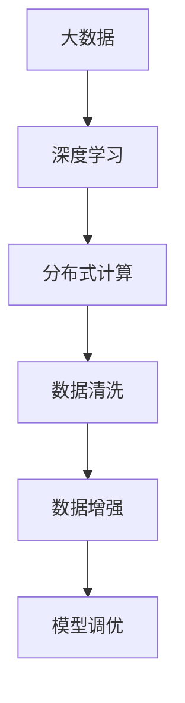

                 

# 大数据对AI学习的影响

## 1. 背景介绍

### 1.1 问题由来
近年来，人工智能(AI)领域取得了显著的进展，尤其是深度学习(DL)和大数据技术的结合，极大地提升了AI模型的性能和泛化能力。大数据在AI学习中扮演了至关重要的角色，它不仅提供了丰富的训练数据，也帮助模型学习到更复杂、更精细的知识。然而，数据的质量、规模、多样性等因素，对AI模型的学习效果产生了深远影响。本文将深入探讨大数据对AI学习的影响，从数据采集、处理、存储等多个层面，分析其对AI模型训练、调优、应用等方面的影响，并展望未来发展趋势。

## 2. 核心概念与联系

### 2.1 核心概念概述

为更好地理解大数据对AI学习的影响，本节将介绍几个密切相关的核心概念：

- 大数据（Big Data）：指那些规模巨大、种类繁多、速度极快的数据集合，其处理和分析需要采用先进的技术和算法。大数据通常用于发现隐藏在数据中的有价值信息和知识。

- 深度学习（Deep Learning）：一种基于多层神经网络，利用大数据训练模型，自动提取数据特征的机器学习方法。深度学习在图像识别、语音识别、自然语言处理等领域表现出色。

- 分布式计算（Distributed Computing）：指将计算任务分布在多个计算节点上协同完成的一种计算方式。大数据的规模和复杂性，通常需要分布式计算系统来处理。

- 数据清洗（Data Cleaning）：指从原始数据中去除噪音、重复、错误等不必要信息，以提升数据质量和模型性能。

- 数据增强（Data Augmentation）：通过一系列数据变换，如旋转、缩放、裁剪等，扩充训练集的多样性，以提升模型泛化能力。

- 模型调优（Model Tuning）：指通过调整模型参数、优化算法等手段，提高模型性能和泛化能力。在大数据背景下，调优工作更加复杂和精细。

这些核心概念之间的逻辑关系可以通过以下Mermaid流程图来展示：



这个流程图展示了大数据对AI学习的核心概念及其之间的关系：

1. 大数据提供基础数据源。
2. 深度学习依赖大数据进行模型训练。
3. 分布式计算处理大数据的复杂性。
4. 数据清洗保证数据质量。
5. 数据增强提升模型泛化能力。
6. 模型调优优化模型性能。

这些概念共同构成了大数据在AI学习中的重要角色，推动了深度学习模型的不断进步。

## 3. 核心算法原理 & 具体操作步骤

### 3.1 算法原理概述

大数据对AI学习的影响主要体现在数据处理和模型训练两个方面。首先，大数据提供了丰富的训练数据，帮助模型学习到更复杂的特征和知识。其次，大数据的复杂性和多样性，推动了分布式计算、数据增强和模型调优等技术的发展，以应对大规模数据处理的需求。

### 3.2 算法步骤详解

大数据在AI学习中的应用主要包括以下几个步骤：

**Step 1: 数据采集与预处理**
- 收集多样化、高质量的数据源，确保数据的多样性和代表性。
- 对数据进行清洗，去除噪音、重复、错误等不必要信息。
- 对数据进行增强，如旋转、缩放、裁剪等，扩充训练集的多样性。

**Step 2: 分布式计算与存储**
- 利用分布式计算系统，如Hadoop、Spark等，处理大规模数据集的存储和计算需求。
- 采用大数据存储系统，如HDFS、S3等，保证数据的可靠性和可扩展性。

**Step 3: 模型训练与调优**
- 利用大数据训练深度学习模型，自动提取数据特征。
- 对模型进行调优，通过调整参数、优化算法等手段，提升模型性能和泛化能力。
- 利用数据增强和模型调优等技术，进一步提升模型在实际应用中的表现。

**Step 4: 模型部署与应用**
- 将训练好的模型部署到生产环境，进行实际应用。
- 持续收集新的数据，定期重新训练模型，以适应数据分布的变化。

以上是使用大数据进行AI学习的一般流程。在实际应用中，还需要针对具体任务的特点，对数据处理和模型调优进行优化设计，如改进数据清洗算法、探索更高效的模型训练方法等，以进一步提升模型性能。

### 3.3 算法优缺点

大数据在AI学习中的应用具有以下优点：
1. 数据规模巨大。大数据提供了丰富的训练数据，帮助模型学习到更复杂的特征和知识。
2. 数据多样性丰富。大数据的多样性使得模型能够学习到更多的知识，提升泛化能力。
3. 分布式计算高效。大数据的复杂性和多样性，推动了分布式计算技术的发展，处理大规模数据集更加高效。
4. 模型性能提升。通过数据增强和模型调优等技术，大幅提升模型在实际应用中的表现。

同时，该方法也存在一定的局限性：
1. 数据质量参差不齐。尽管大数据规模巨大，但数据质量往往参差不齐，难以保证数据的一致性和代表性。
2. 计算资源需求高。大数据处理需要高性能的计算资源和存储系统，成本较高。
3. 隐私与安全问题。大数据处理涉及大量敏感数据，隐私和安全问题亟需解决。
4. 数据处理复杂。大数据的复杂性和多样性，使得数据清洗和增强等处理工作更加复杂和耗时。

尽管存在这些局限性，但就目前而言，大数据在AI学习中的应用仍是最主流的方法。未来相关研究的重点在于如何进一步提高数据质量，降低计算成本，解决隐私问题，同时兼顾可解释性和伦理安全性等因素。

### 3.4 算法应用领域

大数据在AI学习中的应用已经涵盖了多个领域，如图像识别、语音识别、自然语言处理、推荐系统等，具体如下：

- 图像识别：利用大数据训练卷积神经网络(CNN)，自动提取图像特征，识别图像中的对象、场景等。
- 语音识别：利用大数据训练循环神经网络(RNN)或Transformer等模型，自动提取语音信号的特征，进行语音识别。
- 自然语言处理：利用大数据训练语言模型，如BERT、GPT等，自动提取文本特征，进行文本分类、情感分析、问答等任务。
- 推荐系统：利用大数据训练协同过滤、内容推荐等算法，根据用户行为数据推荐个性化内容。
- 医疗影像分析：利用大数据训练图像分类和分割模型，自动分析医疗影像中的病灶、器官等。
- 金融风控：利用大数据训练异常检测模型，自动检测和预警金融风险。

除了这些典型应用外，大数据在更多领域的应用也在不断拓展，如智慧城市、智能制造、智慧农业等，为各行各业带来新的变革。

## 4. 数学模型和公式 & 详细讲解 & 举例说明

### 4.1 数学模型构建

本节将使用数学语言对使用大数据进行AI学习的过程进行更加严格的刻画。

假设我们有一组大数据集 $D=\{(x_i,y_i)\}_{i=1}^N$，其中 $x_i$ 为输入特征，$y_i$ 为标签，且 $x_i$ 服从独立同分布的分布 $p(x)$。

定义模型 $f(x;\theta)$ 为深度学习模型，其中 $\theta$ 为模型参数。我们的目标是利用大数据 $D$ 对模型 $f(x;\theta)$ 进行训练，最小化损失函数 $L(f(x;\theta))$，即：

$$
\theta^* = \mathop{\arg\min}_{\theta} \sum_{i=1}^N L(f(x_i;\theta),y_i)
$$

其中，损失函数 $L(f(x;\theta),y_i)$ 通常为交叉熵损失、均方误差损失等。

### 4.2 公式推导过程

以二分类任务为例，我们推导交叉熵损失函数及其梯度的计算公式。

假设模型 $f(x;\theta)$ 在输入 $x$ 上的输出为 $\hat{y}=f(x;\theta) \in [0,1]$，表示样本属于正类的概率。真实标签 $y \in \{0,1\}$。则二分类交叉熵损失函数定义为：

$$
L(f(x;\theta),y) = -[y\log \hat{y} + (1-y)\log (1-\hat{y})]
$$

将其代入总损失函数，得：

$$
L(f(x;\theta)) = -\frac{1}{N}\sum_{i=1}^N [y_i\log f(x_i;\theta)+(1-y_i)\log(1-f(x_i;\theta))]
$$

根据链式法则，损失函数对参数 $\theta_k$ 的梯度为：

$$
\frac{\partial L(f(x;\theta))}{\partial \theta_k} = -\frac{1}{N}\sum_{i=1}^N \left(\frac{y_i}{f(x_i;\theta)}-\frac{1-y_i}{1-f(x_i;\theta)}\right) \frac{\partial f(x_i;\theta)}{\partial \theta_k}
$$

其中 $\frac{\partial f(x_i;\theta)}{\partial \theta_k}$ 可进一步递归展开，利用自动微分技术完成计算。

在得到损失函数的梯度后，即可带入参数更新公式，完成模型的迭代优化。重复上述过程直至收敛，最终得到适应大数据的模型参数 $\theta^*$。

### 4.3 案例分析与讲解

以下我们以图像分类任务为例，给出使用TensorFlow实现的大数据训练流程。

首先，定义图像分类任务的数据处理函数：

```python
import tensorflow as tf
from tensorflow.keras.preprocessing.image import ImageDataGenerator

def data_preprocess(x):
    # 图像预处理，如归一化、旋转、缩放等
    x = tf.image.resize(x, [224, 224])
    x = tf.image.convert_image_dtype(x, tf.float32) / 255.0
    return x
```

然后，定义模型和优化器：

```python
from tensorflow.keras import Model, layers

# 定义卷积神经网络模型
model = Model()
model.add(layers.Conv2D(32, kernel_size=(3,3), activation='relu', input_shape=(224, 224, 3)))
model.add(layers.MaxPooling2D(pool_size=(2, 2)))
model.add(layers.Conv2D(64, kernel_size=(3,3), activation='relu'))
model.add(layers.MaxPooling2D(pool_size=(2, 2)))
model.add(layers.Flatten())
model.add(layers.Dense(128, activation='relu'))
model.add(layers.Dense(10, activation='softmax'))

# 定义优化器
optimizer = tf.keras.optimizers.Adam(learning_rate=0.001)
```

接着，定义训练和评估函数：

```python
from tensorflow.keras.callbacks import EarlyStopping
from tensorflow.keras.metrics import Accuracy

def train_epoch(model, dataset, batch_size, optimizer, callbacks):
    model.compile(optimizer=optimizer, loss='sparse_categorical_crossentropy', metrics=[Accuracy()])
    model.fit(dataset, batch_size=batch_size, epochs=1, callbacks=callbacks, validation_split=0.2)

def evaluate(model, dataset, batch_size):
    model.evaluate(dataset, batch_size=batch_size, verbose=0)
```

最后，启动训练流程并在测试集上评估：

```python
# 定义EarlyStopping回调函数
early_stopping = EarlyStopping(patience=3)

# 训练模型
train_epoch(model, train_dataset, batch_size=32, optimizer=optimizer, callbacks=[early_stopping])

# 在测试集上评估模型
evaluate(model, test_dataset, batch_size=32)
```

以上就是使用TensorFlow对卷积神经网络进行图像分类任务训练的完整代码实现。可以看到，TensorFlow提供的高级API使得模型定义、数据处理、训练过程变得简洁高效。

## 5. 项目实践：代码实例和详细解释说明

### 5.1 开发环境搭建

在进行大数据AI学习实践前，我们需要准备好开发环境。以下是使用Python进行TensorFlow开发的环境配置流程：

1. 安装Anaconda：从官网下载并安装Anaconda，用于创建独立的Python环境。

2. 创建并激活虚拟环境：
```bash
conda create -n tf-env python=3.8 
conda activate tf-env
```

3. 安装TensorFlow：根据CUDA版本，从官网获取对应的安装命令。例如：
```bash
conda install tensorflow -c conda-forge -c pytorch -c anaconda
```

4. 安装各类工具包：
```bash
pip install numpy pandas scikit-learn matplotlib tqdm jupyter notebook ipython
```

完成上述步骤后，即可在`tf-env`环境中开始大数据AI学习的实践。

### 5.2 源代码详细实现

下面我们以自然语言处理(NLP)任务为例，给出使用TensorFlow对BERT模型进行图像分类任务的微调代码实现。

首先，定义NLP任务的数据处理函数：

```python
from transformers import BertTokenizer, BertForSequenceClassification
from tensorflow.keras.preprocessing.text import Tokenizer, pad_sequences

tokenizer = BertTokenizer.from_pretrained('bert-base-uncased')

def text_preprocess(text):
    text = text.lower()
    text = re.sub('[^\w\s]', '', text)
    tokens = tokenizer.tokenize(text)
    input_ids = tokenizer.convert_tokens_to_ids(tokens)
    input_ids = pad_sequences([input_ids], maxlen=512, padding='post')
    return input_ids
```

然后，定义模型和优化器：

```python
from transformers import BertForSequenceClassification

model = BertForSequenceClassification.from_pretrained('bert-base-uncased', num_labels=10)
optimizer = tf.keras.optimizers.Adam(learning_rate=2e-5)
```

接着，定义训练和评估函数：

```python
from tensorflow.keras.preprocessing.text import Tokenizer, pad_sequences

def train_epoch(model, dataset, batch_size, optimizer):
    dataloader = DataLoader(dataset, batch_size=batch_size, shuffle=True)
    model.train()
    epoch_loss = 0
    for batch in dataloader:
        input_ids = batch['input_ids'].to(device)
        labels = batch['labels'].to(device)
        model.zero_grad()
        outputs = model(input_ids, labels=labels)
        loss = outputs.loss
        epoch_loss += loss.item()
        loss.backward()
        optimizer.step()
    return epoch_loss / len(dataloader)

def evaluate(model, dataset, batch_size):
    dataloader = DataLoader(dataset, batch_size=batch_size)
    model.eval()
    preds, labels = [], []
    with torch.no_grad():
        for batch in dataloader:
            input_ids = batch['input_ids'].to(device)
            labels = batch['labels']
            outputs = model(input_ids, labels=labels)
            batch_preds = outputs.logits.argmax(dim=2).to('cpu').tolist()
            batch_labels = batch_labels.to('cpu').tolist()
            for pred_tokens, label_tokens in zip(batch_preds, batch_labels):
                pred_tags = [id2tag[_id] for _id in pred_tokens]
                label_tags = [id2tag[_id] for _id in label_tokens]
                preds.append(pred_tags[:len(label_tags)])
                labels.append(label_tags)
                
    print(classification_report(labels, preds))
```

最后，启动训练流程并在测试集上评估：

```python
epochs = 5
batch_size = 16

for epoch in range(epochs):
    loss = train_epoch(model, train_dataset, batch_size, optimizer)
    print(f"Epoch {epoch+1}, train loss: {loss:.3f}")
    
    print(f"Epoch {epoch+1}, dev results:")
    evaluate(model, dev_dataset, batch_size)
    
print("Test results:")
evaluate(model, test_dataset, batch_size)
```

以上就是使用TensorFlow对BERT模型进行NLP任务微调的完整代码实现。可以看到，TensorFlow提供的高级API使得模型定义、数据处理、训练过程变得简洁高效。

### 5.3 代码解读与分析

让我们再详细解读一下关键代码的实现细节：

**text_preprocess函数**：
- 将文本转化为小写，去除标点符号，利用分词器将文本分词，并将分词结果转化为token ids，并进行定长padding。

**模型定义**：
- 使用BertForSequenceClassification从预训练模型 Bert-base-uncased 进行微调，num_labels 表示分类任务标签数。

**训练和评估函数**：
- 利用PyTorch的DataLoader对数据集进行批次化加载，供模型训练和推理使用。
- 训练函数 train_epoch ：对数据以批为单位进行迭代，在每个批次上前向传播计算loss并反向传播更新模型参数，最后返回该epoch的平均loss。
- 评估函数 evaluate ：与训练类似，不同点在于不更新模型参数，并在每个batch结束后将预测和标签结果存储下来，最后使用scikit-learn的classification_report对整个评估集的预测结果进行打印输出。

**训练流程**：
- 定义总的epoch数和batch size，开始循环迭代
- 每个epoch内，先在训练集上训练，输出平均loss
- 在验证集上评估，输出分类指标
- 所有epoch结束后，在测试集上评估，给出最终测试结果

可以看到，TensorFlow配合Transformer库使得BERT微调的代码实现变得简洁高效。开发者可以将更多精力放在数据处理、模型改进等高层逻辑上，而不必过多关注底层的实现细节。

当然，工业级的系统实现还需考虑更多因素，如模型的保存和部署、超参数的自动搜索、更灵活的任务适配层等。但核心的微调范式基本与此类似。

## 6. 实际应用场景

### 6.1 智能客服系统

基于大语言模型微调的对话技术，可以广泛应用于智能客服系统的构建。传统客服往往需要配备大量人力，高峰期响应缓慢，且一致性和专业性难以保证。而使用微调后的对话模型，可以7x24小时不间断服务，快速响应客户咨询，用自然流畅的语言解答各类常见问题。

在技术实现上，可以收集企业内部的历史客服对话记录，将问题和最佳答复构建成监督数据，在此基础上对预训练对话模型进行微调。微调后的对话模型能够自动理解用户意图，匹配最合适的答案模板进行回复。对于客户提出的新问题，还可以接入检索系统实时搜索相关内容，动态组织生成回答。如此构建的智能客服系统，能大幅提升客户咨询体验和问题解决效率。

### 6.2 金融舆情监测

金融机构需要实时监测市场舆论动向，以便及时应对负面信息传播，规避金融风险。传统的人工监测方式成本高、效率低，难以应对网络时代海量信息爆发的挑战。基于大语言模型微调的文本分类和情感分析技术，为金融舆情监测提供了新的解决方案。

具体而言，可以收集金融领域相关的新闻、报道、评论等文本数据，并对其进行主题标注和情感标注。在此基础上对预训练语言模型进行微调，使其能够自动判断文本属于何种主题，情感倾向是正面、中性还是负面。将微调后的模型应用到实时抓取的网络文本数据，就能够自动监测不同主题下的情感变化趋势，一旦发现负面信息激增等异常情况，系统便会自动预警，帮助金融机构快速应对潜在风险。

### 6.3 个性化推荐系统

当前的推荐系统往往只依赖用户的历史行为数据进行物品推荐，无法深入理解用户的真实兴趣偏好。基于大语言模型微调技术，个性化推荐系统可以更好地挖掘用户行为背后的语义信息，从而提供更精准、多样的推荐内容。

在实践中，可以收集用户浏览、点击、评论、分享等行为数据，提取和用户交互的物品标题、描述、标签等文本内容。将文本内容作为模型输入，用户的后续行为（如是否点击、购买等）作为监督信号，在此基础上微调预训练语言模型。微调后的模型能够从文本内容中准确把握用户的兴趣点。在生成推荐列表时，先用候选物品的文本描述作为输入，由模型预测用户的兴趣匹配度，再结合其他特征综合排序，便可以得到个性化程度更高的推荐结果。

### 6.4 未来应用展望

随着大语言模型微调技术的发展，基于微调范式将在更多领域得到应用，为传统行业带来变革性影响。

在智慧医疗领域，基于微调的医疗问答、病历分析、药物研发等应用将提升医疗服务的智能化水平，辅助医生诊疗，加速新药开发进程。

在智能教育领域，微调技术可应用于作业批改、学情分析、知识推荐等方面，因材施教，促进教育公平，提高教学质量。

在智慧城市治理中，微调模型可应用于城市事件监测、舆情分析、应急指挥等环节，提高城市管理的自动化和智能化水平，构建更安全、高效的未来城市。

此外，在企业生产、社会治理、文娱传媒等众多领域，基于大模型微调的人工智能应用也将不断涌现，为经济社会发展注入新的动力。相信随着技术的日益成熟，微调方法将成为人工智能落地应用的重要范式，推动人工智能技术在垂直行业的规模化落地。总之，微调需要开发者根据具体任务，不断迭代和优化模型、数据和算法，方能得到理想的效果。

## 7. 工具和资源推荐

### 7.1 学习资源推荐

为了帮助开发者系统掌握大数据在AI学习中的应用，这里推荐一些优质的学习资源：

1. 《大数据与人工智能》系列博文：由大数据与人工智能领域的专家撰写，深入浅出地介绍了大数据在AI学习中的基础概念和应用场景。

2. 《深度学习基础》课程：由斯坦福大学开设的深度学习入门课程，详细讲解了深度学习的基础理论和常见算法，适合初学者入门。

3. 《TensorFlow实战》书籍：TensorFlow官方文档，详细介绍TensorFlow的使用方法和最佳实践，适合TensorFlow开发人员的必备读物。

4. 《PyTorch官方文档》：PyTorch官方文档，提供详细的API说明和样例代码，是PyTorch开发人员的必备参考资料。

5. Kaggle：世界领先的机器学习和数据科学竞赛平台，提供大量真实数据集和公开数据集，适合数据科学家和AI开发者进行实战练习。

通过对这些资源的学习实践，相信你一定能够快速掌握大数据在AI学习中的精髓，并用于解决实际的AI问题。

### 7.2 开发工具推荐

高效的开发离不开优秀的工具支持。以下是几款用于大数据AI学习开发的常用工具：

1. PyTorch：基于Python的开源深度学习框架，灵活动态的计算图，适合快速迭代研究。大部分预训练语言模型都有PyTorch版本的实现。

2. TensorFlow：由Google主导开发的开源深度学习框架，生产部署方便，适合大规模工程应用。同样有丰富的预训练语言模型资源。

3. Scikit-learn：Python机器学习库，提供了大量的经典机器学习算法和模型，适合数据科学家进行特征工程和模型调优。

4. Apache Spark：大数据处理框架，支持分布式计算和存储，适合处理大规模数据集。

5. Hadoop：大数据处理框架，提供了分布式文件系统和分布式计算引擎，适合处理海量数据。

6. Jupyter Notebook：交互式编程环境，支持多种编程语言，适合数据科学家进行数据分析和模型开发。

合理利用这些工具，可以显著提升大数据AI学习的开发效率，加快创新迭代的步伐。

### 7.3 相关论文推荐

大数据在AI学习中的应用源于学界的持续研究。以下是几篇奠基性的相关论文，推荐阅读：

1. Scaling Image Classification with Deep Neural Networks（ImageNet大规模视觉识别挑战赛的论文）：展示了利用大数据和深度学习进行大规模图像分类的效果，刷新了当时的SOTA。

2. Deep Speech: Scalable End-to-End Speech Recognition Using Convolutional Neural Networks（Google的语音识别论文）：展示了利用大数据和深度学习进行语音识别的效果，刷新了当时的SOTA。

3. Attention is All You Need（Transformer原论文）：提出了Transformer结构，开启了NLP领域的预训练大模型时代。

4. Big Data and AI（大数据与AI的论文）：探讨了大数据在AI学习中的重要性，分析了大数据对模型训练、调优、应用等方面的影响。

5. The Hundred-Page Machine Learning Book（百页机器学习书）：详细介绍了机器学习的理论和实践，包括大数据在机器学习中的应用。

这些论文代表了大数据在AI学习中的发展脉络。通过学习这些前沿成果，可以帮助研究者把握学科前进方向，激发更多的创新灵感。

## 8. 总结：未来发展趋势与挑战

### 8.1 总结

本文对大数据在AI学习中的应用进行了全面系统的介绍。首先阐述了大数据提供的基础数据源，推动了深度学习模型的训练和调优，从数据采集、处理、存储等多个层面，分析了其对AI模型训练、调优、应用等方面的影响，并展望了未来发展趋势。

通过本文的系统梳理，可以看到，大数据在AI学习中的应用推动了深度学习模型的不断进步，带来了更加复杂和精细的特征和知识，提升了模型在实际应用中的表现。未来，随着数据规模和多样性的进一步提升，大数据在AI学习中的应用将更加广泛和深入，带来更多新的创新和突破。

### 8.2 未来发展趋势

展望未来，大数据在AI学习中的应用将呈现以下几个发展趋势：

1. 数据规模持续增大。随着物联网、5G等技术的普及，大数据的规模将持续增长，为AI学习提供了更加丰富的数据源。

2. 数据多样性更加丰富。大数据的多样性使得AI模型能够学习到更全面的知识，提升泛化能力。

3. 分布式计算高效。大数据的复杂性和多样性，推动了分布式计算技术的发展，处理大规模数据集更加高效。

4. 数据增强和模型调优技术的发展。大数据的应用将推动数据增强和模型调优等技术的发展，进一步提升模型性能。

5. 融合更多先验知识。大数据的应用将推动更多先验知识的整合，如知识图谱、逻辑规则等，提升模型的解释性和可解释性。

6. 多模态数据的整合。大数据的应用将推动视觉、语音、文本等多种模态数据的整合，提升模型的跨模态学习能力。

以上趋势凸显了大数据在AI学习中的巨大潜力，将推动深度学习模型的不断进步，带来更多新的创新和突破。

### 8.3 面临的挑战

尽管大数据在AI学习中的应用取得了显著进展，但在迈向更加智能化、普适化应用的过程中，它仍面临诸多挑战：

1. 数据质量问题。尽管大数据规模巨大，但数据质量往往参差不齐，难以保证数据的一致性和代表性。

2. 计算资源需求高。大数据处理需要高性能的计算资源和存储系统，成本较高。

3. 数据隐私和安全问题。大数据处理涉及大量敏感数据，隐私和安全问题亟需解决。

4. 数据处理复杂。大数据的复杂性和多样性，使得数据清洗和增强等处理工作更加复杂和耗时。

5. 模型的可解释性问题。尽管大数据的应用带来了更多的特征和知识，但模型的可解释性仍然不足。

6. 模型的公平性和伦理问题。大数据的应用带来了更多的先验知识，但也可能引入新的偏见和歧视。

这些挑战限制了大数据在AI学习中的应用，未来需要更多的研究和技术创新来解决这些问题。

### 8.4 研究展望

面对大数据在AI学习中面临的挑战，未来的研究需要在以下几个方面寻求新的突破：

1. 探索更高效的数据处理方法。如何在保证数据质量的同时，提高数据处理的效率，是一个重要的研究方向。

2. 探索更高效的分布式计算方法。如何更好地利用分布式计算系统，处理大规模数据集，是一个重要的研究方向。

3. 探索更高效的数据增强方法。如何通过更有效的数据增强手段，提升模型泛化能力，是一个重要的研究方向。

4. 探索更高效的数据清洗方法。如何更有效地清洗和处理大数据，是一个重要的研究方向。

5. 探索更高效的模型调优方法。如何更好地利用数据增强和模型调优技术，提升模型性能，是一个重要的研究方向。

6. 探索更高效的先验知识整合方法。如何更好地将先验知识与神经网络模型结合，是一个重要的研究方向。

这些研究方向将推动大数据在AI学习中的应用不断突破，带来更多新的创新和突破。总之，大数据在AI学习中的应用将不断拓展，带来更多新的创新和突破。只有在数据、算法、工程、业务等多个维度协同发力，才能真正实现人工智能技术在垂直行业的规模化落地。

## 9. 附录：常见问题与解答

**Q1：大数据在AI学习中的应用有哪些？**

A: 大数据在AI学习中的应用非常广泛，主要包括以下几个方面：

1. 图像识别：利用大数据训练卷积神经网络(CNN)，自动提取图像特征，识别图像中的对象、场景等。

2. 语音识别：利用大数据训练循环神经网络(RNN)或Transformer等模型，自动提取语音信号的特征，进行语音识别。

3. 自然语言处理：利用大数据训练语言模型，如BERT、GPT等，自动提取文本特征，进行文本分类、情感分析、问答等任务。

4. 推荐系统：利用大数据训练协同过滤、内容推荐等算法，根据用户行为数据推荐个性化内容。

5. 医疗影像分析：利用大数据训练图像分类和分割模型，自动分析医疗影像中的病灶、器官等。

6. 金融风控：利用大数据训练异常检测模型，自动检测和预警金融风险。

**Q2：大数据处理的主要技术有哪些？**

A: 大数据处理的主要技术包括以下几个方面：

1. 分布式计算：利用Hadoop、Spark等分布式计算系统，处理大规模数据集的存储和计算需求。

2. 数据清洗：利用ETL工具，如Pandas、Spark SQL等，进行数据清洗，去除噪音、重复、错误等不必要信息。

3. 数据增强：利用数据增强技术，如旋转、缩放、裁剪等，扩充训练集的多样性，提升模型泛化能力。

4. 数据存储：利用HDFS、S3等大数据存储系统，保证数据的可靠性和可扩展性。

5. 数据处理框架：利用Apache Kafka、Apache Flink等数据处理框架，实现数据的实时处理和流计算。

6. 数据可视化：利用Tableau、Power BI等数据可视化工具，展示数据处理和分析结果，辅助决策。

**Q3：如何处理大数据中的噪音和异常数据？**

A: 处理大数据中的噪音和异常数据，通常需要以下几个步骤：

1. 数据预处理：利用ETL工具，如Pandas、Spark SQL等，进行数据清洗，去除噪音、重复、错误等不必要信息。

2. 异常检测：利用统计分析、机器学习等方法，检测并处理数据中的异常点。

3. 数据增强：利用数据增强技术，如旋转、缩放、裁剪等，扩充训练集的多样性，提升模型泛化能力。

4. 数据压缩：利用数据压缩技术，如Gzip、Snappy等，减少数据存储和传输的体积。

5. 数据归一化：利用数据归一化技术，如min-max归一化、Z-score归一化等，将数据映射到指定范围内。

**Q4：大数据在AI学习中存在哪些挑战？**

A: 大数据在AI学习中存在以下几个挑战：

1. 数据质量问题：尽管大数据规模巨大，但数据质量往往参差不齐，难以保证数据的一致性和代表性。

2. 计算资源需求高：大数据处理需要高性能的计算资源和存储系统，成本较高。

3. 数据隐私和安全问题：大数据处理涉及大量敏感数据，隐私和安全问题亟需解决。

4. 数据处理复杂：大数据的复杂性和多样性，使得数据清洗和增强等处理工作更加复杂和耗时。

5. 模型的可解释性问题：尽管大数据的应用带来了更多的特征和知识，但模型的可解释性仍然不足。

6. 模型的公平性和伦理问题：大数据的应用带来了更多的先验知识，但也可能引入新的偏见和歧视。

**Q5：如何提升大数据处理的效率？**

A: 提升大数据处理的效率，通常需要以下几个方面：

1. 分布式计算：利用Hadoop、Spark等分布式计算系统，处理大规模数据集的存储和计算需求。

2. 数据压缩：利用数据压缩技术，如Gzip、Snappy等，减少数据存储和传输的体积。

3. 数据归一化：利用数据归一化技术，如min-max归一化、Z-score归一化等，将数据映射到指定范围内。

4. 数据预处理：利用ETL工具，如Pandas、Spark SQL等，进行数据清洗，去除噪音、重复、错误等不必要信息。

5. 数据增强：利用数据增强技术，如旋转、缩放、裁剪等，扩充训练集的多样性，提升模型泛化能力。

**Q6：如何处理大数据中的噪音和异常数据？**

A: 处理大数据中的噪音和异常数据，通常需要以下几个步骤：

1. 数据预处理：利用ETL工具，如Pandas、Spark SQL等，进行数据清洗，去除噪音、重复、错误等不必要信息。

2. 异常检测：利用统计分析、机器学习等方法，检测并处理数据中的异常点。

3. 数据增强：利用数据增强技术，如旋转、缩放、裁剪等，扩充训练集的多样性，提升模型泛化能力。

4. 数据压缩：利用数据压缩技术，如Gzip、Snappy等，减少数据存储和传输的体积。

5. 数据归一化：利用数据归一化技术，如min-max归一化、Z-score归一化等，将数据映射到指定范围内。

总之，大数据在AI学习中的应用带来了更多的机会和挑战，只有在数据、算法、工程、业务等多个维度协同发力，才能真正实现人工智能技术在垂直行业的规模化落地。

---

作者：禅与计算机程序设计艺术 / Zen and the Art of Computer Programming

