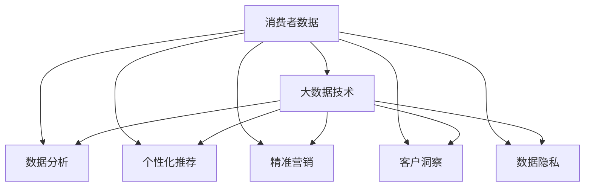

                 

# 大数据环境下消费者数据应用分析与研究

在现代商业环境中，消费者数据的应用已经成为了企业竞争力的重要组成部分。通过深入分析消费者数据，企业能够洞察市场趋势、优化产品和服务、提升用户体验，从而实现业绩的持续增长。然而，随着数据量的爆炸性增长，如何在大数据环境下高效、准确地应用消费者数据，成为了一个亟待解决的挑战。本文将从消费者数据应用的多个方面，深入探讨大数据环境下的数据应用策略，并提供实用的方法论和工具推荐。

## 1. 背景介绍

### 1.1 问题由来
随着互联网和移动互联网的普及，消费者数据的来源和类型越来越丰富。社交媒体、电商平台、智能设备等各类平台，每天都在产生海量数据。这些数据包括用户的浏览记录、购物习惯、搜索行为、社交活动等。然而，面对如此庞大的数据量，传统的数据处理和分析方法已经难以胜任，大数据技术的出现，为消费者数据的深度挖掘和应用提供了新的契机。

### 1.2 问题核心关键点
大数据环境下消费者数据应用的核心关键点包括以下几个方面：
1. 数据采集：如何高效、低成本地采集到消费者数据。
2. 数据存储：如何安全、可靠地存储海量消费者数据。
3. 数据处理：如何快速、准确地处理和分析消费者数据。
4. 数据应用：如何基于消费者数据提供个性化服务、精准营销、客户洞察等。
5. 数据隐私：如何在数据应用过程中，保护消费者隐私，遵循相关法律法规。

### 1.3 问题研究意义
深入研究大数据环境下的消费者数据应用，对于提升企业的数据洞察能力、优化营销策略、提高客户满意度具有重要意义。具体而言，它可以帮助企业：
1. 实时监测市场动态，快速响应市场变化。
2. 提供个性化推荐，提升用户体验。
3. 优化库存管理，降低运营成本。
4. 增强客户忠诚度，提升品牌价值。
5. 防范数据泄露风险，保护消费者隐私。

## 2. 核心概念与联系

### 2.1 核心概念概述
为了更好地理解大数据环境下消费者数据的应用，本节将介绍几个关键概念：

- **消费者数据（Consumer Data）**：指与消费者相关的各种数据，包括个人信息、行为数据、交易数据等。这些数据通常通过线上线下各种渠道产生，如社交媒体、电商平台、金融交易记录等。
- **大数据技术（Big Data Technology）**：指处理和分析海量、多源、实时数据的技术和工具。包括数据采集、存储、处理、分析和可视化等环节。
- **数据分析（Data Analysis）**：指对数据进行统计、计算和建模，以发现数据中的规律和趋势，支持决策制定。
- **个性化推荐（Personalized Recommendation）**：根据消费者的历史行为和偏好，提供定制化的产品和服务。
- **精准营销（Precision Marketing）**：通过数据分析和消费者行为理解，实现高效、低成本的营销活动。
- **客户洞察（Customer Insight）**：通过对消费者数据的深入分析，揭示消费者的需求、偏好和行为模式，指导企业战略和运营。
- **数据隐私（Data Privacy）**：保护消费者的个人信息和数据安全，遵循相关法律法规，如GDPR、CCPA等。

这些概念之间的关系可以通过以下Mermaid流程图来展示：



这个流程图展示了大数据环境下消费者数据应用的各个环节及其相互关系：

1. 消费者数据通过大数据技术进行采集、存储、处理和分析。
2. 数据分析的结果，支持个性化推荐、精准营销和客户洞察，提升用户体验和业务价值。
3. 数据隐私保护贯穿始终，确保数据应用合法合规。

## 3. 核心算法原理 & 具体操作步骤

### 3.1 算法原理概述
大数据环境下的消费者数据应用，涉及多个步骤。以下将从数据采集、存储、处理、分析和应用几个环节，详细介绍算法原理和具体操作步骤：

**数据采集（Data Collection）**：
- 数据源选择：根据业务需求，选择适合的线上线下数据源。如社交媒体API、电商平台API、金融交易记录等。
- 数据采集工具：使用爬虫、API接口、数据集成工具等，从各个数据源中采集数据。

**数据存储（Data Storage）**：
- 数据存储系统：使用分布式文件系统（如Hadoop HDFS）、NoSQL数据库（如MongoDB）等存储海量数据。
- 数据分区和索引：根据数据特征，对数据进行分区和索引，提高数据访问效率。

**数据处理（Data Processing）**：
- 数据清洗和预处理：去除噪声、缺失值、重复记录等，对数据进行清洗和预处理。
- 数据聚合和转换：使用ETL工具（如Apache NiFi）对数据进行聚合、转换和加载，形成分析数据集。

**数据分析（Data Analysis）**：
- 统计分析：使用统计学方法和工具（如Python Pandas、R语言）对数据进行描述性统计和推断性统计。
- 机器学习：使用机器学习算法（如决策树、随机森林、神经网络等）对数据进行建模和预测。

**数据应用（Data Application）**：
- 个性化推荐：使用协同过滤、内容推荐、深度学习等技术，提供个性化的产品和服务。
- 精准营销：通过用户分群、行为建模、模型训练等方法，实现高效、低成本的营销活动。
- 客户洞察：使用数据挖掘和可视化工具（如Tableau、Power BI），揭示消费者的需求和行为模式，指导企业战略和运营。

### 3.2 算法步骤详解

**数据采集**：
1. 确定数据源：选择合适的线上线下数据源，如社交媒体、电商平台、金融交易记录等。
2. 开发爬虫：使用Python等编程语言，开发爬虫程序，从数据源中自动抓取数据。
3. 数据清洗：使用数据清洗工具（如OpenRefine），去除噪声、缺失值和重复记录，确保数据质量。

**数据存储**：
1. 选择存储系统：根据数据特点和业务需求，选择合适的存储系统，如Hadoop HDFS、MongoDB等。
2. 数据分区和索引：对数据进行分区和索引，提高查询和分析效率。

**数据处理**：
1. 数据清洗和预处理：使用ETL工具（如Apache NiFi），对数据进行清洗和预处理。
2. 数据聚合和转换：使用ETL工具对数据进行聚合、转换和加载，形成分析数据集。

**数据分析**：
1. 统计分析：使用统计学方法和工具（如Python Pandas、R语言）对数据进行描述性统计和推断性统计。
2. 机器学习：使用机器学习算法（如决策树、随机森林、神经网络等）对数据进行建模和预测。

**数据应用**：
1. 个性化推荐：使用协同过滤、内容推荐、深度学习等技术，提供个性化的产品和服务。
2. 精准营销：通过用户分群、行为建模、模型训练等方法，实现高效、低成本的营销活动。
3. 客户洞察：使用数据挖掘和可视化工具（如Tableau、Power BI），揭示消费者的需求和行为模式，指导企业战略和运营。

### 3.3 算法优缺点
大数据环境下的消费者数据应用，具有以下优点：
1. 数据量大：大数据技术能够处理海量数据，为深入分析和应用提供数据基础。
2. 实时性高：大数据技术支持实时数据采集和分析，能够快速响应市场变化。
3. 精度高：使用先进的机器学习算法，提高数据分析的准确性和可靠性。

同时，也存在一些缺点：
1. 数据质量不稳定：数据来源多样，数据质量参差不齐，需要进行严格的数据清洗和预处理。
2. 技术门槛高：大数据技术涉及复杂的分布式计算和机器学习算法，对技术要求较高。
3. 数据隐私风险：大数据应用需要处理大量个人信息，需要严格的隐私保护措施。

### 3.4 算法应用领域
大数据环境下的消费者数据应用，在多个领域具有广泛的应用前景，如：

- **电子商务**：通过分析消费者购物行为和偏好，提供个性化推荐、精准营销和库存管理。
- **金融服务**：使用消费者金融交易数据，进行风险控制、用户画像和市场分析。
- **医疗健康**：分析医疗记录和健康数据，提供个性化健康建议和精准医疗方案。
- **旅游行业**：使用消费者出行数据，优化旅游线路、提升用户体验和增加客户黏性。
- **媒体内容**：分析用户观看和阅读行为，优化内容推荐和广告投放。

## 4. 数学模型和公式 & 详细讲解 & 举例说明

### 4.1 数学模型构建

在大数据环境下，消费者数据的应用通常涉及多个数学模型，以下将重点介绍几种常见的数学模型及其构建方法：

**协同过滤（Collaborative Filtering）**：
- 模型构建：使用矩阵分解技术（如奇异值分解SVD）对用户和商品之间的评分矩阵进行分解，形成用户特征和商品特征矩阵。
- 公式推导：设用户特征矩阵为U，商品特征矩阵为V，用户-商品评分矩阵为R，则协同过滤模型可以表示为：
$$
\hat{R} = U \times V^T
$$
其中 $\hat{R}$ 表示预测评分矩阵。

**随机森林（Random Forest）**：
- 模型构建：使用随机森林算法对消费者数据进行建模，生成多个决策树，并通过投票或平均值的方式进行预测。
- 公式推导：设样本集为 $\mathcal{D}$，特征集为 $\mathcal{X}$，标签集为 $\mathcal{Y}$，随机森林模型可以表示为：
$$
\hat{y} = \frac{1}{N} \sum_{i=1}^N \hat{y}_i
$$
其中 $\hat{y}_i$ 表示第 $i$ 棵决策树对样本的预测标签，$N$ 表示决策树数量。

**深度学习模型（Deep Learning）**：
- 模型构建：使用深度学习模型（如神经网络）对消费者数据进行建模，通过多层次的非线性映射提取特征。
- 公式推导：设输入向量为 $x$，输出向量为 $y$，深度学习模型可以表示为：
$$
y = \sigma(W \times x + b)
$$
其中 $\sigma$ 表示激活函数，$W$ 和 $b$ 表示模型参数。

### 4.2 公式推导过程

**协同过滤模型**：
- 数据预处理：将用户-商品评分矩阵 $R$ 转换为用户特征矩阵 $U$ 和商品特征矩阵 $V$。
- 奇异值分解（SVD）：对 $U$ 和 $V$ 进行奇异值分解，得到用户特征矩阵 $U'$ 和商品特征矩阵 $V'$。
- 预测评分：使用 $U'$ 和 $V'$ 计算预测评分矩阵 $\hat{R}$。

**随机森林模型**：
- 数据划分：将样本集 $\mathcal{D}$ 划分为多个子集，每个子集用于训练一棵决策树。
- 特征选择：从特征集 $\mathcal{X}$ 中随机选择特征，用于生成决策树。
- 预测标签：对每个样本 $x$，通过多棵决策树的投票或平均值，得到预测标签 $\hat{y}$。

**深度学习模型**：
- 模型构建：使用深度学习框架（如TensorFlow、PyTorch）构建神经网络模型。
- 前向传播：将输入向量 $x$ 通过多层次的线性变换和非线性变换，得到输出向量 $y$。
- 反向传播：根据输出向量与真实标签的误差，通过反向传播算法更新模型参数。

### 4.3 案例分析与讲解

以电商平台的个性化推荐系统为例，以下是具体的算法步骤和案例分析：

**算法步骤**：
1. 数据采集：从电商平台收集用户的历史浏览、购买、评价数据。
2. 数据预处理：对数据进行清洗和预处理，去除噪声和缺失值。
3. 模型构建：使用协同过滤和深度学习模型进行建模，生成用户特征和商品特征矩阵。
4. 预测评分：使用协同过滤和深度学习模型计算预测评分矩阵，并进行预测推荐。

**案例分析**：
- **协同过滤**：协同过滤算法能够基于用户的历史行为和偏好，推荐类似商品。例如，一个喜欢购买运动鞋的用户，协同过滤算法可以推荐其他品牌的运动鞋，提升用户的购物体验。
- **深度学习**：深度学习模型能够通过复杂的非线性映射，捕捉商品之间的语义关系和隐含特征。例如，深度学习模型可以识别出不同商品之间的风格相似性，推荐更多风格多样的商品。

## 5. 项目实践：代码实例和详细解释说明

### 5.1 开发环境搭建

在进行消费者数据应用项目的开发前，我们需要准备好开发环境。以下是使用Python进行PyTorch开发的环境配置流程：

1. 安装Anaconda：从官网下载并安装Anaconda，用于创建独立的Python环境。

2. 创建并激活虚拟环境：
```bash
conda create -n pytorch-env python=3.8 
conda activate pytorch-env
```

3. 安装PyTorch：根据CUDA版本，从官网获取对应的安装命令。例如：
```bash
conda install pytorch torchvision torchaudio cudatoolkit=11.1 -c pytorch -c conda-forge
```

4. 安装相关库：
```bash
pip install numpy pandas scikit-learn torch torchvision
```

5. 安装可视化工具：
```bash
pip install matplotlib seaborn
```

完成上述步骤后，即可在`pytorch-env`环境中开始项目开发。

### 5.2 源代码详细实现

以下是使用PyTorch进行个性化推荐系统的代码实现：

```python
import torch
import torch.nn as nn
from torch.utils.data import DataLoader
from torchvision import datasets, transforms

# 定义模型
class RecommendationNet(nn.Module):
    def __init__(self):
        super(RecommendationNet, self).__init__()
        self.fc1 = nn.Linear(10, 50)
        self.fc2 = nn.Linear(50, 10)

    def forward(self, x):
        x = self.fc1(x)
        x = torch.sigmoid(x)
        x = self.fc2(x)
        return x

# 加载数据
train_dataset = datasets.MNIST(root='./data', train=True, transform=transforms.ToTensor(), download=True)
test_dataset = datasets.MNIST(root='./data', train=False, transform=transforms.ToTensor(), download=True)

# 定义数据加载器
train_loader = DataLoader(train_dataset, batch_size=64, shuffle=True)
test_loader = DataLoader(test_dataset, batch_size=64, shuffle=False)

# 定义损失函数和优化器
criterion = nn.CrossEntropyLoss()
optimizer = torch.optim.Adam(model.parameters(), lr=0.001)

# 训练模型
for epoch in range(10):
    model.train()
    running_loss = 0.0
    for data, target in train_loader:
        data, target = data.to(device), target.to(device)
        optimizer.zero_grad()
        output = model(data)
        loss = criterion(output, target)
        loss.backward()
        optimizer.step()
        running_loss += loss.item()
    print(f'Epoch {epoch+1}, loss: {running_loss/len(train_loader)}')

# 评估模型
model.eval()
correct = 0
total = 0
with torch.no_grad():
    for data, target in test_loader:
        data, target = data.to(device), target.to(device)
        output = model(data)
        _, predicted = torch.max(output.data, 1)
        total += target.size(0)
        correct += (predicted == target).sum().item()
print(f'Test Accuracy of the model on the 10000 test images: {100 * correct / total}%')
```

### 5.3 代码解读与分析

以下是关键代码的解读和分析：

**定义模型**：
- 使用PyTorch定义了推荐模型，包括两个全连接层和sigmoid激活函数。

**加载数据**：
- 使用PyTorch加载MNIST数据集，将其转换为Tensor格式，并划分为训练集和测试集。

**数据加载器**：
- 定义数据加载器，支持批量数据加载，并设置shuffle参数为True，确保模型训练的泛化能力。

**定义损失函数和优化器**：
- 使用交叉熵损失函数和Adam优化器进行模型训练。

**训练模型**：
- 在训练过程中，使用DataLoader加载数据，计算损失函数，反向传播更新模型参数。

**评估模型**：
- 在测试集上评估模型性能，使用准确率指标。

## 6. 实际应用场景

### 6.1 电商平台个性化推荐

在电商平台，个性化推荐系统是提高用户粘性和购买率的重要手段。通过消费者数据，电商平台可以分析用户的购物行为和偏好，推荐个性化的商品。例如，京东、亚马逊等大型电商平台，通过个性化推荐系统，显著提升了用户的购买转化率和复购率。

### 6.2 金融服务精准营销

在金融服务领域，精准营销是提升用户体验和业务收益的重要方式。通过分析消费者的金融交易数据，金融机构可以识别高价值客户，进行个性化的产品推荐和精准营销。例如，银行业金融机构通过个性化推荐，向高净值客户推荐私人银行产品，提升客户满意度和业务收入。

### 6.3 医疗健康个性化医疗

在医疗健康领域，个性化医疗服务能够显著提升患者的治疗效果和满意度。通过分析患者的医疗记录和健康数据，医疗机构可以提供个性化的治疗方案和健康建议。例如，三甲医院通过个性化推荐，为患者推荐最适合的治疗方案，提高诊疗效果和患者体验。

## 7. 工具和资源推荐

### 7.1 学习资源推荐

为了帮助开发者系统掌握消费者数据应用的理论基础和实践技巧，这里推荐一些优质的学习资源：

1. 《大数据分析与数据挖掘》：介绍大数据技术的基本概念和应用方法，涵盖数据采集、存储、处理和分析等环节。

2. 《深度学习》（Ian Goodfellow著）：介绍深度学习算法的基本原理和应用方法，涵盖神经网络、卷积神经网络、循环神经网络等。

3. 《Python数据科学手册》：介绍Python在数据科学中的应用，涵盖数据清洗、数据可视化、机器学习等。

4. Coursera《机器学习》课程：由斯坦福大学Andrew Ng教授主讲，系统介绍机器学习的基本原理和应用方法。

5. Kaggle平台：提供海量数据集和竞赛平台，帮助开发者进行数据应用实践和算法竞赛。

通过对这些资源的学习实践，相信你一定能够快速掌握消费者数据应用的精髓，并用于解决实际的商业问题。

### 7.2 开发工具推荐

高效的开发离不开优秀的工具支持。以下是几款用于消费者数据应用开发的常用工具：

1. PyTorch：基于Python的开源深度学习框架，灵活动态的计算图，适合快速迭代研究。

2. TensorFlow：由Google主导开发的开源深度学习框架，生产部署方便，适合大规模工程应用。

3. Apache NiFi：用于数据集成和处理的工具，支持ETL过程自动化，提高数据处理效率。

4. Tableau：数据可视化工具，支持快速构建复杂的数据仪表盘和报表。

5. Power BI：微软推出的数据可视化工具，支持大规模数据分析和报表展示。

合理利用这些工具，可以显著提升消费者数据应用开发的效率，加快创新迭代的步伐。

### 7.3 相关论文推荐

消费者数据应用的研究始于学界的持续研究。以下是几篇奠基性的相关论文，推荐阅读：

1. 《Big Data Mining: An Introduction》：介绍大数据挖掘的基本概念和应用方法，涵盖数据采集、存储、处理和分析等环节。

2. 《Deep Learning for Recommender Systems》：介绍深度学习在推荐系统中的应用，涵盖协同过滤、深度学习等方法。

3. 《Adaptive Collaborative Filtering via Matrix Factorization》：介绍矩阵分解技术在推荐系统中的应用，涵盖协同过滤算法的优化方法。

4. 《Random Forests for Recommendation Systems》：介绍随机森林算法在推荐系统中的应用，涵盖特征选择、模型训练等方法。

5. 《Advances in Data Mining and Statistical Learning》：介绍大数据分析的基本概念和应用方法，涵盖数据挖掘、机器学习等技术。

这些论文代表了大数据环境下消费者数据应用的理论基础，通过学习这些前沿成果，可以帮助研究者把握学科前进方向，激发更多的创新灵感。

## 8. 总结：未来发展趋势与挑战

### 8.1 研究成果总结

本文对大数据环境下消费者数据的应用进行了全面系统的介绍。首先阐述了消费者数据应用的背景和意义，明确了数据应用在提升用户体验和业务收益方面的独特价值。其次，从数据采集、存储、处理、分析和应用几个环节，详细讲解了消费者数据应用的算法原理和具体操作步骤。最后，探讨了消费者数据应用在大数据环境下的实际应用场景，并推荐了相关的学习资源、开发工具和学术论文，力求为读者提供全方位的技术指引。

通过本文的系统梳理，可以看到，大数据环境下消费者数据的应用，为企业的数字化转型和智能化升级提供了强大的数据支持。大数据技术的应用，使得消费者数据的应用变得高效、精准，为各行业的业务创新提供了新的可能。未来，伴随大数据技术的不断进步，消费者数据的应用将更加广泛，为企业带来更高效、更智能的商业价值。

### 8.2 未来发展趋势

展望未来，消费者数据应用的发展趋势包括：

1. **数据融合与集成**：大数据环境下的消费者数据来自多个渠道，如何实现跨源数据融合和集成，是未来的一个重要方向。通过数据融合，可以形成更全面、更丰富的用户画像，支持更精准的营销和推荐。

2. **实时数据处理**：大数据环境下的消费者数据通常是实时生成的，如何实现实时数据处理和分析，及时响应市场变化，是未来的一个重要方向。通过实时数据处理，可以实现实时推荐、实时预警等应用。

3. **深度学习与强化学习**：深度学习和强化学习技术的不断发展，为消费者数据应用提供了新的算法工具。通过深度学习，可以实现更复杂的特征提取和模式识别；通过强化学习，可以实现动态调整的推荐策略和个性化服务。

4. **跨领域知识融合**：消费者数据应用不仅仅局限于单一领域，还需要与其他领域知识进行融合，如自然语言处理、计算机视觉等。通过跨领域知识融合，可以实现更全面、更准确的数据应用。

5. **隐私保护与安全**：消费者数据应用涉及大量个人信息，如何保护消费者隐私、确保数据安全，是未来的一个重要方向。通过隐私保护和安全技术，可以实现数据应用合规性和安全性。

### 8.3 面临的挑战

尽管消费者数据应用已经取得了显著成果，但在迈向更加智能化、普适化应用的过程中，它仍面临诸多挑战：

1. **数据质量问题**：消费者数据来自多个渠道，数据质量参差不齐，需要进行严格的数据清洗和预处理，才能保证数据应用的准确性。

2. **计算资源瓶颈**：消费者数据应用涉及海量数据处理和分析，需要强大的计算资源支持，如何优化计算资源配置，降低计算成本，是未来的一个重要方向。

3. **隐私保护问题**：消费者数据应用涉及大量个人信息，如何保护消费者隐私、确保数据安全，是未来的一个重要方向。

4. **算法复杂性**：消费者数据应用涉及复杂的机器学习和深度学习算法，如何降低算法复杂性，提高算法可解释性，是未来的一个重要方向。

5. **跨领域融合难度**：消费者数据应用需要与其他领域知识进行融合，如自然语言处理、计算机视觉等，如何实现跨领域知识融合，是未来的一个重要方向。

### 8.4 研究展望

面对消费者数据应用所面临的挑战，未来的研究需要在以下几个方面寻求新的突破：

1. **数据质量控制**：开发更加高效的数据清洗和预处理算法，确保数据应用的准确性。

2. **计算资源优化**：优化计算资源配置，提高数据处理和分析效率，降低计算成本。

3. **隐私保护技术**：开发更加安全的隐私保护算法，确保数据应用合规性和安全性。

4. **算法可解释性**：开发更加可解释的机器学习算法，提高算法可解释性和可解释性。

5. **跨领域融合方法**：开发跨领域知识融合方法，实现不同领域知识的协同应用。

6. **实时数据处理技术**：开发实时数据处理技术，支持实时推荐和实时预警。

这些研究方向的探索，必将引领消费者数据应用技术迈向更高的台阶，为构建安全、可靠、可解释、可控的智能系统铺平道路。面向未来，消费者数据应用技术还需要与其他人工智能技术进行更深入的融合，如知识表示、因果推理、强化学习等，多路径协同发力，共同推动消费者数据应用的进步。只有勇于创新、敢于突破，才能不断拓展消费者数据应用的边界，让智能技术更好地造福人类社会。

## 9. 附录：常见问题与解答

**Q1：大数据环境下消费者数据应用面临的主要挑战是什么？**

A: 大数据环境下消费者数据应用面临的主要挑战包括数据质量不稳定、计算资源瓶颈、隐私保护问题、算法复杂性、跨领域融合难度等。具体而言，数据质量问题需要通过严格的数据清洗和预处理来解决；计算资源瓶颈需要通过优化计算资源配置和提高计算效率来解决；隐私保护问题需要通过隐私保护技术和合规性措施来解决；算法复杂性需要通过算法优化和可解释性来解决；跨领域融合难度需要通过跨领域知识融合方法来解决。

**Q2：如何提高消费者数据应用的计算效率？**

A: 提高消费者数据应用的计算效率，可以从以下几个方面入手：
1. 数据预处理：通过数据清洗、数据压缩、数据分片等技术，减少数据处理的开销。
2. 分布式计算：使用分布式计算框架（如Spark），将计算任务分散到多个节点上，提高计算效率。
3. 优化算法：使用高效的算法和数据结构，减少计算时间和内存占用。
4. 硬件加速：使用GPU、TPU等硬件加速设备，提高计算速度和效率。
5. 数据压缩：使用数据压缩技术，减少数据传输和存储的带宽和存储空间。

**Q3：如何保护消费者数据应用的隐私？**

A: 保护消费者数据应用的隐私，可以从以下几个方面入手：
1. 数据匿名化：对消费者数据进行匿名化处理，保护消费者隐私。
2. 数据加密：使用加密技术对数据进行保护，防止数据泄露。
3. 访问控制：设置严格的访问控制策略，防止未授权的访问和数据泄露。
4. 隐私保护算法：使用隐私保护算法（如差分隐私、联邦学习等），保护消费者隐私。
5. 合规性检查：定期进行合规性检查，确保数据应用符合相关法律法规和行业标准。

**Q4：消费者数据应用有哪些实际应用场景？**

A: 消费者数据应用在多个领域具有广泛的应用前景，包括：
1. 电子商务：通过分析消费者购物行为和偏好，提供个性化推荐、精准营销和库存管理。
2. 金融服务：使用消费者金融交易数据，进行风险控制、用户画像和市场分析。
3. 医疗健康：分析患者的医疗记录和健康数据，提供个性化的治疗方案和健康建议。
4. 旅游行业：使用消费者出行数据，优化旅游线路、提升用户体验和增加客户黏性。
5. 媒体内容：分析用户观看和阅读行为，优化内容推荐和广告投放。

通过以上问题的解答，可以看出，消费者数据应用在实际应用场景中具有广泛的应用前景，为企业的数字化转型和智能化升级提供了强大的数据支持。未来，伴随大数据技术的不断进步，消费者数据应用将更加广泛，为企业带来更高效、更智能的商业价值。

---

作者：禅与计算机程序设计艺术 / Zen and the Art of Computer Programming

