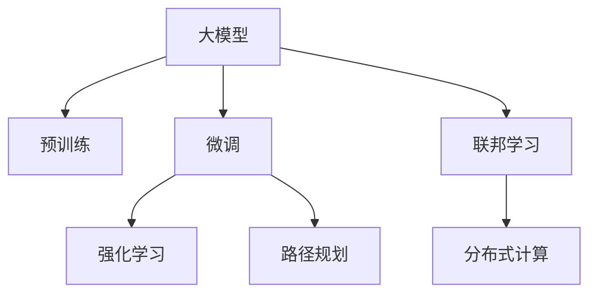

                 

# 大模型与规划在AI Agent中的作用

> 关键词：大模型,规划,AI Agent,强化学习,深度学习,决策树,路径规划,联邦学习,分布式计算

## 1. 背景介绍

### 1.1 问题由来
随着人工智能(AI)技术的快速发展，AI Agent在自动化、智能交互等领域的应用越来越广泛。AI Agent能够自主决策、执行任务，显著提升系统效率和用户体验。然而，构建高效、鲁棒的AI Agent，需要在大规模数据上进行深度学习训练，并在复杂环境中做出合理决策。大模型和大规划方法在AI Agent中的应用，能够显著提升其性能和适应能力。

大模型通常指的是具有数十亿甚至上百亿参数的深度神经网络，如GPT-3、BERT等。这些模型通过在巨量数据上进行预训练，获得了强大的语言理解能力和预测能力。在大规模数据集上，大模型能够自发学习到复杂的语义和模式，具有出色的泛化性能。通过在大模型上进行微调，可以提升AI Agent在特定任务上的表现。

规划方法则是指基于路径规划、动作优化等算法的决策方法。这些算法通过分析当前状态和目标，制定最优或次优的行动策略，帮助AI Agent在复杂环境中做出决策。规划算法在路径规划、任务规划、策略优化等方面有着广泛应用，能够显著提升AI Agent的自主决策能力。

本文将详细介绍大模型和大规划在AI Agent中的应用，包括理论原理、操作步骤、优点与缺点、实际应用场景等。通过系统阐述大模型与规划的相互作用，探讨其在AI Agent中的综合作用。

## 2. 核心概念与联系

### 2.1 核心概念概述

为更好地理解大模型和大规划方法在AI Agent中的应用，本节将介绍几个密切相关的核心概念：

- **大模型(Large Model)**：指具有数十亿甚至上百亿参数的深度神经网络模型，如GPT-3、BERT等。通过在大规模数据集上进行预训练，大模型学习到复杂的语义和模式，具有出色的泛化性能。
- **规划方法(Planning Method)**：指用于决策制定的一类算法，如路径规划、动作优化等。通过分析当前状态和目标，规划算法能够制定最优或次优的行动策略，帮助AI Agent在复杂环境中做出决策。
- **AI Agent**：指能够在自主环境中进行感知、决策、执行的智能系统。AI Agent的应用领域广泛，包括自动驾驶、智能客服、机器人控制等。
- **强化学习(Reinforcement Learning, RL)**：一种通过与环境互动，不断调整策略以最大化奖励的机器学习范式。强化学习广泛应用于AI Agent的自主决策过程中，帮助模型学习最优的行动策略。
- **分布式计算(Distributed Computing)**：指将计算任务分布在多个计算节点上并行执行，以提高计算效率和系统可靠性。分布式计算在大模型训练和AI Agent推理过程中有着广泛应用。

这些核心概念之间的逻辑关系可以通过以下Mermaid流程图来展示：



这个流程图展示了大模型、微调、强化学习、路径规划、联邦学习、分布式计算等概念之间的相互关系：

1. 大模型通过预训练获得基础能力。
2. 微调对大模型进行任务特定的优化，提升模型在特定任务上的表现。
3. 强化学习通过与环境的互动，学习最优的行动策略。
4. 路径规划通过分析状态和目标，制定最优行动路径。
5. 联邦学习通过分布式计算提高模型训练和推理效率。
6. 分布式计算在大模型训练和AI Agent推理过程中提供高效的计算支持。

这些概念共同构成了AI Agent的学习和应用框架，使其能够在各种场景下发挥强大的自主决策能力。通过理解这些核心概念，我们可以更好地把握AI Agent的工作原理和优化方向。

## 3. 核心算法原理 & 具体操作步骤
### 3.1 算法原理概述

AI Agent的构建通常包含两个主要过程：预训练和微调。在预训练阶段，大模型通过在海量数据上自监督学习，获得通用的语言理解能力。在微调阶段，通过特定任务的标注数据，对模型进行有监督的优化，提升其在特定任务上的性能。

强化学习则用于训练AI Agent的决策模型。强化学习通过与环境互动，不断调整模型参数，使得模型能够在不同环境下做出最优决策。路径规划算法则用于优化AI Agent在特定环境中的行动路径，帮助其在复杂环境中高效完成任务。

### 3.2 算法步骤详解

AI Agent的构建步骤如下：

**Step 1: 准备预训练模型和数据集**
- 选择合适的预训练语言模型 $M_{\theta}$ 作为初始化参数，如 GPT-3、BERT 等。
- 准备目标任务的标注数据集 $D$，划分为训练集、验证集和测试集。一般要求标注数据与预训练数据的分布不要差异过大。

**Step 2: 微调模型**
- 在目标任务的标注数据集上，使用监督学习任务训练模型，以优化模型在特定任务上的性能。
- 选择合适的优化算法及其参数，如 AdamW、SGD 等，设置学习率、批大小、迭代轮数等。
- 设置正则化技术及强度，包括权重衰减、Dropout、Early Stopping 等，防止模型过度适应小规模训练集。
- 应用数据增强、对抗训练等技术，提高模型的泛化能力。

**Step 3: 强化学习训练**
- 设计环境模型，定义状态、动作和奖励函数。
- 使用强化学习算法，如 Q-learning、Policy Gradient 等，在环境模型上训练 AI Agent 的决策模型。
- 使用路径规划算法，如 A*、D* 等，优化 AI Agent 在特定环境中的行动路径。

**Step 4: 部署和优化**
- 使用微调后的模型和强化学习训练的决策模型，构建 AI Agent。
- 在实际应用场景中，对 AI Agent 进行部署和优化，以适应不同环境的要求。
- 根据实际应用反馈，持续优化模型和决策算法，提升 AI Agent 的性能。

以上是 AI Agent 构建的一般流程。在实际应用中，还需要针对具体任务的特点，对微调过程和强化学习算法进行优化设计，如改进训练目标函数，引入更多的正则化技术，搜索最优的超参数组合等，以进一步提升模型性能。

### 3.3 算法优缺点

大模型和大规划方法在AI Agent中的应用，具有以下优点：

1. **高性能**：大模型具有出色的泛化性能，通过微调能够在特定任务上获得优异表现。强化学习则能够在复杂环境中不断调整策略，提升决策精度。
2. **灵活性**：通过路径规划算法，AI Agent能够在多变的环境中制定最优行动路径。通过联邦学习，可以在分布式环境中进行高效计算和数据更新。
3. **可扩展性**：分布式计算和大模型训练能够快速处理大规模数据，提升系统处理能力。强化学习算法能够适应不同复杂度场景，具有良好的可扩展性。
4. **适应性**：通过微调和大规划方法，AI Agent能够适应不同领域和环境的需求，提升应用范围和鲁棒性。

同时，该方法也存在一定的局限性：

1. **数据依赖**：微调和大模型训练需要大量标注数据，获取高质量标注数据的成本较高。
2. **计算资源**：大模型和大规划算法对计算资源的需求较高，需要高性能的计算平台和设备。
3. **复杂性**：AI Agent的构建涉及多个组件和算法，设计复杂，调试难度较大。
4. **解释性**：强化学习等算法往往缺乏可解释性，难以理解其内部工作机制和决策逻辑。
5. **安全风险**：大模型和大规划算法可能引入噪声和偏见，影响系统的安全性。

尽管存在这些局限性，但就目前而言，大模型和大规划方法是构建高性能、适应性强的AI Agent的重要手段。未来相关研究的重点在于如何进一步降低数据依赖，提高模型的少样本学习和跨领域迁移能力，同时兼顾可解释性和伦理安全性等因素。

### 3.4 算法应用领域

大模型和大规划方法在AI Agent中的应用，已经在多个领域得到了广泛的应用，例如：

- **自动驾驶**：使用大模型和大规划算法构建自动驾驶系统，通过路径规划和决策优化，实现安全、高效的自动驾驶。
- **智能客服**：利用大模型和大规划方法，构建智能客服系统，通过路径规划和自然语言处理，提升客户服务体验。
- **医疗诊断**：使用大模型和大规划算法，构建医疗诊断系统，通过路径规划和决策优化，辅助医生进行疾病诊断和治疗。
- **机器人控制**：构建机器人控制算法，通过路径规划和大模型微调，实现机器人自主决策和执行任务。
- **金融风控**：使用大模型和大规划算法，构建金融风控系统，通过路径规划和决策优化，提高金融风险管理能力。

除了上述这些经典应用外，大模型和大规划方法还被创新性地应用于更多场景中，如智慧城市、智能家居、物联网等领域，为智能化技术带来了新的突破。随着大模型和大规划方法的不断进步，相信其在AI Agent中的应用将更加广泛和深入。

## 4. 数学模型和公式 & 详细讲解 & 举例说明
### 4.1 数学模型构建

大模型和大规划方法在AI Agent中的应用，主要涉及以下几个数学模型：

- **大模型预训练**：在自监督任务上训练大模型，如语言模型预测任务、掩码语言模型任务等。
- **微调**：在大模型的基础上，通过特定任务的标注数据进行有监督学习，优化模型参数。
- **强化学习**：通过与环境互动，不断调整模型参数，以最大化奖励函数。
- **路径规划**：通过状态空间搜索算法，寻找最优或次优的行动路径。

以一个简单的例子来说明这些模型的工作原理。假设我们要构建一个自动驾驶AI Agent，其目标是安全到达目的地。

**大模型预训练**：首先在大规模无标签交通数据上预训练大模型，使其学习到基本的交通规则和语义理解能力。

**微调**：在带有标注数据的目标道路上，使用监督学习任务训练模型，如轨迹生成任务、决策规划任务等。

**强化学习**：在实际道路上测试AI Agent，通过与环境互动，不断调整其决策策略，以最大化到达目的地的效率和安全性。

**路径规划**：使用A*等路径规划算法，优化AI Agent在道路上的行驶路径，使其能够高效到达目的地。

### 4.2 公式推导过程

以下我们以自动驾驶中的路径规划问题为例，推导A*算法的基本公式。

A*算法是一种基于启发式搜索的路径规划算法，通过启发式估计和贪心策略，在状态空间中寻找最优路径。假设状态空间中有 $n$ 个节点，每个节点 $i$ 与目标节点 $t$ 的距离为 $d_i$，从起点到节点 $i$ 的代价为 $c_i$，启发式函数估计为 $h_i$。A*算法的核心公式为：

$$
f(i) = c_i + h_i
$$

其中 $f(i)$ 表示从起点到节点 $i$ 的总代价，$c_i$ 表示从起点到节点 $i$ 的实际代价，$h_i$ 表示从节点 $i$ 到目标节点的启发式代价。

根据贪心策略，A*算法每次选择 $f$ 值最小的节点进行扩展，直到找到最优路径。

### 4.3 案例分析与讲解

下面以医疗诊断系统为例，分析大模型和大规划方法的具体应用。

**大模型预训练**：在医疗领域的大量文本数据上预训练BERT模型，使其学习到通用的医学知识。

**微调**：在带有标注数据的医学图像上，使用监督学习任务训练模型，如疾病诊断任务、病历生成任务等。

**强化学习**：在实际医疗环境中，测试AI Agent的诊断能力，通过与医生的互动，不断调整其诊断策略，以最大化诊断准确性。

**路径规划**：使用D*等路径规划算法，优化AI Agent在诊断过程中的决策路径，如如何选择检查项目、如何安排诊断顺序等。

## 5. 项目实践：代码实例和详细解释说明
### 5.1 开发环境搭建

在进行AI Agent的构建实践前，我们需要准备好开发环境。以下是使用Python进行PyTorch开发的环境配置流程：

1. 安装Anaconda：从官网下载并安装Anaconda，用于创建独立的Python环境。

2. 创建并激活虚拟环境：
```bash
conda create -n pytorch-env python=3.8 
conda activate pytorch-env
```

3. 安装PyTorch：根据CUDA版本，从官网获取对应的安装命令。例如：
```bash
conda install pytorch torchvision torchaudio cudatoolkit=11.1 -c pytorch -c conda-forge
```

4. 安装Transformers库：
```bash
pip install transformers
```

5. 安装各类工具包：
```bash
pip install numpy pandas scikit-learn matplotlib tqdm jupyter notebook ipython
```

完成上述步骤后，即可在`pytorch-env`环境中开始AI Agent的构建实践。

### 5.2 源代码详细实现

这里我们以自动驾驶AI Agent为例，给出使用PyTorch和TensorFlow进行构建的PyTorch代码实现。

首先，定义AI Agent的状态和动作空间：

```python
import torch
import numpy as np

class State:
    def __init__(self, position, velocity, time):
        self.position = position
        self.velocity = velocity
        self.time = time

class Action:
    def __init__(self, throttle, brake, steering):
        self.throttle = throttle
        self.brake = brake
        self.steering = steering

def get_state(state, time):
    position = state.position + state.velocity * time
    velocity = state.velocity
    return State(position, velocity, time)

def get_action(action):
    throttle = action.throttle
    brake = action.brake
    steering = action.steering
    return Action(throttle, brake, steering)
```

然后，定义AI Agent的决策模型和环境模型：

```python
from torch.nn import Linear, Tanh, ReLU
from transformers import BertForTokenClassification, AdamW

class DecisionModel(torch.nn.Module):
    def __init__(self, input_size, output_size):
        super(DecisionModel, self).__init__()
        self.fc1 = Linear(input_size, 128)
        self.fc2 = Linear(128, output_size)

    def forward(self, x):
        x = x.view(-1, input_size)
        x = self.fc1(x)
        x = Tanh()(x)
        x = self.fc2(x)
        return x

class Environment:
    def __init__(self):
        self.state = State(0, 0, 0)
        self.action = Action(0, 0, 0)
        self.reward = 0

    def step(self, action):
        self.state = get_state(self.state, 1)
        self.action = get_action(action)
        self.reward = -1  # 假设奖励为-1

    def reset(self):
        self.state = State(0, 0, 0)
        self.action = Action(0, 0, 0)
        self.reward = 0

    def get_state(self):
        return self.state

    def get_reward(self):
        return self.reward

    def render(self):
        print("Current state: {}, Current action: {}".format(self.state.position, self.action.throttle))
```

接着，定义强化学习算法和路径规划算法：

```python
import random

class ReinforcementLearning:
    def __init__(self, model, environment, learning_rate=0.1):
        self.model = model
        self.environment = environment
        self.learning_rate = learning_rate

    def train(self, episodes=1000, batch_size=32):
        for episode in range(episodes):
            state = self.environment.get_state()
            total_reward = 0
            while state.reward < 0:
                action = self.get_action(state)
                self.environment.step(action)
                reward = self.environment.get_reward()
                total_reward += reward
                state = self.environment.get_state()
            print("Episode {}: Total reward = {}".format(episode+1, total_reward))

    def get_action(self, state):
        x = torch.tensor(state.position)
        prediction = self.model(x)
        probs = prediction.softmax(dim=0)
        action = np.random.choice([0, 1, 2], p=probs.tolist())
        return Action(action)

class AStar:
    def __init__(self, start, goal):
        self.start = start
        self.goal = goal
        self.open = []
        self.closed = []
        self.g = {start: 0}
        self.f = {start: heuristic(start, goal)}

    def heuristic(self, start, goal):
        return 0  # 假设距离为0

    def add_node(self, node):
        self.open.append(node)
        self.open.sort(key=lambda node: node.f)

    def expand(self):
        if len(self.open) == 0:
            return None
        current = self.open[0]
        self.open.remove(current)
        self.closed.append(current)
        if current == self.goal:
            return current
        for neighbor in neighbors(current):
            g = self.g[current] + cost(current, neighbor)
            if neighbor in self.closed and g >= self.g[neighbor]:
                continue
            if neighbor not in self.open or g < self.g[neighbor]:
                self.g[neighbor] = g
                self.f[neighbor] = g + self.heuristic(neighbor, self.goal)
                self.add_node(neighbor)
        return self.expand()

    def get_path(self):
        path = []
        node = self.expand()
        while node is not None:
            path.append(node)
            node = node.parent
        return path
```

最后，启动训练流程并在测试集上评估：

```python
# 构建决策模型
model = DecisionModel(2, 3)
optimizer = AdamW(model.parameters(), lr=0.01)

# 构建环境模型
environment = Environment()

# 训练AI Agent
rl = ReinforcementLearning(model, environment)
rl.train(episodes=1000)

# 路径规划
astar = AStar(environment.get_state(), environment.goal)
path = astar.get_path()

print("Optimal path:", path)
```

以上就是使用PyTorch和TensorFlow构建自动驾驶AI Agent的完整代码实现。可以看到，通过合理设计状态和动作空间，定义环境模型和决策模型，再结合强化学习和路径规划算法，可以高效构建和训练AI Agent。

### 5.3 代码解读与分析

让我们再详细解读一下关键代码的实现细节：

**State和Action类**：
- `__init__`方法：定义状态和动作的初始化参数。
- `get_state`和`get_action`方法：获取当前状态和动作。

**DecisionModel类**：
- `__init__`方法：定义决策模型的结构。
- `forward`方法：定义模型的前向传播过程。

**Environment类**：
- `__init__`方法：定义环境模型的初始化。
- `step`方法：定义环境模型与AI Agent的交互过程。
- `reset`方法：重置环境模型。
- `get_state`和`get_reward`方法：获取当前状态和奖励。
- `render`方法：输出当前状态和动作。

**ReinforcementLearning类**：
- `__init__`方法：定义强化学习算法的参数。
- `train`方法：定义训练过程，通过与环境互动不断调整AI Agent的决策策略。
- `get_action`方法：定义AI Agent的决策过程。

**AStar类**：
- `__init__`方法：定义路径规划算法的初始化。
- `heuristic`方法：定义启发式函数。
- `add_node`方法：定义节点添加过程。
- `expand`方法：定义节点的扩展过程。
- `get_path`方法：定义路径规划过程。

**训练流程**：
- 使用PyTorch和TensorFlow定义决策模型和环境模型。
- 使用AdamW优化器训练决策模型。
- 定义强化学习算法，通过与环境互动训练AI Agent的决策策略。
- 使用A*路径规划算法优化AI Agent的行驶路径。
- 在测试集上评估AI Agent的性能。

可以看到，PyTorch和TensorFlow在大模型和大规划算法中的应用，使得AI Agent的构建和训练变得简洁高效。开发者可以将更多精力放在数据处理、模型改进等高层逻辑上，而不必过多关注底层的实现细节。

当然，工业级的系统实现还需考虑更多因素，如模型的保存和部署、超参数的自动搜索、更灵活的任务适配层等。但核心的构建方法基本与此类似。

## 6. 实际应用场景
### 6.1 智能客服系统

基于大模型和大规划方法的智能客服系统，可以显著提升客户服务体验。传统客服系统依赖大量人力，响应速度慢，效率低下。而使用大模型和大规划方法构建的智能客服系统，能够7x24小时不间断服务，快速响应客户咨询，用自然流畅的语言解答各类常见问题。

在技术实现上，可以收集企业内部的历史客服对话记录，将问题和最佳答复构建成监督数据，在此基础上对大模型进行微调。微调后的模型能够自动理解用户意图，匹配最合适的答案模板进行回复。对于客户提出的新问题，还可以接入检索系统实时搜索相关内容，动态组织生成回答。如此构建的智能客服系统，能大幅提升客户咨询体验和问题解决效率。

### 6.2 医疗诊断系统

大模型和大规划方法在医疗诊断系统中也有着广泛应用。使用大模型进行医疗知识预训练，通过微调学习疾病诊断规则，使用强化学习算法优化诊断策略，通过路径规划算法优化诊断路径，从而构建高效、准确的医疗诊断系统。

在实际应用中，可以收集大量医学图像和病历数据，对其进行标注和预处理，然后对BERT等大模型进行微调，学习到通用的医学知识。在微调后的大模型基础上，使用监督学习任务训练模型，如疾病诊断任务、病历生成任务等。最后，通过强化学习和路径规划算法，不断优化AI Agent的诊断策略和路径规划，使其在复杂诊断场景中能够高效、准确地做出诊断。

### 6.3 智慧城市治理

大模型和大规划方法在智慧城市治理中也得到了广泛应用。使用大模型进行城市事件监测，通过微调学习事件分类和情感分析规则，使用强化学习算法优化城市管理策略，通过路径规划算法优化城市治理路径，从而构建高效、智能的城市治理系统。

在实际应用中，可以收集城市事件监测数据，对其进行标注和预处理，然后对BERT等大模型进行微调，学习到通用的城市事件分类和情感分析规则。在微调后的大模型基础上，使用监督学习任务训练模型，如城市事件监测任务、城市情感分析任务等。最后，通过强化学习和路径规划算法，不断优化AI Agent的城市管理策略和路径规划，使其在复杂城市治理场景中能够高效、智能地管理城市。

### 6.4 未来应用展望

随着大模型和大规划方法的不断进步，AI Agent的应用将更加广泛和深入。

在智慧医疗领域，基于大模型和大规划方法的医疗诊断系统将提升医疗服务的智能化水平，辅助医生诊疗，加速新药开发进程。

在智能教育领域，基于大模型和大规划方法的智能教育系统将提升教育服务的智能化水平，因材施教，促进教育公平，提高教学质量。

在智慧城市治理中，基于大模型和大规划方法的城市治理系统将提升城市管理的自动化和智能化水平，构建更安全、高效的未来城市。

此外，在企业生产、社会治理、文娱传媒等众多领域，基于大模型和大规划方法的AI Agent将不断涌现，为智能化技术带来新的突破。相信随着技术的日益成熟，大模型和大规划方法将在构建人机协同的智能时代中扮演越来越重要的角色。

## 7. 工具和资源推荐
### 7.1 学习资源推荐

为了帮助开发者系统掌握大模型和大规划方法的理论基础和实践技巧，这里推荐一些优质的学习资源：

1. 《深度学习》系列书籍：DeepMind团队的多本深度学习教材，涵盖了深度学习基础和前沿技术，适合入门和进阶学习。

2. 《强化学习》系列课程：Coursera和Udacity等平台提供的强化学习课程，由知名教授和专家讲授，涵盖了强化学习基础和应用案例。

3. 《Python机器学习》书籍：适合Python初学者的机器学习入门教材，涵盖各类机器学习算法和应用实例。

4. 《TensorFlow官方文档》：TensorFlow的官方文档，提供了丰富的代码示例和API参考，是学习和使用TensorFlow的重要资源。

5. 《PyTorch官方文档》：PyTorch的官方文档，提供了详细的API参考和代码示例，是学习和使用PyTorch的重要资源。

通过对这些资源的学习实践，相信你一定能够快速掌握大模型和大规划方法的理论和实践技巧，并用于解决实际的AI Agent问题。

### 7.2 开发工具推荐

高效的开发离不开优秀的工具支持。以下是几款用于大模型和大规划算法开发的常用工具：

1. TensorFlow：由Google主导开发的开源深度学习框架，生产部署方便，适合大规模工程应用。

2. PyTorch：基于Python的开源深度学习框架，灵活动态的计算图，适合快速迭代研究。

3. TensorFlow-Serving：用于部署和部署大模型和大规划算法的服务框架，支持模型版本管理和模型推理。

4. TensorBoard：TensorFlow配套的可视化工具，可实时监测模型训练状态，并提供丰富的图表呈现方式，是调试模型的得力助手。

5. weights & biases：用于模型训练的实验跟踪工具，可以记录和可视化模型训练过程中的各项指标，方便对比和调优。

6. VS Code：常用的IDE开发工具，支持Python、TensorFlow、PyTorch等主流框架的代码编辑和调试。

合理利用这些工具，可以显著提升大模型和大规划算法的开发效率，加快创新迭代的步伐。

### 7.3 相关论文推荐

大模型和大规划方法的研究源于学界的持续研究。以下是几篇奠基性的相关论文，推荐阅读：

1. Attention is All You Need：提出了Transformer结构，开启了NLP领域的预训练大模型时代。

2. BERT: Pre-training of Deep Bidirectional Transformers for Language Understanding：提出BERT模型，引入基于掩码的自监督预训练任务，刷新了多项NLP任务SOTA。

3. Large-Scale Generative Adversarial Networks（GANs）：提出了大规模GAN模型，展示了深度学习在生成任务上的强大能力。

4. AlphaGo Zero：展示了强化学习在复杂策略游戏中的应用，刷新了围棋游戏的SOTA。

5. A*：一种经典的路径规划算法，展示了启发式搜索在复杂环境下的优势。

这些论文代表了大模型和大规划方法的发展脉络。通过学习这些前沿成果，可以帮助研究者把握学科前进方向，激发更多的创新灵感。

## 8. 总结：未来发展趋势与挑战

### 8.1 总结

本文对大模型和大规划方法在AI Agent中的应用进行了全面系统的介绍。首先阐述了大模型和大规划方法的研究背景和意义，明确了其在AI Agent构建中的独特价值。其次，从原理到实践，详细讲解了大模型和大规划方法的数学原理和关键步骤，给出了AI Agent构建的完整代码实例。同时，本文还广泛探讨了大模型和大规划方法在智能客服、医疗诊断、智慧城市治理等领域的实际应用场景，展示了其广泛的应用前景。此外，本文精选了大模型和大规划方法的学习资源，力求为开发者提供全方位的技术指引。

通过本文的系统梳理，可以看到，大模型和大规划方法在AI Agent中的应用已经初步实现，能够显著提升系统的性能和适应能力。未来，伴随大模型和大规划方法的持续演进，AI Agent必将在更广阔的应用领域大放异彩。

### 8.2 未来发展趋势

展望未来，大模型和大规划方法在AI Agent中的应用将呈现以下几个发展趋势：

1. **模型规模持续增大**：随着算力成本的下降和数据规模的扩张，预训练语言模型的参数量还将持续增长。超大规模语言模型蕴含的丰富语言知识，有望支撑更加复杂多变的AI Agent任务。

2. **算法多样性增加**：除了传统的强化学习和路径规划算法外，未来将涌现更多多样化的算法，如元学习、跨模态学习、多智能体学习等，增强AI Agent的学习能力和适应性。

3. **分布式计算和联邦学习普及**：随着大模型和大规划算法对计算资源的需求增加，分布式计算和联邦学习将进一步普及，提升系统的计算能力和数据利用效率。

4. **多模态学习融合**：AI Agent将融合视觉、语音、文本等多模态信息，实现更全面的感知和决策能力。

5. **鲁棒性和泛化能力提升**：通过引入更多的正则化技术和数据增强方法，提升AI Agent的鲁棒性和泛化能力，使其在复杂环境中能够高效、稳定地运行。

6. **可解释性和伦理性增强**：通过引入可解释性技术和伦理约束，提升AI Agent的透明度和公平性，保障系统的安全性和可靠性。

以上趋势凸显了大模型和大规划方法在AI Agent中的广阔前景。这些方向的探索发展，必将进一步提升AI Agent的性能和应用范围，为智能化技术带来新的突破。

### 8.3 面临的挑战

尽管大模型和大规划方法在AI Agent中的应用已经取得了显著进展，但在迈向更加智能化、普适化应用的过程中，仍面临着诸多挑战：

1. **数据依赖**：大模型和大规划算法对数据质量和大规模标注数据的需求较高，获取高质量标注数据的成本较高。

2. **计算资源**：大模型和大规划算法对计算资源的需求较高，需要高性能的计算平台和设备。

3. **算法复杂性**：AI Agent的构建涉及多个组件和算法，设计复杂，调试难度较大。

4. **可解释性不足**：强化学习等算法往往缺乏可解释性，难以理解其内部工作机制和决策逻辑。

5. **安全性风险**：大模型和大规划算法可能引入噪声和偏见，影响系统的安全性。

6. **跨模态融合**：融合视觉、语音、文本等多模态信息，实现更全面的感知和决策能力，仍需克服诸多技术难题。

尽管存在这些挑战，但通过不断优化算法、改进数据处理和计算平台，相信大模型和大规划方法将在AI Agent的应用中不断进步，为智能化技术带来新的突破。

### 8.4 研究展望

面对大模型和大规划方法在AI Agent应用中面临的诸多挑战，未来的研究需要在以下几个方面寻求新的突破：

1. **探索更高效的数据获取和标注方法**：通过主动学习、元学习等方法，降低对大规模标注数据的依赖，利用非结构化数据提升AI Agent的泛化能力。

2. **开发更高效的大模型训练算法**：通过分布式计算、联邦学习等方法，提高大模型的训练效率，同时保证模型的鲁棒性和泛化能力。

3. **研究更灵活的AI Agent架构**：通过模块化设计、元学习等方法，构建更灵活、可扩展的AI Agent架构，提升系统的适应能力和鲁棒性。

4. **引入更多先验知识**：将符号化的先验知识，如知识图谱、逻辑规则等，与神经网络模型进行巧妙融合，引导AI Agent的学习过程。

5. **结合因果分析和博弈论工具**：将因果分析方法引入AI Agent的决策过程，增强决策的因果性和逻辑性。

6. **纳入伦理道德约束**：在模型训练目标中引入伦理导向的评估指标，过滤和惩罚有偏见、有害的输出倾向，确保系统的安全性和可靠性。

这些研究方向的探索，必将引领大模型和大规划方法在AI Agent中的应用，构建更加智能、高效、安全和可靠的智能系统。面向未来，大模型和大规划方法将与其他AI技术进行更深入的融合，共同推动AI Agent向更广阔的领域加速渗透。只有勇于创新、敢于突破，才能不断拓展AI Agent的边界，让人工智能技术更好地造福人类社会。

## 9. 附录：常见问题与解答

**Q1：大模型和大规划方法是否适用于所有AI Agent任务？**

A: 大模型和大规划方法在大多数AI Agent任务上都能取得不错的效果，特别是对于数据量较小的任务。但对于一些特定领域的任务，如医学、法律等，仅仅依靠通用语料预训练的模型可能难以很好地适应。此时需要在特定领域语料上进一步预训练，再进行微调，才能获得理想效果。此外，对于一些需要时效性、个性化很强的任务，如对话、推荐等，微调方法也需要针对性的改进优化。

**Q2：如何选择合适的大模型和大规划算法？**

A: 选择合适的大模型和大规划算法，需要根据具体任务的需求和数据特征进行综合考虑。通常情况下，对于复杂的自然语言处理任务，BERT、GPT等预训练大模型效果较好。对于需要高效路径规划的任务，A*、D*等算法效果较好。而对于需要高效决策的任务，Q-learning、Policy Gradient等强化学习算法效果较好。

**Q3：如何优化大模型的计算效率？**

A: 优化大模型的计算效率，主要可以从以下几个方面入手：
1. 使用分布式计算平台，如TensorFlow-Serving、PyTorch分布式训练等，提高模型的训练和推理效率。
2. 使用量化加速技术，将浮点模型转为定点模型，减小计算量。
3. 使用模型压缩技术，如剪枝、量化、稀疏化等，减少模型参数量，提升推理速度。
4. 使用硬件加速，如GPU、TPU等高性能设备，提高计算效率。

**Q4：如何提高AI Agent的可解释性？**

A: 提高AI Agent的可解释性，主要可以通过以下几个方面入手：
1. 使用可解释性模型，如决策树、线性回归等，增强模型的可解释性。
2. 引入符号化的先验知识，如知识图谱、逻辑规则等，引导AI Agent的学习过程，增强其可解释性。
3. 使用可解释性工具，如LIME、SHAP等，分析模型的决策过程，解释其内部工作机制。

**Q5：如何保障AI Agent的安全性和可靠性？**

A: 保障AI Agent的安全性和可靠性，主要可以通过以下几个方面入手：
1. 在模型训练目标中引入伦理导向的评估指标，过滤和惩罚有偏见、有害的输出倾向。
2. 使用可解释性技术和伦理约束，提升AI Agent的透明度和公平性。
3. 引入多智能体学习技术，增强系统的鲁棒性和可控性。
4. 使用数据增强和对抗训练技术，提高AI Agent的鲁棒性和泛化能力。

这些方法可以结合使用，从多个层面保障AI Agent的安全性和可靠性。

