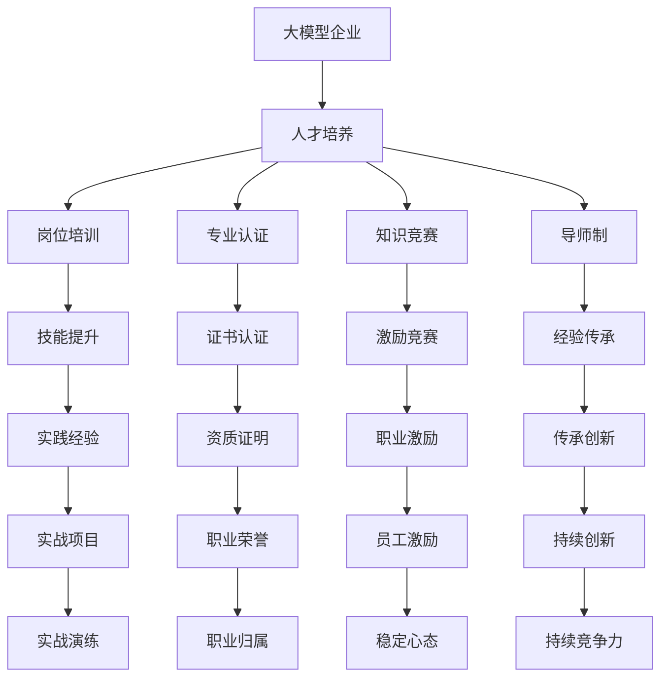

                 

# 大模型企业的人才培养与retention策略

> 关键词：大模型,人才培养,retention策略,人才留存,员工激励

## 1. 背景介绍

在当前的数字化转型浪潮中，大模型（Large Model）企业，即以机器学习和大数据为核心竞争力的企业，如谷歌、亚马逊、百度、腾讯等，正逐步成为行业领军者。大模型企业往往拥有海量数据和先进技术，能够在业务创新和智能应用方面走在行业前列。然而，随着企业规模的不断扩大，人才短缺和留存问题也日益突出，成为制约大模型企业发展的瓶颈。如何有效培养和保留人才，是大模型企业需要解决的重要课题。

## 2. 核心概念与联系

### 2.1 核心概念概述

为更好地理解大模型企业的人才培养与retention策略，本节将介绍几个关键概念：

- 大模型企业：以机器学习和大数据为核心的企业，能够开发和应用大规模、高性能的机器学习模型，如BERT、GPT、AlphaGo等。
- 人才培养：通过各种途径和方法，培养员工掌握大模型相关技术和知识，提高其专业能力和职业素养。
- retention策略：为了留住优秀人才，制定的一系列系统性、激励性的政策和措施，包括薪酬福利、职业发展、企业文化等方面。
- 人才留存：通过有效的留人策略，确保企业能够长期稳定地吸引和留住顶尖人才，满足业务发展需要。

这些概念之间的关系可以通过以下Mermaid流程图来展示：



这个流程图展示了人才培养和retention策略的实施过程和它们之间的联系：

1. 大模型企业首先通过各种方式进行人才培养，包括岗位培训、专业认证、知识竞赛、导师制等。
2. 人才培养的目标是通过技能提升、实践经验、实战演练等环节，使员工掌握大模型相关的核心技术。
3. 同时，通过职业激励、员工激励、导师制、职业发展等措施，增强员工的工作满意度和归属感，从而实现人才留存。
4. 通过职业荣誉、证书认证、资质证明等认可，激励员工持续学习和发展，增强其职业竞争力。
5. 最终，通过持续创新和实践经验的积累，提升员工的实战能力，确保其在大模型企业中长期稳定工作。

## 3. 核心算法原理 & 具体操作步骤
### 3.1 算法原理概述

大模型企业的人才培养与retention策略，本质上是一个系统性的管理和激励过程。其核心思想是：通过系统化的人才培养和激励机制，吸引、留住和激励员工，使其在大模型企业中充分发挥其专业优势，贡献卓越的成果。

形式化地，假设大模型企业的人才库为 $T=\{t_i\}_{i=1}^N$，其中 $t_i$ 表示员工 $i$ 的专业技能、工作表现和职业发展潜力。企业的人才管理目标是最小化员工流失率，即找到最优策略 $\pi$，使得：

$$
\pi^* = \mathop{\arg\min}_{\pi} \text{流失率}(T,\pi)
$$

其中 $\pi$ 表示企业的人才管理策略，包括招聘策略、培训策略、激励策略等。

通过优化上述目标函数，可以设计出系统性的人才培养和retention策略，最大化大模型企业的长期价值。

### 3.2 算法步骤详解

基于系统性的人才培养与retention策略，大模型企业的人才管理一般包括以下几个关键步骤：

**Step 1: 人才需求分析**
- 确定企业当前的人才结构，识别核心岗位和关键技能。
- 分析现有岗位与需求之间的差距，明确岗位缺口和培养目标。
- 制定人才招聘计划，通过校园招聘、外部招聘、内部晋升等方式吸引人才。

**Step 2: 设计人才培养体系**
- 制定岗位培训计划，提供系统性的技能提升课程。
- 设计专业认证体系，提供行业认可的资格证书。
- 引入知识竞赛和导师制，建立员工间的知识共享和经验传承机制。
- 设立实战项目和实战演练，增强员工解决实际问题的能力。

**Step 3: 实施激励措施**
- 制定职业激励政策，通过薪资福利、股权期权等激励员工。
- 设立员工激励计划，定期进行绩效考核和奖励，激励员工持续改进。
- 打造企业文化，营造团队协作、共同进步的氛围。
- 提供职业发展路径，帮助员工制定个人职业规划和发展目标。

**Step 4: 评估和优化策略**
- 定期收集员工反馈，评估人才管理策略的实施效果。
- 根据反馈结果，不断调整和优化人才管理策略。
- 引入数据驱动的人才管理工具，实时监控和分析员工状态和流失风险。

### 3.3 算法优缺点

大模型企业的人才培养与retention策略具有以下优点：

1. 系统性：通过全面系统的人才培养体系和激励措施，能够全面提升员工的技能和职业素养。
2. 灵活性：结合企业实际需求，灵活调整培训计划和激励策略，适应不断变化的业务环境。
3. 激励性：通过多样化的激励手段，有效提升员工的积极性和工作满意度。
4. 高效性：通过数据驱动的评估和优化机制，确保人才管理策略的效果最大化。

然而，该方法也存在一些局限性：

1. 实施成本高：系统性的人才培养体系和激励措施需要投入大量的人力和财力资源。
2. 效果难以量化：员工的技能提升和职业发展难以直接量化，评估和优化的难度较大。
3. 过度依赖激励：如果激励措施不足或执行不力，可能导致员工流失率上升。
4. 文化差异：不同文化背景的员工对激励措施的接受程度不同，需要设计多元化的激励策略。

尽管存在这些局限性，但就目前而言，大模型企业的人才培养与retention策略仍是大企业管理的核心范式。未来相关研究的重点在于如何进一步优化激励机制，降低实施成本，同时兼顾效果的量化和公平性等因素。

### 3.4 算法应用领域

大模型企业的人才培养与retention策略，在多个领域都得到了广泛应用，例如：

- 技术研发：通过系统化培训和激励，提升技术人员的研发能力和工作效率，确保新技术的不断突破。
- 产品管理：通过引入知识竞赛和实战演练，提高产品经理的市场洞察力和产品设计能力。
- 运营管理：通过职业发展路径和绩效考核，提升运营团队的执行力和管理水平。
- 客户服务：通过岗位培训和激励措施，增强客服团队的客户互动和问题解决能力。

除了上述这些核心领域外，大模型企业的人才培养与retention策略也被应用于人力资源、财务、法务等支持部门，为企业的整体运营提供坚实的人才保障。

## 4. 数学模型和公式 & 详细讲解  
### 4.1 数学模型构建

本节将使用数学语言对大模型企业的人才培养与retention策略进行更加严格的刻画。

记大模型企业的人才库为 $T=\{t_i\}_{i=1}^N$，其中 $t_i$ 表示员工 $i$ 的专业技能、工作表现和职业发展潜力。假设企业的核心岗位需求为 $C=\{c_k\}_{k=1}^M$，其中 $c_k$ 表示岗位 $k$ 的核心技能和期望产出。企业的人才管理目标是最小化员工流失率，即找到最优策略 $\pi$，使得：

$$
\pi^* = \mathop{\arg\min}_{\pi} \text{流失率}(T,\pi)
$$

其中 $\pi$ 表示企业的人才管理策略，包括招聘策略、培训策略、激励策略等。

定义流失率函数为：

$$
\text{流失率}(T,\pi) = \frac{\sum_{i=1}^N f(t_i,\pi)}{N}
$$

其中 $f(t_i,\pi)$ 表示员工 $i$ 在策略 $\pi$ 下流失的概率，取决于其技能提升、工作表现、职业发展潜力等因素。

通过最小化流失率函数，可以设计出最优的人才管理策略 $\pi^*$，最大化大模型企业的长期价值。

### 4.2 公式推导过程

以下我们推导流失率函数的详细计算公式。

假设员工 $i$ 在岗位 $k$ 上的流失概率为 $p_{ik}$，则流失率函数可以表示为：

$$
\text{流失率}(T,\pi) = \frac{\sum_{i=1}^N \sum_{k=1}^M p_{ik} \mathbf{1}_{c_k \in \pi_i}}{N}
$$

其中 $\pi_i$ 表示员工 $i$ 的岗位分配策略，$\mathbf{1}_{c_k \in \pi_i}$ 为示性函数，当岗位 $k$ 属于员工 $i$ 的分配策略时，$\mathbf{1}_{c_k \in \pi_i}=1$，否则 $\mathbf{1}_{c_k \in \pi_i}=0$。

流失率函数的优化目标是最小化上式中的 $p_{ik}$，即：

$$
\pi^* = \mathop{\arg\min}_{\pi} \sum_{i=1}^N \sum_{k=1}^M p_{ik} \mathbf{1}_{c_k \in \pi_i}
$$

在实际计算中，$p_{ik}$ 的计算依赖于员工的技能提升、工作表现、职业发展潜力等因素。这些因素通常需要通过模型预测或专家评估得出。

### 4.3 案例分析与讲解

**案例分析一：员工流失预测模型**

假设大模型企业希望构建员工流失预测模型，根据员工的年龄、工作年限、绩效评分、培训记录等特征，预测其流失概率。

首先，收集员工的历史数据 $D=\{(x_i,y_i)\}_{i=1}^N$，其中 $x_i$ 为员工特征向量，$y_i$ 为员工流失标签（0或1）。定义员工流失概率模型为：

$$
p_{ik} = f(x_i, \theta_k)
$$

其中 $f(x_i, \theta_k)$ 为员工流失概率预测函数，$\theta_k$ 为模型参数。

通过最小化上式中的 $p_{ik}$，可以设计出最优的员工流失预测模型 $\theta^*$，有效评估员工流失风险，指导企业的人才管理策略。

**案例分析二：职业激励方案设计**

假设大模型企业希望设计一套职业激励方案，根据员工的技能水平、工作表现和职业发展潜力，设计个性化的激励措施。

首先，定义员工的技能水平评估函数 $s(t_i)$，表示员工 $i$ 的专业技能和经验水平。定义员工的工作表现评估函数 $w(t_i)$，表示员工的工作效率和质量。定义员工职业发展潜力评估函数 $d(t_i)$，表示员工在职业发展上的潜力和成长空间。

根据这些评估函数，可以设计员工流失概率模型为：

$$
p_{ik} = g(s(t_i), w(t_i), d(t_i), \theta_k)
$$

其中 $g(\cdot)$ 为员工流失概率预测函数，$\theta_k$ 为模型参数。

通过最小化上式中的 $p_{ik}$，可以设计出最优的职业激励方案 $\theta^*$，针对不同员工设计个性化的激励措施，提升员工的工作满意度和忠诚度。

## 5. 项目实践：代码实例和详细解释说明
### 5.1 开发环境搭建

在进行大模型企业的人才培养与retention策略的开发和实践时，需要准备好相应的开发环境。以下是使用Python进行相关开发的常见环境配置流程：

1. 安装Python：从官网下载并安装Python，确保安装版本稳定可靠。
2. 安装必要的库：安装numpy、pandas、scikit-learn、matplotlib等Python科学计算和数据分析库。
3. 搭建数据平台：选择合适的大数据平台，如Hadoop、Spark、Hive等，搭建数据存储和处理环境。
4. 搭建机器学习平台：选择合适的机器学习框架，如TensorFlow、PyTorch、Scikit-Learn等，搭建模型训练和推理环境。
5. 搭建可视化平台：选择合适的数据可视化工具，如Tableau、PowerBI、Jupyter Notebook等，进行数据分析和展示。

完成上述步骤后，即可在准备好的开发环境中进行人才管理系统的开发和实践。

### 5.2 源代码详细实现

下面我们以员工流失预测模型的实现为例，展示使用Python和TensorFlow进行模型开发的代码实现。

首先，定义员工特征和流失标签的数据集：

```python
import pandas as pd
import numpy as np
from sklearn.model_selection import train_test_split

# 读取员工数据
data = pd.read_csv('employee_data.csv')

# 定义员工特征和流失标签
features = ['age', 'work_years', 'performance_score', 'training_hours']
labels = ['turnover']

# 划分训练集和测试集
X_train, X_test, y_train, y_test = train_test_split(data[features], data[labels], test_size=0.2, random_state=42)
```

接着，定义流失概率预测模型：

```python
import tensorflow as tf
from tensorflow.keras.models import Sequential
from tensorflow.keras.layers import Dense

# 构建模型
model = Sequential()
model.add(Dense(64, input_dim=len(features), activation='relu'))
model.add(Dense(64, activation='relu'))
model.add(Dense(1, activation='sigmoid'))

# 编译模型
model.compile(loss='binary_crossentropy', optimizer='adam', metrics=['accuracy'])

# 训练模型
model.fit(X_train, y_train, epochs=10, batch_size=32, validation_data=(X_test, y_test))
```

最后，使用训练好的模型进行员工流失预测：

```python
# 加载测试数据
test_data = pd.read_csv('test_data.csv')

# 进行员工流失预测
predictions = model.predict(test_data[features])

# 输出预测结果
for i, prediction in enumerate(predictions):
    if prediction > 0.5:
        print(f"Employee {i+1} is likely to turnover.")
    else:
        print(f"Employee {i+1} is unlikely to turnover.")
```

以上就是使用Python和TensorFlow进行员工流失预测模型的代码实现。可以看到，通过简单的数据预处理和模型训练，我们就能够快速构建一个员工流失预测模型，进行员工流失风险的评估和预警。

### 5.3 代码解读与分析

让我们再详细解读一下关键代码的实现细节：

**数据准备**：
- 使用pandas库读取员工数据，定义员工特征和流失标签。
- 使用sklearn的train_test_split函数将数据划分为训练集和测试集。

**模型构建**：
- 使用TensorFlow库构建一个简单的神经网络模型，包含两个隐藏层和一个输出层。
- 使用binary_crossentropy作为损失函数，adam作为优化器，accuracy作为评估指标。

**模型训练**：
- 使用fit函数训练模型，指定训练轮数和批次大小，并在测试集上进行验证。

**模型预测**：
- 加载测试数据，使用predict函数进行员工流失预测。
- 根据预测结果输出员工流失的预测信息。

通过这些代码，我们可以看到，大模型企业的人才培养与retention策略的实现并不复杂，只需要选择合适的模型和工具，结合实际需求进行模型设计和训练，即可有效评估和预警员工流失风险。

## 6. 实际应用场景
### 6.1 企业招聘优化

大模型企业的人才培养与retention策略，在企业招聘优化方面也具有广泛应用。传统的招聘方式往往缺乏对候选人的全面评估，导致招聘质量不高、成本较高。通过引入员工流失预测模型，大模型企业可以更准确地评估候选人的稳定性，优化招聘策略，提升招聘质量。

具体而言，企业可以在招聘过程中，利用员工流失预测模型对候选人的背景、技能、工作表现等进行综合评估，预测其在新岗位上的流失概率。根据流失概率的高低，调整招聘策略，优先考虑稳定性高的候选人，从而减少员工流失率，降低招聘成本。

### 6.2 员工培训计划

在大模型企业中，员工的技能提升和职业发展是其长期发展的关键。通过系统化的人才培养体系，企业可以有效提升员工的专业技能和工作效率，促进企业的发展。

首先，企业可以设计多样化的岗位培训计划，针对不同岗位和技能需求，提供系统性的技能提升课程。通过岗位培训，员工可以迅速掌握新技能，提高工作效率。

其次，企业可以设计专业认证体系，提供行业认可的资格证书。通过专业认证，员工可以获得认可和奖励，增强职业自豪感和归属感。

最后，企业可以引入知识竞赛和导师制，建立员工间的知识共享和经验传承机制。通过知识竞赛和导师制，员工可以相互学习和交流，提升整体技能水平。

### 6.3 职业激励方案

职业激励方案是大模型企业人才管理的重要组成部分。通过设计个性化的激励措施，企业可以有效提升员工的工作满意度和忠诚度，降低员工流失率。

具体而言，企业可以设计多样化的职业激励方案，包括薪资福利、股权期权、绩效奖金等。根据员工的技能水平、工作表现和职业发展潜力，设计个性化的激励措施，激励员工持续改进和创新。

此外，企业可以设计职业发展路径，帮助员工制定个人职业规划和发展目标。通过职业发展路径，员工可以清晰地看到自己的成长路径和发展机会，增强职业发展的动力和信心。

## 7. 工具和资源推荐
### 7.1 学习资源推荐

为了帮助开发者系统掌握大模型企业的人才培养与retention策略的理论基础和实践技巧，这里推荐一些优质的学习资源：

1. 《机器学习实战》：机器学习领域的经典书籍，涵盖了机器学习的基本概念和算法实现，适合初学者入门。
2. 《TensorFlow实战》：TensorFlow的官方指南和实战案例，详细介绍了TensorFlow的搭建和应用。
3. Coursera《机器学习》课程：由斯坦福大学Andrew Ng教授主讲的机器学习课程，系统介绍机器学习的基本原理和应用。
4. Kaggle机器学习竞赛：Kaggle提供丰富的数据集和竞赛平台，可以帮助开发者实战练习机器学习算法。
5. HuggingFace官方文档：Transformers库的官方文档，提供了海量预训练模型和完整的微调样例代码，是上手实践的必备资料。

通过对这些资源的学习实践，相信你一定能够快速掌握大模型企业的人才培养与retention策略的精髓，并用于解决实际的人才管理问题。

### 7.2 开发工具推荐

高效的开发离不开优秀的工具支持。以下是几款用于大模型企业人才管理开发的常用工具：

1. Jupyter Notebook：开源的交互式编程环境，支持Python、R等编程语言，方便进行数据探索和模型训练。
2. Tableau：强大的数据可视化工具，支持复杂的数据分析和可视化展示。
3. Hadoop/Spark：大数据处理和分析平台，支持大规模数据集的处理和分析。
4. TensorFlow：开源的深度学习框架，支持多种深度学习模型的搭建和训练。
5. Scikit-Learn：开源的机器学习库，提供各种经典的机器学习算法和工具。

合理利用这些工具，可以显著提升大模型企业人才管理开发的效率，加快创新迭代的步伐。

### 7.3 相关论文推荐

大模型企业的人才培养与retention策略的发展源于学界的持续研究。以下是几篇奠基性的相关论文，推荐阅读：

1. 《人才管理研究综述》：综述了人才管理的基本概念、方法和应用，提供全面的理论框架。
2. 《企业人才流失预测模型》：提出多种预测模型，评估员工流失风险，优化人才管理策略。
3. 《职业激励方案设计》：研究多种激励措施，提升员工的工作满意度和忠诚度。
4. 《知识竞赛和导师制在企业中的应用》：分析知识竞赛和导师制对员工技能提升和经验传承的影响。

这些论文代表了大模型企业人才管理的研究方向，提供了丰富的理论基础和实践案例，适合开发者深入学习和研究。

## 8. 总结：未来发展趋势与挑战
### 8.1 研究成果总结

本文对大模型企业的人才培养与retention策略进行了全面系统的介绍。首先阐述了企业人才短缺和留存问题的背景，明确了人才培养和retention策略的独特价值。其次，从原理到实践，详细讲解了人才管理的目标函数和关键步骤，给出了人才管理系统的完整代码实例。同时，本文还广泛探讨了人才管理在企业招聘优化、员工培训计划、职业激励方案等多个场景的应用前景，展示了人才管理策略的巨大潜力。

通过本文的系统梳理，可以看到，大模型企业的人才培养与retention策略正在成为企业管理的重要范式，极大地提升员工的技能和职业素养，促进企业的发展和创新。未来，伴随大模型企业规模的不断扩大，人才管理的挑战也将日益突出，需要在人才需求分析、人才培养体系、激励措施设计等方面不断优化，才能确保企业能够长期稳定地吸引和留住顶尖人才。

### 8.2 未来发展趋势

展望未来，大模型企业的人才培养与retention策略将呈现以下几个发展趋势：

1. 数据驱动：通过大数据和机器学习技术，深入分析员工流失和职业发展的关键因素，优化人才管理策略。
2. 个性化管理：结合员工的个性化需求和职业发展目标，设计多样化的激励方案和职业发展路径。
3. 跨领域应用：人才管理策略将不仅仅应用于人力资源管理，还将扩展到财务、法务等支持部门，提升企业的整体运营效率。
4. 技术融合：人才管理策略将与人工智能、区块链、物联网等前沿技术深度融合，提升管理效率和效果。
5. 全球化布局：大模型企业的人才管理策略将走向全球化，通过跨国人才培养和国际人才合作，提升企业的国际竞争力。

以上趋势凸显了大模型企业人才管理策略的广阔前景。这些方向的探索发展，必将进一步提升大模型企业的长期价值，推动企业向更高目标迈进。

### 8.3 面临的挑战

尽管大模型企业的人才培养与retention策略已经取得了显著成效，但在迈向更加智能化、普适化应用的过程中，仍面临诸多挑战：

1. 数据质量和隐私问题：数据质量和隐私保护是大模型企业人才管理的核心问题。如何获取高质量的数据，保护员工的隐私权，是大模型企业人才管理面临的主要挑战。
2. 人才管理成本高：大模型企业的人才管理策略需要投入大量的人力和财力资源，成本较高。如何降低管理成本，提高管理效率，需要企业不断优化管理策略。
3. 人才流动频繁：大模型企业由于其快速发展和创新，员工流失率较高。如何降低员工流失率，增强员工归属感，需要企业制定长期的人才管理策略。
4. 跨部门协作难度大：人才管理策略需要各部门协同配合，涉及人力资源、财务、法务等多个部门，如何打破部门壁垒，实现跨部门协作，需要企业制定统一的管理机制。

这些挑战需要大模型企业不断优化人才管理策略，提升管理水平，才能在激烈的竞争中立于不败之地。

### 8.4 研究展望

面对大模型企业人才管理所面临的种种挑战，未来的研究需要在以下几个方面寻求新的突破：

1. 引入机器学习算法：引入机器学习算法，分析员工流失和职业发展的关键因素，优化人才管理策略。
2. 设计个性化激励方案：结合员工的个性化需求和职业发展目标，设计多样化的激励方案和职业发展路径。
3. 引入数据驱动管理：通过大数据和机器学习技术，深入分析员工流失和职业发展的关键因素，优化人才管理策略。
4. 打破部门壁垒：引入跨部门协作机制，实现各部门的协同配合，提升企业的人才管理效率。
5. 引入国际化管理：人才管理策略需要面向全球化，通过跨国人才培养和国际人才合作，提升企业的国际竞争力。

这些研究方向将帮助大模型企业克服人才管理中的各种挑战，推动人才管理策略的持续优化和发展。面向未来，大模型企业需要不断提升管理水平，优化人才管理策略，才能在激烈的市场竞争中立于不败之地。

## 9. 附录：常见问题与解答

**Q1：大模型企业的人才培养与retention策略适用于所有企业吗？**

A: 大模型企业的人才培养与retention策略可以应用于多种类型和规模的企业，但并不适用于所有企业。该策略需要企业具备一定的技术能力和资源投入，适合大中型企业或对人才需求较大的企业。对于小型企业和初创企业，需要根据自身实际情况进行优化和调整。

**Q2：如何选择合适的激励措施？**

A: 选择激励措施应根据员工的需求和企业的实际情况进行综合考虑。常见的激励措施包括薪资福利、股权期权、绩效奖金、职业发展路径等。可以根据员工的技能水平、工作表现和职业发展潜力，设计个性化的激励措施，提升员工的工作满意度和忠诚度。

**Q3：如何降低员工流失率？**

A: 降低员工流失率需要从多方面入手，包括改进工作环境、提升薪酬福利、加强职业发展、优化企业文化等。通过系统化的培训体系和激励措施，帮助员工提升技能水平和工作满意度，从而减少流失率。

**Q4：如何平衡人才管理成本和效果？**

A: 平衡人才管理成本和效果需要企业进行全面成本效益分析。在设计和实施人才管理策略时，应综合考虑管理成本和效果，确保投入的资源能够带来显著的管理效益。

**Q5：如何提升跨部门协作效率？**

A: 提升跨部门协作效率需要建立统一的管理机制和沟通渠道。可以通过定期会议、协同平台等方式，打破部门壁垒，实现各部门协同配合。同时，可以通过跨部门项目和合作，增强团队凝聚力和协作效率。

通过这些问题的解答，希望能够帮助大模型企业更好地理解和应用人才管理策略，提升管理水平，增强企业的核心竞争力。

---

作者：禅与计算机程序设计艺术 / Zen and the Art of Computer Programming

