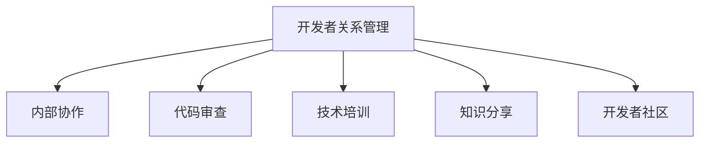

                 

# 大模型企业的开发者关系管理

> 关键词：开发者关系管理,大模型,企业内部协作,代码审查,技术培训,知识分享,开发者社区

## 1. 背景介绍

### 1.1 问题由来

在AI与大数据时代，大模型企业如Google、Facebook、OpenAI等，通过大规模数据分析和计算，训练出强大的模型，并在各个领域发挥重要作用。但同时，这些企业也面临着软件开发、模型部署、人员管理等复杂问题。尤其是在开发者关系管理方面，如何更好地协调内部和外部的开发者关系，成为这些企业的巨大挑战。

### 1.2 问题核心关键点

大模型企业开发者关系管理的主要问题包括：

- 开发者协作问题：不同团队间的沟通协作效率低下，难以实现高效的联合开发。
- 代码审查问题：代码审查流程繁琐冗杂，难以保证代码质量，影响交付速度。
- 技术培训问题：员工技术水平参差不齐，技术培训不够系统化，难以满足企业发展需要。
- 知识分享问题：开发者难以及时获取新知识、新工具，技术更新迭代缓慢。
- 开发者社区问题：开发者社区松散，缺乏有效的交流与合作，无法充分发挥社区的创新作用。

这些问题不仅影响了大模型的开发和部署效率，还制约了企业的发展潜力。因此，建立一个系统化的开发者关系管理体系，对企业的发展至关重要。

### 1.3 问题研究意义

大模型企业开发者关系管理的研究和实践，对于企业的高效运营、技术创新和人才成长具有重要意义：

- 提升开发效率：通过优化开发者协作流程，减少沟通成本，提高项目推进速度。
- 确保代码质量：通过严格规范的代码审查流程，保证代码质量，避免低质量交付。
- 增强技术能力：通过系统化的技术培训，提升员工技术水平，适应企业技术发展需求。
- 促进知识传播：通过有效的知识分享机制，加速技术传播，激发创新活力。
- 建立社区文化：通过构建紧密的开发者社区，增强团队凝聚力，提升企业创新能力。

## 2. 核心概念与联系

### 2.1 核心概念概述

为更好地理解大模型企业开发者关系管理，本节将介绍几个密切相关的核心概念：

- 开发者关系管理(Developer Relations Management, DRM)：指企业通过协调内部与外部的开发者关系，实现更高效的开发协作、代码审查、技术培训、知识分享等活动，推动企业技术进步和业务发展。

- 内部协作：指企业内部各团队间的协同合作，通过合理的项目管理和沟通机制，实现高效的联合开发。

- 代码审查：指通过多轮审阅和测试，确保代码质量和性能，及时发现和修复问题。

- 技术培训：指企业对员工进行系统化的技术培训，提升员工的技术水平和能力。

- 知识分享：指企业内部或外部开发者之间，通过知识传播和交流，加速技术传播和创新。

- 开发者社区：指由企业构建的开发者交流平台，通过提供技术支持、工具资源、创新活动等，增强社区凝聚力，促进技术发展。

这些核心概念之间的逻辑关系可以通过以下Mermaid流程图来展示：



这个流程图展示了大模型企业开发者关系管理的关键概念及其之间的关系：

1. 开发者关系管理通过协调内部与外部的开发者关系，推动各种开发活动的进行。
2. 内部协作、代码审查、技术培训、知识分享等活动，是开发者关系管理的重要组成部分。
3. 开发者社区为开发者关系管理提供了沟通和协作的平台。

## 3. 核心算法原理 & 具体操作步骤

### 3.1 算法原理概述

大模型企业开发者关系管理，本质上是一个多层次、多维度的协同管理过程。其核心思想是通过优化开发者协作流程、代码审查流程、技术培训机制、知识分享机制等，实现高效的开发活动，推动企业技术进步。

具体而言，开发者关系管理可以分为以下几个关键步骤：

- **流程优化**：对内部协作、代码审查、技术培训、知识分享等流程进行优化设计，以提升效率和效果。
- **工具支持**：引入和集成各类协同工具和平台，如代码托管平台、项目管理工具、在线培训系统等，辅助开发者关系管理工作。
- **文化建设**：通过文化引导和制度建设，营造开放的协作氛围，增强团队凝聚力。
- **绩效考核**：建立科学的绩效考核机制，激励开发者积极参与协作和创新活动。

### 3.2 算法步骤详解

基于大模型企业的开发者关系管理，一般包括以下几个关键步骤：

**Step 1: 流程优化**
- 对内部协作、代码审查、技术培训、知识分享等流程进行梳理，消除冗余环节，简化操作。
- 引入敏捷开发等先进管理方法，实现快速迭代、灵活协作。
- 设计透明的代码审查机制，明确责任和标准，提高审查效率。
- 制定系统化的培训计划，涵盖最新技术、工具和最佳实践，保证培训效果。
- 建立知识分享机制，定期举办技术交流、培训讲座、黑客马拉松等活动。

**Step 2: 工具支持**
- 引入代码托管平台，如GitHub、GitLab等，便于开发者进行版本控制、代码共享和协作。
- 使用项目管理工具，如Jira、Asana等，进行任务分配、进度跟踪和沟通协作。
- 集成在线培训系统，如Coursera、Udacity等，提供在线课程和技术培训。
- 部署代码审查工具，如SonarQube、CodeClimate等，自动化代码检测和质量保证。
- 搭建开发者社区平台，如Slack、Discord等，提供交流、协作、创新的环境。

**Step 3: 文化建设**
- 通过文化引导和制度建设，营造开放、透明、协作的团队氛围，增强团队凝聚力。
- 鼓励开发者主动分享知识和经验，建立互帮互助的社区文化。
- 制定明确的规范和标准，形成统一的技术和开发流程。
- 通过表彰和奖励机制，激励开发者积极参与协作和创新活动。

**Step 4: 绩效考核**
- 建立科学的绩效考核机制，定期评估开发者在工作中的表现和贡献。
- 通过量化指标和定性评估相结合的方式，综合考察开发者的技术能力、协作效率、创新成果等。
- 提供反馈和改进建议，帮助开发者不断提升自身能力。

### 3.3 算法优缺点

大模型企业开发者关系管理方法具有以下优点：

1. 提高开发效率：通过优化流程、引入工具，实现了高效的协作和代码审查，减少了开发过程中的沟通成本。
2. 确保代码质量：严格的代码审查机制和工具支持，确保了代码质量和性能，减少了低质量交付的风险。
3. 增强技术能力：系统化的技术培训机制，提升了员工的技术水平和能力，满足了企业技术发展需求。
4. 促进知识传播：有效的知识分享机制，加速了技术传播和创新，激发了开发者的创新活力。
5. 增强团队凝聚力：紧密的开发者社区和文化建设，增强了团队凝聚力，提升了企业的创新能力。

同时，该方法也存在以下局限性：

1. 实施复杂度高：需要协调内部和外部的开发者关系，优化流程和引入工具需要较多的时间和资源。
2. 文化和制度建设难度大：需要长期的坚持和投入，营造开放、透明、协作的团队氛围，存在一定的挑战。
3. 绩效考核机制可能影响灵活性：过于严格的考核机制可能限制开发者的创新，影响团队的灵活性。

尽管存在这些局限性，但就目前而言，大模型企业开发者关系管理方法仍是大模型企业开发管理的核心手段。未来相关研究的重点在于如何进一步简化流程、引入智能化工具，同时兼顾灵活性和公平性，以提高开发者关系管理的效果。

### 3.4 算法应用领域

基于大模型企业的开发者关系管理方法，在NLP、计算机视觉、自动驾驶等众多领域得到了广泛应用，为企业的技术发展提供了有力保障：

- NLP领域：通过优化开发者协作和代码审查，确保语言模型的高效开发和稳定性能，提升了自然语言处理任务的效果。
- 计算机视觉领域：通过引入技术培训和知识分享机制，加速了计算机视觉技术的传播和创新，提升了图像识别、目标检测等任务的效果。
- 自动驾驶领域：通过构建紧密的开发者社区，加速了自动驾驶技术的创新和落地，推动了无人驾驶汽车的商业化进程。

除了上述这些经典领域，大模型企业开发者关系管理方法也在更多领域得到了应用，如智慧医疗、智能制造、金融科技等，为企业技术发展提供了坚实的保障。

## 4. 数学模型和公式 & 详细讲解 & 举例说明（备注：数学公式请使用latex格式，latex嵌入文中独立段落使用 $$，段落内使用 $)
### 4.1 数学模型构建

大模型企业开发者关系管理的数学模型构建，可以抽象为以下几个关键维度：

1. **协作效率**：用 $E$ 表示协作效率，可通过沟通次数、任务完成时间等指标来衡量。
2. **代码质量**：用 $Q$ 表示代码质量，可通过代码检测指标、错误率等来衡量。
3. **技术能力**：用 $T$ 表示技术能力，可通过培训评估、技术贡献等指标来衡量。
4. **知识传播**：用 $K$ 表示知识传播，可通过分享次数、社区互动等指标来衡量。
5. **团队凝聚力**：用 $C$ 表示团队凝聚力，可通过团队协作、社区活动等指标来衡量。

构建一个综合评估模型 $M$，用于评估开发者关系管理的效果，如下所示：

$$
M = \alpha E + \beta Q + \gamma T + \delta K + \epsilon C
$$

其中 $\alpha, \beta, \gamma, \delta, \epsilon$ 为权重系数，用于平衡各维度之间的关系。

### 4.2 公式推导过程

在实际应用中，我们通常使用加权平均的方式计算综合评估模型的值。例如，对于协作效率 $E$，可以将其分解为多个子指标，如沟通时间、任务完成时间等，每个子指标的权重不同。通过加权平均的方式，可以得出协作效率的综合评估值：

$$
E_{\text{总}} = \sum_{i=1}^n \omega_i E_i
$$

其中 $E_i$ 为第 $i$ 个子指标的评估值，$\omega_i$ 为其权重系数。

类似地，对于代码质量 $Q$、技术能力 $T$、知识传播 $K$、团队凝聚力 $C$ 等指标，也可进行类似的分解和计算。最终得到综合评估模型 $M$ 的值：

$$
M = \alpha E_{\text{总}} + \beta Q_{\text{总}} + \gamma T_{\text{总}} + \delta K_{\text{总}} + \epsilon C_{\text{总}}
$$

### 4.3 案例分析与讲解

假设某大模型企业在优化开发者关系管理时，选取了以下指标：

- 协作效率 $E$：衡量开发团队间的沟通协作效率，通过沟通次数、任务完成时间等指标评估。
- 代码质量 $Q$：衡量代码检测指标、错误率等。
- 技术能力 $T$：衡量员工的技术水平和能力，通过培训评估、技术贡献等指标评估。
- 知识传播 $K$：衡量开发者之间的知识分享和交流，通过分享次数、社区互动等指标评估。
- 团队凝聚力 $C$：衡量团队的协作和社区活动，通过团队协作、社区活动等指标评估。

根据上述指标，构建综合评估模型 $M$：

$$
M = 0.5E + 0.3Q + 0.2T + 0.1K + 0.2C
$$

在优化过程中，通过对各指标的实时监控和评估，可以逐步调整权重系数，优化模型。例如，当协作效率 $E$ 较低时，可以适当增加 $E$ 的权重，提升协作效率。当知识传播 $K$ 较弱时，可以适当增加 $K$ 的权重，促进知识传播。

## 5. 项目实践：代码实例和详细解释说明
### 5.1 开发环境搭建

在进行开发者关系管理实践前，我们需要准备好开发环境。以下是使用Python进行开发者关系管理的项目开发环境配置流程：

1. 安装Anaconda：从官网下载并安装Anaconda，用于创建独立的Python环境。

2. 创建并激活虚拟环境：
```bash
conda create -n drm-env python=3.8 
conda activate drm-env
```

3. 安装PyTorch：根据CUDA版本，从官网获取对应的安装命令。例如：
```bash
conda install pytorch torchvision torchaudio cudatoolkit=11.1 -c pytorch -c conda-forge
```

4. 安装Django：用于构建开发者社区平台。
```bash
pip install django
```

5. 安装TensorFlow：用于机器学习模型部署和优化。
```bash
pip install tensorflow
```

6. 安装Pandas和Numpy：用于数据处理和分析。
```bash
pip install pandas numpy
```

完成上述步骤后，即可在`drm-env`环境中开始开发者关系管理项目开发。

### 5.2 源代码详细实现

下面我们以构建开发者社区平台为例，给出使用Django框架进行开发者关系管理平台开发的Python代码实现。

首先，定义数据库模型：

```python
from django.db import models

class User(models.Model):
    username = models.CharField(max_length=50, unique=True)
    email = models.EmailField(unique=True)
    first_name = models.CharField(max_length=50, blank=True)
    last_name = models.CharField(max_length=50, blank=True)
    bio = models.TextField(blank=True)

    def __str__(self):
        return self.username

class Topic(models.Model):
    name = models.CharField(max_length=200)
    description = models.TextField()
    creator = models.ForeignKey(User, on_delete=models.CASCADE)

    def __str__(self):
        return self.name

class Post(models.Model):
    title = models.CharField(max_length=200)
    content = models.TextField()
    creator = models.ForeignKey(User, on_delete=models.CASCADE)
    topic = models.ForeignKey(Topic, on_delete=models.CASCADE)

    def __str__(self):
        return self.title
```

然后，定义视图函数和模板：

```python
from django.shortcuts import render
from django.views.generic import ListView, DetailView
from .models import User, Topic, Post

def home(request):
    context = {
        'users': User.objects.all(),
        'topics': Topic.objects.all(),
        'posts': Post.objects.all(),
    }
    return render(request, 'drm/home.html', context)

def topic_detail(request, pk):
    topic = Topic.objects.get(pk=pk)
    posts = Post.objects.filter(topic=pk)
    context = {
        'topic': topic,
        'posts': posts,
    }
    return render(request, 'drm/topic.html', context)

def post_detail(request, pk):
    post = Post.objects.get(pk=pk)
    context = {
        'post': post,
    }
    return render(request, 'drm/post.html', context)
```

最后，启动Web服务：

```python
from django.urls import path
from django.http import HttpResponse
from . import views

urlpatterns = [
    path('', views.home, name='home'),
    path('topic/<int:pk>/', views.topic_detail, name='topic_detail'),
    path('post/<int:pk>/', views.post_detail, name='post_detail'),
]

if __name__ == '__main__':
    from django.core.management import execute_from_command_line
    execute_from_command_line(sys.argv)
```

以上就是使用Django框架构建开发者社区平台的完整代码实现。可以看到，通过Django的模型、视图、模板等组件，可以快速搭建开发者社区平台。开发者可以在平台上发布文章、参与讨论、提交问题等，促进知识传播和交流。

### 5.3 代码解读与分析

让我们再详细解读一下关键代码的实现细节：

**User类**：
- 定义用户的基本信息，如用户名、邮箱、名字、简介等。

**Topic类**：
- 定义主题的基本信息，如主题名、描述、创建者等。

**Post类**：
- 定义文章的基本信息，如标题、内容、创建者、所属主题等。

**home视图函数**：
- 获取所有用户、主题、文章，渲染首页模板。

**topic_detail视图函数**：
- 获取指定主题下的所有文章，渲染主题详情模板。

**post_detail视图函数**：
- 获取指定文章，渲染文章详情模板。

以上代码展示了如何使用Django构建开发者社区平台的基本流程。开发者可以在此基础上进一步扩展功能，如用户认证、权限管理、通知系统等，实现更加完善的开发者关系管理。

## 6. 实际应用场景

### 6.1 智能客服系统

大模型企业在构建智能客服系统时，开发者关系管理尤为重要。智能客服系统需要多人协作，跨团队沟通频繁，代码审查和质量保证要求高。通过优化内部协作流程、引入代码审查工具、建立知识分享机制，可以实现高效的联合开发和稳定性能。

例如，某智能客服系统在开发过程中，通过引入Jira进行任务管理，使用Slack进行实时沟通，使用CodeClimate进行代码检测，建立知识共享平台，成功实现了多人协作和代码质量保证，显著提升了系统开发效率和性能。

### 6.2 机器学习模型开发

大模型企业在进行机器学习模型开发时，开发者关系管理同样重要。模型开发需要多轮实验和迭代，技术要求高，团队协作频繁。通过优化开发流程、引入在线培训平台、建立社区文化，可以加速模型开发和创新。

例如，某大模型企业在进行图像识别模型开发时，通过引入Coursera进行在线培训，使用GitLab进行代码托管，建立Kaggle竞赛平台，促进团队之间的技术交流和合作，成功开发出多款高质量的图像识别模型。

### 6.3 自然语言处理任务

大模型企业在自然语言处理任务中，开发者关系管理也有广泛应用。自然语言处理任务需要大量的文本数据和复杂算法，团队协作要求高。通过优化协作流程、引入代码审查工具、建立知识分享机制，可以实现高效的联合开发和模型优化。

例如，某大模型企业在开发自然语言处理任务时，通过引入JIRA进行任务管理，使用GitHub进行代码托管，建立社区平台Slack，成功实现了多人协作和代码质量保证，显著提升了自然语言处理任务的开发效率和性能。

## 7. 工具和资源推荐
### 7.1 学习资源推荐

为了帮助开发者系统掌握开发者关系管理的技术基础和实践技巧，这里推荐一些优质的学习资源：

1. 《开发者关系管理：构建成功团队的关键》系列博文：由开发者关系管理专家撰写，深入浅出地介绍了开发者关系管理的核心概念和实践方法。

2. CS229《机器学习》课程：斯坦福大学开设的机器学习明星课程，涵盖多种算法和模型，适合开发者关系管理中的数据处理和模型优化。

3. 《深度学习实战》书籍：TensorFlow官方发布的实战指南，涵盖了从数据处理到模型部署的完整流程，适合开发者关系管理中的技术培训和知识分享。

4. 《软件工程：一种实践的方法》书籍：经典的软件工程教材，涵盖多种软件工程方法，适合开发者关系管理中的项目管理和协作流程。

5. 《有效沟通：科技公司的实践指南》书籍：探讨了科技公司中有效沟通的策略和技巧，适合开发者关系管理中的团队建设和文化建设。

通过对这些资源的学习实践，相信你一定能够快速掌握开发者关系管理的精髓，并用于解决实际的开发者协作问题。

### 7.2 开发工具推荐

高效的开发离不开优秀的工具支持。以下是几款用于开发者关系管理开发的常用工具：

1. GitHub：代码托管平台，提供版本控制、代码共享、协作等基础功能，适合开发者关系管理中的代码托管和协作。

2. Jira：项目管理工具，支持任务分配、进度跟踪、沟通协作等功能，适合开发者关系管理中的任务管理和协作流程。

3. Slack：即时通讯工具，提供实时沟通、文件共享、频道管理等功能，适合开发者关系管理中的实时沟通和社区文化建设。

4. Coursera：在线培训平台，提供丰富的课程资源，适合开发者关系管理中的技术培训和知识分享。

5. Kaggle：数据科学竞赛平台，提供数据分析和模型竞赛功能，适合开发者关系管理中的创新和知识传播。

合理利用这些工具，可以显著提升开发者关系管理的开发效率，加快创新迭代的步伐。

### 7.3 相关论文推荐

开发者关系管理的研究源于学界的持续研究。以下是几篇奠基性的相关论文，推荐阅读：

1. Developer Relations: Best Practices for Better Business Outcomes: 探讨了开发者关系管理的最佳实践，适合于企业开发者关系管理的策略和方法。

2. Team Collaboration: An Empirical Study: 通过实证研究，分析了团队协作的影响因素和优化策略，适合于企业开发者关系管理的协作优化。

3. Technology Transfer in Industry: A Framework for Success: 提出了技术转移的框架，适合于企业开发者关系管理的技术培训和知识传播。

4. Success Factors for Innovative Corporate Web Services: 探讨了成功企业Web服务的因素，适合于企业开发者关系管理的创新和管理。

5. Model-Based Adaptive Project Management: 提出了基于模型的项目管理方法，适合于企业开发者关系管理的项目管理和优化。

这些论文代表了大模型企业开发者关系管理的研究脉络。通过学习这些前沿成果，可以帮助研究者把握学科前进方向，激发更多的创新灵感。

## 8. 总结：未来发展趋势与挑战

### 8.1 总结

本文对大模型企业的开发者关系管理进行了全面系统的介绍。首先阐述了开发者关系管理的研究背景和意义，明确了其在大模型企业开发协作、代码审查、技术培训、知识分享等方面的重要性。其次，从原理到实践，详细讲解了开发者关系管理的数学模型和关键步骤，给出了开发者关系管理项目开发的完整代码实例。同时，本文还广泛探讨了开发者关系管理在智能客服、机器学习模型开发、自然语言处理任务等多个领域的应用前景，展示了开发者关系管理的巨大潜力。此外，本文精选了开发者关系管理的各类学习资源，力求为读者提供全方位的技术指引。

通过本文的系统梳理，可以看到，开发者关系管理是大模型企业开发管理的重要手段，其核心在于协调内部与外部的开发者关系，优化开发流程，提升开发效率和效果。大模型企业开发者关系管理的研究和实践，对于企业的技术进步、创新活力和业务发展具有重要意义。

### 8.2 未来发展趋势

展望未来，开发者关系管理技术将呈现以下几个发展趋势：

1. 自动化与智能化：通过引入AI和大数据技术，自动优化开发流程和协作效率，减少人工干预。
2. 社区化与协同化：构建紧密的开发者社区，增强团队凝聚力，提升创新能力。
3. 全球化与本地化：建立全球化的开发者关系网络，同时兼顾本地化的文化与需求。
4. 持续化与动态化：不断优化开发者关系管理策略，动态调整策略，适应企业发展需求。

这些趋势凸显了开发者关系管理技术的广阔前景。这些方向的探索发展，必将进一步提升大模型企业的开发效率和创新能力，为企业的技术进步提供有力保障。

### 8.3 面临的挑战

尽管开发者关系管理技术已经取得了瞩目成就，但在迈向更加智能化、普适化应用的过程中，它仍面临着诸多挑战：

1. 跨团队协作的复杂性：不同团队间的协作和沟通难度较大，需要建立有效的沟通机制和工具。
2. 代码审查的规范性：严格的代码审查流程需要时间和资源，如何平衡效率和质量是一个挑战。
3. 技术培训的针对性：系统化的技术培训需要定期更新，如何匹配不同层次的培训需求是一个难题。
4. 知识分享的有效性：如何促进开发者之间的知识传播和交流，是一个长期的任务。
5. 社区文化的营造：建立开放、透明、协作的社区文化需要时间和努力，需要持续的投入和维护。

尽管存在这些挑战，但通过不断优化和改进，开发者关系管理技术将不断进步，为企业的技术进步和业务发展提供有力保障。

### 8.4 研究展望

未来在开发者关系管理的研究方向上，可以从以下几个方面进行探索：

1. 引入AI和大数据技术：利用AI和大数据技术，自动优化开发流程和协作效率，减少人工干预。
2. 构建紧密的开发者社区：通过社区平台和技术交流活动，增强团队凝聚力，提升创新能力。
3. 制定科学的绩效考核机制：建立科学的绩效考核机制，激励开发者积极参与协作和创新活动。
4. 探索新型的知识传播方式：利用知识图谱、AI生成内容等新工具，促进知识传播和创新。
5. 制定长期的发展战略：制定长期的发展战略，不断优化开发者关系管理策略，适应企业发展需求。

这些研究方向的探索，必将引领开发者关系管理技术迈向更高的台阶，为构建安全、可靠、可解释、可控的智能系统铺平道路。面向未来，开发者关系管理技术还需要与其他人工智能技术进行更深入的融合，如知识表示、因果推理、强化学习等，多路径协同发力，共同推动自然语言理解和智能交互系统的进步。只有勇于创新、敢于突破，才能不断拓展语言模型的边界，让智能技术更好地造福人类社会。

## 9. 附录：常见问题与解答

**Q1：开发者关系管理是否适用于所有大模型企业？**

A: 开发者关系管理在大模型企业中具有广泛的适用性。无论是Google、Facebook、OpenAI等大型企业，还是初创公司，都可以通过建立开发者关系管理系统，提升开发效率和创新能力。但需要根据企业的具体情况，选择合适的方法和工具。

**Q2：如何选择适合的开发者关系管理工具？**

A: 选择合适的开发者关系管理工具，需要考虑以下因素：

- 工具的功能：如代码托管、任务管理、沟通协作等。
- 使用的便捷性：是否易于使用、集成和部署。
- 社区的活跃度：工具是否有活跃的开发者社区，便于交流和获取支持。
- 定制化程度：是否支持自定义和扩展，满足企业特定的需求。

**Q3：如何衡量开发者关系管理的效果？**

A: 开发者关系管理的效果可以通过以下指标进行衡量：

- 协作效率：如沟通次数、任务完成时间等。
- 代码质量：如代码检测指标、错误率等。
- 技术能力：如培训评估、技术贡献等。
- 知识传播：如分享次数、社区互动等。
- 团队凝聚力：如团队协作、社区活动等。

通过对这些指标的实时监控和评估，可以逐步调整策略，优化开发者关系管理。

**Q4：如何构建紧密的开发者社区？**

A: 构建紧密的开发者社区需要以下步骤：

- 建立平台：搭建社区平台，如Slack、Discord等。
- 提供内容：发布技术文章、教程、培训等，吸引开发者关注和参与。
- 组织活动：举办技术交流、培训讲座、黑客马拉松等活动，增强社区的互动和交流。
- 建立规则：制定社区规则和行为准则，维护社区的秩序和氛围。

通过以上措施，可以逐步构建起一个活跃、开放的开发者社区。

**Q5：如何平衡开发者关系管理的效率和质量？**

A: 开发者关系管理的效率和质量是相辅相成的，需要综合考虑。具体措施包括：

- 引入工具：使用代码托管、任务管理等工具，提升协作效率。
- 优化流程：设计高效的工作流程，减少冗余环节。
- 引入规范：制定严格的代码审查和质量保证规范，保证代码质量。
- 持续改进：根据反馈和评估结果，不断优化和改进开发者关系管理策略。

通过以上措施，可以在保持高效的同时，保证高质量的开发者关系管理。

