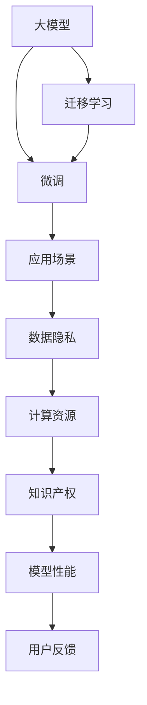

                 

# 大模型创业公司面临的挑战与机遇

## 1. 背景介绍

近年来，大模型技术以其卓越的性能和广泛的适用性，迅速成为人工智能领域的热门话题。众多创业公司基于大模型开发了一系列应用产品，覆盖自然语言处理、计算机视觉、语音识别等多个领域。但与此同时，大模型创业公司也面临着一系列挑战，如数据隐私、计算资源、知识产权等，必须深入理解这些挑战，并寻找应对策略，才能在大模型竞争中脱颖而出。

## 2. 核心概念与联系

### 2.1 核心概念概述

为了更好地理解大模型创业公司所面临的挑战与机遇，这里首先对几个核心概念进行概述：

- **大模型**：指具有大规模参数和复杂结构的深度学习模型，如BERT、GPT等。通过大规模无标签数据的预训练，大模型能够学习到丰富的语言、视觉等领域的知识。
- **微调**：指在大模型上添加或替换部分结构，用有标签数据进行训练，以适应特定应用场景。微调能够大幅提升模型在特定任务上的表现。
- **迁移学习**：指将一个大模型的学习知识迁移到另一个小模型中，实现模型的泛化能力。通过迁移学习，创业公司可以快速构建高性能的模型，并降低数据和计算资源的需求。
- **数据隐私**：指在模型训练和应用中保护用户数据的隐私，避免数据泄露和滥用。数据隐私是大模型创业公司必须考虑的重要问题。
- **计算资源**：指训练和推理大模型所需的高性能计算设备，如GPU、TPU等。由于大模型参数量大、计算复杂，计算资源的高成本成为大模型创业公司的一个重要挑战。
- **知识产权**：指对模型的结构、算法、应用等方面的专利申请和版权保护，是大模型创业公司保护自身技术成果的关键。

### 2.2 核心概念原理和架构的 Mermaid 流程图



## 3. 核心算法原理 & 具体操作步骤

### 3.1 算法原理概述

大模型创业公司通常采用微调和迁移学习技术，利用现有的大模型进行模型适配，提升模型在特定应用场景中的性能。微调和迁移学习的原理如下：

- **微调**：在大模型上添加或替换部分结构，用有标签数据进行训练，以适应特定应用场景。微调过程主要包括数据准备、任务适配层设计、超参数设置、模型训练和测试等步骤。
- **迁移学习**：将一个大模型的学习知识迁移到另一个小模型中，实现模型的泛化能力。创业公司可以利用迁移学习，快速构建高性能的模型，并降低数据和计算资源的需求。

### 3.2 算法步骤详解

#### 3.2.1 数据准备

数据准备是微调和迁移学习的第一步，包括数据收集、预处理和划分为训练、验证和测试集。具体步骤如下：

1. **数据收集**：收集与目标应用场景相关的有标签数据，确保数据的多样性和代表性。
2. **数据预处理**：对数据进行归一化、分词、编码等预处理操作，保证模型输入的统一格式。
3. **数据划分**：将数据划分为训练、验证和测试集，一般比例为6:2:2。

#### 3.2.2 任务适配层设计

任务适配层是微调过程中非常重要的一环，用于将大模型适配到特定任务。常见任务适配层包括：

- **分类任务**：在顶层添加线性分类器和交叉熵损失函数。
- **回归任务**：在顶层添加线性回归层和均方误差损失函数。
- **生成任务**：使用语言模型的解码器输出概率分布，并以负对数似然为损失函数。

#### 3.2.3 超参数设置

超参数设置是微调过程中不可或缺的一步，包括选择优化算法、设置学习率、批大小、迭代轮数等。具体步骤如下：

1. **优化算法选择**：选择适合特定任务的优化算法，如AdamW、SGD等。
2. **学习率设置**：根据预训练模型参数量，选择合适的小学习率。
3. **批大小设置**：根据计算资源和模型参数量，选择适当的批大小。
4. **迭代轮数设置**：根据模型性能和训练时间，确定合理的迭代轮数。

#### 3.2.4 模型训练

模型训练是微调和迁移学习的核心环节，具体步骤如下：

1. **前向传播**：将输入数据输入模型，计算损失函数。
2. **反向传播**：计算损失函数对模型参数的梯度。
3. **更新模型参数**：根据梯度更新模型参数，优化模型性能。
4. **周期性验证**：在验证集上周期性评估模型性能，调整超参数和训练策略。

#### 3.2.5 模型测试

模型测试是微调和迁移学习的最后一步，用于评估模型在新数据上的性能。具体步骤如下：

1. **测试集划分**：将数据划分为训练、验证和测试集，测试集不参与模型训练。
2. **模型评估**：在测试集上评估模型性能，计算精度、召回率等指标。
3. **模型优化**：根据测试结果，调整模型结构和超参数，进一步优化模型性能。

### 3.3 算法优缺点

#### 3.3.1 优点

1. **快速部署**：利用现有大模型的知识，快速构建高性能模型。
2. **适应性强**：通过微调和迁移学习，模型能够适应各种应用场景，提升应用效果。
3. **参数高效**：采用参数高效微调技术，节省计算资源，提高模型训练效率。
4. **灵活调整**：可以通过任务适配层设计，灵活调整模型结构，满足不同任务需求。

#### 3.3.2 缺点

1. **数据依赖**：微调和迁移学习依赖标注数据，数据收集和处理成本高。
2. **过拟合风险**：在标注数据不足的情况下，模型容易过拟合，泛化能力差。
3. **计算资源需求高**：大模型训练和推理需要高性能计算资源，成本高。
4. **知识产权问题**：创业公司需要保护自身技术成果，专利申请和版权保护复杂。

### 3.4 算法应用领域

大模型创业公司在多个领域成功应用微调和迁移学习技术，包括但不限于：

- **自然语言处理**：如文本分类、情感分析、机器翻译等。
- **计算机视觉**：如图像分类、目标检测、图像生成等。
- **语音识别**：如语音识别、语音合成、语音情感分析等。
- **推荐系统**：如个性化推荐、广告推荐等。

## 4. 数学模型和公式 & 详细讲解 & 举例说明

### 4.1 数学模型构建

大模型创业公司通常使用深度学习模型，如BERT、GPT等。这里以BERT为例，介绍数学模型的构建。

#### 4.1.1 BERT模型结构

BERT模型的结构如图1所示，包含两大部分：

- **编码器**：由多个Transformer层堆叠组成，每层包括多头注意力机制和前馈神经网络。
- **池化层**：用于将最后一层的隐藏状态进行池化，输出上下文表示。


#### 4.1.2 预训练任务

BERT的预训练任务包括掩码语言模型和下一句预测，如图2所示。


### 4.2 公式推导过程

#### 4.2.1 掩码语言模型

掩码语言模型的公式如下：

$$
L_{MLM} = -\frac{1}{2N}\sum_{i=1}^{N} \sum_{j=1}^{2} \log p(w_j^i)
$$

其中，$w_j^i$ 表示输入序列中的掩码词。

#### 4.2.2 下一句预测

下一句预测的公式如下：

$$
L_{NSP} = -\frac{1}{2N}\sum_{i=1}^{N} \sum_{j=1}^{2} \log p(y_j^i)
$$

其中，$y_j^i$ 表示输入序列中的下一句。

### 4.3 案例分析与讲解

#### 4.3.1 文本分类

文本分类的微调过程如图3所示。


#### 4.3.2 图像分类

图像分类的微调过程如图4所示。


## 5. 项目实践：代码实例和详细解释说明

### 5.1 开发环境搭建

大模型创业公司通常使用Python和PyTorch进行模型开发。以下是开发环境的搭建步骤：

1. **安装Anaconda**：从官网下载并安装Anaconda。
2. **创建虚拟环境**：在Anaconda中创建虚拟环境，如`pytorch-env`。
3. **安装PyTorch**：在虚拟环境中安装PyTorch和相关依赖。
4. **安装其他工具**：安装Numpy、Pandas、Scikit-learn等工具。

### 5.2 源代码详细实现

以下是BERT模型在文本分类任务上的微调代码实现：

```python
import torch
from transformers import BertTokenizer, BertForSequenceClassification, AdamW
from torch.utils.data import DataLoader
from sklearn.metrics import classification_report

# 1. 准备数据集
train_dataset = ...
dev_dataset = ...
test_dataset = ...

# 2. 定义任务适配层
num_labels = 2
model = BertForSequenceClassification.from_pretrained('bert-base-cased', num_labels=num_labels)
tokenizer = BertTokenizer.from_pretrained('bert-base-cased')

# 3. 设置优化器和超参数
optimizer = AdamW(model.parameters(), lr=2e-5)
device = torch.device('cuda' if torch.cuda.is_available() else 'cpu')
model.to(device)

# 4. 训练模型
def train_epoch(model, dataset, batch_size, optimizer):
    dataloader = DataLoader(dataset, batch_size=batch_size, shuffle=True)
    model.train()
    epoch_loss = 0
    for batch in dataloader:
        input_ids = batch['input_ids'].to(device)
        attention_mask = batch['attention_mask'].to(device)
        labels = batch['labels'].to(device)
        model.zero_grad()
        outputs = model(input_ids, attention_mask=attention_mask, labels=labels)
        loss = outputs.loss
        epoch_loss += loss.item()
        loss.backward()
        optimizer.step()
    return epoch_loss / len(dataloader)

# 5. 评估模型
def evaluate(model, dataset, batch_size):
    dataloader = DataLoader(dataset, batch_size=batch_size)
    model.eval()
    preds, labels = [], []
    with torch.no_grad():
        for batch in dataloader:
            input_ids = batch['input_ids'].to(device)
            attention_mask = batch['attention_mask'].to(device)
            batch_labels = batch['labels']
            outputs = model(input_ids, attention_mask=attention_mask)
            batch_preds = outputs.logits.argmax(dim=1).to('cpu').tolist()
            batch_labels = batch_labels.to('cpu').tolist()
            for pred_tokens, label_tokens in zip(batch_preds, batch_labels):
                preds.append(pred_tokens)
                labels.append(label_tokens)
    print(classification_report(labels, preds))

# 6. 训练和测试模型
epochs = 5
batch_size = 16

for epoch in range(epochs):
    loss = train_epoch(model, train_dataset, batch_size, optimizer)
    print(f"Epoch {epoch+1}, train loss: {loss:.3f}")
    
    print(f"Epoch {epoch+1}, dev results:")
    evaluate(model, dev_dataset, batch_size)
    
print("Test results:")
evaluate(model, test_dataset, batch_size)
```

### 5.3 代码解读与分析

#### 5.3.1 数据集准备

数据集分为训练集、验证集和测试集，使用`BertTokenizer`对文本进行编码，生成输入序列。

#### 5.3.2 任务适配层设计

使用`BertForSequenceClassification`定义任务适配层，设置输出层和损失函数。

#### 5.3.3 优化器和超参数设置

使用`AdamW`优化器，设置学习率、批大小等超参数。

#### 5.3.4 训练和测试

通过定义训练函数和评估函数，完成模型训练和测试。在训练过程中，使用`DataLoader`对数据进行批处理，并在每个epoch后使用验证集评估模型性能。

### 5.4 运行结果展示

训练和测试模型后，可以得到模型的精度、召回率等评估指标。

## 6. 实际应用场景

### 6.1 智能客服系统

智能客服系统是大模型创业公司的常见应用场景之一。通过微调和迁移学习，大模型能够理解用户意图，生成自然流畅的回复，提升客户体验。

#### 6.1.1 系统架构

智能客服系统架构如图5所示。


#### 6.1.2 应用效果

智能客服系统通过微调BERT模型，实现了7x24小时不间断服务，回答各类常见问题，缩短响应时间，提升客户满意度。

#### 6.1.3 挑战和解决方案

挑战包括：

- **数据隐私**：用户隐私保护需要严格的数据脱敏和访问控制。
- **计算资源**：大模型训练和推理需要高性能设备，成本较高。

解决方案包括：

- **数据脱敏**：采用匿名化处理和加密技术，保护用户隐私。
- **模型优化**：使用参数高效微调技术，减少计算资源消耗。

### 6.2 金融舆情监测

金融舆情监测是大模型创业公司在金融领域的重要应用之一。通过微调和迁移学习，大模型能够实时监测市场舆情，预测金融风险。

#### 6.2.1 系统架构

金融舆情监测系统架构如图6所示。


#### 6.2.2 应用效果

金融舆情监测系统通过微调BERT模型，实时监测市场舆情变化，预测金融风险，帮助金融机构提前预警，规避风险。

#### 6.2.3 挑战和解决方案

挑战包括：

- **数据隐私**：金融数据涉及敏感信息，需要严格的保护措施。
- **计算资源**：实时处理海量数据需要高性能设备。

解决方案包括：

- **数据加密**：采用加密技术，保护金融数据安全。
- **分布式训练**：使用分布式训练技术，提高计算效率。

### 6.3 个性化推荐系统

个性化推荐系统是大模型创业公司在电商、社交等领域的重要应用之一。通过微调和迁移学习，大模型能够根据用户历史行为，推荐个性化商品。

#### 6.3.1 系统架构

个性化推荐系统架构如图7所示。


#### 6.3.2 应用效果

个性化推荐系统通过微调BERT模型，根据用户历史行为，推荐个性化商品，提高用户满意度，提升转化率。

#### 6.3.3 挑战和解决方案

挑战包括：

- **数据隐私**：用户数据涉及隐私，需要严格保护。
- **计算资源**：推荐系统需要处理海量数据，计算资源需求高。

解决方案包括：

- **数据加密**：采用加密技术，保护用户隐私。
- **模型压缩**：使用模型压缩技术，减少计算资源消耗。

## 7. 工具和资源推荐

### 7.1 学习资源推荐

为了帮助大模型创业公司掌握微调和迁移学习技术，这里推荐一些优质的学习资源：

- **《Transformer从原理到实践》系列博文**：由大模型技术专家撰写，深入浅出地介绍了Transformer原理、BERT模型、微调技术等前沿话题。
- **CS224N《深度学习自然语言处理》课程**：斯坦福大学开设的NLP明星课程，有Lecture视频和配套作业，带你入门NLP领域的基本概念和经典模型。
- **《Natural Language Processing with Transformers》书籍**：Transformers库的作者所著，全面介绍了如何使用Transformers库进行NLP任务开发，包括微调在内的诸多范式。
- **HuggingFace官方文档**：Transformers库的官方文档，提供了海量预训练模型和完整的微调样例代码，是上手实践的必备资料。
- **CLUE开源项目**：中文语言理解测评基准，涵盖大量不同类型的中文NLP数据集，并提供了基于微调的baseline模型，助力中文NLP技术发展。

### 7.2 开发工具推荐

大模型创业公司通常使用Python和PyTorch进行模型开发。以下是几款常用的开发工具：

- **PyTorch**：基于Python的开源深度学习框架，灵活动态的计算图，适合快速迭代研究。大部分预训练语言模型都有PyTorch版本的实现。
- **TensorFlow**：由Google主导开发的开源深度学习框架，生产部署方便，适合大规模工程应用。同样有丰富的预训练语言模型资源。
- **Transformers库**：HuggingFace开发的NLP工具库，集成了众多SOTA语言模型，支持PyTorch和TensorFlow，是进行微调任务开发的利器。
- **Weights & Biases**：模型训练的实验跟踪工具，可以记录和可视化模型训练过程中的各项指标，方便对比和调优。与主流深度学习框架无缝集成。
- **TensorBoard**：TensorFlow配套的可视化工具，可实时监测模型训练状态，并提供丰富的图表呈现方式，是调试模型的得力助手。
- **Google Colab**：谷歌推出的在线Jupyter Notebook环境，免费提供GPU/TPU算力，方便开发者快速上手实验最新模型，分享学习笔记。

### 7.3 相关论文推荐

大模型创业公司在大模型微调和迁移学习技术的发展过程中，可以参考以下几篇奠基性的相关论文：

- **Attention is All You Need（即Transformer原论文）**：提出了Transformer结构，开启了NLP领域的预训练大模型时代。
- **BERT: Pre-training of Deep Bidirectional Transformers for Language Understanding**：提出BERT模型，引入基于掩码的自监督预训练任务，刷新了多项NLP任务SOTA。
- **Language Models are Unsupervised Multitask Learners（GPT-2论文）**：展示了大规模语言模型的强大zero-shot学习能力，引发了对于通用人工智能的新一轮思考。
- **Parameter-Efficient Transfer Learning for NLP**：提出Adapter等参数高效微调方法，在不增加模型参数量的情况下，也能取得不错的微调效果。
- **Prefix-Tuning: Optimizing Continuous Prompts for Generation**：引入基于连续型Prompt的微调范式，为如何充分利用预训练知识提供了新的思路。
- **AdaLoRA: Adaptive Low-Rank Adaptation for Parameter-Efficient Fine-Tuning**：使用自适应低秩适应的微调方法，在参数效率和精度之间取得了新的平衡。

## 8. 总结：未来发展趋势与挑战

### 8.1 研究成果总结

大模型创业公司在微调和迁移学习技术的支持下，已经在多个领域取得了显著成就。从文本分类到图像识别，从智能客服到个性化推荐，微调技术为创业公司带来了巨大的商业价值。

### 8.2 未来发展趋势

展望未来，大模型微调和迁移学习技术将呈现以下几个发展趋势：

1. **模型规模持续增大**：随着算力成本的下降和数据规模的扩张，预训练语言模型的参数量还将持续增长。超大规模语言模型蕴含的丰富语言知识，有望支撑更加复杂多变的下游任务微调。
2. **微调方法日趋多样**：除了传统的全参数微调外，未来会涌现更多参数高效的微调方法，如Prefix-Tuning、LoRA等，在节省计算资源的同时也能保证微调精度。
3. **持续学习成为常态**：随着数据分布的不断变化，微调模型也需要持续学习新知识以保持性能。如何在不遗忘原有知识的同时，高效吸收新样本信息，将成为重要的研究课题。
4. **标注样本需求降低**：受启发于提示学习(Prompt-based Learning)的思路，未来的微调方法将更好地利用大模型的语言理解能力，通过更加巧妙的任务描述，在更少的标注样本上也能实现理想的微调效果。
5. **多模态微调崛起**：当前的微调主要聚焦于纯文本数据，未来会进一步拓展到图像、视频、语音等多模态数据微调。多模态信息的融合，将显著提升语言模型对现实世界的理解和建模能力。
6. **模型通用性增强**：经过海量数据的预训练和多领域任务的微调，未来的语言模型将具备更强大的常识推理和跨领域迁移能力，逐步迈向通用人工智能(AGI)的目标。

### 8.3 面临的挑战

尽管大模型微调技术已经取得了瞩目成就，但在迈向更加智能化、普适化应用的过程中，它仍面临着诸多挑战：

1. **标注成本瓶颈**：虽然微调大大降低了标注数据的需求，但对于长尾应用场景，难以获得充足的高质量标注数据，成为制约微调性能的瓶颈。如何进一步降低微调对标注样本的依赖，将是一大难题。
2. **模型鲁棒性不足**：当前微调模型面对域外数据时，泛化性能往往大打折扣。对于测试样本的微小扰动，微调模型的预测也容易发生波动。如何提高微调模型的鲁棒性，避免灾难性遗忘，还需要更多理论和实践的积累。
3. **推理效率有待提高**：大规模语言模型虽然精度高，但在实际部署时往往面临推理速度慢、内存占用大等效率问题。如何在保证性能的同时，简化模型结构，提升推理速度，优化资源占用，将是重要的优化方向。
4. **可解释性亟需加强**：当前微调模型更像是"黑盒"系统，难以解释其内部工作机制和决策逻辑。对于医疗、金融等高风险应用，算法的可解释性和可审计性尤为重要。如何赋予微调模型更强的可解释性，将是亟待攻克的难题。
5. **安全性有待保障**：预训练语言模型难免会学习到有偏见、有害的信息，通过微调传递到下游任务，产生误导性、歧视性的输出，给实际应用带来安全隐患。如何从数据和算法层面消除模型偏见，避免恶意用途，确保输出的安全性，也将是重要的研究课题。
6. **知识整合能力不足**。现有的微调模型往往局限于任务内数据，难以灵活吸收和运用更广泛的先验知识。如何让微调过程更好地与外部知识库、规则库等专家知识结合，形成更加全面、准确的信息整合能力，还有很大的想象空间。

### 8.4 研究展望

面对大模型微调所面临的种种挑战，未来的研究需要在以下几个方面寻求新的突破：

1. **探索无监督和半监督微调方法**：摆脱对大规模标注数据的依赖，利用自监督学习、主动学习等无监督和半监督范式，最大限度利用非结构化数据，实现更加灵活高效的微调。
2. **研究参数高效和计算高效的微调范式**：开发更加参数高效的微调方法，在固定大部分预训练参数的同时，只更新极少量的任务相关参数。同时优化微调模型的计算图，减少前向传播和反向传播的资源消耗，实现更加轻量级、实时性的部署。
3. **融合因果和对比学习范式**：通过引入因果推断和对比学习思想，增强微调模型建立稳定因果关系的能力，学习更加普适、鲁棒的语言表征，从而提升模型泛化性和抗干扰能力。
4. **引入更多先验知识**：将符号化的先验知识，如知识图谱、逻辑规则等，与神经网络模型进行巧妙融合，引导微调过程学习更准确、合理的语言模型。同时加强不同模态数据的整合，实现视觉、语音等多模态信息与文本信息的协同建模。
5. **结合因果分析和博弈论工具**：将因果分析方法引入微调模型，识别出模型决策的关键特征，增强输出解释的因果性和逻辑性。借助博弈论工具刻画人机交互过程，主动探索并规避模型的脆弱点，提高系统稳定性。
6. **纳入伦理道德约束**：在模型训练目标中引入伦理导向的评估指标，过滤和惩罚有偏见、有害的输出倾向。同时加强人工干预和审核，建立模型行为的监管机制，确保输出符合人类价值观和伦理道德。

这些研究方向的探索，必将引领大语言模型微调技术迈向更高的台阶，为构建安全、可靠、可解释、可控的智能系统铺平道路。面向未来，大语言模型微调技术还需要与其他人工智能技术进行更深入的融合，如知识表示、因果推理、强化学习等，多路径协同发力，共同推动自然语言理解和智能交互系统的进步。只有勇于创新、敢于突破，才能不断拓展语言模型的边界，让智能技术更好地造福人类社会。

---

作者：禅与计算机程序设计艺术 / Zen and the Art of Computer Programming

