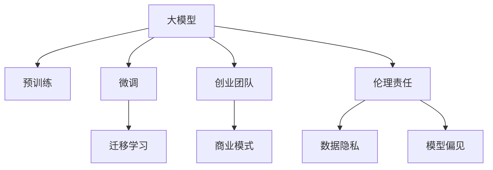

                 

# 大模型创业的波折与变化

> 关键词：
- 大模型
- 创业
- 人工智能
- 深度学习
- 数据驱动
- 应用落地

## 1. 背景介绍

### 1.1 问题由来
在AI创业的浩瀚海洋中，大模型无疑是一艘引人注目的航船。它凭借其在自然语言处理(NLP)、计算机视觉(CV)、语音识别(SR)等多个领域的优异表现，迅速成为AI应用领域的宠儿。但大模型创业并非一帆风顺，它面临的波折与变化，也反映了AI技术的曲折发展轨迹。

### 1.2 问题核心关键点
大模型创业的核心关键点主要包括以下几个方面：

- **技术实力**：构建高质量的大模型需要雄厚的技术积累，包括预训练、微调、优化等各个环节的技术突破。
- **数据获取**：数据的获取和标注是大模型训练的基础，优质、大规模的数据集是模型性能的保障。
- **应用场景**：模型在特定应用场景中的性能表现，是大模型能否商业化的关键。
- **市场竞争**：大模型创业同样面临激烈的市场竞争，需要找到自己的差异化竞争优势。
- **商业模式**：从技术到市场的转化，需要构建可行的商业模式，实现业务的可持续化发展。
- **伦理责任**：大模型处理大量用户数据，涉及隐私、偏见、歧视等伦理问题，如何平衡技术进步与伦理责任，是创业团队需要深思的问题。

这些关键点相互关联，共同影响着大模型的创业进程和未来发展。

## 2. 核心概念与联系

### 2.1 核心概念概述

为了更好地理解大模型创业的波折与变化，本节将介绍几个密切相关的核心概念：

- **大模型**：以Transformer、BERT、GPT等架构为代表的大规模预训练模型，具备强大的表示能力和泛化能力。
- **预训练(Pre-training)**：在大规模无标签数据上，通过自监督学习任务训练通用模型的过程。
- **微调(Fine-tuning)**：在预训练模型的基础上，使用特定任务的数据集进行有监督训练，优化模型在该任务上的性能。
- **迁移学习(Transfer Learning)**：将一个领域的知识迁移到另一个相关领域的学习方法，适用于预训练-微调的过程。
- **创业团队**：由技术、数据、市场、运营等多方面人才组成，共同推动大模型从实验室到市场的转化。
- **商业模式**：基于技术、市场、用户需求等要素，构建可持续发展的商业模式。
- **伦理责任**：在模型开发和使用过程中，承担起数据隐私、模型偏见等伦理问题，保障技术的健康发展。

这些概念之间的逻辑关系可以通过以下Mermaid流程图来展示：



这个流程图展示了大模型创业的核心概念及其之间的关系：

1. 大模型通过预训练获得基础能力。
2. 微调是对预训练模型进行任务特定的优化，可以提升模型在特定任务上的性能。
3. 迁移学习是将预训练知识应用于新领域的方法，适用于微调过程。
4. 创业团队驱动大模型的应用落地，构建商业模型。
5. 伦理责任是大模型应用的重要考量，保障数据隐私和模型公平。

## 3. 核心算法原理 & 具体操作步骤

### 3.1 算法原理概述

大模型创业的技术基础在于大模型的预训练和微调。其核心思想是：在大量无标签数据上进行预训练，学习通用的语言表示，然后在特定任务的数据集上进行有监督的微调，优化模型在该任务上的性能。

### 3.2 算法步骤详解

大模型创业的算法步骤主要包括以下几个关键环节：

**Step 1: 数据获取与处理**
- 收集高质量、大规模的训练数据集。
- 清洗、标注数据，构建可用的训练样本。
- 划分训练集、验证集、测试集，保证模型性能的评估和优化。

**Step 2: 模型训练**
- 选择合适的大模型架构，如BERT、GPT等。
- 在预训练数据集上进行大规模的预训练，学习通用的语言表示。
- 在特定任务的数据集上进行微调，优化模型在该任务上的性能。
- 设置合适的超参数，如学习率、批大小、迭代轮数等。

**Step 3: 模型评估与优化**
- 在验证集上评估模型性能，调整超参数和模型结构，避免过拟合。
- 使用测试集验证模型泛化能力，确保模型在实际应用中的表现。
- 通过A/B测试等方式，验证模型的市场接受度，优化用户体验。

**Step 4: 产品发布与迭代**
- 将训练好的模型部署到生产环境，进行线上服务。
- 收集用户反馈，持续优化模型和应用，提升用户体验。
- 根据市场变化和需求，推出新版本，保持技术领先。

### 3.3 算法优缺点

大模型创业的算法具有以下优点：

- **泛化能力强**：通过在大规模数据上进行预训练，学习到丰富的语言知识，能在多种任务上取得优异表现。
- **快速迭代**：微调过程可以快速实现模型的更新，适应不同的应用场景。
- **可扩展性**：大模型可以轻松地进行任务迁移和模型组合，构建更复杂的智能系统。

同时，该算法也存在以下局限性：

- **数据依赖性强**：模型的性能依赖于训练数据的质量和数量，获取高质量数据成本较高。
- **资源消耗大**：大模型训练和推理所需的计算资源较多，需要强大的硬件支持。
- **应用场景有限**：模型在特定领域的应用效果可能不如通用大模型，需要针对领域进行微调。
- **模型公平性问题**：模型可能继承预训练数据的偏见，导致在特定群体上的性能差异。

尽管存在这些局限性，但就目前而言，大模型创业的算法仍是大模型应用的主要范式。未来相关研究的重点在于如何进一步降低对数据的依赖，提高模型的泛化能力和公平性，同时兼顾技术进步与伦理责任。

### 3.4 算法应用领域

大模型创业的算法已在诸多领域得到应用，主要包括：

- **自然语言处理(NLP)**：文本分类、机器翻译、问答系统等。
- **计算机视觉(CV)**：图像分类、目标检测、图像生成等。
- **语音识别(SR)**：语音转文本、情感识别、自动摘要等。
- **智能推荐**：个性化推荐系统、广告推荐等。
- **智能客服**：智能对话系统、客服机器人等。
- **金融科技**：金融风险评估、贷款审批等。
- **医疗健康**：疾病诊断、患者推荐等。

除了上述这些领域外，大模型创业还在更多新兴领域展现出广阔的应用前景，如智慧城市、自动驾驶、工业智能等，为各行各业带来了变革性的影响。

## 4. 数学模型和公式 & 详细讲解 & 举例说明

### 4.1 数学模型构建

大模型创业的数学模型构建主要包括预训练和微调两个部分。

**预训练模型**：以Transformer为基础的大规模预训练模型，采用自监督学习任务（如语言建模、掩码预测等）在大规模无标签数据集上进行训练，学习通用的语言表示。

**微调模型**：在特定任务的数据集上进行有监督的微调，优化模型在该任务上的性能。

### 4.2 公式推导过程

以BERT模型的微调为例，推导其数学模型。

假设预训练的BERT模型为 $M_{\theta}$，其中 $\theta$ 为预训练得到的模型参数。给定下游任务 $T$ 的训练集 $D=\{(x_i,y_i)\}_{i=1}^N$，微调的目标是找到新的模型参数 $\hat{\theta}$，使得：

$$
\hat{\theta}=\mathop{\arg\min}_{\theta} \mathcal{L}(M_{\theta},D)
$$

其中 $\mathcal{L}$ 为针对任务 $T$ 设计的损失函数，用于衡量模型预测输出与真实标签之间的差异。常见的损失函数包括交叉熵损失、均方误差损失等。

对于分类任务，通常使用交叉熵损失函数：

$$
\ell(M_{\theta}(x),y) = -[y\log M_{\theta}(x_i)+(1-y)\log(1-M_{\theta}(x_i))]
$$

将其代入经验风险公式，得：

$$
\mathcal{L}(\theta) = -\frac{1}{N}\sum_{i=1}^N [y_i\log M_{\theta}(x_i)+(1-y_i)\log(1-M_{\theta}(x_i))]
$$

在得到损失函数的梯度后，即可带入参数更新公式，完成模型的迭代优化。

### 4.3 案例分析与讲解

以医疗影像分类任务为例，展示BERT模型在微调后的效果。

假设某医院有大量胸片数据，并已标注胸片为正常或异常的类别。使用该数据集对BERT模型进行微调，训练一个可以自动识别胸片异常的模型。

首先，准备预训练的BERT模型和医疗影像数据集。然后，将每个胸片作为输入，使用BERT模型提取特征，并将特征映射到正常或异常的类别上。最后，在训练集上进行有监督的微调，优化模型在该任务上的性能。

通过微调，模型可以学习到胸片中的关键特征，实现对胸片异常的自动检测。在测试集上评估模型的性能，对比微调前后模型的准确率、召回率等指标，验证模型的泛化能力。

## 5. 项目实践：代码实例和详细解释说明

### 5.1 开发环境搭建

在进行大模型创业的实践前，我们需要准备好开发环境。以下是使用Python进行PyTorch开发的环境配置流程：

1. 安装Anaconda：从官网下载并安装Anaconda，用于创建独立的Python环境。

2. 创建并激活虚拟环境：
```bash
conda create -n pytorch-env python=3.8 
conda activate pytorch-env
```

3. 安装PyTorch：根据CUDA版本，从官网获取对应的安装命令。例如：
```bash
conda install pytorch torchvision torchaudio cudatoolkit=11.1 -c pytorch -c conda-forge
```

4. 安装Transformers库：
```bash
pip install transformers
```

5. 安装各类工具包：
```bash
pip install numpy pandas scikit-learn matplotlib tqdm jupyter notebook ipython
```

完成上述步骤后，即可在`pytorch-env`环境中开始创业实践。

### 5.2 源代码详细实现

这里我们以医疗影像分类任务为例，给出使用Transformers库对BERT模型进行微调的PyTorch代码实现。

首先，定义任务的数据处理函数：

```python
from transformers import BertTokenizer
from torch.utils.data import Dataset
import torch

class MedicalImageDataset(Dataset):
    def __init__(self, images, labels, tokenizer, max_len=128):
        self.images = images
        self.labels = labels
        self.tokenizer = tokenizer
        self.max_len = max_len
        
    def __len__(self):
        return len(self.images)
    
    def __getitem__(self, item):
        image = self.images[item]
        label = self.labels[item]
        
        # 将图像转换为张量形式
        image_tensor = torch.tensor(image, dtype=torch.float32)
        
        # 使用BertTokenizer对图像进行分词和编码
        encoding = self.tokenizer(image_tensor, return_tensors='pt', max_length=self.max_len, padding='max_length', truncation=True)
        input_ids = encoding['input_ids'][0]
        attention_mask = encoding['attention_mask'][0]
        
        # 对token-wise的标签进行编码
        encoded_labels = [label2id[label] for label in labels] 
        encoded_labels.extend([label2id['negative']] * (self.max_len - len(encoded_labels)))
        labels = torch.tensor(encoded_labels, dtype=torch.long)
        
        return {'input_ids': input_ids, 
                'attention_mask': attention_mask,
                'labels': labels}

# 标签与id的映射
label2id = {'normal': 0, 'abnormal': 1}
id2label = {v: k for k, v in label2id.items()}

# 创建dataset
tokenizer = BertTokenizer.from_pretrained('bert-base-cased')

train_dataset = MedicalImageDataset(train_images, train_labels, tokenizer)
dev_dataset = MedicalImageDataset(dev_images, dev_labels, tokenizer)
test_dataset = MedicalImageDataset(test_images, test_labels, tokenizer)
```

然后，定义模型和优化器：

```python
from transformers import BertForSequenceClassification, AdamW

model = BertForSequenceClassification.from_pretrained('bert-base-cased', num_labels=len(label2id))

optimizer = AdamW(model.parameters(), lr=2e-5)
```

接着，定义训练和评估函数：

```python
from torch.utils.data import DataLoader
from tqdm import tqdm
from sklearn.metrics import classification_report

device = torch.device('cuda') if torch.cuda.is_available() else torch.device('cpu')
model.to(device)

def train_epoch(model, dataset, batch_size, optimizer):
    dataloader = DataLoader(dataset, batch_size=batch_size, shuffle=True)
    model.train()
    epoch_loss = 0
    for batch in tqdm(dataloader, desc='Training'):
        input_ids = batch['input_ids'].to(device)
        attention_mask = batch['attention_mask'].to(device)
        labels = batch['labels'].to(device)
        model.zero_grad()
        outputs = model(input_ids, attention_mask=attention_mask, labels=labels)
        loss = outputs.loss
        epoch_loss += loss.item()
        loss.backward()
        optimizer.step()
    return epoch_loss / len(dataloader)

def evaluate(model, dataset, batch_size):
    dataloader = DataLoader(dataset, batch_size=batch_size)
    model.eval()
    preds, labels = [], []
    with torch.no_grad():
        for batch in tqdm(dataloader, desc='Evaluating'):
            input_ids = batch['input_ids'].to(device)
            attention_mask = batch['attention_mask'].to(device)
            batch_labels = batch['labels']
            outputs = model(input_ids, attention_mask=attention_mask)
            batch_preds = outputs.logits.argmax(dim=2).to('cpu').tolist()
            batch_labels = batch_labels.to('cpu').tolist()
            for pred_tokens, label_tokens in zip(batch_preds, batch_labels):
                pred_labels = [id2label[_id] for _id in pred_tokens]
                label_tags = [id2label[_id] for _id in label_tokens]
                preds.append(pred_labels[:len(label_tags)])
                labels.append(label_tags)
                
    print(classification_report(labels, preds))
```

最后，启动训练流程并在测试集上评估：

```python
epochs = 5
batch_size = 16

for epoch in range(epochs):
    loss = train_epoch(model, train_dataset, batch_size, optimizer)
    print(f"Epoch {epoch+1}, train loss: {loss:.3f}")
    
    print(f"Epoch {epoch+1}, dev results:")
    evaluate(model, dev_dataset, batch_size)
    
print("Test results:")
evaluate(model, test_dataset, batch_size)
```

以上就是使用PyTorch对BERT进行医疗影像分类任务微调的完整代码实现。可以看到，得益于Transformers库的强大封装，我们可以用相对简洁的代码完成BERT模型的加载和微调。

### 5.3 代码解读与分析

让我们再详细解读一下关键代码的实现细节：

**MedicalImageDataset类**：
- `__init__`方法：初始化图像、标签、分词器等关键组件。
- `__len__`方法：返回数据集的样本数量。
- `__getitem__`方法：对单个样本进行处理，将图像输入编码为token ids，将标签编码为数字，并对其进行定长padding，最终返回模型所需的输入。

**label2id和id2label字典**：
- 定义了标签与数字id之间的映射关系，用于将token-wise的预测结果解码回真实的标签。

**训练和评估函数**：
- 使用PyTorch的DataLoader对数据集进行批次化加载，供模型训练和推理使用。
- 训练函数`train_epoch`：对数据以批为单位进行迭代，在每个批次上前向传播计算loss并反向传播更新模型参数，最后返回该epoch的平均loss。
- 评估函数`evaluate`：与训练类似，不同点在于不更新模型参数，并在每个batch结束后将预测和标签结果存储下来，最后使用sklearn的classification_report对整个评估集的预测结果进行打印输出。

**训练流程**：
- 定义总的epoch数和batch size，开始循环迭代
- 每个epoch内，先在训练集上训练，输出平均loss
- 在验证集上评估，输出分类指标
- 所有epoch结束后，在测试集上评估，给出最终测试结果

可以看到，PyTorch配合Transformers库使得BERT微调的代码实现变得简洁高效。开发者可以将更多精力放在数据处理、模型改进等高层逻辑上，而不必过多关注底层的实现细节。

当然，工业级的系统实现还需考虑更多因素，如模型的保存和部署、超参数的自动搜索、更灵活的任务适配层等。但核心的微调范式基本与此类似。

## 6. 实际应用场景

### 6.1 智能客服系统

基于大模型创业的对话技术，可以广泛应用于智能客服系统的构建。传统客服往往需要配备大量人力，高峰期响应缓慢，且一致性和专业性难以保证。而使用创业团队开发的大模型对话系统，可以7x24小时不间断服务，快速响应客户咨询，用自然流畅的语言解答各类常见问题。

在技术实现上，可以收集企业内部的历史客服对话记录，将问题和最佳答复构建成监督数据，在此基础上对预训练对话模型进行微调。微调后的对话模型能够自动理解用户意图，匹配最合适的答案模板进行回复。对于客户提出的新问题，还可以接入检索系统实时搜索相关内容，动态组织生成回答。如此构建的智能客服系统，能大幅提升客户咨询体验和问题解决效率。

### 6.2 金融舆情监测

金融机构需要实时监测市场舆论动向，以便及时应对负面信息传播，规避金融风险。传统的人工监测方式成本高、效率低，难以应对网络时代海量信息爆发的挑战。基于大模型创业的文本分类和情感分析技术，为金融舆情监测提供了新的解决方案。

具体而言，可以收集金融领域相关的新闻、报道、评论等文本数据，并对其进行主题标注和情感标注。在此基础上对预训练语言模型进行微调，使其能够自动判断文本属于何种主题，情感倾向是正面、中性还是负面。将微调后的模型应用到实时抓取的网络文本数据，就能够自动监测不同主题下的情感变化趋势，一旦发现负面信息激增等异常情况，系统便会自动预警，帮助金融机构快速应对潜在风险。

### 6.3 个性化推荐系统

当前的推荐系统往往只依赖用户的历史行为数据进行物品推荐，无法深入理解用户的真实兴趣偏好。基于大模型创业的个性化推荐系统，可以更好地挖掘用户行为背后的语义信息，从而提供更精准、多样的推荐内容。

在实践中，可以收集用户浏览、点击、评论、分享等行为数据，提取和用户交互的物品标题、描述、标签等文本内容。将文本内容作为模型输入，用户的后续行为（如是否点击、购买等）作为监督信号，在此基础上微调预训练语言模型。微调后的模型能够从文本内容中准确把握用户的兴趣点。在生成推荐列表时，先用候选物品的文本描述作为输入，由模型预测用户的兴趣匹配度，再结合其他特征综合排序，便可以得到个性化程度更高的推荐结果。

### 6.4 未来应用展望

随着大模型创业的不断发展，基于大模型的应用将更加广泛和深入，为各行各业带来变革性影响。

在智慧医疗领域，基于大模型创业的医疗问答、病历分析、药物研发等应用将提升医疗服务的智能化水平，辅助医生诊疗，加速新药开发进程。

在智能教育领域，创业团队开发的大模型可以应用于作业批改、学情分析、知识推荐等方面，因材施教，促进教育公平，提高教学质量。

在智慧城市治理中，大模型创业的文本分类、情感分析、舆情监测等技术，可以提高城市管理的自动化和智能化水平，构建更安全、高效的未来城市。

此外，在企业生产、社会治理、文娱传媒等众多领域，大模型创业的应用也将不断涌现，为经济社会发展注入新的动力。相信随着技术的日益成熟，大模型创业必将在构建人机协同的智能时代中扮演越来越重要的角色。

## 7. 工具和资源推荐

### 7.1 学习资源推荐

为了帮助创业者系统掌握大模型创业的理论基础和实践技巧，这里推荐一些优质的学习资源：

1. 《Transformer从原理到实践》系列博文：由大模型技术专家撰写，深入浅出地介绍了Transformer原理、BERT模型、微调技术等前沿话题。

2. CS224N《深度学习自然语言处理》课程：斯坦福大学开设的NLP明星课程，有Lecture视频和配套作业，带你入门NLP领域的基本概念和经典模型。

3. 《Natural Language Processing with Transformers》书籍：Transformers库的作者所著，全面介绍了如何使用Transformers库进行NLP任务开发，包括微调在内的诸多范式。

4. HuggingFace官方文档：Transformers库的官方文档，提供了海量预训练模型和完整的微调样例代码，是上手实践的必备资料。

5. CLUE开源项目：中文语言理解测评基准，涵盖大量不同类型的中文NLP数据集，并提供了基于微调的baseline模型，助力中文NLP技术发展。

通过对这些资源的学习实践，相信你一定能够快速掌握大模型创业的精髓，并用于解决实际的NLP问题。

### 7.2 开发工具推荐

高效的开发离不开优秀的工具支持。以下是几款用于大模型创业开发的常用工具：

1. PyTorch：基于Python的开源深度学习框架，灵活动态的计算图，适合快速迭代研究。大部分预训练语言模型都有PyTorch版本的实现。

2. TensorFlow：由Google主导开发的开源深度学习框架，生产部署方便，适合大规模工程应用。同样有丰富的预训练语言模型资源。

3. Transformers库：HuggingFace开发的NLP工具库，集成了众多SOTA语言模型，支持PyTorch和TensorFlow，是进行创业开发的重要工具。

4. Weights & Biases：模型训练的实验跟踪工具，可以记录和可视化模型训练过程中的各项指标，方便对比和调优。与主流深度学习框架无缝集成。

5. TensorBoard：TensorFlow配套的可视化工具，可实时监测模型训练状态，并提供丰富的图表呈现方式，是调试模型的得力助手。

6. Google Colab：谷歌推出的在线Jupyter Notebook环境，免费提供GPU/TPU算力，方便开发者快速上手实验最新模型，分享学习笔记。

合理利用这些工具，可以显著提升大模型创业的开发效率，加快创新迭代的步伐。

### 7.3 相关论文推荐

大模型创业的研究源于学界的持续研究。以下是几篇奠基性的相关论文，推荐阅读：

1. Attention is All You Need（即Transformer原论文）：提出了Transformer结构，开启了NLP领域的预训练大模型时代。

2. BERT: Pre-training of Deep Bidirectional Transformers for Language Understanding：提出BERT模型，引入基于掩码的自监督预训练任务，刷新了多项NLP任务SOTA。

3. Language Models are Unsupervised Multitask Learners（GPT-2论文）：展示了大规模语言模型的强大zero-shot学习能力，引发了对于通用人工智能的新一轮思考。

4. Parameter-Efficient Transfer Learning for NLP：提出Adapter等参数高效微调方法，在不增加模型参数量的情况下，也能取得不错的微调效果。

5. Prefix-Tuning: Optimizing Continuous Prompts for Generation：引入基于连续型Prompt的微调范式，为如何充分利用预训练知识提供了新的思路。

6. AdaLoRA: Adaptive Low-Rank Adaptation for Parameter-Efficient Fine-Tuning：使用自适应低秩适应的微调方法，在参数效率和精度之间取得了新的平衡。

这些论文代表了大模型创业的发展脉络。通过学习这些前沿成果，可以帮助创业者把握学科前进方向，激发更多的创新灵感。

## 8. 总结：未来发展趋势与挑战

### 8.1 总结

本文对基于大模型的创业进行了全面系统的介绍。首先阐述了大模型创业的技术基础和核心关键点，明确了大模型在NLP、CV、SR等领域的广泛应用和市场前景。其次，从原理到实践，详细讲解了预训练、微调、迁移学习等技术手段，并给出了微调任务开发的完整代码实例。同时，本文还广泛探讨了微调技术在智能客服、金融舆情、个性化推荐等多个行业领域的应用前景，展示了微调范式的巨大潜力。此外，本文精选了微调技术的各类学习资源，力求为创业者提供全方位的技术指引。

通过本文的系统梳理，可以看到，基于大模型的创业是大模型应用的重要方向，具有广阔的市场潜力和应用前景。受益于大模型庞大的语言知识库和强大的泛化能力，创业团队可以更高效地实现技术转化，满足不同行业的需求。未来，伴随预训练语言模型和微调方法的不断进步，相信大模型创业必将在构建人机协同的智能时代中扮演越来越重要的角色。

### 8.2 未来发展趋势

展望未来，大模型创业将呈现以下几个发展趋势：

1. **模型规模持续增大**：随着算力成本的下降和数据规模的扩张，预训练语言模型的参数量还将持续增长。超大模型能够学习到更加丰富、多维度的语言知识，进一步提升微调效果。

2. **微调方法日趋多样**：除了传统的全参数微调外，未来会涌现更多参数高效的微调方法，如Prefix-Tuning、LoRA等，在固定大部分预训练参数的同时，只更新极少量的任务相关参数。

3. **持续学习成为常态**：随着数据分布的不断变化，微调模型也需要持续学习新知识以保持性能。如何在不遗忘原有知识的同时，高效吸收新样本信息，将成为重要的研究课题。

4. **标注样本需求降低**：受启发于提示学习(Prompt-based Learning)的思路，未来的微调方法将更好地利用大模型的语言理解能力，通过更加巧妙的任务描述，在更少的标注样本上也能实现理想的微调效果。

5. **多模态微调崛起**：未来的微调技术将不仅局限于文本数据，还将扩展到图像、视频、语音等多模态数据微调。多模态信息的融合，将显著提升语言模型对现实世界的理解和建模能力。

6. **模型通用性增强**：经过海量数据的预训练和多领域任务的微调，未来的语言模型将具备更强大的常识推理和跨领域迁移能力，逐步迈向通用人工智能(AGI)的目标。

以上趋势凸显了大模型创业技术的广阔前景。这些方向的探索发展，必将进一步提升大模型创业的效果和应用范围，为各行各业带来变革性的影响。

### 8.3 面临的挑战

尽管大模型创业取得了显著的成就，但在迈向更加智能化、普适化应用的过程中，它仍面临着诸多挑战：

1. **数据依赖性强**：模型的性能依赖于训练数据的质量和数量，获取高质量数据成本较高。如何进一步降低微调对标注样本的依赖，将是一大难题。

2. **模型鲁棒性不足**：当前微调模型面对域外数据时，泛化性能往往大打折扣。对于测试样本的微小扰动，微调模型的预测也容易发生波动。如何提高微调模型的鲁棒性，避免灾难性遗忘，还需要更多理论和实践的积累。

3. **推理效率有待提高**：大规模语言模型虽然精度高，但在实际部署时往往面临推理速度慢、内存占用大等效率问题。如何在保证性能的同时，简化模型结构，提升推理速度，优化资源占用，将是重要的优化方向。

4. **可解释性亟需加强**：当前微调模型更像是"黑盒"系统，难以解释其内部工作机制和决策逻辑。对于医疗、金融等高风险应用，算法的可解释性和可审计性尤为重要。如何赋予微调模型更强的可解释性，将是亟待攻克的难题。

5. **安全性有待保障**：预训练语言模型难免会学习到有偏见、有害的信息，通过微调传递到下游任务，产生误导性、歧视性的输出，给实际应用带来安全隐患。如何从数据和算法层面消除模型偏见，避免恶意用途，确保输出的安全性，也将是重要的研究课题。

6. **知识整合能力不足**：现有的微调模型往往局限于任务内数据，难以灵活吸收和运用更广泛的先验知识。如何让微调过程更好地与外部知识库、规则库等专家知识结合，形成更加全面、准确的信息整合能力，还有很大的想象空间。

正视大模型创业所面临的这些挑战，积极应对并寻求突破，将是大模型创业走向成熟的必由之路。相信随着学界和产业界的共同努力，这些挑战终将一一被克服，大模型创业必将在构建人机协同的智能时代中扮演越来越重要的角色。

### 8.4 研究展望

面对大模型创业所面临的挑战，未来的研究需要在以下几个方面寻求新的突破：

1. **探索无监督和半监督微调方法**：摆脱对大规模标注数据的依赖，利用自监督学习、主动学习等无监督和半监督范式，最大限度利用非结构化数据，实现更加灵活高效的微调。

2. **研究参数高效和计算高效的微调范式**：开发更加参数高效的微调方法，在固定大部分预训练参数的同时，只更新极少量的任务相关参数。同时优化微调模型的计算图，减少前向传播和反向传播的资源消耗，实现更加轻量级、实时性的部署。

3. **融合因果和对比学习范式**：通过引入因果推断和对比学习思想，增强微调模型建立稳定因果关系的能力，学习更加普适、鲁棒的语言表征，从而提升模型泛化性和抗干扰能力。

4. **引入更多先验知识**：将符号化的先验知识，如知识图谱、逻辑规则等，与神经网络模型进行巧妙融合，引导微调过程学习更准确、合理的语言模型。同时加强不同模态数据的整合，实现视觉、语音等多模态信息与文本信息的协同建模。

5. **结合因果分析和博弈论工具**：将因果分析方法引入微调模型，识别出模型决策的关键特征，增强输出解释的因果性和逻辑性。借助博弈论工具刻画人机交互过程，主动探索并规避模型的脆弱点，提高系统稳定性。

6. **纳入伦理道德约束**：在模型训练目标中引入伦理导向的评估指标，过滤和惩罚有偏见、有害的输出倾向。同时加强人工干预和审核，建立模型行为的监管机制，确保输出符合人类价值观和伦理道德。

这些研究方向的探索，必将引领大模型创业技术迈向更高的台阶，为构建安全、可靠、可解释、可控的智能系统铺平道路。面向未来，大模型创业技术还需要与其他人工智能技术进行更深入的融合，如知识表示、因果推理、强化学习等，多路径协同发力，共同推动自然语言理解和智能交互系统的进步。只有勇于创新、敢于突破，才能不断拓展大模型创业的边界，让智能技术更好地造福人类社会。

## 9. 附录：常见问题与解答

**Q1：大模型创业是否适用于所有NLP任务？**

A: 大模型创业在大多数NLP任务上都能取得不错的效果，特别是对于数据量较小的任务。但对于一些特定领域的任务，如医学、法律等，仅仅依靠通用语料预训练的模型可能难以很好地适应。此时需要在特定领域语料上进一步预训练，再进行微调，才能获得理想效果。此外，对于一些需要时效性、个性化很强的任务，如对话、推荐等，微调方法也需要针对性的改进优化。

**Q2：创业团队在模型训练中需要注意哪些问题？**

A: 模型训练过程中，需要注意以下问题：

1. **数据质量**：确保训练数据的质量和多样性，避免过拟合和欠拟合。

2. **超参数调优**：选择合适的学习率、批大小、迭代轮数等超参数，避免过早或过晚停止训练。

3. **模型评估**：定期在验证集上评估模型性能，及时调整模型结构和超参数。

4. **计算资源优化**：合理利用GPU/TPU等硬件资源，提升训练和推理效率。

5. **模型部署**：将训练好的模型部署到生产环境，进行线上服务，考虑模型裁剪、量化等优化策略。

6. **模型监控**：实时监测模型训练和推理状态，确保系统稳定可靠。

7. **安全性和隐私**：保护用户数据隐私，避免模型泄露敏感信息。

**Q3：大模型创业在落地部署时需要注意哪些问题？**

A: 大模型创业在落地部署时需要注意以下问题：

1. **模型优化**：对模型进行裁剪、量化等优化，提升推理速度和资源效率。

2. **用户接口设计**：设计易用、友好的用户界面，提高用户体验。

3. **系统监控**：实时监控系统性能和资源占用，确保服务稳定。

4. **数据隐私保护**：保护用户隐私数据，防止数据泄露和滥用。

5. **安全防护**：加强系统安全防护，防止恶意攻击和数据篡改。

6. **版本管理**：建立版本管理系统，跟踪模型更新和性能变化。

7. **业务迭代**：根据用户反馈和市场需求，持续优化和迭代模型和系统。

**Q4：如何提高大模型的泛化能力？**

A: 提高大模型的泛化能力，需要从以下几个方面入手：

1. **数据多样性**：使用多样化的训练数据，覆盖不同场景和分布。

2. **数据增强**：通过数据增强技术，如回译、近义替换等，增加训练数据的多样性。

3. **正则化技术**：使用L2正则、Dropout等技术，防止模型过拟合。

4. **迁移学习**：利用领域知识进行迁移学习，提升模型泛化能力。

5. **对抗训练**：引入对抗样本，提高模型的鲁棒性和泛化能力。

6. **参数高效微调**：使用参数高效微调方法，如Prefix-Tuning、LoRA等，减小模型过拟合风险。

7. **持续学习**：持续更新模型，适应数据分布的变化，提高模型的泛化能力。

通过以上方法，可以显著提升大模型的泛化能力和鲁棒性，更好地应对不同场景和任务。

---

作者：禅与计算机程序设计艺术 / Zen and the Art of Computer Programming

