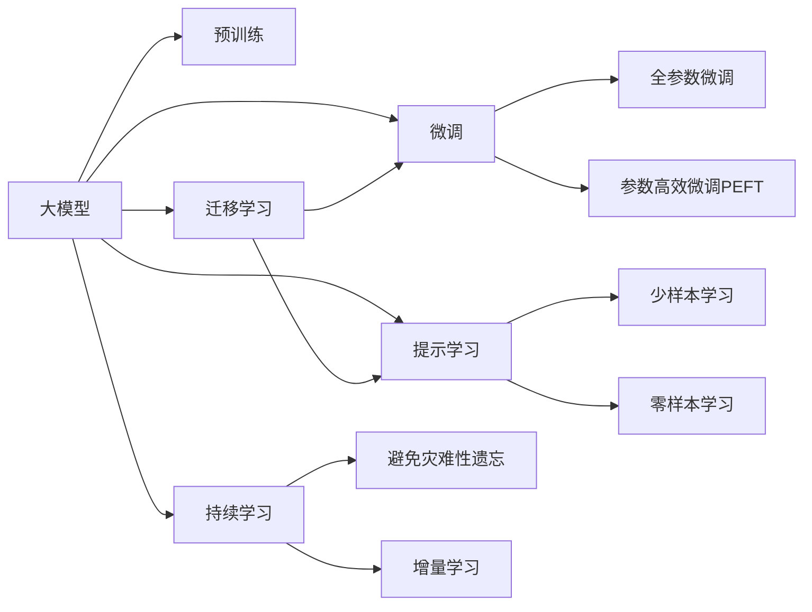

                 

## 1. 背景介绍

在人工智能(AI)和机器学习(Machine Learning)领域，大模型近年来逐渐成为热点。这些大模型往往包含数十亿乃至百亿参数，能够通过预训练学习到海量的知识，然后通过微调在特定任务上进行调整和优化。它们在NLP、图像识别、语音识别等高抽象层次任务上展现了令人瞩目的性能。

然而，当大模型被应用在低抽象层次任务中时，例如文本纠错、代码补全、游戏AI等，其表现如何？这些低层次任务与高层次任务有何区别，大模型在处理它们时需要注意哪些问题？这些问题都是本文将要探讨的核心。

## 2. 核心概念与联系

### 2.1 核心概念概述

在探讨大模型在低层次任务中的表现时，我们首先需要理解以下核心概念：

- **大模型(_large models_)**：指包含大量参数的深度神经网络模型，如BERT、GPT-3等，它们能够通过预训练学习到复杂的语言或视觉知识，然后在特定任务上进行调整以优化性能。
- **低层次任务(低抽象层次任务)**：指需要模型在处理原始数据时进行精细粒度操作的任务，如文本纠错、代码补全、游戏AI等，它们通常具有更强的可解释性和要求更快的响应速度。
- **预训练(_pre-training_)**：指在大规模无标签数据上对模型进行训练，使其学习到通用的语言或视觉表示。
- **微调(_fine-tuning_)**：指在预训练模型的基础上，使用下游任务的少量标签数据对模型进行调整，以优化其在特定任务上的性能。
- **参数高效微调(Parameter-Efficient Fine-Tuning, PEFT)**：指在微调过程中只更新少量参数，以提高微调效率和防止过拟合。

这些概念之间存在密切的联系，通过预训练和微调，大模型能够从大规模无标签数据中学习到丰富的知识，然后在特定任务上进行微调以获得更好的性能。

### 2.2 核心概念原理和架构的 Mermaid 流程图



这个流程图展示了预训练、微调和参数高效微调之间的关系，以及提示学习、少样本学习和零样本学习在大模型中的应用。

## 3. 核心算法原理 & 具体操作步骤

### 3.1 算法原理概述

大模型在低层次任务中的表现，主要依赖于其在预训练和微调过程中的知识获取和迁移能力。低层次任务通常需要模型对输入数据进行细致的分析和处理，例如：

- **文本纠错**：识别并修正输入文本中的错误，如拼写错误、语法错误等。
- **代码补全**：自动完成代码的编写，例如Python代码、SQL语句等。
- **游戏AI**：在游戏中自动决策和执行动作，例如围棋、扑克等。

这些任务通常需要模型对输入数据进行更精细粒度的处理，并且对模型的响应速度和准确性有更高的要求。

### 3.2 算法步骤详解

在低层次任务中，大模型的预训练和微调通常包括以下步骤：

1. **预训练**：在大规模无标签数据上对模型进行训练，使其学习到通用的语言或视觉表示。这一步可以是一个自监督任务，如BERT的掩码语言模型，或者是一个自回归任务，如GPT的语言生成任务。

2. **微调**：在特定任务上对模型进行调整，以优化其在低层次任务中的性能。微调通常需要少量的有标签数据，可以通过端到端的训练来完成。

3. **参数高效微调**：在微调过程中只更新少量参数，以提高效率并防止过拟合。这可以通过添加 Adapter 层、使用Prefix Tuning 等方法来实现。

4. **提示学习**：在输入文本中添加提示模板，以引导模型生成或分类输出。提示学习可以用于少样本学习和零样本学习，而无需更新模型参数。

5. **少样本学习和零样本学习**：使用少量的有标签数据或任务描述，让模型自动进行推理或分类。

### 3.3 算法优缺点

**优点**：

- **可解释性强**：低层次任务通常需要模型对输入数据进行细致的分析和处理，模型输出的结果易于理解和解释。
- **响应速度快**：低层次任务通常需要模型在实时或接近实时的时间内给出结果，大模型的响应速度通常能够满足需求。
- **准确性高**：大模型在预训练和微调过程中学习到了丰富的知识，通常能够在新任务上获得高精度的表现。

**缺点**：

- **数据依赖性强**：低层次任务通常需要大量的有标签数据来训练和微调模型，获取高质量的数据成本较高。
- **计算资源需求高**：大模型包含大量参数，训练和推理所需计算资源较多。
- **泛化能力有限**：大模型在低层次任务上可能存在过拟合的风险，泛化能力可能有限。

### 3.4 算法应用领域

大模型在低层次任务中的应用领域包括：

- **文本纠错**：如Grammarly等应用，能够识别并修正输入文本中的错误。
- **代码补全**：如GitHub Copilot等应用，能够自动完成代码编写和补全。
- **游戏AI**：如AlphaGo、OpenAI Five等应用，能够在复杂的游戏中自动决策和执行动作。
- **自然语言交互**：如智能客服、智能助手等应用，能够理解和回应用户的自然语言查询。
- **智能推荐系统**：如Netflix推荐电影、Amazon推荐商品等应用，能够根据用户的历史行为和偏好进行推荐。

## 4. 数学模型和公式 & 详细讲解 & 举例说明

### 4.1 数学模型构建

在低层次任务中，大模型的数学模型通常包括输入层、编码层、解码层和输出层。以文本纠错为例，假设输入为 $x_i$，输出为 $y_i$，其中 $x_i$ 为原始文本，$y_i$ 为修正后的文本。模型的数学模型可以表示为：

$$
y_i = f(x_i; \theta)
$$

其中 $f$ 为模型的函数，$\theta$ 为模型的参数。

### 4.2 公式推导过程

在文本纠错任务中，常见的模型为序列到序列(Sequence to Sequence, Seq2Seq)模型，包括编码器(Encoder)和解码器(Decoder)两部分。编码器将输入文本 $x_i$ 转换为一个中间表示 $h_i$，解码器则将 $h_i$ 转换为修正后的文本 $y_i$。

编码器通常是一个循环神经网络(RNN)或变换器(Transformer)，其数学模型可以表示为：

$$
h_i = g(x_i; \theta)
$$

解码器也是一个循环神经网络或变换器，其数学模型可以表示为：

$$
y_i = g'(h_i; \theta')
$$

其中 $\theta'$ 为解码器的参数。

### 4.3 案例分析与讲解

以BERT模型为例，它在文本纠错任务中的应用可以分为两个步骤：

1. **预训练**：在大规模无标签的文本语料上进行预训练，学习通用的语言表示。
2. **微调**：在特定任务的标注数据上进行微调，优化模型在文本纠错任务中的表现。

假设预训练后的BERT模型参数为 $\theta$，微调后的参数为 $\theta'$，则微调的目标函数为：

$$
\mathcal{L}(\theta') = \frac{1}{N}\sum_{i=1}^N \ell(y_i, f(x_i; \theta'))
$$

其中 $\ell$ 为损失函数，通常为交叉熵损失函数。

## 5. 项目实践：代码实例和详细解释说明

### 5.1 开发环境搭建

在进行低层次任务的微调前，需要准备好开发环境。以下是使用Python进行PyTorch开发的环境配置流程：

1. 安装Anaconda：从官网下载并安装Anaconda，用于创建独立的Python环境。

2. 创建并激活虚拟环境：
```bash
conda create -n pytorch-env python=3.8 
conda activate pytorch-env
```

3. 安装PyTorch：根据CUDA版本，从官网获取对应的安装命令。例如：
```bash
conda install pytorch torchvision torchaudio cudatoolkit=11.1 -c pytorch -c conda-forge
```

4. 安装Transformers库：
```bash
pip install transformers
```

5. 安装各类工具包：
```bash
pip install numpy pandas scikit-learn matplotlib tqdm jupyter notebook ipython
```

完成上述步骤后，即可在`pytorch-env`环境中开始微调实践。

### 5.2 源代码详细实现

下面我们以文本纠错任务为例，给出使用Transformers库对BERT模型进行微调的PyTorch代码实现。

首先，定义文本纠错任务的数据处理函数：

```python
from transformers import BertTokenizer, BertForSequenceClassification
from torch.utils.data import Dataset
import torch

class TextCorrectionDataset(Dataset):
    def __init__(self, texts, labels, tokenizer, max_len=128):
        self.texts = texts
        self.labels = labels
        self.tokenizer = tokenizer
        self.max_len = max_len
        
    def __len__(self):
        return len(self.texts)
    
    def __getitem__(self, item):
        text = self.texts[item]
        label = self.labels[item]
        
        encoding = self.tokenizer(text, return_tensors='pt', max_length=self.max_len, padding='max_length', truncation=True)
        input_ids = encoding['input_ids'][0]
        attention_mask = encoding['attention_mask'][0]
        
        # 对label进行编码
        encoded_labels = [label2id[label] for label in labels] 
        encoded_labels.extend([label2id['O']] * (self.max_len - len(encoded_labels)))
        labels = torch.tensor(encoded_labels, dtype=torch.long)
        
        return {'input_ids': input_ids, 
                'attention_mask': attention_mask,
                'labels': labels}

# 标签与id的映射
label2id = {'O': 0, 'Correct': 1}
id2label = {v: k for k, v in label2id.items()}

# 创建dataset
tokenizer = BertTokenizer.from_pretrained('bert-base-cased')

train_dataset = TextCorrectionDataset(train_texts, train_labels, tokenizer)
dev_dataset = TextCorrectionDataset(dev_texts, dev_labels, tokenizer)
test_dataset = TextCorrectionDataset(test_texts, test_labels, tokenizer)
```

然后，定义模型和优化器：

```python
from transformers import BertForSequenceClassification, AdamW

model = BertForSequenceClassification.from_pretrained('bert-base-cased', num_labels=len(label2id))

optimizer = AdamW(model.parameters(), lr=2e-5)
```

接着，定义训练和评估函数：

```python
from torch.utils.data import DataLoader
from tqdm import tqdm
from sklearn.metrics import classification_report

device = torch.device('cuda') if torch.cuda.is_available() else torch.device('cpu')
model.to(device)

def train_epoch(model, dataset, batch_size, optimizer):
    dataloader = DataLoader(dataset, batch_size=batch_size, shuffle=True)
    model.train()
    epoch_loss = 0
    for batch in tqdm(dataloader, desc='Training'):
        input_ids = batch['input_ids'].to(device)
        attention_mask = batch['attention_mask'].to(device)
        labels = batch['labels'].to(device)
        model.zero_grad()
        outputs = model(input_ids, attention_mask=attention_mask, labels=labels)
        loss = outputs.loss
        epoch_loss += loss.item()
        loss.backward()
        optimizer.step()
    return epoch_loss / len(dataloader)

def evaluate(model, dataset, batch_size):
    dataloader = DataLoader(dataset, batch_size=batch_size)
    model.eval()
    preds, labels = [], []
    with torch.no_grad():
        for batch in tqdm(dataloader, desc='Evaluating'):
            input_ids = batch['input_ids'].to(device)
            attention_mask = batch['attention_mask'].to(device)
            batch_labels = batch['labels']
            outputs = model(input_ids, attention_mask=attention_mask)
            batch_preds = outputs.logits.argmax(dim=2).to('cpu').tolist()
            batch_labels = batch_labels.to('cpu').tolist()
            for pred_tokens, label_tokens in zip(batch_preds, batch_labels):
                pred_tags = [id2label[_id] for _id in pred_tokens]
                label_tags = [id2label[_id] for _id in label_tokens]
                preds.append(pred_tags[:len(label_tokens)])
                labels.append(label_tags)
                
    print(classification_report(labels, preds))
```

最后，启动训练流程并在测试集上评估：

```python
epochs = 5
batch_size = 16

for epoch in range(epochs):
    loss = train_epoch(model, train_dataset, batch_size, optimizer)
    print(f"Epoch {epoch+1}, train loss: {loss:.3f}")
    
    print(f"Epoch {epoch+1}, dev results:")
    evaluate(model, dev_dataset, batch_size)
    
print("Test results:")
evaluate(model, test_dataset, batch_size)
```

以上就是使用PyTorch对BERT进行文本纠错任务微调的完整代码实现。可以看到，得益于Transformers库的强大封装，我们可以用相对简洁的代码完成BERT模型的加载和微调。

### 5.3 代码解读与分析

让我们再详细解读一下关键代码的实现细节：

**TextCorrectionDataset类**：
- `__init__`方法：初始化文本、标签、分词器等关键组件。
- `__len__`方法：返回数据集的样本数量。
- `__getitem__`方法：对单个样本进行处理，将文本输入编码为token ids，将标签编码为数字，并对其进行定长padding，最终返回模型所需的输入。

**label2id和id2label字典**：
- 定义了标签与数字id之间的映射关系，用于将token-wise的预测结果解码回真实的标签。

**训练和评估函数**：
- 使用PyTorch的DataLoader对数据集进行批次化加载，供模型训练和推理使用。
- 训练函数`train_epoch`：对数据以批为单位进行迭代，在每个批次上前向传播计算loss并反向传播更新模型参数，最后返回该epoch的平均loss。
- 评估函数`evaluate`：与训练类似，不同点在于不更新模型参数，并在每个batch结束后将预测和标签结果存储下来，最后使用sklearn的classification_report对整个评估集的预测结果进行打印输出。

**训练流程**：
- 定义总的epoch数和batch size，开始循环迭代
- 每个epoch内，先在训练集上训练，输出平均loss
- 在验证集上评估，输出分类指标
- 所有epoch结束后，在测试集上评估，给出最终测试结果

可以看到，PyTorch配合Transformers库使得BERT微调的代码实现变得简洁高效。开发者可以将更多精力放在数据处理、模型改进等高层逻辑上，而不必过多关注底层的实现细节。

当然，工业级的系统实现还需考虑更多因素，如模型的保存和部署、超参数的自动搜索、更灵活的任务适配层等。但核心的微调范式基本与此类似。

## 6. 实际应用场景

### 6.1 文本纠错

文本纠错是大模型在低层次任务中常见的应用之一。利用预训练的BERT等模型，可以在大规模无标签文本语料上学习到语言知识，然后在特定文本纠错任务上通过微调获得高精度的纠错结果。例如，使用预训练的BERT模型，在小说文本纠错数据集上进行微调，可以显著提升小说文本的自动纠错能力。

### 6.2 代码补全

代码补全是另一个常见应用场景。利用大模型在预训练阶段学习到的编码能力，可以在特定编程语言的代码片段上微调，自动完成代码的补全。例如，使用GPT模型在Python代码片段上进行微调，可以自动生成完整的代码框架，大大提高程序员的开发效率。

### 6.3 游戏AI

在游戏AI中，大模型同样展现出了强大的能力。通过预训练在大规模游戏数据上学习知识，然后在特定游戏中进行微调，可以构建高水平的AI玩家。例如，使用BERT模型在棋类游戏数据上预训练，然后在围棋、扑克等游戏中进行微调，可以构建具有高水平策略决策能力的AI玩家。

### 6.4 未来应用展望

随着大模型和微调技术的不断发展，基于微调范式将在更多领域得到应用，为传统行业带来变革性影响。

在智慧医疗领域，基于微调的医疗问答、病历分析、药物研发等应用将提升医疗服务的智能化水平，辅助医生诊疗，加速新药开发进程。

在智能教育领域，微调技术可应用于作业批改、学情分析、知识推荐等方面，因材施教，促进教育公平，提高教学质量。

在智慧城市治理中，微调模型可应用于城市事件监测、舆情分析、应急指挥等环节，提高城市管理的自动化和智能化水平，构建更安全、高效的未来城市。

此外，在企业生产、社会治理、文娱传媒等众多领域，基于大模型微调的人工智能应用也将不断涌现，为经济社会发展注入新的动力。相信随着技术的日益成熟，微调方法将成为人工智能落地应用的重要范式，推动人工智能技术在垂直行业的规模化落地。总之，微调需要开发者根据具体任务，不断迭代和优化模型、数据和算法，方能得到理想的效果。

## 7. 工具和资源推荐

### 7.1 学习资源推荐

为了帮助开发者系统掌握大模型微调的理论基础和实践技巧，这里推荐一些优质的学习资源：

1. 《Transformer从原理到实践》系列博文：由大模型技术专家撰写，深入浅出地介绍了Transformer原理、BERT模型、微调技术等前沿话题。

2. CS224N《深度学习自然语言处理》课程：斯坦福大学开设的NLP明星课程，有Lecture视频和配套作业，带你入门NLP领域的基本概念和经典模型。

3. 《Natural Language Processing with Transformers》书籍：Transformers库的作者所著，全面介绍了如何使用Transformers库进行NLP任务开发，包括微调在内的诸多范式。

4. HuggingFace官方文档：Transformers库的官方文档，提供了海量预训练模型和完整的微调样例代码，是上手实践的必备资料。

5. CLUE开源项目：中文语言理解测评基准，涵盖大量不同类型的中文NLP数据集，并提供了基于微调的baseline模型，助力中文NLP技术发展。

通过对这些资源的学习实践，相信你一定能够快速掌握大模型微调的精髓，并用于解决实际的NLP问题。

### 7.2 开发工具推荐

高效的开发离不开优秀的工具支持。以下是几款用于大模型微调开发的常用工具：

1. PyTorch：基于Python的开源深度学习框架，灵活动态的计算图，适合快速迭代研究。大部分预训练语言模型都有PyTorch版本的实现。

2. TensorFlow：由Google主导开发的开源深度学习框架，生产部署方便，适合大规模工程应用。同样有丰富的预训练语言模型资源。

3. Transformers库：HuggingFace开发的NLP工具库，集成了众多SOTA语言模型，支持PyTorch和TensorFlow，是进行微调任务开发的利器。

4. Weights & Biases：模型训练的实验跟踪工具，可以记录和可视化模型训练过程中的各项指标，方便对比和调优。与主流深度学习框架无缝集成。

5. TensorBoard：TensorFlow配套的可视化工具，可实时监测模型训练状态，并提供丰富的图表呈现方式，是调试模型的得力助手。

6. Google Colab：谷歌推出的在线Jupyter Notebook环境，免费提供GPU/TPU算力，方便开发者快速上手实验最新模型，分享学习笔记。

合理利用这些工具，可以显著提升大模型微调任务的开发效率，加快创新迭代的步伐。

### 7.3 相关论文推荐

大语言模型和微调技术的发展源于学界的持续研究。以下是几篇奠基性的相关论文，推荐阅读：

1. Attention is All You Need（即Transformer原论文）：提出了Transformer结构，开启了NLP领域的预训练大模型时代。

2. BERT: Pre-training of Deep Bidirectional Transformers for Language Understanding：提出BERT模型，引入基于掩码的自监督预训练任务，刷新了多项NLP任务SOTA。

3. Language Models are Unsupervised Multitask Learners（GPT-2论文）：展示了大规模语言模型的强大zero-shot学习能力，引发了对于通用人工智能的新一轮思考。

4. Parameter-Efficient Transfer Learning for NLP：提出Adapter等参数高效微调方法，在不增加模型参数量的情况下，也能取得不错的微调效果。

5. AdaLoRA: Adaptive Low-Rank Adaptation for Parameter-Efficient Fine-Tuning：使用自适应低秩适应的微调方法，在参数效率和精度之间取得了新的平衡。

这些论文代表了大语言模型微调技术的发展脉络。通过学习这些前沿成果，可以帮助研究者把握学科前进方向，激发更多的创新灵感。

## 8. 总结：未来发展趋势与挑战

### 8.1 总结

本文对大模型在低层次任务中的表现进行了全面系统的介绍。首先阐述了预训练和微调在大模型中的应用，明确了微调在拓展预训练模型应用、提升低层次任务性能方面的独特价值。其次，从原理到实践，详细讲解了低层次任务的微调数学模型和操作步骤，给出了微调任务开发的完整代码实例。同时，本文还广泛探讨了微调方法在文本纠错、代码补全、游戏AI等多个低层次领域的应用前景，展示了微调范式的巨大潜力。最后，本文精选了微调技术的各类学习资源，力求为读者提供全方位的技术指引。

通过本文的系统梳理，可以看到，大模型在低层次任务中展现了强大的能力，成为NLP技术落地应用的重要手段。未来，伴随预训练语言模型和微调方法的持续演进，基于微调范式必将在更多领域得到应用，为传统行业带来变革性影响。

### 8.2 未来发展趋势

展望未来，大模型在低层次任务中的表现将呈现以下几个发展趋势：

1. **参数高效微调**：未来将涌现更多参数高效的微调方法，如Prefix Tuning、LoRA等，在固定大部分预训练参数的同时，只更新极少量的任务相关参数。

2. **多模态微调**：将符号化的先验知识，如知识图谱、逻辑规则等，与神经网络模型进行巧妙融合，引导微调过程学习更准确、合理的语言模型。同时加强不同模态数据的整合，实现视觉、语音等多模态信息与文本信息的协同建模。

3. **实时化部署**：未来的大模型将更注重实时化的部署，以支持高并发、低延迟的应用场景，如智能客服、游戏AI等。

4. **安全性与可解释性**：在模型训练和应用过程中引入伦理导向的评估指标，过滤和惩罚有偏见、有害的输出倾向。同时加强人工干预和审核，建立模型行为的监管机制，确保输出符合人类价值观和伦理道德。

5. **自适应学习能力**：大模型将具备更强的自适应学习能力，能够动态调整参数和结构以应对数据分布的变化。

6. **分布式训练**：在大规模任务中，大模型将更多地采用分布式训练，以提高训练效率和降低成本。

### 8.3 面临的挑战

尽管大模型在低层次任务中展现了强大的能力，但在实际应用中仍面临诸多挑战：

1. **数据依赖性强**：低层次任务通常需要大量的有标签数据来训练和微调模型，获取高质量的数据成本较高。如何进一步降低微调对标注样本的依赖，将是一大难题。

2. **计算资源需求高**：大模型包含大量参数，训练和推理所需计算资源较多。如何在保持模型性能的同时，优化计算资源使用，是未来的研究方向。

3. **泛化能力有限**：大模型在低层次任务上可能存在过拟合的风险，泛化能力可能有限。如何提高模型的泛化能力，是未来的重要研究课题。

4. **推理速度慢**：大模型虽然精度高，但在实际部署时往往面临推理速度慢、内存占用大等效率问题。如何优化推理速度，提升模型响应效率，是重要的优化方向。

5. **模型复杂性高**：大模型的结构和参数复杂，难以在实际应用中进行维护和优化。如何在降低模型复杂性的同时，保持其性能，是一个重要的研究方向。

6. **可解释性不足**：当前的大模型通常像一个"黑盒"系统，难以解释其内部工作机制和决策逻辑。对于高风险应用，模型的可解释性尤为重要。

### 8.4 研究展望

未来的大模型研究需要在以下几个方面寻求新的突破：

1. **无监督和半监督学习**：探索无监督和半监督学习的方法，摆脱对大规模标注数据的依赖，利用自监督学习、主动学习等无监督和半监督范式，最大限度利用非结构化数据，实现更加灵活高效的微调。

2. **自适应学习框架**：研究自适应学习框架，使模型能够动态调整参数和结构以应对数据分布的变化。

3. **高效推理加速**：开发高效的推理加速技术，如量化加速、推理剪枝等，提升大模型的响应速度和计算效率。

4. **自监督预训练**：探索自监督预训练的方法，通过非监督学习任务提升模型的泛化能力。

5. **多模态融合**：研究多模态融合技术，将视觉、语音等多模态数据与文本数据结合，实现多模态信息的协同建模。

6. **知识图谱整合**：将符号化的先验知识，如知识图谱、逻辑规则等，与神经网络模型进行巧妙融合，引导微调过程学习更准确、合理的语言模型。

7. **因果推断**：将因果推断方法引入微调模型，识别出模型决策的关键特征，增强输出解释的因果性和逻辑性。

8. **博弈论工具**：借助博弈论工具刻画人机交互过程，主动探索并规避模型的脆弱点，提高系统稳定性。

这些研究方向的探索，必将引领大模型微调技术迈向更高的台阶，为构建安全、可靠、可解释、可控的智能系统铺平道路。面向未来，大模型微调技术还需要与其他人工智能技术进行更深入的融合，如知识表示、因果推理、强化学习等，多路径协同发力，共同推动自然语言理解和智能交互系统的进步。只有勇于创新、敢于突破，才能不断拓展语言模型的边界，让智能技术更好地造福人类社会。

## 9. 附录：常见问题与解答

**Q1：大模型在低层次任务中与高层次任务有何区别？**

A: 低层次任务通常需要模型对输入数据进行更精细粒度的处理，例如文本纠错、代码补全、游戏AI等，它们通常具有更强的可解释性和要求更快的响应速度。相比之下，高层次任务如问答、情感分析等，更注重模型的推理能力和泛化能力。

**Q2：大模型在低层次任务中如何利用预训练知识？**

A: 大模型在低层次任务中通常会利用预训练阶段学习到的语言或视觉表示，然后在特定任务上进行微调，以获得更好的性能。例如，在文本纠错任务中，利用BERT等模型在无标签文本语料上学习到的语言表示，可以辅助模型更好地理解输入文本，从而进行更准确的纠错。

**Q3：大模型在低层次任务中如何处理数据增强？**

A: 在低层次任务中，数据增强通常包括文本清洗、数据合成、回译等技术。例如，在文本纠错任务中，可以将错误文本进行清洗，生成错误的回译文本，或生成错误字典，用于训练模型。这些数据增强技术可以显著提升模型的泛化能力和鲁棒性。

**Q4：大模型在低层次任务中如何处理对抗样本？**

A: 对抗样本是指对输入数据进行微小扰动，使得模型输出发生错误。在低层次任务中，对抗样本通常用于测试模型的鲁棒性和泛化能力。例如，在文本纠错任务中，可以生成对抗性文本，测试模型在不同条件下的纠错能力。

**Q5：大模型在低层次任务中如何进行参数高效微调？**

A: 参数高效微调可以通过添加Adapter层、使用Prefix Tuning等方法实现。例如，在文本纠错任务中，可以通过添加Adapter层，只更新部分预训练权重，避免过度拟合。

这些问答及其解答，展示了大模型在低层次任务中应用的基本框架和实践方法。希望通过本文的介绍，读者能够对大模型在低层次任务中的表现有更深入的理解，并能够将相关技术应用到实际的开发和研究中。

---

作者：禅与计算机程序设计艺术 / Zen and the Art of Computer Programming

