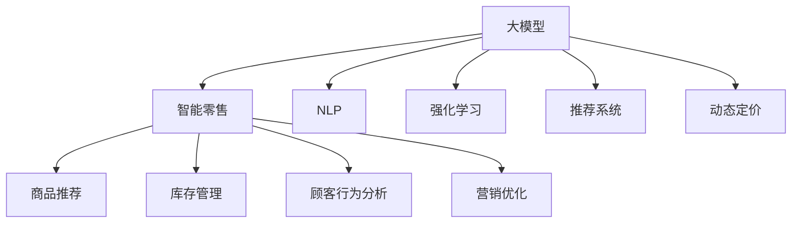

                 

# 大模型在智能零售中的应用前景

## 1. 背景介绍

在零售行业，随着线上线下的融合加速，客户需求的个性化和多样化日益凸显。传统零售企业面临诸多挑战：如何精准理解客户需求，如何提高库存管理效率，如何优化运营流程，如何提升购物体验等。传统零售的数字化转型势在必行。大数据、人工智能、物联网等新技术的普及，为零售业带来了新的机遇与挑战。大模型作为目前最先进的AI模型，可以提供强大的数据分析和预测能力，赋能智能零售的各个环节。

### 1.1 问题由来
智能零售的本质是通过数据和算法优化零售业务流程，提升效率、降低成本、提升客户体验。大模型具有强大的数据分析和预测能力，能够处理大规模、高维度的数据，提供更精准、实时的决策支持，从而提升零售业务的整体效益。

## 2. 核心概念与联系

### 2.1 核心概念概述

为了更好地理解大模型在智能零售中的应用前景，本节将介绍几个密切相关的核心概念：

- 大模型（Large Model）：指基于深度学习模型训练得到的庞大参数集，通常具有百亿甚至千亿级的参数量。如GPT-3、BERT等模型，具有强大的语言理解和生成能力，能够处理各种自然语言处理任务。
- 智能零售（Smart Retailing）：通过人工智能技术提升零售业务全链条效率的零售模式。涵盖商品推荐、库存管理、顾客行为分析、营销优化等多个环节。
- 自然语言处理（Natural Language Processing, NLP）：研究计算机如何处理、理解和生成人类语言的学科。大模型在该领域应用广泛，能够处理自然语言输入输出，提供精确的语言理解能力。
- 强化学习（Reinforcement Learning, RL）：一种通过试错反馈机制，使智能体在复杂环境中进行优化决策的学习方法。强化学习可以应用于库存管理、顾客行为预测等智能零售任务。
- 推荐系统（Recommendation System）：通过分析用户行为，推荐符合用户偏好的商品或内容。大模型能够处理海量用户数据，构建精准的推荐模型。
- 动态定价（Dynamic Pricing）：根据市场需求、竞争状况等实时调整商品价格，实现最大化收益。大模型可以根据实时数据动态预测市场需求，辅助制定价格策略。

这些核心概念之间的逻辑关系可以通过以下Mermaid流程图来展示：



这个流程图展示了大模型在智能零售中的核心概念及其之间的关系：

1. 大模型通过强大的数据分析能力，为智能零售提供数据支持和决策优化。
2. 大模型在自然语言处理、强化学习、推荐系统等领域得到广泛应用。
3. 大模型在智能零售中的不同应用场景，如商品推荐、库存管理、顾客行为分析、营销优化等，形成闭环，提升零售业务整体效益。

## 3. 核心算法原理 & 具体操作步骤
### 3.1 算法原理概述

大模型在智能零售中的应用主要通过以下几种方式实现：

- **预测分析**：通过大模型对海量数据进行分析和预测，提供业务决策支持。如动态定价、库存预测、顾客行为预测等。
- **自然语言处理**：利用大模型对自然语言数据进行理解、生成，实现自动客服、智能推荐、情感分析等功能。
- **强化学习**：通过模拟真实环境，优化智能体行为，实现库存管理、货架优化等决策。
- **推荐系统**：利用大模型构建推荐算法，个性化推荐商品，提升用户体验和转化率。

这些应用的核心在于大模型的强大数据分析和预测能力。通过深度学习模型对数据进行训练，大模型能够从海量数据中学习到规律和模式，提供精准的业务预测和优化。

### 3.2 算法步骤详解

以动态定价为例，说明大模型在智能零售中的具体应用步骤：

1. **数据收集**：收集历史销售数据、市场竞争数据、季节性数据等，形成训练集。

2. **模型训练**：利用深度学习模型对训练集进行训练，构建预测模型。如使用LSTM、GRU等模型对历史数据进行时间序列预测。

3. **预测优化**：通过实时数据，输入到训练好的模型中进行预测，根据预测结果动态调整商品价格，实现动态定价。

4. **模型部署**：将训练好的模型部署到实时系统中，接收实时数据进行预测并指导价格调整。

5. **效果评估**：通过实际运营数据，评估动态定价模型的效果，持续优化模型参数。

### 3.3 算法优缺点

大模型在智能零售中的应用具有以下优点：

- **高效性**：大模型能够处理大规模、高维度数据，快速进行预测分析。
- **灵活性**：大模型通过迁移学习、微调等技术，可以在不同业务场景中快速部署，适应各种复杂情况。
- **可扩展性**：大模型可以通过增加数据量和计算资源，不断提升预测精度和模型效果。

同时，也存在一些局限性：

- **计算成本高**：大模型训练和推理需要高性能计算资源，成本较高。
- **数据质量要求高**：大模型的效果很大程度上依赖于输入数据的质量，需要保证数据的完整性和准确性。
- **模型复杂度高**：大模型的参数量和计算复杂度较高，需要更多的计算资源和更长的训练时间。

### 3.4 算法应用领域

大模型在智能零售中的应用涵盖了从供应链管理到客户服务等多个领域：

- **库存管理**：利用大模型对历史销售数据进行预测，优化库存水平，降低缺货和滞销风险。
- **货架优化**：利用大模型分析顾客行为和商品销售数据，优化商品布局，提高货架利用率和销售额。
- **顾客行为预测**：利用大模型分析顾客行为数据，预测顾客需求，制定精准的营销策略。
- **动态定价**：利用大模型对市场需求进行预测，动态调整商品价格，实现最大化收益。
- **智能推荐**：利用大模型分析用户历史行为数据，构建个性化推荐算法，提升用户体验和转化率。
- **情感分析**：利用大模型对顾客评论和反馈进行分析，提升顾客满意度和服务质量。

## 4. 数学模型和公式 & 详细讲解 & 举例说明

### 4.1 数学模型构建

在动态定价问题中，可以通过大模型构建预测模型，如下所示：

- 定义历史价格数据为 $x_t$，市场需求为 $y_t$，未来价格为 $x_{t+1}$。
- 构建时间序列预测模型 $y_t = f(x_t)$，其中 $f$ 为预测函数。
- 训练模型使得预测误差最小化，即 $\min_{\theta} \sum_{t=1}^T (y_t - f(x_t))^2$。

### 4.2 公式推导过程

通过最小二乘法对上述预测模型进行求解，得到：

- $f(x_t) = \theta^T x_t$
- 其中 $\theta$ 为模型参数，$x_t$ 为历史价格数据。

预测未来价格时，通过输入未来价格数据 $x_{t+1}$，得到：

- $y_{t+1} = f(x_{t+1}) = \theta^T x_{t+1}$

### 4.3 案例分析与讲解

以某电商平台为例，利用大模型进行动态定价：

1. **数据收集**：收集平台历史销售数据、用户行为数据、市场竞争数据等，作为训练集。
2. **模型训练**：使用LSTM模型对历史数据进行训练，构建预测模型。
3. **预测优化**：根据实时数据，输入到训练好的模型中进行预测，动态调整商品价格。
4. **效果评估**：通过实际运营数据，评估模型效果，持续优化模型参数。

## 5. 项目实践：代码实例和详细解释说明
### 5.1 开发环境搭建

在进行大模型应用实践前，我们需要准备好开发环境。以下是使用Python进行TensorFlow开发的环境配置流程：

1. 安装Anaconda：从官网下载并安装Anaconda，用于创建独立的Python环境。

2. 创建并激活虚拟环境：
```bash
conda create -n tf-env python=3.8 
conda activate tf-env
```

3. 安装TensorFlow：根据CUDA版本，从官网获取对应的安装命令。例如：
```bash
conda install tensorflow -c tensorflow -c conda-forge
```

4. 安装各类工具包：
```bash
pip install numpy pandas scikit-learn matplotlib tqdm jupyter notebook ipython
```

完成上述步骤后，即可在`tf-env`环境中开始开发实践。

### 5.2 源代码详细实现

这里以电商平台商品动态定价为例，给出使用TensorFlow进行大模型应用的PyTorch代码实现。

首先，定义动态定价模型的输入和输出：

```python
import tensorflow as tf

# 定义模型输入
x = tf.keras.layers.Input(shape=(1,))

# 定义模型输出
y = tf.keras.layers.Dense(units=1, activation='linear')(x)

# 构建模型
model = tf.keras.Model(inputs=x, outputs=y)

# 编译模型
model.compile(optimizer='adam', loss='mse', metrics=['mae'])

# 输出模型结构
model.summary()
```

然后，定义模型训练和评估函数：

```python
# 定义训练函数
def train_model(model, x_train, y_train, x_val, y_val, epochs=100, batch_size=32):
    history = model.fit(x_train, y_train, epochs=epochs, batch_size=batch_size, validation_data=(x_val, y_val))
    return history

# 定义评估函数
def evaluate_model(model, x_val, y_val):
    loss, mae = model.evaluate(x_val, y_val)
    return loss, mae
```

最后，启动模型训练和评估流程：

```python
# 加载数据
x_train, y_train = load_train_data()
x_val, y_val = load_val_data()

# 训练模型
history = train_model(model, x_train, y_train, x_val, y_val)

# 评估模型
loss, mae = evaluate_model(model, x_val, y_val)

# 输出评估结果
print(f"MAE: {mae:.4f}")
```

以上就是使用TensorFlow进行动态定价模型训练和评估的完整代码实现。可以看到，TensorFlow提供了强大的API支持，可以轻松构建、训练和评估动态定价模型。

### 5.3 代码解读与分析

让我们再详细解读一下关键代码的实现细节：

- `x = tf.keras.layers.Input(shape=(1,))`：定义输入层，输入为1维数据，表示商品价格。
- `y = tf.keras.layers.Dense(units=1, activation='linear')(x)`：定义输出层，输出为1维数据，表示预测价格。
- `model = tf.keras.Model(inputs=x, outputs=y)`：构建模型，将输入和输出层连接起来。
- `model.compile(optimizer='adam', loss='mse', metrics=['mae'])`：编译模型，指定优化器为Adam，损失函数为均方误差，评价指标为平均绝对误差。
- `history = model.fit(x_train, y_train, epochs=100, batch_size=32, validation_data=(x_val, y_val))`：训练模型，指定训练数据、批次大小、迭代轮数和验证数据。
- `loss, mae = model.evaluate(x_val, y_val)`：评估模型，指定验证数据，返回损失和评价指标。

这些代码展示了使用TensorFlow进行动态定价模型训练和评估的完整流程。TensorFlow的API设计使得模型构建、训练和评估变得非常简单，无需过多关注底层实现细节。

当然，工业级的系统实现还需考虑更多因素，如模型的保存和部署、超参数的自动搜索、更灵活的任务适配层等。但核心的动态定价模型训练流程基本与此类似。

## 6. 实际应用场景

### 6.1 库存管理

大模型在库存管理中的应用主要体现在两个方面：库存预测和补货优化。

- **库存预测**：利用大模型对历史销售数据进行时间序列预测，预测未来库存水平，避免缺货和积压。
- **补货优化**：利用大模型分析库存数据和市场需求，优化补货策略，实现库存水平的最优控制。

在实际应用中，可以通过构建时间序列预测模型，对历史数据进行训练，预测未来库存需求。利用模型预测结果，动态调整补货量，实现库存的最优管理。

### 6.2 货架优化

货架优化是智能零售中的重要环节，能够有效提升货架空间利用率和销售额。大模型可以通过以下方式实现：

- **顾客行为分析**：利用大模型分析顾客行为数据，了解顾客对商品的偏好和购买行为，优化商品布局。
- **销售数据分析**：利用大模型分析销售数据，识别热销商品和滞销商品，调整货架结构。
- **空间优化算法**：利用大模型构建空间优化算法，合理分配货架空间，提升商品展示效果。

大模型可以处理海量数据，提取顾客行为和商品销售的关键特征，优化货架布局，提升货架利用率和销售额。

### 6.3 顾客行为预测

顾客行为预测是大模型在智能零售中的重要应用之一。通过大模型分析顾客行为数据，可以预测顾客的需求、购买意愿等，制定精准的营销策略，提升客户满意度和转化率。

- **历史行为分析**：利用大模型分析历史行为数据，挖掘顾客偏好和购买习惯。
- **实时行为预测**：利用大模型对实时行为数据进行预测，识别潜在需求，制定精准推荐策略。
- **情感分析**：利用大模型对顾客评论和反馈进行分析，提升顾客满意度。

大模型可以实时处理顾客行为数据，提供精准的顾客行为预测，帮助零售商制定合理的营销策略，提升顾客满意度和转化率。

### 6.4 未来应用展望

随着大模型和微调技术的不断发展，未来大模型在智能零售中的应用前景广阔，可能涵盖以下领域：

- **智能客服**：利用大模型构建智能客服系统，提升客户体验和满意度。
- **个性化推荐**：利用大模型构建个性化推荐系统，提升用户粘性和转化率。
- **供应链管理**：利用大模型优化供应链管理，提升运营效率和客户满意度。
- **营销优化**：利用大模型分析顾客数据，制定精准的营销策略，提升市场占有率。
- **动态定价**：利用大模型进行动态定价，实现最大化收益。
- **智能货架**：利用大模型优化货架布局和商品陈列，提升销售额和客户体验。

未来，随着大模型和智能技术的进一步发展，智能零售将迎来更多的创新和突破，为零售业带来更大的机遇和挑战。

## 7. 工具和资源推荐
### 7.1 学习资源推荐

为了帮助开发者系统掌握大模型在智能零售中的应用，这里推荐一些优质的学习资源：

1. 《TensorFlow实战深度学习》：由Google官方出版，介绍TensorFlow的基本用法和深度学习应用。
2. 《强化学习：概念、算法与实践》：DeepMind的畅销书，全面介绍强化学习的理论基础和实际应用。
3. 《推荐系统实战》：由李航等人所著，详细介绍推荐系统的理论基础和实现方法。
4. 《深度学习与人工智能》：深度学习领域权威教材，涵盖深度学习、NLP、强化学习等前沿技术。
5. HuggingFace官方文档：提供丰富的预训练语言模型和模型库，助力模型构建和微调。

通过对这些资源的学习实践，相信你一定能够快速掌握大模型在智能零售中的应用技巧，并用于解决实际的智能零售问题。
###  7.2 开发工具推荐

高效的开发离不开优秀的工具支持。以下是几款用于大模型在智能零售中应用开发的常用工具：

1. TensorFlow：由Google主导开发的开源深度学习框架，生产部署方便，适合大规模工程应用。
2. PyTorch：基于Python的开源深度学习框架，灵活动态的计算图，适合快速迭代研究。
3. Weights & Biases：模型训练的实验跟踪工具，可以记录和可视化模型训练过程中的各项指标，方便对比和调优。
4. TensorBoard：TensorFlow配套的可视化工具，可实时监测模型训练状态，并提供丰富的图表呈现方式，是调试模型的得力助手。
5. Jupyter Notebook：免费开源的交互式开发环境，支持多种编程语言和数据处理工具。

合理利用这些工具，可以显著提升大模型在智能零售中应用的开发效率，加快创新迭代的步伐。

### 7.3 相关论文推荐

大模型在智能零售中的应用源于学界的持续研究。以下是几篇奠基性的相关论文，推荐阅读：

1. "Training and Gradient-Based Optimization of Deep Architectures"：Hinton等人提出深度神经网络的结构和优化算法，奠定了深度学习的基础。
2. "Deep Learning for Decision Making"：Zhang等人提出深度学习在决策支持中的应用，介绍深度神经网络在金融、零售等领域的应用。
3. "Dynamic Pricing in E-commerce: A Review"：Zhang等人综述动态定价的理论和应用，介绍大模型在动态定价中的应用。
4. "Reinforcement Learning for Supply Chain Management"：Sun等人提出强化学习在供应链管理中的应用，介绍强化学习在库存管理、供应商选择等环节的应用。
5. "User Behavior Prediction in E-commerce"：Gao等人提出用户行为预测的理论和算法，介绍大模型在用户行为预测中的应用。

这些论文代表了大模型在智能零售中的应用方向，通过学习这些前沿成果，可以帮助研究者把握学科前进方向，激发更多的创新灵感。

## 8. 总结：未来发展趋势与挑战

### 8.1 总结

本文对大模型在智能零售中的应用前景进行了全面系统的介绍。首先阐述了智能零售的本质和挑战，明确了大模型在智能零售中的关键作用。其次，从原理到实践，详细讲解了大模型在智能零售中的核心算法和具体操作步骤，给出了动态定价、库存管理等任务的具体应用示例。同时，本文还广泛探讨了大模型在智能零售中的未来应用前景，展示了其广阔的发展潜力。

通过本文的系统梳理，可以看到，大模型在智能零售中的应用前景广阔，能够显著提升零售业务全链条效率，优化运营流程，提升客户体验。大模型在智能零售中的成功应用，也为其他行业提供了借鉴，推动了智能化转型的进程。

### 8.2 未来发展趋势

展望未来，大模型在智能零售中的应用将呈现以下几个发展趋势：

1. **实时性提升**：随着计算资源的提升和大模型的优化，大模型在智能零售中的应用将更加实时，能够快速响应市场变化，提供精准的决策支持。
2. **多模态融合**：大模型将结合图像、语音、视频等多模态数据，提供更全面的业务洞察和决策支持。
3. **个性化优化**：大模型将通过深度学习和强化学习，实现更加个性化和精细化的业务优化，提升用户体验和满意度。
4. **跨领域应用**：大模型将在更多行业领域得到应用，如金融、医疗、制造等，推动智能化转型的进程。
5. **安全性保障**：随着大模型的应用范围扩大，模型安全性和隐私保护将成为重要问题，需加强数据保护和模型监控。

以上趋势凸显了大模型在智能零售中的应用前景。这些方向的探索发展，必将进一步提升智能零售系统的性能和应用范围，为零售业带来更大的机遇和挑战。

### 8.3 面临的挑战

尽管大模型在智能零售中的应用已经取得了一定成果，但在迈向更加智能化、普适化应用的过程中，它仍面临诸多挑战：

1. **数据质量问题**：智能零售的业务数据量大且复杂，数据质量问题难以避免，可能影响模型的预测精度。
2. **模型复杂度高**：大模型的参数量和计算复杂度较高，需要更多的计算资源和更长的训练时间。
3. **业务理解和适应**：大模型需要充分理解业务场景和规则，才能提供精准的决策支持。
4. **模型解释性不足**：大模型往往被视为"黑盒"，难以解释其内部工作机制和决策逻辑。
5. **伦理和安全问题**：大模型在处理敏感数据和隐私保护方面存在挑战，需加强模型监控和数据保护。

这些挑战需要学界和产业界的共同努力，持续优化大模型，提升其应用效果和可信度。

### 8.4 研究展望

面对大模型在智能零售应用中的挑战，未来的研究需要在以下几个方面寻求新的突破：

1. **数据质量优化**：采用数据清洗、异常检测等技术，提升智能零售数据的准确性和完整性。
2. **模型压缩与优化**：优化大模型的结构和参数，减少计算资源消耗，提升模型训练和推理效率。
3. **业务理解增强**：通过业务规则与模型结合，增强大模型的业务理解能力，提供更加精准的决策支持。
4. **模型可解释性增强**：通过模型可视化、规则注入等技术，提升大模型的可解释性和透明性。
5. **隐私保护技术**：采用差分隐私、联邦学习等技术，保护用户隐私和数据安全。
6. **伦理和监管机制**：建立模型伦理审查和监管机制，确保模型应用符合人类价值观和伦理道德。

这些研究方向的探索，必将引领大模型在智能零售中的应用迈向更高的台阶，为构建安全、可靠、可解释、可控的智能系统铺平道路。面向未来，大模型在智能零售中的应用还需要与其他人工智能技术进行更深入的融合，如知识表示、因果推理、强化学习等，多路径协同发力，共同推动智能零售系统的进步。只有勇于创新、敢于突破，才能不断拓展大模型在智能零售中的边界，让智能技术更好地造福人类社会。

## 9. 附录：常见问题与解答

**Q1：大模型在智能零售中的主要应用场景有哪些？**

A: 大模型在智能零售中的主要应用场景包括：

1. 库存管理：利用大模型进行库存预测和补货优化，避免缺货和积压。
2. 货架优化：利用大模型分析顾客行为和商品销售数据，优化货架布局，提升销售额和客户体验。
3. 顾客行为预测：利用大模型预测顾客需求和购买意愿，制定精准的营销策略，提升客户满意度和转化率。
4. 动态定价：利用大模型进行动态定价，实现最大化收益。
5. 智能客服：利用大模型构建智能客服系统，提升客户体验和满意度。
6. 个性化推荐：利用大模型构建个性化推荐系统，提升用户粘性和转化率。
7. 供应链管理：利用大模型优化供应链管理，提升运营效率和客户满意度。
8. 营销优化：利用大模型分析顾客数据，制定精准的营销策略，提升市场占有率。

**Q2：大模型在智能零售中如何实现库存管理？**

A: 大模型在智能零售中实现库存管理主要通过以下步骤：

1. 数据收集：收集历史销售数据、市场竞争数据、季节性数据等，形成训练集。
2. 模型训练：利用深度学习模型对历史数据进行训练，构建预测模型。如使用LSTM模型对历史数据进行时间序列预测。
3. 预测优化：根据实时数据，输入到训练好的模型中进行预测，动态调整补货量，实现库存的最优管理。

**Q3：大模型在智能零售中的主要优势是什么？**

A: 大模型在智能零售中的主要优势包括：

1. 高效性：大模型能够处理大规模、高维度数据，快速进行预测分析。
2. 灵活性：大模型通过迁移学习、微调等技术，可以在不同业务场景中快速部署，适应各种复杂情况。
3. 可扩展性：大模型可以通过增加数据量和计算资源，不断提升预测精度和模型效果。
4. 实时性：大模型能够实时处理业务数据，提供精准的决策支持。
5. 个性化优化：大模型能够根据用户行为数据，提供个性化的商品推荐和定价策略。
6. 业务理解增强：大模型能够理解业务规则和场景，提供更加精准的决策支持。

**Q4：大模型在智能零售中如何进行顾客行为预测？**

A: 大模型在智能零售中进行顾客行为预测主要通过以下步骤：

1. 数据收集：收集顾客行为数据、购买数据、历史交易数据等，形成训练集。
2. 模型训练：利用深度学习模型对历史数据进行训练，构建预测模型。如使用LSTM模型对历史数据进行时间序列预测。
3. 实时预测：根据实时数据，输入到训练好的模型中进行预测，识别潜在需求，制定精准推荐策略。

**Q5：大模型在智能零售中的未来发展方向是什么？**

A: 大模型在智能零售中的未来发展方向包括：

1. 实时性提升：随着计算资源的提升和大模型的优化，大模型在智能零售中的应用将更加实时，能够快速响应市场变化，提供精准的决策支持。
2. 多模态融合：大模型将结合图像、语音、视频等多模态数据，提供更全面的业务洞察和决策支持。
3. 个性化优化：大模型将通过深度学习和强化学习，实现更加个性化和精细化的业务优化，提升用户体验和满意度。
4. 跨领域应用：大模型将在更多行业领域得到应用，如金融、医疗、制造等，推动智能化转型的进程。
5. 安全性保障：随着大模型的应用范围扩大，模型安全性和隐私保护将成为重要问题，需加强数据保护和模型监控。
6. 伦理和监管机制：建立模型伦理审查和监管机制，确保模型应用符合人类价值观和伦理道德。

这些未来方向的探索，必将引领大模型在智能零售中的应用迈向更高的台阶，为构建安全、可靠、可解释、可控的智能系统铺平道路。面向未来，大模型在智能零售中的应用还需要与其他人工智能技术进行更深入的融合，如知识表示、因果推理、强化学习等，多路径协同发力，共同推动智能零售系统的进步。只有勇于创新、敢于突破，才能不断拓展大模型在智能零售中的边界，让智能技术更好地造福人类社会。

---

作者：禅与计算机程序设计艺术 / Zen and the Art of Computer Programming

