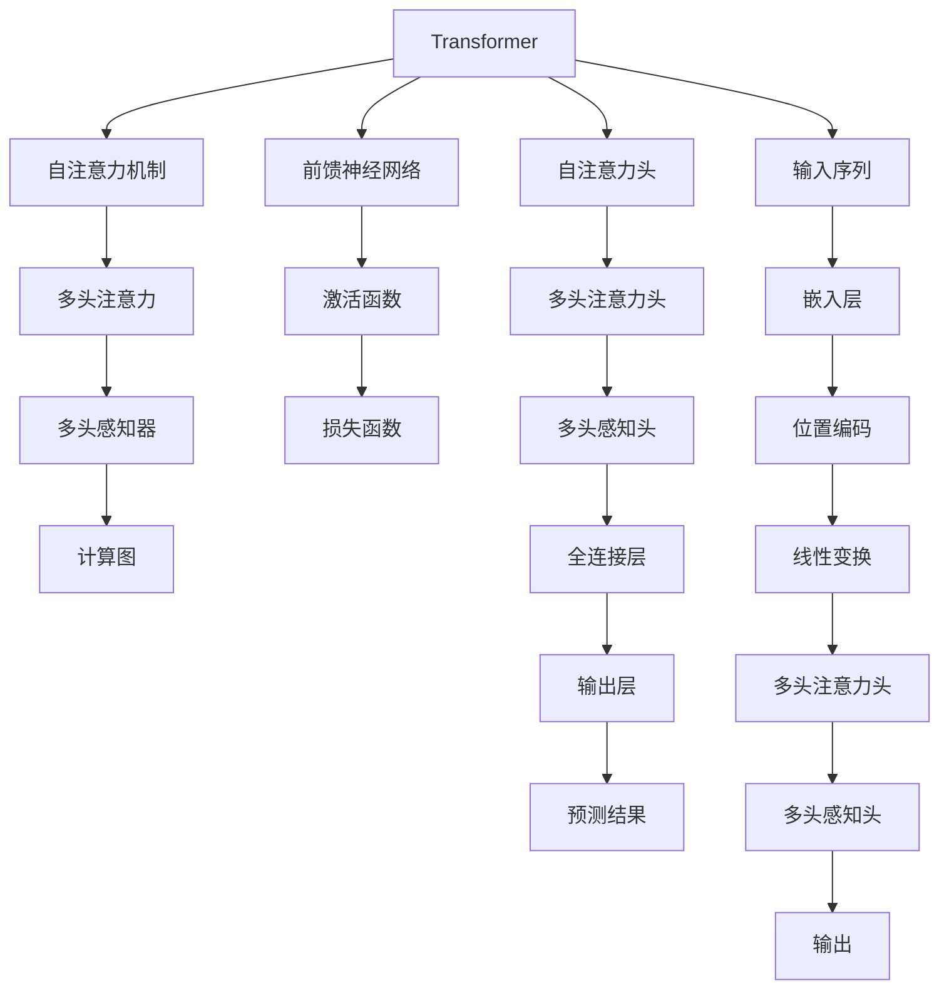

                 

# 大模型底层能力的抽象化拆解

> 关键词：大模型，Transformer，自注意力，多头注意力，多头感知器，注意力权重，计算图，模型压缩，内存优化

## 1. 背景介绍

在现代人工智能的浪潮中，大模型凭借其强大的能力，已经成为处理复杂任务的重要工具。其中，Transformer模型作为一种经典的深度学习架构，已经广泛应用在大模型中，并在多个领域取得了卓越的成果。但大模型的底层能力仍然是一个黑箱，对其拆解和理解是推动进一步研究与创新的重要方向。

## 2. 核心概念与联系

### 2.1 核心概念概述

为了深入理解大模型的底层能力，本节将介绍几个关键概念及其相互联系：

- **Transformer**：一种基于自注意力机制的深度学习架构，常用于构建大模型。它通过在编码器和解码器之间添加多头注意力机制，使得模型可以并行地处理多个输入和输出，提升计算效率。

- **自注意力机制**：Transformer的核心组件，通过计算输入序列中各个位置之间的注意力权重，实现对输入信息的聚合。每个位置的重要性被量化为一系列注意力权重，这些权重决定了每个位置对其他位置的关注程度。

- **多头注意力**：将自注意力机制推广到多个注意力头，每个头独立计算注意力权重。这种设计方式提高了模型的表达能力，能够处理更加复杂的输入-输出关系。

- **多头感知器**：Transformer的另一个关键组件，将多头注意力机制与前馈神经网络结构结合，形成了完整的计算图。多头感知器的复杂度随着注意力头的数量线性增加，但计算效率与深度线性增加，使得模型能够处理更加复杂的任务。

- **注意力权重**：表示每个位置对其他位置的关注程度。权重的大小反映了输入序列中各位置的相对重要性，是自注意力机制的输出。

- **计算图**：表示模型的计算流程，通常由节点和边构成。节点代表操作，边代表数据流。对于深度学习模型，计算图通常包含了前馈神经网络、激活函数、损失函数等组件。

这些概念构成了Transformer模型以及基于Transformer的大模型的基础架构。理解这些概念及其相互关系，是进一步探讨大模型底层能力的关键。

### 2.2 核心概念原理和架构的 Mermaid 流程图



以上流程图展示了Transformer模型的基本架构。从输入序列开始，经过嵌入层、位置编码和线性变换，进入多头注意力机制，然后通过多头感知器进行计算，最后输出预测结果。

## 3. 核心算法原理 & 具体操作步骤

### 3.1 算法原理概述

Transformer模型的核心原理在于自注意力机制和多头注意力机制。在输入序列中，每个位置与所有其他位置计算注意力权重，并根据这些权重进行加权求和，形成新的表示。多头注意力则将自注意力机制扩展到多个头，每个头独立计算注意力权重，并通过前馈神经网络进行计算，最终将各头的结果进行线性变换，输出最终的预测结果。

### 3.2 算法步骤详解

以Transformer模型为例，其微调操作包括如下步骤：

1. **数据准备**：收集和准备标注数据集，将其分为训练集、验证集和测试集。

2. **模型加载**：使用已有的预训练模型，并根据任务类型添加相应的输出层和损失函数。

3. **模型初始化**：对模型进行微调前的初始化，包括固定预训练权重，仅调整顶层参数。

4. **参数更新**：通过梯度下降算法，更新模型参数，最小化损失函数。

5. **验证评估**：在验证集上对模型进行评估，监控性能指标。

6. **测试评估**：在测试集上对模型进行最终评估，确定微调效果。

### 3.3 算法优缺点

- **优点**：
  - **高效性**：Transformer模型并行计算能力强，适合大规模数据和复杂任务的微调。
  - **可解释性**：由于每个位置的重要性被量化为注意力权重，使得模型具有一定的可解释性，有助于调试和优化。

- **缺点**：
  - **计算复杂度高**：Transformer模型的计算复杂度随着参数数量呈二次方增长，对硬件资源要求较高。
  - **参数空间大**：由于多头注意力的设计，模型参数数量巨大，不易进行参数压缩和优化。

### 3.4 算法应用领域

Transformer模型的应用领域非常广泛，涵盖自然语言处理（NLP）、计算机视觉（CV）、语音识别（ASR）等多个领域。在NLP中，Transformer被广泛应用于文本分类、机器翻译、命名实体识别等任务。在CV中，Transformer被用于图像识别、对象检测等任务。在ASR中，Transformer被用于语音识别和文本转写。

## 4. 数学模型和公式 & 详细讲解 & 举例说明

### 4.1 数学模型构建

Transformer模型的数学模型可以表示为：

$$
\mathcal{L}(\theta) = \frac{1}{N} \sum_{i=1}^N \ell(M_{\theta}(x_i), y_i)
$$

其中，$\mathcal{L}$ 表示损失函数，$\theta$ 为模型参数，$M_{\theta}$ 为Transformer模型，$x_i$ 为输入序列，$y_i$ 为输出序列，$\ell$ 为损失函数。

### 4.2 公式推导过程

Transformer模型的自注意力机制可以表示为：

$$
Q_i = X_iW_Q
$$
$$
K_j = X_jW_K
$$
$$
V_j = X_jW_V
$$
$$
S_{i,j} = \frac{Q_iK_j^T}{\sqrt{d_k}} = \alpha_{i,j}
$$
$$
Z_i = \sum_j \alpha_{i,j}V_j
$$

其中，$X$ 表示输入序列，$W_Q$、$W_K$ 和 $W_V$ 为线性变换矩阵，$d_k$ 为注意力机制的键向量维度。

### 4.3 案例分析与讲解

以BERT模型为例，其自注意力机制如下：

$$
Q_i = X_iW_Q
$$
$$
K_j = X_jW_K
$$
$$
V_j = X_jW_V
$$
$$
S_{i,j} = \frac{Q_iK_j^T}{\sqrt{d_k}} = \alpha_{i,j}
$$
$$
Z_i = \sum_j \alpha_{i,j}V_j
$$

其中，$d_k = \frac{d}{m}$，$m$ 为注意力头数，$d$ 为输入序列维度。

## 5. 项目实践：代码实例和详细解释说明

### 5.1 开发环境搭建

本节介绍使用PyTorch构建和微调BERT模型的开发环境搭建步骤。

1. **安装Anaconda**：从官网下载并安装Anaconda，创建独立的Python环境。

2. **创建虚拟环境**：
   ```bash
   conda create -n pytorch-env python=3.8
   conda activate pytorch-env
   ```

3. **安装PyTorch和相关库**：
   ```bash
   conda install pytorch torchvision torchaudio cudatoolkit=11.1 -c pytorch -c conda-forge
   pip install transformers
   pip install numpy pandas scikit-learn matplotlib tqdm jupyter notebook ipython
   ```

### 5.2 源代码详细实现

以BERT模型为例，展示微调代码实现：

```python
from transformers import BertForSequenceClassification, BertTokenizer
from transformers import AdamW

# 数据准备
tokenizer = BertTokenizer.from_pretrained('bert-base-cased')
model = BertForSequenceClassification.from_pretrained('bert-base-cased', num_labels=2)

# 定义训练函数
def train_epoch(model, data_loader, optimizer):
    model.train()
    epoch_loss = 0
    for batch in data_loader:
        input_ids = batch['input_ids']
        attention_mask = batch['attention_mask']
        labels = batch['labels']
        outputs = model(input_ids, attention_mask=attention_mask, labels=labels)
        loss = outputs.loss
        epoch_loss += loss.item()
        loss.backward()
        optimizer.step()
    return epoch_loss / len(data_loader)

# 定义评估函数
def evaluate(model, data_loader):
    model.eval()
    preds, labels = [], []
    with torch.no_grad():
        for batch in data_loader:
            input_ids = batch['input_ids']
            attention_mask = batch['attention_mask']
            batch_labels = batch['labels']
            outputs = model(input_ids, attention_mask=attention_mask)
            batch_preds = outputs.logits.argmax(dim=2).to('cpu').tolist()
            batch_labels = batch_labels.to('cpu').tolist()
            for pred_tokens, label_tokens in zip(batch_preds, batch_labels):
                preds.append(pred_tokens)
                labels.append(label_tokens)
    return preds, labels

# 训练和评估模型
epochs = 5
batch_size = 16
optimizer = AdamW(model.parameters(), lr=2e-5)

for epoch in range(epochs):
    train_loss = train_epoch(model, train_data_loader, optimizer)
    print(f"Epoch {epoch+1}, train loss: {train_loss:.3f}")
    
    preds, labels = evaluate(model, dev_data_loader)
    print(classification_report(labels, preds))

# 测试模型
test_preds, test_labels = evaluate(model, test_data_loader)
print(classification_report(test_labels, test_preds))
```

### 5.3 代码解读与分析

代码实现了BERT模型在二分类任务上的微调。首先，使用BertTokenizer从预训练模型中加载分词器，并创建BertForSequenceClassification模型。接着，定义训练和评估函数，使用AdamW优化器进行模型训练和参数更新。最后，在训练集上训练模型，并在验证集和测试集上评估模型性能。

## 6. 实际应用场景

### 6.1 自然语言处理（NLP）

Transformer模型在NLP领域的应用非常广泛，如机器翻译、情感分析、文本分类等任务。以情感分析为例，可以使用BERT模型进行微调，将输入文本的情感标签作为监督信号，训练模型学习情感预测能力。

### 6.2 计算机视觉（CV）

Transformer模型在CV领域也有应用，如目标检测、图像分类等任务。使用Transformer模型进行微调，可以处理更加复杂的图像特征，提高模型的准确率和鲁棒性。

### 6.3 语音识别（ASR）

Transformer模型在ASR领域也有应用，如语音转文本、自动字幕生成等任务。使用Transformer模型进行微调，可以处理更加复杂的语音信号，提高模型的准确率和鲁棒性。

## 7. 工具和资源推荐

### 7.1 学习资源推荐

- **《Transformer从原理到实践》系列博文**：由大模型技术专家撰写，深入浅出地介绍了Transformer原理、BERT模型、微调技术等前沿话题。
- **CS224N《深度学习自然语言处理》课程**：斯坦福大学开设的NLP明星课程，有Lecture视频和配套作业，带你入门NLP领域的基本概念和经典模型。
- **《Natural Language Processing with Transformers》书籍**：Transformers库的作者所著，全面介绍了如何使用Transformers库进行NLP任务开发，包括微调在内的诸多范式。
- **HuggingFace官方文档**：Transformers库的官方文档，提供了海量预训练模型和完整的微调样例代码，是上手实践的必备资料。
- **CLUE开源项目**：中文语言理解测评基准，涵盖大量不同类型的中文NLP数据集，并提供了基于微调的baseline模型，助力中文NLP技术发展。

### 7.2 开发工具推荐

- **PyTorch**：基于Python的开源深度学习框架，灵活动态的计算图，适合快速迭代研究。大部分预训练语言模型都有PyTorch版本的实现。
- **TensorFlow**：由Google主导开发的开源深度学习框架，生产部署方便，适合大规模工程应用。同样有丰富的预训练语言模型资源。
- **Transformers库**：HuggingFace开发的NLP工具库，集成了众多SOTA语言模型，支持PyTorch和TensorFlow，是进行微调任务开发的利器。
- **Weights & Biases**：模型训练的实验跟踪工具，可以记录和可视化模型训练过程中的各项指标，方便对比和调优。与主流深度学习框架无缝集成。
- **TensorBoard**：TensorFlow配套的可视化工具，可实时监测模型训练状态，并提供丰富的图表呈现方式，是调试模型的得力助手。
- **Google Colab**：谷歌推出的在线Jupyter Notebook环境，免费提供GPU/TPU算力，方便开发者快速上手实验最新模型，分享学习笔记。

### 7.3 相关论文推荐

- **Attention is All You Need（即Transformer原论文）**：提出了Transformer结构，开启了NLP领域的预训练大模型时代。
- **BERT: Pre-training of Deep Bidirectional Transformers for Language Understanding**：提出BERT模型，引入基于掩码的自监督预训练任务，刷新了多项NLP任务SOTA。
- **Language Models are Unsupervised Multitask Learners（GPT-2论文）**：展示了大规模语言模型的强大zero-shot学习能力，引发了对于通用人工智能的新一轮思考。
- **Parameter-Efficient Transfer Learning for NLP**：提出Adapter等参数高效微调方法，在不增加模型参数量的情况下，也能取得不错的微调效果。
- **Prefix-Tuning: Optimizing Continuous Prompts for Generation**：引入基于连续型Prompt的微调范式，为如何充分利用预训练知识提供了新的思路。
- **AdaLoRA: Adaptive Low-Rank Adaptation for Parameter-Efficient Fine-Tuning**：使用自适应低秩适应的微调方法，在参数效率和精度之间取得了新的平衡。

这些论文代表了大语言模型微调技术的发展脉络。通过学习这些前沿成果，可以帮助研究者把握学科前进方向，激发更多的创新灵感。

## 8. 总结：未来发展趋势与挑战

### 8.1 总结

本文对Transformer模型及其微调方法进行了全面系统的介绍。首先阐述了Transformer模型的核心原理和架构，明确了微调在拓展预训练模型应用、提升下游任务性能方面的独特价值。其次，从原理到实践，详细讲解了微调的数学原理和关键步骤，给出了微调任务开发的完整代码实例。同时，本文还广泛探讨了微调方法在NLP、CV、ASR等多个领域的应用前景，展示了微调范式的巨大潜力。此外，本文精选了微调技术的各类学习资源，力求为读者提供全方位的技术指引。

通过本文的系统梳理，可以看到，Transformer模型及其微调方法在NLP、CV、ASR等多个领域均已取得了显著的成果，并有望在更多领域继续发挥重要作用。未来，伴随预训练语言模型和微调方法的持续演进，相信NLP技术将进一步拓展其应用范围，为各行各业带来更深入的智能化改造。

### 8.2 未来发展趋势

展望未来，Transformer模型及其微调技术将呈现以下几个发展趋势：

1. **模型规模持续增大**：随着算力成本的下降和数据规模的扩张，预训练语言模型的参数量还将持续增长。超大规模语言模型蕴含的丰富语言知识，有望支撑更加复杂多变的下游任务微调。
2. **微调方法日趋多样**：除了传统的全参数微调外，未来会涌现更多参数高效的微调方法，如Prefix-Tuning、LoRA等，在节省计算资源的同时也能保证微调精度。
3. **持续学习成为常态**：随着数据分布的不断变化，微调模型也需要持续学习新知识以保持性能。如何在不遗忘原有知识的同时，高效吸收新样本信息，将成为重要的研究课题。
4. **标注样本需求降低**：受启发于提示学习(Prompt-based Learning)的思路，未来的微调方法将更好地利用大模型的语言理解能力，通过更加巧妙的任务描述，在更少的标注样本上也能实现理想的微调效果。
5. **多模态微调崛起**：当前的微调主要聚焦于纯文本数据，未来会进一步拓展到图像、视频、语音等多模态数据微调。多模态信息的融合，将显著提升语言模型对现实世界的理解和建模能力。
6. **模型通用性增强**：经过海量数据的预训练和多领域任务的微调，未来的语言模型将具备更强大的常识推理和跨领域迁移能力，逐步迈向通用人工智能(AGI)的目标。

以上趋势凸显了大语言模型微调技术的广阔前景。这些方向的探索发展，必将进一步提升NLP系统的性能和应用范围，为人类认知智能的进化带来深远影响。

### 8.3 面临的挑战

尽管大语言模型微调技术已经取得了瞩目成就，但在迈向更加智能化、普适化应用的过程中，它仍面临着诸多挑战：

1. **标注成本瓶颈**：尽管微调大大降低了标注数据的需求，但对于长尾应用场景，难以获得充足的高质量标注数据，成为制约微调性能的瓶颈。如何进一步降低微调对标注样本的依赖，将是一大难题。
2. **模型鲁棒性不足**：当前微调模型面对域外数据时，泛化性能往往大打折扣。对于测试样本的微小扰动，微调模型的预测也容易发生波动。如何提高微调模型的鲁棒性，避免灾难性遗忘，还需要更多理论和实践的积累。
3. **推理效率有待提高**：大规模语言模型虽然精度高，但在实际部署时往往面临推理速度慢、内存占用大等效率问题。如何在保证性能的同时，简化模型结构，提升推理速度，优化资源占用，将是重要的优化方向。
4. **可解释性亟需加强**：当前微调模型更像是"黑盒"系统，难以解释其内部工作机制和决策逻辑。对于医疗、金融等高风险应用，算法的可解释性和可审计性尤为重要。如何赋予微调模型更强的可解释性，将是亟待攻克的难题。
5. **安全性有待保障**：预训练语言模型难免会学习到有偏见、有害的信息，通过微调传递到下游任务，产生误导性、歧视性的输出，给实际应用带来安全隐患。如何从数据和算法层面消除模型偏见，避免恶意用途，确保输出的安全性，也将是重要的研究课题。
6. **知识整合能力不足**：现有的微调模型往往局限于任务内数据，难以灵活吸收和运用更广泛的先验知识。如何让微调过程更好地与外部知识库、规则库等专家知识结合，形成更加全面、准确的信息整合能力，还有很大的想象空间。

正视微调面临的这些挑战，积极应对并寻求突破，将是大语言模型微调走向成熟的必由之路。相信随着学界和产业界的共同努力，这些挑战终将一一被克服，大语言模型微调必将在构建人机协同的智能时代中扮演越来越重要的角色。

### 8.4 未来突破

面对大语言模型微调所面临的种种挑战，未来的研究需要在以下几个方面寻求新的突破：

1. **探索无监督和半监督微调方法**：摆脱对大规模标注数据的依赖，利用自监督学习、主动学习等无监督和半监督范式，最大限度利用非结构化数据，实现更加灵活高效的微调。
2. **研究参数高效和计算高效的微调范式**：开发更加参数高效的微调方法，在固定大部分预训练参数的同时，只更新极少量的任务相关参数。同时优化微调模型的计算图，减少前向传播和反向传播的资源消耗，实现更加轻量级、实时性的部署。
3. **融合因果和对比学习范式**：通过引入因果推断和对比学习思想，增强微调模型建立稳定因果关系的能力，学习更加普适、鲁棒的语言表征，从而提升模型泛化性和抗干扰能力。
4. **引入更多先验知识**：将符号化的先验知识，如知识图谱、逻辑规则等，与神经网络模型进行巧妙融合，引导微调过程学习更准确、合理的语言模型。同时加强不同模态数据的整合，实现视觉、语音等多模态信息与文本信息的协同建模。
5. **结合因果分析和博弈论工具**：将因果分析方法引入微调模型，识别出模型决策的关键特征，增强输出解释的因果性和逻辑性。借助博弈论工具刻画人机交互过程，主动探索并规避模型的脆弱点，提高系统稳定性。
6. **纳入伦理道德约束**：在模型训练目标中引入伦理导向的评估指标，过滤和惩罚有偏见、有害的输出倾向。同时加强人工干预和审核，建立模型行为的监管机制，确保输出符合人类价值观和伦理道德。

这些研究方向的探索，必将引领大语言模型微调技术迈向更高的台阶，为构建安全、可靠、可解释、可控的智能系统铺平道路。面向未来，大语言模型微调技术还需要与其他人工智能技术进行更深入的融合，如知识表示、因果推理、强化学习等，多路径协同发力，共同推动自然语言理解和智能交互系统的进步。只有勇于创新、敢于突破，才能不断拓展语言模型的边界，让智能技术更好地造福人类社会。

## 9. 附录：常见问题与解答

**Q1：大语言模型微调是否适用于所有NLP任务？**

A: 大语言模型微调在大多数NLP任务上都能取得不错的效果，特别是对于数据量较小的任务。但对于一些特定领域的任务，如医学、法律等，仅仅依靠通用语料预训练的模型可能难以很好地适应。此时需要在特定领域语料上进一步预训练，再进行微调，才能获得理想效果。此外，对于一些需要时效性、个性化很强的任务，如对话、推荐等，微调方法也需要针对性的改进优化。

**Q2：微调过程中如何选择合适的学习率？**

A: 微调的学习率一般要比预训练时小1-2个数量级，如果使用过大的学习率，容易破坏预训练权重，导致过拟合。一般建议从1e-5开始调参，逐步减小学习率，直至收敛。也可以使用warmup策略，在开始阶段使用较小的学习率，再逐渐过渡到预设值。需要注意的是，不同的优化器(如AdamW、Adafactor等)以及不同的学习率调度策略，可能需要设置不同的学习率阈值。

**Q3：采用大模型微调时会面临哪些资源瓶颈？**

A: 目前主流的预训练大模型动辄以亿计的参数规模，对算力、内存、存储都提出了很高的要求。GPU/TPU等高性能设备是必不可少的，但即便如此，超大批次的训练和推理也可能遇到显存不足的问题。因此需要采用一些资源优化技术，如梯度积累、混合精度训练、模型并行等，来突破硬件瓶颈。同时，模型的存储和读取也可能占用大量时间和空间，需要采用模型压缩、稀疏化存储等方法进行优化。

**Q4：如何缓解微调过程中的过拟合问题？**

A: 过拟合是微调面临的主要挑战，尤其是在标注数据不足的情况下。常见的缓解策略包括：
1. 数据增强：通过回译、近义替换等方式扩充训练集
2. 正则化：使用L2正则、Dropout、Early Stopping等避免过拟合
3. 对抗训练：引入对抗样本，提高模型鲁棒性
4. 参数高效微调：只调整少量参数(如Adapter、Prefix等)，减小过拟合风险
5. 多模型集成：训练多个微调模型，取平均输出，抑制过拟合

这些策略往往需要根据具体任务和数据特点进行灵活组合。只有在数据、模型、训练、推理等各环节进行全面优化，才能最大限度地发挥大模型微调的威力。

**Q5：微调模型在落地部署时需要注意哪些问题？**

A: 将微调模型转化为实际应用，还需要考虑以下因素：
1. 模型裁剪：去除不必要的层和参数，减小模型尺寸，加快推理速度
2. 量化加速：将浮点模型转为定点模型，压缩存储空间，提高计算效率
3. 服务化封装：将模型封装为标准化服务接口，便于集成调用
4. 弹性伸缩：根据请求流量动态调整资源配置，平衡服务质量和成本
5. 监控告警：实时采集系统指标，设置异常告警阈值，确保服务稳定性
6. 安全防护：采用访问鉴权、数据脱敏等措施，保障数据和模型安全

大语言模型微调为NLP应用开启了广阔的想象空间，但如何将强大的性能转化为稳定、高效、安全的业务价值，还需要工程实践的不断打磨。唯有从数据、算法、工程、业务等多个维度协同发力，才能真正实现人工智能技术在垂直行业的规模化落地。总之，微调需要开发者根据具体任务，不断迭代和优化模型、数据和算法，方能得到理想的效果。

---

作者：禅与计算机程序设计艺术 / Zen and the Art of Computer Programming

