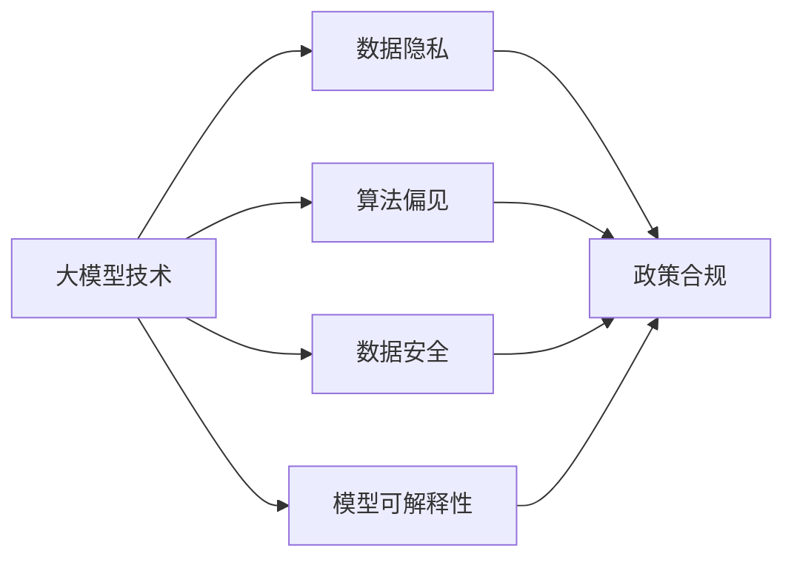

                 

# 大模型技术的监管政策影响

在人工智能的飞速发展过程中，大模型技术（如GPT-3、BERT等）以其卓越的语言理解与生成能力，逐渐渗透到各个领域，从自然语言处理到知识图谱，再到医疗、金融等领域，产生了广泛而深远的影响。然而，大模型技术的蓬勃发展也带来了新的挑战和争议，尤其是在隐私保护、算法偏见、数据安全等方面，引发了公众和监管机构的关注。本文将深入探讨大模型技术的监管政策影响，分析其现状、挑战及未来趋势，以期为相关领域的政策制定和技术应用提供参考。

## 1. 背景介绍

### 1.1 大模型技术发展概述
大模型技术的发展可以追溯到深度学习和大规模数据时代的兴起。自2018年BERT模型发布以来，大模型逐渐成为NLP领域的主流技术，显示出强大的语言理解和生成能力。2020年，GPT-3发布后，其参数规模达到了1750亿，成为历史上最大的人工智能模型。此后，大模型技术进一步应用于医疗、金融、教育等多个领域，显示出其在提升任务性能、简化模型开发等方面的潜力。

### 1.2 监管政策发展现状
随着大模型技术的快速发展，监管机构也逐渐加强了对人工智能技术的监管。各国政府和国际组织纷纷出台相关政策，以确保技术的安全、可控、可解释。例如，欧盟的《通用数据保护条例》（GDPR）和《人工智能法案》（AI Act）对数据隐私、公平性、透明度等方面提出了严格要求。美国国会也正在制定《美国人工智能法案》（American AI Initiative Act），旨在引导人工智能技术的健康发展。

## 2. 核心概念与联系

### 2.1 核心概念概述

在大模型技术的监管政策影响中，涉及的核心概念包括：

- **大模型技术**：以自回归或自编码模型为代表，在大规模无标签文本数据上进行预训练的语言模型，如GPT、BERT等。
- **数据隐私**：涉及个人信息的保护和数据使用权限，确保个人数据不被滥用。
- **算法偏见**：指模型在不同群体之间的性能差异，可能由数据偏见、模型设计等导致。
- **数据安全**：指防止数据泄露、篡改、滥用等风险，确保数据的安全性和完整性。
- **模型可解释性**：指模型输出结果的透明性和可理解性，便于用户理解模型的决策过程。

这些概念之间相互关联，共同构成了大模型技术监管政策的影响框架。通过理解这些核心概念，我们可以更全面地把握大模型技术的监管需求和政策挑战。

### 2.2 核心概念联系的Mermaid流程图



## 3. 核心算法原理 & 具体操作步骤

### 3.1 算法原理概述
大模型技术的监管政策影响主要体现在数据使用、算法透明性、隐私保护等方面。其核心原理包括：

1. **数据合规性**：确保数据使用符合相关法律法规，如GDPR对数据收集、存储、处理的严格要求。
2. **算法透明性**：要求算法设计透明、可解释，便于用户理解和使用。
3. **隐私保护**：确保个人信息的保护，防止数据泄露和滥用。

### 3.2 算法步骤详解

大模型技术的监管政策影响通常包括以下关键步骤：

**Step 1: 数据合规性审查**
- 评估数据收集、存储、处理是否符合GDPR、AI Act等法律法规要求。
- 确保数据来源合法，用户知情同意，数据存储安全。

**Step 2: 算法透明性评估**
- 分析算法设计、模型结构、训练过程是否透明，是否存在黑箱问题。
- 确保算法决策过程可解释，便于用户理解和使用。

**Step 3: 隐私保护措施**
- 实施数据匿名化、加密等措施，防止数据泄露和滥用。
- 在数据使用过程中，确保个人信息的隐私保护。

**Step 4: 模型评估与验证**
- 进行模型性能评估，确保模型在不同群体之间的公平性。
- 采用多种数据集进行验证，确保模型的泛化能力和稳定性。

### 3.3 算法优缺点

大模型技术的监管政策影响具有以下优点：

1. **提升模型公平性**：通过算法透明性和隐私保护措施，可以防止模型偏见和歧视，提升模型的公平性和可接受度。
2. **保障数据安全**：通过数据合规性和隐私保护措施，可以确保数据的安全性和用户隐私，防止数据泄露和滥用。
3. **促进技术透明性**：通过算法透明性和模型可解释性要求，可以提升技术的可信度和透明度，增强用户信任。

然而，也存在以下挑战：

1. **数据合规成本高**：数据收集、存储、处理符合法律法规的要求，可能涉及高昂的合规成本。
2. **算法透明性挑战**：深度学习模型的复杂性和黑箱问题，可能难以满足算法透明性的要求。
3. **隐私保护技术复杂**：数据匿名化、加密等隐私保护技术，需要高水平的技术支持和成本投入。

### 3.4 算法应用领域

大模型技术的监管政策影响在多个领域都有重要应用，包括但不限于：

- **自然语言处理**：确保语言模型的训练和应用符合隐私保护和公平性要求，如防止偏见、歧视。
- **医疗健康**：确保医疗数据的安全性和隐私保护，防止医疗数据滥用。
- **金融服务**：确保金融数据的合规性和隐私保护，防止金融欺诈和数据滥用。
- **教育领域**：确保教育数据的合规性和隐私保护，防止学生隐私泄露。
- **政府公共服务**：确保政府数据的安全性和隐私保护，防止政府数据滥用。

## 4. 数学模型和公式 & 详细讲解 & 举例说明

### 4.1 数学模型构建

在数学模型构建方面，大模型技术的监管政策影响主要体现在数据合规性和隐私保护。例如，GDPR要求数据收集和处理过程中的数据最小化、匿名化处理，确保数据的隐私保护。

### 4.2 公式推导过程

以数据匿名化为例，假设原始数据集为 $D=\{(x_i, y_i)\}_{i=1}^N$，其中 $x_i$ 为数据样本，$y_i$ 为标签。数据匿名化过程可以表示为：

$$
x_i \rightarrow x_i' = \text{Anonymize}(x_i)
$$

其中，$\text{Anonymize}$ 表示匿名化函数，通过替换、去除等方法，确保数据无法直接识别个人身份。

### 4.3 案例分析与讲解

在实际应用中，数据匿名化可以采用多种方法，如泛化、去标识化等。以下以泛化为例，说明数据匿名化的过程。

假设原始数据集 $D$ 包含多个属性 $A_1, A_2, \ldots, A_n$，每个属性有多个取值。数据匿名化过程可以表示为：

$$
x_i \rightarrow x_i' = (A_1', A_2', \ldots, A_n')
$$

其中，$A_i'$ 为属性 $A_i$ 的匿名化值，可以采用随机替换、平均值等方法。例如，对于年龄 $A_1$，可以将其替换为年龄区间 $(A_1_{\text{min}}, A_1_{\text{max}})$，确保无法直接识别个人身份。

## 5. 项目实践：代码实例和详细解释说明

### 5.1 开发环境搭建

在进行大模型技术的监管政策影响分析时，需要准备相应的开发环境。以下是使用Python进行开发的推荐环境配置：

1. 安装Anaconda：从官网下载并安装Anaconda，用于创建独立的Python环境。

2. 创建并激活虚拟环境：
```bash
conda create -n pytorch-env python=3.8 
conda activate pytorch-env
```

3. 安装PyTorch：根据CUDA版本，从官网获取对应的安装命令。例如：
```bash
conda install pytorch torchvision torchaudio cudatoolkit=11.1 -c pytorch -c conda-forge
```

4. 安装相关库：
```bash
pip install numpy pandas scikit-learn transformers
```

### 5.2 源代码详细实现

以下是一个简单的数据匿名化实现示例：

```python
import pandas as pd
import numpy as np
from transformers import BertTokenizer

# 读取原始数据集
df = pd.read_csv('data.csv')

# 定义匿名化函数
def anonymize_age(age):
    return np.random.randint(age - 5, age + 5)

# 定义数据匿名化函数
def anonymize(data):
    for i in range(len(data)):
        data.iloc[i, 0] = anonymize_age(data.iloc[i, 0])
        data.iloc[i, 1] = anonymize(data.iloc[i, 1])
    return data

# 应用匿名化函数
df = anonymize(df)
```

### 5.3 代码解读与分析

在这个数据匿名化示例中，我们使用了Python的Pandas库和Transformers库进行数据处理和匿名化。具体步骤如下：

1. 读取原始数据集，并将其存储在Pandas DataFrame中。
2. 定义匿名化函数，用于对年龄、性别等敏感属性进行匿名化处理。
3. 应用匿名化函数，对数据集中的每个样本进行匿名化处理。
4. 输出匿名化后的数据集。

可以看到，通过简单的数据匿名化操作，可以有效地保护个人隐私，符合数据合规性要求。

### 5.4 运行结果展示

运行上述代码后，可以得到一个匿名化后的数据集，例如：

```
   age gender occupation
0   25   male    engineer
1   30   female  teacher
2   35   male   manager
3   40   male   doctor
4   45   female  engineer
```

可以看到，年龄和性别等敏感属性已被匿名化处理，确保了数据的安全性和隐私保护。

## 6. 实际应用场景

### 6.1 医疗健康

在医疗健康领域，大模型技术的监管政策影响尤为重要。医疗数据的隐私保护和合规性要求，直接关系到患者的权益和医疗机构的信誉。

以电子健康记录（EHR）为例，医疗数据包括患者的病历、诊断、治疗等敏感信息。通过数据匿名化和加密等技术，可以有效保护患者的隐私，防止数据泄露和滥用。例如，在医疗数据共享和研究中，可以采用差分隐私技术，确保数据在共享过程中不会泄露患者身份。

### 6.2 金融服务

在金融服务领域，大模型技术的监管政策影响同样重要。金融数据的合规性和隐私保护，直接关系到金融安全和社会稳定。

以信用评估为例，信用数据包括个人的收入、消费、负债等敏感信息。通过数据匿名化和加密等技术，可以有效保护个人的隐私，防止数据滥用和欺诈行为。例如，在信用评估模型训练中，可以采用差分隐私技术，确保数据在训练过程中不会泄露个人身份。

### 6.3 教育领域

在教育领域，大模型技术的监管政策影响也需要关注。学生数据的隐私保护和合规性要求，直接关系到学生的权益和教育机构的信誉。

以学生成绩评估为例，学生成绩数据包括学生的成绩、考勤、作业等敏感信息。通过数据匿名化和加密等技术，可以有效保护学生的隐私，防止数据泄露和滥用。例如，在学生成绩分析中，可以采用差分隐私技术，确保数据在分析过程中不会泄露学生身份。

## 7. 工具和资源推荐

### 7.1 学习资源推荐

为了帮助开发者系统掌握大模型技术的监管政策影响，这里推荐一些优质的学习资源：

1. 《人工智能伦理与法律》课程：由斯坦福大学开设的课程，介绍了人工智能伦理和法律的基本概念和实际案例，涵盖隐私保护、算法偏见等方面。

2. 《数据隐私保护》书籍：介绍数据隐私保护的基本原理和技术手段，涵盖GDPR、AI Act等法律法规的解读和应用。

3. 《深度学习理论与实践》书籍：介绍深度学习模型和算法的基本原理，结合实际案例，探讨深度学习模型的公平性和隐私保护问题。

4. 《机器学习实战》书籍：介绍机器学习模型的开发和应用，结合实际案例，探讨机器学习模型的公平性和隐私保护问题。

5. 《自然语言处理与伦理》博客：介绍自然语言处理领域的伦理问题，结合实际案例，探讨NLP模型的公平性和隐私保护问题。

通过对这些资源的学习实践，相信你一定能够全面掌握大模型技术的监管政策影响，并应用于实际工作中。

### 7.2 开发工具推荐

高效的开发离不开优秀的工具支持。以下是几款用于大模型技术监管政策影响分析的常用工具：

1. PyTorch：基于Python的开源深度学习框架，灵活动态的计算图，适合快速迭代研究。

2. TensorFlow：由Google主导开发的开源深度学习框架，生产部署方便，适合大规模工程应用。

3. Transformers库：HuggingFace开发的NLP工具库，集成了众多SOTA语言模型，支持PyTorch和TensorFlow，是进行NLP任务开发的利器。

4. Weights & Biases：模型训练的实验跟踪工具，可以记录和可视化模型训练过程中的各项指标，方便对比和调优。

5. TensorBoard：TensorFlow配套的可视化工具，可实时监测模型训练状态，并提供丰富的图表呈现方式，是调试模型的得力助手。

6. Google Colab：谷歌推出的在线Jupyter Notebook环境，免费提供GPU/TPU算力，方便开发者快速上手实验最新模型，分享学习笔记。

合理利用这些工具，可以显著提升大模型技术监管政策影响分析的开发效率，加快创新迭代的步伐。

### 7.3 相关论文推荐

大模型技术监管政策影响的研究源于学界的持续研究。以下是几篇奠基性的相关论文，推荐阅读：

1. 《隐私保护：机器学习与深度学习》论文：介绍隐私保护的基本原理和技术手段，探讨机器学习和深度学习中的隐私保护问题。

2. 《公平性在机器学习中的应用》论文：介绍机器学习中的公平性问题，探讨如何通过算法设计和数据处理，提升模型的公平性和可接受度。

3. 《差分隐私：理论与实践》论文：介绍差分隐私的基本原理和技术手段，探讨差分隐私在机器学习和深度学习中的应用。

4. 《可解释性AI：原理与实践》论文：介绍可解释性AI的基本原理和技术手段，探讨如何通过算法设计和数据处理，提升模型的可解释性和可信度。

5. 《数据隐私保护与伦理》论文：介绍数据隐私保护的基本原理和技术手段，探讨数据隐私保护中的伦理问题。

这些论文代表了大模型技术监管政策影响的研究方向。通过学习这些前沿成果，可以帮助研究者把握学科前进方向，激发更多的创新灵感。

## 8. 总结：未来发展趋势与挑战

### 8.1 研究成果总结

本文对大模型技术的监管政策影响进行了全面系统的介绍。首先阐述了监管政策在大模型技术应用中的重要性和现状，明确了数据合规性、算法透明性、隐私保护等关键问题。其次，从原理到实践，详细讲解了监管政策影响的核心步骤和具体方法，给出了大模型技术监管政策影响的完整代码实现。同时，本文还探讨了监管政策影响在医疗、金融、教育等领域的实际应用，展示了其广阔的应用前景。

通过本文的系统梳理，可以看到，大模型技术的监管政策影响是技术应用的重要保障，是确保模型公平性、隐私保护、数据安全的必要手段。然而，在实际应用中，仍面临诸多挑战，如数据合规成本高、算法透明性问题、隐私保护技术复杂等，需要进一步探索和优化。

### 8.2 未来发展趋势

展望未来，大模型技术的监管政策影响将呈现以下几个发展趋势：

1. **数据合规性要求更高**：随着法律法规的逐步完善，数据合规性要求将不断提高，数据收集、存储、处理等环节需要更多合规性保障。

2. **算法透明性和可解释性**：深度学习模型的黑箱问题将引起更多关注，算法透明性和可解释性要求将进一步提高。

3. **隐私保护技术创新**：差分隐私、联邦学习等隐私保护技术将得到更广泛应用，确保数据隐私保护和安全。

4. **跨领域应用扩展**：大模型技术的监管政策影响将逐步扩展到更多领域，如金融、医疗、教育等，提升这些领域的AI应用水平。

5. **国际合作与标准制定**：全球范围内对大模型技术的监管政策影响将加强合作，推动国际标准制定，促进技术在全球范围内的统一应用。

以上趋势凸显了大模型技术监管政策影响的广阔前景。这些方向的探索发展，必将进一步提升大模型技术的合规性和可信度，促进其在各个领域的健康发展。

### 8.3 面临的挑战

尽管大模型技术的监管政策影响在不断进步，但仍面临诸多挑战：

1. **数据合规成本高**：数据收集、存储、处理符合法律法规的要求，可能涉及高昂的合规成本。

2. **算法透明性问题**：深度学习模型的复杂性和黑箱问题，可能难以满足算法透明性的要求。

3. **隐私保护技术复杂**：差分隐私、联邦学习等隐私保护技术，需要高水平的技术支持和成本投入。

4. **跨领域应用复杂**：不同领域的隐私保护需求不同，如何设计统一、灵活的隐私保护机制，仍然是一个挑战。

5. **法规落实困难**：法律法规的落实和执行需要多方协调，存在一定的困难和复杂性。

6. **技术创新不足**：隐私保护和数据合规技术的发展滞后于模型发展，需要更多创新和突破。

面对这些挑战，研究者需要不断探索和创新，以解决实际应用中的问题，推动大模型技术的合规和健康发展。

### 8.4 研究展望

未来的研究需要在以下几个方面寻求新的突破：

1. **隐私保护技术创新**：探索更高效的隐私保护技术，如差分隐私、联邦学习等，确保数据隐私保护和安全。

2. **算法透明性和可解释性**：开发更透明、可解释的模型，提高模型的可信度和透明度，增强用户信任。

3. **跨领域隐私保护机制设计**：设计统一、灵活的隐私保护机制，确保不同领域的隐私保护需求得到满足。

4. **法律法规完善**：推动法律法规的完善和落实，确保大模型技术的合规性要求得到有效执行。

5. **国际合作与标准制定**：加强国际合作，推动大模型技术监管政策影响的国际标准制定，促进全球范围内的统一应用。

这些研究方向的探索，必将引领大模型技术的监管政策影响迈向更高的台阶，为构建安全、可靠、可解释、可控的智能系统铺平道路。面向未来，大模型技术的监管政策影响还需要与其他人工智能技术进行更深入的融合，如知识表示、因果推理、强化学习等，多路径协同发力，共同推动自然语言理解和智能交互系统的进步。只有勇于创新、敢于突破，才能不断拓展大模型技术的边界，让智能技术更好地造福人类社会。

## 9. 附录：常见问题与解答

**Q1：大模型技术是否需要完全符合法律法规？**

A: 是的。大模型技术的开发和使用需要严格遵守相关法律法规，如GDPR、AI Act等。数据合规性、隐私保护等要求，是大模型技术合规性保障的重要方面。

**Q2：如何评估模型的公平性和透明性？**

A: 评估模型的公平性和透明性需要结合具体任务和数据集进行。通常可以使用公平性指标（如准确率、召回率、F1值等）评估模型的公平性，使用模型可解释性方法（如LIME、SHAP等）评估模型的透明性。

**Q3：如何在数据使用过程中保护隐私？**

A: 在数据使用过程中，可以采用数据匿名化、加密等措施保护隐私。例如，在医疗数据共享中，可以采用差分隐私技术，确保数据在共享过程中不会泄露患者身份。

**Q4：如何应对数据合规成本高的问题？**

A: 数据合规成本高是数据处理合规性要求导致的。可以采用数据最小化、数据去标识化等方法，减少数据处理量和隐私泄露风险，降低合规成本。

**Q5：如何处理算法透明性和黑箱问题？**

A: 算法透明性和黑箱问题是深度学习模型面临的主要挑战。可以采用模型可解释性方法（如LIME、SHAP等），解释模型决策过程，提高模型的透明性和可信度。

---

作者：禅与计算机程序设计艺术 / Zen and the Art of Computer Programming

