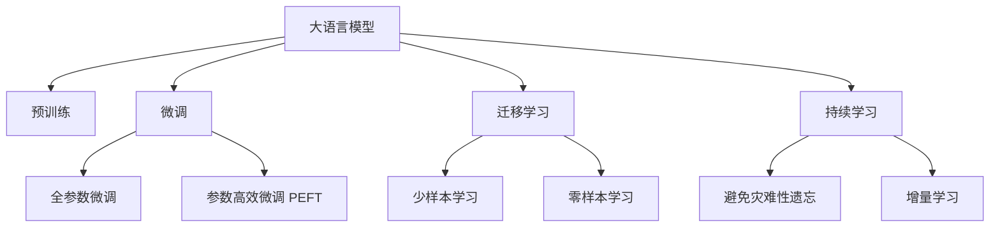

                 

## 1. 背景介绍

近年来，大语言模型（Large Language Models, LLMs）如雨后春笋般涌现，在NLP领域取得了革命性的突破。BERT、GPT-3、T5等模型通过海量无标签文本数据进行预训练，具备强大的语言理解与生成能力，被广泛应用于问答、翻译、生成文本来等诸多领域。

但与此同时，我们也必须清醒认识到，这些大模型并非完美的神兵利器，它们同样有局限性。宿命论说，大模型终会因“过拟合”、“偏见”、“资源消耗”等宿命问题而走向衰落。然而，我们相信大模型具备强大的生命力，只要充分发挥其优势，规避其缺陷，就能在大模型技术这条道路上越走越远。本文将深度剖析大模型的优势与局限，探讨其如何走出宿命，走向更辉煌的未来。

## 2. 核心概念与联系

### 2.1 核心概念概述

- **大语言模型 (LLMs)**: 一种基于自回归或自编码的深度神经网络模型，通过在大规模无标签数据上进行预训练，学习语言和常识。常见的模型包括BERT、GPT、T5等。
- **预训练 (Pre-training)**: 在大规模无标签数据上，通过自监督学习任务训练通用语言模型的过程。如BERT的掩码语言模型和GPT的语言建模任务。
- **微调 (Fine-tuning)**: 在预训练模型的基础上，使用下游任务的少量标注数据进行有监督优化，提升模型在特定任务上的性能。
- **迁移学习 (Transfer Learning)**: 将一个领域学到的知识迁移到另一个领域的学习方法。预训练模型和微调是典型的迁移学习方式。
- **持续学习 (Continual Learning)**: 模型能够持续学习新知识，同时保持已有知识的稳定，避免灾难性遗忘。

这些概念之间存在紧密联系，共同构成大模型技术的核心。

### 2.2 核心概念原理和架构的 Mermaid 流程图



该图展示了大模型技术的核心概念及其逻辑关系。

## 3. 核心算法原理 & 具体操作步骤

### 3.1 算法原理概述

大语言模型微调的核心思想是，将预训练模型作为初始化参数，利用下游任务的少量标注数据进行有监督学习，从而提升模型在特定任务上的性能。数学上，微调过程可以表示为：

$$
\theta^* = \arg\min_{\theta} \frac{1}{N} \sum_{i=1}^N \ell (y_i, M_{\theta}(x_i))
$$

其中，$M_{\theta}$为预训练模型，$x_i$为输入，$y_i$为标签，$\ell$为损失函数，$\theta$为可训练参数。

### 3.2 算法步骤详解

1. **准备预训练模型和数据集**：选择合适的预训练模型，准备下游任务的标注数据集。
2. **添加任务适配层**：在预训练模型上添加与下游任务相关的输出层和损失函数。
3. **设置微调超参数**：包括优化算法、学习率、批大小、迭代轮数等。
4. **执行梯度训练**：通过反向传播计算梯度，并更新模型参数。
5. **测试和部署**：在测试集上评估微调后的模型，并集成到实际应用系统中。

### 3.3 算法优缺点

**优点**：
- 简单高效，适合多种NLP任务。
- 能够快速提升模型性能，适合数据量较小的任务。

**缺点**：
- 依赖标注数据，数据质量低会导致过拟合。
- 无法泛化到未见过的数据，容易产生偏见和错误。
- 资源消耗大，计算成本高。

### 3.4 算法应用领域

微调在大模型技术中广泛应用于问答、翻译、摘要、对话、情感分析、推荐系统等多个领域。例如，通过微调BERT模型，可以提升其在问答任务中的准确率；通过微调GPT模型，可以实现高精度的机器翻译；通过微调预训练模型，可以生成高质量的文本摘要。

## 4. 数学模型和公式 & 详细讲解 & 举例说明

### 4.1 数学模型构建

以BERT为例，其微调过程可以表示为：

$$
M_{\theta}(x_i) = [CLS]\cdot W^0 + [x_i]\cdot W^1
$$

其中，$[CLS]$为BERT的CLS token嵌入，$[x_i]$为输入序列$x_i$的嵌入，$W^0$和$W^1$为模型参数。

### 4.2 公式推导过程

设标签为$y_i \in \{0,1\}$，则交叉熵损失函数为：

$$
\ell(y_i, M_{\theta}(x_i)) = -(y_i \log M_{\theta}(x_i) + (1-y_i)\log (1-M_{\theta}(x_i)))
$$

### 4.3 案例分析与讲解

考虑使用BERT进行情感分类任务。首先，将训练集中的文本输入BERT，得到CLS token的输出，然后通过softmax层将输出转换为概率分布，计算交叉熵损失。接着，使用AdamW优化器更新BERT的参数。

## 5. 项目实践：代码实例和详细解释说明

### 5.1 开发环境搭建

1. 安装Anaconda和创建Python环境。
2. 安装PyTorch、Transformers和相关库。
3. 下载预训练BERT模型和任务数据集。

### 5.2 源代码详细实现

以情感分类任务为例，代码如下：

```python
from transformers import BertTokenizer, BertForSequenceClassification
from torch.utils.data import DataLoader
from torch import nn

# 初始化BERT模型和tokenizer
model = BertForSequenceClassification.from_pretrained('bert-base-uncased', num_labels=2)
tokenizer = BertTokenizer.from_pretrained('bert-base-uncased')

# 数据集处理
train_data = ...
val_data = ...

# 模型训练
model.train()
loss_fn = nn.CrossEntropyLoss()
for batch in DataLoader(train_data, batch_size=32):
    inputs = tokenizer(batch['input'], truncation=True, padding=True, max_length=256)
    labels = batch['labels']
    outputs = model(**inputs)
    loss = loss_fn(outputs.logits, labels)
    loss.backward()
    optimizer.step()
    optimizer.zero_grad()
```

### 5.3 代码解读与分析

该代码展示了使用预训练BERT模型进行情感分类任务的基本流程。首先，初始化BERT模型和tokenizer，然后处理训练数据，并定义损失函数。接着，通过循环迭代，在每个batch上计算损失，并使用AdamW优化器更新模型参数。

### 5.4 运行结果展示

在验证集上评估微调后的模型，输出分类准确率：

```python
val_data = ...
model.eval()
val_loss = 0.0
val_acc = 0.0
for batch in DataLoader(val_data, batch_size=32):
    with torch.no_grad():
        inputs = tokenizer(batch['input'], truncation=True, padding=True, max_length=256)
        labels = batch['labels']
        outputs = model(**inputs)
        val_loss += loss_fn(outputs.logits, labels).item()
        val_acc += accuracy_fn(outputs.logits, labels).item()
print(f"Validation loss: {val_loss/len(val_data)}, Validation accuracy: {val_acc/len(val_data)}")
```

## 6. 实际应用场景

### 6.1 医疗诊断

在医疗诊断领域，大语言模型可以辅助医生进行疾病诊断。通过微调BERT等模型，可以构建问答系统，帮助医生快速找到相关文献、症状和治疗方案。

### 6.2 金融分析

金融分析师可以使用微调后的模型，进行情感分析、舆情监测、风险评估等任务。通过分析市场新闻和社交媒体数据，模型可以提供决策支持。

### 6.3 教育培训

在教育领域，大语言模型可以用于个性化推荐、智能辅导、学情分析等任务。通过微调模型，可以生成高质量的学习材料，提供个性化推荐，帮助学生提高学习效率。

### 6.4 未来应用展望

未来，大语言模型将在更多领域得到应用。例如，在智慧城市治理中，可以使用微调后的模型进行事件监测、舆情分析、应急指挥等任务，提高城市管理的自动化和智能化水平。

## 7. 工具和资源推荐

### 7.1 学习资源推荐

1. 《Transformer原理与实践》：深入介绍Transformer和BERT模型的原理与实践。
2. CS224N《深度学习自然语言处理》：斯坦福大学NLP课程，涵盖NLP基础和前沿技术。
3. 《自然语言处理与Transformer》：介绍Transformer库的使用和微调。
4. HuggingFace官方文档：提供丰富的预训练模型和微调样例。
5. CLUE开源项目：中文NLP数据集和预训练模型。

### 7.2 开发工具推荐

1. PyTorch：深度学习框架，适合研究和开发。
2. TensorFlow：Google开发的深度学习框架，适合生产部署。
3. Transformers库：NLP工具库，提供预训练模型和微调功能。
4. Weights & Biases：模型实验跟踪工具，提供可视化界面。
5. TensorBoard：TensorFlow配套的可视化工具。

### 7.3 相关论文推荐

1. Attention is All You Need：Transformer原论文，开启预训练大模型时代。
2. BERT：预训练深度双向Transformer，刷新多项NLP任务SOTA。
3. GPT-3：语言生成大模型，展现强大的zero-shot学习能力。
4. Parameter-Efficient Transfer Learning for NLP：提出Adapter等参数高效微调方法。
5. AdaLoRA：参数高效微调方法，提升模型效率和精度。

## 8. 总结：未来发展趋势与挑战

### 8.1 研究成果总结

本文详细介绍了大语言模型的微调方法，从理论到实践，展示了其核心概念和应用场景。通过代码实例，提供了微调任务的实现方法。

### 8.2 未来发展趋势

1. 模型规模增大：预训练模型规模将持续增长，学习更多语言知识。
2. 微调方法多样化：引入 Prefix-Tuning、LoRA 等参数高效微调方法。
3. 持续学习成为常态：模型需要持续学习新知识，保持性能。
4. 标注数据需求降低：引入 Prompt-based Learning 方法，减少标注样本。
5. 多模态微调崛起：融合视觉、语音等多模态数据，提升建模能力。

### 8.3 面临的挑战

1. 标注成本瓶颈：微调依赖大量标注数据，获取高质量标注数据困难。
2. 模型鲁棒性不足：在域外数据上泛化性能差，容易遗忘旧知识。
3. 推理效率低下：超大模型推理速度慢，内存占用大。
4. 可解释性不足：模型决策过程缺乏解释，难以调试。
5. 安全性问题：模型可能学习有害信息，产生误导性输出。

### 8.4 研究展望

1. 探索无监督和半监督微调方法：摆脱对标注数据的依赖。
2. 参数高效和计算高效微调：在固定预训练参数的同时，只更新少量任务相关参数。
3. 引入因果学习和对比学习：增强模型的泛化能力和鲁棒性。
4. 整合外部知识：将符号化知识与神经网络模型结合，提升模型表现。
5. 纳入伦理道德约束：在模型训练目标中引入伦理导向的评估指标。

## 9. 附录：常见问题与解答

### 9.1 大语言模型微调是否适用于所有NLP任务？

A: 微调在大多数NLP任务上都能取得不错的效果，但对于某些特定领域，可能需要更专业的预训练模型和微调策略。

### 9.2 如何选择微调学习率？

A: 微调学习率一般要比预训练时小1-2个数量级，通常从1e-5开始，逐步减小学习率，使用warmup策略或Adafactor等优化器来调整学习率。

### 9.3 微调过程中如何避免过拟合？

A: 采用数据增强、正则化、对抗训练、参数高效微调等方法，减少模型过拟合。

### 9.4 微调模型在落地部署时需要注意哪些问题？

A: 考虑模型裁剪、量化加速、服务化封装、弹性伸缩、监控告警和安全防护等，确保模型稳定、高效和安全性。

---

作者：禅与计算机程序设计艺术 / Zen and the Art of Computer Programming

