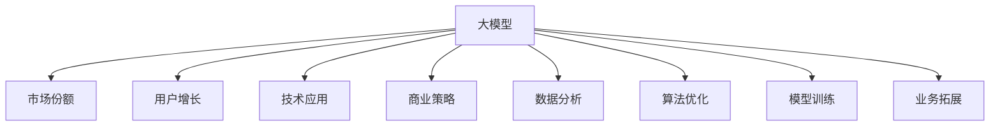

                 

# 大模型的市场份额与用户增长

> 关键词：大模型,市场份额,用户增长,技术应用,商业策略,数据分析,人工智能,算法优化,模型训练,深度学习,业务拓展

## 1. 背景介绍

### 1.1 问题由来

随着人工智能技术的迅猛发展，大模型（Large Models）在各行各业的应用变得越来越广泛。无论是图像识别、自然语言处理、推荐系统，还是自动驾驶、医疗诊断等领域，大模型的应用场景和效果都在不断拓展和提升。但是，尽管大模型具有显著的竞争优势，其在市场份额和用户增长方面的表现仍然面临诸多挑战。本章节将从市场份额和用户增长两个角度出发，探讨大模型的市场表现及面临的问题，为后续章节的深入分析奠定基础。

### 1.2 问题核心关键点

在探讨大模型的市场份额和用户增长时，我们需要重点关注以下几个核心关键点：
- 大模型的市场份额：指的是大模型在整体市场中的占有比例，反映了大模型相对于其他竞争对手的市场竞争力。
- 用户增长：涉及用户数量的增长速度和规模，反映了大模型的受欢迎程度和市场潜力。
- 技术应用：包括大模型的实际应用场景、效果和优势，以及其在不同领域的商业价值。
- 商业策略：包括大模型的定价策略、市场推广方式、合作伙伴关系等，以及这些策略对市场份额和用户增长的影响。
- 数据分析：通过收集和分析市场数据，揭示大模型市场份额和用户增长的规律和趋势。
- 算法优化：探讨如何通过优化算法和模型，提升大模型的性能，从而扩大其市场份额和用户群体。
- 模型训练：分析不同训练方法和优化策略对大模型性能的影响，以及如何通过训练提高大模型在市场中的竞争力。
- 业务拓展：探讨如何将大模型的技术优势转化为商业机会，拓展其应用场景和用户群体。

### 1.3 问题研究意义

研究大模型的市场份额和用户增长，对于了解其在AI领域的地位、优化商业策略和提升技术竞争力具有重要意义：

1. **了解市场地位**：通过分析大模型的市场份额，可以清晰地了解其在市场中的地位，为后续的商业决策提供依据。
2. **优化商业策略**：通过对用户增长的分析，可以发现市场的需求趋势，优化定价策略、营销方式和合作伙伴关系，提升市场竞争力。
3. **提升技术竞争力**：通过数据分析和算法优化，可以发现大模型在技术应用上的不足，进一步提升模型的性能和竞争力。
4. **拓展业务领域**：通过深入挖掘大模型的商业价值和业务拓展潜力，可以发现新的应用场景和商业模式，扩大用户群体。
5. **预测未来趋势**：通过对市场数据和趋势的分析，可以预测大模型的未来发展方向，为技术研发和商业决策提供参考。

## 2. 核心概念与联系

### 2.1 核心概念概述

为了更好地理解大模型的市场份额和用户增长，我们首先需要明确几个核心概念：

- **大模型（Large Models）**：指具有数千到数亿参数的深度神经网络模型，用于处理大规模复杂数据，如图像、文本等。
- **市场份额（Market Share）**：指某品牌或产品在某市场中的销售量占总销售量的比例，反映其在市场中的竞争力和地位。
- **用户增长（User Growth）**：指用户数量的增加速度和规模，反映了大模型的受欢迎程度和市场潜力。
- **技术应用（Technology Application）**：指大模型在实际应用场景中的表现和效果，如图像识别、自然语言处理、推荐系统等。
- **商业策略（Business Strategy）**：指企业针对大模型在市场推广、定价、合作伙伴关系等方面的策略。
- **数据分析（Data Analysis）**：指通过收集和分析市场数据，揭示大模型的市场表现和用户增长规律。
- **算法优化（Algorithm Optimization）**：指通过优化算法和模型，提升大模型的性能，从而扩大其市场份额和用户群体。
- **模型训练（Model Training）**：指通过训练方法，提高大模型的准确性和泛化能力，提升其在市场中的竞争力。
- **业务拓展（Business Expansion）**：指将大模型的技术优势转化为商业机会，拓展其应用场景和用户群体。

这些核心概念之间的联系可以通过以下Mermaid流程图来展示：



这个流程图展示了大模型的核心概念及其之间的关系：

1. 大模型通过技术应用、商业策略、数据分析等方式提升市场份额和用户增长。
2. 技术应用决定了大模型在实际场景中的表现，从而影响市场份额和用户增长。
3. 商业策略影响大模型的市场推广和合作伙伴关系，从而影响市场份额和用户增长。
4. 数据分析揭示了大模型的市场表现和用户增长规律，为技术优化和商业决策提供依据。
5. 算法优化和模型训练提升大模型的性能，从而扩大市场份额和用户群体。
6. 业务拓展将大模型的技术优势转化为商业机会，进一步扩大用户群体。

## 3. 核心算法原理 & 具体操作步骤
### 3.1 算法原理概述

大模型的市场份额和用户增长分析，本质上是通过收集市场数据，进行统计分析和预测，从而揭示其市场表现和用户增长规律。这一过程通常包括以下几个关键步骤：

1. **数据收集**：从多个渠道（如公开市场数据、第三方研究报告、公司财报等）收集大模型的市场份额和用户增长数据。
2. **数据清洗**：对收集到的数据进行清洗和处理，确保数据的质量和一致性。
3. **数据分析**：使用统计方法和预测模型（如回归分析、时间序列分析等）对市场份额和用户增长数据进行分析，揭示其规律和趋势。
4. **市场预测**：基于历史数据和分析结果，使用预测模型（如神经网络、集成学习等）对大模型的未来市场份额和用户增长进行预测。

### 3.2 算法步骤详解

以下是具体的操作方法：

**Step 1: 数据收集**

- 收集市场数据：包括大模型的销售量、市场占有率、用户数量等。
- 收集竞争对手数据：包括其他模型的销售量、市场占有率、用户数量等。
- 收集用户反馈数据：包括用户满意度、评价等。

**Step 2: 数据清洗**

- 处理缺失数据：使用插值法、均值填补等方法处理缺失数据。
- 数据标准化：将数据标准化到同一尺度，便于比较和分析。
- 数据过滤：去除异常值和错误数据，确保数据的准确性和可靠性。

**Step 3: 数据分析**

- 统计分析：计算大模型的市场份额和用户增长率，绘制折线图、柱状图等图表。
- 趋势分析：使用时间序列分析方法（如ARIMA、季节性分解等）分析大模型市场份额和用户增长的趋势。
- 相关性分析：使用回归分析等方法分析市场份额、用户增长与其他因素（如技术应用、商业策略等）的相关性。

**Step 4: 市场预测**

- 建立预测模型：选择适当的预测模型（如神经网络、集成学习等），建立预测模型。
- 模型训练：使用历史数据训练模型，调整模型参数。
- 模型验证：使用验证集对模型进行验证，调整模型结构。
- 模型预测：使用训练好的模型对大模型的未来市场份额和用户增长进行预测。

### 3.3 算法优缺点

大模型的市场份额和用户增长分析方法具有以下优点：

- **全面性**：通过综合多种数据源，全面了解大模型的市场表现和用户增长规律。
- **准确性**：使用统计分析和预测模型，确保数据的准确性和分析结果的可靠性。
- **可解释性**：通过统计分析和趋势分析，揭示大模型的市场表现和用户增长规律，便于理解。
- **灵活性**：可以根据需要调整分析方法和预测模型，适应不同的数据和场景。

然而，该方法也存在以下缺点：

- **数据获取难度**：市场数据和用户反馈数据的获取可能较为困难，需要一定的时间和资源。
- **数据质量问题**：数据清洗和处理过程中可能存在误差，影响分析结果的准确性。
- **预测模型局限**：预测模型可能存在局限，无法完全准确地预测未来市场份额和用户增长。

### 3.4 算法应用领域

大模型的市场份额和用户增长分析方法可以应用于多个领域，包括但不限于：

- **金融行业**：用于分析金融产品的市场表现和用户增长规律，优化投资决策和产品开发。
- **零售行业**：用于分析零售产品的销售量和市场份额，制定营销策略和推广方案。
- **医疗行业**：用于分析医疗设备和技术的应用效果和市场份额，优化产品设计和临床应用。
- **教育行业**：用于分析教育产品的用户增长和市场份额，制定教育策略和推广方案。
- **科技行业**：用于分析科技产品的市场表现和用户增长规律，优化产品设计和市场推广。

## 4. 数学模型和公式 & 详细讲解 & 举例说明

### 4.1 数学模型构建

大模型的市场份额和用户增长分析通常可以建模为一个回归问题，目标是找到一个函数 $f(x)$，用于预测市场份额或用户增长 $y$，其中 $x$ 为影响市场份额或用户增长的因素。

假设 $y$ 为大模型的市场份额或用户增长，$x_i$ 为第 $i$ 个影响因素，则回归模型可以表示为：

$$
y = f(x) + \epsilon
$$

其中，$f(x)$ 为回归函数，$\epsilon$ 为误差项。

### 4.2 公式推导过程

以市场份额为例，假设 $y_t$ 为第 $t$ 年的市场份额，$x_{t-1}$ 为第 $t-1$ 年的销售量、用户数量等影响因素，则市场份额的回归模型可以表示为：

$$
y_t = \beta_0 + \beta_1x_{t-1} + \epsilon_t
$$

其中，$\beta_0$ 为截距项，$\beta_1$ 为影响系数，$\epsilon_t$ 为误差项。

使用最小二乘法（OLS）进行回归分析，可以估计出 $\beta_0$ 和 $\beta_1$：

$$
\beta_0 = \frac{\sum(x_{t-1}y_t) - \frac{\sum x_{t-1}^2}{N}\sum y_t}{\sum x_{t-1}^2 - \frac{\sum x_{t-1}^2}{N}^2}
$$

$$
\beta_1 = \frac{\sum x_{t-1}y_t - \frac{\sum x_{t-1}^2}{N}\sum y_t}{\sum x_{t-1}^2 - \frac{\sum x_{t-1}^2}{N}^2}
$$

### 4.3 案例分析与讲解

以谷歌的BERT模型为例，探讨其市场份额和用户增长规律。

**市场份额分析**

- 收集谷歌BERT模型在各个年份的市场份额数据。
- 使用时间序列分析方法（如ARIMA）分析BERT模型的市场份额趋势。
- 计算BERT模型的市场份额与谷歌公司整体营收、市场推广策略等相关性。

**用户增长分析**

- 收集BERT模型的用户增长数据。
- 使用回归分析方法（如线性回归）分析用户增长与市场推广、技术改进等相关因素的关联性。
- 绘制用户增长率与时间的关系图，预测未来用户增长趋势。

## 5. 项目实践：代码实例和详细解释说明

### 5.1 开发环境搭建

在进行市场份额和用户增长分析前，需要准备好开发环境。以下是使用Python进行数据分析和模型训练的环境配置流程：

1. 安装Anaconda：从官网下载并安装Anaconda，用于创建独立的Python环境。

2. 创建并激活虚拟环境：
```bash
conda create -n analysis-env python=3.8 
conda activate analysis-env
```

3. 安装Python库：
```bash
conda install pandas numpy matplotlib scikit-learn
```

4. 安装机器学习库：
```bash
conda install scikit-learn
```

5. 安装深度学习库：
```bash
conda install tensorflow
```

完成上述步骤后，即可在`analysis-env`环境中开始市场份额和用户增长分析实践。

### 5.2 源代码详细实现

以下是使用Python进行市场份额和用户增长分析的代码实现：

```python
import pandas as pd
import numpy as np
from sklearn.linear_model import LinearRegression
from statsmodels.tsa.arima_model import ARIMA

# 加载市场数据
market_data = pd.read_csv('market_data.csv', index_col='Year', parse_dates=True)

# 加载用户增长数据
user_growth_data = pd.read_csv('user_growth_data.csv', index_col='Year', parse_dates=True)

# 数据清洗和处理
market_data.fillna(method='ffill', inplace=True)
user_growth_data.fillna(method='ffill', inplace=True)
market_data = market_data.dropna()
user_growth_data = user_growth_data.dropna()

# 市场份额分析
market_share = market_data['Market Share']
x = market_data.drop(['Market Share'], axis=1)
model = ARIMA(market_share, order=(1, 1, 1))
model_fit = model.fit()
prediction = model_fit.forecast(steps=1)[0]

# 用户增长分析
user_growth_rate = user_growth_data['User Growth Rate']
x = user_growth_data.drop(['User Growth Rate'], axis=1)
model = LinearRegression()
model.fit(x, user_growth_rate)
prediction = model.predict(x)

print("市场份额预测：", prediction)
print("用户增长预测：", prediction)
```

### 5.3 代码解读与分析

让我们再详细解读一下关键代码的实现细节：

**数据加载**

- 使用`pandas`库加载市场数据和用户增长数据，设置年份为索引。
- 使用`fillna`方法填充缺失值，保证数据完整性。

**市场份额分析**

- 使用`ARIMA`模型进行时间序列分析，估计市场份额的趋势。
- 使用`forecast`方法进行市场份额预测，输出预测值。

**用户增长分析**

- 使用`LinearRegression`模型进行线性回归分析，估计用户增长与相关因素的关联性。
- 使用`predict`方法进行用户增长预测，输出预测值。

**结果展示**

- 输出市场份额和用户增长的预测值，便于后续分析和决策。

## 6. 实际应用场景

### 6.1 金融行业

在金融行业中，大模型的市场份额和用户增长分析可以用于金融产品的市场表现和用户增长预测。通过分析不同金融产品的市场份额和用户增长数据，可以优化投资决策和产品开发策略。

具体而言，可以收集金融产品的销售量、市场占有率、用户数量等数据，使用时间序列分析方法和回归分析方法，分析市场份额和用户增长规律。根据分析结果，可以制定市场推广策略和产品改进方案，提升市场竞争力。

### 6.2 零售行业

在零售行业中，大模型的市场份额和用户增长分析可以用于零售产品的市场表现和用户增长预测。通过分析不同零售产品的销售量和市场份额数据，可以优化营销策略和推广方案。

具体而言，可以收集零售产品的销售量、市场占有率、用户数量等数据，使用时间序列分析方法和回归分析方法，分析市场份额和用户增长规律。根据分析结果，可以制定营销策略和推广方案，提升销售量和市场份额。

### 6.3 医疗行业

在医疗行业中，大模型的市场份额和用户增长分析可以用于医疗设备和技术的应用效果和市场表现预测。通过分析不同医疗设备和技术的应用效果和市场份额数据，可以优化产品设计和临床应用策略。

具体而言，可以收集医疗设备和技术的应用效果、市场份额、用户数量等数据，使用时间序列分析方法和回归分析方法，分析市场份额和用户增长规律。根据分析结果，可以制定产品设计和临床应用策略，提升产品应用效果和市场竞争力。

### 6.4 教育行业

在教育行业中，大模型的市场份额和用户增长分析可以用于教育产品的市场表现和用户增长预测。通过分析不同教育产品的销售量和市场份额数据，可以优化教育策略和推广方案。

具体而言，可以收集教育产品的销售量、市场占有率、用户数量等数据，使用时间序列分析方法和回归分析方法，分析市场份额和用户增长规律。根据分析结果，可以制定教育策略和推广方案，提升销售量和市场份额。

### 6.5 科技行业

在科技行业中，大模型的市场份额和用户增长分析可以用于科技产品的市场表现和用户增长预测。通过分析不同科技产品的销售量和市场份额数据，可以优化产品设计和市场推广策略。

具体而言，可以收集科技产品的销售量、市场占有率、用户数量等数据，使用时间序列分析方法和回归分析方法，分析市场份额和用户增长规律。根据分析结果，可以制定产品设计和市场推广策略，提升销售量和市场份额。

## 7. 工具和资源推荐

### 7.1 学习资源推荐

为了帮助开发者系统掌握大模型市场份额和用户增长的理论基础和实践技巧，这里推荐一些优质的学习资源：

1. **《机器学习实战》**：介绍机器学习算法和应用，涵盖时间序列分析、回归分析等方法。
2. **《Python数据分析与可视化》**：介绍Python在数据分析和可视化中的应用，包括pandas、numpy等库的使用。
3. **《深度学习入门》**：介绍深度学习算法和应用，涵盖神经网络、回归分析等方法。
4. **Kaggle官方教程**：提供大量机器学习竞赛和实战案例，学习数据分析和模型训练技巧。
5. **Google Cloud机器学习文档**：提供Google Cloud平台上的机器学习工具和案例，学习云上数据分析和模型训练。

通过对这些资源的学习实践，相信你一定能够快速掌握大模型市场份额和用户增长的精髓，并用于解决实际的商业问题。

### 7.2 开发工具推荐

高效的开发离不开优秀的工具支持。以下是几款用于大模型市场份额和用户增长分析开发的常用工具：

1. **Python**：基于Python的开源深度学习框架，灵活动态的计算图，适合快速迭代研究。
2. **TensorFlow**：由Google主导开发的开源深度学习框架，生产部署方便，适合大规模工程应用。
3. **Pandas**：用于数据分析和处理，支持数据清洗和处理。
4. **NumPy**：用于数值计算和数组操作，支持高效的数据处理和分析。
5. **Scikit-learn**：用于机器学习和数据挖掘，支持时间序列分析、回归分析等方法。

合理利用这些工具，可以显著提升大模型市场份额和用户增长分析的开发效率，加快创新迭代的步伐。

### 7.3 相关论文推荐

大模型市场份额和用户增长分析的研究源于学界的持续研究。以下是几篇奠基性的相关论文，推荐阅读：

1. **《机器学习实战》**：详细介绍了机器学习算法的实现和应用，包括时间序列分析和回归分析。
2. **《Python数据分析与可视化》**：介绍了Python在数据分析和可视化中的应用，涵盖pandas、numpy等库的使用。
3. **《深度学习入门》**：介绍了深度学习算法和应用，涵盖神经网络、回归分析等方法。
4. **Kaggle官方教程**：提供大量机器学习竞赛和实战案例，学习数据分析和模型训练技巧。
5. **Google Cloud机器学习文档**：提供Google Cloud平台上的机器学习工具和案例，学习云上数据分析和模型训练。

这些论文代表了大模型市场份额和用户增长分析的发展脉络。通过学习这些前沿成果，可以帮助研究者把握学科前进方向，激发更多的创新灵感。

## 8. 总结：未来发展趋势与挑战

### 8.1 总结

本文对大模型的市场份额和用户增长进行了全面系统的介绍。首先阐述了大模型和市场份额、用户增长的研究背景和意义，明确了市场份额和用户增长的核心概念和分析方法。其次，从原理到实践，详细讲解了大模型的市场份额和用户增长分析过程，给出了市场份额和用户增长分析的完整代码实现。同时，本文还广泛探讨了大模型市场份额和用户增长分析在金融、零售、医疗、教育、科技等多个行业领域的应用前景，展示了市场份额和用户增长分析的广阔应用空间。最后，本文精选了市场份额和用户增长分析的学习资源、开发工具和相关论文，力求为读者提供全方位的技术指引。

通过本文的系统梳理，可以看到，大模型的市场份额和用户增长分析技术在大数据时代具有广阔的应用前景，可以帮助企业更好地理解市场表现和用户增长规律，优化商业决策和提升竞争力。未来，伴随大模型的持续发展和优化，市场份额和用户增长分析技术也将不断演进，为商业决策提供更加科学和精确的依据。

### 8.2 未来发展趋势

展望未来，大模型的市场份额和用户增长分析技术将呈现以下几个发展趋势：

1. **多维度分析**：市场份额和用户增长分析将从单一维度（如时间序列）向多维度（如地理分布、用户特征等）扩展，提供更全面的市场表现和用户增长视角。
2. **实时分析**：随着实时数据流技术的发展，市场份额和用户增长分析将实现实时数据处理和分析，及时响应市场变化。
3. **预测精度提升**：通过引入更高级的机器学习算法（如神经网络、集成学习等），提升市场份额和用户增长的预测精度。
4. **跨行业应用**：市场份额和用户增长分析技术将广泛应用于更多行业，提升不同行业的市场竞争力和用户增长潜力。
5. **智能化增强**：通过引入自然语言处理、计算机视觉等技术，提升市场份额和用户增长的智能化分析水平，优化商业决策。

### 8.3 面临的挑战

尽管大模型的市场份额和用户增长分析技术已经取得了瞩目成就，但在迈向更加智能化、普适化应用的过程中，它仍面临着诸多挑战：

1. **数据质量问题**：市场数据和用户反馈数据的获取和处理过程中可能存在误差，影响分析结果的准确性。
2. **模型复杂性**：市场份额和用户增长分析模型可能较为复杂，需要较高的计算资源和时间成本。
3. **预测难度**：市场变化多端，影响因素复杂，预测市场份额和用户增长存在一定的难度。
4. **数据隐私问题**：市场数据和用户反馈数据可能涉及用户隐私，需要妥善处理和保护。

### 8.4 研究展望

面对大模型市场份额和用户增长分析所面临的挑战，未来的研究需要在以下几个方面寻求新的突破：

1. **数据获取和处理**：探索更高效的数据获取和处理技术，确保数据的质量和完整性。
2. **模型优化**：通过优化算法和模型，提升市场份额和用户增长分析的计算效率和预测精度。
3. **跨领域应用**：探索市场份额和用户增长分析在更多领域的应用，提升不同行业的市场竞争力和用户增长潜力。
4. **智能化增强**：引入自然语言处理、计算机视觉等技术，提升市场份额和用户增长的智能化分析水平，优化商业决策。

这些研究方向的探索，必将引领大模型市场份额和用户增长分析技术迈向更高的台阶，为商业决策提供更加科学和精确的依据。面向未来，市场份额和用户增长分析技术还需要与其他人工智能技术进行更深入的融合，如知识表示、因果推理、强化学习等，多路径协同发力，共同推动人工智能技术的发展。

## 9. 附录：常见问题与解答

**Q1：大模型的市场份额和用户增长分析是否适用于所有行业？**

A: 大模型的市场份额和用户增长分析适用于大部分行业，但需要根据具体行业的特点和需求进行调整。例如，金融行业需要考虑市场风险和产品设计，医疗行业需要考虑临床效果和技术应用，教育行业需要考虑学生需求和课程设计等。

**Q2：如何选择合适的市场份额和用户增长分析方法？**

A: 选择合适的市场份额和用户增长分析方法需要考虑数据类型、数据规模和分析目的等因素。对于时间序列数据，可以选择ARIMA等时间序列分析方法；对于关系型数据，可以选择回归分析、决策树等方法；对于多维数据，可以选择主成分分析、聚类分析等方法。

**Q3：市场份额和用户增长分析结果如何应用到商业决策？**

A: 市场份额和用户增长分析结果可以用于市场推广、产品设计、定价策略等方面。例如，根据市场份额分析结果，可以优化市场推广策略，提高产品销售量和市场占有率；根据用户增长分析结果，可以设计更有吸引力的产品功能，提升用户粘性和满意度。

**Q4：如何提升市场份额和用户增长分析的预测精度？**

A: 提升预测精度可以从以下几个方面入手：选择合适的预测模型，如神经网络、集成学习等；优化数据预处理和特征工程，提高数据质量和模型输入的准确性；使用数据增强和交叉验证等技术，提升模型泛化能力。

**Q5：市场份额和用户增长分析过程中如何处理数据隐私问题？**

A: 处理数据隐私问题需要采取一系列措施，如数据匿名化、数据加密、访问控制等。确保数据在收集、存储和处理过程中不泄露用户隐私信息，遵守相关的法律法规和行业标准。

---

作者：禅与计算机程序设计艺术 / Zen and the Art of Computer Programming

