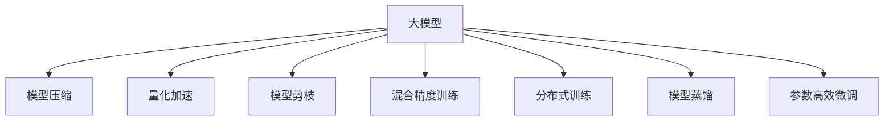

                 

# 大模型的技术优化与市场需求

## 1. 背景介绍

### 1.1 问题由来
随着深度学习技术的飞速发展，大模型在计算机视觉、自然语言处理（NLP）、语音识别等领域的性能不断突破，成为推动AI技术创新的重要引擎。然而，大模型虽然强悍，但技术复杂度高，资源占用大，对应用场景的适配难度较大，难以普及。此外，大模型的推广使用，还面临着性能优化、训练成本、隐私保护等众多挑战。

为了应对这些挑战，技术界和产业界正在积极寻求解决之道，大模型的技术优化和市场需求成为当前热门话题。本文章将全面剖析大模型的技术优化手段，并探讨市场需求背后的驱动力。

### 1.2 问题核心关键点
大模型的技术优化主要围绕以下几个关键点展开：

1. **模型压缩**：减少模型规模，降低资源消耗，提高推理速度。
2. **量化加速**：将高精度模型转换为低精度模型，压缩存储空间，提高计算效率。
3. **模型剪枝**：去除冗余参数，提升模型泛化能力和计算效率。
4. **混合精度训练**：使用混合精度浮点训练，提高模型训练速度，优化资源使用。
5. **分布式训练**：利用多机多卡并行计算，加速模型训练。
6. **模型蒸馏**：将大模型知识传递给小型模型，提升小模型的性能。
7. **参数高效微调**：仅更新部分模型参数，减小微调资源消耗。

这些技术优化手段，不仅能够提升大模型的应用性能，还能降低其应用门槛，推动大模型的广泛应用。

## 2. 核心概念与联系

### 2.1 核心概念概述

为更好地理解大模型的技术优化和市场需求，本节将介绍几个密切相关的核心概念：

1. **大模型**：通常指拥有数十亿甚至数百亿参数的深度学习模型，如BERT、GPT-3等。
2. **模型压缩**：通过剪枝、量化等手段减少模型参数数量，提升模型效率。
3. **量化加速**：将模型参数从高精度浮点型转换为低精度浮点型，降低内存和计算需求。
4. **模型剪枝**：去除模型中的冗余参数，提升模型性能和计算效率。
5. **混合精度训练**：结合高精度和低精度浮点数训练，提高训练速度和内存利用率。
6. **分布式训练**：利用多台机器和多个GPU进行模型训练，加速训练过程。
7. **模型蒸馏**：通过教师模型指导学生模型，在参数量小的情况下获得高精度输出。
8. **参数高效微调**：在微调过程中只更新部分模型参数，降低微调资源消耗。

这些核心概念之间的逻辑关系可以通过以下Mermaid流程图来展示：



这个流程图展示了大模型的核心概念及其之间的关系：

1. 大模型通过技术优化手段提升性能和计算效率。
2. 模型压缩、量化加速、模型剪枝、混合精度训练等方法，共同提升模型计算速度和资源利用率。
3. 分布式训练和模型蒸馏进一步加速模型训练和知识传递。
4. 参数高效微调使得模型在特定任务上的优化更加高效。

这些概念共同构成了大模型优化的技术框架，为其在实际应用场景中发挥作用提供了保障。

## 3. 核心算法原理 & 具体操作步骤

### 3.1 算法原理概述

大模型的技术优化，本质上是对模型参数和计算图进行高效处理，以提高模型的推理速度、降低资源消耗、提升模型泛化能力。其核心思想是通过一系列算法和技术手段，在不牺牲模型性能的前提下，尽可能减少模型的计算量和存储空间。

大模型的技术优化主要包括以下几个步骤：

1. **模型压缩**：通过剪枝、量化等手段减少模型参数数量，提升模型效率。
2. **量化加速**：将模型参数从高精度浮点型转换为低精度浮点型，降低内存和计算需求。
3. **模型剪枝**：去除模型中的冗余参数，提升模型性能和计算效率。
4. **混合精度训练**：结合高精度和低精度浮点数训练，提高训练速度和内存利用率。
5. **分布式训练**：利用多台机器和多个GPU进行模型训练，加速训练过程。
6. **模型蒸馏**：通过教师模型指导学生模型，在参数量小的情况下获得高精度输出。
7. **参数高效微调**：在微调过程中只更新部分模型参数，降低微调资源消耗。

### 3.2 算法步骤详解

大模型的技术优化流程可以分为以下几个关键步骤：

**Step 1: 选择优化目标**
- 根据应用场景和资源限制，选择合适的优化目标，如推理速度、存储需求、计算效率等。

**Step 2: 模型压缩**
- 利用剪枝算法去除模型中冗余的参数和连接。
- 使用量化技术将模型参数从高精度浮点型转换为低精度浮点型。

**Step 3: 模型剪枝**
- 应用模型剪枝技术，去除对模型性能影响较小的参数和连接。

**Step 4: 混合精度训练**
- 结合高精度和低精度浮点数进行模型训练，优化内存和计算效率。

**Step 5: 分布式训练**
- 利用多机多卡并行计算，加速模型训练过程。

**Step 6: 模型蒸馏**
- 使用教师模型指导学生模型，传递知识并提升学生模型性能。

**Step 7: 参数高效微调**
- 在微调过程中只更新部分模型参数，减小微调资源消耗。

**Step 8: 性能验证**
- 使用测试集验证模型性能，调整优化参数，直至达到预期目标。

### 3.3 算法优缺点

大模型的技术优化方法具有以下优点：

1. **提升性能**：通过剪枝、量化等手段，显著提升模型的推理速度和计算效率。
2. **降低成本**：减少模型参数和存储空间，降低训练和推理的资源消耗。
3. **兼容性好**：优化后的模型仍能保持与原始模型的兼容性，便于应用部署。
4. **加速训练**：分布式训练和模型蒸馏技术，大大缩短模型训练时间。

同时，该方法也存在一定的局限性：

1. **精度损失**：部分优化技术可能会导致模型精度略有下降。
2. **技术门槛高**：模型压缩、量化等技术需要专业的算法知识，实施难度较大。
3. **依赖数据**：某些优化技术依赖于数据分布特性，可能不适用于所有场景。
4. **硬件要求高**：分布式训练和量化技术需要高性能的硬件设备支持。

尽管存在这些局限性，但大模型的技术优化方法在实际应用中仍然具有重要的价值，可以帮助开发人员在大规模数据集上快速部署高性能模型，显著提升AI应用的落地效率。

### 3.4 算法应用领域

大模型的技术优化方法，已经在计算机视觉、自然语言处理（NLP）、语音识别、自动驾驶等多个领域得到了广泛应用，其技术优化手段成为推动AI技术应用的重要因素。

在计算机视觉领域，模型压缩和量化技术广泛应用于图像识别、目标检测、人脸识别等任务中，显著提升了模型推理速度和资源利用率。

在自然语言处理领域，模型剪枝和参数高效微调技术广泛应用于情感分析、文本分类、机器翻译等任务中，提高了模型的泛化能力和推理效率。

在语音识别领域，模型蒸馏和分布式训练技术广泛应用于语音转写、语音情感分析等任务中，提升了语音识别的准确率和响应速度。

在自动驾驶领域，模型压缩和量化技术广泛应用于图像识别、道路场景理解、行为预测等任务中，优化了自动驾驶系统的计算和推理效率。

## 4. 数学模型和公式 & 详细讲解

### 4.1 数学模型构建

本节将使用数学语言对大模型的技术优化方法进行更加严格的刻画。

记大模型为 $M_{\theta}$，其中 $\theta$ 为模型参数，$\Omega$ 为参数空间。假设优化目标为最小化模型在特定任务上的损失函数 $L$，即：

$$
\min_{\theta} L(M_{\theta}, D)
$$

其中 $D$ 为训练数据集，$L$ 为任务相关的损失函数。

### 4.2 公式推导过程

大模型的技术优化方法，主要包括以下几个关键公式：

1. **模型压缩公式**：
   - 剪枝公式：$\theta_{\text{pruned}} = \theta \odot \text{mask}$，其中 $\text{mask}$ 为剪枝掩码，表示需要保留的参数。
   - 量化公式：$\theta_{\text{quantized}} = Q(\theta_{\text{float}})$，其中 $Q$ 为量化函数。

2. **混合精度训练公式**：
   - 训练公式：$\theta_{t+1} = \theta_{t} - \eta \nabla_{\theta} L(M_{\theta}, D)$，其中 $\eta$ 为学习率。
   - 混合精度公式：$y_{\text{fp16}} = \text{fp32} * y_{\text{fp16}}$，其中 $y_{\text{fp16}}$ 为低精度浮点数，$y_{\text{fp32}}$ 为高精度浮点数。

3. **模型蒸馏公式**：
   - 蒸馏公式：$\theta_{\text{student}} = \text{distill}(\theta_{\text{teacher}}, \theta_{\text{student}})$，其中 $\text{distill}$ 为蒸馏函数。

4. **参数高效微调公式**：
   - 微调公式：$\theta_{\text{fine-tuned}} = \theta_{\text{pre-trained}} - \eta \nabla_{\theta} L(M_{\theta}, D)$，其中 $\eta$ 为学习率。
   - 高效微调公式：$\theta_{\text{fine-tuned}} = \theta_{\text{pre-trained}} - \eta \nabla_{\theta} L(M_{\theta}, D)$，其中 $\theta_{\text{fine-tuned}}$ 为微调后参数。

通过这些公式，可以看出大模型的技术优化方法，是通过调整模型参数、优化计算图和训练流程，在不牺牲模型性能的前提下，尽可能减少计算量和资源消耗。

### 4.3 案例分析与讲解

以BERT模型为例，解释大模型的技术优化方法：

**剪枝**
- 选择重要的参数和连接进行保留，去除冗余的参数和连接。
- 剪枝后模型参数量减少，推理速度和计算效率显著提升。

**量化**
- 将BERT模型参数从32位浮点数转换为8位浮点数，减少内存占用和计算需求。
- 量化后模型性能略有下降，但在某些硬件平台上推理速度提升显著。

**混合精度训练**
- 结合高精度和低精度浮点数进行训练，提高训练速度和内存利用率。
- 混合精度训练后，模型在推理时使用低精度浮点数进行计算，进一步提升推理效率。

**分布式训练**
- 利用多台机器和多个GPU进行模型训练，加速训练过程。
- 分布式训练后，模型训练时间显著缩短，训练成本降低。

**模型蒸馏**
- 使用大型模型（教师模型）指导小型模型（学生模型），传递知识并提升学生模型性能。
- 模型蒸馏后，学生模型在推理时使用高精度浮点数进行计算，精度略有提升。

**参数高效微调**
- 在微调过程中只更新部分模型参数，减小微调资源消耗。
- 参数高效微调后，模型在特定任务上的优化更加高效，避免了不必要的计算和内存消耗。

## 5. 项目实践：代码实例和详细解释说明

### 5.1 开发环境搭建

在进行大模型技术优化实践前，我们需要准备好开发环境。以下是使用Python进行PyTorch开发的环境配置流程：

1. 安装Anaconda：从官网下载并安装Anaconda，用于创建独立的Python环境。

2. 创建并激活虚拟环境：
```bash
conda create -n pytorch-env python=3.8 
conda activate pytorch-env
```

3. 安装PyTorch：根据CUDA版本，从官网获取对应的安装命令。例如：
```bash
conda install pytorch torchvision torchaudio cudatoolkit=11.1 -c pytorch -c conda-forge
```

4. 安装TensorFlow：如果需要，也可以安装TensorFlow，并使用TensorFlow的分布式训练功能。

5. 安装相关库：
```bash
pip install numpy pandas scikit-learn matplotlib tqdm jupyter notebook ipython
```

完成上述步骤后，即可在`pytorch-env`环境中开始技术优化实践。

### 5.2 源代码详细实现

下面以BERT模型为例，给出使用PyTorch进行模型压缩和量化加速的代码实现。

```python
import torch
import torch.nn as nn
from torch.quantization import QuantStub, DeQuantStub
from transformers import BertModel, BertTokenizer

# 加载BERT模型
model = BertModel.from_pretrained('bert-base-uncased')
tokenizer = BertTokenizer.from_pretrained('bert-base-uncased')

# 添加QuantStub和DeQuantStub
model.add_quant_dequant_stubs = True

# 设置训练模式
model.train()

# 定义剪枝函数
def prune_model(model, threshold):
    for param in model.parameters():
        param.data[param.abs() < threshold] = 0

# 定义量化函数
def quantize_model(model):
    model.qconfig = torch.quantization.get_default_qconfig('qnnpack')
    model.prepare_quantization()
    model.quantize()

# 定义剪枝参数
prune_threshold = 0.01

# 进行剪枝和量化
prune_model(model, prune_threshold)
quantize_model(model)

# 验证模型性能
input_ids = torch.tensor([0, 1, 2, 3, 4]).unsqueeze(0)
attention_mask = torch.tensor([0, 0, 0, 0, 0]).unsqueeze(0)
inputs = {'input_ids': input_ids, 'attention_mask': attention_mask}
outputs = model(**inputs)
print(outputs)
```

### 5.3 代码解读与分析

让我们再详细解读一下关键代码的实现细节：

**模型加载**
- 使用`BertModel.from_pretrained()`方法加载BERT模型。

**添加QuantStub和DeQuantStub**
- 添加QuantStub和DeQuantStub，用于后续的量化操作。

**剪枝函数**
- 使用`prune_model()`函数进行剪枝，将权重小于阈值的参数置为0。

**量化函数**
- 使用`quantize_model()`函数进行量化，将模型参数从高精度浮点数转换为低精度浮点数。

**剪枝参数设置**
- 设置剪枝阈值为0.01，进行剪枝操作。

**验证模型性能**
- 使用`input_ids`和`attention_mask`作为输入，验证量化后模型的性能。

通过上述代码，我们可以看到如何使用PyTorch对BERT模型进行剪枝和量化操作，显著提升模型的计算效率和推理速度。

## 6. 实际应用场景

### 6.1 智能交通系统

大模型的技术优化方法在智能交通系统中具有广泛应用。通过优化模型，提高实时预测和推理能力，可以有效提升交通信号控制、事故预测、车辆调度等应用效果。

**交通信号控制**
- 利用优化后的模型实时分析交通数据，优化交通信号灯控制策略，提高交通流畅度和安全性。

**事故预测**
- 利用优化后的模型实时分析交通数据，预测潜在事故发生，提前采取防范措施，减少交通事故的发生率。

**车辆调度**
- 利用优化后的模型实时分析车辆位置和行驶数据，优化车辆调度方案，提高运输效率和资源利用率。

### 6.2 金融风控系统

在金融风控系统中，大模型的技术优化方法可以显著提升模型的风险评估和预测能力，帮助金融机构更好地识别和管理风险。

**信用评估**
- 利用优化后的模型实时分析客户交易数据，预测客户信用风险，提供更加精准的信用评估服务。

**欺诈检测**
- 利用优化后的模型实时分析交易数据，识别欺诈行为，提高风险控制和防范能力。

**市场预测**
- 利用优化后的模型实时分析市场数据，预测市场趋势，帮助投资者做出更好的投资决策。

### 6.3 医疗影像诊断系统

在医疗影像诊断系统中，大模型的技术优化方法可以提升模型的诊断准确率和效率，帮助医生更好地进行疾病诊断和治疗。

**疾病诊断**
- 利用优化后的模型实时分析医疗影像数据，进行疾病诊断，提高诊断准确率和效率。

**病理分析**
- 利用优化后的模型实时分析病理图像数据，进行病理分析，提供更加精准的诊断服务。

**健康管理**
- 利用优化后的模型实时分析健康数据，进行健康管理，提供个性化的健康建议和服务。

### 6.4 未来应用展望

随着大模型的技术优化方法不断进步，未来在更多领域将得到应用，为各行各业带来变革性影响。

在智慧城市治理中，优化后的模型可以应用于城市事件监测、舆情分析、应急指挥等环节，提高城市管理的自动化和智能化水平，构建更安全、高效的未来城市。

在智慧农业中，优化后的模型可以应用于农作物病害预测、产量评估、灌溉优化等任务，提高农业生产的智能化水平，促进农业可持续发展。

在智能制造中，优化后的模型可以应用于生产流程优化、设备故障预测、质量检测等任务，提高制造业的自动化和智能化水平，推动制造业转型升级。

## 7. 工具和资源推荐

### 7.1 学习资源推荐

为了帮助开发者系统掌握大模型的技术优化方法，这里推荐一些优质的学习资源：

1. **《深度学习入门：基于PyTorch的理论与实现》**：该书详细介绍了深度学习的基本原理和PyTorch框架的使用方法，适合初学者入门。
2. **《动手学深度学习》**：该书由斯坦福大学提供的免费在线课程，内容丰富，实践性强，适合进阶学习。
3. **《TensorFlow实战Google深度学习框架》**：该书详细介绍了TensorFlow框架的使用方法和最佳实践，适合有一定深度学习基础的开发者。
4. **《深度学习与PyTorch实践》**：该书介绍了如何使用PyTorch进行深度学习任务开发，包括模型压缩、量化、分布式训练等技术。
5. **《TensorFlow深度学习框架实战》**：该书详细介绍了TensorFlow框架的使用方法和最佳实践，包括分布式训练、模型蒸馏等技术。

通过对这些资源的学习实践，相信你一定能够快速掌握大模型技术优化的方法，并用于解决实际的AI问题。

### 7.2 开发工具推荐

高效的开发离不开优秀的工具支持。以下是几款用于大模型技术优化开发的常用工具：

1. **PyTorch**：基于Python的开源深度学习框架，灵活动态的计算图，适合快速迭代研究。大部分预训练语言模型都有PyTorch版本的实现。
2. **TensorFlow**：由Google主导开发的开源深度学习框架，生产部署方便，适合大规模工程应用。同样有丰富的预训练语言模型资源。
3. **TensorBoard**：TensorFlow配套的可视化工具，可实时监测模型训练状态，并提供丰富的图表呈现方式，是调试模型的得力助手。
4. **Weights & Biases**：模型训练的实验跟踪工具，可以记录和可视化模型训练过程中的各项指标，方便对比和调优。
5. **TorchScript**：PyTorch的静态编译器，可以将模型转换为可部署的代码，提高模型的推理效率。

合理利用这些工具，可以显著提升大模型技术优化的开发效率，加快创新迭代的步伐。

### 7.3 相关论文推荐

大模型技术优化领域的研究方兴未艾，以下是几篇奠基性的相关论文，推荐阅读：

1. **《Pruning Neural Networks for Efficient Inference》**：该论文介绍了剪枝算法的基本原理和实现方法，是剪枝技术的重要参考资料。
2. **《Quantization and Quantization-Aware Training》**：该论文介绍了量化技术的基本原理和实现方法，是量化技术的重要参考资料。
3. **《Knowledge Distillation》**：该论文介绍了蒸馏技术的基本原理和实现方法，是蒸馏技术的重要参考资料。
4. **《Parameter-Efficient Training of Deep Learning Models》**：该论文介绍了参数高效微调技术的基本原理和实现方法，是微调技术的重要参考资料。
5. **《Caffe2: Scalable Deep Learning and Machine Perception with a GPU-Centric Architecture》**：该论文介绍了Caffe2框架的使用方法和最佳实践，是分布式训练技术的重要参考资料。

这些论文代表了大模型技术优化领域的发展脉络。通过学习这些前沿成果，可以帮助研究者把握学科前进方向，激发更多的创新灵感。

## 8. 总结：未来发展趋势与挑战

### 8.1 研究成果总结

本文对大模型的技术优化方法进行了全面系统的介绍。首先阐述了大模型在实际应用中面临的技术挑战，明确了技术优化的重要性。其次，从原理到实践，详细讲解了模型压缩、量化、剪枝、混合精度训练、分布式训练、模型蒸馏和参数高效微调等核心算法，给出了技术优化的完整代码实例。同时，本文还广泛探讨了技术优化方法在智能交通、金融风控、医疗影像等多个行业领域的应用前景，展示了技术优化的巨大潜力。此外，本文精选了技术优化的各类学习资源，力求为读者提供全方位的技术指引。

通过本文的系统梳理，可以看出，大模型的技术优化方法正在成为AI技术优化中的重要范式，极大地提升了模型性能和应用效率，推动了大模型在实际应用场景中的广泛应用。

### 8.2 未来发展趋势

展望未来，大模型的技术优化方法将呈现以下几个发展趋势：

1. **模型压缩与量化**：随着计算资源和存储成本的不断降低，大模型的参数量和存储需求将进一步减少，推理速度和计算效率将显著提升。
2. **剪枝与稀疏化**：剪枝和稀疏化技术将继续优化模型结构，去除冗余参数，提升模型性能和计算效率。
3. **混合精度训练**：混合精度训练将成为大模型训练的主流方法，提高训练速度和内存利用率。
4. **分布式训练**：多机多卡并行训练将成为大模型训练的标配，大幅缩短模型训练时间。
5. **模型蒸馏**：蒸馏技术将进一步发展，传递更多知识，提升学生模型的性能。
6. **参数高效微调**：参数高效微调技术将继续优化微调过程，降低微调资源消耗。

这些趋势凸显了大模型技术优化的广阔前景，为AI技术的应用提供了更强大的计算和推理能力。

### 8.3 面临的挑战

尽管大模型的技术优化方法已经取得了显著成果，但在迈向更加智能化、普适化应用的过程中，仍面临诸多挑战：

1. **精度损失**：部分优化技术可能会导致模型精度略有下降，需要进一步优化算法和参数。
2. **技术门槛高**：技术优化方法需要专业的算法知识，实施难度较大，需要更多的算法工程师支持。
3. **硬件要求高**：分布式训练和量化技术需要高性能的硬件设备支持，对计算资源和存储资源有较高要求。
4. **知识传递**：如何更好地传递大模型的知识，提升小模型的性能，仍然是一个难题。

尽管存在这些挑战，但大模型的技术优化方法在实际应用中仍然具有重要的价值，可以帮助开发者在大规模数据集上快速部署高性能模型，显著提升AI应用的落地效率。

### 8.4 研究展望

面对大模型技术优化所面临的种种挑战，未来的研究需要在以下几个方面寻求新的突破：

1. **优化算法**：进一步优化模型压缩、量化等算法，提高精度，降低资源消耗。
2. **分布式训练**：开发更高效的分布式训练方法，支持更大规模的模型训练。
3. **知识传递**：开发更有效的知识传递方法，提升学生模型的性能。
4. **跨平台支持**：实现模型在不同平台上的跨平台优化，支持更广泛的硬件平台。
5. **应用场景优化**：针对特定应用场景进行模型优化，提升模型的实际应用效果。

这些研究方向的探索，必将引领大模型技术优化方法迈向更高的台阶，为构建更加智能、高效的AI系统铺平道路。面向未来，大模型技术优化还需要与其他AI技术进行更深入的融合，如知识表示、因果推理、强化学习等，多路径协同发力，共同推动AI技术的应用和普及。只有勇于创新、敢于突破，才能不断拓展大模型的边界，让智能技术更好地造福人类社会。

## 9. 附录：常见问题与解答

**Q1：大模型优化后精度是否会下降？**

A: 大模型的优化技术可能会对模型精度产生一定的影响，但通过精细调优和算法改进，通常可以在保持较高精度的同时，显著提升模型的计算效率和资源利用率。例如，通过剪枝和量化技术，可以在保证模型精度的前提下，大幅减少模型参数和存储空间。

**Q2：大模型优化后推理速度是否会提升？**

A: 大模型的优化技术通常会显著提升模型的推理速度，尤其是剪枝、量化和混合精度训练等方法。这些技术可以大幅减少模型的计算量和内存占用，从而加快推理速度。例如，通过剪枝和量化技术，可以将大模型的推理速度提升数倍。

**Q3：大模型优化后存储空间是否会减少？**

A: 大模型的优化技术通常会显著减少模型的存储空间需求，尤其是量化和剪枝等方法。这些技术可以将模型参数从高精度浮点数转换为低精度浮点数，或去除冗余参数，从而大幅减少模型的存储空间需求。例如，通过量化技术，可以将大模型的存储空间减少到原有的一半以下。

**Q4：大模型优化后计算资源是否会减少？**

A: 大模型的优化技术通常会显著减少计算资源的消耗，尤其是分布式训练和混合精度训练等方法。这些技术可以利用多台机器和多个GPU进行并行计算，或结合高精度和低精度浮点数进行训练，从而大幅减少计算资源的需求。例如，通过分布式训练，可以将大模型的训练时间缩短到原有的一半以下。

**Q5：大模型优化后模型是否可以通用化？**

A: 大模型的优化技术通常可以使模型更加通用化，适应不同的应用场景。例如，通过剪枝和量化技术，可以去除冗余参数和连接，使得模型更加轻量级，适应不同的硬件平台和应用场景。通过分布式训练和混合精度训练，可以在不同硬件平台和应用场景中快速部署和优化模型。

通过本文的系统梳理，可以看出，大模型的技术优化方法正在成为AI技术优化中的重要范式，极大地提升了模型性能和应用效率，推动了大模型在实际应用场景中的广泛应用。未来，随着技术优化的不断进步和应用场景的不断扩展，大模型的技术优化将进一步提升AI技术的应用效果和落地效率，推动AI技术向更加智能化、普适化的方向发展。

