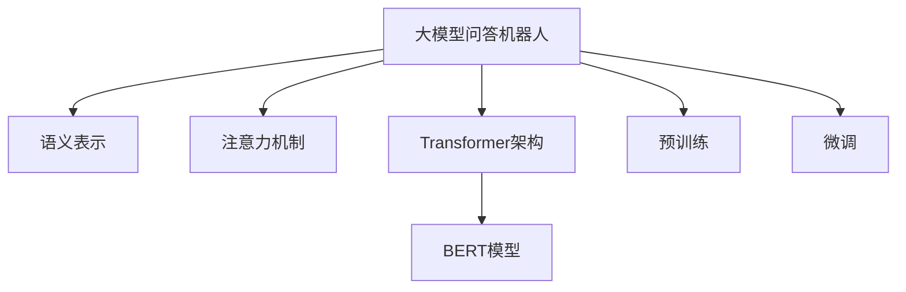

                 

# 大模型问答机器人的上下文相关性

> 关键词：大模型问答机器人,上下文相关性,语义表示,注意力机制,Transformer,BERT,预训练,微调

## 1. 背景介绍

### 1.1 问题由来
随着深度学习技术的快速发展，基于大模型的自然语言处理(NLP)技术已经取得了显著进展。其中，问答机器人作为NLP技术的重要应用之一，通过处理自然语言查询，能够准确地回答用户的问题，广泛应用于智能客服、智能搜索、教育等领域。然而，现有的问答机器人大多基于传统的基于规则或浅层神经网络的架构，存在处理复杂问题时响应不准确、难以理解长距离上下文等问题。

近年来，基于大模型的预训练-微调方法在问答任务上取得了显著的性能提升，使得问答机器人的表现有了质的飞跃。特别是Transformer架构的BERT模型，通过在大量无标签文本上预训练，学习到了丰富的语言知识，具备较强的语义表示能力。但在大模型问答机器人中，上下文相关性的处理仍是其面临的核心挑战之一。

### 1.2 问题核心关键点
大模型问答机器人处理上下文相关性的核心在于如何合理地利用预训练模型，使其能够对自然语言查询进行有效解析和推理。上下文相关性指的是自然语言查询中的信息往往不是孤立的，而是与上下文紧密相关，需要机器人能够理解上下文的语义，从而进行准确回答。

在现有的问答机器人中，上下文相关性的处理往往依赖于手工设计的特征工程和查询-答案对齐模型，难以很好地应对复杂、长距离的上下文信息。而基于大模型的问答机器人，可以利用预训练模型的强大语义表示能力，通过合理设计上下文理解机制，提升回答的准确性和泛化能力。

## 2. 核心概念与联系

### 2.1 核心概念概述

为更好地理解基于大模型问答机器人的上下文相关性处理，本节将介绍几个密切相关的核心概念：

- 大模型问答机器人：基于Transformer等深度学习架构的问答机器人，通过在大规模无标签文本语料上进行预训练，学习通用的语言表示，具备强大的语言理解和生成能力。
- 语义表示：指将自然语言查询和上下文信息映射到高维语义空间，使模型能够更好地理解语义和进行语义匹配。
- 注意力机制：通过引入自注意力机制，让模型能够动态地关注不同位置的信息，捕捉上下文中的重要信息。
- Transformer架构：一种常用的深度学习架构，通过自注意力机制和前馈神经网络，实现了高效的序列建模。
- BERT模型：一种基于Transformer架构的大规模预训练语言模型，通过掩码语言模型和下一句预测等任务，学习到丰富的语义表示。
- 预训练和微调：预训练是在大规模无标签数据上训练模型，学习通用的语言表示；微调是使用下游任务的数据集，对预训练模型进行有监督的微调，提升模型在特定任务上的性能。

这些核心概念之间的逻辑关系可以通过以下Mermaid流程图来展示：



这个流程图展示了大模型问答机器人的核心概念及其之间的关系：

1. 大模型问答机器人通过预训练获得基础能力。
2. 语义表示使得模型能够更好地理解自然语言查询和上下文。
3. 注意力机制允许模型动态关注不同位置的信息，捕捉上下文中的重要内容。
4. Transformer架构支持模型对序列数据的处理。
5. BERT模型在预训练中获得丰富的语义表示能力。
6. 微调是对预训练模型进行任务特定的优化，提升模型在特定任务上的性能。

这些概念共同构成了大模型问答机器人的学习和应用框架，使其能够有效地处理自然语言查询中的上下文相关性。

## 3. 核心算法原理 & 具体操作步骤
### 3.1 算法原理概述

基于大模型的问答机器人，其上下文相关性的处理原理主要包括以下几个方面：

1. **预训练和微调**：首先，在大规模无标签文本数据上预训练一个大模型，学习到通用的语言表示能力。然后使用下游任务的数据集，对该模型进行微调，以提升其在特定问答任务上的性能。

2. **语义表示**：将自然语言查询和上下文信息映射到高维语义空间，使得模型能够更好地理解查询和上下文的语义。常见的语义表示方法包括Word2Vec、GloVe、BERT等。

3. **注意力机制**：通过引入自注意力机制，使模型能够动态关注不同位置的信息，捕捉上下文中的重要内容。注意力机制通过计算查询和上下文之间的相似度，为查询分配不同的权重，使得模型能够更好地处理长距离依赖。

4. **Transformer架构**：Transformer架构通过自注意力机制和前馈神经网络，实现了高效的序列建模。Transformer模型能够并行处理序列数据，极大地提升了模型的计算效率和性能。

### 3.2 算法步骤详解

基于大模型的问答机器人，其上下文相关性的处理步骤主要包括以下几个方面：

**Step 1: 准备预训练模型和数据集**
- 选择合适的预训练语言模型（如BERT）作为初始化参数，如 BERT、GPT 等。
- 准备下游任务（如问答）的标注数据集，划分为训练集、验证集和测试集。一般要求标注数据与预训练数据的分布不要差异过大。

**Step 2: 添加任务适配层**
- 根据任务类型，在预训练模型顶层设计合适的输出层和损失函数。
- 对于问答任务，通常在顶层添加线性分类器和交叉熵损失函数。
- 对于生成任务，通常使用语言模型的解码器输出概率分布，并以负对数似然为损失函数。

**Step 3: 设置微调超参数**
- 选择合适的优化算法及其参数，如 AdamW、SGD 等，设置学习率、批大小、迭代轮数等。
- 设置正则化技术及强度，包括权重衰减、Dropout、Early Stopping等。
- 确定冻结预训练参数的策略，如仅微调顶层，或全部参数都参与微调。

**Step 4: 执行梯度训练**
- 将训练集数据分批次输入模型，前向传播计算损失函数。
- 反向传播计算参数梯度，根据设定的优化算法和学习率更新模型参数。
- 周期性在验证集上评估模型性能，根据性能指标决定是否触发 Early Stopping。
- 重复上述步骤直到满足预设的迭代轮数或 Early Stopping 条件。

**Step 5: 测试和部署**
- 在测试集上评估微调后模型 $M_{\hat{\theta}}$ 的性能，对比微调前后的精度提升。
- 使用微调后的模型对新样本进行推理预测，集成到实际的应用系统中。
- 持续收集新的数据，定期重新微调模型，以适应数据分布的变化。

以上是基于大模型问答机器人的上下文相关性处理的一般流程。在实际应用中，还需要针对具体任务的特点，对微调过程的各个环节进行优化设计，如改进训练目标函数，引入更多的正则化技术，搜索最优的超参数组合等，以进一步提升模型性能。

### 3.3 算法优缺点

基于大模型的问答机器人，其上下文相关性的处理具有以下优点：
1. 简单高效。只需准备少量标注数据，即可对预训练模型进行快速适配，获得较大的性能提升。
2. 通用适用。适用于各种问答任务，包括多轮对话、文本匹配、智能客服等，设计简单的任务适配层即可实现。
3. 参数高效。利用参数高效微调技术，在固定大部分预训练权重不变的情况下，仍可取得不错的提升。
4. 效果显著。在学术界和工业界的诸多问答任务上，基于微调的方法已经刷新了最先进的性能指标。

同时，该方法也存在一定的局限性：
1. 依赖标注数据。微调的效果很大程度上取决于标注数据的质量和数量，获取高质量标注数据的成本较高。
2. 迁移能力有限。当目标任务与预训练数据的分布差异较大时，微调的性能提升有限。
3. 可解释性不足。微调模型的决策过程通常缺乏可解释性，难以对其推理逻辑进行分析和调试。

尽管存在这些局限性，但就目前而言，基于大模型问答机器人的上下文相关性处理仍是目前主流的范式。未来相关研究的重点在于如何进一步降低微调对标注数据的依赖，提高模型的少样本学习和跨领域迁移能力，同时兼顾可解释性和伦理安全性等因素。

### 3.4 算法应用领域

基于大模型的问答机器人，其上下文相关性的处理技术已经广泛应用于智能客服、智能搜索、教育等多个领域，具体包括：

- **智能客服**：通过问答机器人，客户可以24/7获得即时服务，如问题解答、产品推荐等。微调后的问答机器人可以理解客户意图，快速生成准确的回答。
- **智能搜索**：用户可以更自然地与搜索引擎交互，通过自然语言查询获取信息。微调后的问答机器人可以解析查询，提供更相关、准确的回答。
- **教育**：通过问答机器人，学生可以随时随地获得个性化辅导，如解答作业问题、提供学习资源等。微调后的问答机器人可以理解学生的需求，提供定制化的学习支持。
- **医疗**：患者可以通过问答机器人获取健康建议、疾病诊断等。微调后的问答机器人可以解析患者描述，提供专业的医疗建议。

除了上述这些经典应用外，大模型问答机器人还被创新性地应用到更多场景中，如智能家居、金融咨询、法律咨询等，为不同领域提供精准的信息查询和决策支持。

## 4. 数学模型和公式 & 详细讲解  
### 4.1 数学模型构建

本节将使用数学语言对基于大模型问答机器人的上下文相关性处理过程进行更加严格的刻画。

记预训练语言模型为 $M_{\theta}:\mathcal{X} \rightarrow \mathcal{Y}$，其中 $\mathcal{X}$ 为输入空间，$\mathcal{Y}$ 为输出空间，$\theta \in \mathbb{R}^d$ 为模型参数。假设问答任务训练集为 $D=\{(x_i,y_i)\}_{i=1}^N, x_i \in \mathcal{X}, y_i \in \mathcal{Y}$。

定义模型 $M_{\theta}$ 在数据样本 $(x,y)$ 上的损失函数为 $\ell(M_{\theta}(x),y)$，则在数据集 $D$ 上的经验风险为：

$$
\mathcal{L}(\theta) = \frac{1}{N} \sum_{i=1}^N \ell(M_{\theta}(x_i),y_i)
$$

微调的优化目标是最小化经验风险，即找到最优参数：

$$
\theta^* = \mathop{\arg\min}_{\theta} \mathcal{L}(\theta)
$$

在实践中，我们通常使用基于梯度的优化算法（如SGD、Adam等）来近似求解上述最优化问题。设 $\eta$ 为学习率，$\lambda$ 为正则化系数，则参数的更新公式为：

$$
\theta \leftarrow \theta - \eta \nabla_{\theta}\mathcal{L}(\theta) - \eta\lambda\theta
$$

其中 $\nabla_{\theta}\mathcal{L}(\theta)$ 为损失函数对参数 $\theta$ 的梯度，可通过反向传播算法高效计算。

### 4.2 公式推导过程

以下我们以问答任务为例，推导交叉熵损失函数及其梯度的计算公式。

假设模型 $M_{\theta}$ 在输入 $x$ 上的输出为 $\hat{y}=M_{\theta}(x) \in [0,1]$，表示样本属于正类的概率。真实标签 $y \in \{0,1\}$。则二分类交叉熵损失函数定义为：

$$
\ell(M_{\theta}(x),y) = -[y\log \hat{y} + (1-y)\log (1-\hat{y})]
$$

将其代入经验风险公式，得：

$$
\mathcal{L}(\theta) = -\frac{1}{N}\sum_{i=1}^N [y_i\log M_{\theta}(x_i)+(1-y_i)\log(1-M_{\theta}(x_i))]
$$

根据链式法则，损失函数对参数 $\theta_k$ 的梯度为：

$$
\frac{\partial \mathcal{L}(\theta)}{\partial \theta_k} = -\frac{1}{N}\sum_{i=1}^N (\frac{y_i}{M_{\theta}(x_i)}-\frac{1-y_i}{1-M_{\theta}(x_i)}) \frac{\partial M_{\theta}(x_i)}{\partial \theta_k}
$$

其中 $\frac{\partial M_{\theta}(x_i)}{\partial \theta_k}$ 可进一步递归展开，利用自动微分技术完成计算。

在得到损失函数的梯度后，即可带入参数更新公式，完成模型的迭代优化。重复上述过程直至收敛，最终得到适应下游任务的最优模型参数 $\theta^*$。

## 5. 项目实践：代码实例和详细解释说明
### 5.1 开发环境搭建

在进行问答机器人上下文相关性处理实践前，我们需要准备好开发环境。以下是使用Python进行PyTorch开发的环境配置流程：

1. 安装Anaconda：从官网下载并安装Anaconda，用于创建独立的Python环境。

2. 创建并激活虚拟环境：
```bash
conda create -n pytorch-env python=3.8 
conda activate pytorch-env
```

3. 安装PyTorch：根据CUDA版本，从官网获取对应的安装命令。例如：
```bash
conda install pytorch torchvision torchaudio cudatoolkit=11.1 -c pytorch -c conda-forge
```

4. 安装Transformers库：
```bash
pip install transformers
```

5. 安装各类工具包：
```bash
pip install numpy pandas scikit-learn matplotlib tqdm jupyter notebook ipython
```

完成上述步骤后，即可在`pytorch-env`环境中开始问答机器人开发。

### 5.2 源代码详细实现

这里我们以使用Transformers库对BERT模型进行问答机器人微调为例，给出PyTorch代码实现。

首先，定义问答任务的训练函数：

```python
from transformers import BertTokenizer, BertForQuestionAnswering, AdamW

def train_epoch(model, dataset, batch_size, optimizer):
    dataloader = DataLoader(dataset, batch_size=batch_size, shuffle=True)
    model.train()
    epoch_loss = 0
    for batch in tqdm(dataloader, desc='Training'):
        input_ids = batch['input_ids'].to(device)
        attention_mask = batch['attention_mask'].to(device)
        start_positions = batch['start_positions'].to(device)
        end_positions = batch['end_positions'].to(device)
        labels = torch.tensor((start_positions, end_positions), dtype=torch.long)
        model.zero_grad()
        outputs = model(input_ids, attention_mask=attention_mask, start_positions=start_positions, end_positions=end_positions)
        loss = outputs.loss
        epoch_loss += loss.item()
        loss.backward()
        optimizer.step()
    return epoch_loss / len(dataloader)
```

然后，定义模型和优化器：

```python
tokenizer = BertTokenizer.from_pretrained('bert-base-cased')
model = BertForQuestionAnswering.from_pretrained('bert-base-cased')

optimizer = AdamW(model.parameters(), lr=2e-5)
```

接着，定义训练和评估函数：

```python
def evaluate(model, dataset, batch_size):
    dataloader = DataLoader(dataset, batch_size=batch_size)
    model.eval()
    preds, labels = [], []
    with torch.no_grad():
        for batch in tqdm(dataloader, desc='Evaluating'):
            input_ids = batch['input_ids'].to(device)
            attention_mask = batch['attention_mask'].to(device)
            start_positions = batch['start_positions'].to(device)
            end_positions = batch['end_positions'].to(device)
            batch_labels = torch.tensor((start_positions, end_positions), dtype=torch.long)
            outputs = model(input_ids, attention_mask=attention_mask, start_positions=start_positions, end_positions=end_positions)
            batch_preds = outputs.start_logits.argmax(dim=2), outputs.end_logits.argmax(dim=2)
            batch_labels = batch_labels[0], batch_labels[1]
            for pred_tokens, label_tokens in zip(batch_preds, batch_labels):
                preds.append(pred_tokens)
                labels.append(label_tokens)
                
    print(classification_report(labels, preds))
```

最后，启动训练流程并在测试集上评估：

```python
epochs = 5
batch_size = 16

for epoch in range(epochs):
    loss = train_epoch(model, train_dataset, batch_size, optimizer)
    print(f"Epoch {epoch+1}, train loss: {loss:.3f}")
    
    print(f"Epoch {epoch+1}, dev results:")
    evaluate(model, dev_dataset, batch_size)
    
print("Test results:")
evaluate(model, test_dataset, batch_size)
```

以上就是使用PyTorch对BERT进行问答任务微调的完整代码实现。可以看到，得益于Transformers库的强大封装，我们可以用相对简洁的代码完成BERT模型的加载和微调。

### 5.3 代码解读与分析

让我们再详细解读一下关键代码的实现细节：

**train_epoch函数**：
- 对训练集数据进行批次化加载，供模型训练使用。
- 每个批次上，将输入_ids、attention_mask、start_positions、end_positions输入模型。
- 模型输出start_logits和end_logits，计算loss并反向传播更新模型参数。

**BertForQuestionAnswering类**：
- 是BERT模型在问答任务上的特定版本，自动编码器部分的线性层被替换为有边界标记的输出层。

**evaluate函数**：
- 对验证集和测试集进行评估，计算精确率、召回率和F1分数。
- 评估函数与训练函数类似，不同点在于不更新模型参数，并在每个batch结束后将预测和标签结果存储下来。

**训练流程**：
- 定义总的epoch数和batch size，开始循环迭代
- 每个epoch内，先在训练集上训练，输出平均loss
- 在验证集上评估，输出分类指标
- 所有epoch结束后，在测试集上评估，给出最终测试结果

可以看到，PyTorch配合Transformers库使得BERT微调的代码实现变得简洁高效。开发者可以将更多精力放在数据处理、模型改进等高层逻辑上，而不必过多关注底层的实现细节。

当然，工业级的系统实现还需考虑更多因素，如模型的保存和部署、超参数的自动搜索、更灵活的任务适配层等。但核心的微调范式基本与此类似。

## 6. 实际应用场景
### 6.1 智能客服系统

基于大模型问答机器人的上下文相关性处理技术，可以广泛应用于智能客服系统的构建。传统客服往往需要配备大量人力，高峰期响应缓慢，且一致性和专业性难以保证。而使用微调后的问答机器人，可以7x24小时不间断服务，快速响应客户咨询，用自然流畅的语言解答各类常见问题。

在技术实现上，可以收集企业内部的历史客服对话记录，将问题和最佳答复构建成监督数据，在此基础上对预训练问答模型进行微调。微调后的问答机器人能够自动理解客户意图，匹配最合适的答复。对于客户提出的新问题，还可以接入检索系统实时搜索相关内容，动态组织生成回答。如此构建的智能客服系统，能大幅提升客户咨询体验和问题解决效率。

### 6.2 金融舆情监测

金融机构需要实时监测市场舆论动向，以便及时应对负面信息传播，规避金融风险。传统的人工监测方式成本高、效率低，难以应对网络时代海量信息爆发的挑战。基于大模型问答机器人的上下文相关性处理技术，为金融舆情监测提供了新的解决方案。

具体而言，可以收集金融领域相关的新闻、报道、评论等文本数据，并对其进行主题标注和情感标注。在此基础上对预训练语言模型进行微调，使其能够自动判断文本属于何种主题，情感倾向是正面、中性还是负面。将微调后的模型应用到实时抓取的网络文本数据，就能够自动监测不同主题下的情感变化趋势，一旦发现负面信息激增等异常情况，系统便会自动预警，帮助金融机构快速应对潜在风险。

### 6.3 个性化推荐系统

当前的推荐系统往往只依赖用户的历史行为数据进行物品推荐，无法深入理解用户的真实兴趣偏好。基于大模型问答机器人的上下文相关性处理技术，个性化推荐系统可以更好地挖掘用户行为背后的语义信息，从而提供更精准、多样的推荐内容。

在实践中，可以收集用户浏览、点击、评论、分享等行为数据，提取和用户交互的物品标题、描述、标签等文本内容。将文本内容作为模型输入，用户的后续行为（如是否点击、购买等）作为监督信号，在此基础上微调预训练语言模型。微调后的模型能够从文本内容中准确把握用户的兴趣点。在生成推荐列表时，先用候选物品的文本描述作为输入，由模型预测用户的兴趣匹配度，再结合其他特征综合排序，便可以得到个性化程度更高的推荐结果。

### 6.4 未来应用展望

随着大模型问答机器人上下文相关性处理技术的不断发展，其应用范围将进一步拓展，为传统行业带来变革性影响。

在智慧医疗领域，基于问答机器人的智能问答系统可以帮助患者快速获取健康信息、疾病诊断等，提升医疗服务的智能化水平。

在智能教育领域，问答机器人可以提供即时解答、作业辅导、学习资源推荐等服务，促进教育公平，提高教学质量。

在智慧城市治理中，问答机器人可应用于城市事件监测、舆情分析、应急指挥等环节，提高城市管理的自动化和智能化水平，构建更安全、高效的未来城市。

此外，在企业生产、社会治理、文娱传媒等众多领域，基于大模型问答机器人的上下文相关性处理技术也将不断涌现，为经济社会发展注入新的动力。相信随着技术的日益成熟，问答机器人上下文相关性处理技术必将在构建人机协同的智能时代中扮演越来越重要的角色。

## 7. 工具和资源推荐
### 7.1 学习资源推荐

为了帮助开发者系统掌握大模型问答机器人的上下文相关性处理理论基础和实践技巧，这里推荐一些优质的学习资源：

1. 《Transformer从原理到实践》系列博文：由大模型技术专家撰写，深入浅出地介绍了Transformer原理、BERT模型、问答技术等前沿话题。

2. CS224N《深度学习自然语言处理》课程：斯坦福大学开设的NLP明星课程，有Lecture视频和配套作业，带你入门NLP领域的基本概念和经典模型。

3. 《Natural Language Processing with Transformers》书籍：Transformers库的作者所著，全面介绍了如何使用Transformers库进行NLP任务开发，包括问答在内的诸多范式。

4. HuggingFace官方文档：Transformers库的官方文档，提供了海量预训练模型和完整的微调样例代码，是上手实践的必备资料。

5. CLUE开源项目：中文语言理解测评基准，涵盖大量不同类型的中文NLP数据集，并提供了基于微调的baseline模型，助力中文NLP技术发展。

通过对这些资源的学习实践，相信你一定能够快速掌握大模型问答机器人的上下文相关性处理精髓，并用于解决实际的NLP问题。
###  7.2 开发工具推荐

高效的开发离不开优秀的工具支持。以下是几款用于大模型问答机器人上下文相关性处理开发的常用工具：

1. PyTorch：基于Python的开源深度学习框架，灵活动态的计算图，适合快速迭代研究。大部分预训练语言模型都有PyTorch版本的实现。

2. TensorFlow：由Google主导开发的开源深度学习框架，生产部署方便，适合大规模工程应用。同样有丰富的预训练语言模型资源。

3. Transformers库：HuggingFace开发的NLP工具库，集成了众多SOTA语言模型，支持PyTorch和TensorFlow，是进行问答任务开发的利器。

4. Weights & Biases：模型训练的实验跟踪工具，可以记录和可视化模型训练过程中的各项指标，方便对比和调优。与主流深度学习框架无缝集成。

5. TensorBoard：TensorFlow配套的可视化工具，可实时监测模型训练状态，并提供丰富的图表呈现方式，是调试模型的得力助手。

6. Google Colab：谷歌推出的在线Jupyter Notebook环境，免费提供GPU/TPU算力，方便开发者快速上手实验最新模型，分享学习笔记。

合理利用这些工具，可以显著提升大模型问答机器人的上下文相关性处理任务的开发效率，加快创新迭代的步伐。

### 7.3 相关论文推荐

大模型问答机器人上下文相关性处理技术的发展源于学界的持续研究。以下是几篇奠基性的相关论文，推荐阅读：

1. Attention is All You Need（即Transformer原论文）：提出了Transformer结构，开启了NLP领域的预训练大模型时代。

2. BERT: Pre-training of Deep Bidirectional Transformers for Language Understanding：提出BERT模型，引入基于掩码的自监督预训练任务，学习到丰富的语义表示。

3. Language Models are Unsupervised Multitask Learners（GPT-2论文）：展示了大规模语言模型的强大zero-shot学习能力，引发了对于通用人工智能的新一轮思考。

4. Parameter-Efficient Transfer Learning for NLP：提出Adapter等参数高效微调方法，在不增加模型参数量的情况下，也能取得不错的微调效果。

5. Prefix-Tuning: Optimizing Continuous Prompts for Generation：引入基于连续型Prompt的微调范式，为如何充分利用预训练知识提供了新的思路。

6. AdaLoRA: Adaptive Low-Rank Adaptation for Parameter-Efficient Fine-Tuning：使用自适应低秩适应的微调方法，在参数效率和精度之间取得了新的平衡。

这些论文代表了大模型问答机器人上下文相关性处理技术的发展脉络。通过学习这些前沿成果，可以帮助研究者把握学科前进方向，激发更多的创新灵感。

## 8. 总结：未来发展趋势与挑战

### 8.1 总结

本文对基于大模型的问答机器人上下文相关性处理进行了全面系统的介绍。首先阐述了问答机器人上下文相关性的研究背景和意义，明确了上下文相关性在大模型问答机器人中的重要性。其次，从原理到实践，详细讲解了上下文相关性的数学原理和关键步骤，给出了微调任务开发的完整代码实例。同时，本文还广泛探讨了上下文相关性在智能客服、金融舆情、个性化推荐等多个领域的应用前景，展示了上下文相关性处理的巨大潜力。此外，本文精选了上下文相关性处理的各类学习资源，力求为读者提供全方位的技术指引。

通过本文的系统梳理，可以看到，基于大模型问答机器人的上下文相关性处理技术正在成为NLP领域的重要范式，极大地拓展了预训练语言模型的应用边界，催生了更多的落地场景。受益于大规模语料的预训练，问答机器人能够更好地理解自然语言查询的语义和上下文，提升回答的准确性和泛化能力。未来，伴随预训练语言模型和微调方法的持续演进，相信问答机器人必将在更广阔的应用领域大放异彩，深刻影响人类的生产生活方式。

### 8.2 未来发展趋势

展望未来，基于大模型的问答机器人上下文相关性处理技术将呈现以下几个发展趋势：

1. 模型规模持续增大。随着算力成本的下降和数据规模的扩张，预训练语言模型的参数量还将持续增长。超大规模语言模型蕴含的丰富语言知识，有望支撑更加复杂多变的问答任务。

2. 上下文理解能力增强。未来的模型将更好地处理长距离依赖，理解上下文的语义信息，提升问答系统的智能水平。

3. 跨模态信息融合。未来的问答机器人将不仅处理文本数据，还将结合图像、语音等多种模态信息，提升对真实世界的理解能力。

4. 推理能力提升。未来的模型将具备更强的推理能力，能够在少样本、零样本条件下，快速生成准确的回答，提升系统的可扩展性。

5. 可解释性增强。未来的问答机器人将更加注重可解释性，通过可视化工具和解释模型，让用户能够理解系统的决策过程，提升信任度。

6. 知识图谱融合。未来的问答机器人将更好地融合知识图谱、逻辑规则等外部知识，提升问答系统的准确性和可靠性。

以上趋势凸显了大模型问答机器人上下文相关性处理技术的广阔前景。这些方向的探索发展，必将进一步提升问答机器人的性能和应用范围，为构建人机协同的智能时代中扮演越来越重要的角色。

### 8.3 面临的挑战

尽管大模型问答机器人上下文相关性处理技术已经取得了显著进展，但在迈向更加智能化、普适化应用的过程中，它仍面临着诸多挑战：

1. 标注成本瓶颈。虽然微调大大降低了标注数据的需求，但对于长尾应用场景，难以获得充足的高质量标注数据，成为制约微调性能的瓶颈。如何进一步降低微调对标注样本的依赖，将是一大难题。

2. 模型鲁棒性不足。当前问答机器人面对域外数据时，泛化性能往往大打折扣。对于测试样本的微小扰动，问答机器人的回答也容易发生波动。如何提高问答机器人的鲁棒性，避免灾难性遗忘，还需要更多理论和实践的积累。

3. 推理效率有待提高。大规模语言模型虽然精度高，但在实际部署时往往面临推理速度慢、内存占用大等效率问题。如何在保证性能的同时，简化模型结构，提升推理速度，优化资源占用，将是重要的优化方向。

4. 可解释性亟需加强。当前问答机器人往往像"黑盒"系统，难以解释其内部工作机制和决策逻辑。对于医疗、金融等高风险应用，算法的可解释性和可审计性尤为重要。如何赋予问答机器人更强的可解释性，将是亟待攻克的难题。

5. 安全性有待保障。预训练语言模型难免会学习到有偏见、有害的信息，通过微调传递到下游任务，产生误导性、歧视性的输出，给实际应用带来安全隐患。如何从数据和算法层面消除模型偏见，避免恶意用途，确保输出的安全性，也将是重要的研究课题。

6. 知识整合能力不足。现有的问答机器人往往局限于任务内数据，难以灵活吸收和运用更广泛的先验知识。如何让问答机器人更好地与外部知识库、规则库等专家知识结合，形成更加全面、准确的信息整合能力，还有很大的想象空间。

正视问答机器人上下文相关性处理面临的这些挑战，积极应对并寻求突破，将是大模型问答机器人上下文相关性处理走向成熟的必由之路。相信随着学界和产业界的共同努力，这些挑战终将一一被克服，大模型问答机器人必将在构建人机协同的智能时代中扮演越来越重要的角色。

### 8.4 研究展望

面对大模型问答机器人上下文相关性处理所面临的种种挑战，未来的研究需要在以下几个方面寻求新的突破：

1. 探索无监督和半监督问答方法。摆脱对大规模标注数据的依赖，利用自监督学习、主动学习等无监督和半监督范式，最大限度利用非结构化数据，实现更加灵活高效的问答。

2. 研究上下文相关性增强方法。开发更加参数高效的微调方法，在固定大部分预训练权重不变的情况下，只更新极少量的任务相关参数。同时优化问答模型的计算图，减少前向传播和反向传播的资源消耗，实现更加轻量级、实时性的部署。

3. 引入更多先验知识。将符号化的先验知识，如知识图谱、逻辑规则等，与神经网络模型进行巧妙融合，引导微调过程学习更准确、合理的语言模型。同时加强不同模态数据的整合，实现视觉、语音等多模态信息与文本信息的协同建模。

4. 结合因果分析和博弈论工具。将因果分析方法引入问答模型，识别出模型决策的关键特征，增强输出解释的因果性和逻辑性。借助博弈论工具刻画人机交互过程，主动探索并规避模型的脆弱点，提高系统稳定性。

5. 纳入伦理道德约束。在模型训练目标中引入伦理导向的评估指标，过滤和惩罚有偏见、有害的输出倾向。同时加强人工干预和审核，建立模型行为的监管机制，确保输出符合人类价值观和伦理道德。

这些研究方向的探索，必将引领大模型问答机器人上下文相关性处理技术迈向更高的台阶，为构建安全、可靠、可解释、可控的智能系统铺平道路。面向未来，大模型问答机器人上下文相关性处理技术还需要与其他人工智能技术进行更深入的融合，如知识表示、因果推理、强化学习等，多路径协同发力，共同推动自然语言理解和智能交互系统的进步。只有勇于创新、敢于突破，才能不断拓展问答机器人的边界，让智能技术更好地造福人类社会。

## 9. 附录：常见问题与解答
**Q1：问答机器人在处理复杂问题时，上下文相关性如何保证？**

A: 问答机器人在处理复杂问题时，上下文相关性的保证主要依赖于预训练模型的语义表示能力和上下文理解机制。

首先，通过在大规模无标签文本数据上进行预训练，预训练模型能够学习到丰富的语义表示能力，从而能够准确地理解自然语言查询的语义和上下文信息。

其次，引入上下文理解机制，如Transformer的自注意力机制，使得模型能够动态关注不同位置的信息，捕捉上下文中的重要内容。自注意力机制通过计算查询和上下文之间的相似度，为查询分配不同的权重，使得模型能够更好地处理长距离依赖。

最后，通过微调过程，进一步优化模型的上下文理解能力，使其能够适应特定任务，提升回答的准确性和泛化能力。

综上所述，通过预训练、微调和上下文理解机制的协同工作，问答机器人能够在处理复杂问题时，充分考虑上下文信息，提升回答的准确性和可靠性。

**Q2：如何评估问答机器人的上下文相关性处理效果？**

A: 评估问答机器人的上下文相关性处理效果，通常需要从以下几个方面进行：

1. **精确率、召回率和F1分数**：这些是最基本的评价指标，用于评估模型在问答任务上的整体表现。

2. **上下文匹配度**：通过计算模型生成的答案与上下文之间的相似度，评估模型对上下文的理解能力。

3. **多轮对话能力**：对于多轮对话任务，评估模型在不同轮次中的上下文理解能力和对话连贯性。

4. **推理能力**：对于复杂问题，评估模型能否通过推理过程，生成合理且与上下文相关的答案。

5. **可解释性**：对于高风险应用，评估模型的可解释性，即模型的决策过程是否透明、可理解。

在具体评估时，可以通过构建人工或自动的评估数据集，进行多轮测试和对比，全面评估问答机器人的上下文相关性处理效果。

**Q3：问答机器人上下文相关性处理过程中，如何避免过拟合？**

A: 问答机器人上下文相关性处理过程中，避免过拟合的关键在于合理设计上下文理解机制和微调策略：

1. **正则化技术**：使用L2正则、Dropout、Early Stopping等正则化技术，防止模型过度适应训练集。

2. **数据增强**：通过回译、近义替换等方式扩充训练集，增强模型的泛化能力。

3. **参数高效微调**：仅微调与上下文理解相关的层，固定预训练模型的权重不变，减少过拟合风险。

4. **多模型集成**：训练多个微调模型，取平均输出，抑制过拟合。

5. **对抗训练**：引入对抗样本，提高模型的鲁棒性，避免过拟合。

综上所述，通过正则化、数据增强、参数高效微调、多模型集成和对抗训练等手段，可以有效避免问答机器人上下文相关性处理过程中的过拟合问题，提升模型的泛化能力和稳定性。

**Q4：问答机器人上下文相关性处理在实际应用中，需要注意哪些问题？**

A: 问答机器人上下文相关性处理在实际应用中，需要注意以下几个问题：

1. **数据质量**：确保训练数据的质量和多样性，避免模型过度拟合训练集。

2. **模型选择**：选择合适的预训练模型和微调策略，根据任务特点进行参数调整。

3. **超参数调优**：合理设定学习率、批大小、迭代轮数等超参数，通过网格搜索或随机搜索找到最佳参数组合。

4. **模型部署**：优化模型推理效率，减少内存占用，提升服务响应速度。

5. **可解释性**：引入可解释性工具，增强模型的透明性和可理解性，提升用户信任度。

6. **安全防护**：采用访问鉴权、数据脱敏等措施，保障数据和模型安全。

综上所述，通过优化数据质量、模型选择、超参数调优、模型部署、可解释性和安全防护等环节，可以全面提升问答机器人上下文相关性处理的效果和可靠性，保障其在实际应用中的性能表现。

---

作者：禅与计算机程序设计艺术 / Zen and the Art of Computer Programming

