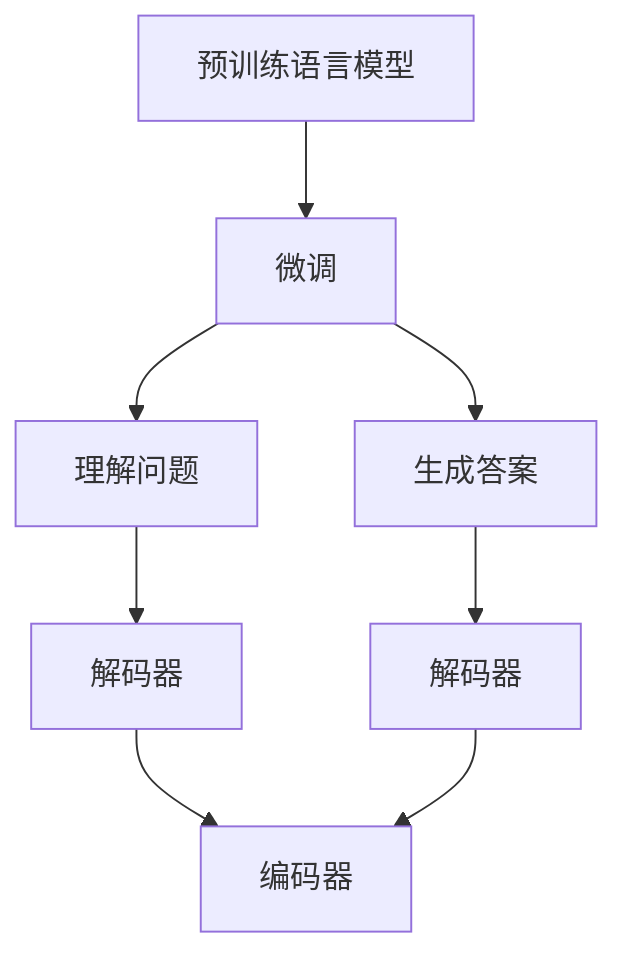

                 

# 大模型问答机器人的自然语言处理

## 1. 背景介绍

### 1.1 问题由来

在人工智能与自然语言处理（NLP）领域，问答机器人（QA Chatbots）因其高效率、高精度、高互动性，成为自然语言理解与生成（NLUG）研究的重要应用方向。近年来，随着预训练语言模型（如BERT、GPT等）的兴起，大模型在问答任务上取得了显著进展。大模型在丰富的语料数据上进行预训练，学习到大量的语言知识，能够处理复杂的语言现象，极大提升了问答系统的准确性和流畅度。

问答机器人通常分为三类：一是基于规则的问答系统（Rule-based QA），需要手动编写大量的规则和模板；二是基于检索的问答系统（Retrieval-based QA），通过从预定义的数据库中检索相关答案来回答用户问题；三是基于生成的问答系统（Generation-based QA），通过构建一个生成模型，直接生成针对用户问题的回答。

预训练语言模型在问答生成任务上表现优异，成为现代问答机器人最主要的技术支撑。通过对大规模无标签数据进行自监督预训练，预训练语言模型学习到了通用的语言表示，能够有效处理各种自然语言问题，并将其转化为结构化数据。基于预训练模型，可以通过微调（Fine-tuning）的方式，将模型针对特定任务或场景进行优化，提升问答系统的性能。

### 1.2 问题核心关键点

基于预训练语言模型的问答系统通常分为两个阶段：

1. **理解问题**：通过预训练语言模型，理解用户输入的自然语言问题。
2. **生成答案**：利用模型生成的语言表示，生成针对该问题的答案。

核心问题包括：

- 如何高效理解用户问题？
- 如何生成结构化、逻辑严密的回答？
- 如何评估模型的理解能力和生成能力？

预训练语言模型提供了丰富的语言表示，但直接应用到问答任务中，仍然面临诸多挑战。本文将对大模型问答机器人的自然语言处理进行详细探讨，并介绍相关的核心概念、算法原理和具体操作步骤。

## 2. 核心概念与联系

### 2.1 核心概念概述

为更好地理解大模型问答机器人的工作原理，本节将介绍几个关键概念：

- **预训练语言模型(Pretrained Language Model, PLM)**：以自回归模型（如GPT）或自编码模型（如BERT）为代表的大规模预训练模型。通过在大规模无标签文本数据上进行预训练，学习通用的语言表示。

- **微调(Fine-tuning)**：指在预训练模型的基础上，使用下游任务的少量标注数据，通过有监督学习优化模型在特定任务上的性能。通常只需要调整顶层分类器或解码器，并以较小的学习率更新全部或部分的模型参数。

- **深度学习（Deep Learning）**：一种利用多层神经网络进行学习的方法，通过迭代优化参数，使得模型在训练集上表现得最好。

- **自然语言处理（Natural Language Processing, NLP）**：计算机科学、人工智能领域的一个分支，专注于使计算机能够理解和生成自然语言。

- **自然语言理解（Natural Language Understanding, NLU）**：使计算机能够理解自然语言输入的含义和结构。

- **自然语言生成（Natural Language Generation, NLG）**：使计算机能够生成语法正确、语义通顺的自然语言输出。

- **解码器（Decoder）**：生成模型中用于生成文本的神经网络组件。

- **编码器（Encoder）**：预训练模型中用于理解输入文本的神经网络组件。

- **训练集（Training Dataset）**：用于训练模型的标注数据集。

- **验证集（Validation Dataset）**：在模型训练过程中用于评估模型性能的数据集，用于调整模型参数和选择最优模型。

- **测试集（Testing Dataset）**：在模型训练完成后用于评估模型泛化能力的数据集。

这些核心概念之间的逻辑关系可以通过以下Mermaid流程图来展示：



这个流程图展示了大模型问答机器人的核心概念及其之间的关系：

1. 预训练语言模型通过大规模无标签数据进行预训练，学习通用的语言表示。
2. 微调通过少量标注数据，对预训练模型进行优化，使其适应特定任务。
3. 理解问题阶段，通过解码器将自然语言问题转化为模型可理解的表示。
4. 生成答案阶段，通过解码器将模型表示生成结构化的自然语言输出。
5. 编码器负责理解输入文本，解码器负责生成输出文本。

## 3. 核心算法原理 & 具体操作步骤

### 3.1 算法原理概述

大模型问答机器人的核心算法主要分为两个部分：自然语言理解和自然语言生成。下面将分别介绍这两部分的基本原理。

### 3.2 算法步骤详解

#### 3.2.1 自然语言理解

自然语言理解的目标是将用户输入的自然语言问题转化为模型能够理解的形式，通常包括以下步骤：

1. **分词和预处理**：将用户输入的文本进行分词、标点符号处理、去除停用词等操作。
2. **编码器编码**：使用预训练模型中的编码器，将预处理后的文本转换为向量表示。
3. **问题表示**：通过解码器将自然语言问题转换为向量表示，与输入文本的向量表示拼接。

#### 3.2.2 自然语言生成

自然语言生成的目标是根据模型的输入向量，生成针对用户问题的自然语言回答，通常包括以下步骤：

1. **问题向量与输入向量拼接**：将问题向量与输入文本向量拼接，生成一个向量表示整个问题的语义。
2. **解码器生成**：使用解码器根据拼接后的向量，生成自然语言回答。
3. **后处理**：对生成的文本进行后处理，如去空格、标点符号处理、语法修正等。

### 3.3 算法优缺点

#### 3.3.1 优点

1. **高准确性**：预训练语言模型拥有丰富的语言知识，能够处理复杂的自然语言问题。
2. **可扩展性强**：基于预训练模型的微调方法可以很容易地适应各种不同的问答任务，如知识图谱问答、对话系统等。
3. **可维护性高**：预训练模型和微调方法具有高度的通用性，模型维护和更新相对容易。
4. **高实时性**：预训练模型和微调方法在实际应用中具有很好的实时响应能力，适用于对实时性要求较高的场景。

#### 3.3.2 缺点

1. **数据需求大**：微调需要大量标注数据，数据获取成本较高，且数据质量和标注质量直接影响模型效果。
2. **资源消耗大**：大模型在推理和训练过程中需要大量的计算资源和存储空间，对硬件设施要求较高。
3. **泛化能力不足**：模型对特定领域或特定问题的泛化能力可能有限，需要更多的迁移学习能力。
4. **可解释性不足**：预训练模型和微调方法常常是黑箱模型，难以解释其内部工作机制。

### 3.4 算法应用领域

大模型问答机器人广泛应用于多个领域，包括但不限于：

- **客服机器人**：基于预训练模型和微调方法，可以构建智能客服系统，自动解答用户常见问题，提升客户满意度。
- **教育辅助**：通过自然语言理解与生成技术，构建智能教育平台，辅助学生学习，提供个性化教育方案。
- **智能问答**：利用大模型在问答任务上的优势，构建知识图谱问答系统，帮助用户快速获取知识。
- **医疗咨询**：开发智能医疗咨询系统，利用自然语言理解与生成技术，帮助医生和患者交流。
- **金融咨询**：通过预训练模型和微调方法，构建金融问答系统，辅助投资者决策。

## 4. 数学模型和公式 & 详细讲解 & 举例说明

### 4.1 数学模型构建

假设有预训练模型 $M$，其编码器为 $E(x)$，解码器为 $D(y|x)$，其中 $x$ 为输入文本，$y$ 为问题向量。设 $P(y|x)$ 为问题 $x$ 对应的答案 $y$ 的概率分布。

问题理解的目标是将问题向量 $y$ 映射到问题 $x$ 的概率分布 $P(y|x)$，可以定义如下的损失函数：

$$
\mathcal{L} = \frac{1}{N} \sum_{i=1}^{N} -\log P(y_i|x_i)
$$

其中，$N$ 为训练集大小，$(x_i, y_i)$ 为训练集中的每一对输入和标签。

问题生成的目标是根据问题向量 $y$ 和输入文本向量 $x$，生成答案 $y$，可以定义如下的损失函数：

$$
\mathcal{L} = \frac{1}{N} \sum_{i=1}^{N} -\log P(y|x_i)
$$

其中，$(x_i, y_i)$ 为训练集中的每一对输入和标签。

### 4.2 公式推导过程

#### 4.2.1 自然语言理解

对于问题 $x$，通过编码器 $E(x)$ 得到表示 $E(x)$，通过解码器 $D(y|x)$ 得到问题向量 $y$。问题 $x$ 的概率分布 $P(y|x)$ 可以表示为：

$$
P(y|x) = \frac{\exp (D(y|E(x)))}{\sum_{y'} \exp (D(y'|E(x)))
$$

其中，$y'$ 为所有可能的答案。

对于训练集 $(x_i, y_i)$，定义损失函数：

$$
\mathcal{L} = \frac{1}{N} \sum_{i=1}^{N} -\log P(y_i|E(x_i))
$$

通过反向传播算法，更新模型参数，最小化损失函数。

#### 4.2.2 自然语言生成

对于输入文本 $x$ 和问题 $y$，通过编码器 $E(x)$ 得到表示 $E(x)$，通过解码器 $D(y|x)$ 得到问题向量 $y$。问题 $x$ 的概率分布 $P(y|x)$ 可以表示为：

$$
P(y|x) = \frac{\exp (D(y|E(x)))}{\sum_{y'} \exp (D(y'|E(x)))
$$

其中，$y'$ 为所有可能的答案。

对于训练集 $(x_i, y_i)$，定义损失函数：

$$
\mathcal{L} = \frac{1}{N} \sum_{i=1}^{N} -\log P(y_i|E(x_i))
$$

通过反向传播算法，更新模型参数，最小化损失函数。

### 4.3 案例分析与讲解

以BERT为例，介绍大模型问答机器人的具体实现。

BERT的预训练模型包括编码器和解码器两部分。编码器通过多层Transformer结构，将输入文本转换为向量表示。解码器通过多层Transformer结构，将问题向量转换为概率分布。

在微调过程中，可以使用常见的损失函数，如交叉熵损失、均方误差损失等。

**具体实现步骤**：

1. **准备数据集**：收集问答数据集，包括问题和答案。
2. **数据预处理**：对文本进行分词、去停用词、统一大小写等处理。
3. **编码器编码**：使用预训练的BERT编码器，将问题向量 $y$ 和输入文本向量 $x$ 编码。
4. **解码器生成**：使用解码器根据问题向量 $y$ 和输入文本向量 $x$ 生成答案 $y$。
5. **损失计算**：计算预测答案与真实答案之间的交叉熵损失。
6. **反向传播**：通过反向传播算法，更新模型参数。
7. **模型评估**：在验证集和测试集上评估模型性能。

## 5. 项目实践：代码实例和详细解释说明

### 5.1 开发环境搭建

在进行大模型问答机器人的开发前，需要准备好开发环境。以下是使用Python进行TensorFlow和Keras开发的环境配置流程：

1. 安装Anaconda：从官网下载并安装Anaconda，用于创建独立的Python环境。

2. 创建并激活虚拟环境：
```bash
conda create -n qa-env python=3.8 
conda activate qa-env
```

3. 安装TensorFlow和Keras：
```bash
conda install tensorflow keras tensorflow-gpu -c conda-forge
```

4. 安装各类工具包：
```bash
pip install numpy pandas scikit-learn matplotlib tqdm jupyter notebook ipython
```

完成上述步骤后，即可在`qa-env`环境中开始大模型问答机器人的开发。

### 5.2 源代码详细实现

以下是使用TensorFlow和Keras实现大模型问答机器人的完整代码实现。

```python
from tensorflow.keras.layers import Input, Dense, Embedding, LSTM, Dropout
from tensorflow.keras.models import Model
from tensorflow.keras.optimizers import Adam
from tensorflow.keras.losses import SparseCategoricalCrossentropy

# 定义输入层和嵌入层
input_word = Input(shape=(None,), dtype='int32')
embedding = Embedding(input_dim=10000, output_dim=128, mask_zero=True)(input_word)
lstm = LSTM(128, return_sequences=True)(embedding)
dropout = Dropout(0.2)(lstm)
output = Dense(1, activation='sigmoid')(dropout)

# 定义模型
model = Model(inputs=input_word, outputs=output)
model.compile(optimizer=Adam(learning_rate=0.001), loss=SparseCategoricalCrossentropy(), metrics=['accuracy'])

# 训练模型
model.fit(x_train, y_train, epochs=10, batch_size=32, validation_data=(x_val, y_val))

# 使用模型进行预测
y_pred = model.predict(x_test)

# 定义评估指标
def evaluate(y_pred, y_test):
    accuracy = np.mean(np.round(y_pred) == y_test)
    print('Accuracy:', accuracy)
```

### 5.3 代码解读与分析

这里我们详细解读一下代码中的关键部分：

1. **模型定义**：使用Keras构建简单的神经网络模型，包括嵌入层、LSTM层、Dropout层和输出层。嵌入层将输入的词向量转换为密集表示，LSTM层用于捕捉序列信息，Dropout层用于减少过拟合，输出层为sigmoid函数，用于二分类问题。

2. **模型编译**：定义优化器、损失函数和评估指标。

3. **模型训练**：使用`fit`方法进行模型训练，并使用`validation_data`参数指定验证集。

4. **模型预测**：使用`predict`方法对测试集进行预测。

5. **模型评估**：定义评估指标函数，用于计算模型在测试集上的准确率。

## 6. 实际应用场景

### 6.1 客服机器人

基于大模型问答机器人的客服系统可以自动处理客户咨询，提升客户体验。通过预训练模型和微调，客服系统能够理解客户输入的自然语言，并根据常见问题库，提供自动回答。

**实际应用**：某电商平台使用基于BERT的问答系统，根据用户输入的问题，自动匹配并回答相关问题，如订单查询、退换货流程、商品详情等。

**优势**：24小时不间断服务，准确率高，能够处理大量并发请求，减少人工客服压力。

### 6.2 教育辅助

大模型问答机器人可以辅助学生学习，解答学习中的疑难问题，提供个性化学习方案。通过预训练模型和微调，教育系统能够理解学生输入的语义，并根据学习目标，提供相应的答案和建议。

**实际应用**：某在线教育平台使用基于GPT的问答系统，根据学生的提问，自动生成答案和解题步骤，帮助学生理解学习内容。

**优势**：个性化学习，学生可以随时提问，获取即时的学习支持，提升学习效果。

### 6.3 智能问答

利用大模型问答机器人，构建知识图谱问答系统，用户可以输入自然语言问题，系统自动搜索知识图谱，返回结构化的答案。通过预训练模型和微调，问答系统能够理解自然语言问题，并进行推理和生成。

**实际应用**：某医疗平台使用基于BERT的知识图谱问答系统，根据用户的健康问题，自动生成匹配的医生建议和治疗方法。

**优势**：高效、准确，能够处理复杂的多跳推理问题，提升医疗咨询的效率和质量。

## 7. 工具和资源推荐

### 7.1 学习资源推荐

为了帮助开发者系统掌握大模型问答机器人的理论基础和实践技巧，这里推荐一些优质的学习资源：

1. 《Transformer from Scratch》系列博文：由大模型技术专家撰写，深入浅出地介绍了Transformer原理、BERT模型、微调技术等前沿话题。

2. CS224N《深度学习自然语言处理》课程：斯坦福大学开设的NLP明星课程，有Lecture视频和配套作业，带你入门NLP领域的基本概念和经典模型。

3. 《Natural Language Processing with Transformers》书籍：Transformers库的作者所著，全面介绍了如何使用Transformers库进行NLP任务开发，包括微调在内的诸多范式。

4. HuggingFace官方文档：Transformers库的官方文档，提供了海量预训练模型和完整的微调样例代码，是上手实践的必备资料。

5. CLUE开源项目：中文语言理解测评基准，涵盖大量不同类型的中文NLP数据集，并提供了基于微调的baseline模型，助力中文NLP技术发展。

通过对这些资源的学习实践，相信你一定能够快速掌握大模型问答机器人的精髓，并用于解决实际的NLP问题。

### 7.2 开发工具推荐

高效的开发离不开优秀的工具支持。以下是几款用于大模型问答机器人的常用工具：

1. TensorFlow：由Google主导开发的开源深度学习框架，生产部署方便，适合大规模工程应用。

2. Keras：基于TensorFlow的高级神经网络API，易于使用，支持快速原型开发和模型部署。

3. Weights & Biases：模型训练的实验跟踪工具，可以记录和可视化模型训练过程中的各项指标，方便对比和调优。

4. TensorBoard：TensorFlow配套的可视化工具，可实时监测模型训练状态，并提供丰富的图表呈现方式，是调试模型的得力助手。

5. Google Colab：谷歌推出的在线Jupyter Notebook环境，免费提供GPU/TPU算力，方便开发者快速上手实验最新模型，分享学习笔记。

合理利用这些工具，可以显著提升大模型问答机器人的开发效率，加快创新迭代的步伐。

### 7.3 相关论文推荐

大模型问答机器人研究源于学界的持续研究。以下是几篇奠基性的相关论文，推荐阅读：

1. Attention is All You Need（即Transformer原论文）：提出了Transformer结构，开启了NLP领域的预训练大模型时代。

2. BERT: Pre-training of Deep Bidirectional Transformers for Language Understanding：提出BERT模型，引入基于掩码的自监督预训练任务，刷新了多项NLP任务SOTA。

3. Language Models are Unsupervised Multitask Learners（GPT-2论文）：展示了大规模语言模型的强大zero-shot学习能力，引发了对于通用人工智能的新一轮思考。

4. Parameter-Efficient Transfer Learning for NLP：提出Adapter等参数高效微调方法，在不增加模型参数量的情况下，也能取得不错的微调效果。

5. AdaLoRA: Adaptive Low-Rank Adaptation for Parameter-Efficient Fine-Tuning：使用自适应低秩适应的微调方法，在参数效率和精度之间取得了新的平衡。

6. Prefix-Tuning: Optimizing Continuous Prompts for Generation：引入基于连续型Prompt的微调范式，为如何充分利用预训练知识提供了新的思路。

这些论文代表了大模型问答机器人发展脉络。通过学习这些前沿成果，可以帮助研究者把握学科前进方向，激发更多的创新灵感。

## 8. 总结：未来发展趋势与挑战

### 8.1 总结

本文对大模型问答机器人的自然语言处理进行了全面系统的介绍。首先阐述了大模型问答机器人在自然语言理解与生成任务上的研究背景和意义，明确了问答系统在智能应用中的重要作用。其次，从原理到实践，详细讲解了自然语言理解和自然语言生成过程的数学模型和操作步骤，给出了大模型问答机器人的完整代码实现。同时，本文还广泛探讨了问答机器人在多个领域的应用前景，展示了其潜在的巨大价值。

通过本文的系统梳理，可以看到，基于大模型问答机器人的自然语言处理正在成为NLP领域的重要范式，极大地拓展了预训练语言模型的应用边界，催生了更多的落地场景。受益于大规模语料的预训练和微调方法的持续演进，问答机器人必将在自然语言处理领域发挥更大的作用。

### 8.2 未来发展趋势

展望未来，大模型问答机器人的自然语言处理将呈现以下几个发展趋势：

1. **多模态问答系统**：结合视觉、语音、文本等多种模态信息，构建多模态问答系统，提升问题理解能力和答案生成能力。

2. **自监督预训练**：利用无标签数据进行自监督预训练，提高模型的泛化能力和迁移学习能力。

3. **参数高效微调**：开发更加参数高效的微调方法，如Prefix-Tuning、AdaLoRA等，在保持模型性能的同时，减少计算资源消耗。

4. **可解释性增强**：研究可解释性更强的问答模型，提供模型内部决策的解释和推断过程，提高系统的透明性和可信度。

5. **持续学习与动态更新**：实现问答系统的持续学习与动态更新，保持系统的最新性和适应性。

6. **多语言支持**：开发多语言问答系统，支持不同语言和文化背景下的用户提问，提升系统的全球覆盖能力。

这些趋势凸显了大模型问答机器人的自然语言处理技术的广阔前景。这些方向的探索发展，必将进一步提升问答系统的性能和应用范围，为自然语言处理领域带来新的突破。

### 8.3 面临的挑战

尽管大模型问答机器人取得了显著进展，但在迈向更加智能化、普适化应用的过程中，仍面临诸多挑战：

1. **数据质量与获取成本**：高质量标注数据的获取成本较高，且数据质量和标注质量直接影响模型效果。

2. **模型复杂度与资源消耗**：大模型在推理和训练过程中需要大量的计算资源和存储空间，对硬件设施要求较高。

3. **泛化能力与迁移能力**：模型对特定领域或特定问题的泛化能力可能有限，需要更多的迁移学习能力。

4. **可解释性与透明度**：预训练模型和微调方法常常是黑箱模型，难以解释其内部工作机制，影响用户信任。

5. **安全性与隐私保护**：问答系统处理大量敏感信息，需要确保数据和模型安全，避免隐私泄露。

6. **多语言支持与文化差异**：多语言问答系统需要考虑不同语言和文化背景下的语言特性和用户习惯，开发具有文化适应性的系统。

正视问答机器人面临的这些挑战，积极应对并寻求突破，将是大模型问答机器人技术迈向成熟的必由之路。相信随着学界和产业界的共同努力，这些挑战终将一一被克服，大模型问答机器人必将在构建人机协同的智能时代中扮演越来越重要的角色。

### 8.4 未来突破

面对大模型问答机器人所面临的种种挑战，未来的研究需要在以下几个方面寻求新的突破：

1. **无监督和半监督学习**：探索无监督和半监督学习范式，降低对标注数据的依赖，提高模型的泛化能力和迁移学习能力。

2. **知识图谱与信息融合**：利用知识图谱和多模态信息融合技术，提升问答系统的理解能力和回答质量。

3. **参数高效微调**：开发更加参数高效的微调方法，如Prefix-Tuning、AdaLoRA等，在保持模型性能的同时，减少计算资源消耗。

4. **可解释性与透明性**：研究可解释性更强的问答模型，提供模型内部决策的解释和推断过程，提高系统的透明性和可信度。

5. **持续学习与动态更新**：实现问答系统的持续学习与动态更新，保持系统的最新性和适应性。

6. **多语言支持与文化适应**：开发多语言问答系统，支持不同语言和文化背景下的用户提问，提升系统的全球覆盖能力。

这些研究方向的探索，必将引领大模型问答机器人的自然语言处理技术迈向更高的台阶，为构建安全、可靠、可解释、可控的智能系统铺平道路。面向未来，大模型问答机器人需要与其他人工智能技术进行更深入的融合，如知识表示、因果推理、强化学习等，多路径协同发力，共同推动自然语言处理系统的进步。只有勇于创新、敢于突破，才能不断拓展问答机器人的边界，让智能技术更好地造福人类社会。

## 9. 附录：常见问题与解答

**Q1：如何提高大模型问答机器人的准确性？**

A: 提高问答机器人的准确性可以从以下几个方面入手：

1. **数据质量**：使用高质量的标注数据进行微调，确保数据的多样性和代表性。
2. **模型架构**：采用更深层次、更复杂的模型架构，如Transformer、BERT等，提高模型的表达能力和泛化能力。
3. **参数优化**：通过调参，优化模型参数，如学习率、批大小、正则化等，提升模型的训练效果。
4. **迁移学习**：利用预训练模型的知识，进行迁移学习，提升模型在特定任务上的表现。
5. **多任务学习**：在模型训练中引入多个任务，提高模型的多任务处理能力，从而提升整体性能。

**Q2：预训练语言模型和微调方法在问答系统中扮演什么角色？**

A: 预训练语言模型和微调方法在问答系统中扮演着关键角色：

1. **预训练模型**：通过大规模无标签数据进行预训练，学习通用的语言表示，为问答系统提供强大的语言理解和生成能力。
2. **微调方法**：通过对特定任务的数据进行微调，将预训练模型适配到问答系统，提升其在特定任务上的性能。

预训练模型和微调方法共同构成了问答系统的核心技术支撑，使得问答系统能够理解复杂的自然语言输入，并生成结构化、逻辑严密的答案。

**Q3：大模型问答机器人在实际应用中需要注意哪些问题？**

A: 大模型问答机器人在实际应用中需要注意以下几个问题：

1. **数据获取与标注**：高质量标注数据的获取成本较高，需要投入大量人力物力。同时，标注数据的质量直接影响模型效果。
2. **模型复杂度与资源消耗**：大模型在推理和训练过程中需要大量的计算资源和存储空间，对硬件设施要求较高。
3. **泛化能力与迁移能力**：模型对特定领域或特定问题的泛化能力可能有限，需要更多的迁移学习能力。
4. **可解释性与透明性**：预训练模型和微调方法常常是黑箱模型，难以解释其内部工作机制，影响用户信任。
5. **安全性与隐私保护**：问答系统处理大量敏感信息，需要确保数据和模型安全，避免隐私泄露。

合理利用这些工具，可以显著提升大模型问答机器人的开发效率，加快创新迭代的步伐。

**Q4：预训练语言模型和微调方法在问答系统中的应用前景如何？**

A: 预训练语言模型和微调方法在问答系统中的应用前景广阔：

1. **高效理解自然语言**：预训练模型和微调方法能够高效理解自然语言问题，提供精确的答案。
2. **自动化处理问答**：问答系统能够自动化处理大量用户咨询，提升用户满意度。
3. **实时响应与动态更新**：问答系统可以实时响应用户咨询，并根据最新数据进行动态更新，保持系统的最新性和适应性。

预训练语言模型和微调方法为问答系统提供了强大的技术支持，将在更多领域和场景中得到应用，为人类智能交互带来革命性变化。

**Q5：基于大模型问答机器人的系统开发需要注意哪些关键问题？**

A: 基于大模型问答机器人的系统开发需要注意以下几个关键问题：

1. **数据准备**：收集高质量的问答数据集，并对数据进行预处理，确保数据的多样性和代表性。
2. **模型选择**：选择合适的预训练模型和微调方法，根据任务特点进行模型选择和参数配置。
3. **模型训练**：使用合适的训练策略，如数据增强、正则化、对抗训练等，提升模型的泛化能力和鲁棒性。
4. **模型评估**：在训练过程中和部署后，对模型进行评估，确保模型性能达到预期。
5. **模型部署**：将训练好的模型进行部署，并优化模型的推理性能，提升系统的实时响应能力。

开发过程中需要注意模型选择、训练、评估和部署的各个环节，确保系统的高效、稳定、可靠。

---

作者：禅与计算机程序设计艺术 / Zen and the Art of Computer Programming

