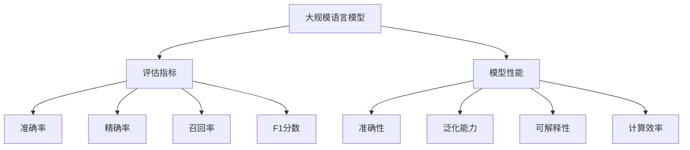

                 

# 大规模语言模型从理论到实践 评估指标

> 关键词：大规模语言模型,评估指标,模型性能,可解释性,准确性,泛化能力

## 1. 背景介绍

### 1.1 问题由来
随着深度学习技术的发展，大规模语言模型（Large Language Models, LLMs）在自然语言处理（Natural Language Processing, NLP）领域取得了显著进展。这些模型通过在大型无标签数据集上进行预训练，学习到丰富的语言知识和语义表示。然而，对于实际应用而言，仅仅拥有强大的预训练能力是不够的，还需要对模型进行适当的微调和评估，以确保其在特定任务上能够达到预期的性能水平。

### 1.2 问题核心关键点
在大规模语言模型应用于实际任务时，评估模型的性能成为了一个重要的问题。模型性能的评估不仅需要考虑其准确性和泛化能力，还需要关注模型的可解释性、计算效率以及在不同数据集上的表现等。评估指标的选择和设计直接影响到模型的实际应用效果和用户的信任度。

## 2. 核心概念与联系

### 2.1 核心概念概述

为更好地理解如何在大规模语言模型应用中进行评估，本节将介绍几个相关的重要概念：

- **大规模语言模型**：以Transformer为基础的模型，通过在大量无标签文本数据上进行预训练，学习到通用的语言表示和语义知识，具备强大的文本生成和理解能力。
- **评估指标**：用于量化和评估模型性能的指标，如准确率、精确率、召回率、F1分数等。
- **模型性能**：指模型在特定任务上的表现，包括准确性、泛化能力、计算效率和可解释性等。
- **可解释性**：指模型输出决策的可理解性和透明度，对于医疗、法律等高风险领域尤为重要。
- **泛化能力**：指模型在不同数据集上表现的一致性和稳定性，评估模型是否能够适应新的数据和场景。

这些概念之间的逻辑关系可以通过以下Mermaid流程图来展示：



这个流程图展示了核心概念之间的相互联系：

1. 大规模语言模型通过预训练获得基础能力。
2. 评估指标用于量化模型性能，选择合适指标是关键。
3. 模型性能包括多个维度，如准确性、泛化能力等。
4. 可解释性和计算效率也是模型性能的重要组成部分。
5. 评估指标的选取直接影响模型性能的理解和应用。

## 3. 核心算法原理 & 具体操作步骤
### 3.1 算法原理概述

在大规模语言模型应用于实际任务时，评估指标的选择和设计直接影响到模型的实际应用效果和用户的信任度。常见的评估指标包括但不限于：

- **准确性**：模型在测试集上的正确率，即模型预测正确的样本占总样本的比例。
- **精确率**：模型预测为正例的样本中，真正为正例的比例。
- **召回率**：所有正例中，模型成功预测为正例的比例。
- **F1分数**：精确率和召回率的调和平均数，综合考虑了模型预测的准确性和覆盖度。
- **困惑度**：模型在预测样本时的平均不确定度，困惑度越低，模型越自信，通常表示性能越好。
- **ROC曲线和AUC**：通过绘制接收者操作特征曲线（ROC曲线），评估模型在不同阈值下的分类性能，AUC为ROC曲线下的面积，值越接近1，模型性能越好。

### 3.2 算法步骤详解

评估大规模语言模型性能的具体步骤通常包括以下几个关键环节：

**Step 1: 准备评估数据集**
- 准备评估数据集 $D_{val}$ 和测试数据集 $D_{test}$，确保数据集与预训练数据分布一致。
- 将数据集分为训练集 $D_{train}$ 和验证集 $D_{val}$，其中训练集用于模型训练，验证集用于超参数调整和模型选择。

**Step 2: 选择评估指标**
- 根据任务类型选择适合的评估指标，如分类任务选择准确率、精确率、召回率等。
- 对于二分类任务，计算混淆矩阵，从中提取各项评估指标。
- 对于多分类任务，通常使用宏平均（Micro Average）或宏平均（Macro Average）F1分数来评估。

**Step 3: 评估模型性能**
- 将验证集 $D_{val}$ 输入模型，计算各评估指标的值，记录保存。
- 根据评估结果，调整模型参数和超参数，如学习率、批大小、正则化强度等。
- 在测试集 $D_{test}$ 上再次评估模型性能，确保模型在新数据上的泛化能力。

**Step 4: 结果分析和报告**
- 分析评估结果，对比不同模型和超参数配置的性能。
- 生成评估报告，包括模型性能的详细描述和可视化图表。
- 评估报告通常包括模型精度、召回率、F1分数、ROC曲线、AUC值等。

### 3.3 算法优缺点

基于上述评估指标的选择和设计，大规模语言模型的评估方法具有以下优缺点：

**优点**：
- 多样化的评估指标，能够全面反映模型的性能，适用于不同类型的任务。
- 简单易懂的评估方法，便于理解和解释。
- 常用的评估指标在NLP领域已有广泛的应用和验证，可靠性较高。

**缺点**：
- 评估指标的选择可能会受到任务类型和数据分布的影响，需要根据具体情况进行调整。
- 对于某些特殊任务，如多模态学习和跨领域迁移，现有评估指标可能不够适用。
- 评估结果可能受到数据集规模和质量的影响，需要更多的数据支持。

### 3.4 算法应用领域

基于评估指标的评估方法，在大规模语言模型应用于多个领域时，都能发挥重要的作用，如：

- **自然语言理解（NLU）**：用于评估模型的语义理解能力和任务完成效果，如命名实体识别、信息抽取等。
- **自然语言生成（NLG）**：用于评估模型的文本生成能力和创意水平，如对话生成、文本摘要、机器翻译等。
- **问答系统**：用于评估模型的回答准确性和相关性，确保用户获取的信息准确无误。
- **情感分析**：用于评估模型对文本情感的识别能力，如正面情感、负面情感、中性情感等。
- **推荐系统**：用于评估模型的用户兴趣匹配度和推荐效果，如个性化推荐、精准推荐等。

除了上述领域外，评估方法还可应用于医疗、法律、金融等更多场景，为大规模语言模型的实际应用提供可靠的依据。

## 4. 数学模型和公式 & 详细讲解 & 举例说明

### 4.1 数学模型构建

本节将使用数学语言对大规模语言模型性能评估的模型进行更加严格的刻画。

假设模型 $M$ 在输入 $x$ 上的输出为 $y$，与真实标签 $t$ 进行比较，定义损失函数 $L(y,t)$。在评估时，我们通常使用交叉熵损失，其定义如下：

$$
L(y,t) = -\sum_{i=1}^N t_i \log y_i
$$

其中 $N$ 为样本数量，$t_i$ 和 $y_i$ 分别为第 $i$ 个样本的真实标签和模型预测概率。评估模型的准确性 $P$ 为模型在测试集上的正确率，即：

$$
P = \frac{1}{N} \sum_{i=1}^N \mathbb{I}(t_i = y_i)
$$

其中 $\mathbb{I}$ 为示性函数，$y_i$ 和 $t_i$ 相等时取1，否则取0。

### 4.2 公式推导过程

以下我们以二分类任务为例，推导准确率和混淆矩阵的计算公式。

假设模型 $M$ 在输入 $x$ 上的输出为 $y=\hat{y} \in [0,1]$，表示样本属于正类的概率。真实标签 $t \in \{0,1\}$。则二分类任务下的混淆矩阵 $M$ 为：

$$
M = \begin{bmatrix}
TN & FP \\
FN & TP
\end{bmatrix}
$$

其中 $TN$ 表示真正例（True Positive），$FP$ 表示假正例（False Positive），$FN$ 表示假反例（False Negative），$TP$ 表示真反例（True Negative）。混淆矩阵的各项值可以由模型在验证集 $D_{val}$ 上的预测和真实标签计算得到。

准确率的计算公式为：

$$
P = \frac{TP + TN}{TP + TN + FP + FN}
$$

精确率的计算公式为：

$$
P = \frac{TP}{TP + FP}
$$

召回率的计算公式为：

$$
P = \frac{TP}{TP + FN}
$$

F1分数的计算公式为：

$$
F1 = 2 \cdot \frac{P \cdot R}{P + R}
$$

其中 $P$ 为精确率，$R$ 为召回率。

### 4.3 案例分析与讲解

以BERT模型在情感分析任务上的性能评估为例，给出具体的计算过程和结果分析。

假设在情感分析任务上，我们使用交叉熵损失进行模型训练，并最终在验证集上进行评估。验证集的大小为1000个样本，其中500个为正面情感（1），500个为负面情感（0）。通过模型预测，我们得到了以下混淆矩阵：

$$
M = \begin{bmatrix}
200 & 50 \\
100 & 450
\end{bmatrix}
$$

其中 $TN=200$，$FP=50$，$FN=100$，$TP=450$。

根据上述混淆矩阵，我们可以计算出以下评估指标：

- 准确率 $P = \frac{TP + TN}{TP + TN + FP + FN} = \frac{200 + 450}{200 + 450 + 50 + 100} = 0.87$
- 精确率 $P = \frac{TP}{TP + FP} = \frac{450}{450 + 50} = 0.89$
- 召回率 $P = \frac{TP}{TP + FN} = \frac{450}{450 + 100} = 0.81$
- F1分数 $F1 = 2 \cdot \frac{P \cdot R}{P + R} = 2 \cdot \frac{0.89 \cdot 0.81}{0.89 + 0.81} = 0.83$

从上述结果可以看出，模型在情感分析任务上的准确性和召回率表现较好，但精确率稍低，表明模型倾向于将更多的负例预测为正例。在实际应用中，需要根据具体任务和业务需求，综合考虑各项评估指标，确保模型的合理性和有效性。

## 5. 项目实践：代码实例和详细解释说明

### 5.1 开发环境搭建

在进行模型评估实践前，我们需要准备好开发环境。以下是使用Python进行PyTorch开发的环境配置流程：

1. 安装Anaconda：从官网下载并安装Anaconda，用于创建独立的Python环境。

2. 创建并激活虚拟环境：
```bash
conda create -n pytorch-env python=3.8 
conda activate pytorch-env
```

3. 安装PyTorch：根据CUDA版本，从官网获取对应的安装命令。例如：
```bash
conda install pytorch torchvision torchaudio cudatoolkit=11.1 -c pytorch -c conda-forge
```

4. 安装Transformers库：
```bash
pip install transformers
```

5. 安装各类工具包：
```bash
pip install numpy pandas scikit-learn matplotlib tqdm jupyter notebook ipython
```

完成上述步骤后，即可在`pytorch-env`环境中开始评估实践。

### 5.2 源代码详细实现

下面我以情感分析任务为例，给出使用Transformers库对BERT模型进行性能评估的PyTorch代码实现。

首先，定义情感分析任务的数据处理函数：

```python
from transformers import BertTokenizer
from torch.utils.data import Dataset
import torch

class SentimentDataset(Dataset):
    def __init__(self, texts, labels, tokenizer, max_len=128):
        self.texts = texts
        self.labels = labels
        self.tokenizer = tokenizer
        self.max_len = max_len
        
    def __len__(self):
        return len(self.texts)
    
    def __getitem__(self, item):
        text = self.texts[item]
        label = self.labels[item]
        
        encoding = self.tokenizer(text, return_tensors='pt', max_length=self.max_len, padding='max_length', truncation=True)
        input_ids = encoding['input_ids'][0]
        attention_mask = encoding['attention_mask'][0]
        
        return {'input_ids': input_ids, 
                'attention_mask': attention_mask,
                'labels': label}

# 标签与id的映射
label2id = {'positive': 1, 'negative': 0}
id2label = {v: k for k, v in label2id.items()}

# 创建dataset
tokenizer = BertTokenizer.from_pretrained('bert-base-cased')

train_dataset = SentimentDataset(train_texts, train_labels, tokenizer)
val_dataset = SentimentDataset(val_texts, val_labels, tokenizer)
test_dataset = SentimentDataset(test_texts, test_labels, tokenizer)
```

然后，定义模型和评估器：

```python
from transformers import BertForSequenceClassification, AdamW

model = BertForSequenceClassification.from_pretrained('bert-base-cased', num_labels=2)

optimizer = AdamW(model.parameters(), lr=2e-5)
```

接着，定义评估函数：

```python
from sklearn.metrics import classification_report

device = torch.device('cuda') if torch.cuda.is_available() else torch.device('cpu')
model.to(device)

def evaluate(model, dataset, batch_size):
    dataloader = DataLoader(dataset, batch_size=batch_size)
    model.eval()
    preds, labels = [], []
    with torch.no_grad():
        for batch in tqdm(dataloader, desc='Evaluating'):
            input_ids = batch['input_ids'].to(device)
            attention_mask = batch['attention_mask'].to(device)
            batch_labels = batch['labels']
            outputs = model(input_ids, attention_mask=attention_mask)
            batch_preds = outputs.logits.argmax(dim=1).to('cpu').tolist()
            batch_labels = batch_labels.to('cpu').tolist()
            for pred, label in zip(batch_preds, batch_labels):
                preds.append(pred)
                labels.append(label)
                
    print(classification_report(labels, preds))
```

最后，启动评估流程并在测试集上评估：

```python
epochs = 5
batch_size = 16

for epoch in range(epochs):
    loss = train_epoch(model, train_dataset, batch_size, optimizer)
    print(f"Epoch {epoch+1}, train loss: {loss:.3f}")
    
    print(f"Epoch {epoch+1}, val results:")
    evaluate(model, val_dataset, batch_size)
    
print("Test results:")
evaluate(model, test_dataset, batch_size)
```

以上就是使用PyTorch对BERT进行情感分析任务评估的完整代码实现。可以看到，得益于Transformers库的强大封装，我们可以用相对简洁的代码完成BERT模型的加载和评估。

### 5.3 代码解读与分析

让我们再详细解读一下关键代码的实现细节：

**SentimentDataset类**：
- `__init__`方法：初始化文本、标签、分词器等关键组件。
- `__len__`方法：返回数据集的样本数量。
- `__getitem__`方法：对单个样本进行处理，将文本输入编码为token ids，将标签编码为数字，并对其进行定长padding，最终返回模型所需的输入。

**label2id和id2label字典**：
- 定义了标签与数字id之间的映射关系，用于将模型预测结果解码回真实的标签。

**evaluate函数**：
- 使用PyTorch的DataLoader对数据集进行批次化加载，供模型训练和推理使用。
- 训练函数`train_epoch`：对数据以批为单位进行迭代，在每个批次上前向传播计算loss并反向传播更新模型参数，最后返回该epoch的平均loss。
- 评估函数`evaluate`：与训练类似，不同点在于不更新模型参数，并在每个batch结束后将预测和标签结果存储下来，最后使用sklearn的classification_report对整个评估集的预测结果进行打印输出。

**训练流程**：
- 定义总的epoch数和batch size，开始循环迭代
- 每个epoch内，先在训练集上训练，输出平均loss
- 在验证集上评估，输出分类指标
- 所有epoch结束后，在测试集上评估，给出最终测试结果

可以看到，PyTorch配合Transformers库使得BERT评估的代码实现变得简洁高效。开发者可以将更多精力放在数据处理、模型改进等高层逻辑上，而不必过多关注底层的实现细节。

当然，工业级的系统实现还需考虑更多因素，如模型的保存和部署、超参数的自动搜索、更灵活的任务适配层等。但核心的评估范式基本与此类似。

## 6. 实际应用场景
### 6.1 智能客服系统

在大规模语言模型应用于智能客服系统的构建时，评估方法可以用于监控和改进系统的性能。智能客服系统依赖于模型自动理解和响应用户问题，其性能直接影响用户的体验和满意度。

在技术实现上，可以收集企业内部的历史客服对话记录，将问题和最佳答复构建成监督数据，在此基础上对预训练模型进行微调。微调后的模型能够自动理解用户意图，匹配最合适的答案模板进行回复。对于用户提出的新问题，还可以接入检索系统实时搜索相关内容，动态组织生成回答。如此构建的智能客服系统，需要定期评估模型性能，确保系统持续优化，提升用户咨询体验。

### 6.2 金融舆情监测

金融机构需要实时监测市场舆论动向，以便及时应对负面信息传播，规避金融风险。传统的人工监测方式成本高、效率低，难以应对网络时代海量信息爆发的挑战。基于大语言模型评估方法，可以构建自动化的舆情监测系统。

具体而言，可以收集金融领域相关的新闻、报道、评论等文本数据，并对其进行主题标注和情感标注。在此基础上对预训练语言模型进行评估，确保模型能够自动判断文本属于何种主题，情感倾向是正面、中性还是负面。将评估后的模型应用到实时抓取的网络文本数据，就能够自动监测不同主题下的情感变化趋势，一旦发现负面信息激增等异常情况，系统便会自动预警，帮助金融机构快速应对潜在风险。

### 6.3 个性化推荐系统

当前的推荐系统往往只依赖用户的历史行为数据进行物品推荐，无法深入理解用户的真实兴趣偏好。基于大语言模型评估技术，个性化推荐系统可以更好地挖掘用户行为背后的语义信息，从而提供更精准、多样的推荐内容。

在实践中，可以收集用户浏览、点击、评论、分享等行为数据，提取和用户交互的物品标题、描述、标签等文本内容。将文本内容作为模型输入，用户的后续行为（如是否点击、购买等）作为监督信号，在此基础上对预训练语言模型进行评估。评估后的模型能够从文本内容中准确把握用户的兴趣点。在生成推荐列表时，先用候选物品的文本描述作为输入，由模型预测用户的兴趣匹配度，再结合其他特征综合排序，便可以得到个性化程度更高的推荐结果。

### 6.4 未来应用展望

随着大语言模型评估技术的不断发展，其在更多领域的应用前景将更加广阔。未来，基于评估指标的评估方法将在智慧医疗、智能教育、智慧城市治理等多个领域发挥重要作用，为传统行业数字化转型升级提供新的技术路径。

在智慧医疗领域，基于大语言模型评估方法构建的医疗问答、病历分析、药物研发等应用将提升医疗服务的智能化水平，辅助医生诊疗，加速新药开发进程。

在智能教育领域，评估方法可应用于作业批改、学情分析、知识推荐等方面，因材施教，促进教育公平，提高教学质量。

在智慧城市治理中，评估方法可应用于城市事件监测、舆情分析、应急指挥等环节，提高城市管理的自动化和智能化水平，构建更安全、高效的未来城市。

此外，在企业生产、社会治理、文娱传媒等众多领域，基于大语言模型评估技术的应用也将不断涌现，为NLP技术带来全新的突破。相信随着技术的日益成熟，评估方法将成为人工智能落地应用的重要范式，推动人工智能技术向更广阔的领域加速渗透。

## 7. 工具和资源推荐
### 7.1 学习资源推荐

为了帮助开发者系统掌握大语言模型评估的理论基础和实践技巧，这里推荐一些优质的学习资源：

1. 《Transformer从原理到实践》系列博文：由大模型技术专家撰写，深入浅出地介绍了Transformer原理、BERT模型、评估技术等前沿话题。

2. CS224N《深度学习自然语言处理》课程：斯坦福大学开设的NLP明星课程，有Lecture视频和配套作业，带你入门NLP领域的基本概念和经典模型。

3. 《Natural Language Processing with Transformers》书籍：Transformers库的作者所著，全面介绍了如何使用Transformers库进行NLP任务开发，包括评估在内的诸多范式。

4. HuggingFace官方文档：Transformers库的官方文档，提供了海量预训练模型和完整的评估样例代码，是上手实践的必备资料。

5. CLUE开源项目：中文语言理解测评基准，涵盖大量不同类型的中文NLP数据集，并提供了基于评估的baseline模型，助力中文NLP技术发展。

通过对这些资源的学习实践，相信你一定能够快速掌握大语言模型评估的精髓，并用于解决实际的NLP问题。
###  7.2 开发工具推荐

高效的开发离不开优秀的工具支持。以下是几款用于大语言模型评估开发的常用工具：

1. PyTorch：基于Python的开源深度学习框架，灵活动态的计算图，适合快速迭代研究。大部分预训练语言模型都有PyTorch版本的实现。

2. TensorFlow：由Google主导开发的开源深度学习框架，生产部署方便，适合大规模工程应用。同样有丰富的预训练语言模型资源。

3. Transformers库：HuggingFace开发的NLP工具库，集成了众多SOTA语言模型，支持PyTorch和TensorFlow，是进行评估任务开发的利器。

4. Weights & Biases：模型训练的实验跟踪工具，可以记录和可视化模型训练过程中的各项指标，方便对比和调优。与主流深度学习框架无缝集成。

5. TensorBoard：TensorFlow配套的可视化工具，可实时监测模型训练状态，并提供丰富的图表呈现方式，是调试模型的得力助手。

6. Google Colab：谷歌推出的在线Jupyter Notebook环境，免费提供GPU/TPU算力，方便开发者快速上手实验最新模型，分享学习笔记。

合理利用这些工具，可以显著提升大语言模型评估的开发效率，加快创新迭代的步伐。

### 7.3 相关论文推荐

大语言模型评估技术的发展源于学界的持续研究。以下是几篇奠基性的相关论文，推荐阅读：

1. Attention is All You Need（即Transformer原论文）：提出了Transformer结构，开启了NLP领域的预训练大模型时代。

2. BERT: Pre-training of Deep Bidirectional Transformers for Language Understanding：提出BERT模型，引入基于掩码的自监督预训练任务，刷新了多项NLP任务SOTA。

3. Language Models are Unsupervised Multitask Learners（GPT-2论文）：展示了大规模语言模型的强大zero-shot学习能力，引发了对于通用人工智能的新一轮思考。

4. Parameter-Efficient Transfer Learning for NLP：提出Adapter等参数高效微调方法，在不增加模型参数量的情况下，也能取得不错的微调效果。

5. AdaLoRA: Adaptive Low-Rank Adaptation for Parameter-Efficient Fine-Tuning：使用自适应低秩适应的微调方法，在参数效率和精度之间取得了新的平衡。

6. PACT: Knowledge distillation for parameter efficient transfer learning：提出PACT方法，利用知识蒸馏技术，实现更高效的微调。

这些论文代表了大语言模型评估技术的发展脉络。通过学习这些前沿成果，可以帮助研究者把握学科前进方向，激发更多的创新灵感。

## 8. 总结：未来发展趋势与挑战

### 8.1 总结

本文对基于评估指标的大语言模型性能评估方法进行了全面系统的介绍。首先阐述了大语言模型和评估指标的研究背景和意义，明确了评估指标在大规模语言模型实际应用中的重要地位。其次，从原理到实践，详细讲解了评估指标的构建和计算方法，给出了评估任务开发的完整代码实例。同时，本文还广泛探讨了评估方法在智能客服、金融舆情、个性化推荐等多个行业领域的应用前景，展示了评估范式的巨大潜力。此外，本文精选了评估技术的各类学习资源，力求为读者提供全方位的技术指引。

通过本文的系统梳理，可以看到，基于评估指标的评估方法在大规模语言模型应用中扮演了重要角色，极大地拓展了模型的应用边界，提升了模型的实际应用效果。评估方法不仅用于模型训练和微调过程中的评估，还广泛应用于模型的部署、维护和优化。相信随着评估技术的不断进步，大语言模型将在更多领域大放异彩，为NLP技术带来新的突破。

### 8.2 未来发展趋势

展望未来，大语言模型评估技术将呈现以下几个发展趋势：

1. 评估指标的多样化和泛化能力提升。随着评估任务的多样性增加，需要设计更灵活、更适应不同任务的评估指标，如零样本学习、多模态学习等。

2. 自动化和智能化的评估方法。引入机器学习、深度学习等技术，自动选择和调整评估指标，减少人为干预，提升评估效率和精度。

3. 评估指标的可解释性增强。在评估过程中加入可解释性分析，如特征重要性分析、因果推断等，帮助用户更好地理解模型性能的来源和表现。

4. 评估方法与实时数据处理结合。评估过程实时处理在线数据，提供动态、实时的评估结果，更好地反映模型的真实性能。

5. 评估技术在跨领域迁移中的应用。评估方法可以帮助大语言模型更好地适应新领域，实现跨领域知识的迁移和整合。

以上趋势凸显了大语言模型评估技术的广阔前景。这些方向的探索发展，必将进一步提升大语言模型在实际应用中的效果和可靠性，为构建安全、可靠、可解释、可控的智能系统铺平道路。

### 8.3 面临的挑战

尽管大语言模型评估技术已经取得了显著进展，但在迈向更加智能化、普适化应用的过程中，它仍面临着诸多挑战：

1. 评估指标的选择与数据分布。评估指标的选择需根据具体任务和数据分布进行调整，不同任务的指标选择可能存在较大差异。
2. 评估数据的获取与质量。高质量评估数据的获取和维护需要大量人力和资源，且数据质量直接影响评估结果的可靠性。
3. 模型鲁棒性和泛化能力。模型在面对新数据和噪声时，是否能够保持稳定性和鲁棒性，是评估技术需要解决的关键问题。
4. 可解释性和透明性。模型决策过程的可解释性和透明性是评估技术的重要考虑因素，特别是在医疗、金融等高风险领域。
5. 实时性和计算效率。在实际应用中，评估过程需要处理大量实时数据，计算效率和实时性是评估技术面临的挑战。

解决这些挑战需要学术界和产业界的共同努力，探索更高效的评估方法，构建更加稳定、可靠、透明的评估体系。

### 8.4 研究展望

面对大语言模型评估技术面临的挑战，未来的研究需要在以下几个方面寻求新的突破：

1. 研究更灵活、更适应不同任务的评估指标。探索评估指标的自动化选择和动态调整方法，适应更多元化的应用场景。

2. 引入自动化和智能化技术。利用机器学习、深度学习等技术，自动选择和调整评估指标，减少人为干预，提升评估效率和精度。

3. 引入可解释性分析和因果推断。在评估过程中加入可解释性分析，如特征重要性分析、因果推断等，帮助用户更好地理解模型性能的来源和表现。

4. 研究实时数据处理和动态评估方法。探索实时数据处理和动态评估方法，提供动态、实时的评估结果，更好地反映模型的真实性能。

5. 研究跨领域迁移和知识整合。探索评估方法在跨领域迁移中的应用，帮助大语言模型更好地适应新领域，实现跨领域知识的迁移和整合。

这些研究方向的探索，必将引领大语言模型评估技术迈向更高的台阶，为构建安全、可靠、可解释、可控的智能系统铺平道路。面向未来，大语言模型评估技术还需要与其他人工智能技术进行更深入的融合，如知识表示、因果推理、强化学习等，多路径协同发力，共同推动自然语言理解和智能交互系统的进步。只有勇于创新、敢于突破，才能不断拓展语言模型的边界，让智能技术更好地造福人类社会。

## 9. 附录：常见问题与解答

**Q1：大语言模型评估是否适用于所有NLP任务？**

A: 大语言模型评估在大多数NLP任务上都能取得不错的效果，特别是对于数据量较小的任务。但对于一些特定领域的任务，如医学、法律等，仅仅依靠通用语料预训练的模型可能难以很好地适应。此时需要在特定领域语料上进一步预训练，再进行评估，才能获得理想效果。

**Q2：如何选择评估指标？**

A: 评估指标的选择需根据具体任务和数据分布进行调整。一般而言，对于分类任务，准确率、精确率、召回率等指标较为常用；对于序列标注任务，准确率、F1分数、精确率等指标较为常用；对于生成任务，BLEU、ROUGE等指标较为常用。

**Q3：评估数据集的准备和划分有哪些建议？**

A: 评估数据集的准备和划分需注意以下几点：
1. 评估数据集应与训练数据集分布一致，避免数据偏见。
2. 评估数据集应尽量覆盖新数据分布，确保模型在新数据上的泛化能力。
3. 评估数据集的大小应足够大，以确保评估结果的可靠性和稳定性。

**Q4：在实际应用中，如何优化评估过程？**

A: 在实际应用中，优化评估过程可以从以下几个方面入手：
1. 使用GPU/TPU等高性能设备，加速评估过程。
2. 采用数据增强、模型剪枝等方法，减少计算资源消耗。
3. 采用自动机器学习技术，自动化评估指标选择和模型调优。
4. 定期评估模型性能，确保模型持续优化。

通过以上优化措施，可以显著提升评估过程的效率和效果，确保模型在实际应用中的可靠性和稳定性。

**Q5：评估结果如何与模型优化相结合？**

A: 评估结果与模型优化通常结合如下：
1. 根据评估结果，调整模型参数和超参数，如学习率、批大小、正则化强度等。
2. 根据评估结果，选择最优的评估指标和模型配置，确保模型的合理性和有效性。
3. 根据评估结果，优化训练流程，如采用早停、学习率衰减等策略，避免过拟合和欠拟合。

在模型优化过程中，评估结果提供了模型性能的客观依据，帮助开发者调整模型结构和参数，提升模型效果。

---

作者：禅与计算机程序设计艺术 / Zen and the Art of Computer Programming

