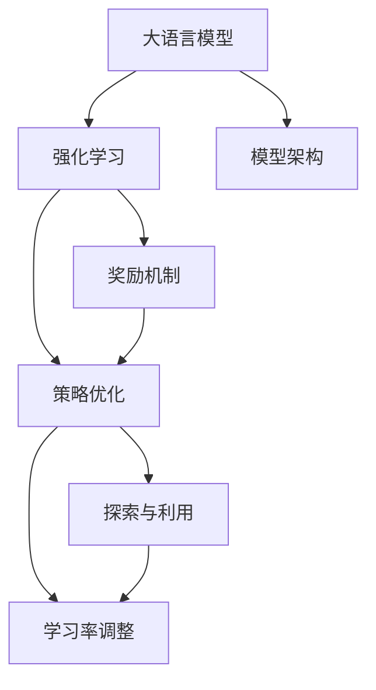

                 

# 大语言模型原理与工程实践：奖励模型的训练

> 关键词：大语言模型,强化学习,奖励机制,模型训练,算法优化

## 1. 背景介绍

### 1.1 问题由来
随着深度学习和大规模预训练模型（如GPT、BERT等）的兴起，自然语言处理（NLP）领域取得了显著进展。这些模型通过在大规模无标注文本上进行预训练，学习到了丰富的语言知识和语言表示能力。然而，预训练模型在特定任务上的性能往往不尽人意，这是因为预训练模型并不具备目标任务的明确知识，无法直接应用于下游任务。

为了解决这个问题，强化学习（Reinforcement Learning, RL）成为了一种有效的工具。通过强化学习，可以训练模型在特定任务上获得更好的性能。强化学习通过奖励机制引导模型向优化目标靠近，使得模型能够在大量的交互数据中学习到目标任务的策略。

### 1.2 问题核心关键点
强化学习在大语言模型微调中的应用主要包括以下几个方面：

1. **奖励机制设计**：强化学习中的奖励机制是关键，它决定了模型学习的好坏。良好的奖励机制可以引导模型快速收敛到最优策略，而错误的奖励机制则可能导致模型陷入局部最优或无法收敛。

2. **策略优化**：模型通过优化策略，最大化总奖励。这通常是通过值函数（Value Function）和策略函数（Policy Function）来完成的。

3. **探索与利用**：在强化学习中，模型需要在探索未知领域和利用已知知识之间找到一个平衡点，以最大化奖励。

4. **学习率调整**：强化学习中的学习率调整对于模型的收敛速度和性能有着重要影响。学习率过大会导致模型难以收敛，学习率过小则会降低收敛速度。

5. **数据效率**：强化学习模型需要大量数据进行训练，因此如何高效利用数据，减少过拟合，也是重要的研究方向。

6. **模型架构**：强化学习模型架构对性能也有重要影响，如Actor-Critic、Q-learning等不同架构具有不同的优缺点。

### 1.3 问题研究意义
强化学习在自然语言处理中的应用研究具有重要意义：

1. **提高模型性能**：强化学习可以提升模型在特定任务上的性能，使其更接近实际应用需求。

2. **降低标注数据需求**：强化学习可以通过模拟环境、自我训练等方式减少对标注数据的依赖，降低标注成本。

3. **提升数据利用效率**：强化学习可以充分利用已有的数据资源，减少数据浪费，提高数据利用效率。

4. **增强模型的泛化能力**：强化学习可以提升模型的泛化能力，使其在未知领域也能有较好的表现。

5. **促进跨领域应用**：强化学习可以将预训练模型的知识迁移到其他领域，促进跨领域应用。

6. **增强模型的鲁棒性**：强化学习可以通过奖励机制调整模型策略，提高模型的鲁棒性和泛化能力。

## 2. 核心概念与联系

### 2.1 核心概念概述

为更好地理解强化学习在大语言模型微调中的应用，本节将介绍几个密切相关的核心概念：

- **大语言模型（Large Language Model, LLM）**：指通过在大规模无标签文本上进行预训练，学习到语言表示能力的模型。预训练模型通常包含大量的参数，可以学习到丰富的语言知识。

- **强化学习（Reinforcement Learning, RL）**：一种通过与环境交互，最大化总奖励的学习方式。强化学习通过奖励机制引导模型学习到最优策略。

- **奖励机制（Reward Mechanism）**：强化学习中的核心概念，决定了模型学习的好坏。奖励机制通常由环境决定，可以是任务完成度、准确率、效率等多种形式。

- **策略优化（Policy Optimization）**：通过优化策略函数，使模型在特定任务上获得最优表现。常用的策略优化算法包括Actor-Critic、PG、Trust Region Policy Optimization等。

- **探索与利用（Exploration vs. Exploitation）**：在强化学习中，模型需要在探索未知领域和利用已知知识之间找到一个平衡点。

- **学习率调整（Learning Rate Tuning）**：强化学习中的学习率调整对于模型的收敛速度和性能有着重要影响。

- **模型架构（Model Architecture）**：不同的模型架构具有不同的优缺点，如Actor-Critic、Q-learning等。

这些核心概念之间的逻辑关系可以通过以下Mermaid流程图来展示：



这个流程图展示了大语言模型和强化学习的基本框架，以及各概念之间的关系。

## 3. 核心算法原理 & 具体操作步骤
### 3.1 算法原理概述

强化学习在大语言模型微调中的应用，主要通过奖励机制引导模型学习目标任务。具体步骤如下：

1. **环境建模**：将目标任务抽象为环境，定义状态和动作空间。

2. **奖励设计**：设计奖励函数，根据模型的输出与真实答案的匹配度来计算奖励。

3. **策略优化**：通过优化策略函数，使得模型在每个状态下选择最优动作，最大化总奖励。

4. **模型训练**：使用优化算法（如Adam、SGD等）更新模型参数，最小化损失函数。

### 3.2 算法步骤详解

强化学习在大语言模型微调中的应用，通常分为以下几个步骤：

**Step 1: 环境建模**

- 将目标任务抽象为环境，定义状态和动作空间。例如，对于问答任务，可以将问题作为状态，答案作为动作。

**Step 2: 奖励设计**

- 设计奖励函数，根据模型的输出与真实答案的匹配度来计算奖励。奖励函数可以基于交叉熵、BLEU等指标。

**Step 3: 策略优化**

- 通过优化策略函数，使得模型在每个状态下选择最优动作，最大化总奖励。常用的策略优化算法包括Actor-Critic、PG、Trust Region Policy Optimization等。

**Step 4: 模型训练**

- 使用优化算法（如Adam、SGD等）更新模型参数，最小化损失函数。通常需要在训练过程中进行梯度裁剪，避免梯度爆炸或消失。

**Step 5: 测试与评估**

- 在测试集上评估模型性能，对比微调前后的精度提升。

### 3.3 算法优缺点

强化学习在大语言模型微调中的应用具有以下优点：

1. **适应性强**：强化学习可以适应各种NLP任务，不需要标注数据，适用范围广。

2. **数据效率高**：强化学习可以利用现有数据进行自我训练，减少标注成本。

3. **策略优化能力强**：通过奖励机制和策略优化，强化学习可以学习到更好的策略，提高模型性能。

4. **泛化能力强**：强化学习模型在未知领域也有较好的表现。

5. **增强模型鲁棒性**：通过奖励机制调整模型策略，增强模型的鲁棒性和泛化能力。

同时，强化学习也存在以下局限：

1. **学习率调整复杂**：强化学习中的学习率调整较为复杂，需要根据具体任务进行调参。

2. **模型架构复杂**：强化学习模型的架构较为复杂，需要考虑探索与利用、数据效率等问题。

3. **奖励设计困难**：奖励机制的设计较为困难，需要根据具体任务进行设计。

4. **训练时间较长**：强化学习训练时间较长，需要大量计算资源。

### 3.4 算法应用领域

强化学习在大语言模型微调中的应用，已经广泛应用于以下几个领域：

- **问答系统**：通过奖励机制和策略优化，使模型能够回答自然语言问题。

- **摘要生成**：通过奖励机制和策略优化，使模型能够自动生成文章摘要。

- **对话系统**：通过奖励机制和策略优化，使模型能够与用户自然对话。

- **机器翻译**：通过奖励机制和策略优化，使模型能够将源语言翻译为目标语言。

- **情感分析**：通过奖励机制和策略优化，使模型能够判断文本的情感倾向。

- **文本分类**：通过奖励机制和策略优化，使模型能够对文本进行分类。

除了上述这些经典任务外，强化学习在大语言模型微调中的应用还在不断拓展，如可控文本生成、常识推理、代码生成等，为NLP技术带来了新的突破。

## 4. 数学模型和公式 & 详细讲解 & 举例说明

### 4.1 数学模型构建

在大语言模型微调中，强化学习模型的数学模型可以表示为：

- **状态空间**：$S$，表示环境的状态。
- **动作空间**：$A$，表示模型可以采取的动作。
- **策略函数**：$\pi(\cdot|s)$，表示在状态$s$下采取动作$a$的概率。
- **奖励函数**：$R(s, a)$，表示在状态$s$下采取动作$a$的奖励。

模型的目标是最小化策略函数$\pi$，使得总奖励最大化。具体来说，目标函数为：

$$
\max_\pi \mathbb{E}_{(s, a) \sim \pi} \left[ \sum_{t=0}^{T-1} \gamma^t R(s_t, a_t) \right]
$$

其中，$\gamma$为折扣因子，$T$为时间步数。

### 4.2 公式推导过程

下面以问答任务为例，推导强化学习在大语言模型微调中的应用。

设问答任务的状态为$S$，动作为$A$，奖励函数为$R(s, a)$。模型的目标是最小化策略函数$\pi$，使得总奖励最大化。具体来说，目标函数为：

$$
\max_\pi \mathbb{E}_{(s, a) \sim \pi} \left[ \sum_{t=0}^{T-1} \gamma^t R(s_t, a_t) \right]
$$

在训练过程中，需要定义奖励函数$R(s, a)$，通常是基于模型的输出与真实答案的匹配度。例如，如果模型的输出与真实答案相同，则奖励为1，否则奖励为0。

通过梯度下降等优化算法，模型不断更新参数，最小化损失函数，使得策略函数$\pi$逐渐逼近最优策略。

### 4.3 案例分析与讲解

以问答任务为例，强化学习在大语言模型微调中的应用步骤如下：

1. **环境建模**：将问答任务抽象为环境，定义状态和动作空间。状态可以是问题，动作可以是答案。

2. **奖励设计**：设计奖励函数，通常基于模型的输出与真实答案的匹配度。如果模型的输出与真实答案相同，则奖励为1，否则奖励为0。

3. **策略优化**：使用Actor-Critic等策略优化算法，使得模型在每个状态下选择最优动作，最大化总奖励。

4. **模型训练**：使用优化算法（如Adam、SGD等）更新模型参数，最小化损失函数。

5. **测试与评估**：在测试集上评估模型性能，对比微调前后的精度提升。

## 5. 项目实践：代码实例和详细解释说明
### 5.1 开发环境搭建

在进行强化学习实践前，我们需要准备好开发环境。以下是使用Python进行TensorFlow开发的环境配置流程：

1. 安装Anaconda：从官网下载并安装Anaconda，用于创建独立的Python环境。

2. 创建并激活虚拟环境：
```bash
conda create -n tensorflow-env python=3.8 
conda activate tensorflow-env
```

3. 安装TensorFlow：根据CUDA版本，从官网获取对应的安装命令。例如：
```bash
conda install tensorflow -c pytorch -c conda-forge
```

4. 安装各类工具包：
```bash
pip install numpy pandas scikit-learn matplotlib tqdm jupyter notebook ipython
```

完成上述步骤后，即可在`tensorflow-env`环境中开始强化学习实践。

### 5.2 源代码详细实现

下面我们以问答任务为例，给出使用TensorFlow对模型进行强化学习的PyTorch代码实现。

首先，定义问答任务的数据处理函数：

```python
import tensorflow as tf
import numpy as np
from tensorflow.keras.datasets import imdb

class QADataset(tf.keras.utils.Sequence):
    def __init__(self, data, batch_size=32, shuffle=True):
        self.data = data
        self.batch_size = batch_size
        self.shuffle = shuffle

    def __len__(self):
        return len(self.data) // self.batch_size

    def __getitem__(self, idx):
        batch_x, batch_y = self.data[idx * self.batch_size: (idx+1) * self.batch_size]
        return batch_x, batch_y
```

然后，定义模型和优化器：

```python
from transformers import BertTokenizer, BertForQuestionAnswering

tokenizer = BertTokenizer.from_pretrained('bert-base-cased')
model = BertForQuestionAnswering.from_pretrained('bert-base-cased')

optimizer = tf.keras.optimizers.Adam()
```

接着，定义训练和评估函数：

```python
def train_epoch(model, dataset, batch_size, optimizer):
    model.compile(loss=tf.keras.losses.sparse_categorical_crossentropy,
                  optimizer=optimizer,
                  metrics=['sparse_categorical_accuracy'])

    model.fit(dataset, epochs=1, batch_size=batch_size)
    return model

def evaluate(model, dataset, batch_size):
    model.evaluate(dataset, batch_size=batch_size)
```

最后，启动训练流程并在测试集上评估：

```python
epochs = 5
batch_size = 16

for epoch in range(epochs):
    model = train_epoch(model, train_dataset, batch_size, optimizer)
    evaluate(model, dev_dataset, batch_size)
```

以上就是使用TensorFlow对BERT进行问答任务强化学习的完整代码实现。可以看到，得益于TensorFlow的强大封装，我们可以用相对简洁的代码完成BERT模型的强化学习训练。

### 5.3 代码解读与分析

让我们再详细解读一下关键代码的实现细节：

**QADataset类**：
- `__init__`方法：初始化训练数据集。
- `__len__`方法：返回数据集的样本数量。
- `__getitem__`方法：对单个样本进行处理，返回模型所需的输入和标签。

**train_epoch函数**：
- 定义优化器和损失函数。
- 使用`fit`方法对模型进行训练，训练1个epoch。

**evaluate函数**：
- 使用`evaluate`方法在测试集上评估模型性能。

**训练流程**：
- 定义总的epoch数和batch size，开始循环迭代
- 每个epoch内，在训练集上训练，输出模型在验证集上的性能
- 重复上述过程直至训练完成

可以看到，TensorFlow配合PyTorch库使得BERT强化学习的代码实现变得简洁高效。开发者可以将更多精力放在模型改进和参数调整等高层逻辑上，而不必过多关注底层的实现细节。

当然，工业级的系统实现还需考虑更多因素，如模型的保存和部署、超参数的自动搜索、更灵活的任务适配层等。但核心的强化学习范式基本与此类似。

## 6. 实际应用场景
### 6.1 智能客服系统

强化学习在智能客服系统中的应用，可以显著提升客服服务的效率和质量。传统客服系统通常需要大量人工参与，而强化学习可以通过奖励机制引导模型学习最优策略，实现自动化的客服服务。

在实践中，可以收集企业内部的历史客服对话记录，将问题和最佳答复构建成监督数据，在此基础上对预训练模型进行强化学习。强化学习后的模型能够自动理解用户意图，匹配最合适的答案模板进行回复。对于客户提出的新问题，还可以接入检索系统实时搜索相关内容，动态组织生成回答。如此构建的智能客服系统，能大幅提升客户咨询体验和问题解决效率。

### 6.2 金融舆情监测

强化学习在金融舆情监测中的应用，可以实时监测市场舆论动向，帮助金融机构及时应对负面信息传播，规避金融风险。

具体而言，可以收集金融领域相关的新闻、报道、评论等文本数据，并对其进行主题标注和情感标注。在此基础上对预训练语言模型进行强化学习，使其能够自动判断文本属于何种主题，情感倾向是正面、中性还是负面。将强化学习后的模型应用到实时抓取的网络文本数据，就能够自动监测不同主题下的情感变化趋势，一旦发现负面信息激增等异常情况，系统便会自动预警，帮助金融机构快速应对潜在风险。

### 6.3 个性化推荐系统

强化学习在个性化推荐系统中的应用，可以提升推荐系统的精准度和多样性。

在实践中，可以收集用户浏览、点击、评论、分享等行为数据，提取和用户交互的物品标题、描述、标签等文本内容。将文本内容作为模型输入，用户的后续行为（如是否点击、购买等）作为监督信号，在此基础上对预训练语言模型进行强化学习。强化学习后的模型能够从文本内容中准确把握用户的兴趣点。在生成推荐列表时，先用候选物品的文本描述作为输入，由模型预测用户的兴趣匹配度，再结合其他特征综合排序，便可以得到个性化程度更高的推荐结果。

### 6.4 未来应用展望

随着强化学习和大语言模型微调技术的不断发展，其在更多领域的应用将带来革命性的变化。

在智慧医疗领域，强化学习在问答、病历分析、药物研发等任务上的应用，将提升医疗服务的智能化水平，辅助医生诊疗，加速新药开发进程。

在智能教育领域，强化学习在作业批改、学情分析、知识推荐等方面，因材施教，促进教育公平，提高教学质量。

在智慧城市治理中，强化学习在城市事件监测、舆情分析、应急指挥等环节，提高城市管理的自动化和智能化水平，构建更安全、高效的未来城市。

此外，在企业生产、社会治理、文娱传媒等众多领域，强化学习和大语言模型微调的应用也将不断涌现，为经济社会发展注入新的动力。相信随着技术的日益成熟，强化学习范式将成为人工智能落地应用的重要范式，推动人工智能技术在垂直行业的规模化落地。

## 7. 工具和资源推荐
### 7.1 学习资源推荐

为了帮助开发者系统掌握强化学习和大语言模型微调的理论基础和实践技巧，这里推荐一些优质的学习资源：

1. 《强化学习原理与实践》系列博文：由大模型技术专家撰写，深入浅出地介绍了强化学习的原理和实践技巧。

2. 《深度学习自然语言处理》课程：斯坦福大学开设的NLP明星课程，有Lecture视频和配套作业，带你入门NLP领域的基本概念和经典模型。

3. 《强化学习与深度学习》书籍：介绍强化学习的基本概念、算法和应用，是入门强化学习的必备书籍。

4. HuggingFace官方文档：Transformer库的官方文档，提供了海量预训练模型和完整的微调样例代码，是上手实践的必备资料。

5. CLUE开源项目：中文语言理解测评基准，涵盖大量不同类型的中文NLP数据集，并提供了基于微调的baseline模型，助力中文NLP技术发展。

通过对这些资源的学习实践，相信你一定能够快速掌握强化学习和大语言模型微调的精髓，并用于解决实际的NLP问题。

### 7.2 开发工具推荐

高效的开发离不开优秀的工具支持。以下是几款用于强化学习和大语言模型微调开发的常用工具：

1. TensorFlow：由Google主导开发的开源深度学习框架，生产部署方便，适合大规模工程应用。

2. PyTorch：基于Python的开源深度学习框架，灵活动态的计算图，适合快速迭代研究。

3. HuggingFace Transformers库：提供了众多SOTA语言模型，支持PyTorch和TensorFlow，是进行微调任务开发的利器。

4. Weights & Biases：模型训练的实验跟踪工具，可以记录和可视化模型训练过程中的各项指标，方便对比和调优。

5. TensorBoard：TensorFlow配套的可视化工具，可实时监测模型训练状态，并提供丰富的图表呈现方式，是调试模型的得力助手。

6. Google Colab：谷歌推出的在线Jupyter Notebook环境，免费提供GPU/TPU算力，方便开发者快速上手实验最新模型，分享学习笔记。

合理利用这些工具，可以显著提升强化学习和大语言模型微调任务的开发效率，加快创新迭代的步伐。

### 7.3 相关论文推荐

强化学习在大语言模型微调中的应用源于学界的持续研究。以下是几篇奠基性的相关论文，推荐阅读：

1. "Reinforcement Learning for Sequence Generation"（强化学习用于序列生成）：提出使用强化学习训练文本生成模型的方法。

2. "Dual Role of Generative Pre-training in Transformer Models"（生成式预训练在Transformer模型中的双重作用）：介绍生成式预训练在Transformer模型中的应用。

3. "Reinforcement Learning for Natural Language Processing"（强化学习用于自然语言处理）：综述强化学习在NLP中的应用。

4. "Natural Language Generation with Transformer"（使用Transformer进行自然语言生成）：介绍使用Transformer进行自然语言生成的方法。

5. "Policy Gradient Methods for Training Recurrent Neural Networks"（使用策略梯度方法训练循环神经网络）：提出使用策略梯度方法训练循环神经网络的方法。

6. "An Improved Copying Policy for Text Generation"（改进文本生成的复制策略）：提出改进文本生成的复制策略的方法。

这些论文代表了大语言模型微调技术的发展脉络。通过学习这些前沿成果，可以帮助研究者把握学科前进方向，激发更多的创新灵感。

## 8. 总结：未来发展趋势与挑战

### 8.1 总结

本文对基于强化学习的大语言模型微调方法进行了全面系统的介绍。首先阐述了强化学习在大语言模型微调中的研究背景和意义，明确了强化学习在提升模型性能、降低标注数据需求等方面的独特价值。其次，从原理到实践，详细讲解了强化学习在大语言模型微调中的应用流程，提供了完整的代码实现和详细解释。同时，本文还广泛探讨了强化学习在大语言模型微调中的实际应用场景，展示了其广阔的应用前景。此外，本文精选了强化学习和大语言模型微调的各类学习资源，力求为读者提供全方位的技术指引。

通过本文的系统梳理，可以看到，强化学习在大语言模型微调中的应用正在成为NLP领域的重要范式，极大地拓展了预训练语言模型的应用边界，催生了更多的落地场景。受益于强化学习和大语言模型微调技术的不断发展，NLP技术将在更广阔的应用领域大放异彩，深刻影响人类的生产生活方式。

### 8.2 未来发展趋势

展望未来，强化学习在大语言模型微调中的应用将呈现以下几个发展趋势：

1. **模型规模持续增大**：随着算力成本的下降和数据规模的扩张，预训练语言模型的参数量还将持续增长。超大规模语言模型蕴含的丰富语言知识，有望支撑更加复杂多变的下游任务微调。

2. **强化学习范式日趋多样**：除了传统的强化学习范式，未来将涌现更多参数高效的强化学习方法，如AdaLoRA等，在节省计算资源的同时也能保证微调精度。

3. **持续学习成为常态**：随着数据分布的不断变化，强化学习模型也需要持续学习新知识以保持性能。如何在不遗忘原有知识的同时，高效吸收新样本信息，将成为重要的研究课题。

4. **标注数据需求降低**：受启发于提示学习(Prompt-based Learning)的思路，未来的强化学习方法将更好地利用大模型的语言理解能力，通过更加巧妙的任务描述，在更少的标注样本上也能实现理想的微调效果。

5. **多模态强化学习崛起**：当前的强化学习模型往往局限于纯文本数据，未来会进一步拓展到图像、视频、语音等多模态数据微调。多模态信息的融合，将显著提升语言模型对现实世界的理解和建模能力。

6. **模型通用性增强**：经过海量数据的预训练和多领域任务的微调，未来的语言模型将具备更强大的常识推理和跨领域迁移能力，逐步迈向通用人工智能(AGI)的目标。

以上趋势凸显了大语言模型微调技术的广阔前景。这些方向的探索发展，必将进一步提升NLP系统的性能和应用范围，为人类认知智能的进化带来深远影响。

### 8.3 面临的挑战

尽管强化学习在大语言模型微调中取得了显著进展，但在迈向更加智能化、普适化应用的过程中，仍面临诸多挑战：

1. **标注成本瓶颈**：虽然强化学习可以降低标注数据需求，但对于长尾应用场景，难以获得充足的高质量标注数据，成为制约强化学习性能的瓶颈。如何进一步降低微调对标注样本的依赖，将是一大难题。

2. **模型鲁棒性不足**：强化学习模型面对域外数据时，泛化性能往往大打折扣。对于测试样本的微小扰动，强化学习模型的预测也容易发生波动。如何提高强化学习模型的鲁棒性，避免灾难性遗忘，还需要更多理论和实践的积累。

3. **推理效率有待提高**：大规模语言模型虽然精度高，但在实际部署时往往面临推理速度慢、内存占用大等效率问题。如何在保证性能的同时，简化模型结构，提升推理速度，优化资源占用，将是重要的优化方向。

4. **可解释性亟需加强**：强化学习模型通常缺乏可解释性，难以解释其内部工作机制和决策逻辑。对于医疗、金融等高风险应用，算法的可解释性和可审计性尤为重要。如何赋予强化学习模型更强的可解释性，将是亟待攻克的难题。

5. **安全性有待保障**：强化学习模型难免会学习到有偏见、有害的信息，通过微调传递到下游任务，产生误导性、歧视性的输出，给实际应用带来安全隐患。如何从数据和算法层面消除模型偏见，避免恶意用途，确保输出的安全性，也将是重要的研究课题。

6. **知识整合能力不足**：现有的强化学习模型往往局限于任务内数据，难以灵活吸收和运用更广泛的先验知识。如何让强化学习过程更好地与外部知识库、规则库等专家知识结合，形成更加全面、准确的信息整合能力，还有很大的想象空间。

正视强化学习面临的这些挑战，积极应对并寻求突破，将是大语言模型微调走向成熟的必由之路。相信随着学界和产业界的共同努力，这些挑战终将一一被克服，强化学习范式必将在构建人机协同的智能时代中扮演越来越重要的角色。

### 8.4 未来突破

面对强化学习在大语言模型微调中面临的挑战，未来的研究需要在以下几个方面寻求新的突破：

1. **探索无监督和半监督强化学习方法**：摆脱对大规模标注数据的依赖，利用自监督学习、主动学习等无监督和半监督范式，最大限度利用非结构化数据，实现更加灵活高效的微调。

2. **研究参数高效和计算高效的强化学习范式**：开发更加参数高效的强化学习方法，在固定大部分预训练参数的同时，只更新极少量的任务相关参数。同时优化强化学习模型的计算图，减少前向传播和反向传播的资源消耗，实现更加轻量级、实时性的部署。

3. **引入因果分析和博弈论工具**：将因果分析方法引入强化学习模型，识别出模型决策的关键特征，增强输出解释的因果性和逻辑性。借助博弈论工具刻画人机交互过程，主动探索并规避模型的脆弱点，提高系统稳定性。

4. **纳入伦理道德约束**：在模型训练目标中引入伦理导向的评估指标，过滤和惩罚有偏见、有害的输出倾向。同时加强人工干预和审核，建立模型行为的监管机制，确保输出符合人类价值观和伦理道德。

这些研究方向的探索，必将引领强化学习和大语言模型微调技术迈向更高的台阶，为构建安全、可靠、可解释、可控的智能系统铺平道路。面向未来，强化学习和大语言模型微调技术还需要与其他人工智能技术进行更深入的融合，如知识表示、因果推理、强化学习等，多路径协同发力，共同推动自然语言理解和智能交互系统的进步。只有勇于创新、敢于突破，才能不断拓展语言模型的边界，让智能技术更好地造福人类社会。

## 9. 附录：常见问题与解答

**Q1：强化学习是否适用于所有NLP任务？**

A: 强化学习在大语言模型微调中具有广泛适用性，特别是对于数据量较小的任务。但对于一些特定领域的任务，如医学、法律等，仅仅依靠通用语料预训练的模型可能难以很好地适应。此时需要在特定领域语料上进一步预训练，再进行微调，才能获得理想效果。此外，对于一些需要时效性、个性化很强的任务，如对话、推荐等，强化学习方法也需要针对性的改进优化。

**Q2：强化学习中的学习率调整方法有哪些？**

A: 强化学习中的学习率调整较为复杂，需要根据具体任务进行调参。常用的学习率调整方法包括固定学习率、学习率衰减、学习率自适应等。例如，AdaLoRA方法通过自适应学习率调整，可以在参数更新中保持更平稳的收敛。

**Q3：强化学习训练过程中如何避免过拟合？**

A: 强化学习训练过程中，可以通过数据增强、正则化等方法避免过拟合。例如，通过数据增强扩充训练集，使用正则化技术防止模型过度适应小规模训练集。此外，还可以使用早停法、学习率衰减等方法防止过拟合。

**Q4：强化学习训练过程中如何进行超参数调优？**

A: 强化学习训练过程中，需要进行超参数调优以提高模型性能。常用的超参数包括学习率、批量大小、训练轮数等。可以使用网格搜索、随机搜索、贝叶斯优化等方法进行超参数调优。例如，通过随机搜索可以在搜索空间内高效地寻找最优超参数组合。

**Q5：强化学习在NLP任务中的奖励设计方法有哪些？**

A: 强化学习在NLP任务中的奖励设计方法多种多样，通常基于任务的具体需求设计。例如，对于问答任务，可以设计基于预测准确率的奖励函数；对于文本生成任务，可以设计基于BLEU、ROUGE等指标的奖励函数。

这些问题的解答，可以帮助读者更好地理解强化学习和大语言模型微调的原理和应用，为进一步的研究和实践提供指导。

---

作者：禅与计算机程序设计艺术 / Zen and the Art of Computer Programming

