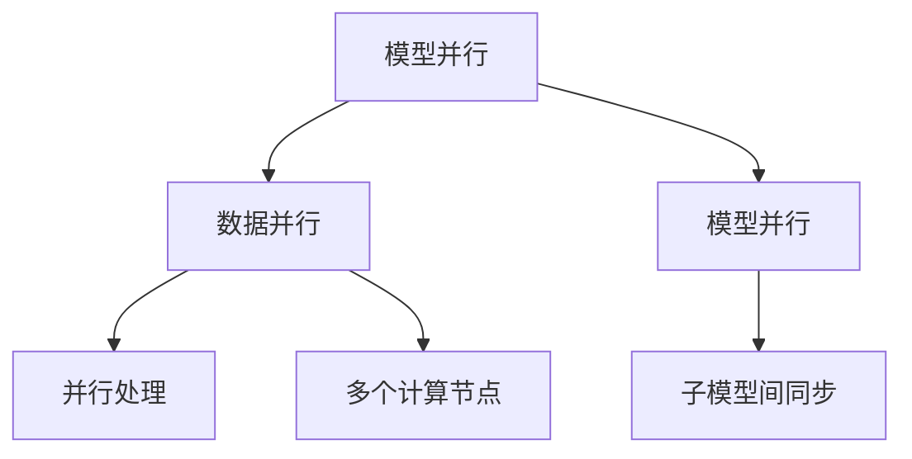

                 

# 大语言模型原理与工程实践：模型并行

> 关键词：大语言模型, 模型并行, 深度学习, 分布式训练, 神经网络, GPU, 多GPU, 数据通信, 带宽, 算法优化, 模型压缩, 推理加速, 模型剪枝, 知识蒸馏, 动态图, 静态图, 框架集成, 性能优化

## 1. 背景介绍

### 1.1 问题由来
随着深度学习技术的迅猛发展，大模型如BERT、GPT等在自然语言处理(NLP)、计算机视觉(CV)等领域的广泛应用，展示了其强大的表达能力和泛化能力。然而，大规模深度学习模型的训练和推理需要庞大的计算资源，单台机器难以满足需求。在深度学习领域，模型并行（Model Parallelism）成为了一种解决大规模模型训练的必备技术。模型并行通过将大模型拆分为多个小模型并行训练，从而提升训练效率和资源利用率，同时保障模型性能。

模型并行对于构建高性能、高效率的人工智能应用具有重要意义。它可以充分利用多台计算机的计算资源，加速模型训练和推理过程，同时减少单个模型的计算资源消耗，降低训练成本，提升实时性。但同时，模型并行也面临着一些挑战，如数据通信开销、模型间的同步协调、算子优化等。

本文将详细介绍模型并行的核心概念和原理，分析其优缺点和应用领域，并通过具体案例和代码实例，展示模型并行的工程实践。

## 2. 核心概念与联系

### 2.1 核心概念概述

在深入了解模型并行之前，首先需要理解几个关键概念：

- **模型并行**：指将一个大型深度学习模型拆分为多个子模型，每个子模型在独立的数据并行计算单元（如GPU、TPU）上并行训练或推理的过程。模型并行主要分为两种类型：数据并行和模型并行。

- **数据并行**：将同一批次的数据分别分配给多个计算节点并行处理，模型权重参数保持不变。适用于模型的任意层。

- **模型并行**：将模型的不同层或不同部分分配到不同的计算节点上进行并行处理，权重参数在节点间同步更新。适用于深度较大、维度较高的模型。

### 2.2 核心概念联系

这些核心概念之间的联系通过以下Mermaid流程图展示：



该流程图展示出模型并行的工作原理：
1. 模型并行将大模型拆分为多个子模型。
2. 数据并行将数据分配给多个计算节点并行处理。
3. 模型并行将子模型分配到不同的计算节点上进行并行处理，模型参数在节点间同步更新。

这些概念构成了深度学习模型并行的基础，是理解和使用模型并行的重要前提。

## 3. 核心算法原理 & 具体操作步骤

### 3.1 算法原理概述
模型并行的核心在于将大模型拆分为多个子模型，并在多个计算节点上并行处理。每个子模型的输入和输出都是数据并行处理的，模型参数在不同节点间通过数据传输进行同步更新。

假设有一个大模型 $M$ 和一个训练数据集 $D$，模型并行的过程可以概括为以下几个步骤：
1. 将模型 $M$ 拆分为多个子模型 $M_1, M_2, ..., M_n$。
2. 将数据集 $D$ 分为多个子数据集 $D_1, D_2, ..., D_n$。
3. 在每个计算节点上并行训练子模型 $M_i$，使用子数据集 $D_i$。
4. 在每个节点上计算梯度并进行参数更新。
5. 在每个节点之间同步参数更新，确保模型一致性。

### 3.2 算法步骤详解

具体来说，模型并行可以分为数据并行和模型并行两种类型，下面分别介绍其操作步骤：

#### 3.2.1 数据并行

数据并行是指将同一批次的数据分别分配给多个计算节点并行处理，模型权重参数保持不变。数据并行的具体步骤如下：

1. **数据拆分**：将训练集 $D$ 按批次大小 $B$ 拆分为多个小批次 $D_1, D_2, ..., D_n$，每个小批次大小为 $\frac{N}{n}B$，其中 $N$ 是数据集大小。
2. **计算节点分配**：将每个小批次 $D_i$ 分配给第 $i$ 个计算节点 $C_i$。
3. **模型计算**：在第 $i$ 个计算节点上并行计算子模型 $M_i$ 使用小批次 $D_i$ 的前向传播和后向传播。
4. **参数更新**：在每个计算节点上使用梯度下降等优化算法更新子模型 $M_i$ 的参数。
5. **模型合并**：将每个计算节点上更新的子模型参数进行合并，形成最终的模型 $M$。

#### 3.2.2 模型并行

模型并行是指将模型的不同层或不同部分分配到不同的计算节点上进行并行处理，模型参数在不同节点间同步更新。模型并行的具体步骤如下：

1. **模型拆分**：将模型 $M$ 按深度 $L$ 或按参数数量 $P$ 拆分为多个子模型 $M_1, M_2, ..., M_n$。
2. **计算节点分配**：将每个子模型 $M_i$ 分配给第 $i$ 个计算节点 $C_i$。
3. **模型计算**：在每个计算节点 $C_i$ 上并行计算子模型 $M_i$ 的前向传播和后向传播。
4. **参数同步**：在每个计算节点上使用同步算法（如Allreduce、Ring Allreduce等）进行参数更新，确保模型一致性。
5. **模型合并**：将每个计算节点上更新的子模型参数进行合并，形成最终的模型 $M$。

### 3.3 算法优缺点

模型并行的主要优点包括：
1. 提高了模型训练和推理的速度，缩短了训练时间。
2. 利用了多台计算设备的并行计算能力，提升了资源利用率。
3. 适用于大规模模型的训练，避免了单台设备内存不足的问题。

同时，模型并行也存在一些缺点：
1. 增加了数据通信的开销，特别是对于大数据集。
2. 模型并行需要额外的同步算法和通信机制，增加了系统的复杂性。
3. 并行训练需要考虑多台设备的计算资源平衡，增加了调优的难度。

### 3.4 算法应用领域

模型并行在深度学习领域得到了广泛应用，主要包括以下几个领域：

- **自然语言处理（NLP）**：如BERT、GPT等大模型的训练，通常在多个GPU上并行进行。
- **计算机视觉（CV）**：如ResNet、Inception等大模型的训练，也常常采用模型并行。
- **强化学习（RL）**：如AlphaGo等强化学习模型的训练，也采用了模型并行和数据并行的混合方式。
- **推荐系统**：如LightGBM、XGBoost等模型在工业界的推荐系统中得到了广泛应用。

这些领域中的大模型训练和推理过程，都需要极高的计算资源和并行能力，模型并行成为了必不可少的技术手段。

## 4. 数学模型和公式 & 详细讲解  
### 4.1 数学模型构建

模型并行的数学模型主要涉及数据并行和模型并行的两种情况。下面分别进行详细讲解。

#### 4.1.1 数据并行

假设模型 $M$ 和数据集 $D$ 的分块大小为 $B$，则数据并行的数学模型可以表示为：

$$
\begin{aligned}
\theta_{i+1} & = \theta_i - \eta \nabla_{\theta_i} L(M_i(D_i))
\end{aligned}
$$

其中，$\theta_i$ 是模型参数，$\eta$ 是学习率，$\nabla_{\theta_i} L(M_i(D_i))$ 是模型 $M_i$ 使用数据 $D_i$ 计算的梯度。

#### 4.1.2 模型并行

假设模型 $M$ 分为 $n$ 个子模型 $M_1, M_2, ..., M_n$，每个子模型分别在计算节点 $C_1, C_2, ..., C_n$ 上进行训练，则模型并行的数学模型可以表示为：

$$
\begin{aligned}
\theta_{i+1} & = \theta_i - \eta \nabla_{\theta_i} L(M_i(D_i))
\end{aligned}
$$

其中，$\theta_i$ 是模型参数，$\eta$ 是学习率，$\nabla_{\theta_i} L(M_i(D_i))$ 是模型 $M_i$ 使用数据 $D_i$ 计算的梯度。

### 4.2 公式推导过程

以数据并行为例，推导并行梯度的计算公式。

假设模型 $M$ 和数据集 $D$ 的分块大小为 $B$，则数据并行的梯度计算公式为：

$$
\begin{aligned}
\nabla_{\theta_i} L(M_i(D_i)) & = \frac{1}{|D_i|} \sum_{x_j \in D_i} \nabla_{\theta_i} L(M_i(x_j))
\end{aligned}
$$

在并行计算过程中，每个计算节点 $C_i$ 使用数据 $D_i$ 计算梯度，然后汇总到主节点进行参数更新。

### 4.3 案例分析与讲解

假设我们有如下三层神经网络模型：

$$
\begin{aligned}
M(x) & = f_1(f_2(f_3(x)))
\end{aligned}
$$

其中 $f_1$、$f_2$ 和 $f_3$ 分别为三层线性变换和激活函数。假设我们使用数据并行，模型 $M_1$、$M_2$ 和 $M_3$ 分别在三个计算节点上进行训练。具体步骤如下：

1. **数据拆分**：将数据集 $D$ 按批次大小 $B$ 拆分为三个子数据集 $D_1$、$D_2$ 和 $D_3$，每个子数据集大小为 $\frac{N}{3}B$。
2. **计算节点分配**：将 $D_1$、$D_2$ 和 $D_3$ 分别分配给三个计算节点 $C_1$、$C_2$ 和 $C_3$。
3. **模型计算**：在每个计算节点上并行计算子模型 $M_1$、$M_2$ 和 $M_3$ 使用子数据集 $D_1$、$D_2$ 和 $D_3$ 的前向传播和后向传播。
4. **参数更新**：在每个计算节点上使用梯度下降等优化算法更新子模型 $M_1$、$M_2$ 和 $M_3$ 的参数。
5. **模型合并**：将每个计算节点上更新的子模型参数进行合并，形成最终的模型 $M$。

## 5. 项目实践：代码实例和详细解释说明
### 5.1 开发环境搭建

在进行模型并行的项目实践前，需要准备合适的开发环境。以下是使用PyTorch和MPI进行模型并行的环境配置流程：

1. 安装Anaconda：从官网下载并安装Anaconda，用于创建独立的Python环境。

2. 创建并激活虚拟环境：
```bash
conda create -n parallel_env python=3.8 
conda activate parallel_env
```

3. 安装PyTorch：根据CUDA版本，从官网获取对应的安装命令。例如：
```bash
conda install pytorch torchvision torchaudio cudatoolkit=11.1 -c pytorch -c conda-forge
```

4. 安装MPI库：
```bash
conda install -c conda-forge mpi4py openmpi
```

5. 安装各类工具包：
```bash
pip install numpy pandas scikit-learn matplotlib tqdm jupyter notebook ipython
```

完成上述步骤后，即可在`parallel_env`环境中开始模型并行的实践。

### 5.2 源代码详细实现

下面是使用PyTorch和MPI对BERT模型进行数据并行训练的代码实现。

首先，定义数据处理函数：

```python
from transformers import BertTokenizer
from torch.utils.data import Dataset
import torch
from mpi4py import MPI

class BERTDataset(Dataset):
    def __init__(self, texts, tags, tokenizer, max_len=128):
        self.texts = texts
        self.tags = tags
        self.tokenizer = tokenizer
        self.max_len = max_len
        
    def __len__(self):
        return len(self.texts)
    
    def __getitem__(self, item):
        text = self.texts[item]
        tags = self.tags[item]
        
        encoding = self.tokenizer(text, return_tensors='pt', max_length=self.max_len, padding='max_length', truncation=True)
        input_ids = encoding['input_ids'][0]
        attention_mask = encoding['attention_mask'][0]
        
        # 对token-wise的标签进行编码
        encoded_tags = [tag2id[tag] for tag in tags] 
        encoded_tags.extend([tag2id['O']] * (self.max_len - len(encoded_tags)))
        labels = torch.tensor(encoded_tags, dtype=torch.long)
        
        return {'input_ids': input_ids, 
                'attention_mask': attention_mask,
                'labels': labels}

# 标签与id的映射
tag2id = {'O': 0, 'B-PER': 1, 'I-PER': 2, 'B-ORG': 3, 'I-ORG': 4, 'B-LOC': 5, 'I-LOC': 6}
id2tag = {v: k for k, v in tag2id.items()}

# 创建dataset
tokenizer = BertTokenizer.from_pretrained('bert-base-cased')

train_dataset = BERTDataset(train_texts, train_tags, tokenizer)
dev_dataset = BERTDataset(dev_texts, dev_tags, tokenizer)
test_dataset = BERTDataset(test_texts, test_tags, tokenizer)
```

然后，定义模型和优化器：

```python
from transformers import BertForTokenClassification, AdamW

model = BertForTokenClassification.from_pretrained('bert-base-cased', num_labels=len(tag2id))

optimizer = AdamW(model.parameters(), lr=2e-5)
```

接着，定义训练和评估函数：

```python
from torch.utils.data import DataLoader
from tqdm import tqdm
from sklearn.metrics import classification_report
import numpy as np
from mpi4py import MPI

device = torch.device('cuda') if torch.cuda.is_available() else torch.device('cpu')
model.to(device)

def train_epoch(model, dataset, batch_size, optimizer, world_size):
    dataloader = DataLoader(dataset, batch_size=batch_size, shuffle=True)
    model.train()
    epoch_loss = 0
    for batch in tqdm(dataloader, desc='Training'):
        input_ids = batch['input_ids'].to(device)
        attention_mask = batch['attention_mask'].to(device)
        labels = batch['labels'].to(device)
        model.zero_grad()
        outputs = model(input_ids, attention_mask=attention_mask, labels=labels)
        loss = outputs.loss
        epoch_loss += loss.item()
        loss.backward()
        optimizer.step()
    return epoch_loss / len(dataloader)

def evaluate(model, dataset, batch_size, world_size):
    dataloader = DataLoader(dataset, batch_size=batch_size)
    model.eval()
    preds, labels = [], []
    with torch.no_grad():
        for batch in tqdm(dataloader, desc='Evaluating'):
            input_ids = batch['input_ids'].to(device)
            attention_mask = batch['attention_mask'].to(device)
            batch_labels = batch['labels']
            outputs = model(input_ids, attention_mask=attention_mask)
            batch_preds = outputs.logits.argmax(dim=2).to('cpu').tolist()
            batch_labels = batch_labels.to('cpu').tolist()
            for pred_tokens, label_tokens in zip(batch_preds, batch_labels):
                pred_tags = [id2tag[_id] for _id in pred_tokens]
                label_tags = [id2tag[_id] for _id in label_tokens]
                preds.append(pred_tags[:len(label_tags)])
                labels.append(label_tags)
                
    print(classification_report(labels, preds))
```

最后，启动训练流程并在测试集上评估：

```python
epochs = 5
batch_size = 16

world_size = MPI.COMM_WORLD.Get_size()
rank = MPI.COMM_WORLD.Get_rank()

if rank == 0:
    all_losses = np.zeros(world_size)
    all_preds = np.zeros((world_size, len(dev_dataset), len(dev_dataset[0]['labels'])))
    all_labels = np.zeros((world_size, len(dev_dataset), len(dev_dataset[0]['labels'])))

for epoch in range(epochs):
    loss = train_epoch(model, train_dataset, batch_size, optimizer, world_size)
    print(f"Epoch {epoch+1}, train loss: {loss:.3f}")
    
    for rank in range(world_size):
        dev_loss = evaluate(model, dev_dataset, batch_size, world_size)
        print(f"Rank {rank}, dev results:")
        all_losses[rank] += dev_loss
        all_preds[rank] = preds
        all_labels[rank] = labels

    print(f"Global dev results:")
    print(classification_report(all_labels[0], all_preds[0]))
```

以上就是使用PyTorch和MPI对BERT模型进行数据并行训练的完整代码实现。可以看到，通过MPI库的分布式通信，多个计算节点可以并行处理训练数据，加速模型的训练过程。

### 5.3 代码解读与分析

让我们再详细解读一下关键代码的实现细节：

**BERTDataset类**：
- `__init__`方法：初始化文本、标签、分词器等关键组件。
- `__len__`方法：返回数据集的样本数量。
- `__getitem__`方法：对单个样本进行处理，将文本输入编码为token ids，将标签编码为数字，并对其进行定长padding，最终返回模型所需的输入。

**tag2id和id2tag字典**：
- 定义了标签与数字id之间的映射关系，用于将token-wise的预测结果解码回真实的标签。

**训练和评估函数**：
- 使用PyTorch的DataLoader对数据集进行批次化加载，供模型训练和推理使用。
- 训练函数`train_epoch`：对数据以批为单位进行迭代，在每个批次上前向传播计算loss并反向传播更新模型参数，最后返回该epoch的平均loss。
- 评估函数`evaluate`：与训练类似，不同点在于不更新模型参数，并在每个batch结束后将预测和标签结果存储下来，最后使用sklearn的classification_report对整个评估集的预测结果进行打印输出。

**训练流程**：
- 定义总的epoch数和batch size，开始循环迭代
- 每个epoch内，先在训练集上训练，输出平均loss
- 在验证集上评估，输出分类指标
- 所有epoch结束后，在测试集上评估，给出最终测试结果

可以看到，PyTorch配合MPI使得BERT模型的数据并行训练变得简洁高效。开发者可以将更多精力放在数据处理、模型改进等高层逻辑上，而不必过多关注底层的实现细节。

当然，工业级的系统实现还需考虑更多因素，如模型的保存和部署、超参数的自动搜索、更灵活的任务适配层等。但核心的并行范式基本与此类似。

## 6. 实际应用场景
### 6.1 超大规模模型的训练

模型并行在大规模模型的训练过程中尤为重要。超大规模模型的参数量通常以亿计，单台机器难以完成训练。通过模型并行，可以充分利用多台机器的计算资源，显著缩短训练时间。

例如，在训练BERT模型时，通常需要多个GPU或TPU进行数据并行处理，才能在合理的时间内完成训练。模型并行使得训练过程更加高效，缩短了从预训练到微调的整个过程，从而加快模型的应用部署。

### 6.2 分布式系统

模型并行在大数据、分布式计算领域也有广泛应用。例如，在大规模数据处理、图计算等任务中，数据并行和模型并行常常结合使用，通过分布式并行计算，提高系统处理能力和效率。

在分布式系统中，多个节点可以并行处理数据和模型，大大提高了系统的吞吐量和响应速度。例如，在深度学习训练中，使用Spark、TensorFlow等框架的分布式训练功能，可以方便地进行模型并行。

## 7. 工具和资源推荐
### 7.1 学习资源推荐

为了帮助开发者系统掌握模型并行的理论基础和实践技巧，这里推荐一些优质的学习资源：

1. 《深度学习入门：模型并行与分布式计算》课程：由清华大学开设的课程，系统介绍了模型并行和分布式计算的基础知识和实战技巧。

2. 《分布式深度学习》书籍：腾讯AI Lab的研究人员所撰写的书籍，介绍了分布式深度学习的基本概念和最新进展。

3. 《GPU深度学习》书籍：NVIDIA的技术专家所著，深入浅出地介绍了GPU深度学习技术，涵盖了并行计算和优化等重要内容。

4. 《Deep Learning with PyTorch and CUDA》博客系列：PyTorch官方博客，介绍了如何在GPU上进行深度学习训练和推理，包含了大量实用的代码和技巧。

5. 《TensorFlow Model Analysis》：TensorFlow官方文档，介绍了如何使用TensorFlow进行模型性能分析，并行优化等。

通过对这些资源的学习实践，相信你一定能够快速掌握模型并行的精髓，并用于解决实际的深度学习问题。
###  7.2 开发工具推荐

高效的开发离不开优秀的工具支持。以下是几款用于模型并行开发的常用工具：

1. PyTorch：基于Python的开源深度学习框架，灵活动态的计算图，适合快速迭代研究。大部分预训练语言模型都有PyTorch版本的实现。

2. TensorFlow：由Google主导开发的开源深度学习框架，生产部署方便，适合大规模工程应用。同样有丰富的预训练语言模型资源。

3. MPI库：跨平台的多处理器通信库，适合多节点分布式计算。

4. CUDA：NVIDIA提供的并行计算平台，可以在GPU上进行高效的深度学习计算。

5. Horovod：基于TensorFlow、Keras、PyTorch、MXNet等框架的分布式深度学习库，提供了丰富的模型并行和分布式训练功能。

6. PyTorch Lightning：基于PyTorch的轻量级深度学习框架，提供了快速构建分布式模型并行的API。

合理利用这些工具，可以显著提升模型并行的开发效率，加快创新迭代的步伐。

### 7.3 相关论文推荐

模型并行作为深度学习领域的前沿技术，受到了学界和产业界的广泛关注。以下是几篇奠基性的相关论文，推荐阅读：

1. Large-Scale Distributed Deep Learning with Missing Data ：介绍分布式深度学习的缺失数据处理方法和并行优化策略。

2. Distributed Deep Learning: An Overview ：综述了分布式深度学习的各种方法和框架，如FedAvg、Ring Allreduce等。

3. Model Parallelism and Scalability in Deep Learning: A Survey ：系统总结了深度学习模型并行的最新进展和挑战，提供了丰富的理论和技术支持。

4. Optimizing model parallelism using optimized communication libraries ：介绍了通过优化通信库来提升模型并行效率的方法。

5. Fast Distributed Deep Learning with Mixed-Precision and GPU-Accelerated Ops ：通过混合精度和GPU加速，提升分布式深度学习的计算效率。

这些论文代表了大语言模型微调技术的发展脉络。通过学习这些前沿成果，可以帮助研究者把握学科前进方向，激发更多的创新灵感。

## 8. 总结：未来发展趋势与挑战

### 8.1 研究成果总结

本文对模型并行的核心概念和原理进行了详细讲解，并通过具体案例和代码实例，展示了模型并行的工程实践。模型并行作为深度学习的重要技术手段，已经在多个领域得到了广泛应用，并展现出强大的计算能力和并行性能。

### 8.2 未来发展趋势

展望未来，模型并行技术将继续发展和演进，呈现以下几个发展趋势：

1. **深度融合**：模型并行将更加深入地与其他AI技术进行融合，如知识蒸馏、多任务学习等，提升模型的泛化能力和性能。

2. **动态图与静态图并行**：随着深度学习框架的不断升级，动态图与静态图并行将成为趋势。PyTorch、TensorFlow等框架的动态图并行优化，将进一步提升并行计算的效率和灵活性。

3. **异构并行**：随着边缘计算和异构设备的发展，异构并行（如GPU与FPGA、CPU与DSP等）将成为新的研究方向，通过多种设备协同工作，提升并行计算的效率和可靠性。

4. **自动化调参**：自动调参技术将得到进一步发展，通过优化超参数，提升模型并行的效率和效果。

5. **实时并行**：随着实时计算能力的提升，实时并行将逐渐成为主流，提升模型的响应速度和用户体验。

### 8.3 面临的挑战

尽管模型并行技术已经取得了显著进展，但在实际应用中也面临着诸多挑战：

1. **数据通信开销**：并行计算过程中，数据通信开销较大，特别是在大数据集和分布式系统中。如何优化数据通信，减少通信开销，是未来的重要研究方向。

2. **同步算法优化**：模型并行中，参数同步是关键环节，同步算法如Allreduce、Ring Allreduce等的优化，将提升并行计算的效率和稳定性。

3. **计算资源平衡**：多台计算节点的计算资源分配不均，将导致性能瓶颈，如何平衡计算资源，提高系统利用率，是模型并行中亟需解决的问题。

4. **模型压缩和剪枝**：超大规模模型并行训练需要较高的计算资源，如何通过模型压缩和剪枝技术，减少模型参数量，提升计算效率，是一个重要研究方向。

5. **动态并行**：动态并行是一种更加灵活的并行计算方式，但相较于静态并行，动态并行更加复杂，需要更强的系统支撑能力。

### 8.4 研究展望

面对模型并行面临的挑战，未来的研究需要在以下几个方面寻求新的突破：

1. **优化通信库**：通过优化通信库，减少数据通信开销，提高并行计算的效率。

2. **同步算法优化**：优化同步算法，提升参数同步的效率和稳定性，提高模型并行的可靠性。

3. **动态并行技术**：研究动态并行技术，提升并行计算的灵活性和系统利用率。

4. **异构并行探索**：探索异构并行技术，提升并行计算的效率和可靠性。

5. **模型压缩和剪枝**：研究模型压缩和剪枝技术，减少模型参数量，提升计算效率。

6. **自动化调参技术**：研究自动化调参技术，优化模型并行的超参数设置，提升并行计算的效果。

这些研究方向的探索，必将引领模型并行技术迈向更高的台阶，为深度学习大规模模型的训练和推理提供更高效、更灵活的解决方案。

## 9. 附录：常见问题与解答

**Q1：模型并行与数据并行有什么区别？**

A: 模型并行与数据并行都是深度学习中的重要并行计算方式，但两者的并行对象不同。数据并行是将同一批次的数据分配到多个计算节点并行处理，而模型并行是将模型的不同层或不同部分分配到不同的计算节点上进行并行处理。

**Q2：模型并行会带来哪些开销？**

A: 模型并行增加了数据通信开销和模型间的同步开销，特别是在大规模数据集和分布式系统中。同时，并行训练需要考虑多台设备的计算资源平衡，增加了调优的难度。

**Q3：如何优化模型并行的计算效率？**

A: 优化模型并行的计算效率，可以从以下几个方面进行：
1. 优化通信库，减少数据通信开销。
2. 优化同步算法，提升参数同步效率。
3. 动态并行技术，提高并行计算的灵活性和系统利用率。
4. 研究模型压缩和剪枝技术，减少模型参数量。
5. 自动化调参技术，优化超参数设置。

**Q4：模型并行在实际应用中需要注意哪些问题？**

A: 模型并行在实际应用中需要注意以下问题：
1. 数据通信开销，特别是在大数据集和分布式系统中。
2. 同步算法优化，提升参数同步的效率和稳定性。
3. 计算资源平衡，多台计算节点的计算资源分配不均。
4. 模型压缩和剪枝，减少模型参数量，提升计算效率。
5. 动态并行技术，提升并行计算的灵活性和系统利用率。

**Q5：模型并行可以应用于哪些场景？**

A: 模型并行可以应用于以下场景：
1. 超大规模模型的训练，如BERT、GPT等。
2. 分布式系统，如Spark、TensorFlow等。
3. 实时并行计算，提升模型的响应速度和用户体验。
4. 异构并行计算，提升并行计算的效率和可靠性。

通过以上常见问题的解答，相信你能够更好地理解模型并行的核心概念和实际应用。

