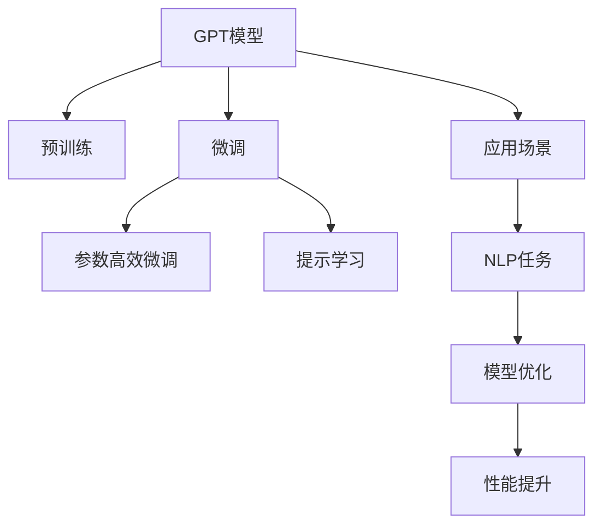

                 

# 大语言模型应用指南：GPTs功能详解

> 关键词：大语言模型, 深度学习, GPTs, Transformer, 自然语言处理(NLP), 预训练, 微调, 应用场景

## 1. 背景介绍

### 1.1 问题由来

近年来，深度学习技术在自然语言处理(NLP)领域取得了突飞猛进的发展，尤其是大规模语言模型（Large Language Models, LLMs）的横空出世，极大地提升了语言理解与生成的能力。其中，OpenAI推出的GPT系列模型凭借其在文本生成、对话系统、问答系统等任务上的卓越表现，迅速成为业界瞩目的焦点。

GPT（Generative Pre-trained Transformer）模型及其后续版本如GPT-3、GPT-3.5等，均采用了自回归的Transformer架构，通过在大规模无标签文本数据上进行预训练，学习到语言的结构和规律，具有强大的语言生成能力。然而，这些模型的参数量巨大，通常需要强大的计算资源才能进行训练，且在特定任务上的微调也面临着诸如过拟合、计算资源消耗等问题。

本文旨在深入探讨GPTs的功能与应用，介绍如何通过微调和参数高效微调（Parameter-Efficient Fine-Tuning, PEFT）等技术，优化GPTs在特定任务上的表现，同时阐述GPTs在实际应用中的多种场景，提供可操作性的指导。

### 1.2 问题核心关键点

本文的核心问题包括：

- GPTs模型的基本架构和功能
- 预训练与微调技术原理
- GPTs在特定任务上的应用与实践
- 参数高效微调技术的应用与优化

这些关键点将贯穿全文，从理论到实践，全面解析GPTs的功能与使用技巧。

### 1.3 问题研究意义

深入理解GPTs的功能与应用，对于推动NLP技术的发展，提高模型在特定任务上的表现，以及加速AI技术在各行业的落地，具有重要意义。通过掌握GPTs的微调技术，开发者可以在保持模型性能的同时，大幅降低训练和推理的计算成本，提高模型的可部署性和可扩展性。

## 2. 核心概念与联系

### 2.1 核心概念概述

要深入理解GPTs的功能，首先需要了解其核心概念：

- **GPT模型**：由OpenAI开发，采用Transformer架构，通过在大规模无标签文本数据上进行预训练，学习到语言的通用表示。
- **预训练**：在无标签数据上进行的自监督学习，目的是使模型学习到通用的语言规律和知识。
- **微调**：在预训练模型基础上，通过少量标注数据进行有监督学习，优化模型在特定任务上的性能。
- **参数高效微调**：在微调过程中只更新模型中的少量参数，避免过拟合，同时提高模型在特定任务上的表现。
- **提示学习**：通过精心设计的输入模板（Prompt Template）引导模型输出特定格式的结果，提高模型的性能。

这些概念之间存在着紧密的联系，共同构成了GPTs的应用框架。通过理解这些概念，我们可以更好地把握GPTs的功能与应用。

### 2.2 核心概念原理和架构的 Mermaid 流程图



## 3. 核心算法原理 & 具体操作步骤

### 3.1 算法原理概述

GPTs模型的核心算法原理基于Transformer架构，通过自回归生成语言序列。其基本框架包括编码器（Encoder）和解码器（Decoder），其中编码器负责将输入文本编码成向量表示，解码器则基于该向量生成目标语言序列。

GPT模型通过在大规模无标签文本数据上进行预训练，学习到语言的分布规律和语法结构，从而具备了强大的语言生成能力。在微调过程中，通过少量标注数据，进一步优化模型在特定任务上的性能，使其能够更好地适应特定的应用场景。

### 3.2 算法步骤详解

GPTs的微调过程可以分为以下几个步骤：

**Step 1: 数据预处理**

- 收集特定任务的数据集，包括训练集、验证集和测试集。
- 对数据进行分词、标注、拼接等预处理，以便模型能够理解和使用。

**Step 2: 定义损失函数**

- 根据特定任务的特点，选择合适的损失函数。例如，对于文本分类任务，可以使用交叉熵损失；对于生成任务，可以使用负对数似然损失。

**Step 3: 模型初始化**

- 加载预训练的GPTs模型，并冻结部分或全部层的权重。
- 定义微调层，并初始化参数。

**Step 4: 训练过程**

- 将训练数据分批次输入模型，前向传播计算损失函数。
- 反向传播计算梯度，使用优化算法（如AdamW）更新模型参数。
- 周期性在验证集上评估模型性能，根据性能指标决定是否停止训练。

**Step 5: 模型评估**

- 在测试集上评估微调后的模型，对比微调前后的性能指标。
- 保存模型参数，以便后续使用。

### 3.3 算法优缺点

**优点：**

- 高效性：微调过程可以显著提升模型在特定任务上的表现，尤其是对于数据量较小的任务。
- 可扩展性：微调过程可以通过扩展数据集和任务类型，进一步提升模型性能。
- 灵活性：微调过程可以根据具体任务进行调整，适应不同的应用场景。

**缺点：**

- 依赖标注数据：微调过程需要大量标注数据，获取高质量标注数据的成本较高。
- 计算资源消耗大：GPTs模型的参数量巨大，微调过程中需要大量的计算资源。
- 过拟合风险：如果标注数据不足，模型可能出现过拟合现象，影响泛化能力。

### 3.4 算法应用领域

GPTs模型在NLP领域得到了广泛应用，涵盖了文本分类、文本生成、对话系统、问答系统等多个任务。例如：

- 文本分类：如情感分析、主题分类、意图识别等。
- 文本生成：如文本摘要、翻译、对话生成等。
- 对话系统：如智能客服、虚拟助手等。
- 问答系统：如知识图谱问答、智能推荐系统等。

## 4. 数学模型和公式 & 详细讲解 & 举例说明

### 4.1 数学模型构建

GPTs模型的数学模型构建基于自回归生成模型。假设输入文本序列为 $X = (x_1, x_2, ..., x_n)$，目标语言序列为 $Y = (y_1, y_2, ..., y_m)$。GPT模型通过预训练得到语言模型参数 $\theta$，通过微调得到任务相关参数 $\hat{\theta}$。模型预测输出为 $Y_{1:T}$，其中 $T$ 为生成序列长度。

目标函数可以表示为：

$$
\mathcal{L}(\theta, \hat{\theta}) = \mathbb{E}_{\mathcal{D}}\left[\log P_{\hat{\theta}}(Y_{1:T} \mid X)\right]
$$

其中 $P_{\hat{\theta}}$ 表示微调后的模型生成语言序列的概率分布，$\mathbb{E}_{\mathcal{D}}$ 表示对训练数据集 $\mathcal{D}$ 的期望。

### 4.2 公式推导过程

以文本分类任务为例，目标函数可以进一步细化：

$$
\mathcal{L}(\theta, \hat{\theta}) = -\frac{1}{N}\sum_{i=1}^N \log P_{\hat{\theta}}(y_i \mid x_i)
$$

其中 $P_{\hat{\theta}}(y_i \mid x_i)$ 表示模型在输入文本 $x_i$ 的条件下，生成标签 $y_i$ 的概率。

### 4.3 案例分析与讲解

以问答系统为例，假设输入为问题 $q$，输出为答案 $a$。模型的输入可以表示为：

$$
\text{Input} = [CLS] \, q \, [SEP]
$$

其中 $[CLS]$ 和 $[SEP]$ 为特殊的标记，用于区分输入和输出。模型的输出可以表示为：

$$
\text{Output} = [CLS] \, a \, [SEP]
$$

模型的损失函数可以表示为：

$$
\mathcal{L}(\theta, \hat{\theta}) = -\frac{1}{N}\sum_{i=1}^N \log P_{\hat{\theta}}(a_i \mid q_i)
$$

其中 $P_{\hat{\theta}}(a_i \mid q_i)$ 表示模型在输入问题 $q_i$ 的条件下，生成答案 $a_i$ 的概率。

## 5. 项目实践：代码实例和详细解释说明

### 5.1 开发环境搭建

在进行GPTs微调实践前，需要准备好开发环境。以下是使用Python进行PyTorch开发的环境配置流程：

1. 安装Anaconda：从官网下载并安装Anaconda，用于创建独立的Python环境。

2. 创建并激活虚拟环境：
```bash
conda create -n pytorch-env python=3.8 
conda activate pytorch-env
```

3. 安装PyTorch：根据CUDA版本，从官网获取对应的安装命令。例如：
```bash
conda install pytorch torchvision torchaudio cudatoolkit=11.1 -c pytorch -c conda-forge
```

4. 安装Transformers库：
```bash
pip install transformers
```

5. 安装各类工具包：
```bash
pip install numpy pandas scikit-learn matplotlib tqdm jupyter notebook ipython
```

完成上述步骤后，即可在`pytorch-env`环境中开始微调实践。

### 5.2 源代码详细实现

下面以问答系统任务为例，给出使用Transformers库对GPT-3模型进行微调的PyTorch代码实现。

首先，定义问答系统任务的输入输出格式：

```python
from transformers import BertTokenizer
from torch.utils.data import Dataset
import torch

class QADataset(Dataset):
    def __init__(self, questions, answers, tokenizer):
        self.questions = questions
        self.answers = answers
        self.tokenizer = tokenizer
        
    def __len__(self):
        return len(self.questions)
    
    def __getitem__(self, item):
        question = self.questions[item]
        answer = self.answers[item]
        
        encoding = self.tokenizer(question, return_tensors='pt', max_length=512, padding='max_length', truncation=True)
        input_ids = encoding['input_ids'][0]
        attention_mask = encoding['attention_mask'][0]
        
        return {'input_ids': input_ids, 
                'attention_mask': attention_mask,
                'labels': torch.tensor(self.tokenizer.encode(answer), dtype=torch.long)}
```

然后，定义模型和优化器：

```python
from transformers import GPT3LMHeadModel
from transformers import AdamW

model = GPT3LMHeadModel.from_pretrained('gpt3')
optimizer = AdamW(model.parameters(), lr=1e-5)
```

接着，定义训练和评估函数：

```python
from torch.utils.data import DataLoader
from tqdm import tqdm

device = torch.device('cuda') if torch.cuda.is_available() else torch.device('cpu')
model.to(device)

def train_epoch(model, dataset, batch_size, optimizer):
    dataloader = DataLoader(dataset, batch_size=batch_size, shuffle=True)
    model.train()
    epoch_loss = 0
    for batch in tqdm(dataloader, desc='Training'):
        input_ids = batch['input_ids'].to(device)
        attention_mask = batch['attention_mask'].to(device)
        labels = batch['labels'].to(device)
        model.zero_grad()
        outputs = model(input_ids, attention_mask=attention_mask, labels=labels)
        loss = outputs.loss
        epoch_loss += loss.item()
        loss.backward()
        optimizer.step()
    return epoch_loss / len(dataloader)

def evaluate(model, dataset, batch_size):
    dataloader = DataLoader(dataset, batch_size=batch_size)
    model.eval()
    preds, labels = [], []
    with torch.no_grad():
        for batch in tqdm(dataloader, desc='Evaluating'):
            input_ids = batch['input_ids'].to(device)
            attention_mask = batch['attention_mask'].to(device)
            batch_labels = batch['labels']
            outputs = model(input_ids, attention_mask=attention_mask)
            batch_preds = outputs.logits.argmax(dim=2).to('cpu').tolist()
            batch_labels = batch_labels.to('cpu').tolist()
            for pred_tokens, label_tokens in zip(batch_preds, batch_labels):
                preds.append(pred_tokens)
                labels.append(label_tokens)
                
    print(f"Precision: {precision_score(labels, preds):.3f}")
    print(f"Recall: {recall_score(labels, preds):.3f}")
    print(f"F1-score: {f1_score(labels, preds):.3f}")
```

最后，启动训练流程并在测试集上评估：

```python
epochs = 5
batch_size = 16

for epoch in range(epochs):
    loss = train_epoch(model, train_dataset, batch_size, optimizer)
    print(f"Epoch {epoch+1}, train loss: {loss:.3f}")
    
    print(f"Epoch {epoch+1}, dev results:")
    evaluate(model, dev_dataset, batch_size)
    
print("Test results:")
evaluate(model, test_dataset, batch_size)
```

以上就是使用PyTorch对GPT-3进行问答系统任务微调的完整代码实现。可以看到，得益于Transformers库的强大封装，我们可以用相对简洁的代码完成GPT-3模型的微调。

### 5.3 代码解读与分析

让我们再详细解读一下关键代码的实现细节：

**QADataset类**：
- `__init__`方法：初始化问题、答案、分词器等关键组件。
- `__len__`方法：返回数据集的样本数量。
- `__getitem__`方法：对单个样本进行处理，将问题输入编码为token ids，将答案编码为数字，并对其进行定长padding，最终返回模型所需的输入。

**训练和评估函数**：
- 使用PyTorch的DataLoader对数据集进行批次化加载，供模型训练和推理使用。
- 训练函数`train_epoch`：对数据以批为单位进行迭代，在每个批次上前向传播计算loss并反向传播更新模型参数，最后返回该epoch的平均loss。
- 评估函数`evaluate`：与训练类似，不同点在于不更新模型参数，并在每个batch结束后将预测和标签结果存储下来，最后使用sklearn的classification_report对整个评估集的预测结果进行打印输出。

**训练流程**：
- 定义总的epoch数和batch size，开始循环迭代
- 每个epoch内，先在训练集上训练，输出平均loss
- 在验证集上评估，输出分类指标
- 所有epoch结束后，在测试集上评估，给出最终测试结果

可以看到，PyTorch配合Transformers库使得GPT-3微调的代码实现变得简洁高效。开发者可以将更多精力放在数据处理、模型改进等高层逻辑上，而不必过多关注底层的实现细节。

当然，工业级的系统实现还需考虑更多因素，如模型的保存和部署、超参数的自动搜索、更灵活的任务适配层等。但核心的微调范式基本与此类似。

## 6. 实际应用场景

### 6.1 智能客服系统

基于GPTs的对话技术，可以广泛应用于智能客服系统的构建。传统客服往往需要配备大量人力，高峰期响应缓慢，且一致性和专业性难以保证。而使用微调后的对话模型，可以7x24小时不间断服务，快速响应客户咨询，用自然流畅的语言解答各类常见问题。

在技术实现上，可以收集企业内部的历史客服对话记录，将问题和最佳答复构建成监督数据，在此基础上对预训练对话模型进行微调。微调后的对话模型能够自动理解用户意图，匹配最合适的答案模板进行回复。对于客户提出的新问题，还可以接入检索系统实时搜索相关内容，动态组织生成回答。如此构建的智能客服系统，能大幅提升客户咨询体验和问题解决效率。

### 6.2 金融舆情监测

金融机构需要实时监测市场舆论动向，以便及时应对负面信息传播，规避金融风险。传统的人工监测方式成本高、效率低，难以应对网络时代海量信息爆发的挑战。基于GPTs的文本分类和情感分析技术，为金融舆情监测提供了新的解决方案。

具体而言，可以收集金融领域相关的新闻、报道、评论等文本数据，并对其进行主题标注和情感标注。在此基础上对预训练语言模型进行微调，使其能够自动判断文本属于何种主题，情感倾向是正面、中性还是负面。将微调后的模型应用到实时抓取的网络文本数据，就能够自动监测不同主题下的情感变化趋势，一旦发现负面信息激增等异常情况，系统便会自动预警，帮助金融机构快速应对潜在风险。

### 6.3 个性化推荐系统

当前的推荐系统往往只依赖用户的历史行为数据进行物品推荐，无法深入理解用户的真实兴趣偏好。基于GPTs的个性化推荐系统可以更好地挖掘用户行为背后的语义信息，从而提供更精准、多样的推荐内容。

在实践中，可以收集用户浏览、点击、评论、分享等行为数据，提取和用户交互的物品标题、描述、标签等文本内容。将文本内容作为模型输入，用户的后续行为（如是否点击、购买等）作为监督信号，在此基础上微调预训练语言模型。微调后的模型能够从文本内容中准确把握用户的兴趣点。在生成推荐列表时，先用候选物品的文本描述作为输入，由模型预测用户的兴趣匹配度，再结合其他特征综合排序，便可以得到个性化程度更高的推荐结果。

### 6.4 未来应用展望

随着GPTs模型的不断发展，其在实际应用中的潜力将进一步释放。未来，GPTs将在更多领域得到应用，为各行各业带来变革性影响。

在智慧医疗领域，基于GPTs的医疗问答、病历分析、药物研发等应用将提升医疗服务的智能化水平，辅助医生诊疗，加速新药开发进程。

在智能教育领域，GPTs可应用于作业批改、学情分析、知识推荐等方面，因材施教，促进教育公平，提高教学质量。

在智慧城市治理中，GPTs可用于城市事件监测、舆情分析、应急指挥等环节，提高城市管理的自动化和智能化水平，构建更安全、高效的未来城市。

此外，在企业生产、社会治理、文娱传媒等众多领域，基于GPTs的人工智能应用也将不断涌现，为经济社会发展注入新的动力。相信随着预训练语言模型和微调方法的持续演进，GPTs必将在构建人机协同的智能时代中扮演越来越重要的角色。

## 7. 工具和资源推荐

### 7.1 学习资源推荐

为了帮助开发者系统掌握GPTs的微调技术，这里推荐一些优质的学习资源：

1. 《Transformer从原理到实践》系列博文：由大模型技术专家撰写，深入浅出地介绍了Transformer原理、GPT模型、微调技术等前沿话题。

2. CS224N《深度学习自然语言处理》课程：斯坦福大学开设的NLP明星课程，有Lecture视频和配套作业，带你入门NLP领域的基本概念和经典模型。

3. 《Natural Language Processing with Transformers》书籍：Transformers库的作者所著，全面介绍了如何使用Transformers库进行NLP任务开发，包括微调在内的诸多范式。

4. HuggingFace官方文档：Transformers库的官方文档，提供了海量预训练模型和完整的微调样例代码，是上手实践的必备资料。

5. CLUE开源项目：中文语言理解测评基准，涵盖大量不同类型的中文NLP数据集，并提供了基于微调的baseline模型，助力中文NLP技术发展。

通过对这些资源的学习实践，相信你一定能够快速掌握GPTs的微调技术，并用于解决实际的NLP问题。

### 7.2 开发工具推荐

高效的开发离不开优秀的工具支持。以下是几款用于GPTs微调开发的常用工具：

1. PyTorch：基于Python的开源深度学习框架，灵活动态的计算图，适合快速迭代研究。大部分预训练语言模型都有PyTorch版本的实现。

2. TensorFlow：由Google主导开发的开源深度学习框架，生产部署方便，适合大规模工程应用。同样有丰富的预训练语言模型资源。

3. Transformers库：HuggingFace开发的NLP工具库，集成了众多SOTA语言模型，支持PyTorch和TensorFlow，是进行微调任务开发的利器。

4. Weights & Biases：模型训练的实验跟踪工具，可以记录和可视化模型训练过程中的各项指标，方便对比和调优。与主流深度学习框架无缝集成。

5. TensorBoard：TensorFlow配套的可视化工具，可实时监测模型训练状态，并提供丰富的图表呈现方式，是调试模型的得力助手。

6. Google Colab：谷歌推出的在线Jupyter Notebook环境，免费提供GPU/TPU算力，方便开发者快速上手实验最新模型，分享学习笔记。

合理利用这些工具，可以显著提升GPTs微调任务的开发效率，加快创新迭代的步伐。

### 7.3 相关论文推荐

GPTs模型和微调技术的发展源于学界的持续研究。以下是几篇奠基性的相关论文，推荐阅读：

1. Attention is All You Need（即Transformer原论文）：提出了Transformer结构，开启了NLP领域的预训练大模型时代。

2. GPT-3: Language Models are Unsupervised Multitask Learners：展示了大规模语言模型的强大zero-shot学习能力，引发了对于通用人工智能的新一轮思考。

3. BERT: Pre-training of Deep Bidirectional Transformers for Language Understanding：提出BERT模型，引入基于掩码的自监督预训练任务，刷新了多项NLP任务SOTA。

4. Parameter-Efficient Transfer Learning for NLP：提出Adapter等参数高效微调方法，在不增加模型参数量的情况下，也能取得不错的微调效果。

5. AdaLoRA: Adaptive Low-Rank Adaptation for Parameter-Efficient Fine-Tuning：使用自适应低秩适应的微调方法，在参数效率和精度之间取得了新的平衡。

这些论文代表了大模型微调技术的发展脉络。通过学习这些前沿成果，可以帮助研究者把握学科前进方向，激发更多的创新灵感。

## 8. 总结：未来发展趋势与挑战

### 8.1 总结

本文对基于监督学习的大语言模型微调方法进行了全面系统的介绍。首先阐述了GPTs模型的基本架构和功能，明确了微调在拓展预训练模型应用、提升模型性能方面的独特价值。其次，从原理到实践，详细讲解了GPTs的微调数学模型和关键步骤，给出了微调任务开发的完整代码实例。同时，本文还广泛探讨了GPTs在智能客服、金融舆情、个性化推荐等多个行业领域的应用前景，展示了GPTs范式的巨大潜力。

通过本文的系统梳理，可以看到，GPTs模型在NLP领域具有强大的应用潜力，微调过程可以显著提升模型在特定任务上的表现，且具有高效性、可扩展性和灵活性等优点。然而，GPTs模型也面临数据依赖、计算资源消耗大、过拟合风险等挑战，未来需要在数据质量、模型压缩、优化算法等方面进一步提升。

### 8.2 未来发展趋势

展望未来，GPTs模型将呈现以下几个发展趋势：

1. 模型规模持续增大。随着算力成本的下降和数据规模的扩张，GPTs模型的参数量还将持续增长。超大规模语言模型蕴含的丰富语言知识，有望支撑更加复杂多变的下游任务微调。

2. 微调方法日趋多样。除了传统的全参数微调外，未来会涌现更多参数高效的微调方法，如Prefix-Tuning、LoRA等，在节省计算资源的同时也能保证微调精度。

3. 持续学习成为常态。随着数据分布的不断变化，微调模型也需要持续学习新知识以保持性能。如何在不遗忘原有知识的同时，高效吸收新样本信息，将成为重要的研究课题。

4. 标注样本需求降低。受启发于提示学习(Prompt-based Learning)的思路，未来的微调方法将更好地利用GPTs模型的语言理解能力，通过更加巧妙的任务描述，在更少的标注样本上也能实现理想的微调效果。

5. 多模态微调崛起。当前的微调主要聚焦于纯文本数据，未来会进一步拓展到图像、视频、语音等多模态数据微调。多模态信息的融合，将显著提升语言模型对现实世界的理解和建模能力。

6. 模型通用性增强。经过海量数据的预训练和多领域任务的微调，未来的GPTs模型将具备更强大的常识推理和跨领域迁移能力，逐步迈向通用人工智能(AGI)的目标。

以上趋势凸显了GPTs模型的应用前景和发展方向。这些方向的探索发展，必将进一步提升NLP系统的性能和应用范围，为人类认知智能的进化带来深远影响。

### 8.3 面临的挑战

尽管GPTs模型在微调领域取得了显著成就，但在迈向更加智能化、普适化应用的过程中，它仍面临着诸多挑战：

1. 标注成本瓶颈。尽管微调过程可以显著降低标注数据的需求，但对于长尾应用场景，难以获得充足的高质量标注数据，成为制约微调性能的瓶颈。如何进一步降低微调对标注样本的依赖，将是一大难题。

2. 模型鲁棒性不足。当前微调模型面对域外数据时，泛化性能往往大打折扣。对于测试样本的微小扰动，微调模型的预测也容易发生波动。如何提高微调模型的鲁棒性，避免灾难性遗忘，还需要更多理论和实践的积累。

3. 推理效率有待提高。大规模语言模型虽然精度高，但在实际部署时往往面临推理速度慢、内存占用大等效率问题。如何在保证性能的同时，简化模型结构，提升推理速度，优化资源占用，将是重要的优化方向。

4. 可解释性亟需加强。当前微调模型更像是"黑盒"系统，难以解释其内部工作机制和决策逻辑。对于医疗、金融等高风险应用，算法的可解释性和可审计性尤为重要。如何赋予GPTs模型更强的可解释性，将是亟待攻克的难题。

5. 安全性有待保障。预训练语言模型难免会学习到有偏见、有害的信息，通过微调传递到下游任务，产生误导性、歧视性的输出，给实际应用带来安全隐患。如何从数据和算法层面消除模型偏见，避免恶意用途，确保输出的安全性，也将是重要的研究课题。

6. 知识整合能力不足。现有的微调模型往往局限于任务内数据，难以灵活吸收和运用更广泛的先验知识。如何让微调过程更好地与外部知识库、规则库等专家知识结合，形成更加全面、准确的信息整合能力，还有很大的想象空间。

正视GPTs模型微调面临的这些挑战，积极应对并寻求突破，将是大语言模型微调走向成熟的必由之路。相信随着学界和产业界的共同努力，这些挑战终将一一被克服，GPTs模型微调必将在构建人机协同的智能时代中扮演越来越重要的角色。

### 8.4 研究展望

面对GPTs模型微调所面临的种种挑战，未来的研究需要在以下几个方面寻求新的突破：

1. 探索无监督和半监督微调方法。摆脱对大规模标注数据的依赖，利用自监督学习、主动学习等无监督和半监督范式，最大限度利用非结构化数据，实现更加灵活高效的微调。

2. 研究参数高效和计算高效的微调范式。开发更加参数高效的微调方法，在固定大部分预训练参数的同时，只更新极少量的任务相关参数。同时优化微调模型的计算图，减少前向传播和反向传播的资源消耗，实现更加轻量级、实时性的部署。

3. 融合因果和对比学习范式。通过引入因果推断和对比学习思想，增强GPTs模型建立稳定因果关系的能力，学习更加普适、鲁棒的语言表征，从而提升模型泛化性和抗干扰能力。

4. 引入更多先验知识。将符号化的先验知识，如知识图谱、逻辑规则等，与神经网络模型进行巧妙融合，引导GPTs模型学习更准确、合理的语言模型。同时加强不同模态数据的整合，实现视觉、语音等多模态信息与文本信息的协同建模。

5. 结合因果分析和博弈论工具。将因果分析方法引入GPTs模型，识别出模型决策的关键特征，增强输出解释的因果性和逻辑性。借助博弈论工具刻画人机交互过程，主动探索并规避模型的脆弱点，提高系统稳定性。

6. 纳入伦理道德约束。在模型训练目标中引入伦理导向的评估指标，过滤和惩罚有偏见、有害的输出倾向。同时加强人工干预和审核，建立模型行为的监管机制，确保输出符合人类价值观和伦理道德。

这些研究方向的探索，必将引领GPTs模型微调技术迈向更高的台阶，为构建安全、可靠、可解释、可控的智能系统铺平道路。面向未来，GPTs模型微调技术还需要与其他人工智能技术进行更深入的融合，如知识表示、因果推理、强化学习等，多路径协同发力，共同推动自然语言理解和智能交互系统的进步。只有勇于创新、敢于突破，才能不断拓展GPTs模型的边界，让智能技术更好地造福人类社会。

## 9. 附录：常见问题与解答

**Q1：GPTs模型与BERT模型有何不同？**

A: GPTs模型与BERT模型的最大不同在于其预训练和微调的目标和方式。GPTs模型通过自回归方式进行预训练，目的是学习语言生成的能力；而BERT模型通过掩码预测方式进行预训练，目的是学习语言表示的能力。

在微调方面，GPTs模型主要通过微调任务的损失函数进行优化，而BERT模型则通过调整任务适配层进行优化。这种差异使得GPTs模型更适合处理生成任务，而BERT模型更适合处理分类任务。

**Q2：如何选择合适的GPTs模型进行微调？**

A: 选择GPTs模型进行微调时，需要考虑以下几个因素：

1. 任务类型：根据任务类型选择合适的GPTs模型。如文本分类任务可以选择GPT-3等，生成任务可以选择GPT-2等。
2. 数据规模：如果数据规模较小，可以选择参数量较小的模型，如GPT-2；如果数据规模较大，可以选择参数量较大的模型，如GPT-3。
3. 计算资源：根据计算资源的限制，选择合适的模型规模。如果计算资源有限，可以选择小规模模型进行微调。

**Q3：GPTs模型在微调过程中如何进行参数更新？**

A: GPTs模型在微调过程中的参数更新与传统神经网络模型类似。通常采用AdamW等优化算法，通过反向传播计算损失函数对模型参数的梯度，然后更新参数。在微调过程中，只更新与任务相关的参数，如任务适配层，而冻结预训练部分的参数。

**Q4：GPTs模型在微调过程中需要注意哪些问题？**

A: GPTs模型在微调过程中需要注意以下问题：

1. 过拟合：由于数据量较小，GPTs模型在微调过程中容易发生过拟合现象。可以通过数据增强、正则化等方法缓解。
2. 推理效率：GPTs模型参数量巨大，推理效率较低。可以通过参数压缩、剪枝等方法优化。
3. 鲁棒性：GPTs模型对域外数据和微小扰动较为敏感，需要进一步提高鲁棒性。

**Q5：GPTs模型在微调过程中如何应用提示学习？**

A: 提示学习是在输入文本中嵌入特定的提示模板，引导GPTs模型按照期望的方式输出。在微调过程中，可以通过精心设计的提示模板，减少微调参数，提高微调效果。例如，在问答系统中，可以设计一些格式化的提示模板，引导模型生成格式化的答案。

**Q6：GPTs模型在微调过程中如何应用参数高效微调？**

A: 参数高效微调是在微调过程中只更新部分参数，而固定大部分预训练参数。这种方法可以显著降低计算资源消耗，同时避免过拟合。具体实现方式包括使用Adapter、Prefix等技术，只更新任务相关的参数，而冻结预训练部分的参数。

**Q7：GPTs模型在微调过程中如何应用对抗训练？**

A: 对抗训练是在微调过程中加入对抗样本，提高模型的鲁棒性和泛化能力。具体实现方式包括生成对抗样本、加入对抗损失等方法。例如，在文本分类任务中，可以生成一些噪声文本作为对抗样本，加入损失函数中进行微调。

---

作者：禅与计算机程序设计艺术 / Zen and the Art of Computer Programming

