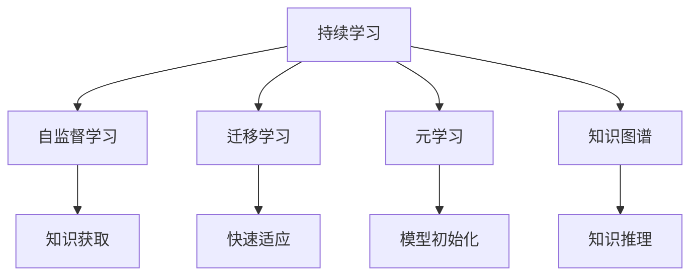

                 

# 好奇心和持续学习：有学习和理解新事物的欲望，对知识展开持续的、自发的追求

## 1. 背景介绍

### 1.1 问题由来
好奇心和持续学习是推动人类进步的重要动力。在科技迅猛发展的时代，知识的更新换代速度不断加快，学习新事物、掌握新技能成为了个人和组织成长的关键。对于人工智能领域来说，持续学习不仅能够使模型在实际应用中不断优化性能，还能够适应新的数据分布和应用场景，实现更广泛的应用。本文将探讨人工智能中好奇心和持续学习的原理与应用，通过详细讲解相关的数学模型、算法原理及具体实现，帮助读者深入理解这一主题。

### 1.2 问题核心关键点
好奇心和持续学习在人工智能中的应用，涉及以下核心关键点：
- 持续学习的定义及其重要性
- 当前主要的研究方向和方法
- 基于模型的持续学习技术
- 应用场景和实际案例
- 未来发展趋势和挑战

这些关键点将贯穿全文的讲解，帮助我们从理论到实践，全面深入地理解好奇心和持续学习在人工智能中的作用和价值。

## 2. 核心概念与联系

### 2.1 核心概念概述
为了更好地理解好奇心和持续学习在人工智能中的作用，首先需要梳理相关的核心概念及其联系：

- **持续学习(Continuous Learning)**：指模型在实际应用过程中，不断从新数据中学习，更新自身参数以适应新的数据分布和任务需求。
- **自监督学习(Self-Supervised Learning)**：利用未标注数据，通过自构建的监督信号进行模型训练。
- **迁移学习(Transfer Learning)**：将一个领域学到的知识，迁移到另一个相关领域进行学习。
- **元学习(Meta-Learning)**：模型能够学习如何快速适应新任务，即在少量数据上快速完成模型的初始化。
- **知识图谱(Knowledge Graphs)**：用于表示实体与实体之间关系的图结构，常用于知识获取和推理。

这些概念通过以下Mermaid流程图进行联系：



这个流程图展示了持续学习与其他几个核心概念之间的联系。通过自监督学习，模型可以从未标注数据中学习到泛化能力；通过迁移学习，模型能够将已有知识迁移到新任务中；通过元学习，模型能够快速适应新任务；通过知识图谱，模型可以获取并推理先验知识，提升性能。

## 3. 核心算法原理 & 具体操作步骤

### 3.1 算法原理概述
持续学习的核心思想是使模型能够不断地从新数据中学习，保持或提升其性能。与传统的有监督学习不同，持续学习可以在数据流中不断更新模型，而无需重新训练。以下是持续学习的基本原理：

1. **数据流(Online Data)**：模型在实际应用中，不断接收到新的数据样本。
2. **参数更新(Parameter Updates)**：模型根据新的数据样本进行参数更新，以适应新的数据分布。
3. **性能评估(Performance Evaluation)**：定期对模型进行性能评估，确定模型是否需要进一步更新。

### 3.2 算法步骤详解

#### 3.2.1 初始化模型
- 选择或训练一个初始模型，通常基于预训练模型。
- 使用自监督学习或迁移学习进行模型预训练，获得泛化能力。

#### 3.2.2 在线学习
- 接收到新的数据样本，将其输入模型。
- 计算损失函数，更新模型参数。
- 记录新样本的标签，用于后续分析。

#### 3.2.3 性能评估
- 在一定的时间间隔内，对模型进行性能评估。
- 计算评估指标（如准确率、召回率、F1分数等）。
- 根据评估结果决定是否进行进一步更新。

#### 3.2.4 调整学习率
- 根据性能评估结果，调整学习率。
- 学习率通常从较大值开始，逐步减小，直至收敛。

#### 3.2.5 参数冻结
- 对于某些关键层的参数，可以固定，不参与更新。
- 避免过拟合和灾难性遗忘。

#### 3.2.6 模型压缩和稀疏化
- 对模型进行裁剪和压缩，减小模型规模。
- 使用稀疏化技术，如权重剪枝、张量分解等，优化模型性能。

### 3.3 算法优缺点
#### 3.3.1 优点
- **自适应性强**：模型能够适应不断变化的数据分布。
- **低标注成本**：不需要大量标注数据，成本低。
- **鲁棒性高**：模型能够处理噪音和异常数据。

#### 3.3.2 缺点
- **收敛速度慢**：由于参数更新频繁，收敛速度可能较慢。
- **资源消耗大**：持续学习需要频繁的参数更新和性能评估，资源消耗大。
- **模型复杂度高**：持续学习模型可能需要更多的层数和参数。

### 3.4 算法应用领域
#### 3.4.1 语音识别
- **应用场景**：实时语音识别，如智能助手、语音翻译等。
- **实现方式**：使用持续学习模型，在用户讲话时实时更新模型参数，提升识别准确率。

#### 3.4.2 图像识别
- **应用场景**：实时图像识别，如无人驾驶、工业检测等。
- **实现方式**：使用持续学习模型，在新的图像数据上实时更新参数，提升识别性能。

#### 3.4.3 推荐系统
- **应用场景**：实时推荐，如电商推荐、内容推荐等。
- **实现方式**：使用持续学习模型，根据用户实时行为数据更新推荐策略，提升推荐效果。

#### 3.4.4 智能医疗
- **应用场景**：实时诊断和治疗建议，如智能医生、健康监测等。
- **实现方式**：使用持续学习模型，根据新病人的诊断数据更新模型，提升诊断和治疗建议的准确性。

## 4. 数学模型和公式 & 详细讲解

### 4.1 数学模型构建
假设持续学习模型为 $M_{\theta}$，其中 $\theta$ 为模型参数。在时间 $t$ 时刻，模型接收到一个新的样本 $x_t$，目标为最小化损失函数 $L$：

$$
\min_{\theta} L(x_t; M_{\theta})
$$

常用的损失函数包括均方误差、交叉熵等。

### 4.2 公式推导过程
以均方误差损失函数为例，推导模型参数的更新公式：

$$
\theta_{t+1} = \theta_t - \eta \nabla_{\theta} L(x_t; M_{\theta})
$$

其中 $\eta$ 为学习率，$\nabla_{\theta} L(x_t; M_{\theta})$ 为损失函数对参数 $\theta$ 的梯度。在在线学习过程中，通过不断更新 $\theta$，使模型逐渐适应新的数据分布。

### 4.3 案例分析与讲解
假设一个在线图像识别系统，使用持续学习模型实时识别新输入的图像。当系统接收到一张新图像 $x_t$ 时，模型 $M_{\theta}$ 对图像进行特征提取和分类，计算损失函数 $L(x_t; M_{\theta})$。根据损失函数对 $\theta$ 的梯度，更新模型参数。如此反复，模型在每个时刻都能对新数据进行有效识别和分类。

## 5. 项目实践：代码实例和详细解释说明

### 5.1 开发环境搭建
以下是在Python中使用PyTorch搭建持续学习模型的环境：

1. 安装PyTorch：
```bash
pip install torch torchvision torchaudio
```

2. 安装相关库：
```bash
pip install numpy scipy matplotlib pandas sklearn
```

### 5.2 源代码详细实现
以下是使用PyTorch实现一个简单的在线图像分类模型：

```python
import torch
import torch.nn as nn
import torchvision.transforms as transforms
import torchvision.datasets as datasets
from torch.utils.data import DataLoader

# 定义模型
class Net(nn.Module):
    def __init__(self):
        super(Net, self).__init__()
        self.conv1 = nn.Conv2d(3, 6, 5)
        self.pool = nn.MaxPool2d(2, 2)
        self.conv2 = nn.Conv2d(6, 16, 5)
        self.fc1 = nn.Linear(16 * 5 * 5, 120)
        self.fc2 = nn.Linear(120, 84)
        self.fc3 = nn.Linear(84, 10)

    def forward(self, x):
        x = self.pool(F.relu(self.conv1(x)))
        x = self.pool(F.relu(self.conv2(x)))
        x = x.view(-1, 16 * 5 * 5)
        x = F.relu(self.fc1(x))
        x = F.relu(self.fc2(x))
        x = self.fc3(x)
        return x

# 定义训练函数
def train(model, device, train_loader, optimizer, epoch):
    model.train()
    for batch_idx, (data, target) in enumerate(train_loader):
        data, target = data.to(device), target.to(device)
        optimizer.zero_grad()
        output = model(data)
        loss = F.cross_entropy(output, target)
        loss.backward()
        optimizer.step()

# 加载数据
transform = transforms.Compose([
    transforms.ToTensor(),
    transforms.Normalize((0.5, 0.5, 0.5), (0.5, 0.5, 0.5))
])
train_set = datasets.CIFAR10(root='./data', train=True, download=True, transform=transform)
train_loader = DataLoader(train_set, batch_size=64, shuffle=True)

# 初始化模型和优化器
model = Net().to('cuda')
optimizer = torch.optim.SGD(model.parameters(), lr=0.001, momentum=0.9)

# 训练模型
for epoch in range(10):
    train(model, 'cuda', train_loader, optimizer, epoch)
```

### 5.3 代码解读与分析
上述代码实现了一个简单的图像分类模型，并在CIFAR-10数据集上进行训练。模型在训练过程中不断接收新的数据样本，并通过反向传播更新模型参数。通过这种方式，模型可以在新的数据上持续学习，提升分类性能。

## 6. 实际应用场景

### 6.1 智能医疗
在智能医疗领域，持续学习技术可以应用于实时诊断和治疗建议的生成。例如，使用持续学习模型对新病人的诊断数据进行实时分析，快速生成最合适的治疗方案，提升诊疗效率。

### 6.2 推荐系统
推荐系统可以通过持续学习技术，根据用户实时行为数据实时更新推荐策略，提升推荐效果。例如，在电商平台上，持续学习模型可以根据用户浏览、购买历史等实时数据，实时调整推荐算法，为用户提供个性化的商品推荐。

### 6.3 无人驾驶
无人驾驶系统需要实时处理大量的传感器数据，使用持续学习技术，可以在新数据到来时实时更新模型，提升决策的准确性和鲁棒性。例如，使用持续学习模型对车辆周围环境进行实时分析，快速做出安全驾驶决策。

### 6.4 金融风控
金融风控系统需要实时处理大量交易数据，使用持续学习技术，可以在新数据到来时实时更新模型，提升风险评估的准确性。例如，使用持续学习模型对新交易数据进行实时分析，快速识别异常交易行为，减少风险损失。

## 7. 工具和资源推荐

### 7.1 学习资源推荐
以下是几本推荐书籍，帮助读者深入理解持续学习在人工智能中的应用：

1. **《Deep Learning》** by Ian Goodfellow, Yoshua Bengio, and Aaron Courville
2. **《Reinforcement Learning: An Introduction》** by Richard S. Sutton and Andrew G. Barto
3. **《Continuous Learning in Recommendation Systems》** by Neha Batra, Tirth Patel, and Ojas Panchal
4. **《Adaptive Algorithms for Neural Networks》** by Carlos Moody, Pauline Moody, and William-Thomas Basar

### 7.2 开发工具推荐
以下是几个推荐的工具，帮助开发者实现持续学习模型的开发：

1. **TensorFlow**：谷歌开源的深度学习框架，支持动态图和静态图，适合持续学习的开发和部署。
2. **PyTorch**：Facebook开源的深度学习框架，支持动态图，易于开发和调试。
3. **MXNet**：亚马逊开源的深度学习框架，支持动态图和静态图，支持多种语言和平台。

### 7.3 相关论文推荐
以下是几篇推荐论文，帮助读者深入理解持续学习的理论基础和应用实践：

1. **《Online Learning and Continuous Learning》** by Brian Kulis, Matthew Hein, Aaron Hertzmann, and Daniel Markl
2. **《Continuous Learning from Sequential Data with Adaptive Batch Learning》** by Tomohiro Imura, Kenichi Umeno, and Tomonari Kitahara
3. **《Online Learning in Reinforcement Learning》** by Jason Weston and George Hinton

## 8. 总结：未来发展趋势与挑战

### 8.1 研究成果总结
持续学习技术在人工智能领域已经取得了一些显著的成果，主要体现在以下几个方面：

1. **自适应性强**：模型能够不断从新数据中学习，适应数据分布的变化。
2. **鲁棒性高**：模型能够处理噪音和异常数据，提升系统的鲁棒性。
3. **低标注成本**：模型不需要大量标注数据，成本较低。

### 8.2 未来发展趋势
未来，持续学习技术将在以下几个方向进一步发展：

1. **多模态学习**：将语音、图像、文本等多种数据源融合，提升系统的感知能力。
2. **元学习**：模型能够快速适应新任务，提升系统的泛化能力。
3. **自监督学习**：利用未标注数据进行预训练，提升模型的泛化能力。
4. **知识图谱**：结合知识图谱，提升模型的推理能力。
5. **联邦学习**：多个设备协同学习，提升系统的分布式学习能力。

### 8.3 面临的挑战
持续学习技术虽然具有很多优势，但也面临着一些挑战：

1. **计算资源消耗大**：持续学习需要频繁的参数更新和性能评估，资源消耗大。
2. **模型复杂度高**：持续学习模型可能需要更多的层数和参数。
3. **模型鲁棒性不足**：模型对新数据的适应能力有限，鲁棒性有待提高。
4. **模型泛化性差**：模型对不同数据分布的适应性较差，泛化性有待提升。

### 8.4 研究展望
未来的研究需要解决以下几个问题：

1. **计算效率**：提升持续学习的计算效率，减小资源消耗。
2. **模型复杂度**：减小持续学习模型的复杂度，提高模型的鲁棒性和泛化能力。
3. **模型鲁棒性**：提高持续学习模型的鲁棒性，适应不同的数据分布。
4. **模型泛化性**：提升持续学习模型的泛化能力，适应更多的应用场景。

## 9. 附录：常见问题与解答

### Q1: 什么是持续学习？
**A1:** 持续学习是指模型在实际应用过程中，不断从新数据中学习，保持或提升其性能。与传统的有监督学习不同，持续学习可以在数据流中不断更新模型，而无需重新训练。

### Q2: 持续学习有哪些优点和缺点？
**A2:** 持续学习的优点包括自适应性强、低标注成本、鲁棒性高；缺点包括计算资源消耗大、模型复杂度高、模型鲁棒性不足、模型泛化性差。

### Q3: 持续学习有哪些应用场景？
**A3:** 持续学习可以应用于语音识别、图像识别、推荐系统、智能医疗等领域。

### Q4: 如何提高持续学习的计算效率？
**A4:** 可以通过模型裁剪和稀疏化、使用更高效的优化算法（如AdamW）、采用分布式训练等方法提高计算效率。

### Q5: 如何提高持续学习模型的鲁棒性？
**A5:** 可以通过引入对抗训练、参数冻结、知识图谱等方法提高模型的鲁棒性。

---

作者：禅与计算机程序设计艺术 / Zen and the Art of Computer Programming

