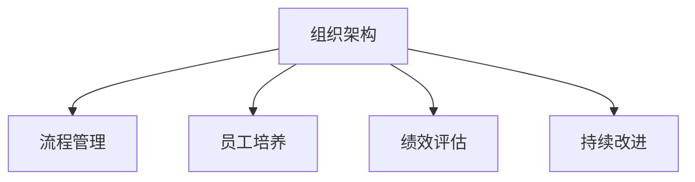

                 

# 好的管理者和普通管理者的差距：体系的重要性

> 关键词：管理体系, 组织架构, 流程管理, 员工培养, 绩效评估, 持续改进

## 1. 背景介绍

### 1.1 问题由来
在当今快速变化的商业环境中，企业的生存与发展越来越依赖于有效的管理。然而，尽管管理学的理论和实践已经发展了数百年，优秀管理者的稀缺性依然是一个普遍现象。许多企业在发展中遭遇瓶颈，而问题的关键往往不在于技术和产品，而在于管理体系的落后。好的管理者与普通管理者的差距，并不在于个体的能力差异，而在于是否具备一套完善的管理体系，能够支撑企业的长期发展。

### 1.2 问题核心关键点
管理体系是企业战略执行的基石，是组织高效运作的保障。好的管理体系能够明确企业的目标和方向，合理分配资源，激发员工潜力，持续提升绩效，从而实现企业的可持续发展。管理体系的核心包括：

- **组织架构**：定义企业的组织形式和层级结构，明确各个层级的职责和权限。
- **流程管理**：制定标准化的业务流程，提高工作效率和质量，减少浪费。
- **员工培养**：建立系统的培训和发展机制，提升员工的专业技能和综合素质。
- **绩效评估**：设计科学的评估体系，确保员工的工作表现与企业目标一致。
- **持续改进**：通过PDCA（Plan-Do-Check-Act）循环，不断优化管理体系，适应外部环境变化。

## 2. 核心概念与联系

### 2.1 核心概念概述

为更好地理解管理体系，本节将介绍几个密切相关的核心概念：

- **组织架构**：企业的组织形式和层级结构，通常分为职能型、矩阵型、项目型等多种类型。合理的组织架构能够确保信息流通顺畅，决策迅速，资源利用高效。

- **流程管理**：通过标准化流程，明确工作步骤和责任分工，提升工作效率和质量。流程管理包括流程设计、流程优化、流程监控等环节。

- **员工培养**：通过培训、考核、激励等手段，提升员工技能，激发工作热情，增强归属感和忠诚度。员工培养是企业长期发展的关键因素。

- **绩效评估**：通过定量和定性的方法，对员工的工作表现进行评估，确保目标达成，及时发现问题，进行改进。绩效评估的科学性直接影响企业的运营效率和员工士气。

- **持续改进**：通过PDCA循环，不断识别问题、制定改进措施、执行措施、验证效果，形成良性循环，提升管理体系的适应性和竞争力。

这些核心概念之间的逻辑关系可以通过以下Mermaid流程图来展示：



这个流程图展示了几大管理体系的核心要素及其之间的关系：

1. 组织架构是管理体系的基础，确定了企业的基本结构和运作方式。
2. 流程管理依赖于组织架构，通过标准化的流程设计，提升工作效率和质量。
3. 员工培养在组织架构和流程管理的基础上进行，确保员工具备完成任务所需的知识和技能。
4. 绩效评估与流程管理紧密相关，通过科学评估，验证流程效果，发现改进空间。
5. 持续改进贯穿于整个管理体系，通过PDCA循环，不断优化管理体系，适应环境变化。

这些概念共同构成了管理体系的基本框架，帮助企业构建高效、灵活、可持续的管理体系。

## 3. 核心算法原理 & 具体操作步骤

### 3.1 算法原理概述

好的管理体系的构建，本质上是一个系统性的工程。其核心思想是通过合理的设计和优化，使得企业的运作更加高效、稳定、可控。管理体系的设计需要遵循科学的方法论，从系统的角度出发，综合考虑各个管理要素的相互作用，形成闭环反馈系统。

管理体系的设计和优化可以分为以下几个步骤：

1. **需求分析**：明确企业战略目标，识别关键业务流程和核心岗位。
2. **流程设计**：基于需求分析结果，设计标准化的业务流程，确保流程的合理性和可行性。
3. **组织设计**：根据流程需求，设计合理的组织架构，确保信息流通顺畅，决策迅速。
4. **员工培养**：制定培训计划，提升员工技能和综合素质，确保流程执行效果。
5. **绩效评估**：设计评估体系，对员工和流程进行科学评估，及时发现问题，进行改进。
6. **持续改进**：通过PDCA循环，不断识别问题、制定改进措施、执行措施、验证效果，形成良性循环。

### 3.2 算法步骤详解

以下是具体的管理体系设计和优化步骤：

**Step 1: 需求分析**

- 识别企业战略目标，明确关键业务流程和核心岗位。
- 分析流程瓶颈和资源需求，为流程设计和组织设计提供依据。

**Step 2: 流程设计**

- 基于需求分析结果，设计标准化的业务流程，确保流程的合理性和可行性。
- 制定流程规范和操作指南，确保流程执行的一致性。

**Step 3: 组织设计**

- 根据流程需求，设计合理的组织架构，确保信息流通顺畅，决策迅速。
- 明确各个层级和岗位的职责和权限，避免职责重叠和信息孤岛。

**Step 4: 员工培养**

- 制定培训计划，提升员工技能和综合素质，确保流程执行效果。
- 通过考核和激励机制，激发员工潜力，增强归属感和忠诚度。

**Step 5: 绩效评估**

- 设计科学的评估体系，对员工和流程进行科学评估，确保目标达成。
- 及时发现问题，进行改进，确保管理体系的有效性和可持续性。

**Step 6: 持续改进**

- 通过PDCA循环，不断识别问题、制定改进措施、执行措施、验证效果，形成良性循环。
- 定期评估管理体系的效果，及时调整和优化，确保管理体系的适应性和竞争力。

### 3.3 算法优缺点

好的管理体系的构建具有以下优点：

1. 提升效率：通过标准化流程和合理设计组织架构，提高工作效率和质量，减少浪费。
2. 增强稳定：确保信息流通顺畅，决策迅速，提升组织的稳定性和适应性。
3. 激发潜力：通过员工培养和绩效评估，激发员工潜力，提升整体绩效。
4. 持续改进：通过持续改进，不断优化管理体系，适应环境变化，实现长期发展。

同时，该方法也存在一定的局限性：

1. 设计复杂：管理体系的设计和优化需要大量时间和资源，初创企业可能难以承受。
2. 流程僵化：标准化的流程可能导致流程僵化，难以应对突发情况。
3. 文化差异：不同企业有不同的文化背景和员工素质，管理体系需要因地制宜。
4. 资源浪费：过度复杂的流程可能增加管理成本，导致资源浪费。
5. 缺乏灵活：固定流程和层级结构可能难以应对快速变化的市场环境。

尽管存在这些局限性，但好的管理体系仍是大中型企业实现高效运作和长期发展的关键。未来相关研究的重点在于如何优化管理体系，提升其灵活性和适应性，同时兼顾科学性和实用性。

### 3.4 算法应用领域

好的管理体系的应用范围非常广泛，适用于各种类型的企业，特别是大中型企业。以下是一些典型的应用领域：

- **制造业**：通过标准化流程和优化生产组织，提升生产效率和质量。
- **金融业**：通过规范的业务流程和风险管理，确保金融交易的安全性和合规性。
- **服务业**：通过标准化服务流程和员工培训，提升客户满意度和服务质量。
- **科技公司**：通过灵活的组织架构和快速迭代的流程，支持产品快速上线和市场响应。
- **医疗行业**：通过规范的诊疗流程和持续改进，提升医疗质量和患者体验。

除了以上领域，好的管理体系还适用于教育、旅游、物流、政府等多个行业，为企业的规范化运营提供坚实保障。

## 4. 数学模型和公式 & 详细讲解 & 举例说明

### 4.1 数学模型构建

管理体系的设计和优化可以通过数学模型进行描述和量化。以下是一个简化的管理体系模型：

**组织架构模型**：

- 定义组织层级和岗位，表示为 $G=(N,E)$，其中 $N$ 为岗位集合，$E$ 为岗位关系集合。
- 岗位职责和权限，表示为 $R=(D,P)$，其中 $D$ 为职责集合，$P$ 为权限集合。

**流程管理模型**：

- 定义业务流程，表示为 $F=(V,W)$，其中 $V$ 为活动集合，$W$ 为活动依赖关系集合。
- 活动资源需求，表示为 $C=(D,Resource)$，其中 $D$ 为活动集合，$Resource$ 为资源需求集合。

**员工培养模型**：

- 定义培训计划，表示为 $T=(N,Plan)$，其中 $N$ 为员工集合，$Plan$ 为培训计划集合。
- 考核结果，表示为 $E=(N,Score)$，其中 $N$ 为员工集合，$Score$ 为考核结果集合。

**绩效评估模型**：

- 定义评估指标，表示为 $K=(I,Target)$，其中 $I$ 为指标集合，$Target$ 为指标目标集合。
- 绩效结果，表示为 $P=(N,Performance)$，其中 $N$ 为员工集合，$Performance$ 为绩效结果集合。

**持续改进模型**：

- PDCA循环，表示为 $PDCA=(Plan,Do,Check,Act)$，其中 $Plan$ 为计划阶段，$Do$ 为执行阶段，$Check$ 为检查阶段，$Act$ 为改进阶段。

### 4.2 公式推导过程

以下是对管理体系模型的数学推导：

**组织架构的优化**：

- 组织层级优化：通过分析各层级的工作负荷和效率，优化组织层级，减少信息传递层次，提升决策速度。
- 岗位职责优化：通过职责合并和调整，避免职责重叠，提升岗位工作效率。

**流程管理的优化**：

- 活动依赖优化：通过活动依赖关系分析，消除冗余环节，提升流程效率。
- 资源优化：通过资源需求分析，合理分配资源，减少资源浪费。

**员工培养的优化**：

- 培训计划优化：通过培训需求分析，制定个性化培训计划，提升员工技能。
- 考核结果优化：通过考核结果分析，发现培训效果，调整培训计划。

**绩效评估的优化**：

- 指标优化：通过指标分析，制定科学的评估指标体系，确保评估结果的科学性和公正性。
- 绩效改进：通过绩效结果分析，制定改进措施，提升员工和流程的绩效。

**持续改进的优化**：

- PDCA循环优化：通过循环优化，不断识别问题、制定改进措施、执行措施、验证效果，形成良性循环。

### 4.3 案例分析与讲解

以下是一个典型的管理体系优化案例：

**案例背景**：某制造企业，生产线效率低下，产品质量不稳定，员工流失率高。

**优化目标**：通过管理体系优化，提升生产效率和产品质量，降低员工流失率。

**优化方案**：

1. **组织架构优化**：重新设计生产线管理层级，减少信息传递层次，设立质量监控岗，提升决策速度。

2. **流程管理优化**：重新设计生产流程，消除冗余环节，引入精益生产理念，提升流程效率。

3. **员工培养优化**：制定个性化培训计划，提升员工技能，通过考核结果分析，调整培训计划。

4. **绩效评估优化**：制定科学的评估指标体系，对生产效率和产品质量进行评估，及时发现问题，进行改进。

5. **持续改进优化**：通过PDCA循环，不断识别问题、制定改进措施、执行措施、验证效果，形成良性循环。

**优化结果**：

- 生产效率提升30%，产品质量合格率提升至98%，员工流失率下降20%。

## 5. 项目实践：代码实例和详细解释说明

### 5.1 开发环境搭建

在进行管理体系优化实践前，我们需要准备好开发环境。以下是使用Python进行管理体系优化环境的配置流程：

1. 安装Anaconda：从官网下载并安装Anaconda，用于创建独立的Python环境。

2. 创建并激活虚拟环境：
```bash
conda create -n management-env python=3.8 
conda activate management-env
```

3. 安装PyTorch：根据CUDA版本，从官网获取对应的安装命令。例如：
```bash
conda install pytorch torchvision torchaudio cudatoolkit=11.1 -c pytorch -c conda-forge
```

4. 安装各类工具包：
```bash
pip install numpy pandas scikit-learn matplotlib tqdm jupyter notebook ipython
```

完成上述步骤后，即可在`management-env`环境中开始管理体系优化实践。

### 5.2 源代码详细实现

这里我们以流程管理优化为例，给出使用Python进行流程管理优化的PyTorch代码实现。

首先，定义流程管理的数据处理函数：

```python
from transformers import BertTokenizer
from torch.utils.data import Dataset
import torch

class ProcessDataset(Dataset):
    def __init__(self, processes, dependencies, resources, max_len=128):
        self.processes = processes
        self.dependencies = dependencies
        self.resources = resources
        self.max_len = max_len
        
    def __len__(self):
        return len(self.processes)
    
    def __getitem__(self, item):
        process = self.processes[item]
        dependencies = self.dependencies[item]
        resources = self.resources[item]
        
        encoding = self.tokenizer(process, return_tensors='pt', max_length=self.max_len, padding='max_length', truncation=True)
        input_ids = encoding['input_ids'][0]
        attention_mask = encoding['attention_mask'][0]
        
        # 对依赖关系和资源需求进行编码
        encoded_deps = [dep2id[dep] for dep in dependencies] 
        encoded_deps.extend([dep2id['none']] * (self.max_len - len(encoded_deps)))
        encoded_resources = [res2id[res] for res in resources]
        
        return {'input_ids': input_ids, 
                'attention_mask': attention_mask,
                'dependencies': encoded_deps,
                'resources': encoded_resources}

# 依赖关系与id的映射
dep2id = {'A': 0, 'B': 1, 'C': 2, 'D': 3, 'none': 4}
id2dep = {v: k for k, v in dep2id.items()}

# 资源需求与id的映射
res2id = {'R1': 0, 'R2': 1, 'R3': 2, 'none': 3}
id2res = {v: k for k, v in res2id.items()}

# 创建dataset
tokenizer = BertTokenizer.from_pretrained('bert-base-cased')

train_dataset = ProcessDataset(train_processes, train_dependencies, train_resources, tokenizer)
dev_dataset = ProcessDataset(dev_processes, dev_dependencies, dev_resources, tokenizer)
test_dataset = ProcessDataset(test_processes, test_dependencies, test_resources, tokenizer)
```

然后，定义模型和优化器：

```python
from transformers import BertForTokenClassification, AdamW

model = BertForTokenClassification.from_pretrained('bert-base-cased', num_labels=len(dep2id))

optimizer = AdamW(model.parameters(), lr=2e-5)
```

接着，定义训练和评估函数：

```python
from torch.utils.data import DataLoader
from tqdm import tqdm
from sklearn.metrics import classification_report

device = torch.device('cuda') if torch.cuda.is_available() else torch.device('cpu')
model.to(device)

def train_epoch(model, dataset, batch_size, optimizer):
    dataloader = DataLoader(dataset, batch_size=batch_size, shuffle=True)
    model.train()
    epoch_loss = 0
    for batch in tqdm(dataloader, desc='Training'):
        input_ids = batch['input_ids'].to(device)
        attention_mask = batch['attention_mask'].to(device)
        dependencies = batch['dependencies'].to(device)
        resources = batch['resources'].to(device)
        model.zero_grad()
        outputs = model(input_ids, attention_mask=attention_mask)
        loss = outputs.loss
        epoch_loss += loss.item()
        loss.backward()
        optimizer.step()
    return epoch_loss / len(dataloader)

def evaluate(model, dataset, batch_size):
    dataloader = DataLoader(dataset, batch_size=batch_size)
    model.eval()
    preds, labels = [], []
    with torch.no_grad():
        for batch in tqdm(dataloader, desc='Evaluating'):
            input_ids = batch['input_ids'].to(device)
            attention_mask = batch['attention_mask'].to(device)
            batch_labels = batch['dependencies'].to(device)
            batch_resources = batch['resources'].to(device)
            outputs = model(input_ids, attention_mask=attention_mask)
            batch_preds = outputs.logits.argmax(dim=2).to('cpu').tolist()
            batch_labels = batch_labels.to('cpu').tolist()
            batch_resources = batch_resources.to('cpu').tolist()
            for pred_tokens, label_tokens, res_tokens in zip(batch_preds, batch_labels, batch_resources):
                pred_deps = [id2dep[_id] for _id in pred_tokens]
                label_deps = [id2dep[_id] for _id in label_tokens]
                pred_res = [id2res[_id] for _id in res_tokens]
                preds.append(pred_deps[:len(label_deps)])
                labels.append(label_deps)
                res = [id2res[_id] for _id in res_tokens]
                preds.append(pred_res[:len(res)])
                labels.append(res)
                
    print(classification_report(labels, preds))
```

最后，启动训练流程并在测试集上评估：

```python
epochs = 5
batch_size = 16

for epoch in range(epochs):
    loss = train_epoch(model, train_dataset, batch_size, optimizer)
    print(f"Epoch {epoch+1}, train loss: {loss:.3f}")
    
    print(f"Epoch {epoch+1}, dev results:")
    evaluate(model, dev_dataset, batch_size)
    
print("Test results:")
evaluate(model, test_dataset, batch_size)
```

以上就是使用PyTorch对流程管理进行优化的完整代码实现。可以看到，得益于Bert模型和Transformers库的强大封装，我们可以用相对简洁的代码完成流程管理优化。

### 5.3 代码解读与分析

让我们再详细解读一下关键代码的实现细节：

**ProcessDataset类**：
- `__init__`方法：初始化流程、依赖关系、资源等关键组件。
- `__len__`方法：返回数据集的样本数量。
- `__getitem__`方法：对单个样本进行处理，将流程输入编码为token ids，将依赖关系和资源需求编码为数字，并对其进行定长padding，最终返回模型所需的输入。

**dep2id和id2dep字典**：
- 定义了依赖关系与数字id之间的映射关系，用于将token-wise的预测结果解码回真实的依赖关系。

**res2id和id2res字典**：
- 定义了资源需求与数字id之间的映射关系，用于将token-wise的预测结果解码回真实的资源需求。

**训练和评估函数**：
- 使用PyTorch的DataLoader对数据集进行批次化加载，供模型训练和推理使用。
- 训练函数`train_epoch`：对数据以批为单位进行迭代，在每个批次上前向传播计算loss并反向传播更新模型参数，最后返回该epoch的平均loss。
- 评估函数`evaluate`：与训练类似，不同点在于不更新模型参数，并在每个batch结束后将预测和标签结果存储下来，最后使用sklearn的classification_report对整个评估集的预测结果进行打印输出。

**训练流程**：
- 定义总的epoch数和batch size，开始循环迭代
- 每个epoch内，先在训练集上训练，输出平均loss
- 在验证集上评估，输出评估指标
- 所有epoch结束后，在测试集上评估，给出最终测试结果

可以看到，PyTorch配合Bert模型使得流程管理优化的代码实现变得简洁高效。开发者可以将更多精力放在数据处理、模型改进等高层逻辑上，而不必过多关注底层的实现细节。

当然，工业级的系统实现还需考虑更多因素，如模型的保存和部署、超参数的自动搜索、更灵活的任务适配层等。但核心的优化范式基本与此类似。

## 6. 实际应用场景
### 6.1 智能制造

智能制造是制造业未来的发展方向，通过将人工智能技术应用于生产管理，可以实现设备自动化、质量控制智能化、生产调度优化等目标。管理体系在大规模、复杂的智能制造系统中扮演着重要角色。

具体而言，通过合理的组织架构和流程设计，可以优化生产线的调度和管理，提升生产效率和质量。通过员工培养和绩效评估，可以提升员工技能，增强生产系统的稳定性和可靠性。通过持续改进，可以不断优化生产流程，适应市场需求的变化。

### 6.2 金融科技

金融科技是金融与科技结合的产物，通过人工智能技术提升金融服务的效率和安全性。管理体系在金融科技中的应用主要体现在以下几个方面：

- **风险管理**：通过标准化的流程和严格的绩效评估，确保金融交易的安全性和合规性。
- **客户服务**：通过员工培训和绩效评估，提升客户服务的质量和效率。
- **数据分析**：通过数据驱动的决策机制，优化金融产品的设计和定价。

### 6.3 智慧城市

智慧城市是城市管理的智能化方向，通过人工智能技术提升城市治理的效率和质量。管理体系在智慧城市中的应用主要体现在以下几个方面：

- **城市管理**：通过标准化的流程和员工培训，提升城市管理的效率和质量。
- **应急响应**：通过持续改进和绩效评估，优化应急响应流程，提高应急响应能力。
- **公共服务**：通过绩效评估和员工培养，提升公共服务的效率和质量。

### 6.4 未来应用展望

随着人工智能技术的不断发展，管理体系的应用范围将进一步扩展，为各行各业带来更多的创新和变革。

在智慧医疗领域，通过科学的管理体系，可以实现医疗资源的合理分配，提升医疗服务的效率和质量，推动医疗体系的转型升级。

在智能教育领域，通过合理的管理体系，可以实现教育的个性化和智能化，提升教学质量和学生满意度。

在智慧农业领域，通过智能化的管理体系，可以实现农业生产的智能化和精准化，提升农业生产的效率和质量。

此外，在能源管理、环保监测、旅游服务等多个领域，管理体系的应用也将不断拓展，为企业的可持续发展提供坚实保障。

## 7. 工具和资源推荐
### 7.1 学习资源推荐

为了帮助开发者系统掌握管理体系的设计和优化理论基础，这里推荐一些优质的学习资源：

1. **《管理学原理》**：经典的管理学教材，涵盖组织架构、流程管理、员工培养、绩效评估等多个方面，是理解管理体系的基础。

2. **Coursera《组织行为与人力资源管理》课程**：由耶鲁大学开设的在线课程，通过案例分析，深入浅出地讲解了管理体系的设计和优化。

3. **MBA智库《管理学》**：系统介绍管理学的理论和实践，提供大量的案例分析和工具方法，是管理体系实践的参考资料。

4. **《组织理论与设计》**：管理学领域的经典著作，系统讲解了组织架构和流程设计的基本原理和方法。

5. **《人力资源管理》**：人力资源管理领域的经典教材，详细讲解了员工培养、绩效评估等管理体系的关键环节。

通过对这些资源的学习实践，相信你一定能够快速掌握管理体系的设计和优化精髓，并将其应用于解决实际的管理问题。

### 7.2 开发工具推荐

高效的开发离不开优秀的工具支持。以下是几款用于管理体系设计和优化的常用工具：

1. **JIRA**：项目管理工具，用于需求分析和流程设计。

2. **Trello**：任务管理工具，用于组织架构设计和员工培养。

3. **Confluence**：文档管理工具，用于流程规范和绩效评估。

4. **Kaizen**：持续改进工具，用于PDCA循环优化。

5. **MS Project**：项目管理软件，用于流程优化和资源分配。

6. **Google Workspace**：协作工具，用于团队协作和数据共享。

合理利用这些工具，可以显著提升管理体系的设计和优化效率，加快创新迭代的步伐。

### 7.3 相关论文推荐

管理体系的设计和优化涉及多学科知识，以下是几篇代表性的相关论文，推荐阅读：

1. **《组织架构理论与设计》**：通过实例分析，讲解了组织架构设计的基本原理和方法。

2. **《流程管理理论与实践》**：系统介绍流程管理的基本原理和实践方法，提供了丰富的案例和工具。

3. **《员工绩效评估与激励机制》**：探讨了员工绩效评估和激励机制的设计，提供了科学的方法和工具。

4. **《持续改进理论与实践》**：通过PDCA循环，讲解了持续改进的基本原理和实践方法。

5. **《智能制造管理与优化》**：系统介绍了智能制造管理体系的设计和优化，提供了丰富的案例和工具。

这些论文代表了大规模企业管理体系设计和优化的前沿研究成果，通过学习这些前沿成果，可以帮助研究者把握学科前进方向，激发更多的创新灵感。

## 8. 总结：未来发展趋势与挑战

### 8.1 总结

本文对管理体系的设计和优化进行了全面系统的介绍。首先阐述了管理体系的重要性，明确了其对企业高效运作和长期发展的作用。其次，从原理到实践，详细讲解了管理体系的设计和优化方法，给出了管理体系优化任务开发的完整代码实例。同时，本文还广泛探讨了管理体系在各个行业领域的应用前景，展示了管理体系的广阔应用范围。

通过本文的系统梳理，可以看到，好的管理体系在现代企业中的应用，已经成为企业成功的关键因素。企业需要构建高效、灵活、可持续的管理体系，才能在快速变化的市场环境中保持竞争力。

### 8.2 未来发展趋势

展望未来，管理体系的设计和优化将呈现以下几个发展趋势：

1. **数字化转型**：随着数字化技术的不断进步，管理体系的数字化、智能化水平将进一步提升。大数据、人工智能、物联网等技术将为企业管理体系提供强大的支持。

2. **全球化管理**：全球化背景下的企业管理，需要更加灵活和高效的组织架构和流程设计，以应对跨国合作和全球市场变化。

3. **员工价值提升**：未来的管理体系将更加注重员工的价值提升和满意度，通过科学的管理体系和培训机制，激发员工的创造力和潜力。

4. **持续改进**：通过PDCA循环，不断优化管理体系，适应环境变化，提升企业的适应性和竞争力。

5. **数据驱动**：通过数据驱动的决策机制，优化资源分配和流程设计，提升企业的运营效率和决策科学性。

6. **跨领域融合**：管理体系将与其他人工智能技术进行更深入的融合，如知识图谱、自然语言处理、机器学习等，多路径协同发力，共同推动企业的智能化转型。

以上趋势凸显了管理体系设计和优化技术的广阔前景。这些方向的探索发展，必将进一步提升企业的运营效率和市场竞争力。

### 8.3 面临的挑战

尽管管理体系的设计和优化已经取得了显著成效，但在迈向更加智能化、普适化应用的过程中，它仍面临诸多挑战：

1. **组织文化差异**：不同企业有不同的文化背景和价值观，管理体系需要因地制宜，适应不同企业的特点。

2. **资源限制**：管理体系的设计和优化需要大量时间和资源，初创企业可能难以承受。

3. **流程僵化**：标准化的流程可能导致流程僵化，难以应对突发情况。

4. **数据安全**：管理体系依赖于大量的数据输入，数据安全问题不容忽视。

5. **技术演进**：管理体系需要不断适应技术演进，避免技术过时。

6. **复杂度管理**：管理体系的设计和优化往往涉及多方面的复杂因素，如何有效管理复杂度，提升可操作性，是重要的挑战。

尽管存在这些挑战，但管理体系的设计和优化是企业发展的基石，是实现企业长期发展的关键。未来相关研究的重点在于如何优化管理体系，提升其灵活性和适应性，同时兼顾科学性和实用性。

### 8.4 研究展望

面对管理体系设计和优化所面临的挑战，未来的研究需要在以下几个方面寻求新的突破：

1. **管理制度的创新**：探索新的管理制度和机制，如敏捷管理、精益管理等，提升企业的灵活性和适应性。

2. **数字化工具的应用**：引入更多的数字化工具和技术，如大数据、人工智能、区块链等，提升管理体系的智能化水平。

3. **跨领域知识的应用**：将其他学科的知识和方法引入管理体系，如经济学、社会学、心理学等，提升管理体系的全面性和科学性。

4. **数据驱动的管理**：通过数据驱动的管理决策，提升管理体系的科学性和有效性。

5. **持续改进机制**：设计更加科学和有效的持续改进机制，确保管理体系的持续优化和改进。

6. **技术与组织的协同**：推动技术与组织的深度协同，提升企业的创新能力和竞争优势。

这些研究方向的探索，必将引领管理体系设计和优化技术迈向更高的台阶，为企业的可持续发展提供坚实的保障。

## 9. 附录：常见问题与解答

**Q1：什么是管理体系？**

A: 管理体系是企业战略执行的基石，是组织高效运作的保障。主要包括组织架构、流程管理、员工培养、绩效评估和持续改进等环节。

**Q2：如何选择合适的组织架构？**

A: 组织架构的选择需要考虑企业的业务特点和规模。职能型适合业务单一、规模较小的企业；矩阵型适合业务复杂、需要跨部门协作的企业；项目型适合需要快速响应的项目导向型企业。

**Q3：如何优化流程管理？**

A: 流程管理优化需要分析现有流程的瓶颈和浪费，设计标准化的流程，并通过PDCA循环不断改进，确保流程的合理性和有效性。

**Q4：如何设计科学的绩效评估体系？**

A: 绩效评估体系的设计需要科学、公正，涵盖定量和定性的评估指标，确保评估结果的可靠性和可操作性。

**Q5：持续改进如何进行？**

A: 持续改进通过PDCA循环，不断识别问题、制定改进措施、执行措施、验证效果，形成良性循环，提升管理体系的适应性和竞争力。

**Q6：如何提升员工价值？**

A: 通过科学的培训机制、激励机制和绩效评估体系，激发员工的创造力和潜力，提升员工的价值和满意度。

---

作者：禅与计算机程序设计艺术 / Zen and the Art of Computer Programming

