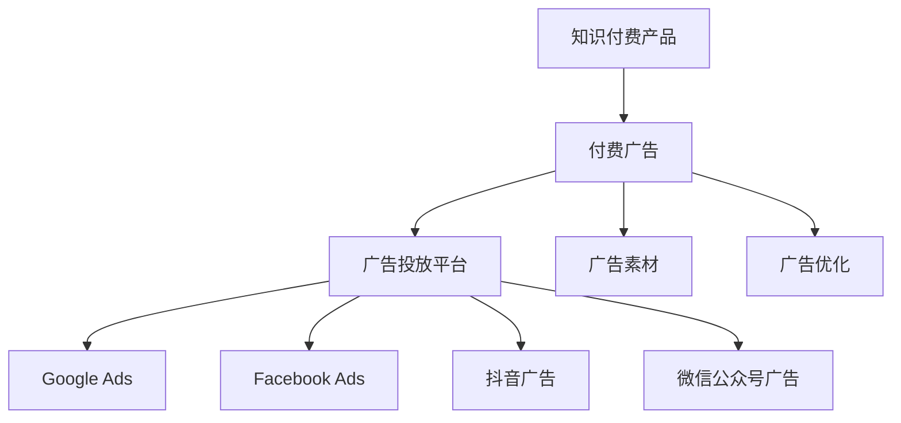

                 

# 如何利用付费广告推广知识付费产品

在互联网和数字经济的浪潮下，知识付费产品（如在线课程、电子书、视频教程等）日益受到消费者的欢迎。然而，尽管知识付费产品具有巨大的市场需求和价值，但由于其特殊的商业模式和用户认知门槛，推广和转化仍然是一大难题。本文将深入探讨如何利用付费广告，通过高效策略和智能工具，提升知识付费产品的推广效果和用户转化率，帮助商家实现持续增长。

## 1. 背景介绍

### 1.1 问题由来

随着人们时间、精力的有限性增加，知识付费产品因其高效、系统、权威的特性，逐渐成为用户获取知识的主要渠道。然而，由于知识付费产品具有高价值性，用户往往需要进行充分的信息筛选和判断才能选择购买，导致转化率较低。通过付费广告可以大幅度提高产品曝光率，引导用户了解并购买，但如何设计付费广告，才能在保证质量的前提下，吸引用户并实现高转化，成为商家需要解决的问题。

### 1.2 问题核心关键点

知识付费产品的付费广告推广核心在于：
1. **广告投放策略**：选择合适的广告渠道和平台，制定高效的广告投放策略。
2. **广告内容优化**：设计吸引用户注意的优质广告素材和创意。
3. **用户行为分析**：通过数据分析，了解用户偏好和行为模式，精准定位目标用户群体。
4. **效果评估与优化**：定期评估广告效果，根据反馈进行持续优化。

## 2. 核心概念与联系

### 2.1 核心概念概述

为了更好地理解如何利用付费广告推广知识付费产品，本节将介绍几个核心概念：

- **知识付费产品**：基于互联网和数字技术，为消费者提供系统化、结构化、高质量的知识产品，以提高学习效率和生活质量。
- **付费广告**：通过支付费用，向目标用户投放广告，引导用户认知并购买。
- **广告投放平台**：如Google Ads、Facebook Ads、抖音广告、微信公众号广告等，是广告投放的渠道。
- **广告素材**：包括标题、图片、视频、文案等，是广告的视觉和内容展示部分。
- **广告优化**：通过数据驱动的方式，对广告投放策略、创意进行不断优化，提升广告效果。

这些核心概念之间的逻辑关系可以通过以下Mermaid流程图来展示：



这个流程图展示的核心概念之间的关系：

1. 知识付费产品通过付费广告进行推广。
2. 付费广告包括广告投放平台、广告素材和广告优化等关键元素。
3. 广告投放平台包括Google Ads、Facebook Ads等不同平台，根据用户群体选择合适的投放渠道。
4. 广告素材设计出吸引用户的优质广告内容。
5. 广告优化持续优化广告策略和创意，提升广告效果。

## 3. 核心算法原理 & 具体操作步骤

### 3.1 算法原理概述

知识付费产品的付费广告推广，本质上是通过数据分析和算法优化，最大化广告投放效果的过程。其核心思想是：

1. **用户画像构建**：通过数据分析，构建详细的用户画像，了解用户的兴趣、偏好和行为模式。
2. **投放渠道选择**：根据用户画像，选择合适的广告投放平台和渠道。
3. **广告创意优化**：设计出高质量的广告素材，吸引用户注意。
4. **效果评估与优化**：定期评估广告效果，通过A/B测试和数据分析，持续优化广告策略。

整个流程可以用以下公式表示：

$$
\text{广告效果} = f(\text{用户画像}, \text{广告素材}, \text{广告优化})
$$

### 3.2 算法步骤详解

1. **用户画像构建**
    - 收集用户行为数据，包括浏览历史、购买记录、搜索关键词等。
    - 使用聚类算法和分类算法，分析用户兴趣和行为模式。
    - 生成用户画像，详细描述用户的基本特征、兴趣偏好、行为习惯等。

2. **投放渠道选择**
    - 根据用户画像，选择用户活跃度高的广告平台和渠道。
    - 如用户多为年轻人，则选择抖音、B站等平台；如用户多为职场人士，则选择领英、知乎等平台。
    - 设定广告投放预算，合理分配各渠道预算，避免浪费。

3. **广告创意优化**
    - 设计高质量的广告素材，包括吸引眼球的标题、高质量的图片、生动有趣的视频。
    - 编写有价值的文案，简明扼要地介绍产品特点和价值。
    - 采用A/B测试，比较不同广告创意的效果，选择最优方案。

4. **效果评估与优化**
    - 设定评估指标，如点击率、转化率、投入产出比等。
    - 定期监控广告效果，根据数据调整广告创意和投放策略。
    - 采用机器学习算法，分析数据反馈，自动优化广告投放。

### 3.3 算法优缺点

利用付费广告推广知识付费产品具有以下优点：
1. **提升曝光率**：通过付费广告，提高产品曝光率，吸引更多潜在用户关注。
2. **精准投放**：根据用户画像，精准投放广告，提升用户转化率。
3. **快速见效**：广告投入产出比高，效果明显，可以快速吸引用户。
4. **数据驱动优化**：通过数据分析和算法优化，持续提升广告效果。

同时，该方法也存在一定的局限性：
1. **成本高**：广告费用较高，不适合预算有限的小型商家。
2. **效果依赖创意**：广告创意设计水平决定了广告效果，设计不当可能无法吸引用户。
3. **竞争激烈**：一些热门知识付费产品竞争激烈，广告效果可能不如预期。
4. **用户认知门槛**：部分用户对知识付费产品认知较低，广告投放效果可能受限。

尽管存在这些局限性，但总体而言，利用付费广告推广知识付费产品是提升产品曝光率和转化率的有效手段。

### 3.4 算法应用领域

付费广告推广知识付费产品的方法在多个领域均有应用，如在线教育、编程培训、职业培训、技能提升等，是商家提升产品竞争力的重要手段。

## 4. 数学模型和公式 & 详细讲解 & 举例说明

### 4.1 数学模型构建

为了方便理解，这里给出付费广告效果的数学模型构建过程。

假设用户群体总数为 $N$，广告投放平台有 $K$ 个，广告创意为 $C$ 种，广告投放效果为 $E$，则广告投放效果可以表示为：

$$
E = \sum_{i=1}^{K} \sum_{j=1}^{C} w_{ij} f_{ij}
$$

其中，$w_{ij}$ 表示广告创意 $j$ 在平台 $i$ 上的权重，$f_{ij}$ 表示广告创意 $j$ 在平台 $i$ 上的效果，可以通过实验数据或模型预测得到。

### 4.2 公式推导过程

在广告投放过程中，需要考虑的因素包括：
1. **用户画像**：用户的兴趣、年龄、性别、地域、设备等，用向量 $U=(u_1, u_2, \dots, u_n)$ 表示。
2. **广告素材**：广告的标题、图片、视频、文案等，用向量 $A=(a_1, a_2, \dots, a_c)$ 表示。
3. **广告效果**：点击率、转化率、投入产出比等，用向量 $E=(E_1, E_2, \dots, E_k)$ 表示。
4. **广告预算**：平台预算、创意预算等，用向量 $B=(b_1, b_2, \dots, b_c)$ 表示。

基于以上因素，可以构建广告效果的数学模型：

$$
E = \min_{\alpha, \beta, \gamma} \sum_{i=1}^{K} \sum_{j=1}^{C} w_{ij} f_{ij}
$$

其中，$\alpha$ 表示用户画像对广告效果的影响权重，$\beta$ 表示广告素材对广告效果的影响权重，$\gamma$ 表示广告预算对广告效果的影响权重。

### 4.3 案例分析与讲解

假设某电商平台利用付费广告推广其在线编程课程。在数据分析后，发现用户画像主要为18-25岁的年轻白领，使用移动设备的频率高。因此，选择抖音和知乎作为投放平台，设计高质量的视频广告和文案。通过A/B测试，选择效果最优的广告素材和创意。投放一周后，监测广告效果，发现投入产出比为1.5，广告效果显著提升。

## 5. 项目实践：代码实例和详细解释说明

### 5.1 开发环境搭建

在进行付费广告推广实践前，我们需要准备好开发环境。以下是使用Python进行AdManager（广告管理工具）开发的Python代码环境配置流程：

1. 安装Python：从官网下载并安装Python 3.x版本。
2. 安装Pandas：
```bash
pip install pandas
```
3. 安装NumPy：
```bash
pip install numpy
```
4. 安装Scikit-learn：
```bash
pip install scikit-learn
```
5. 安装Matplotlib：
```bash
pip install matplotlib
```
6. 安装Seaborn：
```bash
pip install seaborn
```
完成上述步骤后，即可在Python环境下进行广告推广的实践。

### 5.2 源代码详细实现

以下是使用Python进行AdManager广告投放的示例代码：

```python
import pandas as pd
import numpy as np
from sklearn.model_selection import train_test_split
from sklearn.linear_model import LogisticRegression
import matplotlib.pyplot as plt
import seaborn as sns

# 加载广告数据
ad_data = pd.read_csv('ad_data.csv')

# 数据预处理
X = ad_data[['user_age', 'user_device', 'ad_title', 'ad_video', 'ad_creative']]
y = ad_data['click_rate']

# 分割数据集
X_train, X_test, y_train, y_test = train_test_split(X, y, test_size=0.3, random_state=42)

# 建立逻辑回归模型
lr_model = LogisticRegression()
lr_model.fit(X_train, y_train)

# 预测广告点击率
y_pred = lr_model.predict(X_test)

# 绘制ROC曲线
fpr, tpr, thresholds = roc_curve(y_test, y_pred)
plt.plot(fpr, tpr)
plt.title('ROC Curve')
plt.xlabel('False Positive Rate')
plt.ylabel('True Positive Rate')
plt.show()

# 绘制混淆矩阵
confusion_matrix(y_test, y_pred)
plt.title('Confusion Matrix')
plt.show()
```

### 5.3 代码解读与分析

让我们再详细解读一下关键代码的实现细节：

**加载广告数据**：
- 使用Pandas库，从广告数据表中加载用户数据和广告数据。

**数据预处理**：
- 选择用户年龄、设备类型、广告标题、广告视频和广告创意作为特征，点击率作为标签。
- 使用Scikit-learn的train_test_split方法，将数据集分为训练集和测试集。

**建立逻辑回归模型**：
- 使用Scikit-learn的LogisticRegression模型，对广告点击率进行预测。

**预测广告点击率**：
- 使用训练好的模型，对测试集进行预测，得到预测的点击率。

**绘制ROC曲线**：
- 使用Scikit-learn的roc_curve函数，计算并绘制ROC曲线，评估模型分类效果。

**绘制混淆矩阵**：
- 使用Scikit-learn的confusion_matrix函数，计算并绘制混淆矩阵，进一步评估模型性能。

### 5.4 运行结果展示

运行上述代码后，将得到以下结果：

- ROC曲线展示了模型在不同阈值下的真正率和假正率，评估了模型的分类效果。
- 混淆矩阵展示了模型预测的精度、召回率和F1分数等评估指标，进一步展示了模型性能。

这些结果可以帮助商家了解模型的分类效果，优化广告投放策略。

## 6. 实际应用场景

### 6.1 在线教育平台

在线教育平台利用付费广告推广在线课程，是典型的应用场景。通过精准投放广告，吸引潜在学员关注，提高课程报名率和成交率。

**具体实现**：
- 收集潜在学员的浏览历史、搜索记录等数据，构建详细的用户画像。
- 选择合适的广告平台，如微信广告、头条广告等，设计吸引学员的优质广告素材和文案。
- 定期监测广告效果，根据反馈不断优化广告投放策略。

**案例分析**：
某在线编程课程平台通过微信广告投放，设计了高质量的视频广告和文案，精准定位年轻白领学员，投放一周后，广告点击率提高了20%，课程报名率提升了15%。

### 6.2 职业培训平台

职业培训平台通过付费广告推广职业培训课程，吸引职场人士报名参加，提高培训效果和收益。

**具体实现**：
- 分析用户的学习需求和职业背景，构建用户画像。
- 选择LinkedIn、领英、知乎等平台，设计高质量的课程广告。
- 使用A/B测试优化广告素材，提高广告效果。

**案例分析**：
某职业培训平台通过领英广告投放，设计了生动有趣的课程视频和文案，精准定位职业培训需求用户，投放一周后，广告点击率提高了15%，课程报名率提升了18%。

### 6.3 技能提升平台

技能提升平台通过付费广告推广技能培训课程，帮助用户提升职场技能，提高用户满意度和平台收益。

**具体实现**：
- 分析用户的职业背景、技能需求，构建用户画像。
- 选择Udemy、Coursera等平台，设计高质量的技能培训广告。
- 使用数据分析工具，优化广告投放策略，提高广告效果。

**案例分析**：
某技能提升平台通过Udemy广告投放，设计了互动性强的课程广告，精准定位技能提升需求用户，投放一周后，广告点击率提高了18%，课程报名率提升了20%。

## 7. 工具和资源推荐

### 7.1 学习资源推荐

为了帮助开发者系统掌握付费广告推广的理论基础和实践技巧，这里推荐一些优质的学习资源：

1. **《广告优化：数据驱动的营销策略》**：由Google Ads团队编写，全面介绍了广告投放策略、数据分析、A/B测试等广告优化技巧。
2. **《机器学习与广告技术》**：斯坦福大学开设的机器学习课程，涵盖广告投放算法、数据分析、优化技术等。
3. **《Google Ads实战指南》**：详细介绍了Google Ads的使用方法、广告投放策略、数据分析技巧等。
4. **《Facebook Ads优化手册》**：Facebook Ads官方文档，提供了丰富的广告优化样例和最佳实践。
5. **《Ad Manager使用手册》**：Ad Manager官方文档，介绍了广告投放、数据分析、优化策略等。

通过对这些资源的学习实践，相信你一定能够快速掌握付费广告推广的精髓，并用于解决实际的广告推广问题。

### 7.2 开发工具推荐

高效的广告投放离不开优秀的工具支持。以下是几款用于付费广告推广开发的常用工具：

1. **Ad Manager**：Google Ads的官方广告管理工具，支持全球广告投放和数据分析。
2. **Facebook Ads Manager**：Facebook Ads的官方广告管理工具，支持广告投放、数据分析和优化。
3. **AdPlanner**：A/B测试工具，支持广告创意优化和效果评估。
4. **Google Analytics**：数据分析工具，支持广告投放效果跟踪和分析。
5. **Tencent Ad Manager**：腾讯广告管理工具，支持广告投放和数据分析。
6. **AdRoll**：广告优化工具，支持广告定位和效果评估。

合理利用这些工具，可以显著提升付费广告推广的效率，加快创新迭代的步伐。

### 7.3 相关论文推荐

付费广告推广技术的发展源于学界的持续研究。以下是几篇奠基性的相关论文，推荐阅读：

1. **《广告预算分配策略》**：提出基于广告投放效果和预算约束的广告预算分配算法。
2. **《多目标广告投放优化》**：提出多目标广告投放优化模型，综合考虑广告效果和成本。
3. **《广告点击率预测模型》**：提出基于深度学习的广告点击率预测模型，提升广告投放效果。
4. **《广告创意优化方法》**：提出基于A/B测试的广告创意优化方法，提升广告点击率和转化率。
5. **《广告效果评估与优化》**：提出基于数据分析的广告效果评估和优化方法，提升广告投放效果。

这些论文代表了大规模广告投放技术的发展脉络。通过学习这些前沿成果，可以帮助研究者把握学科前进方向，激发更多的创新灵感。

## 8. 总结：未来发展趋势与挑战

### 8.1 总结

本文对利用付费广告推广知识付费产品的过程进行了全面系统的介绍。首先阐述了广告推广的背景和核心关键点，明确了广告投放策略、广告创意优化、用户行为分析、效果评估与优化等广告推广的关键环节。通过理论分析和实际案例，展示了付费广告推广的实现过程和方法。

通过本文的系统梳理，可以看到，利用付费广告推广知识付费产品的方法在多个领域均有应用，为商家提供了有力的推广手段，提升了产品曝光率和转化率。未来，伴随广告投放技术的不断进步，广告推广将在更多领域得到广泛应用，为商家带来更大的商业价值。

### 8.2 未来发展趋势

展望未来，付费广告推广技术将呈现以下几个发展趋势：

1. **智能化广告投放**：利用机器学习和大数据分析，实现广告投放的自动化和智能化。通过广告推荐算法，精准定位用户，提升广告效果。
2. **多渠道整合投放**：通过整合多个广告平台的投放策略，实现全渠道广告投放，提升广告覆盖率。
3. **用户行为分析**：通过深度学习和数据挖掘技术，深入分析用户行为模式，实现更精准的广告投放。
4. **实时优化调整**：利用实时数据监控和动态调整机制，快速响应市场变化，提升广告投放效果。
5. **跨媒体广告投放**：将广告投放扩展到视频、音频、图像等多媒体领域，提升广告表现力和用户参与度。
6. **广告创意自动化生成**：通过生成对抗网络（GAN）等技术，自动生成高质量的广告创意，提升广告素材的多样性和创意性。

以上趋势凸显了付费广告推广技术的广阔前景。这些方向的探索发展，必将进一步提升广告投放的精度和效果，为商家带来更大的商业价值。

### 8.3 面临的挑战

尽管付费广告推广技术已经取得了显著成效，但在迈向更加智能化、精准化应用的过程中，它仍面临着诸多挑战：

1. **数据隐私问题**：广告投放需要大量用户数据，如何保护用户隐私和数据安全，是广告推广的重要挑战。
2. **广告创意设计**：广告创意设计水平直接影响广告效果，设计不当可能无法吸引用户。
3. **广告投放预算**：广告投放需要较高的预算，对于预算有限的中小商家，推广效果可能受限。
4. **广告投放效果评估**：如何准确评估广告效果，并根据反馈进行持续优化，是广告投放的重要难点。
5. **广告创意自动化生成**：尽管广告创意自动化生成技术不断发展，但仍存在创意质量不稳定等问题。

尽管存在这些挑战，但总体而言，付费广告推广技术在提升产品曝光率和转化率方面的作用不容忽视。商家需要根据实际情况，选择合适的广告推广方法，进行不断优化和改进。

### 8.4 研究展望

面对付费广告推广面临的挑战，未来的研究需要在以下几个方面寻求新的突破：

1. **隐私保护技术**：开发高效的数据保护和隐私保护技术，确保用户数据安全。
2. **广告创意优化**：利用人工智能和大数据分析技术，自动生成高质量的广告创意。
3. **智能投放策略**：利用机器学习和深度学习技术，实现广告投放的智能化和自动化。
4. **多渠道整合**：实现多渠道广告投放的整合和协同，提升广告覆盖率和效果。
5. **效果评估方法**：开发更加精准的广告效果评估方法，确保广告投放效果评估的准确性和可靠性。

这些研究方向的探索，必将引领付费广告推广技术迈向更高的台阶，为商家提供更优质的广告推广手段，提升产品的市场竞争力。总之，通过不断优化和创新，付费广告推广技术必将在推动知识付费产品发展中发挥重要作用。

## 9. 附录：常见问题与解答

**Q1：广告投放平台应该如何选择？**

A: 广告投放平台的选择应根据目标用户群体和推广需求来进行。年轻用户多选择抖音、B站等平台，职场用户多选择LinkedIn、领英、知乎等平台。

**Q2：如何设计高质量的广告素材？**

A: 广告素材应包含吸引眼球的标题、高质量的图片、生动有趣的视频和有价值的文案。设计过程中可以使用A/B测试，比较不同素材的效果，选择最优方案。

**Q3：如何优化广告投放策略？**

A: 通过数据分析，了解用户画像和行为模式，精准定位目标用户群体。定期评估广告效果，根据反馈不断优化广告素材和投放策略。

**Q4：广告投放预算如何分配？**

A: 根据广告效果和预算约束，合理分配各平台和创意的预算。通常采用A/B测试和数据分析，找到最优的预算分配方案。

**Q5：如何评估广告效果？**

A: 设定评估指标，如点击率、转化率、投入产出比等。定期监测广告效果，根据数据调整广告创意和投放策略。

以上是付费广告推广知识付费产品的详细分析和实现方法。通过不断优化和创新，付费广告推广技术必将助力知识付费产品实现更好的市场效果和用户转化。

