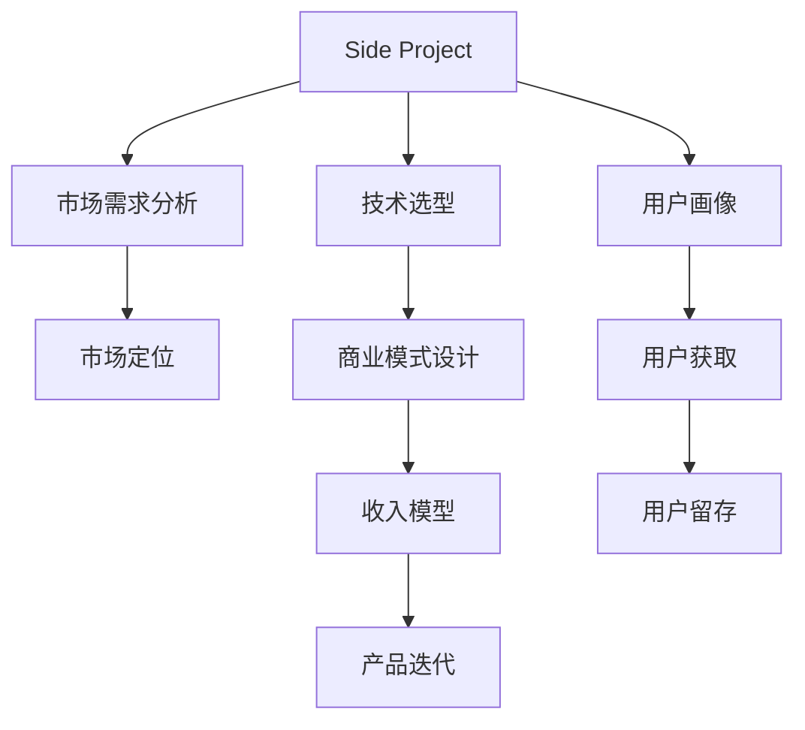

                 

# 如何将Side Project转化为主要收入来源

在当今互联网时代，很多技术爱好者和创业者都有开发自己的Side Project的习惯。Side Project不仅可以满足个人兴趣，还能帮助解决实际问题，提升技术水平。但如何将这些Side Project转化为主要收入来源，是一个需要深思熟虑的问题。本文将从背景、核心概念、算法原理、实践应用、未来展望和挑战等方面，对这一问题进行详细探讨。

## 1. 背景介绍

### 1.1 问题由来
在个人开发者和创业者的日常工作中，Side Project占据了很大一部分时间。虽然这些项目可能不一定能立即产生收益，但它们在技术探索、用户体验创新、市场验证等方面具有重要意义。然而，如何将Side Project转化为稳定且可持续的主要收入来源，一直是许多开发者和创业者的难题。

### 1.2 问题核心关键点
将Side Project转化为主要收入来源的关键在于市场定位、商业模式设计、用户获取、产品迭代等方面。这要求开发者对市场、用户、技术等方面有深刻的理解和洞察。

## 2. 核心概念与联系

### 2.1 核心概念概述
- **Side Project**：开发者在主要工作之外开发的个人项目，通常用于技术探索、个人兴趣、市场验证等。
- **收入来源**：通过项目产生的收入，包括广告、订阅、捐赠、服务费等。
- **商业模式**：项目的盈利方式，如SaaS、PaaS、Freemium、广告等。
- **市场定位**：确定目标用户群、市场细分和竞争分析。
- **用户获取**：通过各种渠道吸引和留住用户。
- **产品迭代**：根据用户反馈不断改进和优化产品。

### 2.2 核心概念原理和架构的 Mermaid 流程图



这个流程图展示了Side Project转化为收入来源的主要步骤和关键点。从市场需求分析到产品迭代，每一步都需要精确设计和执行。

## 3. 核心算法原理 & 具体操作步骤

### 3.1 算法原理概述
将Side Project转化为主要收入来源的过程，可以视为一个包含市场需求分析、技术选型、用户画像、市场定位、商业模式设计、用户获取、用户留存、产品迭代等环节的闭环系统。这一过程需要通过数据分析、用户体验、商业策略等多方面的综合考量，才能实现收入来源的可持续性。

### 3.2 算法步骤详解

#### 3.2.1 市场需求分析
- 确定目标用户群和潜在需求。
- 通过市场调研和竞品分析，了解市场空间和竞争态势。
- 识别市场需求与自身项目能力之间的匹配度。

#### 3.2.2 技术选型
- 评估现有技术的适用性和先进性。
- 选择最适合项目需求的技术栈和工具。
- 进行技术评估和原型设计。

#### 3.2.3 用户画像
- 定义目标用户的特征、需求和行为模式。
- 分析用户痛点和需求，确定产品设计的方向。
- 使用数据分析和用户体验研究来构建用户画像。

#### 3.2.4 市场定位
- 根据用户画像和市场需求，确定产品的独特卖点和竞争优势。
- 制定市场进入策略，选择合适的市场细分和目标用户群。
- 设计品牌和营销策略，建立市场认知。

#### 3.2.5 商业模式设计
- 确定产品的定价策略，如Freemium、订阅制等。
- 设计收入模型，包括广告、交易、服务费等。
- 评估成本和盈利点，制定财务规划。

#### 3.2.6 用户获取
- 制定用户获取策略，包括SEO、内容营销、社交媒体推广等。
- 设计用户引导流程和转化漏斗，优化用户体验。
- 监控用户获取效果，及时调整策略。

#### 3.2.7 用户留存
- 分析用户流失原因，设计用户留存策略。
- 优化产品功能和使用体验，提升用户粘性。
- 定期进行用户反馈和满意度调查，持续改进。

#### 3.2.8 产品迭代
- 根据用户反馈和市场变化，不断优化产品功能和用户体验。
- 引入A/B测试和多渠道反馈，验证产品改进效果。
- 制定产品路线图，确保持续创新和迭代。

### 3.3 算法优缺点

#### 3.3.1 优点
- **灵活性**：Side Project通常具有较高的灵活性和自由度，开发者可以根据市场需求快速调整方向。
- **创新性**：Side Project可以带来更多的创新机会，满足不同的市场细分需求。
- **成本低**：初期投入较低，可以快速迭代和验证市场反应。

#### 3.3.2 缺点
- **资源有限**：Side Project通常缺乏长期投入和专业团队，可能面临资源匮乏的问题。
- **市场风险**：市场需求变化快，产品可能面临竞争和替代风险。
- **用户基础薄弱**：初期用户获取难度大，需要较长时间建立市场认知。

### 3.4 算法应用领域

Side Project转化为主要收入来源的方法，可以应用于各种不同类型的项目，包括：

- **技术工具**：如开发框架、IDE插件、数据可视化工具等。
- **应用软件**：如移动应用、桌面应用、Web应用等。
- **内容平台**：如博客、新闻网站、社交媒体等。
- **服务类产品**：如SaaS、PaaS、API服务、云存储等。

不同的应用领域，需要根据市场特点和用户需求，制定不同的商业模式和策略。

## 4. 数学模型和公式 & 详细讲解 & 举例说明

### 4.1 数学模型构建

为了更好地理解Side Project转化为收入来源的过程，我们可以使用以下数学模型进行量化分析：

设Side Project转化为收入来源的周期为 $T$，初期用户获取成本为 $C_u$，平均用户获取成本为 $C_a$，用户流失率为 $\lambda$，用户生命周期价值为 $V$，则总收入 $I$ 可表示为：

$$ I = \sum_{t=0}^{T} \left( \frac{C_u}{C_a} \times V \times (1 - \lambda)^t \right) $$

其中，$C_u$ 是初期获取一个用户的成本，$C_a$ 是平均获取一个用户的成本，$V$ 是用户生命周期价值，$\lambda$ 是用户流失率，$t$ 是时间。

### 4.2 公式推导过程

根据上述模型，我们可以进一步推导：

$$ \frac{dI}{dt} = \frac{C_u}{C_a} \times V \times \lambda (1 - \lambda)^t $$

当 $dI/dt = 0$ 时，可求得收入达到平衡点的 $t$ 值：

$$ t^* = -\frac{\log \lambda}{\log (1 - \lambda)} $$

在 $t = t^*$ 时，收入达到最大值。

### 4.3 案例分析与讲解

假设某Side Project平均获取成本 $C_a = 100$，用户生命周期价值 $V = 200$，用户流失率 $\lambda = 0.1$。

1. **初始期**：用户获取成本 $C_u = 1000$，$t=0$ 时总收入为 $0$。
2. **平衡期**：当 $t = t^*$ 时，收入达到最大值。计算得到 $t^* \approx 20$ 个月。

3. **持久期**：用户获取成本降至 $C_u = 200$，用户数量趋于稳定，$t> t^*$ 时总收入为 $V \times T \times \frac{1 - \lambda}{1 - \frac{\lambda}{1 - \lambda}}$。

通过上述推导，可以看出平衡期的收入最大，且与用户获取成本和用户生命周期价值密切相关。开发者应重点关注这一阶段，确保用户获取成本控制在合理范围内。

## 5. 项目实践：代码实例和详细解释说明

### 5.1 开发环境搭建

假设我们有一个Side Project，用于开发一个在线代码编辑器。以下是开发环境搭建的详细步骤：

1. 安装开发工具：如IDE、版本控制系统、测试框架等。
2. 选择合适的服务器和云服务：如AWS、GCP、Azure等。
3. 部署应用：通过Docker、Kubernetes等容器技术，确保应用的稳定性和可扩展性。

### 5.2 源代码详细实现

以下是将Side Project转化为主要收入来源的核心代码实现：

```python
from flask import Flask, request
from flask_sqlalchemy import SQLAlchemy

app = Flask(__name__)
app.config['SQLALCHEMY_DATABASE_URI'] = 'sqlite:///users.db'
db = SQLAlchemy(app)

class User(db.Model):
    id = db.Column(db.Integer, primary_key=True)
    name = db.Column(db.String(50))
    email = db.Column(db.String(50))
    subscription = db.Column(db.String(10))
    created_at = db.Column(db.DateTime, default=datetime.utcnow)

@app.route('/')
def index():
    return "Welcome to my Side Project"

@app.route('/subscribe', methods=['POST'])
def subscribe():
    data = request.json
    user = User(name=data['name'], email=data['email'], subscription=data['subscription'])
    db.session.add(user)
    db.session.commit()
    return "Subscription successful"

@app.route('/unsubscribe', methods=['POST'])
def unsubscribe():
    data = request.json
    user = User.query.filter_by(email=data['email']).first()
    user.subscription = None
    db.session.commit()
    return "Unsubscription successful"
```

### 5.3 代码解读与分析

上述代码实现了在线代码编辑器用户订阅和退订的功能。通过SQLAlchemy进行用户数据管理和数据库交互，利用Flask框架实现Web服务。

- `User` 模型定义了用户的基本信息，包括姓名、邮箱、订阅状态等。
- `index` 函数为应用首页，欢迎语。
- `subscribe` 函数用于用户订阅，将用户信息保存到数据库。
- `unsubscribe` 函数用于用户退订，更新订阅状态。

## 6. 实际应用场景

### 6.1 技术工具

#### 案例1：GitHub Copilot

GitHub Copilot是一个基于AI的代码补全工具，可以帮助开发者编写代码。GitHub Copilot最初作为Side Project开发，通过OpenAI的GPT-3技术，实现了强大的代码生成能力。

1. **市场需求分析**：开发者通过GitHub社区和用户反馈，发现代码补全的需求高。
2. **技术选型**：选择OpenAI的GPT-3作为核心技术。
3. **用户画像**：针对技术开发者和初级开发者进行市场细分。
4. **市场定位**：提供高质量、高效的代码补全服务，区别于传统的代码补全工具。
5. **商业模式设计**：提供免费试用，通过订阅制和商业版收取费用。
6. **用户获取**：通过GitHub官方推广和社区合作，快速获取用户。
7. **用户留存**：持续优化算法和用户体验，提升用户满意度。
8. **产品迭代**：根据用户反馈不断改进和创新，推出新功能。

#### 案例2：Cloudflare Ray
Cloudflare Ray是一个Web应用防火墙，通过分析Web流量，提供安全防护和性能优化功能。Ray最初作为Cloudflare的Side Project开发，逐渐发展成为主要产品线。

1. **市场需求分析**：网络安全需求高，但传统防火墙效果有限。
2. **技术选型**：选择深度学习算法进行流量分析。
3. **用户画像**：网络安全管理员和开发人员。
4. **市场定位**：提供高安全性、高性能的Web安全解决方案。
5. **商业模式设计**：提供基础版免费，高级版和定制化服务收费。
6. **用户获取**：通过Cloudflare品牌推广和合作伙伴渠道。
7. **用户留存**：提供完善的技术支持和优质服务，提升用户粘性。
8. **产品迭代**：根据用户反馈和市场需求，不断优化和创新。

### 6.2 应用软件

#### 案例3：Todoist

Todoist是一个流行的待办事项管理工具，最初由Asana工程师开发为Side Project。通过不断的市场验证和用户反馈，Todoist逐渐发展成为主要产品。

1. **市场需求分析**：个人和团队任务管理需求高。
2. **技术选型**：选择跨平台Web和移动应用技术。
3. **用户画像**：个人用户和团队管理者。
4. **市场定位**：提供简单易用、功能丰富的任务管理工具。
5. **商业模式设计**：提供免费版本，高级版和商业版收费。
6. **用户获取**：通过社交媒体推广和用户口碑传播。
7. **用户留存**：提供优秀的用户体验和持续的社区支持。
8. **产品迭代**：根据用户需求不断更新和优化功能。

### 6.3 内容平台

#### 案例4：Medium

Medium是一个以内容为中心的社交平台，由Matterfeed创始人开发为Side Project。通过不断的市场验证和内容运营，Medium逐渐发展为市值数十亿美元的公司。

1. **市场需求分析**：优质内容分享和阅读需求高。
2. **技术选型**：选择高性能的Web应用架构。
3. **用户画像**：内容创作者和读者。
4. **市场定位**：提供高质量的内容分享和社区互动平台。
5. **商业模式设计**：提供免费阅读，广告收入和会员订阅收费。
6. **用户获取**：通过SEO和内容营销获取用户。
7. **用户留存**：提供优秀的用户体验和社区互动功能。
8. **产品迭代**：根据用户反馈和内容需求，持续优化和创新。

### 6.4 服务类产品

#### 案例5：Slack

Slack是一个企业级的即时通讯和协作平台，最初由Eric Musser和Cal Henderson开发为Side Project。通过不断的市场验证和用户反馈，Slack逐渐发展为主要的企业服务产品。

1. **市场需求分析**：团队协作和沟通需求高。
2. **技术选型**：选择高性能的云服务架构。
3. **用户画像**：企业用户和团队管理者。
4. **市场定位**：提供功能丰富、安全可靠的企业协作平台。
5. **商业模式设计**：提供免费版，企业版和API服务收费。
6. **用户获取**：通过合作伙伴推广和用户口碑传播。
7. **用户留存**：提供优质的用户体验和持续的客户支持。
8. **产品迭代**：根据用户需求和市场变化，不断优化和创新功能。

## 7. 工具和资源推荐

### 7.1 学习资源推荐

1. **《Side Project创业手册》**：由Side Project专家编写的全面指南，涵盖市场分析、技术选型、商业模式等多个方面。
2. **Coursera《创业与创新》课程**：提供创业和创新的基础理论，帮助开发者构建市场视角。
3. **MBA《创业管理》课程**：系统介绍创业管理的各个环节，提供实战经验。
4. **《精益创业》书籍**：作者Eric Ries介绍了精益创业的核心理念和方法，帮助开发者快速迭代和市场验证。
5. **《产品管理》书籍**：作者Rajiv Goel介绍了产品管理的各个方面，帮助开发者进行产品设计和迭代。

### 7.2 开发工具推荐

1. **Jira**：项目管理工具，帮助开发者进行任务管理和进度跟踪。
2. **Slack**：团队沟通工具，帮助开发者高效协作。
3. **Trello**：看板管理工具，帮助开发者进行任务分配和进度跟踪。
4. **GitHub**：代码托管平台，帮助开发者进行代码管理和版本控制。
5. **Google Analytics**：网站分析工具，帮助开发者分析用户行为和流量来源。
6. **Google Cloud Platform**：云服务提供商，提供高性能的计算和存储资源。

### 7.3 相关论文推荐

1. **《Leapfrogging in an Information Age》**：作者Alexa Ohanian探讨了Side Project成功转型的关键因素。
2. **《SaaS Business Model Generation》**：作者Alex Oates介绍了SaaS业务的商业模式设计。
3. **《Scaling Your Startup Exponentially》**：作者Russell Reynolds和Matthew Realmondi提供了快速扩展Side Project的方法。

## 8. 总结：未来发展趋势与挑战

### 8.1 总结

本文详细介绍了将Side Project转化为主要收入来源的关键步骤和核心概念。从市场需求分析、技术选型、用户画像、市场定位、商业模式设计、用户获取、用户留存到产品迭代，每一步都需要精心设计和执行。

通过上述案例和分析，可以看出，Side Project转化为主要收入来源的过程，不仅需要技术实力，还需要市场洞察和商业智慧。开发者需要不断学习和实践，才能在这一过程中取得成功。

### 8.2 未来发展趋势

1. **市场需求驱动**：随着技术的发展和市场的变化，市场需求将不断演进，开发者需要保持敏锐的市场洞察力。
2. **技术创新**：技术创新是Side Project转化为收入来源的关键。开发者需要持续学习和应用最新的技术，保持竞争优势。
3. **用户为中心**：用户需求是Side Project成功转型的基础。开发者需要始终以用户为中心，不断优化产品体验。
4. **多样化收入**：单一收入模式容易被市场和竞争所替代，开发者需要寻找多样化的收入来源，降低风险。
5. **持续迭代**：市场和技术都在不断变化，开发者需要持续迭代和创新，才能保持产品和服务的活力。

### 8.3 面临的挑战

1. **市场风险**：市场变化快，需求不确定，开发者需要灵活应对和快速调整。
2. **技术挑战**：技术选型和架构设计需要精细化考量，开发者需要不断学习和提升。
3. **用户获取和留存**：用户获取成本高，用户留存难度大，开发者需要持续优化用户体验和社区支持。
4. **商业模式设计**：商业模式需要不断优化和调整，以适应市场变化和用户需求。
5. **资源限制**：初期资源有限，开发者需要合理规划和利用资源。

### 8.4 研究展望

未来，Side Project转化为主要收入来源的研究方向将集中在以下几个方面：

1. **市场细分和用户画像**：更精细的市场细分和用户画像分析，有助于开发者更好地定位目标用户群。
2. **技术平台化**：将技术平台化，降低开发门槛，提升开发效率和市场响应速度。
3. **开源生态建设**：建立开源社区，促进技术交流和协作，加速技术创新。
4. **商业策略创新**：创新商业模式，拓展收入来源，降低风险。
5. **用户行为分析**：深入分析用户行为，优化产品设计和用户体验。

通过上述方向的探索和实践，Side Project将有更大的可能转化为主要收入来源，为开发者和创业者的职业发展带来新的机遇和挑战。

## 9. 附录：常见问题与解答

**Q1：如何评估市场需求？**

A: 市场需求评估可以通过以下步骤进行：
1. **市场调研**：分析市场规模、增长趋势、竞争态势。
2. **竞品分析**：了解竞争对手的产品、用户反馈、市场策略。
3. **用户调研**：通过问卷调查、用户访谈等方式获取用户需求和痛点。
4. **MVP测试**：快速开发最小可行产品(MVP)，验证市场需求。

**Q2：如何选择合适的技术栈？**

A: 技术栈的选择需要考虑以下几个因素：
1. **功能需求**：根据项目功能需求选择合适的技术栈。
2. **开发效率**：选择开发效率高、维护成本低的技术栈。
3. **社区支持**：选择有活跃社区、丰富资源的技术栈。
4. **性能要求**：根据性能需求选择高性能的技术栈。

**Q3：如何优化用户留存？**

A: 用户留存优化可以从以下几个方面进行：
1. **提高用户体验**：优化UI/UX设计，提升用户使用便捷性。
2. **提供优质服务**：提供及时响应的技术支持，解决用户问题。
3. **社区互动**：建立用户社区，增加用户粘性。
4. **个性化推荐**：根据用户行为和偏好，提供个性化推荐。

**Q4：如何设计商业模式？**

A: 商业模式设计需要考虑以下几个因素：
1. **成本结构**：分析产品成本和运营成本，制定合理的定价策略。
2. **收入模型**：选择适合的收入模型，如广告、订阅、交易等。
3. **市场细分**：根据市场细分和用户画像，制定差异化的市场策略。
4. **竞争分析**：分析竞争对手的商业模式，制定差异化的竞争策略。

**Q5：如何评估收入效果？**

A: 收入效果评估可以通过以下指标进行：
1. **收入增长**：分析收入增长趋势和速度。
2. **用户获取成本**：计算每个用户的获取成本，优化用户获取策略。
3. **用户留存率**：分析用户留存率，提升用户粘性。
4. **生命周期价值**：分析用户生命周期价值，优化产品体验和用户获取策略。

通过以上分析和解答，希望开发者和创业者能够更好地理解和掌握Side Project转化为主要收入来源的关键方法和策略，推动技术创新和产业发展。

---

作者：禅与计算机程序设计艺术 / Zen and the Art of Computer Programming

