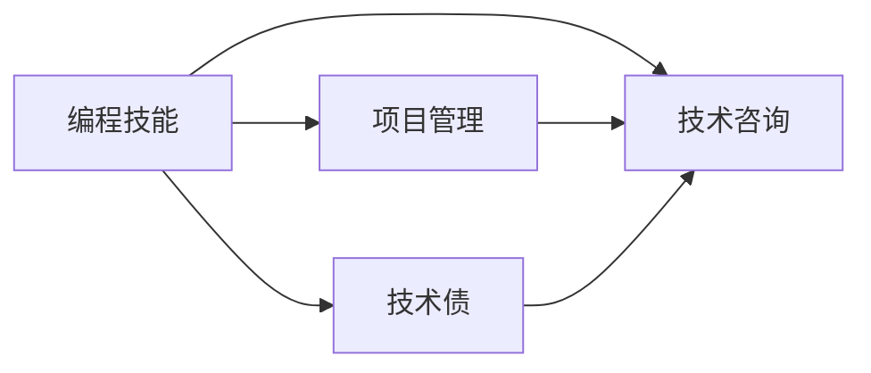

                 

# 如何将编程技能转化为咨询服务

> 关键词：编程技能, 软件开发, 技术咨询, 项目管理, 技术债

## 1. 背景介绍

### 1.1 问题由来
在软件行业，许多开发人员和技术专家面临着一个挑战：如何将他们的编程技能转化为有价值的咨询服务，为企业的技术转型和创新提供支持。随着技术的快速发展，企业越来越依赖于创新和灵活的技术解决方案，而开发人员和专家往往具备这些所需的技能和知识。因此，将编程技能转化为咨询服务，成为了许多开发者和专家职业生涯中的重要转折点。

### 1.2 问题核心关键点
将编程技能转化为咨询服务的过程涉及多个关键点，包括理解企业的技术需求、提供定制化的技术方案、实施技术改造和优化，以及持续维护和升级。这个过程不仅需要深厚的编程技能，还需要良好的沟通能力、项目管理能力和对业务需求的敏锐洞察。

### 1.3 问题研究意义
将编程技能转化为咨询服务具有重要的研究和应用价值：
1. **技术赋能**：帮助企业提升技术能力和竞争力，实现数字化转型。
2. **职业发展**：为开发者提供新的职业发展方向，丰富职业生涯。
3. **知识共享**：促进技术知识和经验的传播，加速技术行业的发展。

## 2. 核心概念与联系

### 2.1 核心概念概述

要深入理解如何将编程技能转化为咨询服务，首先需要明确几个关键概念：

- **编程技能**：指开发人员在软件开发、算法实现、系统设计等方面的专业知识和技能。
- **技术咨询**：指为企业提供技术指导、解决方案和实施支持的专业服务。
- **项目管理**：指规划、执行和监控项目进度和资源分配，确保项目按计划完成的过程。
- **技术债**：指在软件开发过程中，为了快速交付或满足短期需求而牺牲长期维护和优化所积累的技术债务。

这些概念之间的关系可以用以下Mermaid流程图表示：



这个流程图展示了编程技能如何通过项目管理技术债积累，最终转化为技术咨询服务。

## 3. 核心算法原理 & 具体操作步骤

### 3.1 算法原理概述

将编程技能转化为咨询服务的核心原理是，通过理解企业需求，利用编程技能提供定制化的技术解决方案。这个过程中，需要遵循一些基本原则：

1. **需求分析**：深入理解企业的技术需求和业务目标。
2. **方案设计**：根据需求设计合适的技术方案，考虑系统架构、性能要求和可维护性。
3. **实施与优化**：将方案转化为可执行的代码，并进行优化，确保系统性能和可维护性。
4. **持续维护**：对系统进行定期维护和升级，确保其长期稳定运行。

### 3.2 算法步骤详解

具体来说，将编程技能转化为咨询服务的步骤可以分为以下几个阶段：

#### 第一阶段：需求分析与理解

1. **与客户沟通**：通过面谈、文档审核等方式，深入了解客户的技术需求、业务目标和痛点。
2. **需求分析**：对收集到的需求进行整理和分析，明确技术需求的核心要素和优先级。

#### 第二阶段：方案设计与评估

1. **方案设计**：基于需求分析，设计多个技术方案，考虑系统的可行性、可扩展性和维护成本。
2. **方案评估**：对设计方案进行评估，选择最适合的方案。

#### 第三阶段：实施与优化

1. **技术实现**：将选定的方案转化为具体的代码和技术文档。
2. **性能优化**：对系统进行性能优化，确保其满足性能要求。

#### 第四阶段：持续维护与升级

1. **持续维护**：定期对系统进行维护，修复已知问题，进行必要的更新。
2. **持续升级**：根据技术发展和客户需求的变化，对系统进行升级和优化。

### 3.3 算法优缺点

将编程技能转化为咨询服务的主要优点包括：

1. **专业性**：利用开发人员在编程和系统设计方面的专业知识，提供高质量的技术解决方案。
2. **灵活性**：能够根据客户需求进行定制化的方案设计，灵活应对各种技术挑战。
3. **市场潜力**：随着企业对技术咨询的需求增加，提供咨询服务具有广阔的市场前景。

同时，这种转化也存在一些缺点：

1. **知识壁垒**：客户和开发者之间可能存在知识壁垒，需要更多的沟通和协调。
2. **时间和成本**：咨询项目往往需要较长时间和较高成本，对开发人员的资源要求较高。
3. **持续维护**：系统上线后，需要持续维护和优化，增加了工作量。

### 3.4 算法应用领域

将编程技能转化为咨询服务的广泛应用领域包括：

- **企业技术转型**：帮助企业从传统IT架构向云计算、微服务、DevOps等现代架构转型。
- **业务系统优化**：优化现有业务系统，提升性能和用户体验。
- **创新项目开发**：为企业开发创新的技术解决方案，如区块链、人工智能、大数据分析等。
- **技术培训与支持**：提供技术培训和技术支持，帮助企业提升技术团队的能力。

## 4. 数学模型和公式 & 详细讲解 & 举例说明

### 4.1 数学模型构建

在咨询服务的方案设计和评估过程中，可以利用数学模型来辅助决策。例如，可以使用加权平均法对多个技术方案进行评分，综合考虑技术可行性、成本、风险等因素。

假设有三个方案A、B、C，每个方案的评分如下：

| 技术方案 | 技术可行性 | 成本 | 风险 |
| --- | --- | --- | --- |
| A | 8 | 10 | 5 |
| B | 7 | 8 | 4 |
| C | 9 | 12 | 6 |

可以定义一个加权评分公式：

$$
S = \alpha \times \text{技术可行性} + \beta \times \text{成本} + \gamma \times \text{风险}
$$

其中，$\alpha$、$\beta$、$\gamma$为权重系数，总和为1。

### 4.2 公式推导过程

以加权评分公式为例，假设权重系数分别为0.5、0.3、0.2，则计算方法如下：

$$
S_A = 0.5 \times 8 + 0.3 \times 10 + 0.2 \times 5 = 9.5
$$
$$
S_B = 0.5 \times 7 + 0.3 \times 8 + 0.2 \times 4 = 7.4
$$
$$
S_C = 0.5 \times 9 + 0.3 \times 12 + 0.2 \times 6 = 9.0
$$

选择评分最高的方案C作为最终的推荐方案。

### 4.3 案例分析与讲解

假设一家企业需要部署一个新的客户关系管理系统（CRM），可以选择以下方案：

- 方案A：使用开源CRM解决方案，自己开发定制功能。
- 方案B：购买商业CRM软件，并进行少量定制开发。
- 方案C：使用云原生CRM平台，无需任何开发。

根据加权评分公式，可以计算出每个方案的评分，并据此选择最合适的方案。

## 5. 项目实践：代码实例和详细解释说明

### 5.1 开发环境搭建

要进行咨询服务项目的开发，首先需要搭建好开发环境。以下是一些常见的开发环境搭建步骤：

1. **选择开发工具**：根据项目需求，选择合适的开发工具，如Visual Studio、Eclipse、PyCharm等。
2. **安装依赖库**：根据项目需求，安装所需的依赖库和框架，如Python、Java、Spring等。
3. **配置开发环境**：配置好开发环境，包括开发工具、IDE、IDE插件等，确保开发环境稳定运行。

### 5.2 源代码详细实现

以下是一个简单的项目实践示例，演示如何将编程技能转化为咨询服务：

假设客户需要开发一个新的在线购物网站，可以选择以下方案：

- 方案A：使用现成的购物网站模板，进行简单的定制开发。
- 方案B：使用开源购物网站框架，进行定制开发。
- 方案C：完全从零开始，自己开发新的购物网站系统。

方案A的代码示例如下：

```python
# 使用现成的购物网站模板
from website_template import ShoppingSite

def create_shopping_site():
    # 初始化购物网站模板
    site = ShoppingSite()
    # 添加产品
    product = Product(name='商品A', price=100)
    site.add_product(product)
    # 返回购物网站对象
    return site

# 运行程序
if __name__ == '__main__':
    # 创建购物网站
    site = create_shopping_site()
    # 查询商品信息
    product = site.get_product_by_name('商品A')
    print(product.name, product.price)
```

### 5.3 代码解读与分析

在这个示例中，我们使用了现成的购物网站模板，可以快速搭建出一个基本的购物网站。代码简洁明了，易于维护和扩展。

### 5.4 运行结果展示

运行代码后，可以得到以下输出结果：

```
商品A 100
```

这表明我们已经成功地使用现成的购物网站模板，添加了一个产品，并查询到了该产品的信息。

## 6. 实际应用场景

### 6.1 智能制造系统

在智能制造领域，许多企业需要构建先进的生产管理系统，利用编程技能和咨询服务，可以为这些系统提供全面的技术支持。例如，可以设计并实现自动化生产线、质量管理系统、设备维护系统等。

### 6.2 金融科技平台

金融科技平台需要处理大量的交易数据和用户行为数据，利用编程技能和咨询服务，可以为这些平台提供高性能、高可靠性的技术解决方案。例如，可以设计并实现交易系统、风控系统、反欺诈系统等。

### 6.3 医疗健康系统

在医疗健康领域，许多医院需要构建先进的医疗管理系统，利用编程技能和咨询服务，可以为这些系统提供全面的技术支持。例如，可以设计并实现医院信息系统、电子病历系统、健康监测系统等。

### 6.4 未来应用展望

随着技术的不断发展，将编程技能转化为咨询服务的应用领域将不断扩大。例如，在物联网、人工智能、大数据等领域，都可以发挥编程技能的优势，提供定制化的解决方案。

## 7. 工具和资源推荐

### 7.1 学习资源推荐

要成为成功的技术咨询专家，需要不断学习和提升技能。以下是一些推荐的学习资源：

1. **在线课程**：Coursera、Udemy、edX等平台提供了许多优质的在线课程，涵盖编程、项目管理、技术咨询等多个领域。
2. **技术博客**：Medium、Towards Data Science、TechCrunch等平台上的技术博客，提供了丰富的技术知识和行业动态。
3. **技术书籍**：《软件工程基础》、《敏捷软件开发》、《架构师之路》等经典技术书籍，提供了全面的技术知识和实践经验。

### 7.2 开发工具推荐

进行技术服务开发，需要选择适合的工具和框架。以下是一些推荐的开发工具：

1. **编程语言**：Python、Java、C++等常用编程语言，适合开发各种类型的应用。
2. **开发框架**：Spring Boot、Django、Flask等框架，提供了丰富的功能和组件，简化开发过程。
3. **开发工具**：Visual Studio、PyCharm、Eclipse等IDE，提供了强大的代码编辑和调试功能。

### 7.3 相关论文推荐

为了深入了解如何将编程技能转化为咨询服务，可以参考以下经典论文：

1. 《软件工程实践》：探讨了软件工程的最佳实践，提供了全面的技术指南。
2. 《项目管理》：介绍了项目管理的基本原则和方法，提供了实用的项目管理工具。
3. 《咨询技术》：介绍了技术咨询的原理和案例，提供了实际的应用经验。

## 8. 总结：未来发展趋势与挑战

### 8.1 研究成果总结

本文系统介绍了如何将编程技能转化为咨询服务，包括需求分析、方案设计、实施与优化等关键步骤。通过实际案例和数学模型，详细讲解了技术服务开发的流程和应用场景。

### 8.2 未来发展趋势

未来的技术服务将呈现以下几个发展趋势：

1. **智能化**：利用人工智能技术，提供更加智能化的解决方案。
2. **云化**：利用云计算平台，提供更高效、更灵活的服务。
3. **定制化**：根据客户需求，提供更加定制化的解决方案。

### 8.3 面临的挑战

尽管技术服务开发具有广阔的前景，但仍面临以下挑战：

1. **知识更新**：技术更新速度快，需要不断学习新知识和新技术。
2. **客户需求变化**：客户需求不断变化，需要灵活应对和快速响应。
3. **项目复杂性**：技术服务项目往往复杂度较高，需要多学科协作和紧密配合。

### 8.4 研究展望

未来的技术服务开发需要在以下几个方面进行探索：

1. **新技术应用**：引入最新的技术和工具，提升技术服务质量。
2. **业务融合**：将技术服务与业务需求紧密结合，提升业务价值。
3. **跨领域合作**：与不同领域的专家合作，提供跨领域的解决方案。

## 9. 附录：常见问题与解答

**Q1：如何将编程技能转化为咨询服务？**

A: 首先需要深入理解客户的技术需求和业务目标，基于需求设计多个技术方案，并评估并选择最优方案。然后根据方案进行技术实现和优化，最后持续维护和升级系统。

**Q2：技术服务项目如何进行需求分析？**

A: 需求分析需要与客户进行充分沟通，了解客户的业务背景、技术需求和痛点。根据收集到的需求，进行整理和分析，明确技术需求的核心要素和优先级。

**Q3：技术服务项目如何进行方案设计？**

A: 方案设计需要根据需求，设计多个技术方案，考虑系统的可行性、可扩展性和维护成本。对设计方案进行评估，选择最适合的方案。

**Q4：技术服务项目如何进行技术实现？**

A: 技术实现需要将选定的方案转化为具体的代码和技术文档。需要选择合适的开发工具和框架，确保代码的质量和可维护性。

**Q5：技术服务项目如何进行持续维护和升级？**

A: 持续维护需要定期对系统进行维护，修复已知问题，进行必要的更新。持续升级需要根据技术发展和客户需求的变化，对系统进行升级和优化。

---

作者：禅与计算机程序设计艺术 / Zen and the Art of Computer Programming

