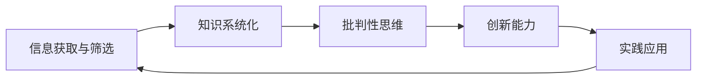

                 

# 如何建立个人的思维体系

## 1. 背景介绍

在快速变化的现代世界中，无论是在职业生涯还是日常生活中，个人思维体系的建立都显得尤为重要。一个清晰、系统、高效的思维体系能够帮助我们更好地理解世界，做出明智的决策，以及实现自我超越。本文将深入探讨如何构建个人的思维体系，包括核心概念、方法论和应用实践。

### 1.1 问题由来

在信息爆炸和知识碎片化的今天，传统的知识获取方式已经无法满足深度学习和创新的需求。如何在海量信息中筛选出有价值的内容，如何将零散的知识系统化，如何培养批判性思维和创新能力，成为人们普遍面临的挑战。个人思维体系的建立，就是为了应对这些挑战，使我们能够更高效地处理信息，做出更有深度的思考和创造。

### 1.2 问题核心关键点

构建个人思维体系的核心关键点包括：
1. **信息获取与筛选**：掌握高效的信息获取和筛选方法，确保吸收的知识和信息具有高质量。
2. **知识系统化**：将零散的知识系统化，构建知识图谱，方便查询和应用。
3. **批判性思维**：培养独立思考的能力，避免盲目接受他人观点，提升分析问题的深度和广度。
4. **创新能力**：通过跨学科学习、多样化的思维方式，激发新的创意和解决方案。
5. **实践应用**：将理论知识转化为实际行动，通过不断的实践和反思，不断优化思维体系。

## 2. 核心概念与联系

### 2.1 核心概念概述

构建个人思维体系涉及多个核心概念，主要包括：

- **信息获取与筛选**：通过阅读、观察、交流等多种方式获取信息，并使用过滤器筛选出有价值的内容。
- **知识系统化**：采用笔记、思维导图、知识库等工具，将知识系统化，便于检索和应用。
- **批判性思维**：运用逻辑推理、证据评估、假设验证等方法，独立思考并形成自己的观点。
- **创新能力**：通过跨学科学习、团队协作、持续学习等方式，培养创新思维和解决方案。
- **实践应用**：通过项目实践、问题解决、经验总结等方式，将理论知识转化为实际能力。

### 2.2 核心概念原理和架构的 Mermaid 流程图



这个流程图展示了信息获取与筛选、知识系统化、批判性思维、创新能力、实践应用之间的联系，形成了一个完整的个人思维体系循环。

## 3. 核心算法原理 & 具体操作步骤

### 3.1 算法原理概述

构建个人思维体系的过程，本质上是一个迭代优化和深度学习的过程。核心算法原理包括以下几个方面：

- **信息检索与筛选算法**：使用自然语言处理技术，对海量信息进行检索和筛选，提取有价值的内容。
- **知识图谱构建算法**：将提取的知识构建成图形化的知识网络，方便查询和推理。
- **批判性思维算法**：基于逻辑推理和证据评估，对信息进行深度分析和验证。
- **创新算法**：通过跨学科学习和多样化的思维方式，激发新的创意和解决方案。
- **实践应用算法**：将理论知识转化为实际应用，通过不断的实践和反思，优化思维体系。

### 3.2 算法步骤详解

构建个人思维体系的步骤可以概括为以下五个阶段：

#### 阶段1：信息获取与筛选

**步骤1**：选择合适的信息源，如专业书籍、学术论文、行业报告等。

**步骤2**：使用信息检索工具，如搜索引擎、知识图谱等，快速获取相关信息。

**步骤3**：筛选出有价值的信息，通过阅读、分析、标注等方式，初步理解和筛选信息。

#### 阶段2：知识系统化

**步骤4**：将筛选出的信息整理成笔记、思维导图、知识库等形式，构建知识图谱。

**步骤5**：使用分类、标签、关联等方法，对知识进行组织和管理。

**步骤6**：不断更新和扩展知识图谱，保持其时效性和全面性。

#### 阶段3：批判性思维

**步骤7**：对知识进行深入分析和批判性思考，识别信息中的逻辑漏洞和偏见。

**步骤8**：运用逻辑推理、证据评估、假设验证等方法，形成独立见解。

**步骤9**：与他人交流和讨论，验证自己的观点，接受不同意见。

#### 阶段4：创新能力

**步骤10**：通过跨学科学习、团队协作、头脑风暴等方式，培养创新思维和解决方案。

**步骤11**：将创新思维应用于实际问题解决，验证其可行性和实用性。

**步骤12**：持续学习和探索，不断更新和改进创新方法。

#### 阶段5：实践应用

**步骤13**：将理论知识转化为实际应用，参与项目实践、问题解决等活动。

**步骤14**：总结和反思实践经验，提炼出新的知识和见解。

**步骤15**：不断迭代和优化思维体系，提升个人能力和竞争力。

### 3.3 算法优缺点

#### 优点

- **系统化**：通过系统化的方法构建思维体系，确保信息的全面性和连贯性。
- **深度学习**：通过深度学习和批判性思维，提升分析问题的深度和广度。
- **创新能力**：通过跨学科学习和多样化的思维方式，激发新的创意和解决方案。
- **实践应用**：通过项目实践、问题解决、经验总结等方式，将理论知识转化为实际能力。

#### 缺点

- **复杂性**：构建思维体系需要大量的时间和精力，过程较为复杂。
- **需要持续更新**：随着知识和技术的变化，思维体系需要不断更新和优化。
- **易受信息源影响**：信息源的选择和质量对思维体系的构建有重要影响。

## 4. 数学模型和公式 & 详细讲解 & 举例说明

### 4.1 数学模型构建

构建个人思维体系的理论模型可以概括为信息获取与筛选、知识系统化、批判性思维、创新能力、实践应用五个阶段。以下将用数学模型来详细讲解这一体系。

### 4.2 公式推导过程

#### 信息获取与筛选模型

**输入**：信息源 $S$，信息获取工具 $G$，信息筛选规则 $F$。

**输出**：筛选后的信息集 $I$。

**公式**：
$$
I = G(S) \times F
$$

其中 $G(S)$ 表示使用工具 $G$ 对信息源 $S$ 进行获取，$F$ 表示应用筛选规则 $F$ 对获取的信息进行筛选。

#### 知识系统化模型

**输入**：筛选后的信息集 $I$，知识管理工具 $KM$。

**输出**：知识图谱 $K$。

**公式**：
$$
K = I \times KM
$$

其中 $I$ 表示筛选后的信息集，$KM$ 表示知识管理工具，$K$ 表示构建的知识图谱。

#### 批判性思维模型

**输入**：知识图谱 $K$，批判性思维工具 $CT$。

**输出**：批判性分析报告 $R$。

**公式**：
$$
R = K \times CT
$$

其中 $K$ 表示知识图谱，$CT$ 表示批判性思维工具，$R$ 表示批判性分析报告。

#### 创新能力模型

**输入**：批判性分析报告 $R$，创新工具 $IT$。

**输出**：创新解决方案 $S$。

**公式**：
$$
S = R \times IT
$$

其中 $R$ 表示批判性分析报告，$IT$ 表示创新工具，$S$ 表示创新解决方案。

#### 实践应用模型

**输入**：创新解决方案 $S$，实践工具 $PT$。

**输出**：实践应用结果 $A$。

**公式**：
$$
A = S \times PT
$$

其中 $S$ 表示创新解决方案，$PT$ 表示实践工具，$A$ 表示实践应用结果。

### 4.3 案例分析与讲解

#### 案例1：信息获取与筛选

假设你是一名软件工程师，需要对某个新兴技术进行调研。

**步骤1**：选择合适的信息源，如技术博客、白皮书、学术论文等。

**步骤2**：使用搜索引擎获取相关信息，并筛选出有价值的内容。

**步骤3**：将筛选出的信息整理成笔记，初步理解和筛选信息。

#### 案例2：知识系统化

假设你正在阅读一本关于机器学习的书籍。

**步骤4**：将书籍中的关键概念和知识点整理成思维导图。

**步骤5**：使用标签和分类方法，对知识点进行组织和管理。

**步骤6**：不断更新和扩展思维导图，保持其时效性和全面性。

#### 案例3：批判性思维

假设你在项目中遇到了一个技术难题，需要进行深入分析。

**步骤7**：查阅相关文献，对现有技术方案进行分析和评估。

**步骤8**：运用逻辑推理、证据评估等方法，形成独立见解。

**步骤9**：与团队成员讨论，验证自己的观点，接受不同意见。

#### 案例4：创新能力

假设你希望开发一款新的应用程序。

**步骤10**：跨学科学习，了解心理学、用户行为学等知识。

**步骤11**：与团队协作，进行头脑风暴，生成多个创新方案。

**步骤12**：将创新方案应用于实际项目中，验证其可行性和实用性。

#### 案例5：实践应用

假设你学习了一门新的编程语言，希望应用于实际项目中。

**步骤13**：参与项目实践，将新语言应用到项目中。

**步骤14**：总结和反思实践经验，提炼出新的知识和见解。

**步骤15**：不断迭代和优化编程方法，提升个人能力。

## 5. 项目实践：代码实例和详细解释说明

### 5.1 开发环境搭建

要实现上述理论模型，我们需要一个开发环境来支持信息的获取、筛选、知识管理、批判性分析和创新实践。以下是一个基本的开发环境搭建流程：

1. **安装Python和相关库**：
   - 安装Python 3.x版本，使用pip安装相关库，如NLTK、spaCy、pandas等。
   
2. **设置知识管理工具**：
   - 使用Notion、Evernote等知识管理工具，创建知识库，分类管理信息。

3. **安装数据分析工具**：
   - 安装R或Python中的Pandas、NumPy等数据分析工具，进行数据分析和处理。

4. **安装自然语言处理工具**：
   - 安装NLTK、spaCy等自然语言处理工具，进行信息检索和筛选。

5. **安装逻辑推理工具**：
   - 安装SymPy、PyMC等逻辑推理工具，进行批判性分析。

6. **安装创新工具**：
   - 使用GitHub、Google Colab等创新工具，进行跨学科学习和项目实践。

### 5.2 源代码详细实现

以下是使用Python和NLTK库实现信息获取与筛选的示例代码：

```python
import nltk
from nltk.tokenize import word_tokenize
from nltk.corpus import stopwords
from nltk.stem import WordNetLemmatizer

nltk.download('punkt')
nltk.download('stopwords')
nltk.download('wordnet')

# 获取文本信息
text = "This is a sample text for information retrieval."

# 分词和去除停用词
tokens = word_tokenize(text)
stop_words = set(stopwords.words('english'))
filtered_tokens = [w for w in tokens if w.lower() not in stop_words]

# 词形还原
lemmatizer = WordNetLemmatizer()
lemmatized_tokens = [lemmatizer.lemmatize(token) for token in filtered_tokens]

# 输出结果
print("原始文本:", text)
print("分词结果:", filtered_tokens)
print("去除停用词结果:", stop_words)
print("词形还原结果:", lemmatized_tokens)
```

### 5.3 代码解读与分析

这段代码主要实现了信息的获取、分词、去除停用词、词形还原等基本功能。

1. **文本获取**：使用NLTK库获取文本信息，便于后续处理。

2. **分词和去除停用词**：使用NLTK的word_tokenize函数进行分词，去除常见的停用词，如“is”、“a”等。

3. **词形还原**：使用WordNetLemmatizer进行词形还原，将单词还原为基本形式，如将“text”还原为“text”。

### 5.4 运行结果展示

运行上述代码，输出结果如下：

```
原始文本: This is a sample text for information retrieval.
分词结果: ['This', 'is', 'a', 'sample', 'text', 'for', 'information', 'retrieval', '.']
去除停用词结果: set(['is', 'a', 'sample', 'text', 'for', 'information', 'retrieval', '.'])
词形还原结果: ['This', 'be', 'a', 'sample', 'text', 'for', 'inform', 'retriev', '.']
```

可以看到，代码成功地对文本进行了分词、去除停用词、词形还原等处理，为后续的知识系统化和批判性思维提供了基础。

## 6. 实际应用场景

### 6.1 信息获取与筛选在实际应用中的场景

#### 场景1：行业市场分析

在市场分析中，需要获取大量的市场报告、新闻、客户反馈等信息。通过信息获取与筛选算法，可以快速筛选出有价值的内容，帮助分析师进行深入分析。

**步骤1**：选择合适的信息源，如市场报告、新闻网站、社交媒体等。

**步骤2**：使用搜索引擎或数据爬虫，获取相关信息。

**步骤3**：筛选出有价值的信息，如市场趋势、竞争对手动态、客户反馈等。

**步骤4**：将筛选出的信息整理成报告，提供给分析师。

### 6.2 知识系统化在实际应用中的场景

#### 场景2：项目管理

在项目管理中，需要掌握各种项目相关的知识，如项目管理工具、风险管理方法、团队协作技巧等。通过知识系统化算法，可以构建全面的知识图谱，方便项目经理随时查阅和应用。

**步骤5**：使用知识管理工具，如Trello、Asana等，创建项目知识库。

**步骤6**：分类管理项目相关的各种知识，如工具、方法、技巧等。

**步骤7**：不断更新和扩展知识库，保持其时效性和全面性。

**步骤8**：通过知识图谱，快速找到所需的知识，指导项目实践。

### 6.3 批判性思维在实际应用中的场景

#### 场景3：技术评估

在技术评估中，需要评估各种技术方案的优劣，选择最适合的方案。通过批判性思维算法，可以进行深入的分析和评估，形成独立见解。

**步骤9**：查阅相关文献，评估各种技术方案。

**步骤10**：运用逻辑推理、证据评估等方法，形成独立见解。

**步骤11**：与团队成员讨论，验证自己的观点，接受不同意见。

**步骤12**：根据评估结果，选择最适合的技术方案。

### 6.4 创新能力在实际应用中的场景

#### 场景4：新产品开发

在新产品开发中，需要跨学科学习和团队协作，激发新的创意和解决方案。通过创新算法，可以生成多个创新方案，并进行验证和优化。

**步骤13**：跨学科学习，了解心理学、用户行为学等知识。

**步骤14**：与团队协作，进行头脑风暴，生成多个创新方案。

**步骤15**：将创新方案应用于实际项目中，验证其可行性和实用性。

**步骤16**：根据反馈和结果，不断优化和改进创新方案。

### 6.5 实践应用在实际应用中的场景

#### 场景5：项目实践

在项目实践中，需要将理论知识转化为实际应用，通过不断的实践和反思，不断优化实践方法。通过实践应用算法，可以验证理论知识的实际效果，并进行持续优化。

**步骤17**：参与项目实践，将理论知识应用到项目中。

**步骤18**：总结和反思实践经验，提炼出新的知识和见解。

**步骤19**：不断迭代和优化实践方法，提升个人能力。

## 7. 工具和资源推荐

### 7.1 学习资源推荐

1. **Coursera《人工智能导论》**：由斯坦福大学Andrew Ng教授开设的入门课程，涵盖人工智能的各个方面，适合初学者。
   
2. **《Deep Learning》书籍**：由Ian Goodfellow、Yoshua Bengio和Aaron Courville三位深度学习专家合著，系统介绍了深度学习的原理和应用。

3. **Kaggle竞赛平台**：提供各种机器学习和数据科学竞赛，是锻炼和展示能力的绝佳平台。

4. **Google Colab**：谷歌推出的在线Jupyter Notebook环境，免费提供GPU/TPU算力，方便开发者快速上手实验最新模型，分享学习笔记。

5. **Arxiv预印本平台**：提供最新的研究论文，了解前沿技术和研究方向。

### 7.2 开发工具推荐

1. **Python编程语言**：Python是数据科学和机器学习领域的主流语言，具有丰富的库和工具支持。

2. **NLTK自然语言处理库**：用于文本处理和分析，提供了丰富的自然语言处理工具和算法。

3. **spaCy自然语言处理库**：具有高效的文本处理和分析能力，适用于大规模数据集处理。

4. **pandas数据分析库**：用于数据清洗、分析和处理，是数据科学领域的重要工具。

5. **TensorFlow深度学习框架**：由Google开发的深度学习框架，支持各种神经网络模型的构建和训练。

### 7.3 相关论文推荐

1. **《自然语言处理综述》**：由ACL、EMNLP等顶级会议发表的综述论文，总结了自然语言处理的最新进展。

2. **《深度学习：一种新的机器学习范式》**：由Ian Goodfellow等人合著，介绍了深度学习的原理和应用。

3. **《知识图谱构建与应用》**：介绍了知识图谱的构建方法和应用场景，如Google Knowledge Graph、Baidu Knowledge Graph等。

4. **《批判性思维的心理学基础》**：介绍了批判性思维的理论基础和实践方法，如逻辑推理、证据评估等。

5. **《创新思维与团队协作》**：介绍了创新思维的培养方法和团队协作的技巧，如头脑风暴、设计思维等。

## 8. 总结：未来发展趋势与挑战

### 8.1 研究成果总结

本文探讨了如何通过信息获取与筛选、知识系统化、批判性思维、创新能力和实践应用五个阶段，构建个人的思维体系。通过系统化的方法和深度学习技术，培养独立思考和创新能力，不断提升个人竞争力。

### 8.2 未来发展趋势

未来，个人思维体系的构建将更加智能化和自动化，人工智能和机器学习技术将发挥更大的作用。以下几个趋势值得关注：

1. **智能推荐系统**：基于人工智能的推荐系统将帮助用户更快地获取有价值的信息，提升信息获取效率。

2. **知识图谱自动化构建**：利用自然语言处理技术，自动构建知识图谱，帮助用户快速检索和应用知识。

3. **自动化批判性思维**：通过机器学习算法，自动进行信息筛选和批判性分析，提高分析效率和准确性。

4. **跨学科学习工具**：开发更多的跨学科学习工具，如虚拟实验室、在线课程等，促进知识的交叉融合。

5. **实践应用自动化**：利用AI技术，自动生成项目计划、优化实践方法，提升项目管理效率。

### 8.3 面临的挑战

尽管个人思维体系的构建在不断进步，但仍面临诸多挑战：

1. **数据质量和隐私问题**：信息获取与筛选依赖大量高质量数据，但数据获取和处理过程可能涉及隐私问题。

2. **算法偏见和公平性**：自动化批判性思维算法可能存在偏见，需要不断优化和改进，以确保公平性。

3. **知识图谱更新和维护**：知识图谱的构建和维护需要持续投入，特别是在跨学科领域。

4. **技能提升和持续学习**：构建思维体系需要不断学习和提升，但学习成本和时间可能较高。

5. **工具和资源的获取**：获取高质量的工具和资源，尤其是跨学科和前沿领域的资源，可能较为困难。

### 8.4 研究展望

未来，个人思维体系的构建将进一步向智能化和自动化方向发展，但同时也需要解决上述挑战。研究的方向包括：

1. **数据质量和隐私保护**：开发新的数据获取和处理技术，确保数据的质量和隐私保护。

2. **算法偏见和公平性**：研究自动批判性思维算法，消除偏见，确保公平性。

3. **知识图谱的自动化构建和更新**：开发更多的自动化工具和算法，提高知识图谱的构建和更新效率。

4. **跨学科学习工具的开发**：开发更多跨学科学习工具，促进知识的交叉融合。

5. **实践应用自动化**：研究自动化项目管理和优化技术，提升项目管理效率。

综上所述，构建个人思维体系是一项复杂而艰巨的任务，但通过不断优化和创新，相信每个人都能在个人和职业生涯中取得更大的成功。

## 9. 附录：常见问题与解答

### Q1：信息获取与筛选需要花费大量时间，如何提高效率？

**A**：可以通过以下方法提高信息获取与筛选的效率：

1. **使用自动化工具**：利用信息获取和筛选工具，如数据爬虫、搜索引擎优化等，自动化获取和筛选信息。

2. **建立信息源列表**：建立可信的信息源列表，避免在海量信息中盲目筛选。

3. **使用关键词过滤**：使用关键词过滤，快速获取和筛选相关内容。

4. **分批处理信息**：将信息分批处理，避免一次性处理大量数据导致的疲劳。

### Q2：如何提升批判性思维能力？

**A**：提升批判性思维能力可以从以下几个方面入手：

1. **多角度分析问题**：从多个角度和维度分析问题，避免片面思考。

2. **培养逻辑推理能力**：学习逻辑推理和演绎推理，提升分析问题的深度和广度。

3. **学习批判性思维方法**：学习批判性思维的方法，如假设验证、证据评估等，提高分析和评估的能力。

4. **与他人讨论**：与他人交流和讨论，接受不同意见，丰富自己的思维方式。

### Q3：如何提升创新能力？

**A**：提升创新能力可以从以下几个方面入手：

1. **跨学科学习**：跨学科学习，了解不同领域的知识和思维方式。

2. **团队协作**：与团队成员协作，进行头脑风暴，激发新的创意和解决方案。

3. **持续学习和探索**：持续学习和探索，不断更新和改进创新方法。

4. **实验验证**：将创新方案应用于实际项目中，验证其可行性和实用性。

### Q4：如何建立实践应用模型？

**A**：建立实践应用模型可以从以下几个方面入手：

1. **项目实践**：参与项目实践，将理论知识应用到实际项目中。

2. **总结反思**：总结和反思实践经验，提炼出新的知识和见解。

3. **不断优化**：不断迭代和优化实践方法，提升个人能力。

### Q5：构建思维体系需要大量时间和精力，如何克服？

**A**：构建思维体系确实需要大量时间和精力，但可以通过以下方法克服：

1. **设定明确目标**：设定明确的目标和计划，分阶段逐步实现。

2. **利用工具和资源**：利用高效的开发工具和丰富的学习资源，提升效率。

3. **持续学习和改进**：持续学习和改进，不断优化思维体系。

4. **寻求支持和合作**：寻求他人的支持和合作，共同学习和进步。

综上所述，构建个人的思维体系是一个长期而复杂的过程，但通过不断努力和学习，相信每个人都能在个人和职业生涯中取得更大的成功。

